# Informe de Trabajo Final

  

| Campo | Información |
| --- | --- |
| Universidad | Universidad Peruana de Ciencias Aplicadas |
| Carrera | Ingeniería de Software |
| Ciclo | 202620 |
| Curso | 1ASI0728 — Arquitecturas de Software Emergentes |
| Sección | 9056 |
| Profesor | Enrique Alejandro Valdivia Verde |
| Startup | Integra Labs |
| Producto | Quadrapp |
| Mes y año | Setiembre, 2026 |

**Integrantes**

| Nombres y apellidos | Código de estudiante |
| --- | --- |
| Becerra Tejeda, Alessandra Nicole | u202318947 |
| Bejarano Martinez, Alvaro Leandro | Por completar |
| Melgarejo Gomez, Marcia Victoria | Por completar |
| Nanfuñay Liza, Pedro Jesus | u202215462 |
| Sulca Sanchez, Piero Angel | u202423711 |

---

# Registro de Versiones del Informe

| Versión | Fecha | Autor | Descripción de modificación |
| --- | --- | --- | --- |
| 1.0 | 2026-09-15 | Integra Labs | Estructura inicial del informe para AV1. |
| 1.1 | 2026-09-19 | Integra Labs  | Se añadieron los capítulos I, II, III y IV |

---

# Project Report Collaboration Insights

Repositorio del informe: [quadrapp-project-report](https://github.com/1ASI0728-2620-9056-Quadrapp/quadrapp-project-report).

El equipo elaborará el informe colaborativamente con GitFlow y Conventional Commits. Cada integrante registrará sus aportes con su propia cuenta y otro integrante revisará sus cambios antes de integrarlos en `develop`.

Las evidencias de colaboración se actualizarán en cada entrega y serán coherentes con el Registro de Versiones del Informe.

| Entrega | Actividades y aportes de los integrantes | Evidencias de colaboración y commits |
| --- | --- | --- |
| AV1 | Por completar | Por completar |

---

# Contenido

- [Registro de Versiones del Informe](#registro-de-versiones-del-informe)
- [Project Report Collaboration Insights](#project-report-collaboration-insights)
- [Student Outcome](#student-outcome)
- [Capítulo I: Introducción](#capítulo-i-introducción)
  - [1.1. Startup Profile](#11-startup-profile)
    - [1.1.1. Descripción de la Startup](#111-descripción-de-la-startup)
    - [1.1.2. Perfiles de integrantes del equipo](#112-perfiles-de-integrantes-del-equipo)
  - [1.2. Solution Profile](#12-solution-profile)
    - [1.2.1. Antecedentes y problemática](#121-antecedentes-y-problemática)
    - [1.2.2. Lean UX Process](#122-lean-ux-process)
      - [1.2.2.1. Lean UX Problem Statements](#1221-lean-ux-problem-statements)
      - [1.2.2.2. Lean UX Assumptions](#1222-lean-ux-assumptions)
      - [1.2.2.3. Lean UX Hypothesis Statements](#1223-lean-ux-hypothesis-statements)
      - [1.2.2.4. Lean UX Canvas](#1224-lean-ux-canvas)
  - [1.3. Segmentos objetivo](#13-segmentos-objetivo)
- [Capítulo II: Requirements Elicitation & Analysis](#capítulo-ii-requirements-elicitation--analysis)
  - [2.1. Competidores](#21-competidores)
    - [2.1.1. Análisis competitivo](#211-análisis-competitivo)
    - [2.1.2. Estrategias y tácticas frente a competidores](#212-estrategias-y-tácticas-frente-a-competidores)
  - [2.2. Entrevistas](#22-entrevistas)
    - [2.2.1. Diseño de entrevistas](#221-diseño-de-entrevistas)
    - [2.2.2. Registro de entrevistas](#222-registro-de-entrevistas)
    - [2.2.3. Análisis de entrevistas](#223-análisis-de-entrevistas)
  - [2.3. Needfinding](#23-needfinding)
    - [2.3.1. User Personas](#231-user-personas)
    - [2.3.2. User Task Matrix](#232-user-task-matrix)
    - [2.3.3. Empathy Mapping](#233-empathy-mapping)
    - [2.3.4. As-is Scenario Mapping](#234-as-is-scenario-mapping)
  - [2.4. Ubiquitous Language](#24-ubiquitous-language)
- [Capítulo III: Requirements Specification](#capítulo-iii-requirements-specification)
  - [3.1. To-Be Scenario Mapping](#31-to-be-scenario-mapping)
  - [3.2. User Stories](#32-user-stories)
  - [3.3. Impact Mapping](#33-impact-mapping)
  - [3.4. Product Backlog](#34-product-backlog)
- [Capítulo IV: Strategic-Level Software Design](#capítulo-iv-strategic-level-software-design)
  - [4.1. Strategic-Level Attribute-Driven Design](#41-strategic-level-attribute-driven-design)
    - [4.1.1. Design Purpose](#411-design-purpose)
    - [4.1.2. Attribute-Driven Design Inputs](#412-attribute-driven-design-inputs)
      - [4.1.2.1. Primary Functionality (Primary User Stories)](#4121-primary-functionality-primary-user-stories)
      - [4.1.2.2. Quality Attribute Scenarios](#4122-quality-attribute-scenarios)
      - [4.1.2.3. Constraints](#4123-constraints)
    - [4.1.3. Architectural Drivers Backlog](#413-architectural-drivers-backlog)
    - [4.1.4. Architectural Design Decisions](#414-architectural-design-decisions)
    - [4.1.5. Quality Attribute Scenario Refinements](#415-quality-attribute-scenario-refinements)
  - [4.2. Strategic-Level Domain-Driven Design](#42-strategic-level-domain-driven-design)
    - [4.2.1. EventStorming](#421-eventstorming)
    - [4.2.2. Candidate Context Discovery](#422-candidate-context-discovery)
    - [4.2.3. Domain Message Flows Modeling](#423-domain-message-flows-modeling)
    - [4.2.4. Bounded Context Canvases](#424-bounded-context-canvases)
    - [4.2.5. Context Mapping](#425-context-mapping)
  - [4.3. Software Architecture](#43-software-architecture)
    - [4.3.1. Software Architecture System Landscape Diagram](#431-software-architecture-system-landscape-diagram)
    - [4.3.2. Software Architecture Context Level Diagrams](#432-software-architecture-context-level-diagrams)
    - [4.3.3. Software Architecture Container Level Diagrams](#433-software-architecture-container-level-diagrams)
    - [4.3.4. Software Architecture Deployment Diagrams](#434-software-architecture-deployment-diagrams)
- [Conclusiones](#conclusiones)
  - [Conclusiones y recomendaciones](#conclusiones-y-recomendaciones)
  - [Video About-the-Team](#video-about-the-team)
- [Bibliografía](#bibliografía)
- [Anexos](#anexos)
  - [Videos de Exposiciones](#videos-de-exposiciones)

---

# Student Outcome

El curso contribuye al cumplimiento del Student Outcome ABET:
ABET – EAC - Student Outcome 3

Criterio: Capacidad de comunicarse efectivamente con un rango de audiencias.
En el siguiente cuadro se describe las acciones realizadas y enunciados de
conclusiones por parte del grupo, que permiten sustentar el haber alcanzado el logro
del ABET – EAC - Student Outcome 3.

<table>
  <thead>
    <tr>
      <th>Criterio específico</th>
      <th>Acciones realizadas</th>
      <th>Conclusiones</th>
    </tr>
  </thead>
  <tbody>
    <tr>
      <td>Comunica oralmente sus ideas y/o resultados con objetividad a público de diferentes especialidades y niveles jerarquicos, en el marco del desarrollo de un proyecto en ingeniería.</td>
      <td>
        

          <strong>Becerra Tejeda, Alessandra Nicole</strong> 
          AV1: Logré sustentar los principales aspectos del proyecto de forma clara, ordenada y objetiva, utilizando las User Stories, el Product Backlog y la arquitectura como soporte para transmitir las ideas y resultados del proyecto.
        

        

          <strong>Bejarano Martinez, Alvaro Leandro</strong> 
          AV1: Logré comunicar oralmente de manera clara y objetiva los resultados obtenidos en el análisis del usuario y del dominio, presentando artefactos como Segmento Objetivo, User Persona, User Task Matrix, Empathy Mapping, Event Storming, Candidate Context Discovery y Domain Message Flows Modeling, de modo que mis compañeros pudieran comprender tanto las necesidades de los usuarios como la estructura del dominio y sus principales interacciones.
        

        

          <strong>Melgarejo Gomez, Marcia Victoria</strong> 
          AV1: Por completar.
        

        

          <strong>Nanfuñay Liza, Pedro Jesus</strong> 
          AV1: Logré comunicarme eficazmente con mis compañeros para delimitar el alcance del proyecto, exponer las características de la solución, aplicando buenas prácticas en artefactos como Lean UX Process, Análisis Competitivo y Bounded Context Canvases, lo que me permitió dar a conocer a fondos la arquitectura que seguirá nuestra solución.
        

        

          <strong>Sulca Sanchez, Piero Angel</strong> 
          AV1: Por completar.
        

      </td>
      <td>Por completar.</td>
    </tr>
    <tr>
      <td>Comunica en forma escrita ideas y/o resultados con objetividad a público de diferentes especialidades y niveles jerarquicos, en el marco del desarrollo de un proyecto en ingeniería.</td>
      <td>
        

          <strong>Becerra Tejeda, Alessandra Nicole</strong> 
          AV1: Redacté y organicé parte de la información del proyecto de forma clara, coherente y objetiva, contribuyendo a la documentación de los requerimientos, la planificación del trabajo y la definición de la solución propuesta.
        

        

          <strong>Bejarano Martinez, Alvaro Leandro</strong> 
          AV1: Logré comunicar oralmente de manera clara y objetiva los resultados obtenidos en el análisis del usuario y del dominio, presentando artefactos como Segmento Objetivo, User Persona, User Task Matrix, Empathy Mapping, Event Storming, Candidate Context Discovery y Domain Message Flows Modeling, de modo que mis compañeros pudieran comprender tanto las necesidades de los usuarios como la estructura del dominio y sus principales interacciones.
        

        

          <strong>Melgarejo Gomez, Marcia Victoria</strong> 
          AV1: Por completar.
        

        

          <strong>Nanfuñay Liza, Pedro Jesus</strong> 
          AV1: Logré redactar adecuadamente los artefactos asignados de forma coherente y clara, de manera que permita comprender a diferentes tipos de público desde el valor que ofrece nuestra solución hasta la arquitectura del proyecto.
        

        

          <strong>Sulca Sanchez, Piero Angel</strong> 
          AV1: Por completar.
        

      </td>
      <td>Por completar.</td>
    </tr>
  </tbody>
</table>

---

# Capítulo I: Introducción

## 1.1. Startup Profile

### 1.1.1. Descripción de la Startup

**Nombre de la Startup:** Integra Labs

En Integra Labs desarrollamos soluciones tecnológicas que conectan la infraestructura física de las instituciones educativas con herramientas digitales de gestión. Nuestro primer producto, **Quadrapp**, busca reducir la incertidumbre que experimentan los conductores al buscar estacionamiento en un campus universitario. Mediante sensores IoT instalados en los espacios y accesos del estacionamiento, la solución registra su nivel de ocupación y emplea estos datos para mostrar la disponibilidad actual y estimar las condiciones que encontrará cada conductor al llegar. Quadrapp se ofrece bajo un modelo B2B SaaS: la institución educativa contrata el servicio, su comunidad accede a la información desde una aplicación móvil y el personal responsable supervisa la operación mediante una consola web.

**Colaboraciones Estratégicas**

Para desarrollar y operar Quadrapp, establecemos alianzas con instituciones educativas y proveedores tecnológicos. Las universidades de Lima Metropolitana participan como clientes y colaboradoras en la validación de la solución, ya que facilitan entornos de prueba para instalar los sensores y contrastar la información del sistema con mediciones realizadas en campo. Asimismo, los proveedores de hardware IoT suministran los sensores y brindan soporte durante su implementación. Esta colaboración se complementa con servicios de nube, mapas y mensajería, necesarios para procesar la información, calcular el tiempo estimado de llegada y verificar los correos institucionales. La integración flexible de estos servicios permite sustituir proveedores sin comprometer la continuidad del producto.

**Innovación y Tecnología**

El valor diferencial de Quadrapp no radica únicamente en identificar espacios libres, sino en anticipar su disponibilidad. Los sensores instalados en cada espacio y en los accesos transmiten información mediante un gateway MQTT. A partir de estos datos, un modelo predictivo estima la ocupación para los siguientes 15, 30, 45 y 60 minutos, considerando también el comportamiento histórico, el calendario académico y los eventos del campus. La predicción se combina con el tiempo estimado de llegada del usuario para comunicarle la probabilidad de encontrar un espacio y ofrecerle una recomendación comprensible. Además, la solución prescinde de cámaras y del reconocimiento de placas: el tiempo de llegada se calcula en el dispositivo y el servidor recibe únicamente la cantidad estimada de minutos, no la ubicación del conductor.

**Visión**

> Aspiramos a que, en los próximos diez años, las comunidades universitarias de Lima Metropolitana puedan anticipar las condiciones de estacionamiento antes de dirigirse al campus y reduzcan así la incertidumbre de sus desplazamientos. A partir de esta experiencia, buscamos extender la solución a otras ciudades de la región.

**Misión**

> En Integra Labs transformamos los datos de ocupación de los estacionamientos universitarios en información oportuna y pronósticos basados en datos, para que los conductores tomen mejores decisiones antes de dirigirse al campus y el personal responsable gestione sus instalaciones con mayor eficiencia. Desarrollamos esta labor con resultados medibles, recopilando solo los datos personales indispensables y manteniendo una solución independiente de proveedores específicos de hardware.

### 1.1.2. Perfiles de integrantes del equipo

<table>
  <thead>
    <tr>
      <th>Foto</th>
      <th>Nombre completo</th>
      <th>Código</th>
      <th>Carrera</th>
      <th>Habilidades técnicas</th>
    </tr>
  </thead>
  <tbody>
    <tr>
      <td></td>
      <td>Becerra Tejeda, Alessandra Nicole</td>
      <td>u202318947</td>
      <td>Ingeniería de Software</td>
      <td>Soy estudiante de 8vo ciclo de Ingeniería de Software, interesada en el desarrollo de soluciones tecnológicas y en seguir aprendiendo. Me considero una persona responsable, adaptable y comprometida, con facilidad para trabajar en equipo, organizar tareas y asumir nuevos retos.
</td>
    </tr>
    <tr>
      <td>Foto por completar</td>
      <td>Bejarano Martinez, Alvaro Leandro</td>
      <td>Por completar</td>
      <td>Ingeniería de Software</td>
      <td>Descripción por completar.</td>
    </tr>
    <tr>
      <td>Foto por completar</td>
      <td>Melgarejo Gomez, Marcia Victoria</td>
      <td>Por completar</td>
      <td>Ingeniería de Software</td>
      <td>Descripción por completar.</td>
    </tr>
    <tr>
      <td></td>
      <td>Nanfuñay Liza, Pedro Jesus</td>
      <td>u202215462</td>
      <td>Ingeniería de Software</td>
      <td>Mi nombre es Pedro Jesús Nanfuñay Liza, tengo 21 años y actualmente estudio la carrera de Ingeniería de Software. Me considero una persona creativa, responsable, perseverante y siempre dispuesto a trabajar en equipo. Espero aportar de manera positiva al equipo y cumplir con los objetivos establecidos en el proyecto.</td>
    </tr>
    <tr>
      <td></td>
      <td>Sulca Sanchez, Piero Angel</td>
      <td>u202423711</td>
      <td>Ingeniería de Software</td>
      <td>Curso la carrera de Ingeniería de Software y tengo experiencia en desarrollo web trabajando con equipos pequeños. Me apasiona el Front End, sobre todo cuando hay espacio para el diseño creativo: interfaces 3D, animaciones, productos que se ven y se sienten distintos. En el equipo puedo aportar en levantamiento de requerimientos, diseño de interfaces, desarrollo web con React y TypeScript, diseño de bases de datos. En el equipo aporto organización y colaboración.</td>
    </tr>
  </tbody>
</table>

## 1.2. Solution Profile

### 1.2.1. Antecedentes y problemática

### Antecedentes

La gestión de los estacionamientos constituye un desafío para los campus universitarios debido a la limitada disponibilidad de espacios y a la variación de la demanda durante la jornada académica. Paudel et al. (2024) señalan que la demanda de estacionamiento en los campus universitarios representa un problema debido al crecimiento de la población universitaria y a las restricciones existentes para ampliar la capacidad de estacionamiento. Asimismo, los autores destacan la necesidad de comprender y predecir el comportamiento de la demanda para aprovechar de manera más eficiente los recursos disponibles.

Esta problemática se relaciona también con el tiempo que los usuarios pueden invertir en la búsqueda de un espacio disponible. Mohandes et al. (2019) identificaron que, en un campus universitario, los usuarios pueden dedicar una cantidad considerable de tiempo a buscar un espacio adecuado. Ante esta situación, los autores plantearon un sistema inteligente que utiliza información actualizada sobre los espacios disponibles para orientar a los usuarios hacia alternativas de estacionamiento.

En este contexto, los sistemas inteligentes de estacionamiento han sido estudiados como una alternativa para mejorar la gestión de estos espacios. Channamallu et al. (2025) señalan que los campus universitarios presentan una combinación de oferta limitada, demanda fluctuante y diferentes necesidades de los usuarios, condiciones que pueden generar congestión, incremento del tiempo de búsqueda e insatisfacción. Su investigación analiza una aplicación de estacionamiento inteligente orientada a mejorar la eficiencia del estacionamiento y la experiencia de los usuarios en un entorno universitario.

Además de conocer la disponibilidad actual, el uso de técnicas de aprendizaje automático permite estimar la demanda y ocupación futura de los estacionamientos. Paudel et al. (2024) desarrollaron modelos de aprendizaje automático para predecir la demanda horaria de estacionamientos en diferentes zonas de un campus universitario utilizando, entre otros factores, información relacionada con los horarios de clases y la utilización de los edificios. Los resultados evidenciaron la viabilidad de utilizar modelos de aprendizaje automático para anticipar patrones de demanda en estacionamientos universitarios.

De manera similar, investigaciones sobre predicción de ocupación en estacionamientos universitarios han evaluado diferentes modelos de aprendizaje automático. Channamallu et al. (2023) analizaron modelos como Random Forest, Decision Tree, Linear Regression y Support Vector Regression para predecir la ocupación de un estacionamiento universitario, encontrando diferencias en su capacidad predictiva. Los autores señalan que una predicción precisa de la ocupación puede contribuir a optimizar la utilización de los espacios, reducir la congestión y mejorar la gestión de los estacionamientos en campus universitarios.

Asimismo, investigaciones recientes continúan incorporando inteligencia artificial y sistemas de monitoreo para mejorar la disponibilidad de información sobre estacionamientos universitarios. Deno et al. (2026) desarrollaron una infraestructura inteligente para campus universitarios que combina detección de vehículos, comunicación IoT y mecanismos de predicción, permitiendo proporcionar información sobre la disponibilidad de espacios a estudiantes, docentes y visitantes.

En conjunto, los antecedentes evidencian que la gestión inteligente de estacionamientos universitarios puede abordarse mediante el monitoreo de la ocupación, el análisis de información histórica y el uso de modelos de aprendizaje automático para anticipar patrones de demanda u ocupación. En este contexto, Quadrapp propone una solución orientada específicamente a los estacionamientos universitarios, mediante una aplicación que permita consultar la disponibilidad de espacios y utilizar técnicas de inteligencia artificial para predecir su disponibilidad en determinados períodos. De esta manera, la información generada por el sistema busca facilitar la planificación del desplazamiento de los usuarios y contribuir a una gestión más eficiente de los espacios de estacionamiento disponibles.

### Problemática (5Ws y 2Hs)

#### What (Qué)

**¿Cuál es el problema?**

La dificultad para conocer y anticipar la disponibilidad de espacios de estacionamiento dentro de los campus universitarios. La oferta limitada y la variación de la demanda durante la jornada académica pueden generar dificultades para encontrar espacios disponibles, incrementando el tiempo de búsqueda y la circulación de vehículos dentro del campus (Paudel et al., 2024; Channamallu et al., 2025).

#### When (Cuándo)

**¿Cuándo se presenta el problema?**

* Durante los horarios de mayor ingreso de estudiantes, docentes y personal administrativo.
* Al inicio y finalización de las jornadas académicas.
* Durante los cambios entre bloques de clases.
* En períodos en los que se concentra una mayor cantidad de vehículos en el campus.
* Durante actividades universitarias que pueden incrementar temporalmente la demanda de estacionamientos.

#### Who (Quién)

**¿Quiénes están involucrados?**

* Conductores de la comunidad educativa que utilizan los estacionamientos universitarios.
* Personal encargado de administrar los estacionamientos universitarios.

**¿A quién le sucede el problema?**

A los conductores de la comunidad educativa que necesitan encontrar un espacio disponible dentro del campus y no cuentan con información suficiente sobre la ocupación actual o prevista.

**¿Quién utilizará el producto?**

* Conductores de la comunidad educativa.
* Administradores de estacionamientos universitarios.

#### Why (Por qué)

**¿Cuál es la causa del problema?**

* Disponibilidad limitada de espacios de estacionamiento frente a una demanda variable.
* Variación de la demanda según los horarios y actividades académicas.
* Falta de información anticipada sobre la disponibilidad de espacios.
* Ausencia de mecanismos que permitan analizar patrones históricos de ocupación.
* Limitado uso de herramientas de inteligencia artificial para predecir la disponibilidad futura de estacionamientos.

La literatura evidencia que los patrones de demanda de estacionamiento universitario pueden analizarse mediante información histórica y variables relacionadas con las actividades del campus, como los horarios de clases y la utilización de los edificios (Paudel et al., 2024).

#### How (Cómo)

**¿En qué condiciones los usuarios utilizarán nuestro producto?**

* Cuando necesiten desplazarse hacia el campus universitario utilizando un vehículo.
* Antes de iniciar su jornada académica o laboral.
* Durante períodos de alta demanda de estacionamientos.
* Cuando deseen conocer la disponibilidad de espacios antes de llegar al campus.
* Cuando necesiten planificar su desplazamiento considerando la disponibilidad prevista de estacionamientos.

**¿Cómo funcionará la solución?**

* El sistema recopilará información relacionada con la ocupación y disponibilidad de los estacionamientos.
* Los datos históricos serán procesados para identificar patrones de ocupación.
* Se empleará un modelo de inteligencia artificial para realizar predicciones sobre la disponibilidad de espacios.
* Quadrapp presentará al usuario información sobre la disponibilidad actual y la disponibilidad prevista para determinados horarios.
* Los usuarios podrán utilizar esta información para planificar su llegada y desplazamiento dentro del campus.

**¿Cómo accederán los usuarios al producto?**

* Mediante una aplicación móvil.
* A través de una interfaz que permita consultar la disponibilidad de los estacionamientos.
* Mediante información de disponibilidad prevista generada a partir del modelo de inteligencia artificial.

#### How much (Cuánto)

**¿Cuánto impacta el problema?**

El problema puede manifestarse en:

* Incremento del tiempo destinado a buscar espacios disponibles.
* Mayor circulación de vehículos dentro de las zonas de estacionamiento.
* Posible congestión durante los períodos de mayor demanda.
* Dificultad de los usuarios para planificar anticipadamente su llegada al campus.
* Menor aprovechamiento de la información histórica disponible para anticipar períodos de mayor o menor demanda.

La literatura sobre estacionamientos universitarios relaciona la falta de disponibilidad y la dificultad para encontrar espacios con problemas como mayor tiempo de búsqueda, congestión e insatisfacción de los usuarios (Channamallu et al., 2025; Mohandes et al., 2019).

### 1.2.2. Lean UX Process

#### 1.2.2.1. Lean UX Problem Statements

Hemos observado que los conductores que se trasladan a universidades y centros educativos enfrentan dificultades para encontrar estacionamiento, especialmente durante horarios de alta concurrencia como el inicio y término de clases. Aunque un estacionamiento pueda mostrar espacios disponibles en un momento determinado, esta información no garantiza que dichos espacios continúen libres cuando el conductor llegue, generando incertidumbre, pérdida de tiempo, recorridos innecesarios y congestión dentro y alrededor del campus.

Por otro lado, las universidades y administradores de estacionamientos necesitan gestionar de manera eficiente la ocupación, el ingreso y la salida de vehículos, así como aprovechar la información generada diariamente para comprender los patrones de movilidad de su comunidad. Los sistemas tradicionales suelen concentrarse en mostrar la disponibilidad actual o controlar el acceso, pero no aprovechan suficientemente los datos históricos y operativos para anticipar cómo cambiará la ocupación en los siguientes minutos.

Esta situación evidencia una brecha entre conocer cuántos espacios están disponibles actualmente y poder estimar qué probabilidad existe de encontrar uno al momento de llegar. Factores como el tiempo estimado de llegada, vehículos que se aproximan al campus, reservas existentes, registros históricos de ocupación, fecha, hora y horarios académicos pueden aportar información relevante para reducir esta incertidumbre.

Frente a esta problemática, Quadrapp busca atender inicialmente a conductores de la comunidad educativa y administradores de estacionamientos universitarios, mediante una plataforma que combine información en tiempo real con datos históricos y académicos para estimar la disponibilidad futura. De esta manera, se busca ayudar a los conductores a tomar mejores decisiones antes de llegar al campus y proporcionar a los administradores información útil para comprender y gestionar la demanda de sus estacionamientos.

#### 1.2.2.2. Lean UX Assumptions

**Business Assumptions:**
1. Los conductores de la comunidad educativa necesitan conocer no solo la disponibilidad actual de estacionamientos, sino también la probabilidad de encontrar un espacio disponible al momento estimado de su llegada al campus.

2. Las necesidades de los conductores serán atendidas mediante una aplicación móvil que combine datos de ocupación obtenidos mediante IoT, información histórica, horarios académicos y tiempo estimado de llegada para generar predicciones de disponibilidad futura.

3. Nuestros clientes iniciales serán universidades y centros educativos que administran estacionamientos propios y buscan reducir la congestión, optimizar el uso de sus espacios y comprender mejor los patrones de movilidad dentro del campus.

4. El principal valor que los conductores esperan de Quadrapp es reducir la incertidumbre sobre si encontrarán un espacio disponible cuando lleguen, permitiéndoles tomar mejores decisiones durante su desplazamiento.

5. Los administradores obtendrán valor mediante un dashboard que centralice información sobre ocupación actual, comportamiento histórico, períodos de mayor demanda y predicciones de disponibilidad.

6. Obtendremos nuestra base inicial de clientes mediante alianzas con universidades y centros educativos, demostraciones de la solución y pilotos en estacionamientos universitarios.

7. Generaremos ingresos principalmente mediante un modelo de suscripción o licenciamiento institucional para las universidades que utilicen la plataforma y su infraestructura de monitoreo.

8. Nuestra principal competencia serán plataformas de estacionamiento y soluciones de smart parking orientadas principalmente a mostrar disponibilidad actual o gestionar la ocupación, mientras Quadrapp buscará diferenciarse mediante la predicción de disponibilidad al momento estimado de llegada.

9. Nuestro mayor riesgo es que la predicción no alcance un nivel de precisión suficiente para generar confianza debido a información incompleta, fallas en sensores o patrones de ocupación difíciles de anticipar.

10. ¿Cuáles son las suposiciones que, si se demuestran falsas, harán que el proyecto fracase?
  - Los conductores no encontrarán útil la predicción si existen diferencias frecuentes con la disponibilidad real.
  - Las universidades podrían no percibir suficiente valor en la implementación de infraestructura IoT.
  - Los datos históricos podrían ser insuficientes para identificar patrones de demanda útiles.
  - Las fallas de sensores o conectividad podrían afectar la información de ocupación.
  - Los horarios académicos y datos históricos podrían no tener suficiente relación con los cambios de demanda como para mejorar las predicciones.

**Business Outcomes:**
1. Lograr que al menos una institución educativa implemente un piloto de Quadrapp durante el primer año.
2. Reducir en al menos un 20 % el tiempo promedio dedicado por los conductores a buscar estacionamiento dentro del campus.
3. Alcanzar una precisión mínima del 80 % en las estimaciones de disponibilidad futura una vez que exista suficiente información histórica.
4. Conseguir que al menos el 60 % de los conductores activos consulte la predicción antes de llegar al campus durante períodos de alta demanda.4.
5. Mantener una disponibilidad de datos de ocupación superior al 95 % mediante sensores IoT.
6. Conseguir que los administradores utilicen regularmente la información histórica y de demanda proporcionada por el dashboard para supervisar sus estacionamientos.

**User Assumptions:**
1. ¿Quién es el usuario?
Conductores de la comunidad educativa (estudiantes, docentes y personal administrativo) que se trasladen regularmente al campus, y administradores de estacionamientos universitarios responsables de supervisar la ocupación y operación de dichos espacios.

2. ¿Dónde encajaría nuestro producto en la vida o trabajo del usuario?
    - Conductores: Antes y durante su desplazamiento hacia la universidad, utilizando la aplicación móvil para consultar disponibilidad actual, conocer la probabilidad de encontrar un espacio al momento estimado de llegada, realizar reservas y gestionar su acceso al estacionamiento.
    - Administradores: Durante la operación diaria del estacionamiento, utilizando un dashboard para supervisar la ocupación, revisar accesos, reservas, comportamiento histórico y períodos de mayor demanda.

3. ¿Qué problemas resuelve el producto para el usuario?
    - Incertidumbre sobre la disponibilidad de estacionamientos al momento de llegar al campus.
    - Tiempo perdido recorriendo estacionamientos sin espacios disponibles.
    - Congestión generada durante los horarios de mayor demanda.
    - Falta de información anticipada para planificar y decidir hacia qué estacionamiento dirigirse.
    - Procesos manuales o poco eficientes para controlar el ingreso y salida de vehículos.

4. ¿En qué contexto utiliza el usuario el producto?
    - Los conductores utilizarán principalmente la aplicación móvil mientras planifican o realizan su desplazamiento hacia el campus, consultando la disponibilidad actual y estimada según su tiempo aproximado de llegada.
    - Los administradores utilizan la aplicación web durante la jornada para supervisar ocupación, tendencias y períodos de alta demanda.

5. ¿Qué características son esenciales para el usuario? ¿Y por qué?
    - **Predicción de disponibilidad futura:** estima la probabilidad de encontrar un espacio al momento de llegada.
    - **Disponibilidad en tiempo real:** muestra la ocupación actual.
    - **Monitoreo mediante IoT:** proporciona información actualizada de los espacios.
    - **Analítica histórica:** permite identificar patrones de demanda y horas pico.
    - **Notificaciones:** informa cambios relevantes relacionados con disponibilidad o demanda.
    - **Dashboard de gestión:** centraliza información actual, histórica y predictiva.

6. ¿Cómo debería verse y comportarse el producto?
    - La aplicación móvil debe presentar claramente la disponibilidad actual, el tiempo estimado de llegada y la probabilidad de encontrar estacionamiento, dejando claro que se trata de una estimación.
    - La aplicación web debe mostrar ocupación, datos históricos, patrones de demanda y predicciones de manera comprensible para los administradores.

**User Outcomes:**
1. Los conductores quieren reducir la incertidumbre antes de dirigirse hacia un estacionamiento.
2. Los usuarios esperan disminuir el tiempo perdido buscando espacios disponibles.
3. Los conductores esperan que las predicciones sean suficientemente precisas para utilizarlas al decidir hacia dónde dirigirse.
4. Los conductores quieren recibir información clara y oportuna cuando existan cambios relevantes en la disponibilidad.
5. Los administradores quieren conocer la ocupación actual y comprender patrones históricos para anticipar períodos de alta demanda.

**Features Assumptions:**
1. **Predicción y asesoría de disponibilidad**
    - Suposición: Si combinamos ocupación actual, información histórica, fecha, hora, horarios académicos y tiempo estimado de llegada, podremos estimar de manera útil la probabilidad de encontrar estacionamiento.
    - Riesgo: Predicciones poco precisas pueden generar pérdida de confianza.

2. **Sensado del estacionamiento mediante IoT**
    - Suposición: Los sensores permitirán detectar cambios en los espacios y proporcionar información actualizada sobre el estacionamiento.
    - Riesgo: Fallas de sensores o conectividad pueden generar información incorrecta o incompleta.

3. **Gestión de ocupación**
    - Suposición: Procesar los eventos generados por los sensores permitirá mantener una representación confiable de los espacios libres y ocupados.
    - Riesgo: Eventos incorrectos, duplicados o retrasados podrían provocar diferencias entre la ocupación registrada y la real.

4. **Analítica histórica**
    - Suposición: Los datos históricos de ocupación permitirán identificar patrones de demanda según fecha, hora y contexto académico.
    - Riesgo: Una cantidad insuficiente de datos o cambios inesperados en los patrones podrían limitar la utilidad del análisis.

5. **Alertas y notificaciones**
    - Suposición: Informar a los conductores sobre cambios relevantes de disponibilidad ayudará a tomar mejores decisiones durante su desplazamiento.
    - Riesgo: Un exceso de alertas podría provocar que los usuarios dejen de prestarles atención.

6. **Dashboard de gestión y análisis**
    - Suposición: Los administradores utilizarán información actual, histórica y predictiva para comprender mejor la demanda y supervisar los estacionamientos.
    - Riesgo: Si la información no es clara o accionable, el dashboard tendrá poco valor operativo.

#### 1.2.2.3. Lean UX Hypothesis Statements

- Creemos que los conductores reducirán el tiempo que dedican a buscar estacionamiento si pueden conocer la probabilidad de encontrar un espacio al momento de su llegada. Lo sabremos cuando al menos el 60 % consulte la predicción antes de llegar al campus, esta alcance una precisión mínima del 80 % y el tiempo de búsqueda se reduzca en al menos un 20 %.

- Creemos que los sensores IoT permitirán mantener información confiable y actualizada sobre la ocupación de los estacionamientos. Lo confirmaremos cuando la disponibilidad de los datos se mantenga por encima del 95 % durante el período piloto.

- Creemos que procesar los eventos de sensado permitirá representar correctamente la ocupación actual de los estacionamientos. Lo confirmaremos cuando el estado registrado de los espacios coincida de manera consistente con su ocupación real durante las pruebas.

- Creemos que el análisis de datos históricos permitirá identificar patrones de demanda útiles para mejorar las predicciones. Lo confirmaremos cuando se puedan reconocer tendencias recurrentes según fecha, hora y horarios académicos.

- Creemos que las notificaciones sobre cambios relevantes de disponibilidad ayudarán a los conductores a tomar mejores decisiones durante su desplazamiento. Lo confirmaremos cuando los usuarios indiquen que las alertas recibidas son útiles y oportunas.

- Creemos que los administradores podrán gestionar mejor los estacionamientos si cuentan con información centralizada sobre ocupación, historial, patrones de demanda y predicciones. Lo confirmaremos cuando utilicen el dashboard durante la operación habitual para apoyar sus decisiones.

#### 1.2.2.4. Lean UX Canvas

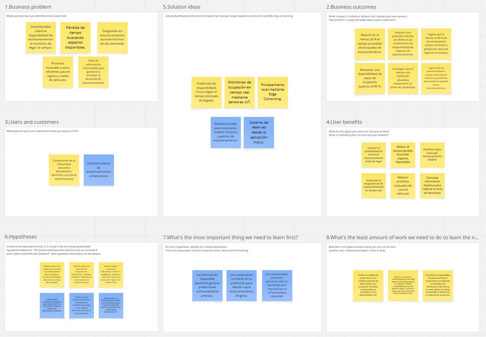

## 1.3. Segmentos objetivo

*Pendiente de elaboración.*

---

# Capítulo II: Requirements Elicitation & Analysis

## 2.1. Competidores

### 2.1.1. Análisis competitivo

<table>
  <tr>
    <th colspan="6">Competitive Analysis Landscape</th>
  </tr>
  <tr>
    <th colspan="2">¿Por qué llevar a cabo este análisis?</th>
    <td colspan="4">
      Identificar cómo Quadrapp puede diferenciarse de las soluciones actuales de estacionamiento mediante la predicción de disponibilidad futura y su especialización en comunidades educativas, considerando las tecnologías, servicios y modelos de negocio utilizados por competidores locales e internacionales.
    </td>
  </tr>
  <tr>
    <th></th>
    <th></th>
    <th>
      Quadrapp 
      
    </th>
    <th>
      Apparka 
      
    </th>
    <th>
      ParkHelp 
      
    </th>
    <th>
      ParkMobile 
      
    </th>
  </tr>
  <tr>
    <th rowspan="2">Perfil</th>
    <th>Overview</th>
    <td>
      Plataforma inteligente orientada a estacionamientos universitarios que combina sensado IoT, información de ocupación, datos históricos y tiempo estimado de llegada para predecir la probabilidad de encontrar un espacio y brindar recomendaciones al conductor antes de llegar al campus.
    </td>
    <td>
      Plataforma peruana de estacionamientos y movilidad que permite localizar estacionamientos, consultar disponibilidad y utilizar diferentes servicios digitales asociados a su operación.
    </td>
    <td>
      Solución tecnológica orientada a la gestión y guiado inteligente de estacionamientos mediante sensores, cámaras, herramientas de monitoreo y análisis de ocupación.
    </td>
    <td>
      Plataforma digital de estacionamientos que ofrece servicios para conductores, operadores y universidades, facilitando la localización y gestión de espacios de estacionamiento.
    </td>
  </tr>
  <tr>
    <th>Ventaja competitiva ¿Qué valor ofrece a los clientes?</th>
    <td>
      Predice la disponibilidad futura según el tiempo estimado de llegada, combinando información de ocupación IoT en tiempo real, datos históricos, patrones de demanda y horarios académicos. Además, genera recomendaciones que ayudan al conductor a decidir hacia qué estacionamiento dirigirse.
    </td>
    <td>
      Cuenta con presencia en el mercado peruano y experiencia en la digitalización y gestión tecnológica de estacionamientos.
    </td>
    <td>
      Integra distintas tecnologías de hardware y software para detectar la ocupación de espacios, guiar conductores y analizar el comportamiento de los estacionamientos.
    </td>
    <td>
      Cuenta con experiencia en soluciones digitales de estacionamiento y dispone de propuestas orientadas a universidades y otros entornos de alta movilidad.
    </td>
  </tr>
  <tr>
    <th rowspan="2">Perfil de Marketing</th>
    <th>Mercado objetivo</th>
    <td>
      Universidades y centros educativos con estacionamientos propios. Sus usuarios finales son estudiantes, docentes y personal administrativo que se desplazan en vehículo hacia el campus.
    </td>
    <td>
      Conductores urbanos y organizaciones que requieren soluciones tecnológicas para la gestión de estacionamientos en Perú.
    </td>
    <td>
      Universidades, centros educativos, operadores de estacionamientos y organizaciones que buscan mejorar el monitoreo y aprovechamiento de sus espacios.
    </td>
    <td>
      Universidades, ciudades, operadores de estacionamientos, estudiantes, trabajadores y visitantes.
    </td>
  </tr>
  <tr>
    <th>Estrategias de Marketing</th>
    <td>
      Alianzas B2B con universidades, implementación de pilotos dentro de campus y demostraciones dirigidas a las áreas responsables de infraestructura, movilidad y gestión de estacionamientos.
    </td>
    <td>
      Promoción de su plataforma para conductores y organizaciones, junto con soluciones empresariales relacionadas con la gestión de estacionamientos.
    </td>
    <td>
      Estrategia principalmente B2B, ofreciendo soluciones tecnológicas adaptadas a las necesidades y características de cada instalación.
    </td>
    <td>
      Acuerdos con universidades, ciudades y operadores para incorporar sus soluciones digitales dentro de distintos entornos de estacionamiento.
    </td>
  </tr>
  <tr>
    <th rowspan="3">Perfil de Producto</th>
    <th>Productos &amp; Servicios</th>
    <td>
      Predicción de disponibilidad futura, monitoreo de ocupación en tiempo real mediante IoT, análisis histórico de demanda, recomendaciones de estacionamiento, notificaciones, aplicación móvil para conductores y dashboard web para administradores.
    </td>
    <td>
      Localización de estacionamientos, consulta de disponibilidad y herramientas digitales orientadas a conductores y operadores.
    </td>
    <td>
      Sensores de estacionamiento, sistemas de detección de ocupación, guiado inteligente, dashboards, estadísticas y herramientas de monitoreo y análisis.
    </td>
    <td>
      Localización de estacionamientos, herramientas digitales para conductores y soluciones de administración destinadas a operadores y universidades.
    </td>
  </tr>
  <tr>
    <th>Precios &amp; Costos</th>
    <td>
      Modelo propuesto de suscripción o licenciamiento institucional para universidades, considerando los costos asociados a infraestructura IoT, almacenamiento, procesamiento de datos y funcionamiento de la plataforma.
    </td>
    <td>
      Los costos dependen de los servicios y soluciones tecnológicas contratadas por cada organización o estacionamiento.
    </td>
    <td>
      Los costos dependen del hardware, cantidad de espacios, infraestructura y servicios requeridos para cada instalación, por lo que se determinan según cada proyecto.
    </td>
    <td>
      El modelo comercial depende de las características del servicio implementado y de los acuerdos establecidos con cada operador o institución.
    </td>
  </tr>
  <tr>
    <th>Canales de distribución (Web y/o Móvil)</th>
    <td>
      Aplicación móvil para conductores y aplicación web con dashboard para administradores.
    </td>
    <td>
      Aplicación móvil y plataforma web.
    </td>
    <td>
      Plataforma web, infraestructura física e integraciones con sistemas instalados en los estacionamientos.
    </td>
    <td>
      Aplicación móvil y servicios web integrados con operadores y universidades.
    </td>
  </tr>
  <tr>
    <th rowspan="5">Análisis SWOT</th>
    <td colspan="5">
      Se identifican las fortalezas, debilidades, oportunidades y amenazas de Quadrapp y de sus principales competidores, considerando especialmente las capacidades relacionadas con monitoreo, disponibilidad, analítica y gestión inteligente de estacionamientos.
    </td>
  </tr>
  <tr>
    <th>Fortalezas</th>
    <td>
      Especialización en estacionamientos universitarios, predicción de disponibilidad futura, integración de información IoT en tiempo real, análisis histórico, consideración del contexto académico y generación de recomendaciones para los conductores.
    </td>
    <td>
      Presencia consolidada en Perú, experiencia operativa y conocimiento del mercado local de estacionamientos.
    </td>
    <td>
      Amplia variedad de tecnologías para estacionamientos, experiencia en soluciones universitarias e integración de sensores, monitoreo y analítica.
    </td>
    <td>
      Experiencia en soluciones para estacionamientos universitarios y presencia en distintos tipos de organizaciones y operadores.
    </td>
  </tr>
  <tr>
    <th>Debilidades</th>
    <td>
      Producto nuevo que requiere suficiente información histórica para mejorar sus predicciones. La instalación y mantenimiento de sensores IoT implica una inversión inicial y la calidad de las estimaciones depende de la confiabilidad de los datos recolectados.
    </td>
    <td>
      Su propuesta se encuentra principalmente orientada a la operación y disponibilidad actual del estacionamiento, sin especialización en predicción futura según el tiempo estimado de llegada al campus.
    </td>
    <td>
      Su propuesta depende considerablemente de infraestructura tecnológica instalada y se orienta principalmente al monitoreo y guiado, más que a una predicción personalizada según el momento de llegada del conductor.
    </td>
    <td>
      Su propuesta es amplia y está orientada a diferentes mercados, por lo que puede tener menor especialización en patrones académicos y comportamiento específico de comunidades universitarias.
    </td>
  </tr>
  <tr>
    <th>Oportunidades</th>
    <td>
      Creciente digitalización de campus, aprovechamiento de datos históricos y académicos para mejorar las predicciones y posibilidad de expansión futura hacia otros espacios con patrones recurrentes de movilidad.
    </td>
    <td>
      Expandir su experiencia e infraestructura hacia universidades y otros sectores con necesidades específicas de movilidad.
    </td>
    <td>
      Incorporar capacidades predictivas avanzadas utilizando la información generada por sus sensores y sistemas de monitoreo.
    </td>
    <td>
      Aprovechar los datos generados por sus usuarios para incorporar herramientas avanzadas de análisis y planificación de capacidad.
    </td>
  </tr>
  <tr>
    <th>Amenazas</th>
    <td>
      Competidores establecidos podrían incorporar funcionalidades predictivas; las instituciones podrían mostrar resistencia frente al costo de infraestructura; la falta de datos históricos o una baja precisión inicial podría afectar la confianza en las estimaciones.
    </td>
    <td>
      Aparición de soluciones especializadas que utilicen predicción, información histórica y análisis contextual como factores diferenciadores.
    </td>
    <td>
      Aparición de soluciones con menor dependencia de infraestructura física o modelos de implementación más económicos.
    </td>
    <td>
      Competidores especializados en sectores específicos pueden ofrecer experiencias más adaptadas a las necesidades particulares de cada institución.
    </td>
  </tr>
</table>

### 2.1.2. Estrategias y tácticas frente a competidores

A partir del análisis competitivo realizado, se identificaron oportunidades para posicionar Quadrapp sin competir directamente mediante características que ya se encuentran presentes en otras soluciones de estacionamiento. La estrategia principal será concentrarse en la predicción de disponibilidad futura y el análisis del comportamiento de los estacionamientos universitarios, aprovechando información propia del contexto académico.

**Frente a Apparka:**
Quadrapp no buscará diferenciarse únicamente mediante la visualización de estacionamientos disponibles o la gestión tradicional de espacios. La estrategia será enfocarse en la predicción de disponibilidad futura, permitiendo que los conductores conozcan la probabilidad de encontrar un espacio al momento estimado de llegada al campus.
Para ello, Quadrapp combinará información actual de ocupación con datos históricos, patrones de demanda y horarios académicos, ofreciendo una experiencia especializada en comunidades educativas.

**Frente a ParkHelp:**
Frente a ParkHelp, Quadrapp buscará complementar el monitoreo mediante sensores IoT con una capa de analítica histórica y predicción que transforme los datos de ocupación en información útil para los conductores.
La diferenciación no estará únicamente en detectar qué espacios están disponibles, sino en utilizar esa información para anticipar cómo podría evolucionar la ocupación en los siguientes minutos y generar recomendaciones según el momento estimado de llegada.

**Frente a ParkMobile:**
Frente a ParkMobile, Quadrapp priorizará una experiencia especializada en el contexto universitario. La solución utilizará información relacionada con horarios académicos, horas pico, comportamiento histórico y patrones recurrentes de demanda para generar estimaciones adaptadas a cada campus.
Este enfoque permitirá que tanto conductores como administradores obtengan información relacionada específicamente con el comportamiento de su comunidad educativa.

**Tácticas principales:**
- Implementar pilotos controlados en universidades antes de realizar despliegues de mayor escala.
- Recopilar información histórica desde las primeras etapas para mejorar progresivamente la capacidad de identificar patrones de demanda.
- Medir continuamente la precisión de las predicciones y compararlas con la disponibilidad realmente observada.
- Validar periódicamente la información generada por los sensores IoT comparándola con la ocupación real de los espacios.
- Analizar la relación entre fecha, hora, horarios académicos, horas pico y ocupación histórica para mejorar los modelos de predicción.
- Mostrar a los administradores mediante un dashboard información relacionada con ocupación actual, comportamiento histórico, períodos de mayor demanda y predicciones.
- Utilizar notificaciones únicamente cuando existan cambios relevantes que puedan modificar la decisión del conductor, evitando generar alertas innecesarias.
- Establecer alianzas directas con universidades para obtener datos, ejecutar pilotos y validar la solución en situaciones reales.
- Utilizar los resultados de los pilotos como evidencia de la reducción del tiempo de búsqueda y de la utilidad de las predicciones.
- Mejorar progresivamente los modelos de predicción conforme se disponga de una mayor cantidad de datos históricos por campus.

## 2.2. Entrevistas

### 2.2.1. Diseño de entrevistas

Las entrevistas buscan validar el problema antes de proponer una solución: cuánto tiempo pierde realmente un conductor al buscar estacionamiento en el campus, con qué información cuenta al momento de salir de su casa y cómo el personal encargado del estacionamiento conoce y gestiona la ocupación. Se diseñó un guion por segmento objetivo. Las preguntas priorizan la experiencia actual del entrevistado y los hechos recientes sobre las opiniones generales. Las referencias a la tecnología y los escenarios hipotéticos se utilizan para explorar actitudes y expectativas sin mencionar Quadrapp. Sus respuestas se analizarán como preferencias declaradas y no como evidencia de un comportamiento real.

Cada guion se organiza en cuatro bloques. Las **preguntas de perfil** sitúan al entrevistado en su contexto y recogen sus hábitos, herramientas y disposición ante la tecnología. Las **preguntas principales** exploran el proceso tal como ocurre hoy, pidiendo que el entrevistado narre episodios concretos y recientes en lugar de opiniones generales. Las **preguntas complementarias** cubren situaciones excepcionales y restricciones del entorno. La **pregunta de cierre** proyecta el escenario deseado y abre espacio para lo que el guion no previó.

#### Segmento 1: Conductores de la comunidad educativa

Este segmento vive el problema en primera persona y de forma recurrente, por lo que el guion prioriza la reconstrucción de su rutina: a qué hora decide salir, qué consulta antes de hacerlo, qué ocurre cuando encuentra el estacionamiento lleno y cuánto tiempo pierde en consecuencia. Las preguntas buscan cuantificar la pérdida de tiempo y detectar las soluciones informales que ya emplea, como coordinar por mensajería con compañeros o adelantar su llegada por precaución.

**Datos generales del entrevistado**

| Dato | Detalle |
| --- | --- |
| Nombres y apellidos | |
| Edad | |
| Género | |
| Distrito de residencia | |
| Estado civil y composición familiar | |
| Ocupación y vínculo con la universidad | Carrera o área |
| Dispositivo principal | Marca y sistema operativo |
| Navegador de preferencia | |
| Canales digitales de uso frecuente | |
| Marcas o referentes que admira | |

*Preguntas de perfil*

1. Cuéntanos quién eres, qué haces en la universidad y cuántos días a la semana llegas conduciendo. ¿Con quién vives y quién más usa el vehículo?
2. ¿Tu horario es fijo o variable? ¿Hay algún día en el que llegar tarde te genera un problema serio?
3. ¿Qué aplicaciones usas para desplazarte y por qué canales te informas de lo que ocurre en el campus?
4. ¿Te consideras una persona que planifica su día o que improvisa sobre la marcha? ¿Qué tan dispuesto estás a probar una aplicación nueva?

*Preguntas principales*

5. Descríbenos la última vez que condujiste al campus, desde que saliste de casa hasta que apagaste el motor.
6. ¿Cómo decides a qué hora salir? ¿Sabes de antemano cómo estará el estacionamiento?
7. Cuando vas en camino, ¿le consultas a alguien cómo está la situación? ¿Por qué medio?
8. Cuéntanos la última vez que encontraste el estacionamiento lleno. ¿Qué hiciste, cuánto tiempo perdiste y qué consecuencias tuvo?
9. Una vez dentro del campus, ¿cómo haces para encontrar un espacio libre?
10. ¿Has cambiado tus planes por temor a no encontrar espacio? ¿Cuánto tiempo adicional calculas que eso te cuesta por semana?
11. Descríbenos paso a paso lo que haces hoy para asegurarte un espacio, y con qué frecuencia repites cada paso.
12. Del 1 al 10, ¿qué tan importante es este problema en tu día? ¿Cuál es tu mayor frustración al respecto?

*Preguntas complementarias*

13. ¿Qué cambia en semanas especiales, como el inicio de ciclo, los exámenes o los eventos masivos?
14. Si pudieras saber una sola cosa antes de salir de casa, ¿cuál sería? ¿Preferirías que la aplicación te avise sola o consultarla tú?

*Pregunta de cierre*

15. Si supieras con anticipación la probabilidad de encontrar estacionamiento al llegar, ¿qué cambiaría en tu rutina? ¿Hay algo que no te hayamos preguntado y consideres importante?

#### Segmento 2: Administradores de estacionamientos universitarios

Este segmento reúne a quienes supervisan la operación diaria del estacionamiento: jefes de logística y operaciones, supervisores de turno y operadores de puerta. El guion se concentra en cómo conocen la ocupación, cómo reaccionan ante la saturación y qué información necesitan para gestionar el estacionamiento. Para que la entrevista dure entre tres y cinco minutos, se plantean ocho preguntas breves. Las repreguntas entre paréntesis son opcionales y solo se utilizan cuando la respuesta principal no proporciona suficiente información.

**Datos generales del entrevistado**

| Dato | Detalle |
| --- | --- |
| Nombres y apellidos | |
| Edad | |
| Distrito de residencia | |
| Cargo y tiempo en el puesto | |

*Preguntas de perfil*

1. ¿Cuál es tu función principal durante un turno habitual?

*Preguntas principales*

2. Cuéntanos la última vez que el estacionamiento se llenó o estuvo cerca de llenarse. ¿Qué hiciste? (¿Cómo lo detectaste? ¿Con quién te coordinaste? ¿Cuál fue el resultado?)
3. ¿Cómo sabes durante un turno cuántos espacios están disponibles? (¿De dónde obtienes el dato? ¿Cada cuánto se actualiza? ¿Qué tan confiable es?)
4. ¿Cómo manejan actualmente la información de entradas, salidas y ocupación? (¿Quién la registra? ¿Dónde se almacena? ¿Cómo se preparan los reportes?)
5. ¿Cuál es el problema que se repite con mayor frecuencia durante la operación? (¿Cuándo ocurrió por última vez? ¿Qué información te faltó para resolverlo?)

*Preguntas complementarias*

6. ¿Qué cambia durante el inicio de ciclo, los exámenes o los eventos masivos? (¿Cómo se preparan? ¿Qué dificultad suele presentarse?)
7. Cuéntanos la última vez que falló un equipo de control del estacionamiento. ¿Cómo continuaron operando? (¿Quién atendió la falla? ¿Cuánto tiempo duró?)

*Pregunta de cierre*

8. Si pudieras disponer de una información que hoy no tienes, ¿cuál te ayudaría más a gestionar el estacionamiento y por qué?

### 2.2.2. Registro de entrevistas

Cada entrevista se registró en video y se documenta con los datos del entrevistado, el enlace a la grabación, su duración y una captura del video, una captura del video y un resumen descriptivo de sus respuestas. Los resúmenes incorporan tanto las características objetivas como las subjetivas que más adelante sustentan los User Personas y los Empathy Maps.

#### Segmento 1: Conductores de la comunidad educativa

**Entrevista 1**

| Campo | Información |
| --- | --- |
| Nombres y apellidos | María Fernanda Tejeda Mena |
| Edad | 20 años |
| Ocupación y vínculo con la universidad | Estudiante de Derecho, 8.º ciclo |
| Enlace de la grabación | [Ver entrevista](https://upcedupe-my.sharepoint.com/personal/u202318947_upc_edu_pe/_layouts/15/stream.aspx?id=%2Fpersonal%2Fu202318947%5Fupc%5Fedu%5Fpe%2FDocuments%2FVideos%2FClipchamp%2FEntrevista%201%20Segmento%201%20%2D%20Maria%20Fernanda%2FAssets%2Fvideo1517213583%2Emp4&referrer=StreamWebApp%2EWeb&referrerScenario=AddressBarCopied%2Eview%2E3ee3d14a%2Db34c%2D43f6%2Db1b6%2Dfb894789b5f2) |
| Duración | 4 minutos y 13 segundos |
| Captura |  |
| Resumen | Estudiante de Derecho que utiliza un auto familiar para asistir a la universidad de lunes a viernes. Para movilizarse utiliza Waze o Google Maps y se informa mediante WhatsApp y correo institucional. Actualmente no cuenta con información precisa sobre la disponibilidad de estacionamientos antes de llegar, por lo que consulta ocasionalmente a sus compañeros o calcula la disponibilidad según el horario y la actividad del campus. En una ocasión tuvo que buscar estacionamiento durante 10 a 15 minutos y llegó tarde a clases. Además, estima que invierte entre 30 y 60 minutos adicionales por semana debido a la incertidumbre sobre encontrar un espacio. Considera importante conocer con anticipación la probabilidad de encontrar estacionamiento para poder planificar mejor su salida. |

**Entrevista 2**

| Campo | Información |
| --- | --- |
| Nombres y apellidos | Wilder Gonzalo Aliaga Urbina |
| Edad | 21 años |
| Ocupación y vínculo con la universidad | Estudiante de Ingeniería de Software, 8.º ciclo |
| Enlace de la grabación | [https://upcedupe-my.sharepoint.com/:v:/g/personal/u202215462_upc_edu_pe/IQALFlPRSrnUR48PtAjDQ1f-AaB7rRMljFlq5JK61XENGM0?e=FsLoaG&nav=eyJyZWZlcnJhbEluZm8iOnsicmVmZXJyYWxBcHAiOiJTdHJlYW1XZWJBcHAiLCJyZWZlcnJhbFZpZXciOiJTaGFyZURpYWxvZy1MaW5rIiwicmVmZXJyYWxBcHBQbGF0Zm9ybSI6IldlYiIsInJlZmVycmFsTW9kZSI6InZpZXcifX0%3D](https://upcedupe-my.sharepoint.com/:v:/g/personal/u202215462_upc_edu_pe/IQALFlPRSrnUR48PtAjDQ1f-AaB7rRMljFlq5JK61XENGM0?e=FsLoaG&nav=eyJyZWZlcnJhbEluZm8iOnsicmVmZXJyYWxBcHAiOiJTdHJlYW1XZWJBcHAiLCJyZWZlcnJhbFZpZXciOiJTaGFyZURpYWxvZy1MaW5rIiwicmVmZXJyYWxBcHBQbGF0Zm9ybSI6IldlYiIsInJlZmVycmFsTW9kZSI6InZpZXcifX0%3D) |
| Duración | 8 minutos y 4 segundos |
| Captura |  |
| Resumen | Estudiante de Ingeniería de Software que utiliza su auto propio para movilizarse a su campus 3 veces a la semana. Para movilizarse utiliza Waze o Google Maps y se informa mediante WhatsApp. Actualmente no cuenta con información precisa sobre la disponibilidad de estacionamientos antes de llegar, por lo que trata de salir con antelación para evitar situaciones de tráfico y estrés. En una ocasión, durante su trayecto al campus, tuvo muchas complicaciones debido a una situación de tráfico y cola de espera en el estacionamiento de su campus, lo que lo llevó a perder mucho tiempo, llegando tarde a su clase. Considera importante conocer con anticipación la probabilidad de encontrar estacionamiento para poder planificar mejor su salida. |

#### Segmento 2: Administradores de estacionamientos universitarios

**Entrevista 1**

| Campo | Información |
| --- | --- |
| Nombres y apellidos | Mario Grandes |
| Edad | 26 años |
| Ocupación y vínculo con la universidad | Encargado del estacionamiento del campus |
| Enlace de la grabación | [Ver entrevista](https://youtu.be/Uwh7i71zwv4) |
| Duración | 2 minutos y 27 segundos |
| Captura |  |
| Resumen | Encargado del estacionamiento de un campus universitario. Su función principal durante el turno es monitorear el flujo vehicular, supervisar al personal en las tranqueras y resolver los cuellos de botella en las horas punta. Conoce la disponibilidad de espacios por experiencia y mirando los reportes básicos de las tranqueras, que describe como poco confiables porque se actualizan con lentitud. El registro de ingresos lo realiza el personal de seguridad de forma manual y él arma los reportes diarios en una hoja de cálculo al finalizar el día. Relata que el lunes a las 8 de la mañana el estacionamiento estuvo cerca de llenarse: lo detectó revisando cámaras, se comunicó con los vigilantes para desviar vehículos hacia zonas alternas y, aunque la situación fue caótica, evitaron el bloqueo de la vía principal. Identifica como problema recurrente las filas en las tranqueras durante el cambio de hora de las 8 de la mañana, y lo atribuye a la falta de visibilidad en tiempo real sobre qué zonas tienen espacios libres. En el inicio de ciclo, los exámenes y los eventos masivos el flujo se dispara alrededor de un 50 por ciento: se preparan asignando más personal, pero carecen de datos históricos para dimensionar cuántos vehículos llegarán. La semana previa a la entrevista falló la lectora de una tranquera principal y debieron operarla manualmente durante 45 minutos hasta que soporte técnico reinició el sistema. Al preguntarle qué información le haría falta, responde que una plataforma analítica capaz de predecir la demanda y anticipar cuántos vehículos llegarán por hora, para organizar los accesos sin depender de suposiciones. |

### 2.2.3. Análisis de entrevistas

Esta sección analiza, para cada segmento objetivo, las características objetivas y subjetivas identificadas en las entrevistas que sustentan la construcción de los arquetipos. El análisis se apoya en los registros de la sección anterior y se actualizará con el sustento porcentual correspondiente a medida que se completen las entrevistas de cada segmento.

#### Segmento 1: Conductores de la comunidad educativa

*Pendiente de elaboración: se completará al registrar las entrevistas restantes del segmento.*

#### Segmento 2: Administradores de estacionamientos universitarios

**Hallazgos principales**

* **Alcance de la operación:** la persona entrevistada supervisa el flujo vehicular del campus, coordina al personal de las tranqueras y resuelve los cuellos de botella durante las horas punta. Su trabajo se concentra principalmente en los periodos de mayor ingreso vehicular.
* **Conocimiento de la ocupación:** la disponibilidad se estima mediante la experiencia y los reportes básicos de las tranqueras, considerados poco confiables porque se actualizan con lentitud. Para confirmar la ocupación del estacionamiento también se revisan las cámaras de seguridad.
* **Gestión de la información:** el personal de seguridad registra manualmente los ingresos y los reportes diarios se consolidan en una hoja de cálculo al terminar el turno.
* **Obstáculos diarios:** las filas en las tranqueras durante el cambio de hora de la mañana constituyen el problema recurrente debido a la falta de información en tiempo real sobre las zonas que tienen espacios libres. Durante el inicio del ciclo, los periodos de exámenes y los eventos masivos, el flujo aumenta alrededor de un 50 % y se asigna más personal sin contar con datos históricos que respalden esa decisión. Una falla en la lectora de una tranquera obligó al equipo a operar el acceso manualmente hasta que se restableció el sistema.
* **Expectativas sobre la solución:** la persona entrevistada espera una plataforma analítica que prediga la demanda y anticipe cuántos vehículos llegarán por hora para organizar los accesos sin depender de suposiciones.

**Conclusión preliminar**

Las entrevistas registradas identifican como problema común la falta de información oportuna sobre la disponibilidad. Para la conductora, esta información es necesaria antes de salir de casa y durante el trayecto. Para el administrador, resulta útil durante el turno y al planificar periodos de alta demanda. Estos hallazgos respaldan una solución que proporcione información de ocupación adaptada a las necesidades de cada segmento mediante una aplicación móvil para conductores y una consola de operación para administradores.

## 2.3. Needfinding

### 2.3.1. User Personas

*Pendiente de elaboración.*

### 2.3.2. User Task Matrix

*Pendiente de elaboración.*

### 2.3.3. Empathy Mapping

*Pendiente de elaboración.*

### 2.3.4. As-is Scenario Mapping

El As-is Scenario Mapping permite visualizar cómo viven actualmente los usuarios el proceso de estacionar dentro de un campus universitario, antes de la introducción de Quadrapp. Para cada segmento objetivo se elaboró un mapa a partir de su User Persona, con las filas **Phases**, **Doing**, **Thinking** y **Feeling**.

El proceso seguido por el equipo fue el siguiente:

1. **Preparación:** se revisaron los User Personas, las entrevistas y el Empathy Mapping para definir el alcance de cada mapa y el escenario a analizar: "llegar al campus, estacionar y salir del estacionamiento".
2. **Lluvia de ideas individual:** cada integrante escribió por separado, en notas adhesivas, lo que el usuario hace, piensa y siente durante el proceso.
3. **Revisión e identificación de fases:** se agruparon las notas por afinidad y se definieron las fases como columnas del mapa.
4. **Nombrado de fases:** se asignó un nombre descriptivo a cada fase, orientado a la actividad del usuario.
5. **Etiquetado de áreas:** se identificaron las áreas positivas, las áreas negativas (puntos de dolor) y las *blank areas*, es decir, aquellas sobre las que el equipo necesita aprender más.

#### Conductores de la comunidad educativa

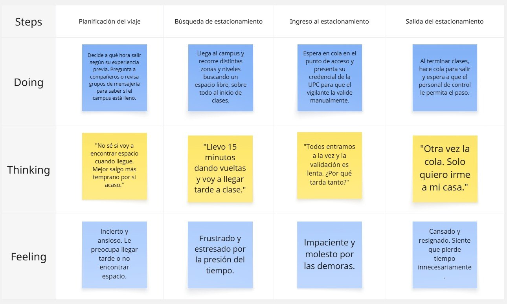

**Áreas positivas:** el conductor cuenta con un estacionamiento gratuito dentro o cerca del campus, y la validación con credencial le da una sensación de seguridad.

**Áreas negativas (puntos de dolor):**
- Incertidumbre total antes de salir: solo dispone de información informal, no de datos.
- Tiempo perdido y desplazamientos innecesarios buscando espacio.
- Colas en el ingreso y la salida por la validación manual de credenciales.
- Congestión en los puntos de acceso durante las horas pico.

**Blank areas:**
- ¿Cuánto tiempo real dedican al día a buscar estacionamiento?
- ¿Cómo deciden actualmente a qué zona o estacionamiento dirigirse?
- ¿Qué alternativas usan cuando no encuentran espacio?

#### Administradores de estacionamientos universitarios

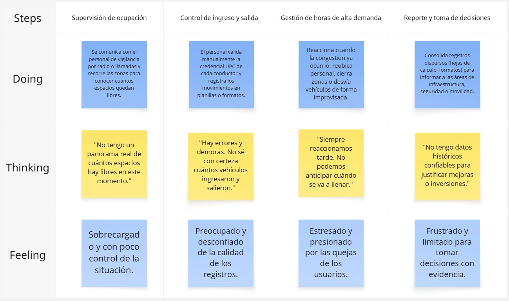

**Áreas positivas:** cuenta con personal de vigilancia presente en el campus y con un control de acceso basado en la credencial institucional ya establecido.

**Áreas negativas (puntos de dolor):**
- Información de ocupación desactualizada o basada en recorridos manuales.
- Registros manuales propensos a error y difíciles de consolidar.
- Gestión reactiva de las horas de alta demanda.
- Ausencia de datos históricos organizados para analizar patrones.

**Blank areas:**
- ¿Cuántas personas intervienen hoy en el control de accesos y cuánto tiempo les toma?
- ¿Con qué herramientas registran actualmente la ocupación y los movimientos de vehículos?
- ¿Qué indicadores le piden a la administración las áreas de dirección?

## 2.4. Ubiquitous Language

En esta sección se define el Ubiquitous Language del dominio del proyecto, con el objetivo de establecer un lenguaje común entre todos los miembros del equipo y los stakeholders. Este glosario incluye términos clave del dominio de la gestión de estacionamientos en universidades y centros educativos, evitando ambigüedades y facilitando la comunicación durante el desarrollo de la solución.

| Term | Definition |
| --- | --- |
| Campus (Campus) | Espacio físico de la universidad o centro educativo donde se desarrollan las actividades académicas y donde se ubican los estacionamientos. |
| Educational Community (Comunidad Educativa) | Conjunto de estudiantes, docentes y personal administrativo que se trasladan regularmente al campus. |
| Driver (Conductor) | Miembro de la comunidad educativa que llega al campus en un vehículo y utiliza el estacionamiento. |
| Parking Administrator (Administrador de Estacionamiento) | Persona responsable de supervisar la ocupación, el acceso y la operación diaria de los estacionamientos de la institución. |
| Parking Lot (Estacionamiento) | Área destinada al aparcamiento de vehículos dentro o junto al campus, administrada por la institución. |
| Parking Zone (Zona de Estacionamiento) | Sección delimitada de un estacionamiento (nivel, sector o bloque) que agrupa un conjunto de espacios. |
| Parking Space (Espacio de Estacionamiento) | Lugar individual y delimitado donde puede estacionarse un vehículo. |
| Vehicle (Vehículo) | Automóvil u otro medio de transporte motorizado que ingresa al estacionamiento y está asociado a un conductor. |
| License Plate (Placa) | Identificador único de un vehículo, utilizado para asociarlo con su conductor y validar su acceso. |
| Authorized Vehicle (Vehículo Autorizado) | Vehículo registrado cuyo conductor tiene permiso para ingresar y utilizar el estacionamiento. |
| Occupancy (Ocupación) | Cantidad de espacios de estacionamiento ocupados en un momento determinado. |
| Availability (Disponibilidad) | Cantidad de espacios de estacionamiento libres en un momento determinado. |
| Availability Prediction (Predicción de Disponibilidad) | Estimación de cuántos espacios estarán libres en un momento futuro, basada en información actual e histórica. |
| Availability Probability (Probabilidad de Disponibilidad) | Nivel de posibilidad, expresado como porcentaje, de que el conductor encuentre un espacio libre al momento de su llegada. No constituye una garantía. |
| Estimated Time of Arrival (Tiempo Estimado de Llegada) | Momento en que se calcula que el conductor llegará al estacionamiento, según su ubicación y desplazamiento. |
| Historical Occupancy (Ocupación Histórica) | Registro de la ocupación del estacionamiento en fechas y horas pasadas, utilizado para identificar comportamientos recurrentes. |
| Academic Schedule (Horario Académico) | Calendario de clases y actividades de la institución que influye en los momentos de llegada y salida de los conductores. |
| Peak Hours (Horas Pico) | Períodos de mayor demanda de estacionamiento, generalmente al inicio y al término de las clases. |
| Demand Pattern (Patrón de Demanda) | Comportamiento recurrente en la cantidad de vehículos que buscan estacionar según el día, la hora o el calendario académico. |
| Congestion (Congestión) | Acumulación de vehículos dentro o alrededor del campus que dificulta la circulación, la búsqueda de espacio o el acceso. |
| Parking Search Time (Tiempo de Búsqueda de Estacionamiento) | Tiempo que un conductor invierte desde su llegada al campus hasta encontrar un espacio donde estacionar. |
| Reservation (Reserva) | Asignación anticipada de un espacio de estacionamiento a un conductor para un período determinado. |
| Entry (Ingreso) | Momento en que un vehículo autorizado accede al estacionamiento. |
| Exit (Salida) | Momento en que un vehículo abandona el estacionamiento y finaliza su estadía. |
| Parking Stay (Estadía) | Período comprendido entre el ingreso y la salida de un vehículo del estacionamiento. |
| Access Control (Control de Acceso) | Proceso mediante el cual se verifica que un vehículo o conductor pueda ingresar o salir del estacionamiento. |
| Access QR Code (Código QR de Acceso) | Código que el conductor presenta como alternativa de identificación cuando la placa no puede ser reconocida. |
| Access Exception (Excepción de Acceso) | Situación en la que el reconocimiento de la placa falla o el vehículo no puede validarse, requiriendo un mecanismo alternativo. |
| Parking Fee (Tarifa de Estacionamiento) | Monto que el conductor debe pagar por el uso del estacionamiento o por una reserva. |
| Payment (Pago) | Acción mediante la cual el conductor abona la tarifa correspondiente a su estadía o reserva. |
| Institutional License (Licencia Institucional) | Acuerdo mediante el cual una universidad o centro educativo contrata el uso de la solución para sus estacionamientos. |

# Capítulo III: Requirements Specification

## 3.1. To-Be Scenario Mapping

El To-Be Scenario Mapping representa cómo se espera que los usuarios vivan el proceso de estacionar en el campus una vez que Quadrapp esté en funcionamiento. Para cada segmento objetivo se elaboró un mapa a partir de su User Persona, con las filas **Phases**, **Doing**, **Thinking** y **Feeling**.

El proceso seguido por el equipo fue el siguiente:

1. **Preparación:** se retomaron los As-is Scenario Mapping, los puntos de dolor identificados y las funcionalidades priorizadas de Quadrapp.
2. **Lluvia de ideas individual:** cada integrante propuso cómo cambiaría lo que el usuario hace, piensa y siente con la solución implementada.
3. **Revisión e identificación de fases:** se agruparon las ideas y se definieron las fases como columnas, buscando que fueran comparables con las del As-is.
4. **Nombrado de fases:** se asignó un nombre a cada fase, orientado a la experiencia mejorada del usuario.
5. **Comparación con el As-is:** se contrastó cada mapa con su versión As-is para identificar los cambios que Quadrapp aporta en cada fase.

Al igual que en el As-is, se mantiene que el estacionamiento es gratuito para la comunidad educativa y que la credencial de la UPC es obligatoria para ingresar.

#### Conductores de la comunidad educativa

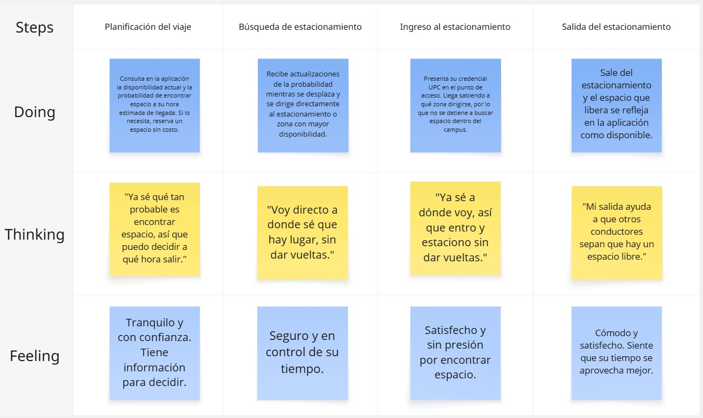

#### Administradores de estacionamientos universitarios

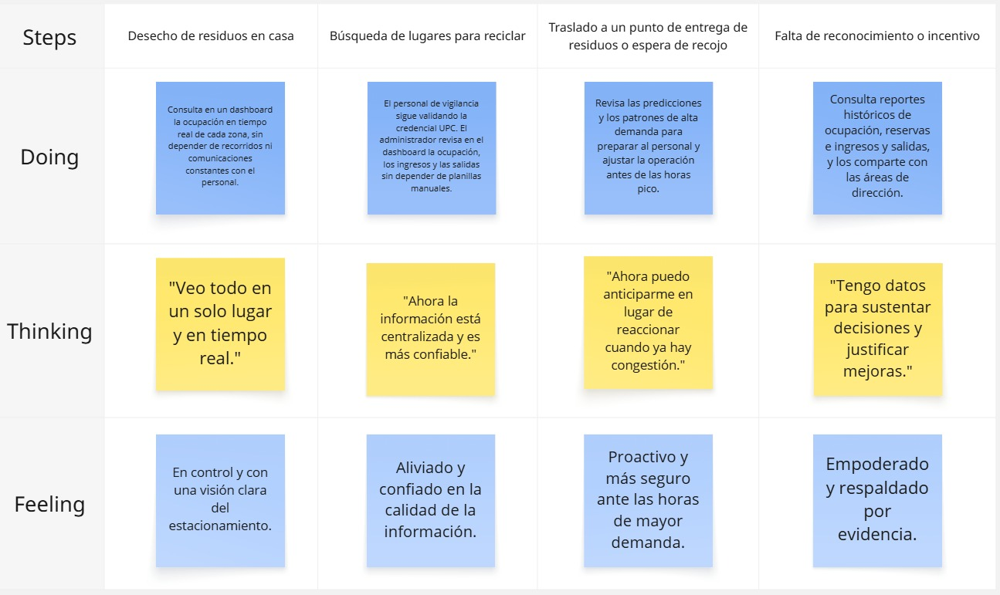

## 3.2. User Stories

Los requisitos de Quadrapp se expresan como Epics, User Stories y Technical Stories en un único cuadro, con una fila por cada elemento. Las siete épicas agrupan las capacidades del producto: el acceso a la aplicación, la consulta de disponibilidad, la predicción y asesoría de llegada, la gestión de la infraestructura de estacionamientos, la analítica histórica, el sitio web estático de presentación y las alertas.

Las User Stories dirigidas a la comunidad universitaria y al personal que administra el estacionamiento describen funcionalidades observables por el usuario. Las dirigidas al visitante de la Landing Page cubren el sitio público, con llamadas a la acción diferenciadas por segmento objetivo. Las Technical Stories, redactadas con el rol de Developer, corresponden a los componentes sin interacción directa con el usuario final, como las APIs internas y la ingesta de eventos de los sensores. Sus criterios de aceptación describen solicitudes, respuestas o eventos observables según el tipo de interacción. Todos los criterios siguen la estructura Gherkin en tiempo presente y tercera persona, sin referencias a detalles de interfaz.

<table> <thead> <tr> <th>Epic / User Story ID</th> <th>Título</th> <th>Descripción</th> <th>Criterios de Aceptación</th> <th>Relacionado con (Epic ID)</th> </tr> </thead> <tbody>

<tr>
  <td><strong>EP01</strong></td>
  <td>Acceso e identidad</td>
  <td>Permitir que estudiantes, docentes y personal administrativo accedan al sistema mediante autenticación institucional y gestionen su sesión de forma segura.</td>
  <td>No aplica</td>
  <td>No aplica</td>
</tr>

<tr>
  <td><strong>EP02</strong></td>
  <td>Disponibilidad de estacionamientos</td>
  <td>Permitir consultar el estado actual de los estacionamientos universitarios, incluyendo espacios disponibles, ocupados y estados desconocidos por zona.</td>
  <td>No aplica</td>
  <td>No aplica</td>
</tr>

<tr>
  <td><strong>EP03</strong></td>
  <td>Predicción y asesoría de llegada</td>
  <td>Proporcionar predicciones de disponibilidad futura y asesoría de llegada considerando el tiempo estimado de llegada del usuario al estacionamiento.</td>
  <td>No aplica</td>
  <td>No aplica</td>
</tr>

<tr>
  <td><strong>EP04</strong></td>
  <td>Gestión e infraestructura de estacionamientos</td>
  <td>Gestionar la configuración de estacionamientos, zonas, espacios y accesos vehiculares, además de la integración y monitoreo de los sensores utilizados para detectar la ocupación.</td>
  <td>No aplica</td>
  <td>No aplica</td>
</tr>

<tr>
  <td><strong>EP05</strong></td>
  <td>Analítica histórica</td>
  <td>Permitir que la institución consulte la información histórica de ocupación, los periodos de mayor demanda y la precisión de las predicciones.</td>
  <td>No aplica</td>
  <td>No aplica</td>
</tr>

<tr>
  <td><strong>EP06</strong></td>
  <td>Presentación del producto en la Landing Page</td>
  <td>Permitir que un visitante conozca la propuesta de valor de Quadrapp, encuentre la información correspondiente a su segmento y acceda a la aplicación o al canal de contacto institucional desde el sitio web estático.</td>
  <td>No aplica</td>
  <td>No aplica</td>
</tr>

<tr>
  <td><strong>EP07</strong></td>
  <td>Alertas y notificaciones</td>
  <td>Permitir que el conductor se suscriba a las alertas de un estacionamiento y gestione las preferencias con las que desea recibirlas.</td>
  <td>No aplica</td>
  <td>No aplica</td>
</tr>

<tr>
  <td><strong>US01</strong></td>
  <td>Iniciar sesión con un correo autorizado</td>
  <td>Como usuario autorizado por una institución, quiero iniciar sesión con mi correo verificado y un código de un solo uso para acceder a Quadrapp según el rol que me corresponde.</td>
  <td>
    <strong>Escenario 1: Solicitud del código de verificación.</strong> 
    Dado que el usuario ingresa un correo cuyo dominio pertenece a una universidad registrada, 
    cuando solicita el acceso, 
    entonces el sistema envía un código de un solo uso a ese correo e informa su periodo de vigencia.  
    <strong>Escenario 2: Código válido.</strong> 
    Dado que el usuario recibió un código vigente, 
    cuando lo ingresa dentro de su periodo de vigencia, 
    entonces el sistema habilita su sesión con el rol y la universidad que le corresponden.  
    <strong>Escenario 3: Código incorrecto o vencido.</strong> 
    Dado que el código ingresado no coincide con el enviado o su vigencia terminó, 
    cuando el usuario intenta continuar, 
    entonces el sistema rechaza el acceso e informa que debe solicitar un nuevo código.  
    <strong>Escenario 4: Correo invitado por una institución.</strong> 
    Dado que el correo no pertenece a un dominio habilitado pero cuenta con una invitación vigente o con una cuenta creada previamente, 
    cuando el usuario solicita el acceso, 
    entonces el sistema envía el código y le otorga el rol registrado en su cuenta o invitación.  
    <strong>Escenario 5: Correo sin vínculo institucional.</strong> 
    Dado que el correo no pertenece a un dominio habilitado y tampoco tiene invitación ni cuenta previa, 
    cuando el usuario solicita el acceso, 
    entonces el sistema no envía ningún código e informa que el correo no corresponde a una institución habilitada.  
    <strong>Escenario 6: Sesión vigente.</strong> 
    Dado que el usuario mantiene una sesión válida, 
    cuando vuelve a utilizar la aplicación, 
    entonces el sistema conserva su acceso sin solicitar un nuevo código.
  </td>
  <td>EP01</td>
</tr>

<tr>
  <td><strong>US02</strong></td>
  <td>Cerrar sesión</td>
  <td>Como usuario, quiero cerrar mi sesión para evitar que otra persona pueda acceder a mi cuenta desde el dispositivo.</td>
  <td>
    <strong>Escenario 1: Cierre exitoso.</strong> 
    Dado que el usuario tiene una sesión activa, 
    cuando solicita el cierre de sesión, 
    entonces el sistema finaliza su sesión y revoca el token asociado.  
    <strong>Escenario 2: Acceso posterior al cierre.</strong> 
    Dado que el usuario cerró su sesión, 
    cuando intenta acceder a una funcionalidad protegida, 
    entonces el sistema solicita nuevamente la autenticación.  
    <strong>Escenario 3: Cierre en un dispositivo compartido.</strong> 
    Dado que el usuario cerró su sesión en el dispositivo, 
    cuando otra persona utiliza ese mismo dispositivo, 
    entonces el sistema no expone la información asociada a la cuenta anterior.
  </td>
  <td>EP01</td>
</tr>

<tr>
  <td><strong>US03</strong></td>
  <td>Gestionar sesión expirada</td>
  <td>Como usuario, quiero que el sistema controle la expiración de mi sesión para mantener protegido mi acceso a Quadrapp.</td>
  <td>
    <strong>Escenario 1: Sesión expirada.</strong> 
    Dado que la sesión del usuario ha expirado, 
    cuando intenta acceder a una funcionalidad protegida, 
    entonces el sistema solicita una nueva autenticación.  
    <strong>Escenario 2: Expiración durante el uso.</strong> 
    Dado que el usuario está utilizando la aplicación, 
    cuando su sesión expira, 
    entonces el sistema muestra un mensaje indicando que debe iniciar sesión nuevamente.  
    <strong>Escenario 3: Nueva autenticación.</strong> 
    Dado que la sesión anterior expiró, 
    cuando el usuario se autentica nuevamente de forma correcta, 
    entonces puede continuar utilizando Quadrapp.
  </td>
  <td>EP01</td>
</tr>

<tr>
  <td><strong>US04</strong></td>
  <td>Consultar estacionamientos universitarios</td>
  <td>Como usuario, quiero visualizar los estacionamientos disponibles dentro de mi universidad para identificar las áreas donde puedo estacionar.</td>
  <td>
    <strong>Escenario 1: Estacionamientos disponibles.</strong> 
    Dado que existen estacionamientos configurados, 
    cuando el usuario ingresa a la sección de estacionamientos, 
    entonces el sistema muestra los estacionamientos disponibles.  
    <strong>Escenario 2: Estacionamiento sin datos vigentes.</strong> 
    Dado que un estacionamiento no tiene una distribución publicada ni datos de ocupación vigentes, 
    cuando el usuario consulta los estacionamientos, 
    entonces el sistema lo presenta sin información de disponibilidad e indica que sus datos no están vigentes.  
    <strong>Escenario 3: Sin estacionamientos configurados.</strong> 
    Dado que no existen estacionamientos registrados, 
    cuando el usuario accede a la sección, 
    entonces el sistema muestra un mensaje informativo.
  </td>
  <td>EP02</td>
</tr>

<tr>
  <td><strong>US05</strong></td>
  <td>Consultar disponibilidad actual</td>
  <td>Como usuario, quiero conocer la disponibilidad actual de los espacios de estacionamiento para decidir dónde estacionar.</td>
  <td>
    <strong>Escenario 1: Espacios disponibles.</strong> 
    Dado que existen datos actualizados de los sensores, 
    cuando el usuario consulta un estacionamiento, 
    entonces el sistema muestra los espacios libres y ocupados.  
    <strong>Escenario 2: Espacio ocupado.</strong> 
    Dado que el servicio de ocupación confirma un espacio como ocupado tras una detección estable, 
    cuando se actualiza la información de disponibilidad, 
    entonces el espacio se presenta como ocupado.  
    <strong>Escenario 3: Espacio libre.</strong> 
    Dado que el servicio de ocupación confirma un espacio como libre tras el tiempo mínimo sin detección, 
    cuando se actualiza la información, 
    entonces el espacio se presenta como disponible.  
    <strong>Escenario 4: Antigüedad del dato.</strong> 
    Dado que cada consulta corresponde a un estado consolidado en un momento determinado, 
    cuando el usuario consulta la disponibilidad, 
    entonces el sistema informa la antigüedad de esa información.
  </td>
  <td>EP02</td>
</tr>

<tr>
  <td><strong>US06</strong></td>
  <td>Consultar disponibilidad por zona</td>
  <td>Como usuario, quiero visualizar la disponibilidad agrupada por zonas para identificar rápidamente dónde existe mayor disponibilidad.</td>
  <td>
    <strong>Escenario 1: Consulta por zona.</strong> 
    Dado que un estacionamiento posee varias zonas, 
    cuando el usuario consulta su disponibilidad, 
    entonces el sistema muestra el estado de cada zona.  
    <strong>Escenario 2: Zona con espacios disponibles.</strong> 
    Dado que una zona contiene espacios libres y ocupados, 
    cuando el usuario consulta la zona, 
    entonces el sistema muestra su disponibilidad correspondiente.  
    <strong>Escenario 3: Zona con espacios desconocidos.</strong> 
    Dado que una zona contiene espacios en estado UNKNOWN, 
    cuando el usuario consulta su estado, 
    entonces el sistema informa la cantidad de espacios libres y ocupados, y excluye del conteo los espacios desconocidos indicando su número.
  </td>
  <td>EP02</td>
</tr>

<tr>
  <td><strong>US07</strong></td>
  <td>Actualizar disponibilidad</td>
  <td>Como usuario, quiero recibir actualizaciones de la ocupación de los estacionamientos para consultar información cercana al estado real.</td>
  <td>
    <strong>Escenario 1: Cambio a ocupado.</strong> 
    Dado que un sensor detecta que un espacio cambia de libre a ocupado, 
    cuando el evento es procesado, 
    entonces el sistema actualiza el estado del espacio.  
    <strong>Escenario 2: Cambio a libre.</strong> 
    Dado que un sensor detecta que un espacio cambia de ocupado a libre, 
    cuando el evento es procesado, 
    entonces el sistema refleja el nuevo estado.  
    <strong>Escenario 3: Sin cambios de estado.</strong> 
    Dado que los sensores continúan reportando su actividad pero ningún espacio cambia de estado, 
    cuando el usuario consulta la disponibilidad, 
    entonces el sistema conserva el último estado válido e informa la marca de tiempo a la que corresponde.
  </td>
  <td>EP02</td>
</tr>

<tr>
  <td><strong>US08</strong></td>
  <td>Gestionar estado desconocido</td>
  <td>Como usuario, quiero identificar cuándo un espacio no tiene información confiable para evitar interpretar un dato desactualizado como disponibilidad real.</td>
  <td>
    <strong>Escenario 1: Sensor sin reportar actividad.</strong> 
    Dado que un sensor tiene configurado un intervalo esperado de comunicación, 
    cuando deja de reportar su actividad y se supera ese intervalo, 
    entonces el espacio pasa al estado <strong>UNKNOWN</strong> y no se contabiliza como disponible.  
    <strong>Escenario 2: Sensor con batería crítica.</strong> 
    Dado que un sensor informa periódicamente su nivel de batería, 
    cuando el nivel reportado se encuentra por debajo del umbral configurado, 
    entonces el espacio pasa al estado <strong>UNKNOWN</strong> y no se contabiliza como disponible.  
    <strong>Escenario 3: Espacio desconocido.</strong> 
    Dado que un espacio se encuentra en estado UNKNOWN, 
    cuando el usuario consulta la disponibilidad, 
    entonces el sistema lo presenta como desconocido y lo excluye del conteo de espacios disponibles.  
    <strong>Escenario 4: Recuperación del sensor.</strong> 
    Dado que un sensor reanuda el reporte de su actividad, 
    cuando informa una detección estable durante el tiempo mínimo configurado, 
    entonces el espacio abandona el estado UNKNOWN y toma el estado confirmado.
  </td>
  <td>EP02</td>
</tr>

<tr>
  <td><strong>US09</strong></td>
  <td>Consultar predicción de disponibilidad</td>
  <td>Como conductor de la comunidad educativa, quiero consultar la disponibilidad futura de los estacionamientos para anticipar si encontraré un espacio al llegar al campus.</td>
  <td>
    <strong>Escenario 1: Predicción disponible.</strong> 
    Dado que existen datos históricos suficientes, 
    cuando el usuario consulta una predicción, 
    entonces el sistema muestra la disponibilidad estimada.  
    <strong>Escenario 2: Origen del pronóstico.</strong> 
    Dado que cada pronóstico se genera con una versión de modelo y un nivel de confianza, 
    cuando el usuario consulta la disponibilidad estimada, 
    entonces el sistema informa el momento de su generación y su nivel de confianza.  
    <strong>Escenario 3: Historial limitado.</strong> 
    Dado que el estacionamiento no acumula historial suficiente, 
    cuando el usuario realiza la consulta, 
    entonces el sistema presenta la estimación de contingencia e informa que su nivel de confianza es bajo.
  </td>
  <td>EP03</td>
</tr>

<tr>
  <td><strong>US10</strong></td>
  <td>Consultar diferentes horizontes de predicción</td>
  <td>Como conductor de la comunidad educativa, quiero consultar predicciones a 15, 30, 45 y 60 minutos para conocer cómo podría variar la disponibilidad antes de mi llegada.</td>
  <td>
    <strong>Escenario 1: Todos los horizontes disponibles.</strong> 
    Dado que existen predicciones válidas, 
    cuando el usuario consulta la información futura, 
    entonces visualiza las predicciones de 15, 30, 45 y 60 minutos.  
    <strong>Escenario 2: Información parcial.</strong> 
    Dado que solamente existen predicciones para algunos horizontes, 
    cuando el usuario realiza la consulta, 
    entonces el sistema muestra los datos disponibles e indica los faltantes.  
    <strong>Escenario 3: Predicción vencida.</strong> 
    Dado que una predicción ya no corresponde al periodo vigente, 
    cuando el usuario consulta la información, 
    entonces el sistema evita mostrarla como predicción actual.
  </td>
  <td>EP03</td>
</tr>

<tr>
  <td><strong>US11</strong></td>
  <td>Visualizar la ocupación esperada</td>
  <td>Como conductor de la comunidad educativa, quiero visualizar la ocupación esperada del estacionamiento en el horizonte consultado para comprender cómo evolucionará su disponibilidad.</td>
  <td>
    <strong>Escenario 1: Ocupación esperada disponible.</strong> 
    Dado que existe un pronóstico vigente para el estacionamiento, 
    cuando el usuario consulta el horizonte seleccionado, 
    entonces el sistema presenta la ocupación esperada expresada en porcentaje.  
    <strong>Escenario 2: Saturación prevista.</strong> 
    Dado que la ocupación esperada supera el umbral de saturación definido para el estacionamiento, 
    cuando el usuario consulta el pronóstico, 
    entonces el sistema indica el momento previsto de saturación junto con el porcentaje estimado.  
    <strong>Escenario 3: Confianza del pronóstico.</strong> 
    Dado que cada pronóstico se genera con un nivel de confianza asociado, 
    cuando el sistema presenta la ocupación esperada, 
    entonces informa el nivel de confianza correspondiente sin traducirlo a una categoría de llegada.
  </td>
  <td>EP03</td>
</tr>

<tr>
  <td><strong>US12</strong></td>
  <td>Identificar predicciones con confianza baja</td>
  <td>Como conductor de la comunidad educativa, quiero distinguir cuándo una predicción se basa en información limitada para decidir cuánto peso darle al resultado.</td>
  <td>
    <strong>Escenario 1: Datos históricos insuficientes.</strong> 
    Dado que el estacionamiento no cuenta con suficiente historial de ocupación, 
    cuando el usuario consulta la predicción, 
    entonces el sistema presenta la estimación de contingencia e indica que su nivel de confianza es bajo.  
    <strong>Escenario 2: Datos inconsistentes.</strong> 
    Dado que el historial disponible presenta inconsistencias, 
    cuando el sistema genera la predicción, 
    entonces reduce el nivel de confianza informado y mantiene la advertencia al usuario.  
    <strong>Escenario 3: Historial suficiente.</strong> 
    Dado que el estacionamiento acumula historial suficiente, 
    cuando se genera una nueva predicción, 
    entonces el sistema emplea el modelo principal e informa su nivel de confianza sin advertencia.
  </td>
  <td>EP03</td>
</tr>

<tr>
  <td><strong>US13</strong></td>
  <td>Obtener asesoría de llegada</td>
  <td>Como conductor de la comunidad educativa, quiero recibir una asesoría basada en la disponibilidad prevista y en el tiempo estimado de llegada que calcula la aplicación para conocer las condiciones esperadas al llegar.</td>
  <td>
    <strong>Escenario 1: Asesoría para la hora de llegada.</strong> 
    Dado que la aplicación calcula en el dispositivo el tiempo estimado de llegada y envía únicamente los minutos, 
    cuando el conductor solicita la asesoría, 
    entonces el sistema entrega la probabilidad de encontrar espacio a esa hora estimada.  
    <strong>Escenario 2: Tiempo de llegada inválido.</strong> 
    Dado que el tiempo estimado calculado es negativo o supera el máximo admitido, 
    cuando el conductor solicita la asesoría, 
    entonces el sistema no genera la asesoría e informa el motivo del rechazo.  
    <strong>Escenario 3: Historial limitado.</strong> 
    Dado que el pronóstico utilizado proviene de la estimación de contingencia, 
    cuando se genera la asesoría, 
    entonces el sistema la entrega e informa que su nivel de confianza es bajo.
  </td>
  <td>EP03</td>
</tr>

<tr>
  <td><strong>US14</strong></td>
  <td>Actualizar asesoría según ETA</td>
  <td>Como conductor de la comunidad educativa, quiero que la asesoría se actualice cuando cambie mi tiempo estimado de llegada para consultar información acorde a mi llegada prevista.</td>
  <td>
    <strong>Escenario 1: Cambio del tiempo estimado.</strong> 
    Dado que la aplicación recalcula periódicamente el tiempo estimado de llegada mientras el conductor se dirige al campus, 
    cuando ese tiempo varía respecto del último informado, 
    entonces el sistema recalcula la asesoría sin que el conductor deba solicitarla.  
    <strong>Escenario 2: Nuevo horizonte.</strong> 
    Dado que el nuevo ETA corresponde a otro horizonte de predicción, 
    cuando se actualiza la asesoría, 
    entonces el sistema utiliza la predicción correspondiente.  
    <strong>Escenario 3: Nuevo horizonte con historial limitado.</strong> 
    Dado que el nuevo tiempo estimado corresponde a un horizonte cuyo pronóstico proviene de la estimación de contingencia, 
    cuando el sistema recalcula la asesoría, 
    entonces el sistema entrega la asesoría recalculada e informa que su nivel de confianza es bajo.
  </td>
  <td>EP03</td>
</tr>

<tr>
  <td><strong>US15</strong></td>
  <td>Mostrar categoría de disponibilidad esperada</td>
  <td>Como conductor de la comunidad educativa, quiero visualizar una categoría simple de disponibilidad esperada para interpretar rápidamente las condiciones del estacionamiento al momento de mi llegada.</td>
  <td>
    <strong>Escenario 1: Alta probabilidad de encontrar espacio.</strong> 
    Dado que la probabilidad de encontrar espacio al llegar es alta, 
    cuando se genera la asesoría, 
    entonces el sistema muestra la categoría <strong>HIGH</strong>.  
    <strong>Escenario 2: Probabilidad limitada.</strong> 
    Dado que la probabilidad de encontrar espacio al llegar es intermedia, 
    cuando se genera la asesoría, 
    entonces el sistema muestra la categoría <strong>LIMITED</strong>.  
    <strong>Escenario 3: Baja probabilidad de encontrar espacio.</strong> 
    Dado que la probabilidad de encontrar espacio al llegar es baja, 
    cuando se genera la asesoría, 
    entonces el sistema muestra la categoría <strong>LOW</strong>.
  </td>
  <td>EP03</td>
</tr>

<tr>
  <td><strong>US16</strong></td>
  <td>Registrar estacionamiento universitario</td>
  <td>Como administrador de estacionamientos, quiero registrar los estacionamientos de la universidad para que puedan ser utilizados por Quadrapp.</td>
  <td>
    <strong>Escenario 1: Registro exitoso.</strong> 
    Dado que el administrador proporciona los datos obligatorios, 
    cuando registra un estacionamiento, 
    entonces el sistema crea el estacionamiento correctamente.  
    <strong>Escenario 2: Datos incompletos.</strong> 
    Dado que faltan datos obligatorios, 
    cuando el administrador intenta registrar el estacionamiento, 
    entonces el sistema solicita completar la información requerida.  
    <strong>Escenario 3: Registro duplicado.</strong> 
    Dado que la institución ya tiene un estacionamiento registrado con el mismo nombre, 
    cuando el administrador intenta registrar otro con ese nombre, 
    entonces el sistema impide la duplicación dentro de esa institución.
  </td>
  <td>EP04</td>
</tr>

<tr>
  <td><strong>US17</strong></td>
  <td>Configurar zonas y espacios</td>
  <td>Como administrador de estacionamientos, quiero configurar las zonas y espacios de cada estacionamiento para representar su distribución física en Quadrapp.</td>
  <td>
    <strong>Escenario 1: Crear zona.</strong> 
    Dado un estacionamiento registrado en la institución, 
    cuando el administrador crea una nueva zona, 
    entonces la zona queda asociada a ese estacionamiento.  
    <strong>Escenario 2: Registrar espacio.</strong> 
    Dado que existe una zona configurada, 
    cuando el administrador registra un espacio, 
    entonces el espacio queda asociado a dicha zona.  
    <strong>Escenario 3: Espacio duplicado.</strong> 
    Dado que un espacio con la misma etiqueta ya existe dentro de la zona, 
    cuando el administrador intenta registrarlo nuevamente, 
    entonces el sistema impide la duplicación.  
    <strong>Escenario 4: Publicación de la distribución.</strong> 
    Dado que el administrador terminó de configurar las zonas y los espacios, 
    cuando publica la distribución del estacionamiento, 
    entonces el sistema incrementa su versión y la deja disponible para las aplicaciones.
  </td>
  <td>EP04</td>
</tr>

<tr>
  <td><strong>US18</strong></td>
  <td>Asociar sensor a espacio</td>
  <td>Como administrador de estacionamientos, quiero asociar cada sensor físico con su espacio correspondiente para identificar correctamente la ocupación.</td>
  <td>
    <strong>Escenario 1: Asociación exitosa.</strong> 
    Dado que existe un sensor registrado y un espacio configurado, 
    cuando el administrador los asocia, 
    entonces el sistema guarda la relación.  
    <strong>Escenario 2: Sensor ya asociado.</strong> 
    Dado que el sensor ya se encuentra asociado a otro espacio, 
    cuando el administrador intenta asociarlo nuevamente, 
    entonces el sistema impide la asociación duplicada.  
    <strong>Escenario 3: Desactivación.</strong> 
    Dado que un sensor deja de estar operativo, 
    cuando el administrador lo desactiva, 
    entonces el sistema conserva su relación histórica y el espacio asociado pasa al estado UNKNOWN hasta contar con un sensor operativo.
  </td>
  <td>EP04</td>
</tr>

<tr>
  <td><strong>US19</strong></td>
  <td>Configurar accesos vehiculares</td>
  <td>Como administrador de estacionamientos, quiero configurar los accesos de entrada y salida para registrar los movimientos de vehículos dentro del estacionamiento.</td>
  <td>
    <strong>Escenario 1: Registrar acceso.</strong> 
    Dado que el administrador configura un nuevo acceso, 
    cuando proporciona sus datos, 
    entonces el acceso queda asociado al estacionamiento correspondiente.  
    <strong>Escenario 2: Sensores del acceso.</strong> 
    Dado que el conteo de entradas y salidas requiere conocer la dirección del movimiento, 
    cuando el administrador asocia al acceso sus sensores de paso, 
    entonces el sistema solo habilita el acceso si sus sensores permiten distinguir la dirección.  
    <strong>Escenario 3: Acceso sin dirección.</strong> 
    Dado que un acceso cuenta únicamente con sensores que no distinguen la dirección, 
    cuando el administrador intenta habilitarlo para el conteo de flujo, 
    entonces el sistema lo rechaza e informa que ese acceso no puede alimentar la velocidad de flujo.
  </td>
  <td>EP04</td>
</tr>

<tr>
  <td><strong>US20</strong></td>
  <td>Monitorear salud de sensores</td>
  <td>Como administrador de estacionamientos, quiero conocer el estado de los sensores para identificar dispositivos que presentan problemas de comunicación o funcionamiento.</td>
  <td>
    <strong>Escenario 1: Sensor operativo.</strong> 
    Dado que un sensor reporta periódicamente su estado, 
    cuando el sistema recibe su reporte, 
    entonces registra la última comunicación del dispositivo.  
    <strong>Escenario 2: Sensor sin comunicación.</strong> 
    Dado que un sensor deja de enviar información durante el tiempo establecido, 
    cuando se supera dicho periodo, 
    entonces el sistema identifica el dispositivo como no disponible.  
    <strong>Escenario 3: Recuperación del dispositivo.</strong> 
    Dado que un sensor reanuda el reporte de su actividad con un nivel de batería válido, 
    cuando el sistema recibe ese reporte, 
    entonces lo registra nuevamente como operativo.  
    <strong>Escenario 4: Estado del espacio tras la recuperación.</strong> 
    Dado que el sensor recuperado tiene un espacio asociado en estado UNKNOWN, 
    cuando informa una detección estable durante el tiempo mínimo configurado, 
    entonces el espacio abandona el estado UNKNOWN y toma el estado confirmado.
  </td>
  <td>EP04</td>
</tr>

<tr>
  <td><strong>US21</strong></td>
  <td>Consultar historial de ocupación</td>
  <td>Como administrador de estacionamientos, quiero consultar el historial de ocupación para analizar el comportamiento de los estacionamientos universitarios.</td>
  <td>
    <strong>Escenario 1: Consulta histórica.</strong> 
    Dado que existen registros históricos, 
    cuando el administrador selecciona un periodo, 
    entonces el sistema muestra la información correspondiente.  
    <strong>Escenario 2: Filtrado por zona.</strong> 
    Dado que existen registros de diferentes zonas, 
    cuando el administrador selecciona una zona, 
    entonces el sistema muestra la información correspondiente a dicha zona.  
    <strong>Escenario 3: Sin registros.</strong> 
    Dado que no existen datos para el periodo seleccionado, 
    cuando el administrador realiza la consulta, 
    entonces el sistema muestra un mensaje indicando que no existen registros.
  </td>
  <td>EP05</td>
</tr>

<tr>
  <td><strong>US22</strong></td>
  <td>Identificar horas de mayor ocupación</td>
  <td>Como administrador de estacionamientos, quiero identificar los periodos con mayor ocupación para conocer los horarios de mayor demanda.</td>
  <td>
    <strong>Escenario 1: Identificación de horas pico.</strong> 
    Dado que existen suficientes datos históricos, 
    cuando el administrador consulta la analítica, 
    entonces el sistema muestra los periodos de mayor ocupación.  
    <strong>Escenario 2: Comparación temporal.</strong> 
    Dado que existen datos de diferentes días y horarios, 
    cuando el administrador consulta la información, 
    entonces puede identificar variaciones en los niveles de ocupación.  
    <strong>Escenario 3: Datos insuficientes.</strong> 
    Dado que no existen suficientes datos históricos, 
    cuando el administrador consulta el análisis, 
    entonces el sistema informa que no existe información suficiente.
  </td>
  <td>EP05</td>
</tr>

<tr>
  <td><strong>US23</strong></td>
  <td>Recibir alertas de baja disponibilidad</td>
  <td>Como conductor de la comunidad educativa, quiero recibir una alerta cuando se prevea la saturación del estacionamiento en la franja en la que suelo llegar para anticipar posibles dificultades al estacionar.</td>
  <td>
    <strong>Escenario 1: Alerta programada por saturación prevista.</strong> 
    Dado que el conductor mantiene una suscripción vigente para una franja horaria, 
    cuando se prevé la saturación del estacionamiento dentro de esa franja, 
    entonces el sistema le envía la alerta correspondiente.  
    <strong>Escenario 2: Aviso inmediato al consultar la asesoría.</strong> 
    Dado que el conductor tiene habilitadas sus notificaciones, 
    cuando la asesoría de llegada recién generada corresponde a la categoría LOW, 
    entonces el sistema le envía el aviso de baja probabilidad para su hora estimada de llegada.  
    <strong>Escenario 3: Notificaciones deshabilitadas.</strong> 
    Dado que el conductor deshabilitó las notificaciones, 
    cuando se prevé la saturación dentro de su franja suscrita, 
    entonces el sistema conserva la suscripción y omite el envío.  
    <strong>Escenario 4: Evitar alertas repetitivas.</strong> 
    Dado que ya se envió una alerta para una condición determinada, 
    cuando la misma condición continúa activa, 
    entonces el sistema evita generar alertas repetitivas innecesarias.
  </td>
  <td>EP07</td>
</tr>

<tr>
  <td><strong>US24</strong></td>
  <td>Gestionar preferencias de notificaciones</td>
  <td>Como conductor de la comunidad educativa, quiero configurar mis preferencias de notificaciones para decidir qué alertas deseo recibir.</td>
  <td>
    <strong>Escenario 1: Activar notificaciones.</strong> 
    Dado que el usuario accede a sus preferencias, 
    cuando habilita las notificaciones, 
    entonces el sistema guarda la configuración y permite recibir las alertas correspondientes.  
    <strong>Escenario 2: Desactivar notificaciones.</strong> 
    Dado que el usuario deshabilita las notificaciones, 
    cuando se genera una alerta posterior, 
    entonces el sistema no envía la notificación push.  
    <strong>Escenario 3: Modificar preferencias.</strong> 
    Dado que el usuario cambia sus preferencias, 
    cuando guarda la configuración, 
    entonces los nuevos valores se aplican a las siguientes notificaciones.
  </td>
  <td>EP07</td>
</tr>
<tr>
  <td><strong>US25</strong></td>
  <td>Conocer la propuesta de valor en la Landing Page</td>
  <td>Como visitante, quiero conocer qué resuelve Quadrapp desde su sitio web, para evaluar si la solución responde a la necesidad de mi institución o la mía.</td>
  <td>
    <strong>Escenario 1: Presentación de la propuesta de valor.</strong> 
    Dado que el visitante accede a la Landing Page, 
    cuando revisa la sección principal, 
    entonces encuentra el problema que atiende Quadrapp y el beneficio que ofrece a la comunidad universitaria.  
    <strong>Escenario 2: Acceso a las secciones informativas.</strong> 
    Dado que el visitante se encuentra en la Landing Page, 
    cuando navega por las secciones de funcionalidades, quiénes somos y contacto, 
    entonces accede al contenido correspondiente a cada sección sin abandonar el sitio.
  </td>
  <td>EP06</td>
</tr>

<tr>
  <td><strong>US26</strong></td>
  <td>Acceder a la aplicación como visitante del segmento conductores</td>
  <td>Como visitante del segmento de conductores de la comunidad educativa, quiero entender cómo la aplicación me ayuda a saber si encontraré espacio, para decidir si la instalo en mi dispositivo.</td>
  <td>
    <strong>Escenario 1: Contenido dirigido al conductor.</strong> 
    Dado que el visitante revisa la sección dirigida a conductores, 
    cuando consulta su contenido, 
    entonces encuentra descrita la consulta de disponibilidad y la asesoría de llegada según su tiempo estimado de viaje.  
    <strong>Escenario 2: Llamada a la acción hacia la aplicación móvil.</strong> 
    Dado que el visitante decide utilizar la aplicación, 
    cuando activa la llamada a la acción de esa sección, 
    entonces es dirigido al sitio de descarga de la aplicación móvil.
  </td>
  <td>EP06</td>
</tr>

<tr>
  <td><strong>US27</strong></td>
  <td>Conocer la propuesta institucional como visitante del segmento administradores</td>
  <td>Como visitante del segmento de administradores de estacionamientos universitarios, quiero conocer qué información entrega la consola de operación, para evaluar la adopción de Quadrapp en mi institución.</td>
  <td>
    <strong>Escenario 1: Contenido dirigido a la institución.</strong> 
    Dado que el visitante revisa la sección dirigida a instituciones, 
    cuando consulta su contenido, 
    entonces encuentra descritos el monitoreo de ocupación, los reportes históricos y las alertas de saturación.  
    <strong>Escenario 2: Llamada a la acción hacia el contacto institucional.</strong> 
    Dado que el visitante desea evaluar la solución para su universidad, 
    cuando activa la llamada a la acción de esa sección, 
    entonces es dirigido al formulario de contacto institucional y recibe la confirmación de su envío.
  </td>
  <td>EP06</td>
</tr>

<tr>
  <td><strong>US28</strong></td>
  <td>Consultar los términos y la política de privacidad</td>
  <td>Como visitante, quiero consultar los términos y condiciones y la política de privacidad desde la Landing Page, para conocer qué datos personales trata Quadrapp antes de registrarme.</td>
  <td>
    <strong>Escenario 1: Acceso a los documentos legales.</strong> 
    Dado que el visitante se encuentra en cualquier sección de la Landing Page, 
    cuando solicita los términos y condiciones o la política de privacidad, 
    entonces accede al documento de términos y condiciones o a la política de privacidad.  
    <strong>Escenario 2: Información sobre el tratamiento de datos.</strong> 
    Dado que el visitante consulta la política de privacidad, 
    cuando revisa su contenido, 
    entonces encuentra qué datos personales se recolectan y con qué finalidad se utilizan.
  </td>
  <td>EP06</td>
</tr>

<tr>
  <td><strong>US29</strong></td>
  <td>Monitorear la operación del estacionamiento desde la consola</td>
  <td>Como administrador de estacionamientos, quiero monitorear el estado actual del estacionamiento durante mi turno para anticipar la saturación y coordinar el flujo en los accesos.</td>
  <td>
    <strong>Escenario 1: Estado actual del estacionamiento.</strong> 
    Dado que el operador cuenta con una sesión vigente en la consola de operación, 
    cuando consulta el estacionamiento a su cargo, 
    entonces el sistema presenta la capacidad total, los espacios libres, los ocupados, los desconocidos y el flujo de entradas y salidas del periodo.  
    <strong>Escenario 2: Aviso de saturación prevista.</strong> 
    Dado que el pronóstico indica que el estacionamiento alcanzará su saturación dentro del horizonte consultado, 
    cuando el operador consulta la consola, 
    entonces el sistema informa el momento previsto de saturación.  
    <strong>Escenario 3: Información desactualizada.</strong> 
    Dado que el estacionamiento no recibe eventos dentro del tiempo máximo de vigencia, 
    cuando el operador consulta el estado, 
    entonces el sistema informa la antigüedad del último dato consolidado.
  </td>
  <td>EP02, EP03, EP04</td>
</tr>

<tr>
  <td><strong>US30</strong></td>
  <td>Gestionar los dominios de correo habilitados</td>
  <td>Como administrador de estacionamientos, quiero gestionar los dominios de correo institucional habilitados para mi universidad para controlar quién puede registrarse en Quadrapp.</td>
  <td>
    <strong>Escenario 1: Agregar un dominio.</strong> 
    Dado que el administrador pertenece a una institución registrada, 
    cuando agrega un dominio de correo institucional, 
    entonces el sistema lo habilita para el registro de nuevos usuarios de esa institución.  
    <strong>Escenario 2: Retirar un dominio.</strong> 
    Dado que un dominio deja de pertenecer a la institución, 
    cuando el administrador lo retira, 
    entonces el sistema impide nuevos registros con ese dominio y conserva las cuentas ya verificadas.  
    <strong>Escenario 3: Dominio en uso por otra institución.</strong> 
    Dado que el dominio ya está habilitado para otra institución, 
    cuando el administrador intenta agregarlo, 
    entonces el sistema rechaza la solicitud e informa el conflicto.
  </td>
  <td>EP01</td>
</tr>

<tr>
  <td><strong>US31</strong></td>
  <td>Invitar administradores y operadores</td>
  <td>Como administrador de estacionamientos, quiero invitar a otros administradores y a los operadores de mi institución para que accedan a la consola con el rol que les corresponde.</td>
  <td>
    <strong>Escenario 1: Invitación enviada.</strong> 
    Dado que el administrador indica el correo y el rol de la persona invitada, 
    cuando envía la invitación, 
    entonces el sistema registra la invitación con su vigencia y envía el enlace de acceso a ese correo.  
    <strong>Escenario 2: Invitación aceptada.</strong> 
    Dado que la persona invitada recibe una invitación vigente, 
    cuando completa su verificación, 
    entonces el sistema crea su cuenta con el rol indicado y la asocia a la institución que la invitó.  
    <strong>Escenario 3: Invitación vencida.</strong> 
    Dado que la invitación superó su periodo de vigencia, 
    cuando la persona invitada intenta utilizarla, 
    entonces el sistema rechaza el acceso e informa que debe solicitar una nueva invitación.
  </td>
  <td>EP01</td>
</tr>

<tr>
  <td><strong>US32</strong></td>
  <td>Registrar y dar de baja dispositivos</td>
  <td>Como administrador de estacionamientos, quiero registrar, reemplazar y dar de baja los sensores y gateways de mi institución para mantener actualizado el inventario que alimenta la ocupación.</td>
  <td>
    <strong>Escenario 1: Registro de un dispositivo.</strong> 
    Dado que el administrador indica el tipo de dispositivo y su intervalo de reporte esperado, 
    cuando lo registra en el estacionamiento, 
    entonces el sistema lo incorpora al registro de dispositivos y habilita la recepción de sus eventos.  
    <strong>Escenario 2: Reemplazo de un dispositivo.</strong> 
    Dado que un dispositivo averiado se reemplaza por otro, 
    cuando el administrador registra el reemplazo, 
    entonces el sistema traslada la asociación al nuevo dispositivo sin alterar la identidad del espacio.  
    <strong>Escenario 3: Baja de un dispositivo.</strong> 
    Dado que un dispositivo deja de utilizarse, 
    cuando el administrador lo da de baja, 
    entonces el sistema deja de aceptar sus eventos y el espacio asociado queda sin sensor operativo.
  </td>
  <td>EP04</td>
</tr>

<tr>
  <td><strong>US33</strong></td>
  <td>Suscribirse a alertas por franja horaria</td>
  <td>Como conductor de la comunidad educativa, quiero suscribirme a las alertas de un estacionamiento en las franjas horarias en las que suelo llegar para enterarme con anticipación cuando la disponibilidad prevista sea baja.</td>
  <td>
    <strong>Escenario 1: Suscripción registrada.</strong> 
    Dado que el conductor selecciona un estacionamiento y una franja horaria, 
    cuando confirma su suscripción, 
    entonces el sistema la registra y considera esa franja para el envío de alertas.  
    <strong>Escenario 2: Dispositivo habilitado para recibir alertas.</strong> 
    Dado que el conductor utiliza la aplicación en un dispositivo, 
    cuando habilita las notificaciones en ese dispositivo, 
    entonces el sistema registra ese dispositivo como destino de sus alertas.  
    <strong>Escenario 3: Baja de la suscripción.</strong> 
    Dado que el conductor mantiene una suscripción vigente, 
    cuando la desactiva, 
    entonces el sistema deja de enviarle alertas para esa franja y conserva sus demás suscripciones.
  </td>
  <td>EP07</td>
</tr>

<tr>
  <td><strong>US34</strong></td>
  <td>Consultar la precisión de las predicciones</td>
  <td>Como administrador de estacionamientos, quiero consultar el error absoluto medio de las predicciones de mi institución y el porcentaje de acierto dentro del margen configurado, para evaluar cuánta confianza depositar en ellas al planificar la operación.</td>
  <td>
    <strong>Escenario 1: Precisión del periodo.</strong> 
    Dado que el sistema conserva los pronósticos generados y la ocupación observada, 
    cuando el administrador consulta un periodo, 
    entonces el sistema presenta el error absoluto medio expresado en puntos porcentuales y el porcentaje de pronósticos que quedaron dentro del margen configurado.  
    <strong>Escenario 2: Evolución por versión del modelo.</strong> 
    Dado que el modelo de predicción se actualiza periódicamente, 
    cuando el administrador compara los periodos disponibles, 
    entonces el sistema distingue los resultados obtenidos con cada versión del modelo.  
    <strong>Escenario 3: Periodo sin comparación posible.</strong> 
    Dado que un periodo no cuenta con pronósticos y ocupación observada suficientes, 
    cuando el administrador lo consulta, 
    entonces el sistema informa que ese periodo no permite calcular la precisión.
  </td>
  <td>EP05</td>
</tr>

<tr>
  <td><strong>US35</strong></td>
  <td>Registrar el calendario académico y los eventos del campus</td>
  <td>Como administrador de estacionamientos, quiero registrar el calendario académico y los eventos del campus para que las predicciones consideren los días de mayor demanda.</td>
  <td>
    <strong>Escenario 1: Registro del calendario académico.</strong> 
    Dado que el administrador dispone del calendario del ciclo, 
    cuando registra sus periodos de clases, exámenes y receso, 
    entonces el sistema los incorpora como insumo de las predicciones de su institución.  
    <strong>Escenario 2: Registro de un evento especial.</strong> 
    Dado que el campus realizará un evento de alta afluencia, 
    cuando el administrador lo registra con su fecha, su horario y el estacionamiento afectado, 
    entonces el sistema lo considera al generar los pronósticos de esas franjas.  
    <strong>Escenario 3: Cancelación de un evento.</strong> 
    Dado que un evento registrado se cancela, 
    cuando el administrador lo retira, 
    entonces el sistema deja de considerarlo y regenera los pronósticos de las franjas afectadas.
  </td>
  <td>EP03, EP04</td>
</tr>

<tr>
  <td><strong>TS01</strong></td>
  <td>Configuración de autenticación y gestión de sesiones</td>
  <td>Como Developer, quiero configurar el mecanismo de autenticación y gestión de sesiones de Quadrapp, para garantizar que los usuarios puedan acceder al sistema de forma segura y que las sesiones puedan validarse y finalizarse correctamente.</td>
  <td>
    <strong>Escenario 1: Solicitud del código.</strong> 
    Dado que el correo pertenece a un dominio habilitado, corresponde a una cuenta existente o cuenta con una invitación vigente, 
    cuando se envía POST /api/v1/auth/otp con ese correo, 
    entonces la respuesta es 202, se registra el código con su vigencia y su hash, y se solicita su envío al servicio de correo.  
    <strong>Escenario 2: Solicitudes excesivas.</strong> 
    Dado que el mismo correo superó el número de solicitudes permitidas en la ventana configurada, 
    cuando se envía POST /api/v1/auth/otp, 
    entonces la respuesta es 429 y no se emite un nuevo código.  
    <strong>Escenario 3: Autenticación exitosa.</strong> 
    Dado que el usuario cuenta con un código de un solo uso vigente, 
    cuando se envía POST /api/v1/auth/login con un correo autorizado y su código de un solo uso válido, 
    entonces la respuesta es 200 con el token de sesión y sus claims de usuario, tenant y rol.  
    <strong>Escenario 4: Código inválido.</strong> 
    Dado que el código enviado al usuario expiró, no coincide con el registrado o agotó sus intentos, 
    cuando se envía POST /api/v1/auth/login con un código incorrecto o expirado, 
    entonces la respuesta es 401 y no se emite ningún token.  
    <strong>Escenario 5: Renovación de sesión.</strong> 
    Dado que el cliente conserva el token de refresco emitido al iniciar la sesión, 
    cuando se envía POST /api/v1/auth/refresh con un token de refresco vigente, 
    entonces la respuesta es 200 con un nuevo token de acceso.  
    <strong>Escenario 6: Token de refresco vencido.</strong> 
    Dado que el token de refresco superó su periodo de vigencia, 
    cuando se envía POST /api/v1/auth/refresh con ese token, 
    entonces la respuesta es 401 y no se emite un nuevo token de acceso.
  </td>
  <td>EP01</td>
</tr>

<tr>
  <td><strong>TS02</strong></td>
  <td>Configuración del API Gateway y BFF para la aplicación móvil</td>
  <td>Como Developer, quiero configurar un punto de entrada para la aplicación móvil, para centralizar el acceso a los servicios de Quadrapp y facilitar la composición de información proveniente de diferentes contextos.</td>
  <td>
    <strong>Escenario 1: Composición de la vista principal.</strong> 
    Dado que el cliente móvil cuenta con un token de sesión vigente, 
    cuando se envía GET /api/v1/mobile/home con un token válido, el identificador del estacionamiento y el tiempo estimado de llegada expresado en minutos, 
    entonces la respuesta es 200 con el layout, la ocupación actual y la asesoría de llegada correspondiente a ese tiempo estimado, en una sola carga.  
    <strong>Escenario 2: Solicitud sin autenticación.</strong> 
    Dado que la solicitud proviene de un cliente sin sesión válida, 
    cuando se envía una solicitud al gateway sin token o con un token inválido, 
    entonces la respuesta es 401 y la petición no alcanza a los servicios internos.  
    <strong>Escenario 3: Servicio interno no disponible.</strong> 
    Dado que uno de los servicios internos supera su tiempo límite de respuesta, 
    cuando uno de los servicios que compone la respuesta no responde dentro del tiempo límite, 
    entonces la respuesta es 200 con los datos disponibles e indica qué información no pudo obtenerse.
  </td>
  <td>EP01, EP02, EP03</td>
</tr>

<tr>
  <td><strong>TS03</strong></td>
  <td>Configuración de persistencia y aislamiento de datos por contexto</td>
  <td>Como Developer, quiero configurar la persistencia de datos de los principales contextos de Quadrapp, para mantener separados los datos de configuración, ocupación, predicción y analítica según sus responsabilidades.</td>
  <td>
    <strong>Escenario 1: Escritura en el contexto correspondiente.</strong> 
    Dado que el administrador cuenta con permisos sobre su institución, 
    cuando se envía POST /api/v1/parking-lots con datos válidos de configuración, 
    entonces la respuesta es 201 y el registro se almacena únicamente en la base de datos del contexto de configuración.  
    <strong>Escenario 2: Lectura del estado de ocupación.</strong> 
    Dado que el estacionamiento mantiene datos de ocupación vigentes, 
    cuando se envía GET /api/v1/parking-lots/{lotId}/occupancy, 
    entonces la respuesta es 200 con los datos provenientes del contexto de ocupación, sin consultar el modelo de escritura de otro contexto.  
    <strong>Escenario 3: Aislamiento por tenant.</strong> 
    Dado que el token presentado pertenece a una institución distinta, 
    cuando se envía una consulta con un token cuyo tenant no corresponde al recurso solicitado, 
    entonces la respuesta es 403 y no se devuelve información del recurso.
  </td>
  <td>EP01, EP02, EP03, EP04, EP05</td>
</tr>

<tr>
  <td><strong>TS04</strong></td>
  <td>Consumo y validación de los eventos publicados por el gateway</td>
  <td>Como Developer, quiero consumir y validar los mensajes que el gateway publica en el broker, para traducir las lecturas de los dispositivos físicos al lenguaje del dominio sin exponer los sensores a Internet.</td>
  <td>
    <strong>Escenario 1: Mensaje válido consumido.</strong> 
    Dado que el consumidor mantiene una suscripción activa al tópico del estacionamiento, 
    cuando el consumidor recibe del broker un mensaje con identificador de sensor, estado, marca de tiempo e identificador de evento, 
    entonces confirma su recepción al broker, obtiene de Configuración el espacio asociado a ese sensor y traduce el mensaje a un evento de dominio del contexto de ocupación.  
    <strong>Escenario 2: Mensaje con formato inválido.</strong> 
    Dado que el consumidor recibe un mensaje del tópico suscrito, 
    cuando ese mensaje carece de los campos requeridos o presenta un tipo de dato incorrecto, 
    entonces el consumidor lo descarta, lo registra en la cola de mensajes rechazados y no genera un evento de dominio.  
    <strong>Escenario 3: Dispositivo no registrado.</strong> 
    Dado que el registro de dispositivos mantiene los sensores habilitados del estacionamiento, 
    cuando el mensaje proviene de un identificador de sensor que no figura en ese registro, 
    entonces el consumidor lo descarta y registra la incidencia, sin modificar el estado de ningún espacio.  
    <strong>Escenario 4: Sensor sin espacio asociado.</strong> 
    Dado que un sensor figura en el registro de dispositivos pero no tiene un espacio asignado, 
    cuando se recibe uno de sus mensajes, 
    entonces el consumidor no genera un evento de dominio y registra la incidencia de mapeo pendiente.
  </td>
  <td>EP02, EP04</td>
</tr>

<tr>
  <td><strong>TS05</strong></td>
  <td>Configuración de comunicación MQTT para eventos IoT</td>
  <td>Como Developer, quiero configurar MQTT para la comunicación entre el gateway y los servicios de Quadrapp, para transmitir eventos IoT de manera confiable y desacoplada.</td>
  <td>
    <strong>Escenario 1: Publicación con confirmación de entrega.</strong> 
    Dado que el gateway cuenta con credenciales válidas en el broker, 
    cuando el gateway publica un mensaje en el tópico del estacionamiento con QoS 1, 
    entonces el broker confirma la recepción y el mensaje queda disponible para el consumidor de ocupación.  
    <strong>Escenario 2: Pérdida de conectividad.</strong> 
    Dado que el gateway continúa recibiendo lecturas de los sensores, 
    cuando pierde la conexión con el broker, 
    entonces almacena los mensajes en su búfer local y los reenvía al restablecerse la conexión, sin pérdida de eventos.  
    <strong>Escenario 3: Suscripción de un consumidor.</strong> 
    Dado que el consumidor mantiene una sesión persistente en el broker, 
    cuando un servicio se suscribe al tópico con credenciales válidas, 
    entonces recibe también los mensajes publicados mientras estuvo desconectado, sin pérdida de eventos.
  </td>
  <td>EP02, EP04</td>
</tr>

<tr>
  <td><strong>TS06</strong></td>
  <td>Implementación de procesamiento e idempotencia de eventos de ocupación</td>
  <td>Como Developer, quiero implementar el procesamiento controlado de eventos de sensores, para evitar duplicidades, inconsistencias y cambios incorrectos en el estado de los espacios de estacionamiento.</td>
  <td>
    <strong>Escenario 1: Evento duplicado.</strong> 
    Dado que el contexto de ocupación conserva los identificadores de los eventos aplicados, 
    cuando se procesa un evento cuyo identificador ya fue aplicado al mismo espacio, 
    entonces el evento se descarta y el estado del espacio no cambia.  
    <strong>Escenario 2: Evento fuera de orden.</strong> 
    Dado que el espacio conserva la marca de tiempo del último evento aplicado, 
    cuando se procesa un evento cuya marca de tiempo es anterior a esa referencia, 
    entonces el evento se descarta y se conserva el estado más reciente.  
    <strong>Escenario 3: Cambio a ocupado.</strong> 
    Dado que el espacio se encuentra libre y comienza a detectar un vehículo, 
    cuando la detección se mantiene durante el tiempo mínimo configurado, 
    entonces su estado cambia a ocupado y se emite el evento de dominio correspondiente.  
    <strong>Escenario 4: Cambio a libre.</strong> 
    Dado que el espacio se encuentra ocupado y deja de detectar el vehículo, 
    cuando transcurre el tiempo mínimo configurado sin detección, 
    entonces su estado cambia a libre y se emite el evento de dominio correspondiente.
  </td>
  <td>EP02, EP04</td>
</tr>

<tr>
  <td><strong>TS07</strong></td>
  <td>Implementación del modelo de predicción de ocupación</td>
  <td>Como Developer, quiero implementar el componente de predicción de disponibilidad utilizando el histórico de ocupación, la velocidad de flujo, el calendario académico y los eventos del campus, para generar pronósticos de disponibilidad futura de los estacionamientos.</td>
  <td>
    <strong>Escenario 1: Pronóstico disponible.</strong> 
    Dado que el estacionamiento cuenta con un pronóstico vigente, 
    cuando se envía GET /api/v1/forecasts?lotId={lotId}&horizon=30, 
    entonces la respuesta es 200 con la ocupación esperada en porcentaje, el nivel de confianza y la versión del modelo utilizada.  
    <strong>Escenario 2: Horizonte no soportado.</strong> 
    Dado que los horizontes admitidos son 15, 30, 45 y 60 minutos, 
    cuando se solicita un horizonte distinto de esos valores, 
    entonces la respuesta es 400 e indica los horizontes disponibles.  
    <strong>Escenario 3: Datos históricos insuficientes.</strong> 
    Dado que el estacionamiento no acumula historial suficiente, 
    cuando se solicita su pronóstico, 
    entonces la respuesta es 200 con el resultado del método de respaldo y un nivel de confianza bajo.
  </td>
  <td>EP03</td>
</tr>

<tr>
  <td><strong>TS08</strong></td>
  <td>Implementación del servicio de asesoría de llegada</td>
  <td>Como Developer, quiero implementar un servicio que combine la predicción de ocupación con el tiempo estimado de llegada del usuario, para generar una categoría de disponibilidad esperada al momento de llegada.</td>
  <td>
    <strong>Escenario 1: Asesoría de llegada generada.</strong> 
    Dado que existe un pronóstico vigente para el estacionamiento, 
    cuando se envía POST /api/v1/arrival-advices con el identificador del estacionamiento y el tiempo estimado de llegada en minutos, 
    entonces la respuesta es 200 con la probabilidad de encontrar espacio y su categoría.  
    <strong>Escenario 2: Tiempo de llegada inválido.</strong> 
    Dado que el cliente calcula el tiempo estimado de llegada en el dispositivo, 
    cuando el tiempo estimado enviado es negativo o supera el máximo admitido, 
    entonces la respuesta es 400 y no se genera la asesoría.  
    <strong>Escenario 3: Solicitud con ubicación.</strong> 
    Dado que el servicio solo admite el tiempo estimado expresado en minutos, 
    cuando la solicitud incluye además coordenadas geográficas, 
    entonces la respuesta es 400, dado que el servicio solo admite el tiempo estimado expresado en minutos.
  </td>
  <td>EP03</td>
</tr>

<tr>
  <td><strong>TS09</strong></td>
  <td>Configuración de actualización en tiempo casi real de disponibilidad</td>
  <td>Como Developer, quiero implementar mecanismos de actualización periódica y comunicación en tiempo casi real, para que la aplicación pueda mostrar información reciente sobre la ocupación de los estacionamientos.</td>
  <td>
    <strong>Escenario 1: Consulta del estado actual.</strong> 
    Dado que el estacionamiento cuenta con un estado consolidado, 
    cuando se envía GET /api/v1/parking-lots/{lotId}/occupancy, 
    entonces la respuesta es 200 e incluye la marca de tiempo del último dato consolidado.  
    <strong>Escenario 2: Suscripción a cambios.</strong> 
    Dado que el cliente se encuentra autenticado y el estacionamiento está disponible para consulta, 
    cuando un cliente autenticado abre una suscripción al canal de eventos del estacionamiento, 
    entonces recibe una notificación por cada cambio de estado de un espacio de ese estacionamiento.  
    <strong>Escenario 3: Dato desactualizado.</strong> 
    Dado que el estacionamiento no recibe eventos desde hace varios minutos, 
    cuando el último dato consolidado supera el tiempo máximo de vigencia, 
    entonces la respuesta es 200 e indica que la información se encuentra desactualizada.
  </td>
  <td>EP02</td>
</tr>

<tr>
  <td><strong>TS10</strong></td>
  <td>Implementación del monitoreo de salud de dispositivos IoT</td>
  <td>Como Developer, quiero implementar el registro y monitoreo del estado de salud de los sensores y gateways, para detectar dispositivos con problemas de conectividad, batería o comunicación.</td>
  <td>
    <strong>Escenario 1: Reporte de estado de dispositivos.</strong> 
    Dado que el estacionamiento cuenta con dispositivos registrados, 
    cuando se envía GET /api/v1/devices/health con el identificador del estacionamiento, 
    entonces la respuesta es 200 con el estado, el nivel de batería y la última comunicación de cada dispositivo.  
    <strong>Escenario 2: Dispositivo sin comunicación.</strong> 
    Dado que cada dispositivo tiene configurado su intervalo de reporte esperado, 
    cuando un sensor no reporta dentro de ese intervalo, 
    entonces el espacio asociado pasa a estado desconocido y se registra la incidencia del dispositivo.  
    <strong>Escenario 3: Batería crítica.</strong> 
    Dado que el dispositivo informa periódicamente su nivel de batería, 
    cuando un dispositivo reporta un nivel de batería por debajo del umbral configurado, 
    entonces el dispositivo queda marcado para mantenimiento y el espacio asociado pasa al estado desconocido.
  </td>
  <td>EP02, EP04</td>
</tr>

<tr>
  <td><strong>TS11</strong></td>
  <td>Implementación de procesamiento histórico para analítica de ocupación</td>
  <td>Como Developer, quiero implementar un modelo de consulta histórica de ocupación y flujo vehicular, para proporcionar información agregada que permita analizar el comportamiento de los estacionamientos.</td>
  <td>
    <strong>Escenario 1: Consulta de ocupación histórica.</strong> 
    Dado que el contexto de analítica mantiene sus proyecciones actualizadas, 
    cuando se envía GET /api/v1/analytics/occupancy con el identificador del estacionamiento y un rango de fechas válido, 
    entonces la respuesta es 200 con la ocupación agregada por hora y por día.  
    <strong>Escenario 2: Rango de fechas inválido.</strong> 
    Dado que la consulta exige un rango de fechas válido, 
    cuando la fecha de inicio es posterior a la fecha de fin, 
    entonces la respuesta es 400 con el detalle del error.  
    <strong>Escenario 3: Comparación entre pronóstico y ocupación real.</strong> 
    Dado que se conservan los pronósticos generados y la ocupación observada, 
    cuando se solicita el reporte de precisión del modelo para un periodo, 
    entonces la respuesta es 200 con el error absoluto medio expresado en puntos porcentuales, el porcentaje de pronósticos dentro del margen configurado y la versión del modelo utilizada.
  </td>
  <td>EP05</td>
</tr>

<tr>
  <td><strong>TS12</strong></td>
  <td>Implementación del sistema de notificaciones y preferencias</td>
  <td>Como Developer, quiero implementar el envío de notificaciones y la gestión de preferencias de notificación de Quadrapp, para comunicar a los usuarios eventos relevantes relacionados con la disponibilidad de los estacionamientos.</td>
  <td>
    <strong>Escenario 1: Registro de una suscripción.</strong> 
    Dado que el usuario cuenta con una sesión vigente, 
    cuando se envía POST /api/v1/notification-subscriptions con el estacionamiento y la franja horaria de interés, 
    entonces la respuesta es 201 con la suscripción creada.  
    <strong>Escenario 2: Actualización de preferencias.</strong> 
    Dado que el usuario tiene preferencias de notificación registradas, 
    cuando se envía PUT /api/v1/notification-preferences con valores válidos, 
    entonces la respuesta es 200 y las nuevas preferencias se aplican a los envíos posteriores.  
    <strong>Escenario 3: Token de dispositivo inválido.</strong> 
    Dado que el dispositivo tiene un token de notificación registrado, 
    cuando el envío de una notificación es rechazado por el proveedor de mensajería, 
    entonces el token se marca como inválido y no se reintenta el envío a ese dispositivo.
  </td>
  <td>EP07</td>
</tr>

<tr>
  <td><strong>TS13</strong></td>
  <td>Implementación de caché y funcionamiento parcial sin conexión</td>
  <td>Como Developer, quiero implementar almacenamiento local de información relevante de la aplicación móvil, para que el usuario pueda consultar datos previamente obtenidos cuando exista una interrupción temporal de conectividad.</td>
  <td>
    <strong>Escenario 1: Layout sin cambios.</strong> 
    Dado que el dispositivo almacena una versión del layout del estacionamiento, 
    cuando se envía GET /api/v1/parking-lots/{lotId}/layout indicando la versión almacenada en el dispositivo, 
    entonces la respuesta es 304 y la aplicación conserva la copia local.  
    <strong>Escenario 2: Layout actualizado.</strong> 
    Dado que el administrador publicó una nueva distribución del estacionamiento, 
    cuando la versión publicada es posterior a la almacenada en el dispositivo, 
    entonces la respuesta es 200 con el nuevo layout y su versión.  
    <strong>Escenario 3: Consulta sin conexión.</strong> 
    Dado que el dispositivo conserva el último estado consultado, 
    cuando el dispositivo no cuenta con conexión a internet, 
    entonces la aplicación muestra el último estado almacenado junto con su marca de tiempo.
  </td>
  <td>EP02, EP04</td>
</tr>

<tr>
  <td><strong>TS14</strong></td>
  <td>Reconciliación del conteo de accesos con la detección por espacio</td>
  <td>Como Developer, quiero reconciliar periódicamente el conteo de entradas y salidas con los estados reportados por los sensores de espacio, para mantener coherente la ocupación del estacionamiento y la velocidad de flujo.</td>
  <td>
    <strong>Escenario 1: Registro del movimiento vehicular.</strong> 
    Dado que el acceso cuenta con un sensor direccional, 
    cuando el consumidor recibe un evento de paso con su dirección de entrada o salida, 
    entonces el contador de flujo del estacionamiento se actualiza y se emite el evento de dominio correspondiente.  
    <strong>Escenario 2: Divergencia entre fuentes.</strong> 
    Dado que ambas fuentes reportan la ocupación del mismo estacionamiento, 
    cuando la ocupación derivada del conteo de accesos difiere de la obtenida por detección de espacios más allá del margen tolerado, 
    entonces se registra la divergencia y la detección por espacio prevalece como estado del estacionamiento.  
    <strong>Escenario 3: Resincronización periódica.</strong> 
    Dado que existe un proceso de reconciliación programado, 
    cuando se ejecuta el proceso de reconciliación programado, 
    entonces la ocupación acumulada derivada del conteo se ajusta al valor obtenido por detección de espacios, la velocidad de flujo conserva como fuente los sensores de paso y el proceso informa la diferencia corregida.
  </td>
  <td>EP02</td>
</tr>

<tr>
  <td><strong>TS15</strong></td>
  <td>Aprovisionamiento de una institución</td>
  <td>Como Developer, quiero disponer de un proceso de aprovisionamiento restringido para dar de alta una institución con sus dominios de correo y su primer administrador, para habilitar el servicio durante el onboarding sin exponer un registro público.</td>
  <td>
    <strong>Escenario 1: Alta de la institución.</strong> 
    Dado que la solicitud se autentica con credenciales de plataforma, 
    cuando se envía POST /api/v1/tenants con el nombre de la institución y sus dominios de correo, 
    entonces la respuesta es 201 con la institución creada y la invitación emitida para su primer administrador.  
    <strong>Escenario 2: Solicitud sin credenciales de plataforma.</strong> 
    Dado que la solicitud se autentica con un token de usuario, 
    cuando se envía POST /api/v1/tenants, 
    entonces la respuesta es 403 y no se crea ninguna institución.  
    <strong>Escenario 3: Dominio ya utilizado.</strong> 
    Dado que un dominio de correo ya pertenece a otra institución, 
    cuando se envía la solicitud de alta con ese dominio, 
    entonces la respuesta es 409 e informa el conflicto.
  </td>
  <td>EP01, EP04</td>
</tr>

<tr>
  <td><strong>TS16</strong></td>
  <td>Accesibilidad e internacionalización de las aplicaciones</td>
  <td>Como Developer, quiero que las aplicaciones cumplan los criterios de accesibilidad y entreguen sus textos en español e inglés, para que cualquier integrante de la comunidad universitaria pueda utilizarlas.</td>
  <td>
    <strong>Escenario 1: Idioma de la respuesta.</strong> 
    Dado que la solicitud declara su idioma preferido entre es_419 y en_US, 
    cuando se consulta cualquier recurso de la API, 
    entonces la respuesta entrega los textos y los formatos de fecha en ese idioma.  
    <strong>Escenario 2: Idioma no soportado.</strong> 
    Dado que la solicitud declara un idioma distinto de los admitidos, 
    cuando se consulta un recurso, 
    entonces la respuesta utiliza el idioma por defecto del producto.  
    <strong>Escenario 3: Criterios de accesibilidad.</strong> 
    Dado que la interfaz expone los elementos con sus etiquetas accesibles y una relación de contraste mínima de 4.5:1, 
    cuando se ejecuta la validación automatizada de accesibilidad, 
    entonces el resultado no reporta incumplimientos de nivel AA.
  </td>
  <td>EP01, EP02, EP03, EP04, EP05, EP06, EP07</td>
</tr>

<tr>
  <td><strong>TS17</strong></td>
  <td>Composición de la consola de operación</td>
  <td>Como Developer, quiero disponer de un punto de entrada propio para la consola de operación, para componer en una sola respuesta la información que el personal del estacionamiento necesita durante su turno.</td>
  <td>
    <strong>Escenario 1: Composición del estado de operación.</strong> 
    Dado que la solicitud presenta un token con rol de operación, 
    cuando se envía GET /api/v1/console/overview con el identificador del estacionamiento, 
    entonces la respuesta es 200 con la capacidad, los espacios libres, ocupados y desconocidos, el flujo del periodo y la saturación prevista.  
    <strong>Escenario 2: Rol sin acceso a la consola.</strong> 
    Dado que la solicitud presenta un token con rol de conductor, 
    cuando se envía GET /api/v1/console/overview, 
    entonces la respuesta es 403 y no se entrega información de operación.  
    <strong>Escenario 3: Servicio de predicción no disponible.</strong> 
    Dado que el servicio de predicción no responde dentro del tiempo límite, 
    cuando se compone la respuesta de la consola, 
    entonces la respuesta es 200 con el estado actual e indica que la saturación prevista no está disponible.
  </td>
  <td>EP02, EP03, EP04</td>
</tr>

  </tbody>
</table>

## 3.3. Impact Mapping

*Pendiente de elaboración.*

## 3.4. Product Backlog

*Pendiente de elaboración.*

---

# Capítulo IV: Strategic-Level Software Design

## 4.1. Strategic-Level Attribute-Driven Design

En esta sección se presenta el proceso de Attribute-Driven Design (ADD) aplicado a Quadrapp. Se define el propósito del diseño, los inputs del proceso (funcionalidad primaria, escenarios de atributos de calidad y restricciones), el backlog de Architectural Drivers, las decisiones de diseño con su evaluación de patrones y los escenarios de atributos de calidad refinados.

### 4.1.1. Design Purpose

El propósito del diseño es definir la arquitectura de alto nivel de Quadrapp, una solución que permite a los conductores de la comunidad educativa conocer no solo la disponibilidad actual de un estacionamiento universitario, sino también la probabilidad de encontrar un espacio libre al momento de su llegada. Con esto se busca reducir la incertidumbre, el tiempo de búsqueda y la congestión dentro y alrededor del campus, que son los problemas identificados en el Capítulo I.

Para lograrlo, la arquitectura debe combinar información en tiempo real (sensores IoT y procesamiento Edge) con datos históricos, horarios académicos y tiempos estimados de llegada, para generar predicciones de disponibilidad. Al mismo tiempo, debe ofrecer a los administradores de estacionamientos universitarios un dashboard que centralice la ocupación, las reservas, los movimientos de vehículos, el comportamiento histórico y los períodos de mayor demanda, de modo que puedan pasar de una gestión reactiva a una preventiva.

El diseño también debe respetar el contexto del negocio: el estacionamiento es gratuito para la comunidad educativa y el ingreso exige la credencial institucional, por lo que Quadrapp no gestiona cobros ni reemplaza el control de acceso. Su aporte está en la información, la predicción y la gestión.

Las decisiones de esta sección orientan el diseño estratégico con Domain-Driven Design (4.2) y las vistas de arquitectura (4.3). Se priorizan los atributos de calidad que más afectan la confianza del conductor en la predicción: precisión, frescura de los datos, disponibilidad ante fallas de conectividad y desempeño en horas pico.

### 4.1.2. Attribute-Driven Design Inputs

Los inputs del proceso ADD son la funcionalidad primaria con impacto en la arquitectura, los escenarios de atributos de calidad y las restricciones no negociables impuestas por el negocio y por el curso. A continuación se detalla cada uno.

#### 4.1.2.1. Primary Functionality (Primary User Stories)

*Pendiente de elaboración.*

#### 4.1.2.2. Quality Attribute Scenarios

Se identificaron ocho escenarios de atributos de calidad en primera instancia, a partir de los Business Outcomes, las Features Assumptions y los riesgos del Lean UX (sección 1.2.2). Cubren la precisión de la predicción, la frescura de los datos de ocupación, la disponibilidad ante caídas de conexión, el desempeño en horas pico, la integración con servicios externos, la calidad de los datos de sensores, la seguridad y la capacidad de incorporar nuevas instituciones.

| ID | Atributo | Fuente | Estímulo | Artefacto | Entorno | Respuesta | Medida |
| --- | --- | --- | --- | --- | --- | --- | --- |
| QAS-01 | Correctness (precisión de la predicción) | Conductor de la comunidad educativa | Consulta la probabilidad de encontrar espacio para su hora estimada de llegada | Servicio de predicción de disponibilidad | Operación normal, con información histórica suficiente | Calcula la probabilidad combinando ocupación actual, reservas, histórico, horario académico y tiempo estimado de llegada, y la presenta como estimación, no como garantía | Al menos 80 % de aciertos en la categoría de disponibilidad (alta, media o baja) frente a la ocupación real a la hora de llegada, medido semanalmente |
| QAS-02 | Performance (frescura de los datos) | Sensor IoT de un espacio | Cambia el estado de un espacio (libre u ocupado) | Nodo Edge y servicio de ocupación | Operación normal, con conexión a la nube | El nodo Edge valida el evento, actualiza la ocupación local y la propaga a la nube y a los clientes | Cambio visible en la app y el dashboard en 5 s o menos (percentil 95); procesamiento en Edge en 1 s o menos |
| QAS-03 | Availability (tolerancia a desconexión) | Red o proveedor de conectividad | Se pierde la conexión entre el nodo Edge y la nube | Nodo Edge | Horario académico, incluyendo hora pico | El nodo Edge sigue procesando y almacenando eventos localmente y los sincroniza al restablecerse la conexión | 100 % de eventos procesados localmente durante la caída; sincronización en 5 min o menos tras la reconexión; pérdida de eventos de 0.1 % o menos |
| QAS-04 | Performance y Scalability | Conductores de la comunidad educativa | Pico de consultas de disponibilidad al inicio o fin de clases | API de consulta de disponibilidad | Hora pico | Atiende las consultas escalando horizontalmente los servicios de lectura | Hasta 500 consultas concurrentes con tiempo de respuesta de 2 s o menos (percentil 95) y tasa de error menor a 1 % |
| QAS-05 | Interoperability y Resilience | Servicio externo de tiempos de viaje | El servicio no responde o excede el tiempo de espera | Servicio de predicción (integración externa) | Operación normal | Detecta la falla, deja de invocar al servicio temporalmente y usa un tiempo de llegada basado en promedios históricos, informando que es aproximado | 100 % de consultas respondidas, sin errores visibles al usuario, en 3 s o menos |
| QAS-06 | Reliability (calidad de los datos) | Sensor IoT | Falla o deja de enviar señal | Nodo Edge y servicio de monitoreo | Operación normal | Detecta la ausencia de señal, marca el espacio como "sin datos", reduce la confianza de la predicción y alerta al administrador | Detección en 60 s o menos; alerta en 1 min o menos; disponibilidad de datos de ocupación de 95 % o más |
| QAS-07 | Security | Usuario no autenticado o sin el rol requerido | Intenta acceder al dashboard o a las reservas de otro usuario | API Gateway y servicio de identidad | Operación normal | Rechaza la solicitud y registra el intento en auditoría | 100 % de accesos no autorizados rechazados; registro en 1 s o menos; comunicaciones cifradas con TLS |
| QAS-08 | Modifiability (multi-institución) | Equipo de Integra Labs | Incorporar una nueva universidad con sus estacionamientos, zonas y sensores | Plataforma de gestión de instituciones | Operación normal con instituciones ya activas | Registra la institución y su infraestructura mediante configuración, aislando sus datos de las demás | Alta en 1 día hábil o menos, sin cambios de código ni interrupción del servicio; aislamiento de datos del 100 % |

#### 4.1.2.3. Constraints

### 4.1.3. Architectural Drivers Backlog

*Pendiente de elaboración.*

### 4.1.4. Architectural Design Decisions

Las decisiones de diseño se tomaron en seis iteraciones, siguiendo los stages del Quality Attribute Workshop. En cada iteración se seleccionaron los drivers de mayor prioridad, se identificaron patrones y tácticas candidatas, y se evaluaron sus ventajas y desventajas frente a los escenarios de calidad y las restricciones. Cuando hubo más de tres candidatos, se consideraron los tres más relevantes. Los criterios de decisión fueron el cumplimiento de las medidas de respuesta, la alineación con DDD, el uso de tecnologías open-source y la viabilidad de implementación por el equipo.

#### Candidate Pattern Evaluation Matrix

**Iteración 1: Estilo arquitectónico** (Drivers: TS-01, TS-02, QAD-04)

| Pattern | Pro | Con |
| --- | --- | --- |
| Monolito modular | Simple de desplegar y depurar; menor costo operativo. | Escala como una sola unidad; acopla la predicción con las consultas; dificulta aislar contextos. |
| **Microservicios por Bounded Context con API Gateway** | Escala de forma independiente lectura y predicción; se alinea con los Bounded Contexts; permite tecnologías diversas. | Mayor complejidad operativa; consistencia eventual; requiere observabilidad. |
| Serverless (FaaS) | Escalado automático y pago por uso. | Los arranques en frío afectan la latencia; poco adecuado para conexiones persistentes de dispositivos; dependencia del proveedor. |

**Decisión:** microservicios por Bounded Context, expuestos mediante un API Gateway.

**Iteración 2: Ingesta de ocupación y resiliencia** (Drivers: FD-05, QAD-02, QAD-03, QAD-06, TS-06)

| Pattern | Pro | Con |
| --- | --- | --- |
| **Edge computing con Store-and-Forward (mensajería ligera local y cola persistente)** | Procesa localmente con baja latencia; sigue operando sin conexión; sincroniza sin pérdidas al reconectar. | Sincronización más compleja (orden y duplicados); requiere mantener el nodo Edge. |
| Ingesta directa a la nube (cloud-centric) | Arquitectura más simple; un único punto de procesamiento. | Depende de la conexión; mayor latencia; se pierden datos ante caídas. |
| Polling periódico desde la nube | Fácil de implementar. | Datos poco frescos; tráfico innecesario; no cumple los 5 s. |

**Decisión:** Edge computing con Store-and-Forward y monitoreo de latidos (heartbeat) de sensores para detectar fallas.

**Iteración 3: Consulta y distribución de datos** (Drivers: FD-01, QAD-02, QAD-04)

| Pattern | Pro | Con |
| --- | --- | --- |
| **CQRS con read model en caché, alimentado por eventos, y actualización push a clientes** | Consultas rápidas y escalables; datos frescos al recibir eventos. | Consistencia eventual; más componentes que mantener. |
| Consulta directa a la base de datos transaccional | Simple; siempre consistente. | La carga de lectura en hora pico degrada el desempeño. |
| Materialización batch periódica | Bajo costo de cómputo. | Datos desactualizados; no cumple la frescura de QAS-02. |

**Decisión:** CQRS con read model en caché alimentado por eventos, más notificaciones push para app y dashboard.

**Iteración 4: Predicción de disponibilidad** (Drivers: FD-02, QAD-01)

| Pattern | Pro | Con |
| --- | --- | --- |
| **Servicio de predicción desacoplado con modelo de ML supervisado** | Aprovecha múltiples variables (hora, día, horario académico, reservas, tiempo de llegada); se puede reentrenar. | Requiere datos históricos suficientes; riesgo de arranque en frío. |
| Heurística por promedios históricos por franja horaria | Simple y explicable; funciona con pocos datos. | Menos preciso ante cambios de demanda. |
| Series temporales clásicas | Buen ajuste a patrones estacionales. | Incorpora con dificultad variables externas como reservas o tiempo de llegada. |

**Decisión:** servicio de predicción desacoplado con modelo de ML, con la heurística por promedios históricos como contingencia mientras no haya datos suficientes. El modelo se reentrena periódicamente con datos nuevos.

**Iteración 5: Integración externa y seguridad** (Drivers: QAD-05, QAD-07, TS-04, TS-07)

*Integración con el servicio externo (QAD-05):*

| Pattern | Pro | Con |
| --- | --- | --- |
| **Circuit Breaker con fallback y Anti-Corruption Layer** | Evita cascadas de fallas; permite responder con un valor aproximado; aísla el modelo externo del dominio. | Requiere configurar umbrales y mantener el fallback. |
| Reintentos con backoff | Fácil de implementar. | Aumenta la latencia durante la falla; no garantiza respuesta. |
| Llamada directa sin protección | Menor esfuerzo inicial. | Una falla externa se propaga al usuario. |

*Autenticación y autorización (QAD-07):*

| Pattern | Pro | Con |
| --- | --- | --- |
| **Autenticación con tokens (OAuth 2.0 y JWT) y control por roles (RBAC) en el API Gateway** | Estándar; sin estado; centraliza la seguridad; separa roles de conductor y administrador. | Requiere gestión de expiración y renovación de tokens. |
| Sesiones de servidor con cookies | Simple para web. | Menos adecuado para app móvil y para escalar horizontalmente. |
| API keys estáticas | Muy simples. | Débiles; no identifican al usuario ni sus roles. |

**Decisión:** circuit breaker con fallback y Anti-Corruption Layer para el servicio externo; OAuth 2.0 con JWT y RBAC en el API Gateway; cifrado TLS en todas las comunicaciones.

**Iteración 6: Soporte multi-institución** (Drivers: QAD-08, TS-02)

| Pattern | Pro | Con |
| --- | --- | --- |
| **Multi-tenancy lógico (esquema compartido con identificador de institución)** | Alta de instituciones por configuración; menor costo de infraestructura. | Exige controles estrictos de aislamiento de datos. |
| Instancia dedicada por institución | Aislamiento fuerte. | Alto costo operativo; no cumple el alta en 1 día hábil. |
| Base de datos por institución | Buen aislamiento con infraestructura compartida. | Más complejidad de administración y migraciones. |

**Decisión:** multi-tenancy lógico con identificador de institución en cada dato, con pruebas de aislamiento.

**Resumen de decisiones adoptadas**

| ID | Decisión | Drivers atendidos |
| --- | --- | --- |
| DD-01 | Microservicios por Bounded Context con API Gateway | TS-01, TS-02, QAD-04 |
| DD-02 | Edge computing con Store-and-Forward y monitoreo de latidos | FD-05, QAD-02, QAD-03, QAD-06, TS-06 |
| DD-03 | CQRS con read model en caché, eventos y notificaciones push | FD-01, QAD-02, QAD-04 |
| DD-04 | Servicio de predicción con ML y contingencia heurística | FD-02, QAD-01 |
| DD-05 | Circuit Breaker con fallback y Anti-Corruption Layer para el servicio externo | QAD-05, TS-04 |
| DD-06 | OAuth 2.0 con JWT, RBAC en el API Gateway y TLS | QAD-07, TS-07 |
| DD-07 | Multi-tenancy lógico por institución | QAD-08 |

### 4.1.5. Quality Attribute Scenario Refinements

*Pendiente de elaboración.*

## 4.2. Strategic-Level Domain-Driven Design

### 4.2.1. EventStorming

*Pendiente de elaboración.*

### 4.2.2. Candidate Context Discovery

*Pendiente de elaboración.*

### 4.2.3. Domain Message Flows Modeling

*Pendiente de elaboración.*

### 4.2.4. Bounded Context Canvases

**Parking Sensing:**

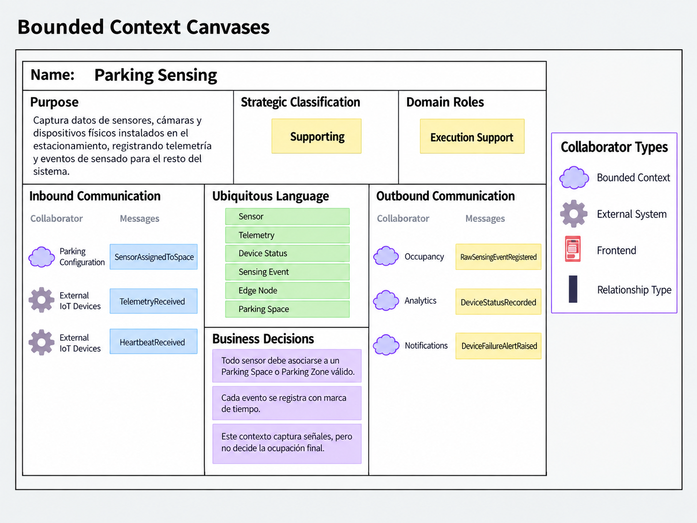

**Occupancy:**

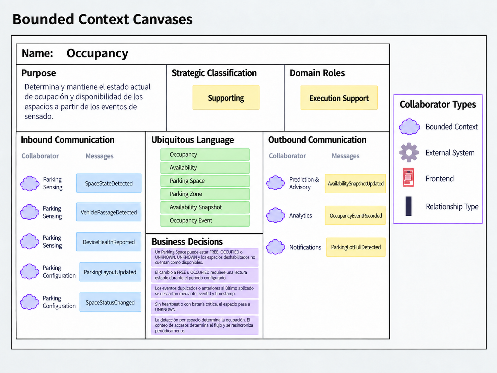

**Prediction & Advisory:**

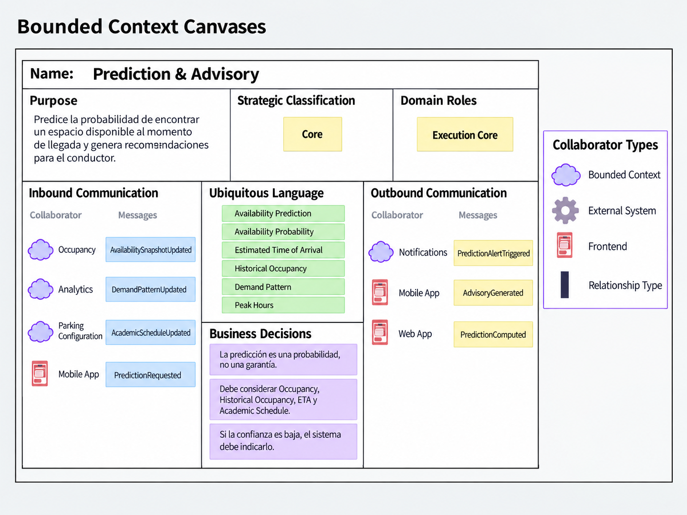

**Parking Configuration:**

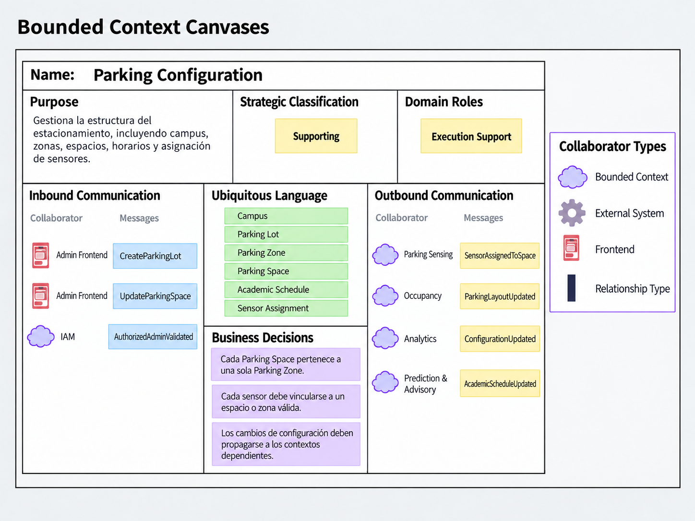

**Notifications:**

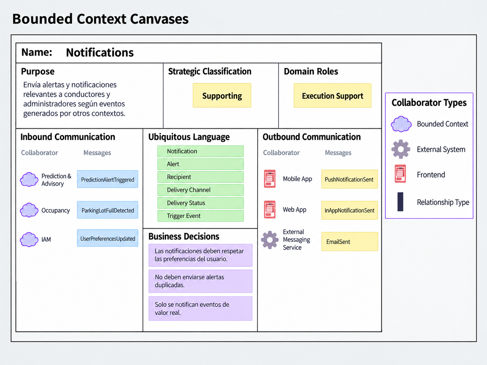

**Analytics:**

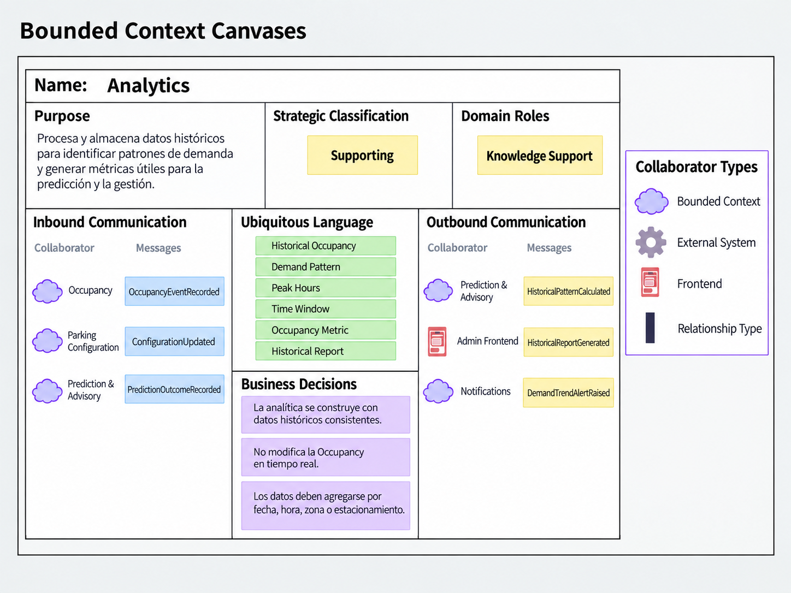

**IAM:**

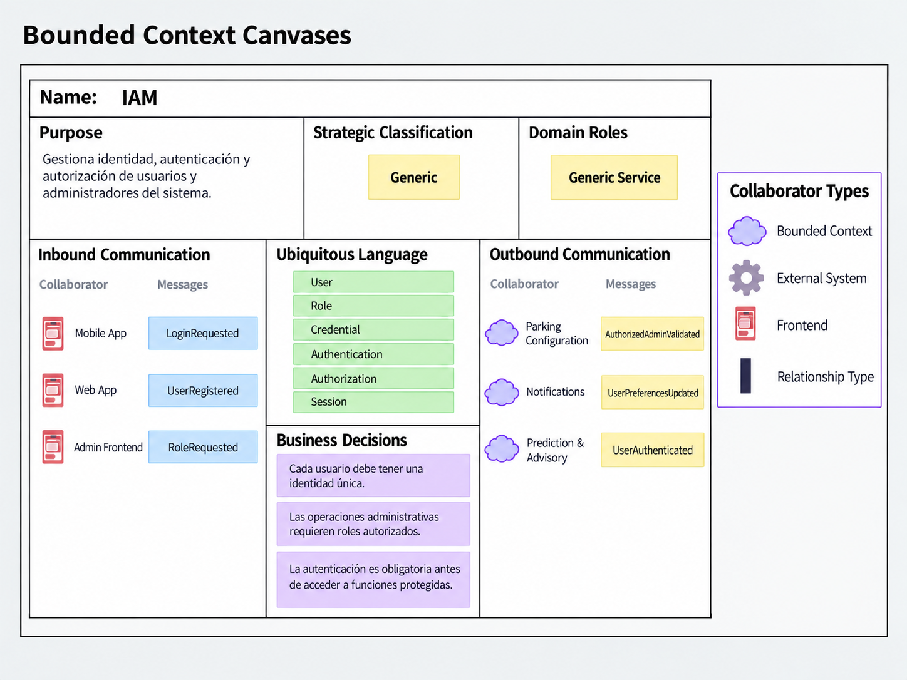

### 4.2.5. Context Mapping

En esta sección se desarrollan distintas alternativas de Context Mapping para representar las relaciones entre los bounded contexts definidos para Quadrapp. El objetivo es evaluar cómo deben comunicarse entre sí, qué nivel de dependencia es adecuado y qué patrones de relación permiten mantener una arquitectura modular y alineada con las responsabilidades de cada contexto.

Para este análisis se consideran los bounded contexts Parking Sensing, Occupancy, Prediction & Advisory, Parking Configuration, Notifications, Analytics e IAM, junto con patrones de Domain-Driven Design como Customer/Supplier, Conformist, Shared Kernel y Anti-Corruption Layer.

**Opción 1 – Contextos independientes con relaciones directas:**
Se mantienen los siete bounded contexts completamente separados y se establecen relaciones directas entre aquellos que necesitan intercambiar información. La mayor parte de las dependencias utilizan el patrón Customer/Supplier, donde un contexto proporciona información que otro requiere para ejecutar sus responsabilidades.

Parking Configuration proporciona la estructura del estacionamiento a Parking Sensing y Occupancy. Luego, Parking Sensing transmite los eventos obtenidos de sensores a Occupancy, que determina la disponibilidad actual de los espacios.

A partir de dicha información, Occupancy proporciona el estado actual a Prediction & Advisory y registra los eventos correspondientes en Analytics. Analytics procesa la información histórica y entrega patrones de demanda a Prediction & Advisory. Finalmente, las recomendaciones y alertas generadas por este último contexto son enviadas a Notifications.

Por otro lado, IAM funciona como una capacidad transversal de identidad y autorización, por lo que los contextos que requieren información del usuario adoptan su modelo mediante una relación Conformist.

Ventajas:
- Mantiene responsabilidades claramente separadas.
- Facilita la comprensión de las dependencias.
- Permite que cada bounded context evolucione de forma independiente.
- Evita compartir directamente modelos internos.

Desventajas:
- Existe una mayor cantidad de relaciones entre contextos.
- Los cambios en contratos de integración pueden afectar a sus consumidores.
- Puede generarse lógica repetida para transformar información entre modelos.

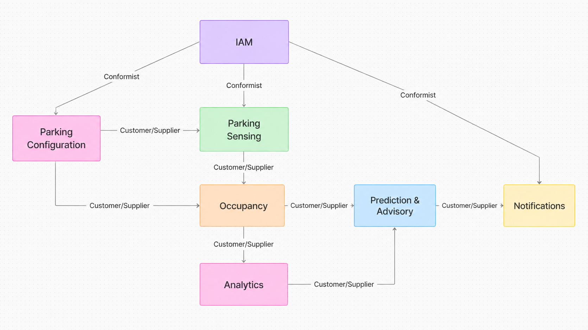

**Opción 2 – Uso de Shared Kernel entre contextos relacionados:**
Se mantiene los siete bounded contexts, pero propone compartir ciertos conceptos entre aquellos que trabajan con información estrechamente relacionada. 

En este caso, Parking Sensing y Occupancy compartirían un Shared Kernel asociado a la representación de eventos y espacios del estacionamiento. De manera similar, Occupancy y Analytics compartirían conceptos relacionados con los eventos de ocupación y su representación histórica.

El resto de relaciones mantendría principalmente el patrón Customer/Supplier. Parking Configuration continuaría proporcionando la estructura del estacionamiento, mientras que Occupancy y Analytics suministrarían información actual e histórica respectivamente a Prediction & Advisory. Este último enviaría los resultados relevantes a Notifications.
IAM continuaría operando como contexto genérico y los demás contextos se adaptarían a su modelo mediante relaciones Conformist.

Ventajas:
- Reduce la duplicación de conceptos entre contextos relacionados.
- Disminuye la necesidad de transformar información.
- Simplifica algunas comunicaciones internas.
- Puede facilitar la implementación inicial.

Desventajas:
- Incrementa el acoplamiento entre bounded contexts.
- Los cambios en un modelo compartido pueden afectar a varios contextos.
- Reduce la independencia de evolución de los módulos.
- Puede difuminar los límites del dominio si se comparte demasiada información.
Aunque esta alternativa simplifica ciertas integraciones, el uso excesivo de Shared Kernel puede hacer que los bounded contexts pierdan parte de la autonomía que se busca mediante Domain-Driven Design.

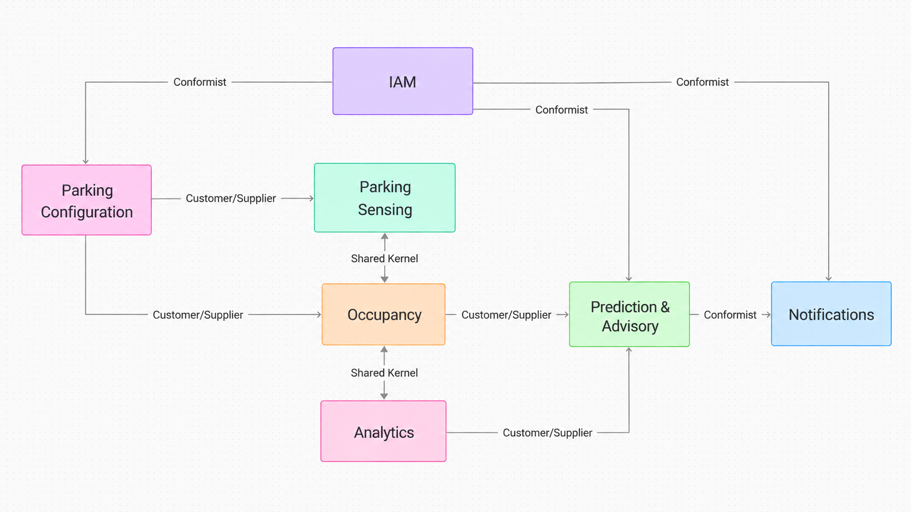

**Opción 3 – Contextos independientes con protección de modelos:**
Se mantiene los bounded contexts independientes, pero introduce mecanismos para proteger los modelos internos cuando existen diferencias importantes entre ellos.

La principal decisión es utilizar una Anti-Corruption Layer entre Parking Sensing y Occupancy. Parking Sensing trabaja con elementos técnicos como sensores, telemetría, señales y eventos de dispositivos, mientras que Occupancy trabaja con conceptos del negocio como ocupación, disponibilidad y estado de los espacios.

La Anti-Corruption Layer se encarga de transformar los eventos técnicos provenientes del sensado en información comprensible para el dominio de Occupancy. De esta manera, Occupancy no necesita conocer los detalles de implementación de los sensores y puede evolucionar independientemente de la tecnología utilizada para capturar los datos.
Parking Configuration mantiene relaciones Customer/Supplier con Parking Sensing, Occupancy y Analytics, proporcionando información sobre campus, estacionamientos, zonas y espacios.

Entre Occupancy y Analytics se propone un Shared Kernel limitado, debido a que ambos contextos necesitan una representación consistente de determinados datos históricos de ocupación. Su alcance debe mantenerse reducido para evitar generar una dependencia excesiva.

Occupancy proporciona información actual de disponibilidad a Prediction & Advisory, mientras que Analytics aporta patrones históricos y tendencias de demanda. De esta manera, Prediction & Advisory puede combinar información actual e histórica para generar las predicciones de disponibilidad y recomendaciones al conductor.

Posteriormente, Prediction & Advisory se comunica con Notifications mediante una relación Customer/Supplier para solicitar el envío de alertas o recomendaciones relevantes.
Finalmente, IAM se mantiene como contexto genérico. Los contextos que requieren identidad, autenticación o autorización utilizan su modelo mediante una relación Conformist, evitando replicar responsabilidades relacionadas con seguridad.

Ventajas:
- Mantiene una clara separación de responsabilidades.
- Protege el modelo de Occupancy de detalles técnicos del IoT.
- Permite modificar sensores o mecanismos de captura sin afectar directamente al dominio.
- Mantiene Prediction & Advisory independiente de la infraestructura de sensado.
- Facilita la escalabilidad y evolución de cada contexto.

Desventajas:
- Requiere implementar una capa adicional de traducción.
- Aumenta ligeramente la complejidad de integración.
- El Shared Kernel entre Occupancy y Analytics requiere coordinación entre ambos contextos.
- Implica un mayor esfuerzo inicial de diseño.

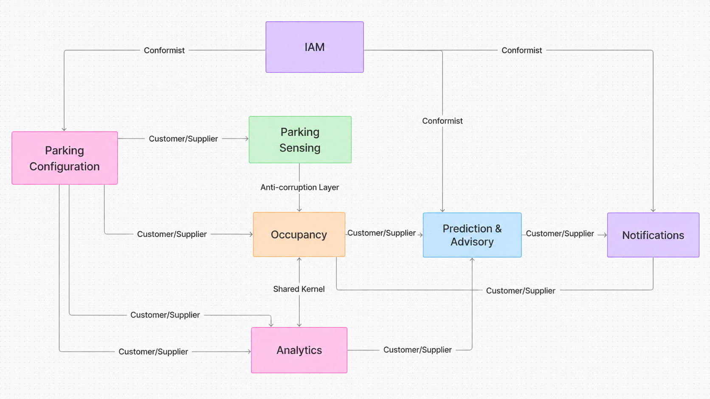

**Elección:**
Hemos seleccionado la opción 3 debido a que proporciona el mejor equilibrio entre separación de responsabilidades, independencia de los bounded contexts y control de las dependencias.

La relación mediante Anti-Corruption Layer entre Parking Sensing y Occupancy es especialmente importante, ya que evita que conceptos técnicos como telemetría, sensores o dispositivos Edge formen parte directamente del modelo de ocupación. Esto permite que la tecnología de sensado pueda evolucionar sin alterar las reglas de negocio asociadas a la disponibilidad de los estacionamientos.

Asimismo, el uso limitado de Shared Kernel entre Occupancy y Analytics permite mantener consistencia sobre los datos históricos de ocupación que ambos contextos necesitan, sin compartir modelos innecesarios con el resto de la solución.

Por otro lado, Prediction & Advisory se mantiene como el Core Domain de Quadrapp, ya que concentra el principal diferencial de la solución: estimar la probabilidad de encontrar un espacio disponible al momento de llegada y generar recomendaciones para el conductor a partir de información actual e histórica.

En conjunto, esta alternativa permite que cada bounded context mantenga un propósito específico y pueda evolucionar de manera independiente, mientras las relaciones entre ellos permanecen claramente definidas y controladas.

## 4.3. Software Architecture

### 4.3.1. Software Architecture System Landscape Diagram

Representa el ecosistema general de Quadrapp, identificando los actores y sistemas externos con los que interactúa, así como sus principales relaciones y límites.

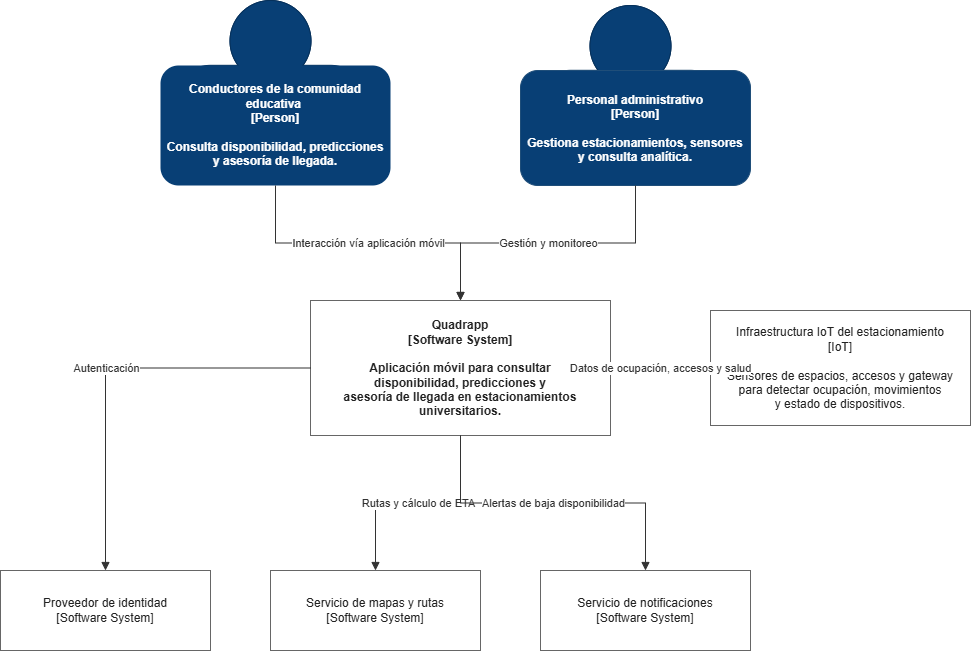

### 4.3.2. Software Architecture Context Level Diagrams

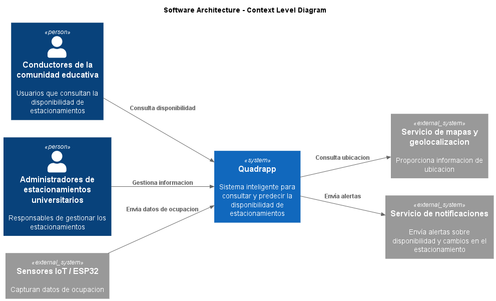

### 4.3.3. Software Architecture Container Level Diagrams

*Pendiente de elaboración.*

### 4.3.4. Software Architecture Deployment Diagrams

*Pendiente de elaboración.*

---

# Conclusiones

## Conclusiones y recomendaciones

*Pendiente de elaboración.*

## Video About-the-Team

*Pendiente de elaboración.*

---

# Bibliografía

*Pendiente de elaboración.*

---

# Anexos

## Videos de Exposiciones

| Entrega | Enlace al video |
| --- | --- |
| AV1 | Por completar |
