# Informe de Trabajo Final

<div align="center">
  
</div>

| Campo | Información |
| --- | --- |
| Universidad | Universidad Peruana de Ciencias Aplicadas |
| Carrera | Ingeniería de Software |
| Ciclo | 202620 |
| Curso | 1ASI0728 — Arquitecturas de Software Emergentes |
| Sección | 9056 |
| Profesor | Enrique Alejandro Valdivia Verde |
| Startup | Integra Labs |
| Producto | Quadrapp |
| Mes y año | Octubre, 2026 |

**Integrantes**

| Nombres y apellidos | Código de estudiante |
| --- | --- |
| Becerra Tejeda, Alessandra Nicole | u202318947 |
| Bejarano Martinez, Alvaro Leandro | U202311640 |
| Melgarejo Gomez, Marcia Victoria | U20231C505 |
| Nanfuñay Liza, Pedro Jesus | u202215462 |
| Sulca Sanchez, Piero Angel | u202423711 |

---

# Registro de Versiones del Informe

| Versión | Fecha | Autor | Descripción de modificación |
| --- | --- | --- | --- |
| 1.0 | 2026-09-15 | Sulca Sanchez, Piero Angel | Estructura inicial del informe para el primer hito, con la carátula, el registro de versiones, el contenido y las plantillas de los capítulos. |
| 1.1 | 2026-09-16 | Nanfuñay Liza, Pedro Jesus | Incorporación del Lean UX Process (problem statements, assumptions, hypothesis statements y canvas) y del análisis competitivo con sus estrategias y tácticas. |
| 1.2 | 2026-09-19 | Melgarejo Gomez, Marcia Victoria | Incorporación del As-is y el To-be Scenario Mapping, el Ubiquitous Language y el Design Purpose del diseño estratégico. |
| 1.3 | 2026-09-19 | Becerra Tejeda, Alessandra Nicole | Incorporación de las User Stories, las Epics, las Technical Stories y el análisis de antecedentes con 5W y 2H. |
| 1.4 | 2026-09-19 | Bejarano Martinez, Alvaro Leandro | Incorporación de los segmentos objetivo, los User Personas, la User Task Matrix, el Empathy Mapping y el EventStorming con el descubrimiento de contextos candidatos. |
| 1.5 | 2026-09-19 | Sulca Sanchez, Piero Angel | Unificación del informe en un único archivo `README.md`, eliminación del generador y actualización de la guía de contribución con el flujo de trabajo del equipo. |
| 1.6 | 2026-09-19 | Sulca Sanchez, Piero Angel | Incorporación de la descripción de la startup, del diseño de entrevistas y del registro y análisis de las entrevistas realizadas. |
| 1.7 | 2026-09-19 | Sulca Sanchez, Piero Angel | Reescritura de las User Stories en un único cuadro con las historias de la Landing Page y los criterios de request y response en las Technical Stories, e incorporación del Product Backlog priorizado por valor de negocio. |
| 1.8 | 2026-09-19 | Nanfuñay Liza, Pedro Jesus | Incorporación de los Bounded Context Canvases y del Context Mapping, y corrección del alcance en el análisis competitivo y en el Lean UX. |
| 1.9 | 2026-09-19 | Melgarejo Gomez, Marcia Victoria | Reescritura de los Quality Attribute Scenarios y elaboración de la funcionalidad primaria, el Architectural Drivers Backlog y las decisiones de diseño. |
| 1.10 | 2026-09-19 | Sulca Sanchez, Piero Angel | Consolidación de los Constraints como Technical Stories, incorporación del Impact Mapping y ajuste del Architectural Drivers Backlog con la totalidad de las restricciones. |
| 1.11 | 2026-09-19 | Becerra Tejeda, Alessandra Nicole | Incorporación de los diagramas de arquitectura de software a nivel de contexto y de paisaje del sistema. |
| 1.12 | 2026-09-19 | Equipo Integra Labs | Consolidación del Student Outcome, el avance de conclusiones y el registro de colaboración para la entrega del primer hito. |
| 1.13 | 2026-09-20 | Sulca Sanchez, Piero Angel | Incorporación de los diagramas de contenedores y de despliegue, de la evidencia de colaboración de GitHub y del enlace al video de exposición del primer hito, y corrección de la tabla de contenido. |
| 2.0 | 2026-09-30 | Nanfuñay Liza, Pedro Jesus | Incorporación de la estructura de los capítulos V y VI para el segundo hito. |
| 2.1 | 2026-10-02 | Nanfuñay Liza, Pedro Jesus | Incorporación del diseño táctico del Bounded Context Analytics, con sus capas y diagramas. |
| 2.2 | 2026-10-02 | Nanfuñay Liza, Pedro Jesus | Incorporación de la Information Architecture: Organization, Labeling y Searching Systems, SEO Tags and Meta Tags y Navigation Systems. |
| 2.3 | 2026-10-05 | Nanfuñay Liza, Pedro Jesus | Corrección de los Bounded Context Canvases y del Context Mapping a partir de la retroalimentación del primer hito. |
| 2.4 | 2026-10-07 | Nanfuñay Liza, Pedro Jesus | Corrección del registro de entrevistas con el distrito, el inicio y la duración de cada grabación, y actualización de su foto en los perfiles del equipo. |
| 2.5 | 2026-10-08 | Becerra Tejeda, Alessandra Nicole | Incorporación de las Style Guidelines generales y para web, mobile y dispositivos, con el branding, la paleta de colores y los criterios de accesibilidad. |
| 2.6 | 2026-10-08 | Becerra Tejeda, Alessandra Nicole | Corrección de la explicación de los diagramas de paisaje y de contexto, y del registro de su entrevista con el distrito y el inicio de la grabación. |
| 2.7 | 2026-10-09 | Melgarejo Gomez, Marcia Victoria | Incorporación del diseño táctico del Bounded Context Prediction & Advisory, con sus capas y diagramas. |
| 2.8 | 2026-10-09 | Melgarejo Gomez, Marcia Victoria | Incorporación de los wireframes y wireflows de la aplicación móvil y de la consola de operación. |
| 2.9 | 2026-10-09 | Becerra Tejeda, Alessandra Nicole | Incorporación del diseño táctico de los Bounded Contexts IAM y Notifications, con sus capas y diagramas, y de sus acciones del segundo hito en el Student Outcome. |
| 2.10 | 2026-10-09 | Sulca Sanchez, Piero Angel | Revisión de los artefactos del primer hito según la retroalimentación del docente: EventStorming en diez pasos, Candidate Context Discovery en tres iteraciones y cinco Domain Message Flows numerados, con el enlace al tablero de diseño estratégico en los anexos. |
| 2.11 | 2026-10-09 | Sulca Sanchez, Piero Angel | Revisión de los Bounded Context Canvases y de las tres alternativas de Context Mapping, unificados en la misma herramienta del EventStorming según la retroalimentación del docente. |
| 2.12 | 2026-10-09 | Sulca Sanchez, Piero Angel | Revisión de coherencia del informe con la arquitectura de monolito modular: decisiones del ADD, diagramas C4 en Structurizr, To-Be Scenario Mapping, diagramas de componentes, clases y base de datos del capítulo V, y canales del capítulo VI. |
| 2.13 | 2026-10-09 | Sulca Sanchez, Piero Angel | Incorporación del diseño táctico de los Bounded Contexts Parking Configuration, Parking Sensing y Occupancy, y revisión de coherencia de IAM (rol de operador) y de Prediction & Advisory (eventos del campus) con esos contextos. |
| 2.14 | 2026-10-09 | Sulca Sanchez, Piero Angel | Actualización del Registro de Versiones, del Project Report Collaboration Insights, del Student Outcome y de la tabla de contenido para el segundo hito, y restauración del encabezado de conclusiones. |
| 2.15 | 2026-10-09 | Sulca Sanchez, Piero Angel | Incorporación del Landing Page UI Design, con el wireframe y el mock-up para Desktop Web Browser diseñados por Bejarano Martinez, Alvaro Leandro, y del enlace a la Landing Page implementada. |
| 2.16 | 2026-10-09 | Sulca Sanchez, Piero Angel | Revisión de coherencia del diseño de base de datos y del diagrama de clases de Analytics: descripción de los diagramas en lugar de esquemas en texto y alineación con PostgreSQL. |
| 2.17 | 2026-10-09 | Sulca Sanchez, Piero Angel | Revisión de coherencia del capítulo VI: wireframes de escritorio de la consola de operación para el inventario de dispositivos y Wireflow 9, adaptados al alcance de una institución a partir de las pantallas de plataforma del archivo de Figma. |

# Project Report Collaboration Insights

El informe se elabora de forma colaborativa en el repositorio [https://github.com/1ASI0728-2620-9056-Quadrapp/quadrapp-project-report](https://github.com/1ASI0728-2620-9056-Quadrapp/quadrapp-project-report), alojado en la organización de GitHub del equipo.

**Organización del trabajo en el primer hito.** El equipo distribuyó las secciones del informe por integrante y acordó un flujo de trabajo común, documentado en la guía de contribución del repositorio: cada integrante trabaja en una rama `feature/` nombrada por la tarea, registra sus cambios con Conventional Commits en inglés y abre un Pull Request hacia `develop`, que se integra mediante merge commit para conservar la autoría de cada aporte. El informe se mantiene en un único archivo `README.md`, lo que exige que cada integrante intervenga solamente en las secciones que le corresponden y actualice su rama antes de integrar.

**Aportes por integrante en esta entrega.**

| Integrante | Secciones elaboradas |
| --- | --- |
| Becerra Tejeda, Alessandra Nicole | Antecedentes y problemática con 5W y 2H, User Stories, Epics y Technical Stories, y los diagramas de arquitectura a nivel de paisaje del sistema y de contexto. |
| Bejarano Martinez, Alvaro Leandro | Segmentos objetivo, User Personas, User Task Matrix, Empathy Mapping, EventStorming, Candidate Context Discovery y Domain Message Flows Modeling. |
| Melgarejo Gomez, Marcia Victoria | As-is y To-be Scenario Mapping, Ubiquitous Language, Design Purpose, Quality Attribute Scenarios, funcionalidad primaria, Architectural Drivers Backlog y decisiones de diseño. |
| Nanfuñay Liza, Pedro Jesus | Lean UX Process, análisis competitivo con sus estrategias y tácticas, Bounded Context Canvases y Context Mapping. |
| Sulca Sanchez, Piero Angel | Descripción de la startup, diseño, registro y análisis de entrevistas, Impact Mapping, Product Backlog, Constraints, diagramas de contenedores y de despliegue, configuración del repositorio y guía de contribución. |

**Evidencias de colaboración.** Al cierre del primer hito, el repositorio registra 29 Pull Requests integrados y commits de los cinco integrantes, realizados entre el 15 y el 19 de setiembre de 2026 con su propia identidad de Git. El analítico de contribuciones de GitHub confirma la participación de todo el equipo en la elaboración del informe.

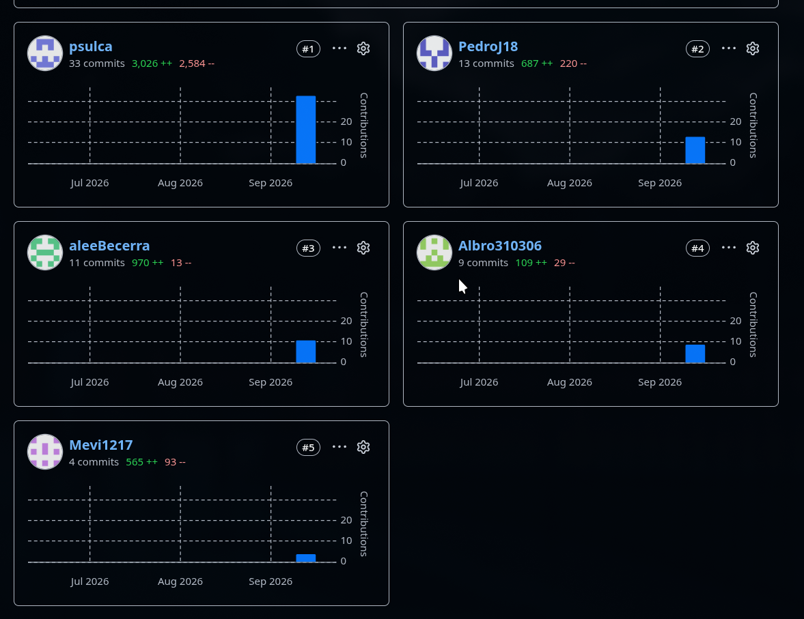

*Figura: analítico de Contributors del repositorio al cierre del primer hito. Registra 33 commits de Sulca Sanchez, 13 de Nanfuñay Liza, 11 de Becerra Tejeda, 9 de Bejarano Martinez y 4 de Melgarejo Gomez, lo que corresponde con los aportes descritos en el Registro de Versiones del Informe.*

**Organización del trabajo en el segundo hito (TB1).** El equipo distribuyó el diseño táctico del capítulo V por bounded context y el capítulo VI por sección, y atendió en las secciones afectadas la retroalimentación recibida en el primer hito. Se mantuvo el flujo de trabajo del primer hito: ramas `feature/` y `fix/` por tarea, commits con Conventional Commits y la identidad de Git de cada integrante, e integración en `develop`. En paralelo, se inició la implementación de la Landing Page en el repositorio [https://github.com/1ASI0728-2620-9056-Quadrapp/Landing_Page](https://github.com/1ASI0728-2620-9056-Quadrapp/Landing_Page) de la organización. Las correcciones del capítulo IV se rehicieron con una sola herramienta por artefacto para mantener la coherencia entre ellos: Excalidraw para el EventStorming, los contextos candidatos, los message flows, los canvases y el context map, y Structurizr para los diagramas C4. El diseño táctico se elaboró sobre los contratos que fija el capítulo IV, es decir, los eventos publicados y las fachadas entre contextos, para que cada bounded context del capítulo V sea consistente con los demás.

**Aportes por integrante en el segundo hito.**

| Integrante | Secciones elaboradas o corregidas |
| --- | --- |
| Bejarano Martinez, Alvaro Leandro | Diseño del wireframe y del mock-up de la Landing Page en Figma, incorporados en la sección 6.3, e implementación inicial de la Landing Page en el repositorio `Landing_Page` (commit del 9 de octubre de 2026). |
| Becerra Tejeda, Alessandra Nicole | Diseño táctico de los Bounded Contexts IAM y Notifications; Style Guidelines generales y para web, mobile y dispositivos; corrección de la explicación de los diagramas de paisaje y de contexto y del registro de su entrevista. |
| Melgarejo Gomez, Marcia Victoria | Diseño táctico del Bounded Context Prediction & Advisory; wireframes y wireflows de la aplicación móvil y de la consola de operación. |
| Nanfuñay Liza, Pedro Jesus | Estructura de los capítulos V y VI; diseño táctico del Bounded Context Analytics; Information Architecture; corrección de los Bounded Context Canvases, del Context Mapping y del registro de entrevistas. |
| Sulca Sanchez, Piero Angel | Diseño táctico de los Bounded Contexts Parking Configuration, Parking Sensing y Occupancy; incorporación de la Landing Page UI Design con el diseño de Bejarano Martinez; actualización del Registro de Versiones, del Collaboration Insights, del Student Outcome y de la tabla de contenido; y revisión de coherencia del informe como coordinador del equipo: artefactos del capítulo IV observados en el primer hito, arquitectura y diagramas C4, diagramas de los demás bounded contexts y wireframes de la consola. |

**Evidencias de colaboración del segundo hito.** Entre el 30 de setiembre y el 9 de octubre de 2026, el repositorio del informe registra commits de cuatro integrantes, realizados con su propia identidad de Git: 32 de Becerra Tejeda, 24 de Sulca Sanchez, 10 de Nanfuñay Liza y 8 de Melgarejo Gomez. Estos commits corresponden a las versiones 2.0 a 2.17 del Registro de Versiones del Informe. El aporte de Bejarano Martinez en este hito se registra en el repositorio `Landing_Page`.

# Contenido

- [Registro de Versiones del Informe](#registro-de-versiones-del-informe)
- [Project Report Collaboration Insights](#project-report-collaboration-insights)
- [Student Outcome](#student-outcome)
- [Capítulo I: Introducción](#capítulo-i-introducción)
  - [1.1. Startup Profile](#11-startup-profile)
    - [1.1.1. Descripción de la Startup](#111-descripción-de-la-startup)
    - [1.1.2. Perfiles de integrantes del equipo](#112-perfiles-de-integrantes-del-equipo)
  - [1.2. Solution Profile](#12-solution-profile)
    - [1.2.1. Antecedentes y problemática](#121-antecedentes-y-problemática)
      - [Antecedentes](#antecedentes)
      - [Problemática (5Ws y 2Hs)](#problemática-5ws-y-2hs)
    - [1.2.2. Lean UX Process](#122-lean-ux-process)
      - [1.2.2.1. Lean UX Problem Statements](#1221-lean-ux-problem-statements)
      - [1.2.2.2. Lean UX Assumptions](#1222-lean-ux-assumptions)
      - [1.2.2.3. Lean UX Hypothesis Statements](#1223-lean-ux-hypothesis-statements)
      - [1.2.2.4. Lean UX Canvas](#1224-lean-ux-canvas)
  - [1.3. Segmentos objetivo](#13-segmentos-objetivo)
- [Capítulo II: Requirements Elicitation &amp; Analysis](#capítulo-ii-requirements-elicitation--analysis)
  - [2.1. Competidores](#21-competidores)
    - [2.1.1. Análisis competitivo](#211-análisis-competitivo)
    - [2.1.2. Estrategias y tácticas frente a competidores](#212-estrategias-y-tácticas-frente-a-competidores)
  - [2.2. Entrevistas](#22-entrevistas)
    - [2.2.1. Diseño de entrevistas](#221-diseño-de-entrevistas)
    - [2.2.2. Registro de entrevistas](#222-registro-de-entrevistas)
    - [2.2.3. Análisis de entrevistas](#223-análisis-de-entrevistas)
  - [2.3. Needfinding](#23-needfinding)
    - [2.3.1. User Personas](#231-user-personas)
    - [2.3.2. User Task Matrix](#232-user-task-matrix)
    - [2.3.3. Empathy Mapping](#233-empathy-mapping)
    - [2.3.4. As-is Scenario Mapping](#234-as-is-scenario-mapping)
  - [2.4. Ubiquitous Language](#24-ubiquitous-language)
- [Capítulo III: Requirements Specification](#capítulo-iii-requirements-specification)
  - [3.1. To-Be Scenario Mapping](#31-to-be-scenario-mapping)
  - [3.2. User Stories](#32-user-stories)
  - [3.3. Impact Mapping](#33-impact-mapping)
  - [3.4. Product Backlog](#34-product-backlog)
- [Capítulo IV: Strategic-Level Software Design](#capítulo-iv-strategic-level-software-design)
  - [4.1. Strategic-Level Attribute-Driven Design](#41-strategic-level-attribute-driven-design)
    - [4.1.1. Design Purpose](#411-design-purpose)
    - [4.1.2. Attribute-Driven Design Inputs](#412-attribute-driven-design-inputs)
      - [4.1.2.1. Primary Functionality (Primary User Stories)](#4121-primary-functionality-primary-user-stories)
      - [4.1.2.2. Quality Attribute Scenarios](#4122-quality-attribute-scenarios)
      - [4.1.2.3. Constraints](#4123-constraints)
    - [4.1.3. Architectural Drivers Backlog](#413-architectural-drivers-backlog)
    - [4.1.4. Architectural Design Decisions](#414-architectural-design-decisions)
    - [4.1.5. Quality Attribute Scenario Refinements](#415-quality-attribute-scenario-refinements)
  - [4.2. Strategic-Level Domain-Driven Design](#42-strategic-level-domain-driven-design)
    - [4.2.1. EventStorming](#421-eventstorming)
    - [4.2.2. Candidate Context Discovery](#422-candidate-context-discovery)
    - [4.2.3. Domain Message Flows Modeling](#423-domain-message-flows-modeling)
    - [4.2.4. Bounded Context Canvases](#424-bounded-context-canvases)
    - [4.2.5. Context Mapping](#425-context-mapping)
  - [4.3. Software Architecture](#43-software-architecture)
    - [4.3.1. Software Architecture System Landscape Diagram](#431-software-architecture-system-landscape-diagram)
    - [4.3.2. Software Architecture Context Level Diagrams](#432-software-architecture-context-level-diagrams)
    - [4.3.3. Software Architecture Container Level Diagrams](#433-software-architecture-container-level-diagrams)
    - [4.3.4. Software Architecture Deployment Diagrams](#434-software-architecture-deployment-diagrams)
- [Capítulo V: Tactical-Level Software Design](#capítulo-v-tactical-level-software-design)
  - [5.1. Bounded Context: IAM](#51-bounded-context-iam)
    - [5.1.1. Domain Layer](#511-domain-layer)
    - [5.1.2. Interface Layer](#512-interface-layer)
    - [5.1.3. Application Layer](#513-application-layer)
    - [5.1.4. Infrastructure Layer](#514-infrastructure-layer)
    - [5.1.6. Bounded Context Software Architecture Component Level Diagrams](#516-bounded-context-software-architecture-component-level-diagrams)
    - [5.1.7. Bounded Context Software Architecture Code Level Diagrams](#517-bounded-context-software-architecture-code-level-diagrams)
      - [5.1.7.1. Bounded Context Domain Layer Class Diagrams](#5171-bounded-context-domain-layer-class-diagrams)
      - [5.1.7.2. Bounded Context Database Design Diagram](#5172-bounded-context-database-design-diagram)
  - [5.2. Bounded Context: Parking Configuration](#52-bounded-context-parking-configuration)
    - [5.2.1. Domain Layer](#521-domain-layer)
    - [5.2.2. Interface Layer](#522-interface-layer)
    - [5.2.3. Application Layer](#523-application-layer)
    - [5.2.4. Infrastructure Layer](#524-infrastructure-layer)
    - [5.2.6. Bounded Context Software Architecture Component Level Diagrams](#526-bounded-context-software-architecture-component-level-diagrams)
    - [5.2.7. Bounded Context Software Architecture Code Level Diagrams](#527-bounded-context-software-architecture-code-level-diagrams)
      - [5.2.7.1. Bounded Context Domain Layer Class Diagrams](#5271-bounded-context-domain-layer-class-diagrams)
      - [5.2.7.2. Bounded Context Database Design Diagram](#5272-bounded-context-database-design-diagram)
  - [5.3. Bounded Context: Parking Sensing](#53-bounded-context-parking-sensing)
    - [5.3.1. Domain Layer](#531-domain-layer)
    - [5.3.2. Interface Layer](#532-interface-layer)
    - [5.3.3. Application Layer](#533-application-layer)
    - [5.3.4. Infrastructure Layer](#534-infrastructure-layer)
    - [5.3.6. Bounded Context Software Architecture Component Level Diagrams](#536-bounded-context-software-architecture-component-level-diagrams)
    - [5.3.7. Bounded Context Software Architecture Code Level Diagrams](#537-bounded-context-software-architecture-code-level-diagrams)
      - [5.3.7.1. Bounded Context Domain Layer Class Diagrams](#5371-bounded-context-domain-layer-class-diagrams)
      - [5.3.7.2. Bounded Context Database Design Diagram](#5372-bounded-context-database-design-diagram)
  - [5.4. Bounded Context: Occupancy](#54-bounded-context-occupancy)
    - [5.4.1. Domain Layer](#541-domain-layer)
    - [5.4.2. Interface Layer](#542-interface-layer)
    - [5.4.3. Application Layer](#543-application-layer)
    - [5.4.4. Infrastructure Layer](#544-infrastructure-layer)
    - [5.4.6. Bounded Context Software Architecture Component Level Diagrams](#546-bounded-context-software-architecture-component-level-diagrams)
    - [5.4.7. Bounded Context Software Architecture Code Level Diagrams](#547-bounded-context-software-architecture-code-level-diagrams)
      - [5.4.7.1. Bounded Context Domain Layer Class Diagrams](#5471-bounded-context-domain-layer-class-diagrams)
      - [5.4.7.2. Bounded Context Database Design Diagram](#5472-bounded-context-database-design-diagram)
  - [5.5. Bounded Context: Prediction & Advisory](#55-bounded-context-prediction--advisory)
    - [5.5.1. Domain Layer](#551-domain-layer)
    - [5.5.2. Interface Layer](#552-interface-layer)
    - [5.5.3. Application Layer](#553-application-layer)
    - [5.5.4. Infrastructure Layer](#554-infrastructure-layer)
    - [5.5.6. Bounded Context Software Architecture Component Level Diagrams](#556-bounded-context-software-architecture-component-level-diagrams)
    - [5.5.7. Bounded Context Software Architecture Code Level Diagrams](#557-bounded-context-software-architecture-code-level-diagrams)
      - [5.5.7.1. Bounded Context Domain Layer Class Diagrams](#5571-bounded-context-domain-layer-class-diagrams)
      - [5.5.7.2. Bounded Context Database Design Diagram](#5572-bounded-context-database-design-diagram)
  - [5.6. Bounded Context: Analytics](#56-bounded-context-analytics)
    - [5.6.1. Domain Layer](#561-domain-layer)
    - [5.6.2. Interface Layer](#562-interface-layer)
    - [5.6.3. Application Layer](#563-application-layer)
    - [5.6.4. Infrastructure Layer](#564-infrastructure-layer)
    - [5.6.6. Bounded Context Software Architecture Component Level Diagrams](#566-bounded-context-software-architecture-component-level-diagrams)
    - [5.6.7. Bounded Context Software Architecture Code Level Diagrams](#567-bounded-context-software-architecture-code-level-diagrams)
      - [5.6.7.1. Bounded Context Domain Layer Class Diagrams](#5671-bounded-context-domain-layer-class-diagrams)
      - [5.6.7.2. Bounded Context Database Design Diagram](#5672-bounded-context-database-design-diagram)
  - [5.7. Bounded Context: Notifications](#57-bounded-context-notifications)
    - [5.7.1. Domain Layer](#571-domain-layer)
    - [5.7.2. Interface Layer](#572-interface-layer)
    - [5.7.3. Application Layer](#573-application-layer)
    - [5.7.4. Infrastructure Layer](#574-infrastructure-layer)
    - [5.7.6. Bounded Context Software Architecture Component Level Diagrams](#576-bounded-context-software-architecture-component-level-diagrams)
    - [5.7.7. Bounded Context Software Architecture Code Level Diagrams](#577-bounded-context-software-architecture-code-level-diagrams)
      - [5.7.7.1. Bounded Context Domain Layer Class Diagrams](#5771-bounded-context-domain-layer-class-diagrams)
      - [5.7.7.2. Bounded Context Database Design Diagram](#5772-bounded-context-database-design-diagram)
- [Capítulo VI: Solution UX Design](#capítulo-vi-solution-ux-design)
  - [6.1. Style Guidelines](#61-style-guidelines)
    - [6.1.1. General Style Guidelines](#611-general-style-guidelines)
    - [6.1.2. Web, Mobile & Devices Style Guidelines](#612-web-mobile--devices-style-guidelines)
  - [6.2. Information Architecture](#62-information-architecture)
    - [6.2.1. Organization Systems](#621-organization-systems)
    - [6.2.2. Labeling Systems](#622-labeling-systems)
    - [6.2.3. Searching Systems](#623-searching-systems)
    - [6.2.4. SEO Tags and Meta Tags](#624-seo-tags-and-meta-tags)
    - [6.2.5. Navigation Systems](#625-navigation-systems)
  - [6.3. Landing Page UI Design](#63-landing-page-ui-design)
    - [6.3.1. Landing Page Wireframe](#631-landing-page-wireframe)
    - [6.3.2. Landing Page Mock-up](#632-landing-page-mock-up)
  - [6.4. Applications UX/UI Design](#64-applications-uxui-design)
    - [6.4.1. Applications Wireframes](#641-applications-wireframes)
    - [6.4.2. Applications Wireflow Diagrams](#642-applications-wireflow-diagrams)
- [Conclusiones](#conclusiones)
  - [Avance de conclusiones](#avance-de-conclusiones)
  - [Video About-the-Team](#video-about-the-team)
- [Bibliografía](#bibliografía)
- [Anexos](#anexos)
  - [Tablero de diseño estratégico](#tablero-de-diseño-estratégico)
  - [Enlaces a los artefactos](#enlaces-a-los-artefactos)
  - [Videos de Exposiciones](#videos-de-exposiciones)

---

# Student Outcome

El curso contribuye al cumplimiento del Student Outcome ABET:
ABET – EAC - Student Outcome 3

Criterio: Capacidad de comunicarse efectivamente con un rango de audiencias.
En el siguiente cuadro se describe las acciones realizadas y enunciados de
conclusiones por parte del grupo, que permiten sustentar el haber alcanzado el logro
del ABET – EAC - Student Outcome 3.

<table>
  <thead>
    <tr>
      <th>Criterio específico</th>
      <th>Acciones realizadas</th>
      <th>Conclusiones</th>
    </tr>
  </thead>
  <tbody>
    <tr>
      <td>Comunica oralmente sus ideas y/o resultados con objetividad a público de diferentes especialidades y niveles jerarquicos, en el marco del desarrollo de un proyecto en ingeniería.</td>
      <td>
        <p>
          <strong>Becerra Tejeda, Alessandra Nicole</strong><br>
          AV1: Logré sustentar los principales aspectos del proyecto de forma clara, ordenada y objetiva, utilizando las User Stories, el Product Backlog y la arquitectura como soporte para transmitir las ideas y resultados del proyecto.<br>
          TB1: Logré sustentar con claridad y objetividad el diseño táctico de los Bounded Contexts IAM y Notifications, con sus aggregates, capas y diagramas C4, de clases y de base de datos, y las Style Guidelines de la solución, explicando cómo las decisiones de arquitectura y de diseño se traducen en una solución implementable y consistente.
        </p>
        <p>
          <strong>Bejarano Martinez, Alvaro Leandro</strong><br>
          AV1: Logré comunicar oralmente de manera clara y objetiva los resultados obtenidos en el análisis del usuario y del dominio, presentando artefactos como Segmento Objetivo, User Persona, User Task Matrix, Empathy Mapping, Event Storming, Candidate Context Discovery y Domain Message Flows Modeling, de modo que mis compañeros pudieran comprender tanto las necesidades de los usuarios como la estructura del dominio y sus principales interacciones.<br>
          TB1: Logré sustentar el diseño de la Landing Page, explicando cómo su estructura por segmento y sus llamadas a la acción comunican la propuesta de valor de Quadrapp a conductores y a instituciones, y cómo el diseño se llevó a la versión implementada.
        </p>
        <p>
          <strong>Melgarejo Gomez, Marcia Victoria</strong><br>
          AV1: Logré exponer de forma clara y objetiva el recorrido de los usuarios con los As-is y To-Be Scenario Mapping, el lenguaje común del dominio con el Ubiquitous Language y las decisiones del Attribute-Driven Design, explicando cómo las necesidades de conductores y administradores se traducen en la arquitectura de Quadrapp.<br>
          TB1: Logré sustentar el diseño táctico del Bounded Context Prediction & Advisory, explicando cómo se generan los pronósticos, cómo se deriva la asesoría de llegada a partir del tiempo estimado y cómo los wireframes y wireflows llevan esas capacidades a la experiencia del conductor y del administrador.
        </p>
        <p>
          <strong>Nanfuñay Liza, Pedro Jesus</strong><br>
          AV1: Logré comunicarme eficazmente con mis compañeros para delimitar el alcance del proyecto, exponer las características de la solución, aplicando buenas prácticas en artefactos como Lean UX Process, Análisis Competitivo y Bounded Context Canvases, lo que me permitió dar a conocer a fondos la arquitectura que seguirá nuestra solución.<br>
          TB1: Logré sustentar el diseño táctico del Bounded Context Analytics y la Information Architecture de la solución, explicando cómo se mide la precisión de las predicciones y cómo los sistemas de organización, etiquetado, búsqueda y navegación orientan a cada tipo de usuario.
        </p>
        <p>
          <strong>Sulca Sanchez, Piero Angel</strong><br>
          AV1: Logré exponer de forma clara y objetiva el alcance del producto y su priorización, presentando el Diseño y Análisis de Entrevistas, las User Stories, el Impact Mapping y el Product Backlog, de modo que el equipo comprendiera por qué el orden del backlog responde al valor para el negocio.<br>
          TB1: Logré sustentar el diseño táctico de Parking Configuration, Parking Sensing y Occupancy y la revisión del diseño estratégico según la retroalimentación del primer hito, explicando cómo una lectura de un sensor se convierte en disponibilidad y por qué la arquitectura de monolito modular mantiene coherentes los capítulos IV y V.
        </p>
      </td>
      <td>
        <strong>AV1:</strong><br>
        La sustentación oral de la problemática, los requerimientos y la propuesta arquitectónica de Quadrapp permitió comunicar de manera clara y objetiva los avances del proyecto. La exposición de los artefactos elaborados facilitó que audiencias técnicas y de negocio comprendieran las necesidades de los usuarios, el alcance de la solución y las decisiones de diseño adoptadas, además de permitir la resolución de dudas mediante la retroalimentación del equipo.<br><br>
        <strong>TB1:</strong><br>
        La sustentación del diseño táctico permitió explicar, contexto por contexto, cómo se implementan las capacidades de Quadrapp, desde la lectura de un sensor hasta la asesoría de llegada que recibe el conductor. Atender la retroalimentación del primer hito obligó a explicar con mayor precisión la técnica aplicada en cada artefacto del diseño estratégico y a justificar la decisión de arquitectura ante una audiencia técnica.
      </td>
    </tr>
    <tr>
      <td>Comunica en forma escrita ideas y/o resultados con objetividad a público de diferentes especialidades y niveles jerarquicos, en el marco del desarrollo de un proyecto en ingeniería.</td>
      <td>
        <p>
          <strong>Becerra Tejeda, Alessandra Nicole</strong><br>
          AV1: Redacté y organicé parte de la información del proyecto de forma clara, coherente y objetiva, contribuyendo a la documentación de los requerimientos, la planificación del trabajo y la definición de la solución propuesta.<br>
          TB1: Redacté de forma clara y precisa el diseño táctico de los Bounded Contexts IAM y Notifications (capítulo 5) y las Style Guidelines de la solución (sección 6.1), manteniendo la trazabilidad con las historias de usuario, los drivers y los constraints, de modo que audiencias técnicas y de negocio comprendan tanto el diseño interno de los contextos como la identidad visual del producto.
        </p>
        <p>
          <strong>Bejarano Martinez, Alvaro Leandro</strong><br>
          AV1: Logré documentar por escrito, de manera clara y objetiva, los resultados del análisis del usuario y del dominio en el Segmento Objetivo, los User Personas, la User Task Matrix, el Empathy Mapping, el EventStorming, el Candidate Context Discovery y los Domain Message Flows, de modo que los lectores comprendan tanto las necesidades de los usuarios como la estructura del dominio y sus principales interacciones.<br>
          TB1: Diseñé el wireframe y el mock-up de la Landing Page y redacté su contenido para comunicar el alcance real del producto (sin reservas, sin pagos y sin rastreo de ubicación) a públicos de distinto perfil, e implementé la primera versión de la página.
        </p>
        <p>
          <strong>Melgarejo Gomez, Marcia Victoria</strong><br>
          AV1: Logré redactar de forma coherente y precisa el As-is y el To-Be Scenario Mapping, el glosario del Ubiquitous Language y el Strategic-Level Attribute-Driven Design, con sus escenarios de calidad, restricciones, drivers y decisiones, de modo que audiencias con distinta especialidad puedan entender tanto el problema como la solución propuesta.<br>
          TB1: Redacté el diseño táctico del Bounded Context Prediction & Advisory, con su diccionario de clases, sus capas y sus diagramas, y documenté los wireframes y wireflows de la aplicación móvil y de la consola de operación, manteniendo la trazabilidad con las historias de usuario.
        </p>
        <p>
          <strong>Nanfuñay Liza, Pedro Jesus</strong><br>
          AV1: Logré redactar adecuadamente los artefactos asignados de forma coherente y clara, de manera que permita comprender a diferentes tipos de público desde el valor que ofrece nuestra solución hasta la arquitectura del proyecto.<br>
          TB1: Redacté el diseño táctico del Bounded Context Analytics y la Information Architecture, y corregí los Bounded Context Canvases, el Context Mapping y el registro de entrevistas a partir de la retroalimentación del primer hito.
        </p>
        <p>
          <strong>Sulca Sanchez, Piero Angel</strong><br>
          AV1: Logré redactar de forma clara y precisa la Descripción de la Startup, el Diseño, Registro y Análisis de Entrevistas, las User Stories con sus criterios de aceptación, el Impact Mapping, el Product Backlog, los Constraints y el Architectural Drivers Backlog, de modo que audiencias con distinta especialidad comprendan los requisitos y las restricciones del proyecto.<br>
          TB1: Redacté el diseño táctico de Parking Configuration, Parking Sensing y Occupancy, con sus diccionarios de clases, capas, reglas de negocio y diagramas, y revisé la coherencia entre los capítulos IV y V, de modo que el lector pueda seguir la trazabilidad desde el EventStorming hasta las clases y tablas de cada contexto.
        </p>
      </td>
      <td>
        <strong>AV1:</strong><br>
        La documentación escrita y estructurada de la investigación, los requerimientos y el diseño estratégico de Quadrapp permitió mantener la trazabilidad entre las necesidades identificadas y la arquitectura propuesta. El uso de un lenguaje claro, artefactos consistentes y evidencias organizadas facilitó la comprensión del proyecto tanto para audiencias técnicas como de negocio.<br><br>
        <strong>TB1:</strong><br>
        La redacción del diseño táctico como diccionario de clases, con sus capas, reglas de negocio y diagramas, permitió documentar la solución con un nivel de detalle implementable. Mantener los mismos nombres de eventos, fachadas y tablas entre el capítulo IV y el capítulo V, y entre los diagramas y el texto, aseguró que lectores con distinta especialidad encuentren una misma versión coherente del sistema.
      </td>
    </tr>
  </tbody>
</table>

---

# Capítulo I: Introducción

## 1.1. Startup Profile

### 1.1.1. Descripción de la Startup

**Nombre de la Startup:** Integra Labs

En Integra Labs desarrollamos soluciones tecnológicas que conectan la infraestructura física de las instituciones educativas con herramientas digitales de gestión. Nuestro primer producto, **Quadrapp**, busca reducir la incertidumbre que experimentan los conductores al buscar estacionamiento en un campus universitario. Mediante sensores IoT instalados en los espacios y accesos del estacionamiento, la solución registra su nivel de ocupación y emplea estos datos para mostrar la disponibilidad actual y estimar las condiciones que encontrará cada conductor al llegar. Quadrapp se ofrece bajo un modelo B2B SaaS: la institución educativa contrata el servicio, su comunidad accede a la información desde una aplicación móvil y el personal responsable supervisa la operación mediante una consola web.

**Colaboraciones Estratégicas**

Para desarrollar y operar Quadrapp, establecemos alianzas con instituciones educativas y proveedores tecnológicos. Las universidades de Lima Metropolitana participan como clientes y colaboradoras en la validación de la solución, ya que facilitan entornos de prueba para instalar los sensores y contrastar la información del sistema con mediciones realizadas en campo. Asimismo, los proveedores de hardware IoT suministran los sensores y brindan soporte durante su implementación. Esta colaboración se complementa con servicios de nube, mapas y mensajería, necesarios para procesar la información, calcular el tiempo estimado de llegada y verificar los correos institucionales. La integración flexible de estos servicios permite sustituir proveedores sin comprometer la continuidad del producto.

**Innovación y Tecnología**

El valor diferencial de Quadrapp no radica únicamente en mostrar los espacios disponibles, sino en anticipar cómo evolucionará la ocupación del estacionamiento. La infraestructura de sensado instalada en los espacios y accesos proporciona información actualizada que se combina con los registros históricos, el calendario académico y los eventos del campus. A partir de estos datos, el sistema estima la ocupación para los siguientes 15, 30, 45 y 60 minutos. La aplicación relaciona estas predicciones con el tiempo estimado de llegada calculado en el dispositivo del conductor para informar la probabilidad de encontrar un espacio y ofrecer una recomendación oportuna. Respecto al trayecto del usuario, el servidor recibe únicamente el tiempo estimado en minutos y no su ubicación precisa. Este enfoque protege la privacidad y permite adaptar la tecnología de sensado a las características de cada campus.

**Visión**

> Aspiramos a que, en los próximos diez años, las comunidades universitarias de Lima Metropolitana puedan anticipar las condiciones de estacionamiento antes de dirigirse al campus y reduzcan así la incertidumbre de sus desplazamientos. A partir de esta experiencia, buscamos extender la solución a otras ciudades de la región.

**Misión**

> En Integra Labs transformamos los datos de ocupación de los estacionamientos universitarios en información oportuna y pronósticos basados en datos, para que los conductores tomen mejores decisiones antes de dirigirse al campus y el personal responsable gestione sus instalaciones con mayor eficiencia. Desarrollamos esta labor con resultados medibles, recopilando solo los datos personales indispensables y manteniendo una solución independiente de proveedores específicos de hardware.

### 1.1.2. Perfiles de integrantes del equipo

<table>
  <thead>
    <tr>
      <th>Foto</th>
      <th>Nombre completo</th>
      <th>Código</th>
      <th>Carrera</th>
      <th>Habilidades técnicas</th>
    </tr>
  </thead>
  <tbody>
    <tr>
      <td></td>
      <td>Becerra Tejeda, Alessandra Nicole</td>
      <td>u202318947</td>
      <td>Ingeniería de Software</td>
      <td>Soy estudiante de 8vo ciclo de Ingeniería de Software, interesada en el desarrollo de soluciones tecnológicas y en seguir aprendiendo. Me considero una persona responsable, adaptable y comprometida, con facilidad para trabajar en equipo, organizar tareas y asumir nuevos retos.
</td>
    </tr>
    <tr>
      <td></td>
      <td>Bejarano Martinez, Alvaro Leandro</td>
      <td>U202311640</td>
      <td>Ingeniería de Software</td>
      <td>Curso la carrera de Ingeniería de Software y me destaco por mi perseverancia, organización y capacidad para trabajar en equipo. Me esfuerzo por mantener un ambiente estructurado dentro del grupo, donde cada miembro se sienta valorado y sus ideas sean escuchadas y respetadas. Mi compromiso es fomentar la colaboración efectiva, asegurando que cada contribución se integre de manera ordenada y alineada con los objetivos comunes del equipo.</td>
    </tr>
    <tr>
      <td></td>
      <td>Melgarejo Gomez, Marcia Victoria</td>
      <td>U20231C505</td>
      <td>Ingeniería de Software</td>
      <td>Actualmente estoy cursando el octavo ciclo de la carrera de Ingeniería de Software en la UPC. Opté por esta carrera debido a mi interés en el mundo de la tecnología y todo lo que este campo puede ofrecer a la sociedad.
Me caracterizo por ser una persona curiosa, persistente y colaborativa.
Tengo conocimientos en C++, HTML, CSS, JS, Phyton</td>
    </tr>
    <tr>
      <td></td>
      <td>Nanfuñay Liza, Pedro Jesus</td>
      <td>u202215462</td>
      <td>Ingeniería de Software</td>
      <td>Mi nombre es Pedro Jesús Nanfuñay Liza, tengo 21 años y actualmente estudio la carrera de Ingeniería de Software. Me considero una persona creativa, responsable, perseverante y siempre dispuesto a trabajar en equipo. Espero aportar de manera positiva al equipo y cumplir con los objetivos establecidos en el proyecto.</td>
    </tr>
    <tr>
      <td></td>
      <td>Sulca Sanchez, Piero Angel</td>
      <td>u202423711</td>
      <td>Ingeniería de Software</td>
      <td>Curso la carrera de Ingeniería de Software y tengo experiencia en desarrollo web trabajando con equipos pequeños. Me apasiona el Front End, sobre todo cuando hay espacio para el diseño creativo: interfaces 3D, animaciones, productos que se ven y se sienten distintos. En el equipo puedo aportar en levantamiento de requerimientos, diseño de interfaces, desarrollo web con React y TypeScript, diseño de bases de datos. En el equipo aporto organización y colaboración.</td>
    </tr>
  </tbody>
</table>

## 1.2. Solution Profile

### 1.2.1. Antecedentes y problemática

### Antecedentes

La gestión de los estacionamientos constituye un desafío para los campus universitarios debido a la limitada disponibilidad de espacios y a la variación de la demanda durante la jornada académica. Paudel et al. (2024) señalan que la demanda de estacionamiento en los campus universitarios representa un problema debido al crecimiento de la población universitaria y a las restricciones existentes para ampliar la capacidad de estacionamiento. Asimismo, los autores destacan la necesidad de comprender y predecir el comportamiento de la demanda para aprovechar de manera más eficiente los recursos disponibles.

Esta problemática se relaciona también con el tiempo que los usuarios pueden invertir en la búsqueda de un espacio disponible. Mohandes et al. (2019) identificaron que, en un campus universitario, los usuarios pueden dedicar una cantidad considerable de tiempo a buscar un espacio adecuado. Ante esta situación, los autores plantearon un sistema inteligente que utiliza información actualizada sobre los espacios disponibles para orientar a los usuarios hacia alternativas de estacionamiento.

En este contexto, los sistemas inteligentes de estacionamiento han sido estudiados como una alternativa para mejorar la gestión de estos espacios. Channamallu et al. (2025) señalan que los campus universitarios presentan una combinación de oferta limitada, demanda fluctuante y diferentes necesidades de los usuarios, condiciones que pueden generar congestión, incremento del tiempo de búsqueda e insatisfacción. Su investigación analiza una aplicación de estacionamiento inteligente orientada a mejorar la eficiencia del estacionamiento y la experiencia de los usuarios en un entorno universitario.

Además de conocer la disponibilidad actual, el uso de técnicas de aprendizaje automático permite estimar la demanda y ocupación futura de los estacionamientos. Paudel et al. (2024) desarrollaron modelos de aprendizaje automático para predecir la demanda horaria de estacionamientos en diferentes zonas de un campus universitario utilizando, entre otros factores, información relacionada con los horarios de clases y la utilización de los edificios. Los resultados evidenciaron la viabilidad de utilizar modelos de aprendizaje automático para anticipar patrones de demanda en estacionamientos universitarios.

De manera similar, investigaciones sobre predicción de ocupación en estacionamientos universitarios han evaluado diferentes modelos de aprendizaje automático. Channamallu et al. (2023) analizaron modelos como Random Forest, Decision Tree, Linear Regression y Support Vector Regression para predecir la ocupación de un estacionamiento universitario, encontrando diferencias en su capacidad predictiva. Los autores señalan que una predicción precisa de la ocupación puede contribuir a optimizar la utilización de los espacios, reducir la congestión y mejorar la gestión de los estacionamientos en campus universitarios.

Asimismo, investigaciones recientes continúan incorporando inteligencia artificial y sistemas de monitoreo para mejorar la disponibilidad de información sobre estacionamientos universitarios. Deno et al. (2026) desarrollaron una infraestructura inteligente para campus universitarios que combina detección de vehículos, comunicación IoT y mecanismos de predicción, permitiendo proporcionar información sobre la disponibilidad de espacios a estudiantes, docentes y visitantes.

En conjunto, los antecedentes evidencian que la gestión inteligente de estacionamientos universitarios puede abordarse mediante el monitoreo de la ocupación, el análisis de información histórica y el uso de modelos de aprendizaje automático para anticipar patrones de demanda u ocupación. En este contexto, Quadrapp propone una solución orientada específicamente a los estacionamientos universitarios, mediante una aplicación que permita consultar la disponibilidad de espacios y utilizar técnicas de inteligencia artificial para predecir su disponibilidad en determinados períodos. De esta manera, la información generada por el sistema busca facilitar la planificación del desplazamiento de los usuarios y contribuir a una gestión más eficiente de los espacios de estacionamiento disponibles.

### Problemática (5Ws y 2Hs)

#### What (Qué)

**¿Cuál es el problema?**

La dificultad para conocer y anticipar la disponibilidad de espacios de estacionamiento dentro de los campus universitarios. La oferta limitada y la variación de la demanda durante la jornada académica pueden generar dificultades para encontrar espacios disponibles, incrementando el tiempo de búsqueda y la circulación de vehículos dentro del campus (Paudel et al., 2024, y Channamallu et al., 2025).

#### When (Cuándo)

**¿Cuándo se presenta el problema?**

* Durante los horarios de mayor ingreso de estudiantes, docentes y personal administrativo.
* Al inicio y finalización de las jornadas académicas.
* Durante los cambios entre bloques de clases.
* En períodos en los que se concentra una mayor cantidad de vehículos en el campus.
* Durante actividades universitarias que pueden incrementar temporalmente la demanda de estacionamientos.

#### Who (Quién)

**¿Quiénes están involucrados?**

* Conductores de la comunidad educativa que utilizan los estacionamientos universitarios.
* Personal encargado de administrar los estacionamientos universitarios.

**¿A quién le sucede el problema?**

A los conductores de la comunidad educativa que necesitan encontrar un espacio disponible dentro del campus y no cuentan con información suficiente sobre la ocupación actual o prevista.

**¿Quién utilizará el producto?**

* Conductores de la comunidad educativa.
* Administradores de estacionamientos universitarios.

#### Why (Por qué)

**¿Cuál es la causa del problema?**

* Disponibilidad limitada de espacios de estacionamiento frente a una demanda variable.
* Variación de la demanda según los horarios y actividades académicas.
* Falta de información anticipada sobre la disponibilidad de espacios.
* Ausencia de mecanismos que permitan analizar patrones históricos de ocupación.
* Limitado uso de herramientas de inteligencia artificial para predecir la disponibilidad futura de estacionamientos.

La literatura evidencia que los patrones de demanda de estacionamiento universitario pueden analizarse mediante información histórica y variables relacionadas con las actividades del campus, como los horarios de clases y la utilización de los edificios (Paudel et al., 2024).

#### How (Cómo)

**¿En qué condiciones los usuarios utilizarán nuestro producto?**

* Cuando necesiten desplazarse hacia el campus universitario utilizando un vehículo.
* Antes de iniciar su jornada académica o laboral.
* Durante períodos de alta demanda de estacionamientos.
* Cuando deseen conocer la disponibilidad de espacios antes de llegar al campus.
* Cuando necesiten planificar su desplazamiento considerando la disponibilidad prevista de estacionamientos.

**¿Cómo funcionará la solución?**

* El sistema recopilará información relacionada con la ocupación y disponibilidad de los estacionamientos.
* Los datos históricos serán procesados para identificar patrones de ocupación.
* Se empleará un modelo de inteligencia artificial para realizar predicciones sobre la disponibilidad de espacios.
* Quadrapp presentará al usuario información sobre la disponibilidad actual y la disponibilidad prevista para determinados horarios.
* Los usuarios podrán utilizar esta información para planificar su llegada y desplazamiento dentro del campus.

**¿Cómo accederán los usuarios al producto?**

* Mediante una aplicación móvil.
* A través de una interfaz que permita consultar la disponibilidad de los estacionamientos.
* Mediante información de disponibilidad prevista generada a partir del modelo de inteligencia artificial.

#### How much (Cuánto)

**¿Cuánto impacta el problema?**

El problema puede manifestarse en:

* Incremento del tiempo destinado a buscar espacios disponibles.
* Mayor circulación de vehículos dentro de las zonas de estacionamiento.
* Posible congestión durante los períodos de mayor demanda.
* Dificultad de los usuarios para planificar anticipadamente su llegada al campus.
* Menor aprovechamiento de la información histórica disponible para anticipar períodos de mayor o menor demanda.

La literatura sobre estacionamientos universitarios relaciona la falta de disponibilidad y la dificultad para encontrar espacios con problemas como mayor tiempo de búsqueda, congestión e insatisfacción de los usuarios (Channamallu et al., 2025, y Mohandes et al., 2019).


### 1.2.2. Lean UX Process

El proceso Lean UX organiza los supuestos del equipo como hipótesis que deben contrastarse mediante resultados observables y aprendizaje continuo (Gothelf y Seiden, 2021). A partir de este enfoque se definen los Problem Statements, los supuestos, las hipótesis y el canvas de Quadrapp.

#### 1.2.2.1. Lean UX Problem Statements

Hemos observado que los conductores que se trasladan a universidades y centros educativos enfrentan dificultades para encontrar estacionamiento, especialmente durante horarios de alta concurrencia como el inicio y término de clases. Aunque un estacionamiento pueda mostrar espacios disponibles en un momento determinado, esta información no garantiza que dichos espacios continúen libres cuando el conductor llegue, generando incertidumbre, pérdida de tiempo, recorridos innecesarios y congestión dentro y alrededor del campus.

Por otro lado, las universidades y administradores de estacionamientos necesitan gestionar de manera eficiente la ocupación, el ingreso y la salida de vehículos, así como aprovechar la información generada diariamente para comprender los patrones de movilidad de su comunidad. Los sistemas tradicionales suelen concentrarse en mostrar la disponibilidad actual o controlar el acceso, pero no aprovechan suficientemente los datos históricos y operativos para anticipar cómo cambiará la ocupación en los siguientes minutos.

Esta situación evidencia una brecha entre conocer cuántos espacios están disponibles actualmente y poder estimar qué probabilidad existe de encontrar uno al momento de llegar. Factores como el tiempo estimado de llegada, los registros históricos de ocupación, la fecha, la hora y los horarios académicos pueden aportar información relevante para reducir esta incertidumbre.

Frente a esta problemática, Quadrapp busca atender inicialmente a conductores de la comunidad educativa y administradores de estacionamientos universitarios, mediante una plataforma que combine información en tiempo real con datos históricos y académicos para estimar la disponibilidad futura. De esta manera, se busca ayudar a los conductores a tomar mejores decisiones antes de llegar al campus y proporcionar a los administradores información útil para comprender y gestionar la demanda de sus estacionamientos.

#### 1.2.2.2. Lean UX Assumptions

**Business Assumptions:**
1. Los conductores de la comunidad educativa necesitan conocer no solo la disponibilidad actual de estacionamientos, sino también la probabilidad de encontrar un espacio disponible al momento estimado de su llegada al campus.

2. Las necesidades de los conductores serán atendidas mediante una aplicación móvil que combine datos de ocupación obtenidos mediante IoT, información histórica, horarios académicos y tiempo estimado de llegada para generar predicciones de disponibilidad futura.

3. Nuestros clientes iniciales serán universidades y centros educativos que administran estacionamientos propios y buscan reducir la congestión, optimizar el uso de sus espacios y comprender mejor los patrones de movilidad dentro del campus.

4. El principal valor que los conductores esperan de Quadrapp es reducir la incertidumbre sobre si encontrarán un espacio disponible cuando lleguen, permitiéndoles tomar mejores decisiones durante su desplazamiento.

5. Los administradores obtendrán valor mediante un dashboard que centralice información sobre ocupación actual, comportamiento histórico, períodos de mayor demanda y predicciones de disponibilidad.

6. Obtendremos nuestra base inicial de clientes mediante alianzas con universidades y centros educativos, demostraciones de la solución y pilotos en estacionamientos universitarios.

7. Generaremos ingresos principalmente mediante un modelo de suscripción o licenciamiento institucional para las universidades que utilicen la plataforma y su infraestructura de monitoreo.

8. Nuestra principal competencia serán plataformas de estacionamiento y soluciones de smart parking orientadas principalmente a mostrar disponibilidad actual o gestionar la ocupación, mientras Quadrapp buscará diferenciarse mediante la predicción de disponibilidad al momento estimado de llegada.

9. Nuestro mayor riesgo es que la predicción no alcance un nivel de precisión suficiente para generar confianza debido a información incompleta, fallas en sensores o patrones de ocupación difíciles de anticipar.

10. ¿Cuáles son las suposiciones que, si se demuestran falsas, harán que el proyecto fracase?
  - Los conductores no encontrarán útil la predicción si existen diferencias frecuentes con la disponibilidad real.
  - Las universidades podrían no percibir suficiente valor en la implementación de infraestructura IoT.
  - Los datos históricos podrían ser insuficientes para identificar patrones de demanda útiles.
  - Las fallas de sensores o conectividad podrían afectar la información de ocupación.
  - Los horarios académicos y datos históricos podrían no tener suficiente relación con los cambios de demanda como para mejorar las predicciones.

**Business Outcomes:**
1. Lograr que al menos una institución educativa implemente un piloto de Quadrapp durante el primer año.
2. Reducir en al menos un 20 % el tiempo promedio dedicado por los conductores a buscar estacionamiento dentro del campus.
3. Alcanzar una precisión mínima del 80 % en las estimaciones de disponibilidad futura una vez que exista suficiente información histórica.
4. Conseguir que al menos el 60 % de los conductores activos consulte la predicción antes de llegar al campus durante períodos de alta demanda.4.
5. Mantener una disponibilidad de datos de ocupación superior al 95 % mediante sensores IoT.
6. Conseguir que los administradores utilicen regularmente la información histórica y de demanda proporcionada por el dashboard para supervisar sus estacionamientos.

**User Assumptions:**
1. ¿Quién es el usuario?
Conductores de la comunidad educativa (estudiantes, docentes y personal administrativo) que se trasladen regularmente al campus, y administradores de estacionamientos universitarios responsables de supervisar la ocupación y operación de dichos espacios.

2. ¿Dónde encajaría nuestro producto en la vida o trabajo del usuario?
    - Conductores: Antes y durante su desplazamiento hacia la universidad, utilizando la aplicación móvil para consultar disponibilidad actual, conocer la probabilidad de encontrar un espacio al momento estimado de llegada y recibir alertas de baja disponibilidad.
    - Administradores: Durante la operación diaria del estacionamiento, utilizando un dashboard para supervisar la ocupación, el flujo de ingresos y salidas, el comportamiento histórico y los períodos de mayor demanda.

3. ¿Qué problemas resuelve el producto para el usuario?
    - Incertidumbre sobre la disponibilidad de estacionamientos al momento de llegar al campus.
    - Tiempo perdido recorriendo estacionamientos sin espacios disponibles.
    - Congestión generada durante los horarios de mayor demanda.
    - Falta de información anticipada para planificar y decidir hacia qué estacionamiento dirigirse.
    - Procesos manuales o poco eficientes para controlar el ingreso y salida de vehículos.

4. ¿En qué contexto utiliza el usuario el producto?
    - Los conductores utilizarán principalmente la aplicación móvil mientras planifican o realizan su desplazamiento hacia el campus, consultando la disponibilidad actual y estimada según su tiempo aproximado de llegada.
    - Los administradores utilizan la aplicación web durante la jornada para supervisar ocupación, tendencias y períodos de alta demanda.

5. ¿Qué características son esenciales para el usuario? ¿Y por qué?
    - **Predicción de disponibilidad futura:** estima la probabilidad de encontrar un espacio al momento de llegada.
    - **Disponibilidad en tiempo real:** muestra la ocupación actual.
    - **Monitoreo mediante IoT:** proporciona información actualizada de los espacios.
    - **Analítica histórica:** permite identificar patrones de demanda y horas pico.
    - **Notificaciones:** informa cambios relevantes relacionados con disponibilidad o demanda.
    - **Dashboard de gestión:** centraliza información actual, histórica y predictiva.

6. ¿Cómo debería verse y comportarse el producto?
    - La aplicación móvil debe presentar claramente la disponibilidad actual, el tiempo estimado de llegada y la probabilidad de encontrar estacionamiento, dejando claro que se trata de una estimación.
    - La aplicación web debe mostrar ocupación, datos históricos, patrones de demanda y predicciones de manera comprensible para los administradores.

**User Outcomes:**
1. Los conductores quieren reducir la incertidumbre antes de dirigirse hacia un estacionamiento.
2. Los usuarios esperan disminuir el tiempo perdido buscando espacios disponibles.
3. Los conductores esperan que las predicciones sean suficientemente precisas para utilizarlas al decidir hacia dónde dirigirse.
4. Los conductores quieren recibir información clara y oportuna cuando existan cambios relevantes en la disponibilidad.
5. Los administradores quieren conocer la ocupación actual y comprender patrones históricos para anticipar períodos de alta demanda.

**Features Assumptions:**
1. **Predicción y asesoría de disponibilidad**
    - Suposición: Si combinamos ocupación actual, información histórica, fecha, hora, horarios académicos y tiempo estimado de llegada, podremos estimar de manera útil la probabilidad de encontrar estacionamiento.
    - Riesgo: Predicciones poco precisas pueden generar pérdida de confianza.

2. **Sensado del estacionamiento mediante IoT**
    - Suposición: Los sensores permitirán detectar cambios en los espacios y proporcionar información actualizada sobre el estacionamiento.
    - Riesgo: Fallas de sensores o conectividad pueden generar información incorrecta o incompleta.

3. **Gestión de ocupación**
    - Suposición: Procesar los eventos generados por los sensores permitirá mantener una representación confiable de los espacios libres y ocupados.
    - Riesgo: Eventos incorrectos, duplicados o retrasados podrían provocar diferencias entre la ocupación registrada y la real.

4. **Analítica histórica**
    - Suposición: Los datos históricos de ocupación permitirán identificar patrones de demanda según fecha, hora y contexto académico.
    - Riesgo: Una cantidad insuficiente de datos o cambios inesperados en los patrones podrían limitar la utilidad del análisis.

5. **Alertas y notificaciones**
    - Suposición: Informar a los conductores sobre cambios relevantes de disponibilidad ayudará a tomar mejores decisiones durante su desplazamiento.
    - Riesgo: Un exceso de alertas podría provocar que los usuarios dejen de prestarles atención.

6. **Dashboard de gestión y análisis**
    - Suposición: Los administradores utilizarán información actual, histórica y predictiva para comprender mejor la demanda y supervisar los estacionamientos.
    - Riesgo: Si la información no es clara o accionable, el dashboard tendrá poco valor operativo.

#### 1.2.2.3. Lean UX Hypothesis Statements

- Creemos que los conductores reducirán el tiempo que dedican a buscar estacionamiento si pueden conocer la probabilidad de encontrar un espacio al momento de su llegada. Lo sabremos cuando al menos el 60 % consulte la predicción antes de llegar al campus, esta alcance una precisión mínima del 80 % y el tiempo de búsqueda se reduzca en al menos un 20 %.

- Creemos que los sensores IoT permitirán mantener información confiable y actualizada sobre la ocupación de los estacionamientos. Lo confirmaremos cuando la disponibilidad de los datos se mantenga por encima del 95 % durante el período piloto.

- Creemos que procesar los eventos de sensado permitirá representar correctamente la ocupación actual de los estacionamientos. Lo confirmaremos cuando el estado registrado de los espacios coincida de manera consistente con su ocupación real durante las pruebas.

- Creemos que el análisis de datos históricos permitirá identificar patrones de demanda útiles para mejorar las predicciones. Lo confirmaremos cuando se puedan reconocer tendencias recurrentes según fecha, hora y horarios académicos.

- Creemos que las notificaciones sobre cambios relevantes de disponibilidad ayudarán a los conductores a tomar mejores decisiones durante su desplazamiento. Lo confirmaremos cuando los usuarios indiquen que las alertas recibidas son útiles y oportunas.

- Creemos que los administradores podrán gestionar mejor los estacionamientos si cuentan con información centralizada sobre ocupación, historial, patrones de demanda y predicciones. Lo confirmaremos cuando utilicen el dashboard durante la operación habitual para apoyar sus decisiones.

#### 1.2.2.4. Lean UX Canvas

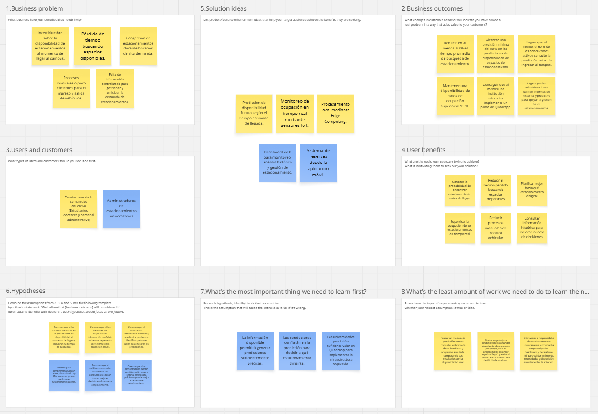

## 1.3. Segmentos objetivo

**Conductores de la comunidad educativa:**
La falta de espacios en horas punta puede incrementar el tiempo de búsqueda, producir retrasos y afectar la experiencia de los conductores en el campus (Channamallu et al., 2025, y Mohandes et al., 2019). Este segmento necesita información predictiva para planificar su salida y estimar la probabilidad de encontrar un espacio al llegar.
* **Relevancia para la solución:** Es el segmento de usuarios finales que consulta la disponibilidad, las predicciones y las recomendaciones desde la aplicación móvil.
* **Edad estimada:** 17 a 55 años.
* **Ubicación:** Zonas urbanas con alta concentración de sedes universitarias y centros de educación superior.
* **Características demográficas y de comportamiento:**
  * Incluye a jóvenes estudiantes, docentes y personal que conducen frecuentemente hacia el campus.
  * Tienen una personalidad **Analítica / Práctica**, buscando optimizar cada minuto de su agenda diaria.
  * Tienen horarios estrictos debido a cátedras, exámenes o turnos laborales.
  * Utilizan smartphones y aplicaciones de movilidad (como Waze o Google Maps) de manera constante.
  * Valoran enormemente la toma de decisiones basada en datos rápidos para evitar el tráfico.
* **Necesidades principales:**
  * Conocer la disponibilidad y la probabilidad de encontrar espacios libres antes de salir de casa mediante la IA predictiva.
  * Recibir recomendaciones inteligentes de horarios de salida para evitar los picos de saturación.
  * Ahorrar tiempo, combustible y dinero al no dar vueltas innecesarias ni usar cocheras informales.
  * Llegar puntualmente y sin estrés a sus compromisos académicos.

**Administradores de estacionamientos universitarios:**
Comprende a los jefes de logística y operaciones del campus, supervisores de turno y operadores de puerta: quienes monitorean el aforo, coordinan el flujo vehicular en los accesos y elaboran los reportes de ocupación. No incluye a la alta dirección de la universidad, que actúa como cliente del modelo B2B y aparece en el Lean UX Canvas.

Ante la variación del aforo y la demanda durante la jornada académica, estos gestores requieren paneles de control y métricas que les permitan supervisar la ocupación, identificar horas de mayor demanda y apoyar la gestión del estacionamiento.
* **Relevancia para la solución:** Es el segmento operativo que utiliza la consola web y aporta la perspectiva institucional necesaria para adoptar y gestionar la plataforma.
* **Edad estimada:** 30 a 60 años.
* **Ubicación:** Campus universitarios y áreas adyacentes a las universidades.
* **Características demográficas y de comportamiento:**
  * Son jefes de logística, operaciones, seguridad del campus o concesionarios de playas de estacionamiento.
  * Tienen una personalidad **Racional / Estratégica**, enfocada en la eficiencia, los procesos y el control.
  * Se enfrentan a reclamos constantes por parte de la comunidad educativa debido a la congestión.
  * Buscan modernizar sus sistemas tradicionales mediante tecnología, automatización y análisis de datos.
* **Necesidades principales:**
  * Optimizar la tasa de ocupación de los estacionamientos y aprovechar mejor los espacios disponibles.
  * Reducir las filas y el caos vehicular en las puertas de ingreso durante los cambios de horario.
  * Obtener reportes predictivos y métricas precisas sobre los patrones de demanda vehicular.
  * Mejorar la satisfacción general de los estudiantes y docentes al brindar un servicio de acceso ordenado.

---

# Capítulo II: Requirements Elicitation & Analysis

## 2.1. Competidores

### 2.1.1. Análisis competitivo

<table>
  <tr>
    <th colspan="6">Competitive Analysis Landscape</th>
  </tr>
  <tr>
    <th colspan="2">¿Por qué llevar a cabo este análisis?</th>
    <td colspan="4">
      Identificar cómo Quadrapp puede diferenciarse de las soluciones actuales de estacionamiento mediante la predicción de disponibilidad futura y su especialización en comunidades educativas, considerando las tecnologías, servicios y modelos de negocio utilizados por competidores locales e internacionales.
    </td>
  </tr>
  <tr>
    <th></th>
    <th></th>
    <th>
      Quadrapp<br>
      
    </th>
    <th>
      Apparka<br>
      
    </th>
    <th>
      ParkHelp<br>
      
    </th>
    <th>
      ParkMobile<br>
      
    </th>
  </tr>
  <tr>
    <th rowspan="2">Perfil</th>
    <th>Overview</th>
    <td>
      Plataforma inteligente orientada a estacionamientos universitarios que combina sensado IoT, información de ocupación, datos históricos y tiempo estimado de llegada para predecir la probabilidad de encontrar un espacio y brindar recomendaciones al conductor antes de llegar al campus.
    </td>
    <td>
      Plataforma peruana de estacionamientos y movilidad que permite localizar estacionamientos, consultar disponibilidad y utilizar diferentes servicios digitales asociados a su operación.
    </td>
    <td>
      Solución tecnológica orientada a la gestión y guiado inteligente de estacionamientos mediante sensores, cámaras, herramientas de monitoreo y análisis de ocupación.
    </td>
    <td>
      Plataforma digital de estacionamientos que ofrece servicios para conductores, operadores y universidades, facilitando la localización y gestión de espacios de estacionamiento.
    </td>
  </tr>
  <tr>
    <th>Ventaja competitiva<br>¿Qué valor ofrece a los clientes?</th>
    <td>
      Predice la disponibilidad futura según el tiempo estimado de llegada, combinando información de ocupación IoT en tiempo real, datos históricos, patrones de demanda y horarios académicos. Además, genera recomendaciones que ayudan al conductor a decidir hacia qué estacionamiento dirigirse.
    </td>
    <td>
      Cuenta con presencia en el mercado peruano y experiencia en la digitalización y gestión tecnológica de estacionamientos.
    </td>
    <td>
      Integra distintas tecnologías de hardware y software para detectar la ocupación de espacios, guiar conductores y analizar el comportamiento de los estacionamientos.
    </td>
    <td>
      Cuenta con experiencia en soluciones digitales de estacionamiento y dispone de propuestas orientadas a universidades y otros entornos de alta movilidad.
    </td>
  </tr>
  <tr>
    <th rowspan="2">Perfil de Marketing</th>
    <th>Mercado objetivo</th>
    <td>
      Universidades y centros educativos con estacionamientos propios. Sus usuarios finales son estudiantes, docentes y personal administrativo que se desplazan en vehículo hacia el campus.
    </td>
    <td>
      Conductores urbanos y organizaciones que requieren soluciones tecnológicas para la gestión de estacionamientos en Perú.
    </td>
    <td>
      Universidades, centros educativos, operadores de estacionamientos y organizaciones que buscan mejorar el monitoreo y aprovechamiento de sus espacios.
    </td>
    <td>
      Universidades, ciudades, operadores de estacionamientos, estudiantes, trabajadores y visitantes.
    </td>
  </tr>
  <tr>
    <th>Estrategias de Marketing</th>
    <td>
      Alianzas B2B con universidades, implementación de pilotos dentro de campus y demostraciones dirigidas a las áreas responsables de infraestructura, movilidad y gestión de estacionamientos.
    </td>
    <td>
      Promoción de su plataforma para conductores y organizaciones, junto con soluciones empresariales relacionadas con la gestión de estacionamientos.
    </td>
    <td>
      Estrategia principalmente B2B, ofreciendo soluciones tecnológicas adaptadas a las necesidades y características de cada instalación.
    </td>
    <td>
      Acuerdos con universidades, ciudades y operadores para incorporar sus soluciones digitales dentro de distintos entornos de estacionamiento.
    </td>
  </tr>
  <tr>
    <th rowspan="3">Perfil de Producto</th>
    <th>Productos &amp; Servicios</th>
    <td>
      Predicción de disponibilidad futura, monitoreo de ocupación en tiempo real mediante IoT, análisis histórico de demanda, recomendaciones de estacionamiento, notificaciones, aplicación móvil para conductores y dashboard web para administradores.
    </td>
    <td>
      Localización de estacionamientos, consulta de disponibilidad y herramientas digitales orientadas a conductores y operadores.
    </td>
    <td>
      Sensores de estacionamiento, sistemas de detección de ocupación, guiado inteligente, dashboards, estadísticas y herramientas de monitoreo y análisis.
    </td>
    <td>
      Localización de estacionamientos, herramientas digitales para conductores y soluciones de administración destinadas a operadores y universidades.
    </td>
  </tr>
  <tr>
    <th>Precios &amp; Costos</th>
    <td>
      Modelo propuesto de suscripción o licenciamiento institucional para universidades, considerando los costos asociados a infraestructura IoT, almacenamiento, procesamiento de datos y funcionamiento de la plataforma.
    </td>
    <td>
      Los costos dependen de los servicios y soluciones tecnológicas contratadas por cada organización o estacionamiento.
    </td>
    <td>
      Los costos dependen del hardware, cantidad de espacios, infraestructura y servicios requeridos para cada instalación, por lo que se determinan según cada proyecto.
    </td>
    <td>
      El modelo comercial depende de las características del servicio implementado y de los acuerdos establecidos con cada operador o institución.
    </td>
  </tr>
  <tr>
    <th>Canales de distribución<br>(Web y/o Móvil)</th>
    <td>
      Aplicación móvil para conductores y aplicación web con dashboard para administradores.
    </td>
    <td>
      Aplicación móvil y plataforma web.
    </td>
    <td>
      Plataforma web, infraestructura física e integraciones con sistemas instalados en los estacionamientos.
    </td>
    <td>
      Aplicación móvil y servicios web integrados con operadores y universidades.
    </td>
  </tr>
  <tr>
    <th rowspan="5">Análisis SWOT</th>
    <td colspan="5">
      Se identifican las fortalezas, debilidades, oportunidades y amenazas de Quadrapp y de sus principales competidores, considerando especialmente las capacidades relacionadas con monitoreo, disponibilidad, analítica y gestión inteligente de estacionamientos.
    </td>
  </tr>
  <tr>
    <th>Fortalezas</th>
    <td>
      Especialización en estacionamientos universitarios, predicción de disponibilidad futura, integración de información IoT en tiempo real, análisis histórico, consideración del contexto académico y generación de recomendaciones para los conductores.
    </td>
    <td>
      Presencia consolidada en Perú, experiencia operativa y conocimiento del mercado local de estacionamientos.
    </td>
    <td>
      Amplia variedad de tecnologías para estacionamientos, experiencia en soluciones universitarias e integración de sensores, monitoreo y analítica.
    </td>
    <td>
      Experiencia en soluciones para estacionamientos universitarios y presencia en distintos tipos de organizaciones y operadores.
    </td>
  </tr>
  <tr>
    <th>Debilidades</th>
    <td>
      Producto nuevo que requiere suficiente información histórica para mejorar sus predicciones. La instalación y mantenimiento de sensores IoT implica una inversión inicial y la calidad de las estimaciones depende de la confiabilidad de los datos recolectados.
    </td>
    <td>
      Su propuesta se encuentra principalmente orientada a la operación y disponibilidad actual del estacionamiento, sin especialización en predicción futura según el tiempo estimado de llegada al campus.
    </td>
    <td>
      Su propuesta depende considerablemente de infraestructura tecnológica instalada y se orienta principalmente al monitoreo y guiado, más que a una predicción personalizada según el momento de llegada del conductor.
    </td>
    <td>
      Su propuesta es amplia y está orientada a diferentes mercados, por lo que puede tener menor especialización en patrones académicos y comportamiento específico de comunidades universitarias.
    </td>
  </tr>
  <tr>
    <th>Oportunidades</th>
    <td>
      Creciente digitalización de campus, aprovechamiento de datos históricos y académicos para mejorar las predicciones y posibilidad de expansión futura hacia otros espacios con patrones recurrentes de movilidad.
    </td>
    <td>
      Expandir su experiencia e infraestructura hacia universidades y otros sectores con necesidades específicas de movilidad.
    </td>
    <td>
      Incorporar capacidades predictivas avanzadas utilizando la información generada por sus sensores y sistemas de monitoreo.
    </td>
    <td>
      Aprovechar los datos generados por sus usuarios para incorporar herramientas avanzadas de análisis y planificación de capacidad.
    </td>
  </tr>
  <tr>
    <th>Amenazas</th>
    <td>
      Competidores establecidos podrían incorporar funcionalidades predictivas; las instituciones podrían mostrar resistencia frente al costo de infraestructura; la falta de datos históricos o una baja precisión inicial podría afectar la confianza en las estimaciones.
    </td>
    <td>
      Aparición de soluciones especializadas que utilicen predicción, información histórica y análisis contextual como factores diferenciadores.
    </td>
    <td>
      Aparición de soluciones con menor dependencia de infraestructura física o modelos de implementación más económicos.
    </td>
    <td>
      Competidores especializados en sectores específicos pueden ofrecer experiencias más adaptadas a las necesidades particulares de cada institución.
    </td>
  </tr>
</table>

La descripción de las capacidades de Apparka, ParkHelp y ParkMobile se elaboró a partir de la información publicada en sus sitios oficiales (Apparka, s. f., ParkHelp, s. f., y ParkMobile, s. f.). Las fortalezas, debilidades, oportunidades y amenazas corresponden al análisis del equipo con base en dichas capacidades y en el alcance propuesto para Quadrapp.

### 2.1.2. Estrategias y tácticas frente a competidores

A partir del análisis competitivo realizado, se identificaron oportunidades para posicionar Quadrapp sin competir directamente mediante características que ya se encuentran presentes en otras soluciones de estacionamiento. La estrategia principal será concentrarse en la predicción de disponibilidad futura y el análisis del comportamiento de los estacionamientos universitarios, aprovechando información propia del contexto académico.

**Frente a Apparka:**
Quadrapp no buscará diferenciarse únicamente mediante la visualización de estacionamientos disponibles o la gestión tradicional de espacios. La estrategia será enfocarse en la predicción de disponibilidad futura, permitiendo que los conductores conozcan la probabilidad de encontrar un espacio al momento estimado de llegada al campus.
Para ello, Quadrapp combinará información actual de ocupación con datos históricos, patrones de demanda y horarios académicos, ofreciendo una experiencia especializada en comunidades educativas.

**Frente a ParkHelp:**
Frente a ParkHelp, Quadrapp buscará complementar el monitoreo mediante sensores IoT con una capa de analítica histórica y predicción que transforme los datos de ocupación en información útil para los conductores.
La diferenciación no estará únicamente en detectar qué espacios están disponibles, sino en utilizar esa información para anticipar cómo podría evolucionar la ocupación en los siguientes minutos y generar recomendaciones según el momento estimado de llegada.

**Frente a ParkMobile:**
Frente a ParkMobile, Quadrapp priorizará una experiencia especializada en el contexto universitario. La solución utilizará información relacionada con horarios académicos, horas pico, comportamiento histórico y patrones recurrentes de demanda para generar estimaciones adaptadas a cada campus.
Este enfoque permitirá que tanto conductores como administradores obtengan información relacionada específicamente con el comportamiento de su comunidad educativa.

**Tácticas principales:**
- Implementar pilotos controlados en universidades antes de realizar despliegues de mayor escala.
- Recopilar información histórica desde las primeras etapas para mejorar progresivamente la capacidad de identificar patrones de demanda.
- Medir continuamente la precisión de las predicciones y compararlas con la disponibilidad realmente observada.
- Validar periódicamente la información generada por los sensores IoT comparándola con la ocupación real de los espacios.
- Analizar la relación entre fecha, hora, horarios académicos, horas pico y ocupación histórica para mejorar los modelos de predicción.
- Mostrar a los administradores mediante un dashboard información relacionada con ocupación actual, comportamiento histórico, períodos de mayor demanda y predicciones.
- Utilizar notificaciones únicamente cuando existan cambios relevantes que puedan modificar la decisión del conductor, evitando generar alertas innecesarias.
- Establecer alianzas directas con universidades para obtener datos, ejecutar pilotos y validar la solución en situaciones reales.
- Utilizar los resultados de los pilotos como evidencia de la reducción del tiempo de búsqueda y de la utilidad de las predicciones.
- Mejorar progresivamente los modelos de predicción conforme se disponga de una mayor cantidad de datos históricos por campus.

## 2.2. Entrevistas

### 2.2.1. Diseño de entrevistas

Las entrevistas buscan validar el problema antes de proponer una solución: cuánto tiempo pierde realmente un conductor al buscar estacionamiento en el campus, con qué información cuenta al momento de salir de su casa y cómo el personal encargado del estacionamiento conoce y gestiona la ocupación. Se diseñó un guion por segmento objetivo. Las preguntas priorizan la experiencia actual del entrevistado y los hechos recientes sobre las opiniones generales. Las referencias a la tecnología y los escenarios hipotéticos se utilizan para explorar actitudes y expectativas sin mencionar Quadrapp. Sus respuestas se analizarán como preferencias declaradas y no como evidencia de un comportamiento real.

Cada guion se organiza en cuatro bloques. Las **preguntas de perfil** sitúan al entrevistado en su contexto y recogen sus hábitos, herramientas y disposición ante la tecnología. Las **preguntas principales** exploran el proceso tal como ocurre hoy, pidiendo que el entrevistado narre episodios concretos y recientes en lugar de opiniones generales. Las **preguntas complementarias** cubren situaciones excepcionales y restricciones del entorno. La **pregunta de cierre** proyecta el escenario deseado y abre espacio para lo que el guion no previó.

#### Segmento 1: Conductores de la comunidad educativa

Este segmento vive el problema en primera persona y de forma recurrente, por lo que el guion prioriza la reconstrucción de su rutina: a qué hora decide salir, qué consulta antes de hacerlo, qué ocurre cuando encuentra el estacionamiento lleno y cuánto tiempo pierde en consecuencia. Las preguntas buscan cuantificar la pérdida de tiempo y detectar las soluciones informales que ya emplea, como coordinar por mensajería con compañeros o adelantar su llegada por precaución.

**Datos generales del entrevistado**

| Dato | Detalle |
| --- | --- |
| Nombres y apellidos | |
| Edad | |
| Género | |
| Distrito de residencia | |
| Estado civil y composición familiar | |
| Ocupación y vínculo con la universidad | Carrera o área |
| Dispositivo principal | Marca y sistema operativo |
| Navegador de preferencia | |
| Canales digitales de uso frecuente | |
| Marcas o referentes que admira | |

*Preguntas de perfil*

1. Cuéntanos quién eres, qué haces en la universidad y cuántos días a la semana llegas conduciendo. ¿Con quién vives y quién más usa el vehículo?
2. ¿Tu horario es fijo o variable? ¿Hay algún día en el que llegar tarde te genera un problema serio?
3. ¿Qué aplicaciones usas para desplazarte y por qué canales te informas de lo que ocurre en el campus?
4. ¿Te consideras una persona que planifica su día o que improvisa sobre la marcha? ¿Qué tan dispuesto estás a probar una aplicación nueva?

*Preguntas principales*

5. Descríbenos la última vez que condujiste al campus, desde que saliste de casa hasta que apagaste el motor.
6. ¿Cómo decides a qué hora salir? ¿Sabes de antemano cómo estará el estacionamiento?
7. Cuando vas en camino, ¿le consultas a alguien cómo está la situación? ¿Por qué medio?
8. Cuéntanos la última vez que encontraste el estacionamiento lleno. ¿Qué hiciste, cuánto tiempo perdiste y qué consecuencias tuvo?
9. Una vez dentro del campus, ¿cómo haces para encontrar un espacio libre?
10. ¿Has cambiado tus planes por temor a no encontrar espacio? ¿Cuánto tiempo adicional calculas que eso te cuesta por semana?
11. Descríbenos paso a paso lo que haces hoy para asegurarte un espacio, y con qué frecuencia repites cada paso.
12. Del 1 al 10, ¿qué tan importante es este problema en tu día? ¿Cuál es tu mayor frustración al respecto?

*Preguntas complementarias*

13. ¿Qué cambia en semanas especiales, como el inicio de ciclo, los exámenes o los eventos masivos?
14. Si pudieras saber una sola cosa antes de salir de casa, ¿cuál sería? ¿Preferirías que la aplicación te avise sola o consultarla tú?

*Pregunta de cierre*

15. Si supieras con anticipación la probabilidad de encontrar estacionamiento al llegar, ¿qué cambiaría en tu rutina? ¿Hay algo que no te hayamos preguntado y consideres importante?

#### Segmento 2: Administradores de estacionamientos universitarios

Este segmento reúne a quienes supervisan la operación diaria del estacionamiento: jefes de logística y operaciones, supervisores de turno y operadores de puerta. El guion se concentra en cómo conocen la ocupación, cómo reaccionan ante la saturación y qué información necesitan para gestionar el estacionamiento. Para que la entrevista dure entre tres y cinco minutos, se plantean ocho preguntas breves. Las repreguntas entre paréntesis son opcionales y solo se utilizan cuando la respuesta principal no proporciona suficiente información.


**Datos generales del entrevistado**

| Dato | Detalle |
| --- | --- |
| Nombres y apellidos | |
| Edad | |
| Distrito de residencia | |
| Cargo y tiempo en el puesto | |

*Preguntas de perfil*

1. ¿Cuál es tu función principal durante un turno habitual?

*Preguntas principales*

2. Cuéntanos la última vez que el estacionamiento se llenó o estuvo cerca de llenarse. ¿Qué hiciste? (¿Cómo lo detectaste? ¿Con quién te coordinaste? ¿Cuál fue el resultado?)
3. ¿Cómo sabes durante un turno cuántos espacios están disponibles? (¿De dónde obtienes el dato? ¿Cada cuánto se actualiza? ¿Qué tan confiable es?)
4. ¿Cómo manejan actualmente la información de entradas, salidas y ocupación? (¿Quién la registra? ¿Dónde se almacena? ¿Cómo se preparan los reportes?)
5. ¿Cuál es el problema que se repite con mayor frecuencia durante la operación? (¿Cuándo ocurrió por última vez? ¿Qué información te faltó para resolverlo?)

*Preguntas complementarias*

6. ¿Qué cambia durante el inicio de ciclo, los exámenes o los eventos masivos? (¿Cómo se preparan? ¿Qué dificultad suele presentarse?)
7. Cuéntanos la última vez que falló un equipo de control del estacionamiento. ¿Cómo continuaron operando? (¿Quién atendió la falla? ¿Cuánto tiempo duró?)

*Pregunta de cierre*

8. Si pudieras disponer de una información que hoy no tienes, ¿cuál te ayudaría más a gestionar el estacionamiento y por qué?

### 2.2.2. Registro de entrevistas

Cada entrevista se registró en video y se documenta con los datos del entrevistado, el enlace a la grabación, su duración, una captura del video y un resumen descriptivo de sus respuestas. Los resúmenes incorporan tanto las características objetivas como las subjetivas que más adelante sustentan los User Personas y los Empathy Maps.

#### Segmento 1: Conductores de la comunidad educativa

**Entrevista 1**

| Campo | Información |
| --- | --- |
| Nombres y apellidos | María Fernanda Tejeda Mena |
| Edad | 20 años |
| Distrito de residencia | Callao |
| Ocupación y vínculo con la universidad | Estudiante de Derecho, 8.º ciclo |
| Enlace de la grabación | [https://upcedupe-my.sharepoint.com/:v:/g/personal/u202318947_upc_edu_pe/IQBXH2ReWIuZSqn2OJ4tRl5LAegsl_wX8Ii_kqGcVEL3YTk?e=8TtxqV&nav=eyJyZWZlcnJhbEluZm8iOnsicmVmZXJyYWxBcHAiOiJTdHJlYW1XZWJBcHAiLCJyZWZlcnJhbFZpZXciOiJTaGFyZURpYWxvZy1MaW5rIiwicmVmZXJyYWxBcHBQbGF0Zm9ybSI6IldlYiIsInJlZmVycmFsTW9kZSI6InZpZXcifX0%3D](https://upcedupe-my.sharepoint.com/:v:/g/personal/u202318947_upc_edu_pe/IQBXH2ReWIuZSqn2OJ4tRl5LAegsl_wX8Ii_kqGcVEL3YTk?e=8TtxqV&nav=eyJyZWZlcnJhbEluZm8iOnsicmVmZXJyYWxBcHAiOiJTdHJlYW1XZWJBcHAiLCJyZWZlcnJhbFZpZXciOiJTaGFyZURpYWxvZy1MaW5rIiwicmVmZXJyYWxBcHBQbGF0Zm9ybSI6IldlYiIsInJlZmVycmFsTW9kZSI6InZpZXcifX0%3D) |
| Duración | 4 minutos y 13 segundos |
| Inicio | 00:07 min |
| Captura |  |
| Resumen | Estudiante de Derecho que utiliza un auto familiar para asistir a la universidad de lunes a viernes. Para movilizarse utiliza Waze o Google Maps y se informa mediante WhatsApp y correo institucional. Actualmente no cuenta con información precisa sobre la disponibilidad de estacionamientos antes de llegar, por lo que consulta ocasionalmente a sus compañeros o calcula la disponibilidad según el horario y la actividad del campus. En una ocasión tuvo que buscar estacionamiento durante 10 a 15 minutos y llegó tarde a clases. Además, estima que invierte entre 30 y 60 minutos adicionales por semana debido a la incertidumbre sobre encontrar un espacio. Considera importante conocer con anticipación la probabilidad de encontrar estacionamiento para poder planificar mejor su salida. |


**Entrevista 2**

| Campo | Información |
| --- | --- |
| Nombres y apellidos | Wilder Gonzalo Aliaga Urbina |
| Edad | 21 años |
| Distrito de residencia | San Isidro |
| Ocupación y vínculo con la universidad | Estudiante de Ingeniería de Software, 8.º ciclo |
| Enlace de la grabación | [https://upcedupe-my.sharepoint.com/:v:/g/personal/u202215462_upc_edu_pe/IQALFlPRSrnUR48PtAjDQ1f-AaB7rRMljFlq5JK61XENGM0?e=FsLoaG&nav=eyJyZWZlcnJhbEluZm8iOnsicmVmZXJyYWxBcHAiOiJTdHJlYW1XZWJBcHAiLCJyZWZlcnJhbFZpZXciOiJTaGFyZURpYWxvZy1MaW5rIiwicmVmZXJyYWxBcHBQbGF0Zm9ybSI6IldlYiIsInJlZmVycmFsTW9kZSI6InZpZXcifX0%3D](https://upcedupe-my.sharepoint.com/:v:/g/personal/u202215462_upc_edu_pe/IQALFlPRSrnUR48PtAjDQ1f-AaB7rRMljFlq5JK61XENGM0?e=FsLoaG&nav=eyJyZWZlcnJhbEluZm8iOnsicmVmZXJyYWxBcHAiOiJTdHJlYW1XZWJBcHAiLCJyZWZlcnJhbFZpZXciOiJTaGFyZURpYWxvZy1MaW5rIiwicmVmZXJyYWxBcHBQbGF0Zm9ybSI6IldlYiIsInJlZmVycmFsTW9kZSI6InZpZXcifX0%3D) |
| Duración | 08:04 min |
| Inicio | 00:24 min |
| Captura |  |
| Resumen | Estudiante de Ingeniería de Software que utiliza su auto propio para movilizarse a su campus 3 veces a la semana. Para movilizarse utiliza Waze o Google Maps y se informa mediante WhatsApp. Actualmente no cuenta con información precisa sobre la disponibilidad de estacionamientos antes de llegar, por lo que trata de salir con antelación para evitar situaciones de tráfico y estrés. En una ocasión, durante su trayecto al campus, tuvo muchas complicaciones debido a una situación de tráfico y cola de espera en el estacionamiento de su campus, lo que lo llevó a perder mucho tiempo, llegando tarde a su clase. Considera importante conocer con anticipación la probabilidad de encontrar estacionamiento para poder planificar mejor su salida. |

**Entrevista 3**

| Campo | Información |
| --- | --- |
| Nombres y apellidos | Gabriel Fernando Gordon Salas |
| Edad | 21 años |
| Ocupación y vínculo con la universidad | Estudiante de Ingeniería de Software, 8.º ciclo |
| Enlace de la grabación | [https://upcedupe-my.sharepoint.com/:v:/g/personal/u20231c505_upc_edu_pe/IQB7hsSytElgTbdx5DxjN9FzAX5EA4gjUnooYg17Ymlv_UM?e=JY5T1p&nav=eyJyZWZlcnJhbEluZm8iOnsicmVmZXJyYWxBcHAiOiJTdHJlYW1XZWJBcHAiLCJyZWZlcnJhbFZpZXciOiJTaGFyZURpYWxvZy1MaW5rIiwicmVmZXJyYWxBcHBQbGF0Zm9ybSI6IldlYiIsInJlZmVycmFsTW9kZSI6InZpZXcifX0%3D](https://upcedupe-my.sharepoint.com/:v:/g/personal/u20231c505_upc_edu_pe/IQB7hsSytElgTbdx5DxjN9FzAX5EA4gjUnooYg17Ymlv_UM?e=JY5T1p&nav=eyJyZWZlcnJhbEluZm8iOnsicmVmZXJyYWxBcHAiOiJTdHJlYW1XZWJBcHAiLCJyZWZlcnJhbFZpZXciOiJTaGFyZURpYWxvZy1MaW5rIiwicmVmZXJyYWxBcHBQbGF0Zm9ybSI6IldlYiIsInJlZmVycmFsTW9kZSI6InZpZXcifX0%3D) |
| Duración | 05:17 |
| Captura |  |
| Resumen | Estudiante de Ingeniería de Software que llega al campus en el auto de su familia 4 días a la semana, de lunes a jueves. Para movilizarse utiliza Waze o Google Maps y se informa mediante WhatsApp y correo institucional. Antes de salir no cuenta con información sobre el estacionamiento, por lo que lo intuye según el día y la época del ciclo, y a veces consulta al grupo de WhatsApp, cuyas respuestas pueden quedar desactualizadas al llegar. Tras la cola de ingreso y la validación de su credencial, suele tardar unos 10 minutos en encontrar espacio. En una semana de exámenes buscó durante unos 20 minutos, terminó en un estacionamiento particular externo y llegó 15 minutos tarde a su evaluación. Estima perder unas 2 horas semanales entre salir antes y dar vueltas, y califica la importancia del problema con un 8 sobre 10. Considera importante conocer la probabilidad de encontrar espacio a su hora de llegada, idealmente por zona o piso, aunque solo confiaría en la predicción si es precisa. |

#### Segmento 2: Administradores de estacionamientos universitarios

**Entrevista 1**

| Campo | Información |
| --- | --- |
| Nombres y apellidos | Mario Grandes |
| Edad | 26 años |
| Ocupación y vínculo con la universidad | Encargado del estacionamiento del campus |
| Enlace de la grabación | [https://youtu.be/Uwh7i71zwv4](https://youtu.be/Uwh7i71zwv4) |
| Duración | 2 minutos y 27 segundos |
| Captura |  |
| Resumen | Encargado del estacionamiento de un campus universitario. Su función principal durante el turno es monitorear el flujo vehicular, supervisar al personal en las tranqueras y resolver los cuellos de botella en las horas punta. Conoce la disponibilidad de espacios por experiencia y mirando los reportes básicos de las tranqueras, que describe como poco confiables porque se actualizan con lentitud. El registro de ingresos lo realiza el personal de seguridad de forma manual y él arma los reportes diarios en una hoja de cálculo al finalizar el día. Relata que el lunes a las 8 de la mañana el estacionamiento estuvo cerca de llenarse: lo detectó revisando cámaras, se comunicó con los vigilantes para desviar vehículos hacia zonas alternas y, aunque la situación fue caótica, evitaron el bloqueo de la vía principal. Identifica como problema recurrente las filas en las tranqueras durante el cambio de hora de las 8 de la mañana, y lo atribuye a la falta de visibilidad en tiempo real sobre qué zonas tienen espacios libres. En el inicio de ciclo, los exámenes y los eventos masivos el flujo se dispara alrededor de un 50 por ciento: se preparan asignando más personal, pero carecen de datos históricos para dimensionar cuántos vehículos llegarán. La semana previa a la entrevista falló la lectora de una tranquera principal y debieron operarla manualmente durante 45 minutos hasta que soporte técnico reinició el sistema. Al preguntarle qué información le haría falta, responde que una plataforma analítica capaz de predecir la demanda y anticipar cuántos vehículos llegarán por hora, para organizar los accesos sin depender de suposiciones. |

### 2.2.3. Análisis de entrevistas

Esta sección analiza, para cada segmento objetivo, las características objetivas y subjetivas identificadas en las entrevistas que sustentan la construcción de los arquetipos. El análisis se apoya en los registros de la sección anterior y se actualizará con el sustento porcentual correspondiente a medida que se completen las entrevistas de cada segmento.

#### Segmento 1: Conductores de la comunidad educativa

Se analizaron tres entrevistas a estudiantes de 8.º ciclo que llegan al campus en auto.

**Características objetivas**

| Característica | Hallazgo | Sustento |
| --- | --- | --- |
| Medio de transporte | Llegan al campus en auto, propio o familiar, entre 3 y 5 días a la semana. | 3 de 3 (100 %) |
| Apps de movilidad | Usan Waze, Google Maps o ambas para planificar la ruta y evitar el tráfico. | 3 de 3 (100 %) |
| Canales de información | WhatsApp es el canal principal; el correo institucional es secundario. | WhatsApp: 3 de 3 (100 %). Correo: 2 de 3 (67 %) |
| Información previa del estacionamiento | No cuentan con información sobre la disponibilidad antes de llegar; la intuyen por el horario o la actividad del campus. | 3 de 3 (100 %) |
| Estrategias actuales | Salir con más anticipación y consultar a compañeros por WhatsApp. | Salir antes: 2 de 3 (67 %). Consultar a compañeros: 2 de 3 (67 %) |
| Colas en el acceso | Encuentran cola de vehículos en la entrada antes de buscar espacio. | 2 de 3 (67 %) |
| Consecuencia | Llegaron tarde a clase o a una evaluación por el tráfico, la cola o la búsqueda de espacio. | 3 de 3 (100 %) |
| Tiempo perdido | Entre 30 y 60 minutos adicionales por semana en un caso y unas 2 horas semanales en otro. El tercero no lo cuantificó. | 2 de 3 (67 %) lo cuantificaron |

**Características subjetivas**

| Característica | Hallazgo | Sustento |
| --- | --- | --- |
| Incertidumbre | La principal molestia es no saber si encontrarán espacio al llegar. | 3 de 3 (100 %) |
| Estrés y frustración | Sienten estrés por dar vueltas o quedar atrapados en la cola mientras se acerca la hora de clase. Uno calificó la importancia del problema con 8 sobre 10. | Estrés o frustración explícitos: 2 de 3 (67 %) |
| Necesidad de anticipación | Quieren conocer con antelación la probabilidad de encontrar espacio para planificar mejor su salida. | 3 de 3 (100 %) |
| Momento de interés | Desean saber la disponibilidad a la hora en que llegarán, no solo la del momento actual. | 1 de 3 (33 %) lo planteó de forma explícita |
| Confianza condicionada | Dejarían de usar una predicción que falle un par de veces, por lo que esperan que sea acertada. | 1 de 3 (33 %) |
| Forma de consulta | Prefieren consultar la información cuando les convenga, con un aviso opcional cuando el estacionamiento esté por llenarse. | 1 de 3 (33 %) |
| Apertura a nuevas apps | Están dispuestos a probar apps nuevas si son fáciles de usar y les ahorran tiempo. | 1 de 3 (33 %) |
| Seguridad | Se sienten menos tranquilos al dejar el auto en la calle o en un estacionamiento externo que dentro de la universidad. | 1 de 3 (33 %) |

**Hallazgos principales**

1. **La incertidumbre es el problema central.** Los tres entrevistados deciden a ciegas: no tienen datos y se apoyan en la intuición, en la experiencia y en mensajes de WhatsApp que pueden quedar desactualizados en pocos minutos.
2. **El costo real es tiempo y puntualidad.** Los tres llegaron tarde en alguna ocasión y, en los casos que lo estimaron, pierden entre 30 minutos y 2 horas por semana entre salir antes y dar vueltas.
3. **Las épocas críticas aparecen como un factor relevante.** Un entrevistado señaló que las semanas de exámenes, el inicio de ciclo y los eventos del campus incrementan la dificultad para encontrar estacionamiento. Este hallazgo, identificado en 1 de 3 entrevistas (33 %), constituye un indicio para evaluar el calendario académico y los eventos como insumos de la predicción.
4. **Las soluciones actuales son informales.** Salir antes y preguntar por WhatsApp reducen el riesgo, pero no lo eliminan ni dan información confiable.
5. **La confianza depende de la precisión.** Un entrevistado indicó que abandonaría la herramienta si falla con frecuencia, por lo que la predicción debe presentarse como estimación con su nivel de confianza.


#### Segmento 2: Administradores de estacionamientos universitarios

**Hallazgos principales**

* **Alcance de la operación:** la persona entrevistada supervisa el flujo vehicular del campus, coordina al personal de las tranqueras y resuelve los cuellos de botella durante las horas punta. Su trabajo se concentra principalmente en los periodos de mayor ingreso vehicular.
* **Conocimiento de la ocupación:** la disponibilidad se estima mediante la experiencia y los reportes básicos de las tranqueras, considerados poco confiables porque se actualizan con lentitud. Para confirmar la ocupación del estacionamiento también se revisan las cámaras de seguridad.
* **Gestión de la información:** el personal de seguridad registra manualmente los ingresos y los reportes diarios se consolidan en una hoja de cálculo al terminar el turno.
* **Obstáculos diarios:** las filas en las tranqueras durante el cambio de hora de la mañana constituyen el problema recurrente debido a la falta de información en tiempo real sobre las zonas que tienen espacios libres. Durante el inicio del ciclo, los periodos de exámenes y los eventos masivos, el flujo aumenta alrededor de un 50 % y se asigna más personal sin contar con datos históricos que respalden esa decisión. Una falla en la lectora de una tranquera obligó al equipo a operar el acceso manualmente hasta que se restableció el sistema.
* **Expectativas sobre la solución:** la persona entrevistada espera una plataforma analítica que prediga la demanda y anticipe cuántos vehículos llegarán por hora para organizar los accesos sin depender de suposiciones.

**Conclusión preliminar**

Las entrevistas registradas identifican como problema común la falta de información oportuna sobre la disponibilidad. Para los conductores, esta información es necesaria antes de salir de casa y durante el trayecto. Para el administrador, resulta útil durante el turno y al planificar periodos de alta demanda. Estos hallazgos respaldan una solución que proporcione información de ocupación adaptada a las necesidades de cada segmento mediante una aplicación móvil para conductores y una consola de operación para administradores.

## 2.3. Needfinding

### 2.3.1. User Personas

#### Conductores de la comunidad educativa

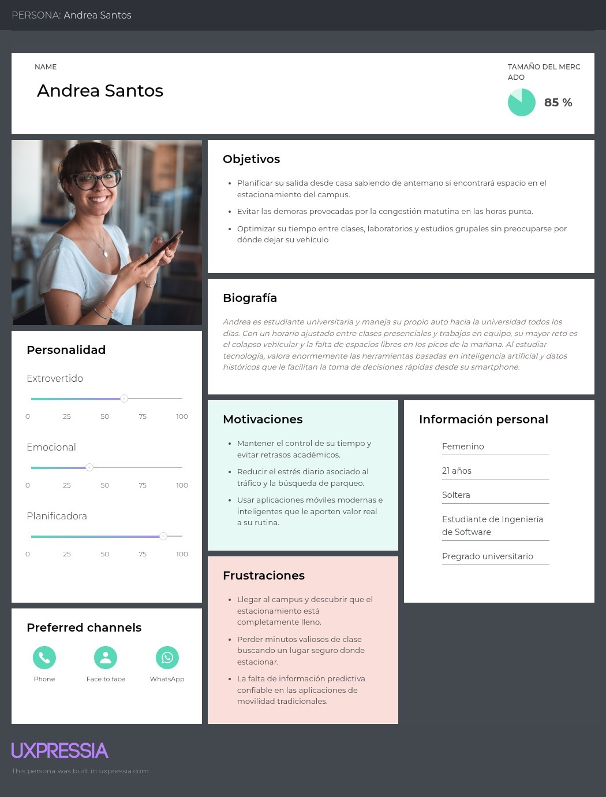

#### Administradores de estacionamientos universitarios

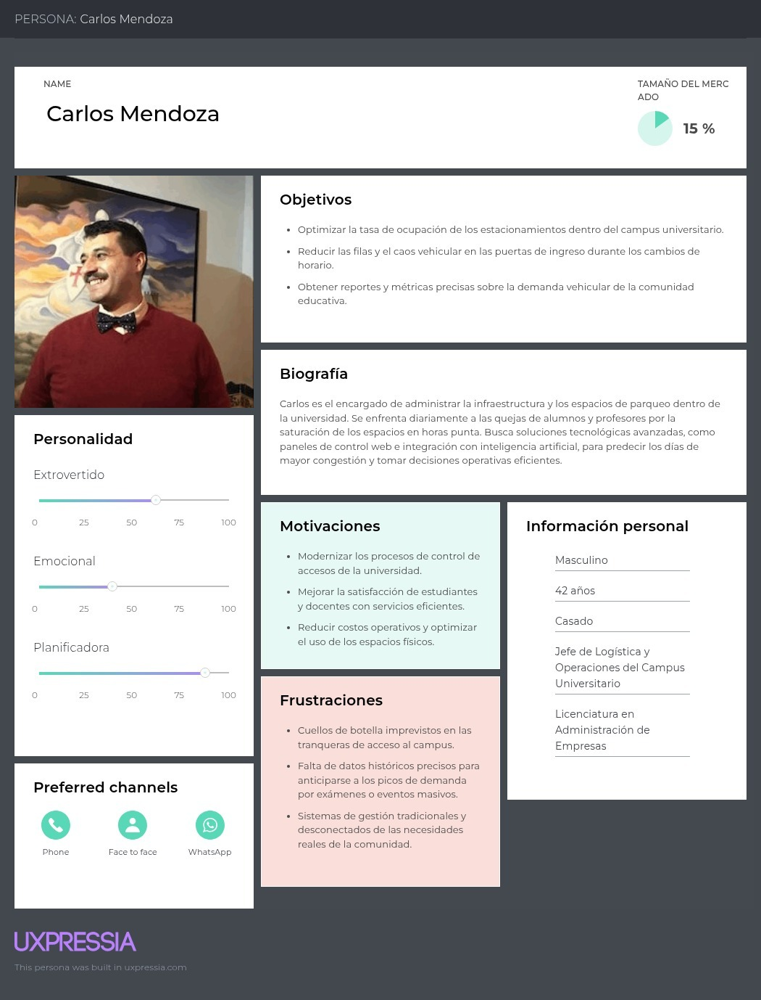


### 2.3.2. User Task Matrix
  
#### Conductores de la comunidad educativa

| Tarea | Frecuencia | Prioridad | Frustración |
| ------ | ------ | ------ | ------ |
| Ingresar a la aplicación con la cuenta institucional | Diario | Muy Alta | Alta |
| Ver qué estacionamientos del campus están disponibles | Diario | Muy Alta | Media |
| Conocer cuántos espacios libres hay en este momento | Diario | Muy Alta | Alta |
| Revisar la ocupación por zonas del estacionamiento | Diario | Alta | Media |
| Consultar cómo estará la disponibilidad en los próximos minutos | Diario | Muy Alta | Alta |
| Ver de forma simple si el estacionamiento estará saturado al llegar | Diario | Alta | Media |
| Recibir una recomendación según el tiempo que me falta para llegar | Diario | Muy Alta | Alta |
| Actualizar la recomendación si cambia mi tiempo de llegada | Diario | Alta | Media |
| Recibir notificaciones cuando la disponibilidad se ponga complicada | Diario | Alta | Media |
| Configurar qué tipo de alertas quiero recibir | Ocasional | Media | Baja |

#### Administradores de estacionamientos universitarios

| Tarea | Frecuencia | Prioridad | Frustración |
| ------ | ------ | ------ | ------ |
| Dar de alta y configurar los estacionamientos del campus | Ocasional | Alta | Media |
| Definir las zonas y la cantidad de espacios de cada estacionamiento | Ocasional | Alta | Media |
| Vincular los sensores físicos con cada espacio de parqueo | Ocasional | Alta | Alta |
| Configurar las entradas y salidas de vehículos | Ocasional | Media | Media |
| Verificar que los sensores estén funcionando correctamente | Diario | Muy Alta | Alta |
| Consultar la ocupación actual de los estacionamientos | Diario | Muy Alta | Alta |
| Revisar el historial de ocupación de periodos anteriores | Semanal | Alta | Media |
| Identificar los horarios de mayor demanda | Semanal | Alta | Alta |
| Detectar y revisar inconsistencias entre los sensores y los accesos | Diario | Alta | Alta |

### 2.3.3. Empathy Mapping

#### Conductores de la comunidad educativa

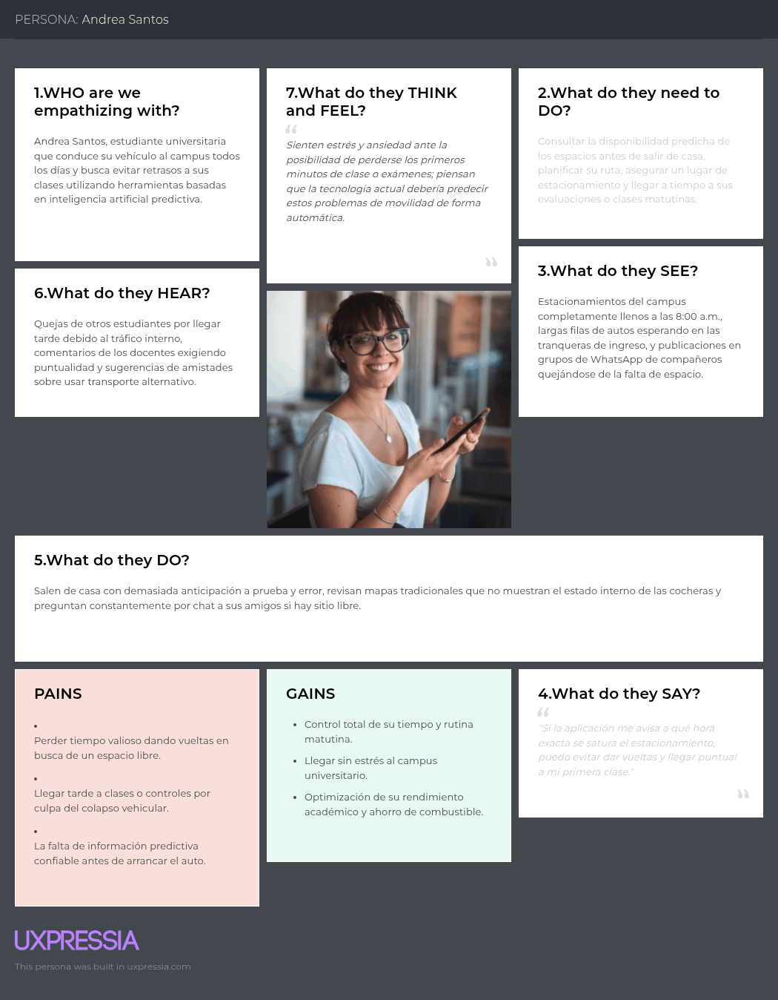

#### Administradores de estacionamientos universitarios

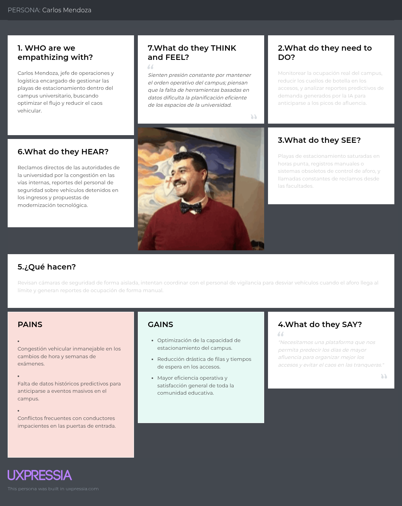


### 2.3.4. As-is Scenario Mapping

El As-is Scenario Mapping permite visualizar cómo viven actualmente los usuarios el proceso de estacionar dentro de un campus universitario, antes de la introducción de Quadrapp. Para cada segmento objetivo se elaboró un mapa a partir de su User Persona, con las filas **Phases**, **Doing**, **Thinking** y **Feeling**.

El proceso seguido por el equipo fue el siguiente:

1. **Preparación:** se revisaron los User Personas, las entrevistas y el Empathy Mapping para definir el alcance de cada mapa y el escenario a analizar: "llegar al campus, estacionar y salir del estacionamiento".
2. **Lluvia de ideas individual:** cada integrante escribió por separado, en notas adhesivas, lo que el usuario hace, piensa y siente durante el proceso.
3. **Revisión e identificación de fases:** se agruparon las notas por afinidad y se definieron las fases como columnas del mapa.
4. **Nombrado de fases:** se asignó un nombre descriptivo a cada fase, orientado a la actividad del usuario.
5. **Etiquetado de áreas:** se identificaron las áreas positivas, las áreas negativas (puntos de dolor) y las *blank areas*, es decir, aquellas sobre las que el equipo necesita aprender más.


#### Conductores de la comunidad educativa

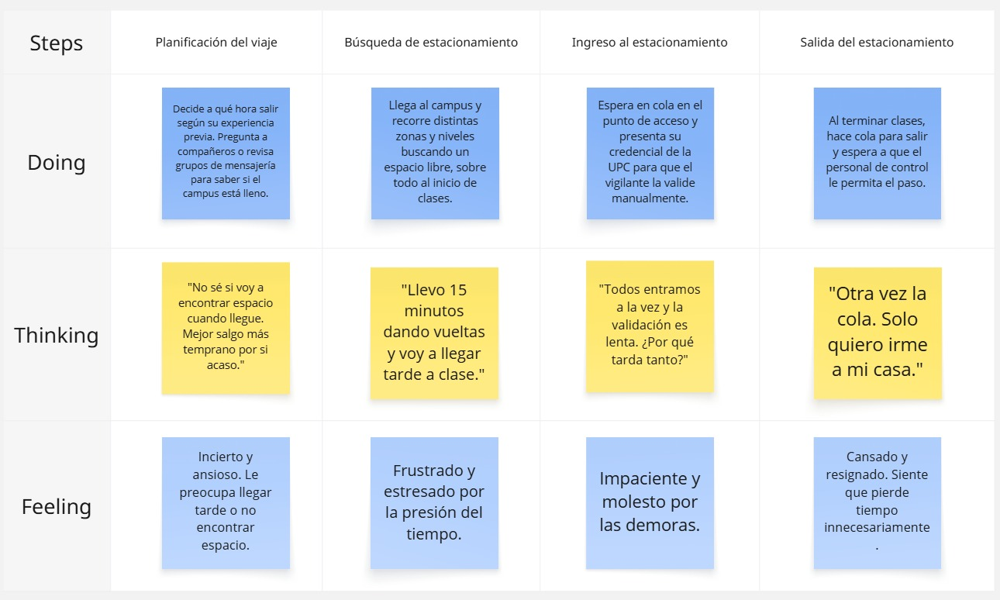

**Áreas positivas:** el conductor cuenta con un estacionamiento gratuito dentro o cerca del campus, y la validación con credencial le da una sensación de seguridad.

**Áreas negativas (puntos de dolor):**
- Incertidumbre total antes de salir: solo dispone de información informal, no de datos.
- Tiempo perdido y desplazamientos innecesarios buscando espacio.
- Colas en el ingreso y la salida por la validación manual de credenciales.
- Congestión en los puntos de acceso durante las horas pico.

**Blank areas:**
- ¿Cuánto tiempo real dedican al día a buscar estacionamiento?
- ¿Cómo deciden actualmente a qué zona o estacionamiento dirigirse?
- ¿Qué alternativas usan cuando no encuentran espacio?

#### Administradores de estacionamientos universitarios

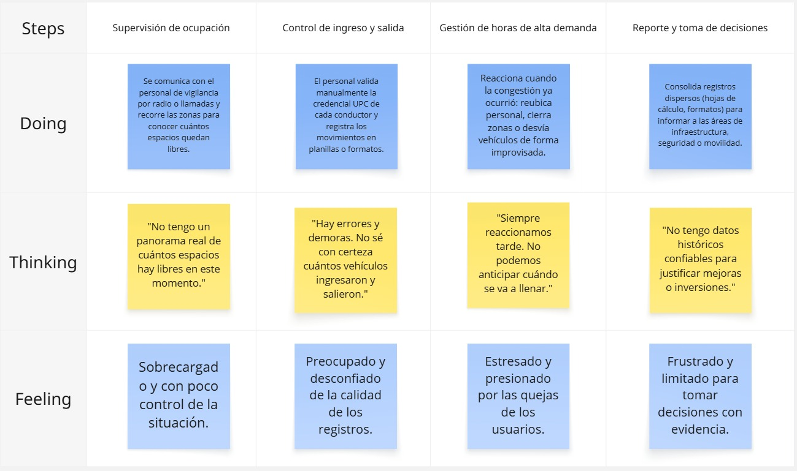

**Áreas positivas:** cuenta con personal de vigilancia presente en el campus y con un control de acceso basado en la credencial institucional ya establecido.

**Áreas negativas (puntos de dolor):**
- Información de ocupación desactualizada o basada en recorridos manuales.
- Registros manuales propensos a error y difíciles de consolidar.
- Gestión reactiva de las horas de alta demanda.
- Ausencia de datos históricos organizados para analizar patrones.

**Blank areas:**
- ¿Cuántas personas intervienen hoy en el control de accesos y cuánto tiempo les toma?
- ¿Con qué herramientas registran actualmente la ocupación y los movimientos de vehículos?
- ¿Qué indicadores le piden a la administración las áreas de dirección?


## 2.4. Ubiquitous Language

En esta sección se define el Ubiquitous Language del dominio del proyecto, con el objetivo de establecer un lenguaje común entre todos los miembros del equipo y los stakeholders. Este glosario incluye términos clave del dominio de la gestión de estacionamientos en universidades y centros educativos, evitando ambigüedades y facilitando la comunicación durante el desarrollo de la solución.

<div align="center">

| Term | Definition |
| --- | --- |
| Institution / Tenant (Institución) | Universidad que contrata Quadrapp. Todos sus datos se aíslan del resto mediante su identificador de institución. |
| Enabled Email Domain (Dominio de Correo Habilitado) | Dominio de correo de una institución cuyos usuarios pueden acceder a Quadrapp. |
| Invitation (Invitación) | Acceso de un solo uso que permite a un administrador u operador crear su cuenta. Vence en un plazo definido. |
| One-Time Code (Código de Acceso) | Código temporal de un solo uso, enviado al correo del usuario, con el que inicia sesión. |
| Role (Rol) | Conjunto de permisos de un usuario: conductor, administrador de estacionamientos u operador. |
| Driver (Conductor) | Miembro de la comunidad educativa que llega al campus en vehículo y consulta Quadrapp desde la aplicación móvil. |
| Parking Administrator (Administrador de Estacionamientos) | Persona responsable de configurar los estacionamientos y de supervisar su ocupación y operación desde la consola. |
| Operator (Operador) | Personal del turno invitado por el administrador que monitorea la operación del estacionamiento desde la consola. |
| Parking Lot (Estacionamiento) | Área destinada al aparcamiento de vehículos dentro o junto al campus, administrada por la institución. |
| Parking Zone (Zona de Estacionamiento) | Sección delimitada de un estacionamiento (nivel, sector o bloque) que agrupa un conjunto de espacios. |
| Parking Space (Espacio de Estacionamiento) | Lugar individual y delimitado donde puede estacionarse un vehículo. |
| Parking Capacity (Capacidad de Estacionamiento) | Número total de espacios que tiene un estacionamiento o una zona de estacionamiento. |
| Access Point (Acceso Vehicular) | Entrada o salida de vehículos de un estacionamiento, equipada con sensores de paso que registran la dirección. |
| Layout (Layout del Estacionamiento) | Estructura publicada y versionada de un estacionamiento: zonas, espacios, accesos y asociación de cada sensor. |
| Device (Dispositivo) | Sensor o gateway registrado en la institución. |
| Space Sensor (Sensor de Cochera) | Sensor instalado en un espacio que detecta la presencia de un vehículo sin identificarlo. |
| Pass Sensor (Sensor de Paso) | Sensor instalado en un acceso vehicular que detecta el paso de un vehículo y su dirección. |
| Campus Gateway (Gateway del Campus) | Equipo del campus que recibe las lecturas de los sensores, las publica hacia la nube y las retiene en un búfer local mientras no hay conexión. |
| Sensor Reading (Lectura) | Mensaje que publica un sensor con su identificador, el estado detectado, la fecha y hora y un identificador único de evento. |
| Confirmed Detection (Detección Confirmada) | Cambio de estado de un sensor que se mantuvo durante el tiempo mínimo de detección. |
| Minimum Detection Time (Tiempo Mínimo de Detección) | Tiempo que un estado debe mantenerse para confirmarse, de modo que los cambios breves no alteren la ocupación. |
| Report Interval (Intervalo de Reporte) | Tiempo máximo esperado entre dos reportes de un sensor; si vence, se detecta una falla. |
| Device Fault (Falla de Dispositivo) | Situación en la que un sensor deja de reportar dentro de su intervalo o tiene batería crítica. El dispositivo se marca para mantenimiento. |
| Space Status (Estado del Espacio) | Condición de un espacio en un momento determinado: libre (FREE), ocupado (OCCUPIED) o desconocido (UNKNOWN). Un espacio desconocido nunca cuenta como libre. |
| Occupancy (Ocupación) | Cantidad de espacios de estacionamiento ocupados en un momento determinado. |
| Occupancy Rate (Porcentaje de Ocupación) | Proporción de espacios ocupados respecto a la capacidad total de un estacionamiento o zona. |
| Availability (Disponibilidad) | Cantidad de espacios de estacionamiento libres en un momento determinado. |
| Entry / Exit Flow (Flujo de Ingresos y Salidas) | Cantidad de vehículos que ingresan y salen de un estacionamiento en una ventana de tiempo, medida con los sensores de paso. |
| Reconciliation (Reconciliación) | Contraste periódico entre el conteo de accesos y la detección por espacio; prevalece la detección por espacio. |
| Historical Occupancy (Ocupación Histórica) | Registro de la ocupación del estacionamiento por fecha, hora y zona, utilizado para identificar comportamientos recurrentes. |
| Academic Calendar (Calendario Académico) | Periodos de clases, exámenes y receso de la institución, que influyen en la demanda. |
| Campus Event (Evento del Campus) | Actividad con fecha, horario y estacionamiento afectado que altera la demanda habitual. |
| Forecast (Pronóstico) | Estimación de la ocupación de un estacionamiento para una hora futura, basada en la ocupación actual, el flujo, el historial y el calendario. |
| Forecast Horizon (Horizonte de Pronóstico) | Anticipación del pronóstico: 15, 30, 45 o 60 minutos. |
| Confidence Level (Nivel de Confianza) | Grado de confianza de un pronóstico según la cantidad y la calidad de los datos disponibles. |
| Fallback Heuristic (Heurística de Respaldo) | Estimación basada en promedios históricos que se usa cuando el modelo no está disponible o faltan datos; se publica con confianza baja. |
| Model Version (Versión del Modelo) | Versión del modelo de pronóstico que generó un resultado, usada para medir su precisión. |
| Saturation (Saturación) | Situación en la que la ocupación esperada supera el umbral de saturación configurado para el estacionamiento. |
| Availability Probability (Probabilidad de Disponibilidad) | Posibilidad, expresada como porcentaje, de que el conductor encuentre un espacio libre al momento de su llegada. Es una estimación, no una garantía. |
| Arrival Category (Categoría de Llegada) | Clasificación (HIGH, LIMITED o LOW) de la probabilidad de encontrar espacio en un estacionamiento a la hora estimada de llegada. |
| Estimated Time of Arrival (Tiempo Estimado de Llegada) | Minutos que faltan para que el conductor llegue al estacionamiento, calculados en su dispositivo. El servidor solo recibe los minutos, nunca la ubicación. |
| Arrival Advice (Asesoría de Llegada) | Recomendación que recibe el conductor según su tiempo estimado de llegada: categoría, probabilidad, confianza y, si corresponde, la próxima disponibilidad. |
| Next Availability (Próxima Disponibilidad) | Hora estimada en que volverá a haber espacio cuando es poco probable encontrarlo a la llegada. |
| Forecast Accuracy (Precisión del Pronóstico) | Grado de acierto de los pronósticos, medido como error absoluto medio por estacionamiento, horizonte y versión del modelo. |
| Alert Subscription (Suscripción a Alertas) | Franja horaria y estacionamiento sobre los que el conductor quiere recibir alertas de baja disponibilidad. |
| Peak Hours (Horas Pico) | Períodos de mayor demanda de estacionamiento, generalmente al inicio y al término de las clases. |
| Demand Pattern (Patrón de Demanda) | Comportamiento recurrente en la cantidad de vehículos que buscan estacionar según el día, la hora o el calendario académico. |
| Congestion (Congestión) | Acumulación de vehículos dentro o alrededor del campus que dificulta la circulación, la búsqueda de espacio o el acceso. |
| Parking Search Time (Tiempo de Búsqueda de Estacionamiento) | Tiempo que un conductor invierte desde su llegada al campus hasta encontrar un espacio donde estacionar. |

</div>

<div style="break-after: page;"></div>

# Capítulo III: Requirements Specification

## 3.1. To-Be Scenario Mapping

El To-Be Scenario Mapping representa cómo se espera que los usuarios vivan el proceso de estacionar en el campus una vez que Quadrapp esté en funcionamiento. Para cada segmento objetivo se elaboró un mapa a partir de su User Persona, con las filas **Phases**, **Doing**, **Thinking** y **Feeling**.

El proceso seguido por el equipo fue el siguiente:

1. **Preparación:** se retomaron los As-is Scenario Mapping, los puntos de dolor identificados y las funcionalidades priorizadas de Quadrapp.
2. **Lluvia de ideas individual:** cada integrante propuso cómo cambiaría lo que el usuario hace, piensa y siente con la solución implementada.
3. **Revisión e identificación de fases:** se agruparon las ideas y se definieron las fases como columnas, buscando que fueran comparables con las del As-is.
4. **Nombrado de fases:** se asignó un nombre a cada fase, orientado a la experiencia mejorada del usuario.
5. **Comparación con el As-is:** se contrastó cada mapa con su versión As-is para identificar los cambios que Quadrapp aporta en cada fase.

Al igual que en el As-is, se mantiene que el estacionamiento es gratuito para la comunidad educativa y que la credencial de la UPC es obligatoria para ingresar.

#### Conductores de la comunidad educativa

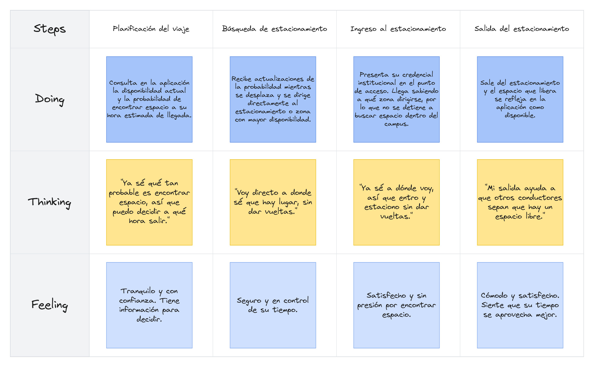

#### Administradores de estacionamientos universitarios

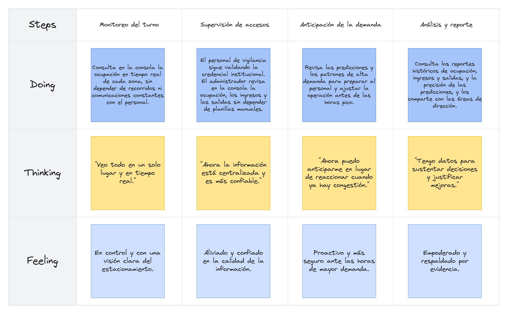

## 3.2. User Stories

Los requisitos de Quadrapp se expresan como Epics, User Stories y Technical Stories en un único cuadro, con una fila por cada elemento. Las siete épicas agrupan las capacidades del producto: el acceso a la aplicación, la consulta de disponibilidad, la predicción y asesoría de llegada, la gestión de la infraestructura de estacionamientos, la analítica histórica, el sitio web estático de presentación y las alertas.

Las User Stories dirigidas a la comunidad universitaria y al personal que administra el estacionamiento describen funcionalidades observables por el usuario. Las dirigidas al visitante de la Landing Page cubren el sitio público, con llamadas a la acción diferenciadas por segmento objetivo. Las Technical Stories, redactadas con el rol de Developer, corresponden a los componentes sin interacción directa con el usuario final, como las APIs internas y la ingesta de eventos de los sensores. Sus criterios de aceptación describen solicitudes, respuestas o eventos observables según el tipo de interacción. Todos los criterios siguen la estructura Gherkin en tiempo presente y tercera persona, sin referencias a detalles de interfaz.

<table> <thead> <tr> <th>Epic / User Story ID</th> <th>Título</th> <th>Descripción</th> <th>Criterios de Aceptación</th> <th>Relacionado con (Epic ID)</th> </tr> </thead> <tbody>

<tr>
  <td><strong>EP01</strong></td>
  <td>Acceso e identidad</td>
  <td>Permitir que Integra Labs incorpore una institución y que conductores, administradores y operadores accedan con un código de un solo uso enviado a su correo habilitado o invitado, según su rol, y gestionen su sesión de forma segura.</td>
  <td>No aplica</td>
  <td>No aplica</td>
</tr>

<tr>
  <td><strong>EP02</strong></td>
  <td>Disponibilidad de estacionamientos</td>
  <td>Permitir consultar el estado actual de los estacionamientos universitarios, incluyendo espacios disponibles, ocupados y estados desconocidos por zona.</td>
  <td>No aplica</td>
  <td>No aplica</td>
</tr>

<tr>
  <td><strong>EP03</strong></td>
  <td>Predicción y asesoría de llegada</td>
  <td>Proporcionar predicciones de disponibilidad futura y asesoría de llegada considerando el tiempo estimado de llegada del usuario al estacionamiento.</td>
  <td>No aplica</td>
  <td>No aplica</td>
</tr>

<tr>
  <td><strong>EP04</strong></td>
  <td>Gestión e infraestructura de estacionamientos</td>
  <td>Gestionar la configuración de estacionamientos, zonas, espacios y accesos vehiculares, además de la integración y monitoreo de los sensores utilizados para detectar la ocupación.</td>
  <td>No aplica</td>
  <td>No aplica</td>
</tr>

<tr>
  <td><strong>EP05</strong></td>
  <td>Analítica histórica</td>
  <td>Permitir que la institución consulte la información histórica de ocupación, los periodos de mayor demanda y la precisión de las predicciones.</td>
  <td>No aplica</td>
  <td>No aplica</td>
</tr>

<tr>
  <td><strong>EP06</strong></td>
  <td>Presentación del producto en la Landing Page</td>
  <td>Permitir que un visitante conozca la propuesta de valor de Quadrapp, encuentre la información correspondiente a su segmento y acceda a la aplicación o al canal de contacto institucional desde el sitio web estático.</td>
  <td>No aplica</td>
  <td>No aplica</td>
</tr>

<tr>
  <td><strong>EP07</strong></td>
  <td>Alertas y notificaciones</td>
  <td>Permitir que el conductor se suscriba a las alertas de un estacionamiento y gestione las preferencias con las que desea recibirlas.</td>
  <td>No aplica</td>
  <td>No aplica</td>
</tr>

<tr>
  <td><strong>US01</strong></td>
  <td>Iniciar sesión con un correo autorizado</td>
  <td>Como usuario autorizado por una institución, quiero iniciar sesión con mi correo verificado y un código de un solo uso para acceder a Quadrapp según el rol que me corresponde.</td>
  <td>
    <strong>Escenario 1: Solicitud del código de verificación.</strong><br>
    Dado que el usuario ingresa un correo cuyo dominio pertenece a una universidad registrada,<br>
    cuando solicita el acceso,<br>
    entonces el sistema envía un código de un solo uso a ese correo e informa su periodo de vigencia.<br><br>
    <strong>Escenario 2: Código válido.</strong><br>
    Dado que el usuario recibió un código vigente,<br>
    cuando lo ingresa dentro de su periodo de vigencia,<br>
    entonces el sistema habilita su sesión con el rol y la universidad que le corresponden.<br><br>
    <strong>Escenario 3: Código incorrecto o vencido.</strong><br>
    Dado que el código ingresado no coincide con el enviado o su vigencia terminó,<br>
    cuando el usuario intenta continuar,<br>
    entonces el sistema rechaza el acceso e informa que debe solicitar un nuevo código.<br><br>
    <strong>Escenario 4: Correo invitado por una institución.</strong><br>
    Dado que el correo no pertenece a un dominio habilitado pero cuenta con una invitación vigente o con una cuenta creada previamente,<br>
    cuando el usuario solicita el acceso,<br>
    entonces el sistema envía el código y le otorga el rol registrado en su cuenta o invitación.<br><br>
    <strong>Escenario 5: Correo sin vínculo institucional.</strong><br>
    Dado que el correo no pertenece a un dominio habilitado y tampoco tiene invitación ni cuenta previa,<br>
    cuando el usuario solicita el acceso,<br>
    entonces el sistema no envía ningún código e informa que el correo no corresponde a una institución habilitada.<br><br>
    <strong>Escenario 6: Sesión vigente.</strong><br>
    Dado que el usuario mantiene una sesión válida,<br>
    cuando vuelve a utilizar la aplicación,<br>
    entonces el sistema conserva su acceso sin solicitar un nuevo código.
  </td>
  <td>EP01</td>
</tr>

<tr>
  <td><strong>US02</strong></td>
  <td>Cerrar sesión</td>
  <td>Como usuario autenticado, quiero cerrar mi sesión para evitar que otra persona pueda acceder a mi cuenta desde el dispositivo.</td>
  <td>
    <strong>Escenario 1: Cierre exitoso.</strong><br>
    Dado que el usuario tiene una sesión activa,<br>
    cuando solicita el cierre de sesión,<br>
    entonces el sistema finaliza su sesión y revoca el token asociado.<br><br>
    <strong>Escenario 2: Acceso posterior al cierre.</strong><br>
    Dado que el usuario cerró su sesión,<br>
    cuando intenta acceder a una funcionalidad protegida,<br>
    entonces el sistema solicita nuevamente la autenticación.<br><br>
    <strong>Escenario 3: Cierre en un dispositivo compartido.</strong><br>
    Dado que el usuario cerró su sesión en el dispositivo,<br>
    cuando otra persona utiliza ese mismo dispositivo,<br>
    entonces el sistema no expone la información asociada a la cuenta anterior.
  </td>
  <td>EP01</td>
</tr>

<tr>
  <td><strong>US03</strong></td>
  <td>Gestionar sesión expirada</td>
  <td>Como usuario autenticado, quiero que el sistema controle la expiración de mi sesión para mantener protegido mi acceso a Quadrapp.</td>
  <td>
    <strong>Escenario 1: Sesión expirada.</strong><br>
    Dado que la sesión del usuario ha expirado,<br>
    cuando intenta acceder a una funcionalidad protegida,<br>
    entonces el sistema solicita una nueva autenticación.<br><br>
    <strong>Escenario 2: Expiración durante el uso.</strong><br>
    Dado que el usuario está utilizando la aplicación,<br>
    cuando su sesión expira,<br>
    entonces el sistema muestra un mensaje indicando que debe iniciar sesión nuevamente.<br><br>
    <strong>Escenario 3: Nueva autenticación.</strong><br>
    Dado que la sesión anterior expiró,<br>
    cuando el usuario se autentica nuevamente de forma correcta,<br>
    entonces puede continuar utilizando Quadrapp.
  </td>
  <td>EP01</td>
</tr>

<tr>
  <td><strong>US04</strong></td>
  <td>Consultar estacionamientos universitarios</td>
  <td>Como conductor de la comunidad educativa, quiero visualizar los estacionamientos disponibles dentro de mi universidad para identificar las áreas donde puedo estacionar.</td>
  <td>
    <strong>Escenario 1: Estacionamientos disponibles.</strong><br>
    Dado que existen estacionamientos configurados,<br>
    cuando el usuario ingresa a la sección de estacionamientos,<br>
    entonces el sistema muestra los estacionamientos disponibles.<br><br>
    <strong>Escenario 2: Estacionamiento sin datos vigentes.</strong><br>
    Dado que un estacionamiento no tiene una distribución publicada ni datos de ocupación vigentes,<br>
    cuando el usuario consulta los estacionamientos,<br>
    entonces el sistema lo presenta sin información de disponibilidad e indica que sus datos no están vigentes.<br><br>
    <strong>Escenario 3: Sin estacionamientos configurados.</strong><br>
    Dado que no existen estacionamientos registrados,<br>
    cuando el usuario accede a la sección,<br>
    entonces el sistema muestra un mensaje informativo.
  </td>
  <td>EP02</td>
</tr>

<tr>
  <td><strong>US05</strong></td>
  <td>Consultar disponibilidad actual</td>
  <td>Como conductor de la comunidad educativa, quiero conocer la disponibilidad actual de los espacios de estacionamiento para decidir dónde estacionar.</td>
  <td>
    <strong>Escenario 1: Espacios disponibles.</strong><br>
    Dado que existen datos actualizados de los sensores,<br>
    cuando el usuario consulta un estacionamiento,<br>
    entonces el sistema muestra los espacios libres y ocupados.<br><br>
    <strong>Escenario 2: Espacio ocupado.</strong><br>
    Dado que Parking Sensing confirma la detección de un vehículo en el espacio tras el tiempo mínimo configurado,<br>
    cuando se actualiza la información de disponibilidad,<br>
    entonces el espacio se presenta como ocupado.<br><br>
    <strong>Escenario 3: Espacio libre.</strong><br>
    Dado que Parking Sensing confirma que el espacio quedó libre tras el tiempo mínimo sin detección,<br>
    cuando se actualiza la información,<br>
    entonces el espacio se presenta como disponible.<br><br>
    <strong>Escenario 4: Antigüedad del dato.</strong><br>
    Dado que cada consulta corresponde a un estado consolidado en un momento determinado,<br>
    cuando el usuario consulta la disponibilidad,<br>
    entonces el sistema informa la antigüedad de esa información.
  </td>
  <td>EP02</td>
</tr>

<tr>
  <td><strong>US06</strong></td>
  <td>Consultar disponibilidad por zona</td>
  <td>Como conductor de la comunidad educativa, quiero visualizar la disponibilidad agrupada por zonas para identificar rápidamente dónde existe mayor disponibilidad.</td>
  <td>
    <strong>Escenario 1: Consulta por zona.</strong><br>
    Dado que un estacionamiento posee varias zonas,<br>
    cuando el usuario consulta su disponibilidad,<br>
    entonces el sistema muestra el estado de cada zona.<br><br>
    <strong>Escenario 2: Zona con espacios disponibles.</strong><br>
    Dado que una zona contiene espacios libres y ocupados,<br>
    cuando el usuario consulta la zona,<br>
    entonces el sistema muestra su disponibilidad correspondiente.<br><br>
    <strong>Escenario 3: Zona con espacios desconocidos.</strong><br>
    Dado que una zona contiene espacios en estado UNKNOWN,<br>
    cuando el usuario consulta su estado,<br>
    entonces el sistema informa la cantidad de espacios libres y ocupados, y excluye del conteo los espacios desconocidos indicando su número.
  </td>
  <td>EP02</td>
</tr>

<tr>
  <td><strong>US07</strong></td>
  <td>Actualizar disponibilidad</td>
  <td>Como conductor de la comunidad educativa, quiero recibir actualizaciones de la ocupación de los estacionamientos para consultar información cercana al estado real.</td>
  <td>
    <strong>Escenario 1: Cambio a ocupado.</strong><br>
    Dado que un sensor detecta que un espacio cambia de libre a ocupado,<br>
    cuando el evento es procesado,<br>
    entonces el sistema actualiza el estado del espacio.<br><br>
    <strong>Escenario 2: Cambio a libre.</strong><br>
    Dado que un sensor detecta que un espacio cambia de ocupado a libre,<br>
    cuando el evento es procesado,<br>
    entonces el sistema refleja el nuevo estado.<br><br>
    <strong>Escenario 3: Sin cambios de estado.</strong><br>
    Dado que los sensores continúan reportando su actividad pero ningún espacio cambia de estado,<br>
    cuando el usuario consulta la disponibilidad,<br>
    entonces el sistema conserva el último estado válido e informa la marca de tiempo a la que corresponde.
  </td>
  <td>EP02</td>
</tr>

<tr>
  <td><strong>US08</strong></td>
  <td>Gestionar estado desconocido</td>
  <td>Como conductor de la comunidad educativa, quiero identificar cuándo un espacio no tiene información confiable para evitar interpretar un dato desactualizado como disponibilidad real.</td>
  <td>
    <strong>Escenario 1: Sensor sin reportar actividad.</strong><br>
    Dado que un sensor tiene configurado un intervalo esperado de comunicación,<br>
    cuando deja de reportar su actividad y se supera ese intervalo,<br>
    entonces el espacio pasa al estado <strong>UNKNOWN</strong> y no se contabiliza como disponible.<br><br>
    <strong>Escenario 2: Sensor con batería crítica.</strong><br>
    Dado que un sensor informa periódicamente su nivel de batería,<br>
    cuando el nivel reportado se encuentra por debajo del umbral configurado,<br>
    entonces el espacio pasa al estado <strong>UNKNOWN</strong> y no se contabiliza como disponible.<br><br>
    <strong>Escenario 3: Espacio desconocido.</strong><br>
    Dado que un espacio se encuentra en estado UNKNOWN,<br>
    cuando el usuario consulta la disponibilidad,<br>
    entonces el sistema lo presenta como desconocido y lo excluye del conteo de espacios disponibles.<br><br>
    <strong>Escenario 4: Recuperación del sensor.</strong><br>
    Dado que un sensor reanuda el reporte de su actividad,<br>
    cuando informa una detección estable durante el tiempo mínimo configurado,<br>
    entonces el espacio abandona el estado UNKNOWN y toma el estado confirmado.
  </td>
  <td>EP02</td>
</tr>

<tr>
  <td><strong>US09</strong></td>
  <td>Consultar predicción de disponibilidad</td>
  <td>Como conductor de la comunidad educativa, quiero consultar la disponibilidad futura de los estacionamientos para anticipar si encontraré un espacio al llegar al campus.</td>
  <td>
    <strong>Escenario 1: Predicción disponible.</strong><br>
    Dado que existen datos históricos suficientes,<br>
    cuando el usuario consulta una predicción,<br>
    entonces el sistema muestra la disponibilidad estimada.<br><br>
    <strong>Escenario 2: Origen del pronóstico.</strong><br>
    Dado que cada pronóstico se genera con una versión de modelo y un nivel de confianza,<br>
    cuando el usuario consulta la disponibilidad estimada,<br>
    entonces el sistema informa el momento de su generación y su nivel de confianza.<br><br>
    <strong>Escenario 3: Historial limitado.</strong><br>
    Dado que el estacionamiento no acumula historial suficiente,<br>
    cuando el usuario realiza la consulta,<br>
    entonces el sistema presenta la heurística de respaldo e informa que su nivel de confianza es bajo.
  </td>
  <td>EP03</td>
</tr>

<tr>
  <td><strong>US10</strong></td>
  <td>Consultar diferentes horizontes de predicción</td>
  <td>Como conductor de la comunidad educativa, quiero consultar predicciones a 15, 30, 45 y 60 minutos para conocer cómo podría variar la disponibilidad antes de mi llegada.</td>
  <td>
    <strong>Escenario 1: Todos los horizontes disponibles.</strong><br>
    Dado que existen predicciones válidas,<br>
    cuando el usuario consulta la información futura,<br>
    entonces visualiza las predicciones de 15, 30, 45 y 60 minutos.<br><br>
    <strong>Escenario 2: Información parcial.</strong><br>
    Dado que solamente existen predicciones para algunos horizontes,<br>
    cuando el usuario realiza la consulta,<br>
    entonces el sistema muestra los datos disponibles e indica los faltantes.<br><br>
    <strong>Escenario 3: Predicción vencida.</strong><br>
    Dado que una predicción ya no corresponde al periodo vigente,<br>
    cuando el usuario consulta la información,<br>
    entonces el sistema evita mostrarla como predicción actual.
  </td>
  <td>EP03</td>
</tr>

<tr>
  <td><strong>US11</strong></td>
  <td>Visualizar la ocupación esperada</td>
  <td>Como conductor de la comunidad educativa, quiero visualizar la ocupación esperada del estacionamiento en el horizonte consultado para comprender cómo evolucionará su disponibilidad.</td>
  <td>
    <strong>Escenario 1: Ocupación esperada disponible.</strong><br>
    Dado que existe un pronóstico vigente para el estacionamiento,<br>
    cuando el usuario consulta el horizonte seleccionado,<br>
    entonces el sistema presenta la ocupación esperada expresada en porcentaje.<br><br>
    <strong>Escenario 2: Saturación prevista.</strong><br>
    Dado que la ocupación esperada supera el umbral de saturación definido para el estacionamiento,<br>
    cuando el usuario consulta el pronóstico,<br>
    entonces el sistema indica el momento previsto de saturación junto con el porcentaje estimado.<br><br>
    <strong>Escenario 3: Confianza del pronóstico.</strong><br>
    Dado que cada pronóstico se genera con un nivel de confianza asociado,<br>
    cuando el sistema presenta la ocupación esperada,<br>
    entonces informa el nivel de confianza correspondiente sin traducirlo a una categoría de llegada.
  </td>
  <td>EP03</td>
</tr>

<tr>
  <td><strong>US12</strong></td>
  <td>Identificar predicciones con confianza baja</td>
  <td>Como conductor de la comunidad educativa, quiero distinguir cuándo una predicción se basa en información limitada para decidir cuánto peso darle al resultado.</td>
  <td>
    <strong>Escenario 1: Datos históricos insuficientes.</strong><br>
    Dado que el estacionamiento no cuenta con suficiente historial de ocupación,<br>
    cuando el usuario consulta la predicción,<br>
    entonces el sistema presenta la heurística de respaldo e indica que su nivel de confianza es bajo.<br><br>
    <strong>Escenario 2: Datos inconsistentes.</strong><br>
    Dado que el historial disponible presenta inconsistencias,<br>
    cuando el sistema genera la predicción,<br>
    entonces reduce el nivel de confianza informado y mantiene la advertencia al usuario.<br><br>
    <strong>Escenario 3: Historial suficiente.</strong><br>
    Dado que el estacionamiento acumula historial suficiente,<br>
    cuando se genera una nueva predicción,<br>
    entonces el sistema emplea el modelo principal e informa su nivel de confianza sin advertencia.
  </td>
  <td>EP03</td>
</tr>

<tr>
  <td><strong>US13</strong></td>
  <td>Obtener asesoría de llegada</td>
  <td>Como conductor de la comunidad educativa, quiero recibir una asesoría basada en la disponibilidad prevista y en el tiempo estimado de llegada que calcula la aplicación para conocer las condiciones esperadas al llegar.</td>
  <td>
    <strong>Escenario 1: Asesoría para la hora de llegada.</strong><br>
    Dado que la aplicación calcula en el dispositivo el tiempo estimado de llegada y envía únicamente los minutos,<br>
    cuando el conductor solicita la asesoría,<br>
    entonces el sistema entrega la probabilidad de encontrar espacio a esa hora estimada.<br><br>
    <strong>Escenario 2: Tiempo de llegada inválido.</strong><br>
    Dado que el tiempo estimado calculado es negativo o supera el máximo admitido,<br>
    cuando el conductor solicita la asesoría,<br>
    entonces el sistema no genera la asesoría e informa el motivo del rechazo.<br><br>
    <strong>Escenario 3: Historial limitado.</strong><br>
    Dado que el pronóstico utilizado proviene de la heurística de respaldo,<br>
    cuando se genera la asesoría,<br>
    entonces el sistema la entrega e informa que su nivel de confianza es bajo.
  </td>
  <td>EP03</td>
</tr>

<tr>
  <td><strong>US14</strong></td>
  <td>Actualizar asesoría según ETA</td>
  <td>Como conductor de la comunidad educativa, quiero que la asesoría se actualice cuando cambie mi tiempo estimado de llegada para consultar información acorde a mi llegada prevista.</td>
  <td>
    <strong>Escenario 1: Cambio del tiempo estimado.</strong><br>
    Dado que la aplicación recalcula periódicamente el tiempo estimado de llegada mientras el conductor se dirige al campus,<br>
    cuando ese tiempo varía respecto del último informado,<br>
    entonces el sistema recalcula la asesoría sin que el conductor deba solicitarla.<br><br>
    <strong>Escenario 2: Nuevo horizonte.</strong><br>
    Dado que el nuevo ETA corresponde a otro horizonte de predicción,<br>
    cuando se actualiza la asesoría,<br>
    entonces el sistema utiliza la predicción correspondiente.<br><br>
    <strong>Escenario 3: Nuevo horizonte con historial limitado.</strong><br>
    Dado que el nuevo tiempo estimado corresponde a un horizonte cuyo pronóstico proviene de la heurística de respaldo,<br>
    cuando el sistema recalcula la asesoría,<br>
    entonces el sistema entrega la asesoría recalculada e informa que su nivel de confianza es bajo.
  </td>
  <td>EP03</td>
</tr>

<tr>
  <td><strong>US15</strong></td>
  <td>Mostrar categoría de disponibilidad esperada</td>
  <td>Como conductor de la comunidad educativa, quiero visualizar una categoría simple de disponibilidad esperada para interpretar rápidamente las condiciones del estacionamiento al momento de mi llegada.</td>
  <td>
    <strong>Escenario 1: Alta probabilidad de encontrar espacio.</strong><br>
    Dado que la probabilidad de encontrar espacio al llegar es alta,<br>
    cuando se genera la asesoría,<br>
    entonces el sistema muestra la categoría <strong>HIGH</strong>.<br><br>
    <strong>Escenario 2: Probabilidad limitada.</strong><br>
    Dado que la probabilidad de encontrar espacio al llegar es intermedia,<br>
    cuando se genera la asesoría,<br>
    entonces el sistema muestra la categoría <strong>LIMITED</strong>.<br><br>
    <strong>Escenario 3: Baja probabilidad de encontrar espacio.</strong><br>
    Dado que la probabilidad de encontrar espacio al llegar es baja,<br>
    cuando se genera la asesoría,<br>
    entonces el sistema muestra la categoría <strong>LOW</strong>.
  </td>
  <td>EP03</td>
</tr>

<tr>
  <td><strong>US16</strong></td>
  <td>Registrar estacionamiento universitario</td>
  <td>Como administrador de estacionamientos, quiero registrar los estacionamientos de la universidad para que puedan ser utilizados por Quadrapp.</td>
  <td>
    <strong>Escenario 1: Registro exitoso.</strong><br>
    Dado que el administrador proporciona los datos obligatorios,<br>
    cuando registra un estacionamiento,<br>
    entonces el sistema crea el estacionamiento correctamente.<br><br>
    <strong>Escenario 2: Datos incompletos.</strong><br>
    Dado que faltan datos obligatorios,<br>
    cuando el administrador intenta registrar el estacionamiento,<br>
    entonces el sistema solicita completar la información requerida.<br><br>
    <strong>Escenario 3: Registro duplicado.</strong><br>
    Dado que la institución ya tiene un estacionamiento registrado con el mismo nombre,<br>
    cuando el administrador intenta registrar otro con ese nombre,<br>
    entonces el sistema impide la duplicación dentro de esa institución.
  </td>
  <td>EP04</td>
</tr>

<tr>
  <td><strong>US17</strong></td>
  <td>Configurar zonas y espacios</td>
  <td>Como administrador de estacionamientos, quiero configurar las zonas y espacios de cada estacionamiento para representar su distribución física en Quadrapp.</td>
  <td>
    <strong>Escenario 1: Crear zona.</strong><br>
    Dado un estacionamiento registrado en la institución,<br>
    cuando el administrador crea una nueva zona,<br>
    entonces la zona queda asociada a ese estacionamiento.<br><br>
    <strong>Escenario 2: Registrar espacio.</strong><br>
    Dado que existe una zona configurada,<br>
    cuando el administrador registra un espacio,<br>
    entonces el espacio queda asociado a dicha zona.<br><br>
    <strong>Escenario 3: Espacio duplicado.</strong><br>
    Dado que un espacio con la misma etiqueta ya existe dentro de la zona,<br>
    cuando el administrador intenta registrarlo nuevamente,<br>
    entonces el sistema impide la duplicación.<br><br>
    <strong>Escenario 4: Publicación de la distribución.</strong><br>
    Dado que el administrador terminó de configurar las zonas y los espacios,<br>
    cuando publica la distribución del estacionamiento,<br>
    entonces el sistema incrementa su versión y la deja disponible para las aplicaciones.
  </td>
  <td>EP04</td>
</tr>

<tr>
  <td><strong>US18</strong></td>
  <td>Asociar sensor a espacio</td>
  <td>Como administrador de estacionamientos, quiero asociar cada sensor físico con su espacio correspondiente para identificar correctamente la ocupación.</td>
  <td>
    <strong>Escenario 1: Asociación exitosa.</strong><br>
    Dado que existe un sensor registrado y un espacio configurado,<br>
    cuando el administrador los asocia,<br>
    entonces el sistema guarda la relación.<br><br>
    <strong>Escenario 2: Sensor ya asociado.</strong><br>
    Dado que el sensor ya se encuentra asociado a otro espacio,<br>
    cuando el administrador intenta asociarlo nuevamente,<br>
    entonces el sistema impide la asociación duplicada.<br><br>
    <strong>Escenario 3: Desactivación.</strong><br>
    Dado que un sensor deja de estar operativo,<br>
    cuando el administrador lo desactiva,<br>
    entonces el sistema conserva su relación histórica y el espacio asociado pasa al estado UNKNOWN hasta contar con un sensor operativo.
  </td>
  <td>EP04</td>
</tr>

<tr>
  <td><strong>US19</strong></td>
  <td>Configurar accesos vehiculares</td>
  <td>Como administrador de estacionamientos, quiero configurar los accesos de entrada y salida para registrar los movimientos de vehículos dentro del estacionamiento.</td>
  <td>
    <strong>Escenario 1: Registrar acceso.</strong><br>
    Dado que el administrador configura un nuevo acceso,<br>
    cuando proporciona sus datos,<br>
    entonces el acceso queda asociado al estacionamiento correspondiente.<br><br>
    <strong>Escenario 2: Sensores del acceso.</strong><br>
    Dado que el conteo de entradas y salidas requiere conocer la dirección del movimiento,<br>
    cuando el administrador asocia al acceso sus sensores de paso,<br>
    entonces el sistema solo habilita el acceso si sus sensores permiten distinguir la dirección.<br><br>
    <strong>Escenario 3: Acceso sin dirección.</strong><br>
    Dado que un acceso cuenta únicamente con sensores que no distinguen la dirección,<br>
    cuando el administrador intenta habilitarlo para el conteo de flujo,<br>
    entonces el sistema lo rechaza e informa que ese acceso no puede alimentar la velocidad de flujo.
  </td>
  <td>EP04</td>
</tr>

<tr>
  <td><strong>US20</strong></td>
  <td>Monitorear salud de sensores</td>
  <td>Como administrador de estacionamientos, quiero conocer el estado de los sensores para identificar dispositivos que presentan problemas de comunicación o funcionamiento.</td>
  <td>
    <strong>Escenario 1: Sensor operativo.</strong><br>
    Dado que un sensor reporta periódicamente su estado,<br>
    cuando el sistema recibe su reporte,<br>
    entonces registra la última comunicación del dispositivo.<br><br>
    <strong>Escenario 2: Sensor sin comunicación.</strong><br>
    Dado que un sensor deja de enviar información durante el tiempo establecido,<br>
    cuando se supera dicho periodo,<br>
    entonces el sistema identifica el dispositivo como no disponible.<br><br>
    <strong>Escenario 3: Recuperación del dispositivo.</strong><br>
    Dado que un sensor reanuda el reporte de su actividad con un nivel de batería válido,<br>
    cuando el sistema recibe ese reporte,<br>
    entonces lo registra nuevamente como operativo.<br><br>
    <strong>Escenario 4: Estado del espacio tras la recuperación.</strong><br>
    Dado que el sensor recuperado tiene un espacio asociado en estado UNKNOWN,<br>
    cuando informa una detección estable durante el tiempo mínimo configurado,<br>
    entonces el espacio abandona el estado UNKNOWN y toma el estado confirmado.
  </td>
  <td>EP04</td>
</tr>

<tr>
  <td><strong>US21</strong></td>
  <td>Consultar historial de ocupación</td>
  <td>Como administrador de estacionamientos, quiero consultar el historial de ocupación para analizar el comportamiento de los estacionamientos universitarios.</td>
  <td>
    <strong>Escenario 1: Consulta histórica.</strong><br>
    Dado que existen registros históricos,<br>
    cuando el administrador selecciona un periodo,<br>
    entonces el sistema muestra la información correspondiente.<br><br>
    <strong>Escenario 2: Filtrado por zona.</strong><br>
    Dado que existen registros de diferentes zonas,<br>
    cuando el administrador selecciona una zona,<br>
    entonces el sistema muestra la información correspondiente a dicha zona.<br><br>
    <strong>Escenario 3: Sin registros.</strong><br>
    Dado que no existen datos para el periodo seleccionado,<br>
    cuando el administrador realiza la consulta,<br>
    entonces el sistema muestra un mensaje indicando que no existen registros.
  </td>
  <td>EP05</td>
</tr>

<tr>
  <td><strong>US22</strong></td>
  <td>Identificar horas de mayor ocupación</td>
  <td>Como administrador de estacionamientos, quiero identificar los periodos con mayor ocupación para conocer los horarios de mayor demanda.</td>
  <td>
    <strong>Escenario 1: Identificación de horas pico.</strong><br>
    Dado que existen suficientes datos históricos,<br>
    cuando el administrador consulta la analítica,<br>
    entonces el sistema muestra los periodos de mayor ocupación.<br><br>
    <strong>Escenario 2: Comparación temporal.</strong><br>
    Dado que existen datos de diferentes días y horarios,<br>
    cuando el administrador consulta la información,<br>
    entonces puede identificar variaciones en los niveles de ocupación.<br><br>
    <strong>Escenario 3: Datos insuficientes.</strong><br>
    Dado que no existen suficientes datos históricos,<br>
    cuando el administrador consulta el análisis,<br>
    entonces el sistema informa que no existe información suficiente.
  </td>
  <td>EP05</td>
</tr>

<tr>
  <td><strong>US23</strong></td>
  <td>Recibir alertas de baja disponibilidad</td>
  <td>Como conductor de la comunidad educativa, quiero recibir una alerta cuando se prevea la saturación del estacionamiento en la franja en la que suelo llegar para anticipar posibles dificultades al estacionar.</td>
  <td>
    <strong>Escenario 1: Alerta programada por saturación prevista.</strong><br>
    Dado que el conductor mantiene una suscripción vigente para una franja horaria,<br>
    cuando se prevé la saturación del estacionamiento dentro de esa franja,<br>
    entonces el sistema le envía la alerta correspondiente.<br><br>
    <strong>Escenario 2: Acceso a la asesoría desde la alerta.</strong><br>
    Dado que el conductor recibió una alerta de saturación prevista,<br>
    cuando la abre en su dispositivo,<br>
    entonces la aplicación muestra la asesoría de llegada para ese estacionamiento.<br><br>
    <strong>Escenario 3: Notificaciones deshabilitadas.</strong><br>
    Dado que el conductor deshabilitó las notificaciones,<br>
    cuando se prevé la saturación dentro de su franja suscrita,<br>
    entonces el sistema conserva la suscripción y omite el envío.<br><br>
    <strong>Escenario 4: Evitar alertas repetitivas.</strong><br>
    Dado que ya se envió una alerta para una condición determinada,<br>
    cuando la misma condición continúa activa,<br>
    entonces el sistema evita generar alertas repetitivas innecesarias.
  </td>
  <td>EP07</td>
</tr>

<tr>
  <td><strong>US24</strong></td>
  <td>Gestionar preferencias de notificaciones</td>
  <td>Como conductor de la comunidad educativa, quiero configurar mis preferencias de notificaciones para decidir qué alertas deseo recibir.</td>
  <td>
    <strong>Escenario 1: Activar notificaciones.</strong><br>
    Dado que el usuario accede a sus preferencias,<br>
    cuando habilita las notificaciones,<br>
    entonces el sistema guarda la configuración y permite recibir las alertas correspondientes.<br><br>
    <strong>Escenario 2: Desactivar notificaciones.</strong><br>
    Dado que el usuario deshabilita las notificaciones,<br>
    cuando se genera una alerta posterior,<br>
    entonces el sistema no envía la notificación push.<br><br>
    <strong>Escenario 3: Modificar preferencias.</strong><br>
    Dado que el usuario cambia sus preferencias,<br>
    cuando guarda la configuración,<br>
    entonces los nuevos valores se aplican a las siguientes notificaciones.
  </td>
  <td>EP07</td>
</tr>
<tr>
  <td><strong>US25</strong></td>
  <td>Conocer la propuesta de valor en la Landing Page</td>
  <td>Como visitante, quiero conocer qué resuelve Quadrapp desde su sitio web, para evaluar si la solución responde a la necesidad de mi institución o la mía.</td>
  <td>
    <strong>Escenario 1: Presentación de la propuesta de valor.</strong><br>
    Dado que el visitante accede a la Landing Page,<br>
    cuando revisa la sección principal,<br>
    entonces encuentra el problema que atiende Quadrapp y el beneficio que ofrece a la comunidad universitaria.<br><br>
    <strong>Escenario 2: Acceso a las secciones informativas.</strong><br>
    Dado que el visitante se encuentra en la Landing Page,<br>
    cuando navega por las secciones de funcionalidades, quiénes somos y contacto,<br>
    entonces accede al contenido correspondiente a cada sección sin abandonar el sitio.
  </td>
  <td>EP06</td>
</tr>

<tr>
  <td><strong>US26</strong></td>
  <td>Acceder a la aplicación como visitante del segmento conductores</td>
  <td>Como visitante del segmento de conductores de la comunidad educativa, quiero entender cómo la aplicación me ayuda a saber si encontraré espacio, para decidir si la instalo en mi dispositivo.</td>
  <td>
    <strong>Escenario 1: Contenido dirigido al conductor.</strong><br>
    Dado que el visitante revisa la sección dirigida a conductores,<br>
    cuando consulta su contenido,<br>
    entonces encuentra descrita la consulta de disponibilidad y la asesoría de llegada según su tiempo estimado de viaje.<br><br>
    <strong>Escenario 2: Llamada a la acción hacia la aplicación móvil.</strong><br>
    Dado que el visitante decide utilizar la aplicación,<br>
    cuando activa la llamada a la acción de esa sección,<br>
    entonces es dirigido al sitio de descarga de la aplicación móvil.
  </td>
  <td>EP06</td>
</tr>

<tr>
  <td><strong>US27</strong></td>
  <td>Conocer la propuesta institucional como visitante del segmento administradores</td>
  <td>Como visitante del segmento de administradores de estacionamientos universitarios, quiero conocer qué información entrega la consola de operación, para evaluar la adopción de Quadrapp en mi institución.</td>
  <td>
    <strong>Escenario 1: Contenido dirigido a la institución.</strong><br>
    Dado que el visitante revisa la sección dirigida a instituciones,<br>
    cuando consulta su contenido,<br>
    entonces encuentra descritos el monitoreo de ocupación, los reportes históricos y las alertas de saturación.<br><br>
    <strong>Escenario 2: Llamada a la acción hacia el contacto institucional.</strong><br>
    Dado que el visitante desea evaluar la solución para su universidad,<br>
    cuando activa la llamada a la acción de esa sección,<br>
    entonces es dirigido al formulario de contacto institucional y recibe la confirmación de su envío.
  </td>
  <td>EP06</td>
</tr>

<tr>
  <td><strong>US28</strong></td>
  <td>Consultar los términos y la política de privacidad</td>
  <td>Como visitante, quiero consultar los términos y condiciones y la política de privacidad desde la Landing Page, para conocer qué datos personales trata Quadrapp antes de registrarme.</td>
  <td>
    <strong>Escenario 1: Acceso a los documentos legales.</strong><br>
    Dado que el visitante se encuentra en cualquier sección de la Landing Page,<br>
    cuando solicita los términos y condiciones o la política de privacidad,<br>
    entonces accede al documento de términos y condiciones o a la política de privacidad.<br><br>
    <strong>Escenario 2: Información sobre el tratamiento de datos.</strong><br>
    Dado que el visitante consulta la política de privacidad,<br>
    cuando revisa su contenido,<br>
    entonces encuentra qué datos personales se recolectan y con qué finalidad se utilizan.
  </td>
  <td>EP06</td>
</tr>

<tr>
  <td><strong>US29</strong></td>
  <td>Monitorear la operación del estacionamiento desde la consola</td>
  <td>Como operador del estacionamiento, quiero monitorear el estado actual del estacionamiento durante mi turno para anticipar la saturación y coordinar el flujo en los accesos.</td>
  <td>
    <strong>Escenario 1: Estado actual del estacionamiento.</strong><br>
    Dado que el operador cuenta con una sesión vigente en la consola de operación,<br>
    cuando consulta el estacionamiento a su cargo,<br>
    entonces el sistema presenta la capacidad total, los espacios libres, los ocupados, los desconocidos y el flujo de entradas y salidas del periodo.<br><br>
    <strong>Escenario 2: Aviso de saturación prevista.</strong><br>
    Dado que el pronóstico indica que el estacionamiento alcanzará su saturación dentro del horizonte consultado,<br>
    cuando el operador consulta la consola,<br>
    entonces el sistema informa el momento previsto de saturación.<br><br>
    <strong>Escenario 3: Información desactualizada.</strong><br>
    Dado que el estacionamiento no recibe eventos dentro del tiempo máximo de vigencia,<br>
    cuando el operador consulta el estado,<br>
    entonces el sistema informa la antigüedad del último dato consolidado.
  </td>
  <td>EP02, EP03, EP04</td>
</tr>

<tr>
  <td><strong>US30</strong></td>
  <td>Gestionar los dominios de correo habilitados</td>
  <td>Como administrador de estacionamientos, quiero gestionar los dominios de correo institucional habilitados para mi universidad para controlar quién puede registrarse en Quadrapp.</td>
  <td>
    <strong>Escenario 1: Agregar un dominio.</strong><br>
    Dado que el administrador pertenece a una institución registrada,<br>
    cuando agrega un dominio de correo institucional,<br>
    entonces el sistema lo habilita para el registro de nuevos usuarios de esa institución.<br><br>
    <strong>Escenario 2: Retirar un dominio.</strong><br>
    Dado que un dominio deja de pertenecer a la institución,<br>
    cuando el administrador lo retira,<br>
    entonces el sistema impide nuevos registros con ese dominio y conserva las cuentas ya verificadas.<br><br>
    <strong>Escenario 3: Dominio en uso por otra institución.</strong><br>
    Dado que el dominio ya está habilitado para otra institución,<br>
    cuando el administrador intenta agregarlo,<br>
    entonces el sistema rechaza la solicitud e informa el conflicto.
  </td>
  <td>EP01</td>
</tr>

<tr>
  <td><strong>US31</strong></td>
  <td>Invitar administradores y operadores</td>
  <td>Como administrador de estacionamientos, quiero invitar a otros administradores y a los operadores de mi institución para que accedan a la consola con el rol que les corresponde.</td>
  <td>
    <strong>Escenario 1: Invitación enviada.</strong><br>
    Dado que el administrador indica el correo y el rol de la persona invitada,<br>
    cuando envía la invitación,<br>
    entonces el sistema registra la invitación con su vigencia y envía el enlace de acceso a ese correo.<br><br>
    <strong>Escenario 2: Invitación aceptada.</strong><br>
    Dado que la persona invitada recibe una invitación vigente,<br>
    cuando completa su verificación,<br>
    entonces el sistema crea su cuenta con el rol indicado y la asocia a la institución que la invitó.<br><br>
    <strong>Escenario 3: Invitación vencida.</strong><br>
    Dado que la invitación superó su periodo de vigencia,<br>
    cuando la persona invitada intenta utilizarla,<br>
    entonces el sistema rechaza el acceso e informa que debe solicitar una nueva invitación.
  </td>
  <td>EP01</td>
</tr>

<tr>
  <td><strong>US32</strong></td>
  <td>Registrar y dar de baja dispositivos</td>
  <td>Como administrador de estacionamientos, quiero registrar, reemplazar y dar de baja los sensores y gateways de mi institución para mantener actualizado el inventario que alimenta la ocupación.</td>
  <td>
    <strong>Escenario 1: Registro de un dispositivo.</strong><br>
    Dado que el administrador indica el tipo de dispositivo y su intervalo de reporte esperado,<br>
    cuando lo registra en el estacionamiento,<br>
    entonces el sistema lo incorpora al registro de dispositivos y habilita la recepción de sus eventos.<br><br>
    <strong>Escenario 2: Reemplazo de un dispositivo.</strong><br>
    Dado que un dispositivo averiado se reemplaza por otro,<br>
    cuando el administrador registra el reemplazo,<br>
    entonces el sistema traslada la asociación al nuevo dispositivo sin alterar la identidad del espacio.<br><br>
    <strong>Escenario 3: Baja de un dispositivo.</strong><br>
    Dado que un dispositivo deja de utilizarse,<br>
    cuando el administrador lo da de baja,<br>
    entonces el sistema deja de aceptar sus eventos y el espacio asociado queda sin sensor operativo.
  </td>
  <td>EP04</td>
</tr>

<tr>
  <td><strong>US33</strong></td>
  <td>Suscribirse a alertas por franja horaria</td>
  <td>Como conductor de la comunidad educativa, quiero suscribirme a las alertas de un estacionamiento en las franjas horarias en las que suelo llegar para enterarme con anticipación cuando la disponibilidad prevista sea baja.</td>
  <td>
    <strong>Escenario 1: Suscripción registrada.</strong><br>
    Dado que el conductor selecciona un estacionamiento y una franja horaria,<br>
    cuando confirma su suscripción,<br>
    entonces el sistema la registra y considera esa franja para el envío de alertas.<br><br>
    <strong>Escenario 2: Dispositivo habilitado para recibir alertas.</strong><br>
    Dado que el conductor utiliza la aplicación en un dispositivo,<br>
    cuando habilita las notificaciones en ese dispositivo,<br>
    entonces el sistema registra ese dispositivo como destino de sus alertas.<br><br>
    <strong>Escenario 3: Baja de la suscripción.</strong><br>
    Dado que el conductor mantiene una suscripción vigente,<br>
    cuando la desactiva,<br>
    entonces el sistema deja de enviarle alertas para esa franja y conserva sus demás suscripciones.
  </td>
  <td>EP07</td>
</tr>

<tr>
  <td><strong>US34</strong></td>
  <td>Consultar la precisión de las predicciones</td>
  <td>Como administrador de estacionamientos, quiero consultar el error absoluto medio de las predicciones de mi institución y el porcentaje de acierto dentro del margen configurado, para evaluar cuánta confianza depositar en ellas al planificar la operación.</td>
  <td>
    <strong>Escenario 1: Precisión del periodo.</strong><br>
    Dado que el sistema conserva los pronósticos generados y la ocupación observada,<br>
    cuando el administrador consulta un periodo,<br>
    entonces el sistema presenta, por estacionamiento y horizonte, el error absoluto medio expresado en puntos porcentuales y el porcentaje de pronósticos que quedaron dentro del margen configurado.<br><br>
    <strong>Escenario 2: Evolución por versión del modelo.</strong><br>
    Dado que el modelo de predicción se actualiza periódicamente,<br>
    cuando el administrador compara los periodos disponibles,<br>
    entonces el sistema distingue los resultados obtenidos con cada versión del modelo.<br><br>
    <strong>Escenario 3: Periodo sin comparación posible.</strong><br>
    Dado que un periodo no cuenta con pronósticos y ocupación observada suficientes,<br>
    cuando el administrador lo consulta,<br>
    entonces el sistema informa que ese periodo no permite calcular la precisión.
  </td>
  <td>EP05</td>
</tr>

<tr>
  <td><strong>US35</strong></td>
  <td>Registrar el calendario académico y los eventos del campus</td>
  <td>Como administrador de estacionamientos, quiero registrar el calendario académico y los eventos del campus para que las predicciones consideren los días de mayor demanda.</td>
  <td>
    <strong>Escenario 1: Registro del calendario académico.</strong><br>
    Dado que el administrador dispone del calendario del ciclo,<br>
    cuando registra sus periodos de clases, exámenes y receso,<br>
    entonces el sistema los incorpora como insumo de las predicciones de su institución.<br><br>
    <strong>Escenario 2: Registro de un evento especial.</strong><br>
    Dado que el campus realizará un evento de alta afluencia,<br>
    cuando el administrador lo registra con su fecha, su horario y el estacionamiento afectado,<br>
    entonces el sistema lo considera al generar los pronósticos de esas franjas.<br><br>
    <strong>Escenario 3: Cancelación de un evento.</strong><br>
    Dado que un evento registrado se cancela,<br>
    cuando el administrador lo retira,<br>
    entonces el sistema deja de considerarlo y regenera los pronósticos de las franjas afectadas.
  </td>
  <td>EP03, EP04</td>
</tr>

<tr>
  <td><strong>US36</strong></td>
  <td>Estimar el tiempo hasta la próxima disponibilidad</td>
  <td>Como conductor de la comunidad educativa, quiero conocer en cuánto tiempo se espera que se libere un espacio cuando es poco probable encontrarlo a mi llegada, para decidir si espero o busco otra alternativa.</td>
  <td>
    <strong>Escenario 1: Baja probabilidad con salidas registradas.</strong><br>
    Dado que la asesoría de llegada indica una baja probabilidad de encontrar espacio y se registran salidas dentro de la ventana configurada,<br>
    cuando el conductor obtiene la asesoría,<br>
    entonces el sistema informa el rango de tiempo estimado para la próxima liberación junto con su nivel de confianza.<br><br>
    <strong>Escenario 2: Sin salidas registradas.</strong><br>
    Dado que la asesoría de llegada indica una baja probabilidad de encontrar espacio y no se registran salidas dentro de la ventana configurada,<br>
    cuando el conductor obtiene la asesoría,<br>
    entonces el sistema informa que no es posible estimar el tiempo de espera.<br><br>
    <strong>Escenario 3: Probabilidad favorable.</strong><br>
    Dado que la asesoría de llegada indica que es probable encontrar espacio,<br>
    cuando el conductor obtiene la asesoría,<br>
    entonces el sistema no presenta la estimación de espera.
  </td>
  <td>EP03</td>
</tr>

<tr>
  <td><strong>TS01</strong></td>
  <td>Configuración de autenticación y gestión de sesiones</td>
  <td>Como Developer, quiero configurar el mecanismo de autenticación y gestión de sesiones de Quadrapp, para garantizar que los usuarios puedan acceder al sistema de forma segura y que las sesiones puedan validarse y finalizarse correctamente.</td>
  <td>
    <strong>Escenario 1: Solicitud del código.</strong><br>
    Dado que el correo pertenece a un dominio habilitado, corresponde a una cuenta existente o cuenta con una invitación vigente,<br>
    cuando se envía POST /api/v1/auth/otp con ese correo,<br>
    entonces la respuesta es 202, se registra el código con su vigencia y su hash, y se solicita su envío al servicio de correo.<br><br>
    <strong>Escenario 2: Solicitudes excesivas.</strong><br>
    Dado que el mismo correo superó el número de solicitudes permitidas en la ventana configurada,<br>
    cuando se envía POST /api/v1/auth/otp,<br>
    entonces la respuesta es 429 y no se emite un nuevo código.<br><br>
    <strong>Escenario 3: Autenticación exitosa.</strong><br>
    Dado que el usuario cuenta con un código de un solo uso vigente,<br>
    cuando se envía POST /api/v1/auth/login con un correo autorizado y su código de un solo uso válido,<br>
    entonces la respuesta es 200 con el token de sesión y sus claims de usuario, tenant y rol.<br><br>
    <strong>Escenario 4: Código inválido.</strong><br>
    Dado que el código enviado al usuario expiró, no coincide con el registrado o agotó sus intentos,<br>
    cuando se envía POST /api/v1/auth/login con un código incorrecto o expirado,<br>
    entonces la respuesta es 401 y no se emite ningún token.<br><br>
    <strong>Escenario 5: Renovación de sesión.</strong><br>
    Dado que el cliente conserva el token de refresco emitido al iniciar la sesión,<br>
    cuando se envía POST /api/v1/auth/refresh con un token de refresco vigente,<br>
    entonces la respuesta es 200 con un nuevo token de acceso.<br><br>
    <strong>Escenario 6: Token de refresco vencido.</strong><br>
    Dado que el token de refresco superó su periodo de vigencia,<br>
    cuando se envía POST /api/v1/auth/refresh con ese token,<br>
    entonces la respuesta es 401 y no se emite un nuevo token de acceso.
  </td>
  <td>EP01</td>
</tr>

<tr>
  <td><strong>TS02</strong></td>
  <td>Composición de la vista principal de la aplicación móvil</td>
  <td>Como Developer, quiero exponer un endpoint de composición para la aplicación móvil, para entregar en una sola carga la información que proviene de distintos módulos de Quadrapp.</td>
  <td>
    <strong>Escenario 1: Composición de la vista principal.</strong><br>
    Dado que el cliente móvil cuenta con un token de sesión vigente,<br>
    cuando se envía GET /api/v1/mobile/home con un token válido, el identificador del estacionamiento y el tiempo estimado de llegada expresado en minutos,<br>
    entonces la respuesta es 200 con el layout, la ocupación actual y la asesoría de llegada correspondiente a ese tiempo estimado, en una sola carga.<br><br>
    <strong>Escenario 2: Solicitud sin autenticación.</strong><br>
    Dado que la solicitud proviene de un cliente sin sesión válida,<br>
    cuando se envía una solicitud sin token o con un token inválido,<br>
    entonces la respuesta es 401 y la capa de seguridad del backend la rechaza antes de llegar a los módulos.<br><br>
    <strong>Escenario 3: Modelo de predicción no disponible.</strong><br>
    Dado que el modelo de predicción supera su tiempo límite de respuesta,<br>
    cuando se compone la vista principal,<br>
    entonces la respuesta es 200 con los datos disponibles e indica qué información no pudo obtenerse.
  </td>
  <td>EP01, EP02, EP03</td>
</tr>

<tr>
  <td><strong>TS03</strong></td>
  <td>Configuración de persistencia y aislamiento de datos por contexto</td>
  <td>Como Developer, quiero configurar la persistencia de datos de cada bounded context de Quadrapp, para mantener separados los datos de cada contexto según sus responsabilidades.</td>
  <td>
    <strong>Escenario 1: Escritura en el contexto correspondiente.</strong><br>
    Dado que el administrador cuenta con permisos sobre su institución,<br>
    cuando se envía POST /api/v1/parking-lots con datos válidos de configuración,<br>
    entonces la respuesta es 201 y el registro se almacena únicamente en la base de datos del contexto de configuración.<br><br>
    <strong>Escenario 2: Lectura del estado de ocupación.</strong><br>
    Dado que el estacionamiento mantiene datos de ocupación vigentes,<br>
    cuando se envía GET /api/v1/parking-lots/{lotId}/occupancy,<br>
    entonces la respuesta es 200 con los datos provenientes del contexto de ocupación, sin consultar el modelo de escritura de otro contexto.<br><br>
    <strong>Escenario 3: Aislamiento por tenant.</strong><br>
    Dado que el token presentado pertenece a una institución distinta,<br>
    cuando se envía una consulta con un token cuyo tenant no corresponde al recurso solicitado,<br>
    entonces la respuesta es 403 y no se devuelve información del recurso.
  </td>
  <td>EP01, EP02, EP03, EP04, EP05</td>
</tr>

<tr>
  <td><strong>TS04</strong></td>
  <td>Consumo y validación de los eventos publicados por el gateway</td>
  <td>Como Developer, quiero consumir y validar los mensajes que el gateway publica en el broker, para traducir las lecturas de los dispositivos físicos al lenguaje del dominio sin exponer los sensores a Internet.</td>
  <td>
    <strong>Escenario 1: Mensaje válido consumido.</strong><br>
    Dado que el consumidor mantiene una suscripción activa al tópico del estacionamiento,<br>
    cuando el consumidor recibe del broker un mensaje con identificador de sensor, estado, marca de tiempo e identificador de evento,<br>
    entonces confirma su recepción al broker, obtiene de Configuración el espacio asociado a ese sensor y registra una lectura validada de Parking Sensing.<br><br>
    <strong>Escenario 2: Mensaje con formato inválido.</strong><br>
    Dado que el consumidor recibe un mensaje del tópico suscrito,<br>
    cuando ese mensaje carece de los campos requeridos o presenta un tipo de dato incorrecto,<br>
    entonces el consumidor lo descarta, lo registra en la cola de mensajes rechazados y no genera un evento de dominio.<br><br>
    <strong>Escenario 3: Dispositivo no registrado.</strong><br>
    Dado que el registro de dispositivos mantiene los sensores habilitados del estacionamiento,<br>
    cuando el mensaje proviene de un identificador de sensor que no figura en ese registro,<br>
    entonces el consumidor lo descarta y registra la incidencia, sin modificar el estado de ningún espacio.<br><br>
    <strong>Escenario 4: Sensor sin espacio asociado.</strong><br>
    Dado que un sensor figura en el registro de dispositivos pero no tiene un espacio asignado,<br>
    cuando se recibe uno de sus mensajes,<br>
    entonces el consumidor no genera un evento de dominio y registra la incidencia de mapeo pendiente.
  </td>
  <td>EP02, EP04</td>
</tr>

<tr>
  <td><strong>TS05</strong></td>
  <td>Configuración de comunicación MQTT para eventos IoT</td>
  <td>Como Developer, quiero configurar MQTT para la comunicación entre el gateway y los servicios de Quadrapp, para transmitir eventos IoT de manera confiable y desacoplada.</td>
  <td>
    <strong>Escenario 1: Publicación con confirmación de entrega.</strong><br>
    Dado que el gateway cuenta con credenciales válidas en el broker,<br>
    cuando el gateway publica un mensaje en el tópico del estacionamiento con QoS 1,<br>
    entonces el broker confirma la recepción y el mensaje queda disponible para el consumidor de Parking Sensing.<br><br>
    <strong>Escenario 2: Pérdida de conectividad.</strong><br>
    Dado que el gateway continúa recibiendo lecturas de los sensores,<br>
    cuando pierde la conexión con el broker,<br>
    entonces almacena los mensajes en su búfer local y los reenvía al restablecerse la conexión, sin pérdida de eventos.<br><br>
    <strong>Escenario 3: Suscripción de un consumidor.</strong><br>
    Dado que el consumidor mantiene una sesión persistente en el broker,<br>
    cuando un servicio se suscribe al tópico con credenciales válidas,<br>
    entonces recibe también los mensajes publicados mientras estuvo desconectado, sin pérdida de eventos.
  </td>
  <td>EP02, EP04</td>
</tr>

<tr>
  <td><strong>TS06</strong></td>
  <td>Implementación del procesamiento e idempotencia de las lecturas de sensores</td>
  <td>Como Developer, quiero implementar el procesamiento controlado de eventos de sensores, para evitar duplicidades, inconsistencias y cambios incorrectos en el estado de los espacios de estacionamiento.</td>
  <td>
    <strong>Escenario 1: Evento duplicado.</strong><br>
    Dado que Parking Sensing conserva los identificadores de los eventos aplicados,<br>
    cuando se procesa un evento cuyo identificador ya fue aplicado al mismo espacio,<br>
    entonces el evento se descarta y el estado del espacio no cambia.<br><br>
    <strong>Escenario 2: Evento fuera de orden.</strong><br>
    Dado que el espacio conserva la marca de tiempo del último evento aplicado,<br>
    cuando se procesa un evento cuya marca de tiempo es anterior a esa referencia,<br>
    entonces el evento se descarta y se conserva el estado más reciente.<br><br>
    <strong>Escenario 3: Cambio a ocupado.</strong><br>
    Dado que el espacio se encuentra libre y comienza a detectar un vehículo,<br>
    cuando la detección se mantiene durante el tiempo mínimo configurado,<br>
    entonces su estado cambia a ocupado y se emite el evento de dominio correspondiente.<br><br>
    <strong>Escenario 4: Cambio a libre.</strong><br>
    Dado que el espacio se encuentra ocupado y deja de detectar el vehículo,<br>
    cuando transcurre el tiempo mínimo configurado sin detección,<br>
    entonces su estado cambia a libre y se emite el evento de dominio correspondiente.
  </td>
  <td>EP02, EP04</td>
</tr>

<tr>
  <td><strong>TS07</strong></td>
  <td>Implementación del modelo de predicción de ocupación</td>
  <td>Como Developer, quiero implementar el componente de predicción de disponibilidad utilizando el histórico de ocupación, la velocidad de flujo, el calendario académico y los eventos del campus, para generar pronósticos de disponibilidad futura de los estacionamientos.</td>
  <td>
    <strong>Escenario 1: Pronóstico disponible.</strong><br>
    Dado que el estacionamiento cuenta con un pronóstico vigente,<br>
    cuando se envía GET /api/v1/forecasts?lotId={lotId}&horizon=30,<br>
    entonces la respuesta es 200 con la ocupación esperada en porcentaje, el nivel de confianza y la versión del modelo utilizada.<br><br>
    <strong>Escenario 2: Horizonte no soportado.</strong><br>
    Dado que los horizontes admitidos son 15, 30, 45 y 60 minutos,<br>
    cuando se solicita un horizonte distinto de esos valores,<br>
    entonces la respuesta es 400 e indica los horizontes disponibles.<br><br>
    <strong>Escenario 3: Datos históricos insuficientes.</strong><br>
    Dado que el estacionamiento no acumula historial suficiente,<br>
    cuando se solicita su pronóstico,<br>
    entonces la respuesta es 200 con el resultado de la heurística de respaldo y un nivel de confianza bajo.<br><br>
    <strong>Escenario 4: Tiempo hasta la próxima liberación.</strong><br>
    Dado que el estacionamiento se encuentra sin espacios libres,<br>
    cuando se envía GET /api/v1/forecasts/{lotId}/next-availability,<br>
    entonces la respuesta es 200 con el rango de minutos estimado y su nivel de confianza, calculados a partir de la velocidad de salidas y del pronóstico vigente; si no existen salidas registradas en la ventana configurada, la respuesta indica que la estimación no está disponible.
  </td>
  <td>EP03</td>
</tr>

<tr>
  <td><strong>TS08</strong></td>
  <td>Implementación del servicio de asesoría de llegada</td>
  <td>Como Developer, quiero implementar un servicio que combine la predicción de ocupación con el tiempo estimado de llegada del usuario, para generar una categoría de disponibilidad esperada al momento de llegada.</td>
  <td>
    <strong>Escenario 1: Asesoría de llegada generada.</strong><br>
    Dado que existe un pronóstico vigente para el estacionamiento,<br>
    cuando se envía POST /api/v1/arrival-advices con el identificador del estacionamiento y el tiempo estimado de llegada en minutos,<br>
    entonces la respuesta es 200 con la probabilidad de encontrar espacio, su categoría (HIGH, LIMITED o LOW), el nivel de confianza y, cuando la probabilidad es baja, la próxima disponibilidad estimada.<br><br>
    <strong>Escenario 2: Tiempo de llegada inválido.</strong><br>
    Dado que el cliente calcula el tiempo estimado de llegada en el dispositivo,<br>
    cuando el tiempo estimado enviado es negativo o supera el máximo admitido,<br>
    entonces la respuesta es 400 y no se genera la asesoría.<br><br>
    <strong>Escenario 3: Solicitud con ubicación.</strong><br>
    Dado que el servicio solo admite el tiempo estimado expresado en minutos,<br>
    cuando la solicitud incluye además coordenadas geográficas,<br>
    entonces la respuesta es 400, dado que el servicio solo admite el tiempo estimado expresado en minutos.
  </td>
  <td>EP03</td>
</tr>

<tr>
  <td><strong>TS09</strong></td>
  <td>Configuración de actualización en tiempo casi real de disponibilidad</td>
  <td>Como Developer, quiero implementar mecanismos de actualización periódica y comunicación en tiempo casi real, para que la aplicación pueda mostrar información reciente sobre la ocupación de los estacionamientos.</td>
  <td>
    <strong>Escenario 1: Consulta del estado actual.</strong><br>
    Dado que el estacionamiento cuenta con un estado consolidado,<br>
    cuando se envía GET /api/v1/parking-lots/{lotId}/occupancy,<br>
    entonces la respuesta es 200 e incluye la marca de tiempo del último dato consolidado.<br><br>
    <strong>Escenario 2: Suscripción a cambios.</strong><br>
    Dado que el cliente se encuentra autenticado y el estacionamiento está disponible para consulta,<br>
    cuando un cliente autenticado abre una suscripción al canal de eventos del estacionamiento,<br>
    entonces recibe una notificación por cada cambio de estado de un espacio de ese estacionamiento.<br><br>
    <strong>Escenario 3: Dato desactualizado.</strong><br>
    Dado que el estacionamiento no recibe eventos desde hace varios minutos,<br>
    cuando el último dato consolidado supera el tiempo máximo de vigencia,<br>
    entonces la respuesta es 200 e indica que la información se encuentra desactualizada.
  </td>
  <td>EP02</td>
</tr>

<tr>
  <td><strong>TS10</strong></td>
  <td>Implementación del monitoreo de salud de dispositivos IoT</td>
  <td>Como Developer, quiero implementar el registro y monitoreo del estado de salud de los sensores y gateways, para detectar dispositivos con problemas de conectividad, batería o comunicación.</td>
  <td>
    <strong>Escenario 1: Reporte de estado de dispositivos.</strong><br>
    Dado que el estacionamiento cuenta con dispositivos registrados,<br>
    cuando se envía GET /api/v1/devices/health con el identificador del estacionamiento,<br>
    entonces la respuesta es 200 con el estado, el nivel de batería y la última comunicación de cada dispositivo.<br><br>
    <strong>Escenario 2: Dispositivo sin comunicación.</strong><br>
    Dado que cada dispositivo tiene configurado su intervalo de reporte esperado,<br>
    cuando un sensor no reporta dentro de ese intervalo,<br>
    entonces el espacio asociado pasa a estado desconocido y se registra la incidencia del dispositivo.<br><br>
    <strong>Escenario 3: Batería crítica.</strong><br>
    Dado que el dispositivo informa periódicamente su nivel de batería,<br>
    cuando un dispositivo reporta un nivel de batería por debajo del umbral configurado,<br>
    entonces el dispositivo queda marcado para mantenimiento y el espacio asociado pasa al estado desconocido.
  </td>
  <td>EP02, EP04</td>
</tr>

<tr>
  <td><strong>TS11</strong></td>
  <td>Implementación de procesamiento histórico para analítica de ocupación</td>
  <td>Como Developer, quiero implementar un modelo de consulta histórica de ocupación y flujo vehicular, para proporcionar información agregada que permita analizar el comportamiento de los estacionamientos.</td>
  <td>
    <strong>Escenario 1: Consulta de ocupación histórica.</strong><br>
    Dado que el contexto de analítica mantiene sus proyecciones actualizadas,<br>
    cuando se envía GET /api/v1/analytics/occupancy con el identificador del estacionamiento y un rango de fechas válido,<br>
    entonces la respuesta es 200 con la ocupación agregada por hora y por día.<br><br>
    <strong>Escenario 2: Rango de fechas inválido.</strong><br>
    Dado que la consulta exige un rango de fechas válido,<br>
    cuando la fecha de inicio es posterior a la fecha de fin,<br>
    entonces la respuesta es 400 con el detalle del error.<br><br>
    <strong>Escenario 3: Comparación entre pronóstico y ocupación real.</strong><br>
    Dado que se conservan los pronósticos generados y la ocupación observada,<br>
    cuando se solicita el reporte de precisión del modelo para un periodo,<br>
    entonces la respuesta es 200 con el error absoluto medio expresado en puntos porcentuales, el porcentaje de pronósticos dentro del margen configurado y la versión del modelo utilizada.
  </td>
  <td>EP05</td>
</tr>

<tr>
  <td><strong>TS12</strong></td>
  <td>Implementación del sistema de notificaciones y preferencias</td>
  <td>Como Developer, quiero implementar el envío de notificaciones y la gestión de preferencias de notificación de Quadrapp, para comunicar a los usuarios eventos relevantes relacionados con la disponibilidad de los estacionamientos.</td>
  <td>
    <strong>Escenario 1: Registro de una suscripción.</strong><br>
    Dado que el usuario cuenta con una sesión vigente,<br>
    cuando se envía POST /api/v1/notification-subscriptions con el estacionamiento y la franja horaria de interés,<br>
    entonces la respuesta es 201 con la suscripción creada.<br><br>
    <strong>Escenario 2: Actualización de preferencias.</strong><br>
    Dado que el usuario tiene preferencias de notificación registradas,<br>
    cuando se envía PUT /api/v1/notification-preferences con valores válidos,<br>
    entonces la respuesta es 200 y las nuevas preferencias se aplican a los envíos posteriores.<br><br>
    <strong>Escenario 3: Token de dispositivo inválido.</strong><br>
    Dado que el dispositivo tiene un token de notificación registrado,<br>
    cuando el envío de una notificación es rechazado por el proveedor de mensajería,<br>
    entonces el token se marca como inválido y no se reintenta el envío a ese dispositivo.
  </td>
  <td>EP07</td>
</tr>

<tr>
  <td><strong>TS13</strong></td>
  <td>Implementación de caché y funcionamiento parcial sin conexión</td>
  <td>Como Developer, quiero implementar almacenamiento local de información relevante de la aplicación móvil, para que el usuario pueda consultar datos previamente obtenidos cuando exista una interrupción temporal de conectividad.</td>
  <td>
    <strong>Escenario 1: Layout sin cambios.</strong><br>
    Dado que el dispositivo almacena una versión del layout del estacionamiento,<br>
    cuando se envía GET /api/v1/parking-lots/{lotId}/layout indicando la versión almacenada en el dispositivo,<br>
    entonces la respuesta es 304 y la aplicación conserva la copia local.<br><br>
    <strong>Escenario 2: Layout actualizado.</strong><br>
    Dado que el administrador publicó una nueva distribución del estacionamiento,<br>
    cuando la versión publicada es posterior a la almacenada en el dispositivo,<br>
    entonces la respuesta es 200 con el nuevo layout y su versión.<br><br>
    <strong>Escenario 3: Consulta sin conexión.</strong><br>
    Dado que el dispositivo conserva el último estado consultado,<br>
    cuando el dispositivo no cuenta con conexión a internet,<br>
    entonces la aplicación muestra el último estado almacenado junto con su marca de tiempo.
  </td>
  <td>EP02, EP04</td>
</tr>

<tr>
  <td><strong>TS14</strong></td>
  <td>Reconciliación del conteo de accesos con la detección por espacio</td>
  <td>Como Developer, quiero reconciliar periódicamente el conteo de entradas y salidas con los estados reportados por los sensores de espacio, para mantener coherente la ocupación del estacionamiento y la velocidad de flujo.</td>
  <td>
    <strong>Escenario 1: Registro del movimiento vehicular.</strong><br>
    Dado que el acceso cuenta con un sensor direccional,<br>
    cuando el consumidor recibe un evento de paso con su dirección de entrada o salida,<br>
    entonces el contador de flujo del estacionamiento se actualiza y se emite el evento de dominio correspondiente.<br><br>
    <strong>Escenario 2: Divergencia entre fuentes.</strong><br>
    Dado que ambas fuentes reportan la ocupación del mismo estacionamiento,<br>
    cuando la ocupación derivada del conteo de accesos difiere de la obtenida por detección de espacios más allá del margen tolerado,<br>
    entonces se registra la divergencia y la detección por espacio prevalece como estado del estacionamiento.<br><br>
    <strong>Escenario 3: Resincronización periódica.</strong><br>
    Dado que existe un proceso de reconciliación programado,<br>
    cuando se ejecuta el proceso de reconciliación programado,<br>
    entonces la ocupación acumulada derivada del conteo se ajusta al valor obtenido por detección de espacios, la velocidad de flujo conserva como fuente los sensores de paso y el proceso informa la diferencia corregida.
  </td>
  <td>EP02</td>
</tr>

<tr>
  <td><strong>TS15</strong></td>
  <td>Aprovisionamiento de una institución</td>
  <td>Como Developer, quiero disponer de un proceso de aprovisionamiento restringido para dar de alta una institución con sus dominios de correo y su primer administrador, para habilitar el servicio durante el onboarding sin exponer un registro público.</td>
  <td>
    <strong>Escenario 1: Alta de la institución.</strong><br>
    Dado que la solicitud se autentica con credenciales de plataforma,<br>
    cuando se envía POST /api/v1/tenants con el nombre de la institución y sus dominios de correo,<br>
    entonces la respuesta es 201 con la institución creada y la invitación emitida para su primer administrador.<br><br>
    <strong>Escenario 2: Solicitud sin credenciales de plataforma.</strong><br>
    Dado que la solicitud se autentica con un token de usuario,<br>
    cuando se envía POST /api/v1/tenants,<br>
    entonces la respuesta es 403 y no se crea ninguna institución.<br><br>
    <strong>Escenario 3: Dominio ya utilizado.</strong><br>
    Dado que un dominio de correo ya pertenece a otra institución,<br>
    cuando se envía la solicitud de alta con ese dominio,<br>
    entonces la respuesta es 409 e informa el conflicto.
  </td>
  <td>EP01</td>
</tr>

<tr>
  <td><strong>TS16</strong></td>
  <td>Accesibilidad e internacionalización de las aplicaciones</td>
  <td>Como Developer, quiero que las aplicaciones cumplan los criterios de accesibilidad y entreguen sus textos en español e inglés, para que cualquier integrante de la comunidad universitaria pueda utilizarlas.</td>
  <td>
    <strong>Escenario 1: Idioma de la respuesta.</strong><br>
    Dado que la solicitud declara su idioma preferido entre es_419 y en_US,<br>
    cuando se consulta cualquier recurso de la API,<br>
    entonces la respuesta entrega los textos y los formatos de fecha en ese idioma.<br><br>
    <strong>Escenario 2: Idioma no soportado.</strong><br>
    Dado que la solicitud declara un idioma distinto de los admitidos,<br>
    cuando se consulta un recurso,<br>
    entonces la respuesta utiliza el idioma por defecto del producto.<br><br>
    <strong>Escenario 3: Criterios de accesibilidad.</strong><br>
    Dado que la interfaz expone los elementos con sus etiquetas accesibles y una relación de contraste mínima de 4.5:1,<br>
    cuando se ejecuta la validación automatizada de accesibilidad,<br>
    entonces el resultado no reporta incumplimientos de nivel AA.
  </td>
  <td>EP01, EP02, EP03, EP04, EP05, EP06, EP07</td>
</tr>

<tr>
  <td><strong>TS17</strong></td>
  <td>Composición de la consola de operación</td>
  <td>Como Developer, quiero exponer un endpoint de composición para la consola de operación, para entregar en una sola respuesta la información que el personal del estacionamiento necesita durante su turno.</td>
  <td>
    <strong>Escenario 1: Composición del estado de operación.</strong><br>
    Dado que la solicitud presenta un token con rol de operación,<br>
    cuando se envía GET /api/v1/console/overview con el identificador del estacionamiento,<br>
    entonces la respuesta es 200 con la capacidad, los espacios libres, ocupados y desconocidos, el flujo del periodo y la saturación prevista.<br><br>
    <strong>Escenario 2: Rol sin acceso a la consola.</strong><br>
    Dado que la solicitud presenta un token con rol de conductor,<br>
    cuando se envía GET /api/v1/console/overview,<br>
    entonces la respuesta es 403 y no se entrega información de operación.<br><br>
    <strong>Escenario 3: Modelo de predicción no disponible.</strong><br>
    Dado que el modelo de predicción no responde dentro del tiempo límite,<br>
    cuando se compone la respuesta de la consola,<br>
    entonces la respuesta es 200 con el estado actual e indica que la saturación prevista no está disponible.
  </td>
  <td>EP02, EP03, EP04</td>
</tr>

  </tbody>
</table>


## 3.3. Impact Mapping

El Impact Mapping relaciona los Business Outcomes definidos en el Lean UX con las personas que pueden contribuir a alcanzarlos, los cambios de comportamiento esperados, los entregables del producto y las User Stories que permiten implementarlos (Adzic, 2012). El resultado se organiza en dos mapas, uno para cada User Persona correspondiente a los segmentos objetivo del proyecto.

### Conductores de la comunidad educativa

Este mapa se centra en reducir en un 20 % el tiempo promedio de búsqueda. También incorpora como métricas que al menos el 60 % de los conductores activos consulte la predicción antes de llegar y que las estimaciones alcancen una precisión mínima del 80 %. Los impactos muestran los comportamientos que Andrea Santos debe adoptar y cada entregable se relaciona con la descripción completa de una User Story prioritaria.

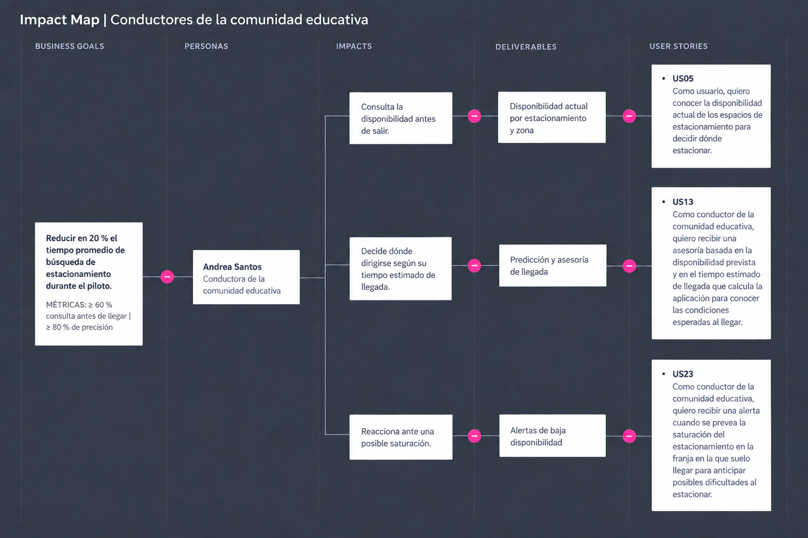

### Administradores de estacionamientos universitarios

Este mapa integra los Business Outcomes relacionados con la implementación de un piloto durante el primer año, la disponibilidad de datos superior al 95 % y el uso del dashboard en cada turno. Los impactos muestran cómo Carlos Mendoza contribuye a la adopción, la configuración del estacionamiento, la supervisión operativa y el análisis de la demanda.

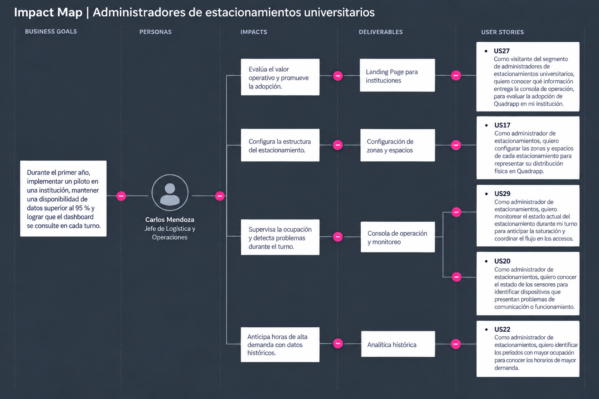

## 3.4. Product Backlog

El Product Backlog reúne las User Stories y las Technical Stories de Quadrapp en una sola lista ordenada según su aporte al valor del negocio. Las primeras posiciones corresponden a la presentación de la propuesta de valor y a las capacidades principales del producto, como la consulta de disponibilidad y la predicción con asesoría de llegada.

Las Technical Stories representan el trabajo necesario para implementar y sostener las funcionalidades. Algunas apoyan una capacidad específica y otras son transversales porque respaldan varias épicas o aplicaciones. Todas se incluyen en el mismo backlog y se ordenan según el valor que permiten entregar. Como el orden responde al valor y no a la secuencia técnica, las dependencias entre elementos, por ejemplo que la consulta de disponibilidad requiere un layout publicado y la autenticación, se resuelven en cada Sprint Planning incorporando primero los elementos habilitantes.

La estimación utiliza la escala de Fibonacci de 1, 2, 3, 5 y 8 Story Points. El backlog suma **227 Story Points** distribuidos en **53 elementos**.

| # Orden | Story Id | Título | Descripción | Story Points |
| --- | --- | --- | --- | --- |
| 1 | US25 | Conocer la propuesta de valor en la Landing Page | Como visitante, quiero conocer qué resuelve Quadrapp desde su sitio web, para evaluar si la solución responde a la necesidad de mi institución o la mía. | 3 |
| 2 | US26 | Acceder a la aplicación como visitante del segmento conductores | Como visitante del segmento de conductores de la comunidad educativa, quiero entender cómo la aplicación me ayuda a saber si encontraré espacio, para decidir si la instalo en mi dispositivo. | 2 |
| 3 | US27 | Conocer la propuesta institucional como visitante del segmento administradores | Como visitante del segmento de administradores de estacionamientos universitarios, quiero conocer qué información entrega la consola de operación, para evaluar la adopción de Quadrapp en mi institución. | 2 |
| 4 | US28 | Consultar los términos y la política de privacidad | Como visitante, quiero consultar los términos y condiciones y la política de privacidad desde la Landing Page, para conocer qué datos personales trata Quadrapp antes de registrarme. | 2 |
| 5 | US04 | Consultar estacionamientos universitarios | Como conductor de la comunidad educativa, quiero visualizar los estacionamientos disponibles dentro de mi universidad para identificar las áreas donde puedo estacionar. | 2 |
| 6 | US05 | Consultar disponibilidad actual | Como conductor de la comunidad educativa, quiero conocer la disponibilidad actual de los espacios de estacionamiento para decidir dónde estacionar. | 5 |
| 7 | US06 | Consultar disponibilidad por zona | Como conductor de la comunidad educativa, quiero visualizar la disponibilidad agrupada por zonas para identificar rápidamente dónde existe mayor disponibilidad. | 3 |
| 8 | US07 | Actualizar disponibilidad | Como conductor de la comunidad educativa, quiero recibir actualizaciones de la ocupación de los estacionamientos para consultar información cercana al estado real. | 3 |
| 9 | US08 | Gestionar estado desconocido | Como conductor de la comunidad educativa, quiero identificar cuándo un espacio no tiene información confiable para evitar interpretar un dato desactualizado como disponibilidad real. | 3 |
| 10 | TS05 | Configuración de comunicación MQTT para eventos IoT | Como Developer, quiero configurar MQTT para la comunicación entre el gateway y los servicios de Quadrapp, para transmitir eventos IoT de manera confiable y desacoplada. | 5 |
| 11 | TS04 | Consumo y validación de los eventos publicados por el gateway | Como Developer, quiero consumir y validar los mensajes que el gateway publica en el broker, para traducir las lecturas de los dispositivos físicos al lenguaje del dominio sin exponer los sensores a Internet. | 8 |
| 12 | TS06 | Implementación del procesamiento e idempotencia de las lecturas de sensores | Como Developer, quiero implementar el procesamiento controlado de eventos de sensores, para evitar duplicidades, inconsistencias y cambios incorrectos en el estado de los espacios de estacionamiento. | 8 |
| 13 | TS09 | Configuración de actualización en tiempo casi real de disponibilidad | Como Developer, quiero implementar mecanismos de actualización periódica y comunicación en tiempo casi real, para que la aplicación pueda mostrar información reciente sobre la ocupación de los estacionamientos. | 5 |
| 14 | US09 | Consultar predicción de disponibilidad | Como conductor de la comunidad educativa, quiero consultar la disponibilidad futura de los estacionamientos para anticipar si encontraré un espacio al llegar al campus. | 5 |
| 15 | US10 | Consultar diferentes horizontes de predicción | Como conductor de la comunidad educativa, quiero consultar predicciones a 15, 30, 45 y 60 minutos para conocer cómo podría variar la disponibilidad antes de mi llegada. | 3 |
| 16 | US11 | Visualizar la ocupación esperada | Como conductor de la comunidad educativa, quiero visualizar la ocupación esperada del estacionamiento en el horizonte consultado para comprender cómo evolucionará su disponibilidad. | 3 |
| 17 | US12 | Identificar predicciones con confianza baja | Como conductor de la comunidad educativa, quiero distinguir cuándo una predicción se basa en información limitada para decidir cuánto peso darle al resultado. | 3 |
| 18 | US13 | Obtener asesoría de llegada | Como conductor de la comunidad educativa, quiero recibir una asesoría basada en la disponibilidad prevista y en el tiempo estimado de llegada que calcula la aplicación para conocer las condiciones esperadas al llegar. | 8 |
| 19 | US14 | Actualizar asesoría según ETA | Como conductor de la comunidad educativa, quiero que la asesoría se actualice cuando cambie mi tiempo estimado de llegada para consultar información acorde a mi llegada prevista. | 5 |
| 20 | US15 | Mostrar categoría de disponibilidad esperada | Como conductor de la comunidad educativa, quiero visualizar una categoría simple de disponibilidad esperada para interpretar rápidamente las condiciones del estacionamiento al momento de mi llegada. | 2 |
| 21 | US36 | Estimar el tiempo hasta la próxima disponibilidad | Como conductor de la comunidad educativa, quiero conocer en cuánto tiempo se espera que se libere un espacio cuando es poco probable encontrarlo a mi llegada, para decidir si espero o busco otra alternativa. | 5 |
| 22 | TS07 | Implementación del modelo de predicción de ocupación | Como Developer, quiero implementar el componente de predicción de disponibilidad utilizando el histórico de ocupación, la velocidad de flujo, el calendario académico y los eventos del campus, para generar pronósticos de disponibilidad futura de los estacionamientos. | 8 |
| 23 | TS08 | Implementación del servicio de asesoría de llegada | Como Developer, quiero implementar un servicio que combine la predicción de ocupación con el tiempo estimado de llegada del usuario, para generar una categoría de disponibilidad esperada al momento de llegada. | 5 |
| 24 | US16 | Registrar estacionamiento universitario | Como administrador de estacionamientos, quiero registrar los estacionamientos de la universidad para que puedan ser utilizados por Quadrapp. | 3 |
| 25 | US17 | Configurar zonas y espacios | Como administrador de estacionamientos, quiero configurar las zonas y espacios de cada estacionamiento para representar su distribución física en Quadrapp. | 5 |
| 26 | US18 | Asociar sensor a espacio | Como administrador de estacionamientos, quiero asociar cada sensor físico con su espacio correspondiente para identificar correctamente la ocupación. | 3 |
| 27 | US19 | Configurar accesos vehiculares | Como administrador de estacionamientos, quiero configurar los accesos de entrada y salida para registrar los movimientos de vehículos dentro del estacionamiento. | 3 |
| 28 | US32 | Registrar y dar de baja dispositivos | Como administrador de estacionamientos, quiero registrar, reemplazar y dar de baja los sensores y gateways de mi institución para mantener actualizado el inventario que alimenta la ocupación. | 3 |
| 29 | US20 | Monitorear salud de sensores | Como administrador de estacionamientos, quiero conocer el estado de los sensores para identificar dispositivos que presentan problemas de comunicación o funcionamiento. | 3 |
| 30 | TS10 | Implementación del monitoreo de salud de dispositivos IoT | Como Developer, quiero implementar el registro y monitoreo del estado de salud de los sensores y gateways, para detectar dispositivos con problemas de conectividad, batería o comunicación. | 5 |
| 31 | TS14 | Reconciliación del conteo de accesos con la detección por espacio | Como Developer, quiero reconciliar periódicamente el conteo de entradas y salidas con los estados reportados por los sensores de espacio, para mantener coherente la ocupación del estacionamiento y la velocidad de flujo. | 5 |
| 32 | US35 | Registrar el calendario académico y los eventos del campus | Como administrador de estacionamientos, quiero registrar el calendario académico y los eventos del campus para que las predicciones consideren los días de mayor demanda. | 3 |
| 33 | US29 | Monitorear la operación del estacionamiento desde la consola | Como operador del estacionamiento, quiero monitorear el estado actual del estacionamiento durante mi turno para anticipar la saturación y coordinar el flujo en los accesos. | 5 |
| 34 | TS17 | Composición de la consola de operación | Como Developer, quiero exponer un endpoint de composición para la consola de operación, para entregar en una sola respuesta la información que el personal del estacionamiento necesita durante su turno. | 5 |
| 35 | US01 | Iniciar sesión con un correo autorizado | Como usuario autorizado por una institución, quiero iniciar sesión con mi correo verificado y un código de un solo uso para acceder a Quadrapp según el rol que me corresponde. | 5 |
| 36 | US02 | Cerrar sesión | Como usuario autenticado, quiero cerrar mi sesión para evitar que otra persona pueda acceder a mi cuenta desde el dispositivo. | 1 |
| 37 | US03 | Gestionar sesión expirada | Como usuario autenticado, quiero que el sistema controle la expiración de mi sesión para mantener protegido mi acceso a Quadrapp. | 2 |
| 38 | TS01 | Configuración de autenticación y gestión de sesiones | Como Developer, quiero configurar el mecanismo de autenticación y gestión de sesiones de Quadrapp, para garantizar que los usuarios puedan acceder al sistema de forma segura y que las sesiones puedan validarse y finalizarse correctamente. | 5 |
| 39 | TS02 | Composición de la vista principal de la aplicación móvil | Como Developer, quiero exponer un endpoint de composición para la aplicación móvil, para entregar en una sola carga la información que proviene de distintos módulos de Quadrapp. | 8 |
| 40 | TS03 | Configuración de persistencia y aislamiento de datos por contexto | Como Developer, quiero configurar la persistencia de datos de cada bounded context de Quadrapp, para mantener separados los datos de cada contexto según sus responsabilidades. | 8 |
| 41 | US30 | Gestionar los dominios de correo habilitados | Como administrador de estacionamientos, quiero gestionar los dominios de correo institucional habilitados para mi universidad para controlar quién puede registrarse en Quadrapp. | 3 |
| 42 | US31 | Invitar administradores y operadores | Como administrador de estacionamientos, quiero invitar a otros administradores y a los operadores de mi institución para que accedan a la consola con el rol que les corresponde. | 3 |
| 43 | TS15 | Aprovisionamiento de una institución | Como Developer, quiero disponer de un proceso de aprovisionamiento restringido para dar de alta una institución con sus dominios de correo y su primer administrador, para habilitar el servicio durante el onboarding sin exponer un registro público. | 5 |
| 44 | US21 | Consultar historial de ocupación | Como administrador de estacionamientos, quiero consultar el historial de ocupación para analizar el comportamiento de los estacionamientos universitarios. | 5 |
| 45 | US22 | Identificar horas de mayor ocupación | Como administrador de estacionamientos, quiero identificar los periodos con mayor ocupación para conocer los horarios de mayor demanda. | 3 |
| 46 | US34 | Consultar la precisión de las predicciones | Como administrador de estacionamientos, quiero consultar el error absoluto medio de las predicciones de mi institución y el porcentaje de acierto dentro del margen configurado, para evaluar cuánta confianza depositar en ellas al planificar la operación. | 5 |
| 47 | TS11 | Implementación de procesamiento histórico para analítica de ocupación | Como Developer, quiero implementar un modelo de consulta histórica de ocupación y flujo vehicular, para proporcionar información agregada que permita analizar el comportamiento de los estacionamientos. | 8 |
| 48 | US33 | Suscribirse a alertas por franja horaria | Como conductor de la comunidad educativa, quiero suscribirme a las alertas de un estacionamiento en las franjas horarias en las que suelo llegar para enterarme con anticipación cuando la disponibilidad prevista sea baja. | 3 |
| 49 | US23 | Recibir alertas de baja disponibilidad | Como conductor de la comunidad educativa, quiero recibir una alerta cuando se prevea la saturación del estacionamiento en la franja en la que suelo llegar para anticipar posibles dificultades al estacionar. | 5 |
| 50 | US24 | Gestionar preferencias de notificaciones | Como conductor de la comunidad educativa, quiero configurar mis preferencias de notificaciones para decidir qué alertas deseo recibir. | 2 |
| 51 | TS12 | Implementación del sistema de notificaciones y preferencias | Como Developer, quiero implementar el envío de notificaciones y la gestión de preferencias de notificación de Quadrapp, para comunicar a los usuarios eventos relevantes relacionados con la disponibilidad de los estacionamientos. | 5 |
| 52 | TS13 | Implementación de caché y funcionamiento parcial sin conexión | Como Developer, quiero implementar almacenamiento local de información relevante de la aplicación móvil, para que el usuario pueda consultar datos previamente obtenidos cuando exista una interrupción temporal de conectividad. | 5 |
| 53 | TS16 | Accesibilidad e internacionalización de las aplicaciones | Como Developer, quiero que las aplicaciones cumplan los criterios de accesibilidad y entreguen sus textos en español e inglés, para que cualquier integrante de la comunidad universitaria pueda utilizarlas. | 5 |

El backlog también se encuentra en un tablero público de Trello, disponible en [https://trello.com/b/kbBjDp7T](https://trello.com/b/kbBjDp7T). En esta etapa, el tablero documenta los 53 elementos del Product Backlog ordenados por valor de negocio. Cada tarjeta incluye el identificador de la historia y su estimación en Story Points.

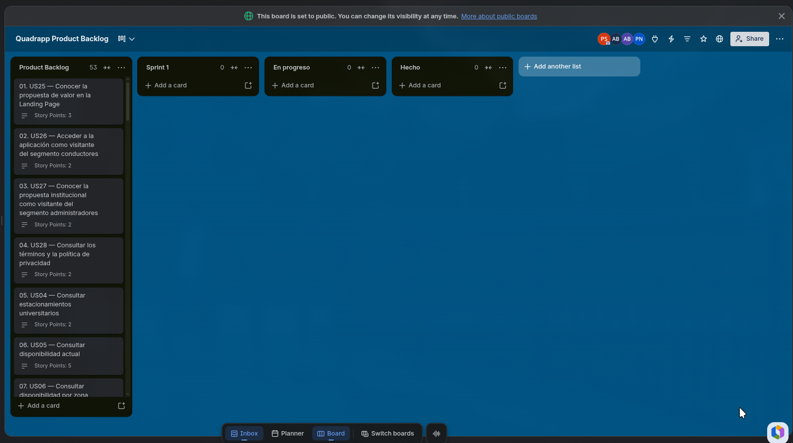

---

# Capítulo IV: Strategic-Level Software Design

## 4.1. Strategic-Level Attribute-Driven Design

En esta sección se presenta el proceso de Attribute-Driven Design (ADD) aplicado a Quadrapp. Se define el propósito del diseño, los inputs del proceso, el backlog de Architectural Drivers, las decisiones de diseño con su evaluación de patrones y los escenarios de atributos de calidad refinados. Este enfoque permite relacionar las decisiones arquitectónicas con los atributos de calidad y las restricciones que condicionan la solución (Bass et al., 2021).


### 4.1.1. Design Purpose

El propósito del diseño es definir la arquitectura de alto nivel de Quadrapp, una solución que permite a los conductores de la comunidad educativa conocer no solo la disponibilidad actual de un estacionamiento universitario, sino también la probabilidad de encontrar un espacio libre al momento de su llegada. Con esto se busca reducir la incertidumbre, el tiempo de búsqueda y la congestión dentro y alrededor del campus, que son los problemas identificados en el Capítulo I.

Para lograrlo, la arquitectura debe combinar la ocupación en tiempo casi real, captada por sensores IoT y un gateway instalado en el campus, con datos históricos, la velocidad de flujo de entradas y salidas, el calendario académico y los eventos del campus. Con esta información se generan pronósticos de disponibilidad a 15, 30, 45 y 60 minutos. La aplicación móvil del conductor calcula en el dispositivo su tiempo estimado de llegada y envía únicamente los minutos, de modo que la asesoría de llegada se obtiene sin transmitir su ubicación. Al mismo tiempo, la consola web de operación debe ofrecer a los administradores el estado actual del estacionamiento, la saturación prevista, el historial de ocupación y la precisión de las predicciones, para que pasen de una gestión reactiva a una preventiva.

El diseño también debe respetar el contexto del negocio. El estacionamiento es gratuito para la comunidad educativa y el ingreso exige la credencial institucional, que verifica el personal de vigilancia. Por eso Quadrapp no gestiona reservas, cobros ni reconocimiento de placas, y no reemplaza el control de acceso. Su aporte está en la información, la predicción y la gestión. Además, la solución debe atender a varias instituciones, con los datos de cada una aislados de las demás.

Las decisiones de esta sección orientan el diseño estratégico con Domain-Driven Design (4.2) y las vistas de arquitectura (4.3). Se priorizan los atributos de calidad que más afectan la confianza del conductor en la información: precisión de la asesoría, frescura de los datos de ocupación, tolerancia a fallas de conectividad, desempeño en horas pico y confiabilidad de los datos de los sensores.


### 4.1.2. Attribute-Driven Design Inputs

Los inputs del proceso ADD son la funcionalidad primaria con impacto en la arquitectura, los escenarios de atributos de calidad y las restricciones no negociables impuestas por el negocio y por el curso. A continuación se detalla cada uno.


#### 4.1.2.1. Primary Functionality (Primary User Stories)

De las siete épicas y las treinta y seis User Stories del Capítulo III, se seleccionaron las que condicionan decisiones de arquitectura: la autenticación multi-institución (US01), la ocupación en tiempo casi real y su confiabilidad (US05, US07, US08), la predicción y la asesoría de llegada (US09, US13, US36), las alertas (US23), la consola de operación (US29), la precisión de las predicciones (US34) y el calendario académico como insumo del modelo (US35). Se incluyen las épicas EP01 a EP05 y EP07 que las agrupan. La épica EP06 (Landing Page) y las historias de configuración, consulta histórica y suscripción no se repiten aquí porque no introducen decisiones arquitectónicas adicionales a las ya cubiertas.

| Epic / User Story ID | Título | Descripción | Criterios de Aceptación | Relacionado con (Epic ID) |
| --- | --- | --- | --- | --- |
| **EP01** | Acceso e identidad | Permitir que Integra Labs incorpore una institución y que conductores, administradores y operadores accedan con un código de un solo uso enviado a su correo habilitado o invitado, según su rol, y gestionen su sesión de forma segura. | No aplica | No aplica |
| **EP02** | Disponibilidad de estacionamientos | Permitir consultar el estado actual de los estacionamientos universitarios, incluyendo espacios disponibles, ocupados y estados desconocidos por zona. | No aplica | No aplica |
| **EP03** | Predicción y asesoría de llegada | Proporcionar predicciones de disponibilidad futura y asesoría de llegada considerando el tiempo estimado de llegada del usuario al estacionamiento. | No aplica | No aplica |
| **EP04** | Gestión e infraestructura de estacionamientos | Gestionar la configuración de estacionamientos, zonas, espacios y accesos vehiculares, además de la integración y monitoreo de los sensores utilizados para detectar la ocupación. | No aplica | No aplica |
| **EP05** | Analítica histórica | Permitir que la institución consulte la información histórica de ocupación, los periodos de mayor demanda y la precisión de las predicciones. | No aplica | No aplica |
| **EP07** | Alertas y notificaciones | Permitir que el conductor se suscriba a las alertas de un estacionamiento y gestione las preferencias con las que desea recibirlas. | No aplica | No aplica |
| **US01** | Iniciar sesión con un correo autorizado | Como usuario autorizado por una institución, quiero iniciar sesión con mi correo verificado y un código de un solo uso para acceder a Quadrapp según el rol que me corresponde. | **Escenario 1: Solicitud del código de verificación.**<br>Dado que el usuario ingresa un correo cuyo dominio pertenece a una universidad registrada,<br>cuando solicita el acceso,<br>entonces el sistema envía un código de un solo uso a ese correo e informa su periodo de vigencia.<br><br>**Escenario 2: Código válido.**<br>Dado que el usuario recibió un código vigente,<br>cuando lo ingresa dentro de su periodo de vigencia,<br>entonces el sistema habilita su sesión con el rol y la universidad que le corresponden.<br><br>**Escenario 3: Código incorrecto o vencido.**<br>Dado que el código ingresado no coincide con el enviado o su vigencia terminó,<br>cuando el usuario intenta continuar,<br>entonces el sistema rechaza el acceso e informa que debe solicitar un nuevo código.<br><br>**Escenario 4: Correo invitado por una institución.**<br>Dado que el correo no pertenece a un dominio habilitado pero cuenta con una invitación vigente o con una cuenta creada previamente,<br>cuando el usuario solicita el acceso,<br>entonces el sistema envía el código y le otorga el rol registrado en su cuenta o invitación.<br><br>**Escenario 5: Correo sin vínculo institucional.**<br>Dado que el correo no pertenece a un dominio habilitado y tampoco tiene invitación ni cuenta previa,<br>cuando el usuario solicita el acceso,<br>entonces el sistema no envía ningún código e informa que el correo no corresponde a una institución habilitada.<br><br>**Escenario 6: Sesión vigente.**<br>Dado que el usuario mantiene una sesión válida,<br>cuando vuelve a utilizar la aplicación,<br>entonces el sistema conserva su acceso sin solicitar un nuevo código. | EP01 |
| **US05** | Consultar disponibilidad actual | Como conductor de la comunidad educativa, quiero conocer la disponibilidad actual de los espacios de estacionamiento para decidir dónde estacionar. | **Escenario 1: Espacios disponibles.**<br>Dado que existen datos actualizados de los sensores,<br>cuando el usuario consulta un estacionamiento,<br>entonces el sistema muestra los espacios libres y ocupados.<br><br>**Escenario 2: Espacio ocupado.**<br>Dado que Parking Sensing confirma la detección de un vehículo en el espacio tras el tiempo mínimo configurado,<br>cuando se actualiza la información de disponibilidad,<br>entonces el espacio se presenta como ocupado.<br><br>**Escenario 3: Espacio libre.**<br>Dado que Parking Sensing confirma que el espacio quedó libre tras el tiempo mínimo sin detección,<br>cuando se actualiza la información,<br>entonces el espacio se presenta como disponible.<br><br>**Escenario 4: Antigüedad del dato.**<br>Dado que cada consulta corresponde a un estado consolidado en un momento determinado,<br>cuando el usuario consulta la disponibilidad,<br>entonces el sistema informa la antigüedad de esa información. | EP02 |
| **US07** | Actualizar disponibilidad | Como conductor de la comunidad educativa, quiero recibir actualizaciones de la ocupación de los estacionamientos para consultar información cercana al estado real. | **Escenario 1: Cambio a ocupado.**<br>Dado que un sensor detecta que un espacio cambia de libre a ocupado,<br>cuando el evento es procesado,<br>entonces el sistema actualiza el estado del espacio.<br><br>**Escenario 2: Cambio a libre.**<br>Dado que un sensor detecta que un espacio cambia de ocupado a libre,<br>cuando el evento es procesado,<br>entonces el sistema refleja el nuevo estado.<br><br>**Escenario 3: Sin cambios de estado.**<br>Dado que los sensores continúan reportando su actividad pero ningún espacio cambia de estado,<br>cuando el usuario consulta la disponibilidad,<br>entonces el sistema conserva el último estado válido e informa la marca de tiempo a la que corresponde. | EP02 |
| **US08** | Gestionar estado desconocido | Como conductor de la comunidad educativa, quiero identificar cuándo un espacio no tiene información confiable para evitar interpretar un dato desactualizado como disponibilidad real. | **Escenario 1: Sensor sin reportar actividad.**<br>Dado que un sensor tiene configurado un intervalo esperado de comunicación,<br>cuando deja de reportar su actividad y se supera ese intervalo,<br>entonces el espacio pasa al estado **UNKNOWN** y no se contabiliza como disponible.<br><br>**Escenario 2: Sensor con batería crítica.**<br>Dado que un sensor informa periódicamente su nivel de batería,<br>cuando el nivel reportado se encuentra por debajo del umbral configurado,<br>entonces el espacio pasa al estado **UNKNOWN** y no se contabiliza como disponible.<br><br>**Escenario 3: Espacio desconocido.**<br>Dado que un espacio se encuentra en estado UNKNOWN,<br>cuando el usuario consulta la disponibilidad,<br>entonces el sistema lo presenta como desconocido y lo excluye del conteo de espacios disponibles.<br><br>**Escenario 4: Recuperación del sensor.**<br>Dado que un sensor reanuda el reporte de su actividad,<br>cuando informa una detección estable durante el tiempo mínimo configurado,<br>entonces el espacio abandona el estado UNKNOWN y toma el estado confirmado. | EP02 |
| **US09** | Consultar predicción de disponibilidad | Como conductor de la comunidad educativa, quiero consultar la disponibilidad futura de los estacionamientos para anticipar si encontraré un espacio al llegar al campus. | **Escenario 1: Predicción disponible.**<br>Dado que existen datos históricos suficientes,<br>cuando el usuario consulta una predicción,<br>entonces el sistema muestra la disponibilidad estimada.<br><br>**Escenario 2: Origen del pronóstico.**<br>Dado que cada pronóstico se genera con una versión de modelo y un nivel de confianza,<br>cuando el usuario consulta la disponibilidad estimada,<br>entonces el sistema informa el momento de su generación y su nivel de confianza.<br><br>**Escenario 3: Historial limitado.**<br>Dado que el estacionamiento no acumula historial suficiente,<br>cuando el usuario realiza la consulta,<br>entonces el sistema presenta la heurística de respaldo e informa que su nivel de confianza es bajo. | EP03 |
| **US13** | Obtener asesoría de llegada | Como conductor de la comunidad educativa, quiero recibir una asesoría basada en la disponibilidad prevista y en el tiempo estimado de llegada que calcula la aplicación para conocer las condiciones esperadas al llegar. | **Escenario 1: Asesoría para la hora de llegada.**<br>Dado que la aplicación calcula en el dispositivo el tiempo estimado de llegada y envía únicamente los minutos,<br>cuando el conductor solicita la asesoría,<br>entonces el sistema entrega la probabilidad de encontrar espacio a esa hora estimada.<br><br>**Escenario 2: Tiempo de llegada inválido.**<br>Dado que el tiempo estimado calculado es negativo o supera el máximo admitido,<br>cuando el conductor solicita la asesoría,<br>entonces el sistema no genera la asesoría e informa el motivo del rechazo.<br><br>**Escenario 3: Historial limitado.**<br>Dado que el pronóstico utilizado proviene de la heurística de respaldo,<br>cuando se genera la asesoría,<br>entonces el sistema la entrega e informa que su nivel de confianza es bajo. | EP03 |
| **US23** | Recibir alertas de baja disponibilidad | Como conductor de la comunidad educativa, quiero recibir una alerta cuando se prevea la saturación del estacionamiento en la franja en la que suelo llegar para anticipar posibles dificultades al estacionar. | **Escenario 1: Alerta programada por saturación prevista.**<br>Dado que el conductor mantiene una suscripción vigente para una franja horaria,<br>cuando se prevé la saturación del estacionamiento dentro de esa franja,<br>entonces el sistema le envía la alerta correspondiente.<br><br>**Escenario 2: Aviso inmediato al consultar la asesoría.**<br>Dado que el conductor tiene habilitadas sus notificaciones,<br>cuando la asesoría de llegada recién generada corresponde a la categoría LOW,<br>entonces el sistema le envía el aviso de baja probabilidad para su hora estimada de llegada.<br><br>**Escenario 3: Notificaciones deshabilitadas.**<br>Dado que el conductor deshabilitó las notificaciones,<br>cuando se prevé la saturación dentro de su franja suscrita,<br>entonces el sistema conserva la suscripción y omite el envío.<br><br>**Escenario 4: Evitar alertas repetitivas.**<br>Dado que ya se envió una alerta para una condición determinada,<br>cuando la misma condición continúa activa,<br>entonces el sistema evita generar alertas repetitivas innecesarias. | EP07 |
| **US29** | Monitorear la operación del estacionamiento desde la consola | Como operador del estacionamiento, quiero monitorear el estado actual del estacionamiento durante mi turno para anticipar la saturación y coordinar el flujo en los accesos. | **Escenario 1: Estado actual del estacionamiento.**<br>Dado que el operador cuenta con una sesión vigente en la consola de operación,<br>cuando consulta el estacionamiento a su cargo,<br>entonces el sistema presenta la capacidad total, los espacios libres, los ocupados, los desconocidos y el flujo de entradas y salidas del periodo.<br><br>**Escenario 2: Aviso de saturación prevista.**<br>Dado que el pronóstico indica que el estacionamiento alcanzará su saturación dentro del horizonte consultado,<br>cuando el operador consulta la consola,<br>entonces el sistema informa el momento previsto de saturación.<br><br>**Escenario 3: Información desactualizada.**<br>Dado que el estacionamiento no recibe eventos dentro del tiempo máximo de vigencia,<br>cuando el operador consulta el estado,<br>entonces el sistema informa la antigüedad del último dato consolidado. | EP02, EP03, EP04 |
| **US34** | Consultar la precisión de las predicciones | Como administrador de estacionamientos, quiero consultar el error absoluto medio de las predicciones de mi institución y el porcentaje de acierto dentro del margen configurado, para evaluar cuánta confianza depositar en ellas al planificar la operación. | **Escenario 1: Precisión del periodo.**<br>Dado que el sistema conserva los pronósticos generados y la ocupación observada,<br>cuando el administrador consulta un periodo,<br>entonces el sistema presenta, por estacionamiento y horizonte, el error absoluto medio expresado en puntos porcentuales y el porcentaje de pronósticos que quedaron dentro del margen configurado.<br><br>**Escenario 2: Evolución por versión del modelo.**<br>Dado que el modelo de predicción se actualiza periódicamente,<br>cuando el administrador compara los periodos disponibles,<br>entonces el sistema distingue los resultados obtenidos con cada versión del modelo.<br><br>**Escenario 3: Periodo sin comparación posible.**<br>Dado que un periodo no cuenta con pronósticos y ocupación observada suficientes,<br>cuando el administrador lo consulta,<br>entonces el sistema informa que ese periodo no permite calcular la precisión. | EP05 |
| **US35** | Registrar el calendario académico y los eventos del campus | Como administrador de estacionamientos, quiero registrar el calendario académico y los eventos del campus para que las predicciones consideren los días de mayor demanda. | **Escenario 1: Registro del calendario académico.**<br>Dado que el administrador dispone del calendario del ciclo,<br>cuando registra sus periodos de clases, exámenes y receso,<br>entonces el sistema los incorpora como insumo de las predicciones de su institución.<br><br>**Escenario 2: Registro de un evento especial.**<br>Dado que el campus realizará un evento de alta afluencia,<br>cuando el administrador lo registra con su fecha, su horario y el estacionamiento afectado,<br>entonces el sistema lo considera al generar los pronósticos de esas franjas.<br><br>**Escenario 3: Cancelación de un evento.**<br>Dado que un evento registrado se cancela,<br>cuando el administrador lo retira,<br>entonces el sistema deja de considerarlo y regenera los pronósticos de las franjas afectadas. | EP03, EP04 |
| **US36** | Estimar el tiempo hasta la próxima disponibilidad | Como conductor de la comunidad educativa, quiero conocer en cuánto tiempo se espera que se libere un espacio cuando es poco probable encontrarlo a mi llegada, para decidir si espero o busco otra alternativa. | **Escenario 1: Estacionamiento lleno con salidas registradas.**<br>Dado que el estacionamiento no presenta espacios libres y el contador de flujo registra salidas dentro de la ventana configurada,<br>cuando el conductor consulta su disponibilidad,<br>entonces el sistema informa el rango de tiempo estimado para la próxima liberación junto con su nivel de confianza.<br><br>**Escenario 2: Sin salidas registradas.**<br>Dado que el estacionamiento no presenta espacios libres y no se registran salidas dentro de la ventana configurada,<br>cuando el conductor consulta su disponibilidad,<br>entonces el sistema informa que no es posible estimar el tiempo de espera.<br><br>**Escenario 3: Estacionamiento con espacios libres.**<br>Dado que el estacionamiento presenta espacios libres,<br>cuando el conductor consulta su disponibilidad,<br>entonces el sistema no presenta la estimación de espera. | EP03 |


#### 4.1.2.2. Quality Attribute Scenarios

Se identificaron ocho escenarios de atributos de calidad en primera instancia, a partir de los Business Outcomes y los riesgos del Lean UX (sección 1.2.2) y de los criterios de aceptación de las historias primarias. Cubren la precisión de la asesoría de llegada, la frescura de la ocupación, la tolerancia a la pérdida de conectividad, el desempeño en horas pico, la confiabilidad de los datos de los sensores, la degradación controlada ante fallas de servicios, la seguridad y el aislamiento entre instituciones, y la capacidad de incorporar nuevas universidades.

| ID | Atributo | Fuente | Estímulo | Artefacto | Entorno | Respuesta | Medida |
| --- | --- | --- | --- | --- | --- | --- | --- |
| QAS-01 | Correctness (precisión de la asesoría) | Conductor de la comunidad educativa | Solicita la asesoría de llegada enviando su tiempo estimado de llegada en minutos | Servicio de asesoría de llegada y servicio de predicción | Operación normal, en horario académico, con historial suficiente | Selecciona el pronóstico del horizonte correspondiente al tiempo estimado, calcula la probabilidad de encontrar espacio y la categoría (HIGH, LIMITED o LOW) e informa el nivel de confianza. Si el historial es insuficiente, usa la heurística de respaldo e informa confianza baja | Al menos 80 % de aciertos en la categoría de disponibilidad frente a la ocupación observada a la hora de llegada, evaluado semanalmente. El error absoluto medio se reporta en puntos porcentuales |
| QAS-02 | Performance (frescura de la ocupación) | Sensor de un espacio | El espacio cambia de estado y el cambio se mantiene durante el tiempo mínimo configurado | Gateway del campus, broker MQTT, Parking Sensing y Occupancy | Operación normal, con conexión a la nube | El gateway publica la lectura en el broker. Parking Sensing la valida y confirma la detección; Occupancy actualiza el estado del espacio y lo propaga al read model y a los clientes suscritos | Cambio visible en la app y en la consola en 5 s o menos (percentil 95) desde la confirmación; publicación del gateway al broker en 1 s o menos |
| QAS-03 | Availability (tolerancia a pérdida de conectividad) | Red del campus o proveedor de conectividad | Se pierde la conexión entre el gateway y el broker | Gateway IoT | Horario académico, incluyendo hora pico | El gateway sigue recibiendo lecturas, las almacena en su búfer local y las reenvía al restablecerse la conexión. Parking Sensing descarta duplicados y eventos fuera de orden. Mientras dure la caída, los clientes muestran el último estado con su antigüedad | 0 % de eventos perdidos; reenvío completo en 5 min o menos tras la reconexión; 100 % de las consultas durante la caída informan la antigüedad del dato |
| QAS-04 | Performance y Scalability | Conductores de la comunidad educativa | Pico de consultas de disponibilidad y asesoría al inicio o término de clases | Endpoint de composición de la aplicación móvil y read model de ocupación | Hora pico | El endpoint de composición entrega en una sola respuesta el layout, la ocupación y la asesoría desde el read model en caché, y el backend escala horizontalmente con réplicas sin estado | Hasta 500 consultas concurrentes con tiempo de respuesta de 2 s o menos (percentil 95) y tasa de error menor a 1 % |
| QAS-05 | Reliability (calidad de los datos de sensores) | Sensor de un espacio | Deja de reportar dentro de su intervalo esperado o informa batería por debajo del umbral | Parking Sensing (salud de dispositivos) y Occupancy | Operación normal | El espacio pasa a UNKNOWN y se excluye del conteo de disponibles. Se registra la incidencia, el dispositivo queda marcado para mantenimiento y la confianza del pronóstico se reduce. El espacio se recupera tras una detección estable | Transición a UNKNOWN en 1 min o menos tras vencer el intervalo; 100 % de los espacios UNKNOWN excluidos del conteo; disponibilidad de datos de ocupación de 95 % o más |
| QAS-06 | Resilience (degradación controlada) | Modelo de predicción o proveedor externo (correo, mensajería push) | No responde dentro del tiempo límite | Endpoints de composición de la app y la consola, y módulo de notificaciones | Operación normal | Se abre el circuit breaker de la integración afectada. El endpoint de composición responde con los datos disponibles e indica qué información no pudo obtenerse. La falla del proveedor de notificaciones no bloquea la actualización de ocupación | 100 % de las solicitudes respondidas en 3 s o menos, sin error visible al usuario; 0 impacto en la frescura de QAS-02 |
| QAS-07 | Security | Usuario sin sesión, con rol insuficiente o de otra institución | Solicita un recurso protegido o excede las solicitudes de código de acceso | Capa de seguridad del backend (Spring Security) y módulo IAM | Operación normal | Rechaza la solicitud sin token (401), con rol o institución que no corresponde (403) o por exceso de solicitudes (429), y registra el intento en auditoría | 100 % de los accesos no autorizados rechazados; registro en 1 s o menos; 100 % de las comunicaciones cifradas con TLS |
| QAS-08 | Modifiability (multi-institución) | Equipo de Integra Labs | Da de alta una nueva universidad con sus dominios de correo y su primer administrador | Proceso de aprovisionamiento de instituciones | Operación normal con instituciones ya activas | Crea la institución, registra sus dominios y emite la invitación de su primer administrador. La institución configura sus estacionamientos, zonas y sensores sin afectar a las demás | Alta en 1 día hábil o menos, sin cambios de código ni interrupción del servicio; aislamiento de datos del 100 % |

#### 4.1.2.3. Constraints

Las restricciones provienen del enunciado del curso, del modelo de negocio, del marco legal y de las decisiones ya fijadas en el modelo de dominio y en las historias del Capítulo III. No son negociables y guían el diseño desde el inicio: a diferencia de los atributos de calidad, no admiten grados de cumplimiento. Se expresan como Technical Stories con sus criterios de aceptación, de modo que puedan verificarse durante la implementación.

Las cuatro primeras corresponden a la composición y el despliegue de la solución. Las siete siguientes fijan el sensado, la privacidad, la identidad, el alcance funcional y las condiciones de la experiencia de usuario. Las siete últimas detallan las tecnologías de cada producto y las reglas de acceso y transparencia que se desprenden de ellas.

| Technical Story ID | Título | Descripción | Criterios de Aceptación | Relacionado con (Epic ID) |
| --- | --- | --- | --- | --- |
| CON-01 | Solución multicomponente integrada | Como Developer, necesito que la solución esté compuesta por una API REST interna, una aplicación móvil para conductores, una consola web de operación para administradores y una Landing Page, integradas entre sí y con una experiencia de usuario consistente. | **Escenario 1: Redirección desde la Landing Page.**<br>Dado que los cuatro productos están desplegados,<br>cuando el visitante activa la llamada a la acción de su segmento,<br>entonces es dirigido al sitio de descarga de la aplicación móvil o al formulario de contacto institucional.<br><br>**Escenario 2: Consistencia entre productos.**<br>Dado que la aplicación móvil y la consola web consumen la misma API,<br>cuando ambas consultan el mismo estacionamiento,<br>entonces presentan la misma información de ocupación. | EP01, EP02, EP03, EP04, EP05, EP06, EP07 |
| CON-02 | Domain-Driven Design | Como Developer, necesito que el sistema se descomponga en Bounded Contexts, cada uno con su propio modelo y su propia persistencia. | **Escenario 1: Un módulo por contexto.**<br>Dado que el sistema se descompone en Bounded Contexts,<br>cuando se define un módulo del backend,<br>entonces pertenece a un solo contexto y es dueño de su modelo y de su esquema de base de datos.<br><br>**Escenario 2: Integración entre contextos.**<br>Dado que un contexto necesita información de otro,<br>cuando la solicita,<br>entonces la obtiene por la fachada del otro módulo o por eventos de dominio, sin consultar sus tablas ni su modelo de escritura. | EP02, EP03, EP04, EP05 |
| CON-03 | Tecnologías open-source | Como Developer, necesito utilizar tecnologías open-source en los distintos niveles de la solución. | **Escenario 1: Componentes de la solución.**<br>Dado que cada componente requiere una tecnología,<br>cuando el equipo la selecciona,<br>entonces cuenta con licencia open-source y queda documentada en el capítulo de implementación.<br><br>**Escenario 2: Servicios de terceros.**<br>Dado que el correo y la mensajería push se contratan como servicios gestionados,<br>cuando se integran,<br>entonces quedan aislados detrás de una capa de integración y pueden reemplazarse sin modificar el dominio. | EP01, EP02, EP03, EP04, EP05, EP06, EP07 |
| CON-04 | Despliegue en la nube | Como Developer, necesito desplegar los servicios de servidor en una plataforma cloud de forma reproducible. | **Escenario 1: Despliegue reproducible.**<br>Dado que los servicios se ejecutan en un proveedor cloud,<br>cuando se despliega una nueva versión,<br>entonces el despliegue se realiza desde la configuración versionada en el repositorio.<br><br>**Escenario 2: Continuidad del sensado.**<br>Dado que los nodos de sensado operan en la red del campus,<br>cuando se actualiza el backend en la nube,<br>entonces la ingesta continúa sin cambios de configuración en el campus. | EP02, EP04 |
| CON-05 | Ingesta IoT sin exponer los sensores a Internet | Como Developer, necesito que los dispositivos de sensado permanezcan en la red local del campus y que sus lecturas lleguen al backend únicamente a través del componente de ingesta, para reducir su superficie de exposición. | **Escenario 1: Acceso desde fuera de la red del campus.**<br>Dado que los sensores operan en la red local de la institución,<br>cuando se intenta alcanzarlos desde una red externa,<br>entonces no resultan accesibles y no aceptan ninguna instrucción.<br><br>**Escenario 2: Salida de los eventos hacia el backend.**<br>Dado que la comunicación con el backend se concentra en un único componente de la red de sensado,<br>cuando un sensor genera una lectura,<br>entonces alcanza el backend a través de ese componente y nunca mediante una conexión directa del sensor. | EP02, EP04 |
| CON-06 | Servicios externos de terceros | Como Developer, necesito integrar un servicio de correo para los códigos de acceso y un proveedor de mensajería push para las alertas, sin que su falla afecte el núcleo del producto. | **Escenario 1: Capa de integración.**<br>Dado que el sistema consume un proveedor externo,<br>cuando envía un correo o una notificación,<br>entonces lo hace a través de una capa de integración que aísla el modelo del proveedor del dominio.<br><br>**Escenario 2: Falla del proveedor.**<br>Dado que un proveedor externo no responde,<br>cuando el usuario consulta la disponibilidad o la predicción,<br>entonces esas funciones continúan operando sin degradación. | EP01, EP07 |
| CON-07 | Privacidad de la ubicación y protección de datos personales | Como Developer, necesito que el tiempo estimado de llegada se calcule en la aplicación y que al servidor solo viajen los minutos, para no tratar la ubicación del conductor en los servicios de Quadrapp. Como Developer, necesito tratar únicamente los datos personales necesarios para la finalidad declarada de cada funcionalidad, para cumplir la Ley N.º 29733 (Congreso de la República del Perú, 2011) y su Reglamento, aprobado por el Decreto Supremo N.º 016-2024-JUS (Ministerio de Justicia y Derechos Humanos, 2024) y vigente desde el 31 de marzo de 2025. | **Escenario 1: Solicitud válida.**<br>Dado que la aplicación calcula el tiempo estimado con el proveedor de mapas en el propio dispositivo,<br>cuando envía la solicitud de asesoría de llegada,<br>entonces el cuerpo incluye únicamente el tiempo expresado en minutos.<br><br>**Escenario 2: Solicitud con coordenadas.**<br>Dado que el servicio no admite datos de ubicación,<br>cuando una solicitud incluye coordenadas geográficas,<br>entonces la respuesta es 400 y la solicitud no se procesa.<br><br>**Escenario 1: Minimización en el alta de una cuenta.**<br>Dado que el registro persigue verificar la pertenencia institucional del usuario,<br>cuando se crea una cuenta,<br>entonces se tratan solo el correo institucional, el nombre visible, el rol y la institución, y no se almacenan documento de identidad, código de estudiante ni placa vehicular.<br><br>**Escenario 2: Datos asociados a otras finalidades.**<br>Dado que las notificaciones requieren un token de dispositivo y las preferencias del usuario,<br>cuando se registran esos datos,<br>entonces se conservan únicamente mientras la suscripción permanece activa y se eliminan al darse de baja.<br><br>**Escenario 3: Información y registro de la aceptación.**<br>Dado que los términos y condiciones y la política de privacidad describen las finalidades del tratamiento,<br>cuando el usuario completa su registro,<br>entonces el sistema le presenta ambos documentos y registra su aceptación junto con la fecha y la versión vigente. | EP01, EP03, EP07 |
| CON-08 | Aislamiento de datos entre instituciones | Como Developer, necesito que cada institución acceda únicamente a sus propios estacionamientos y usuarios, para sostener el modelo multi-institución sin mezclar información entre clientes. | **Escenario 1: Consulta dentro de la institución.**<br>Dado que el token de sesión identifica la institución del usuario,<br>cuando se consulta un recurso de esa institución,<br>entonces la respuesta incluye únicamente información que le pertenece.<br><br>**Escenario 2: Consulta fuera de la institución.**<br>Dado que el recurso solicitado pertenece a otra institución,<br>cuando se envía la solicitud,<br>entonces la respuesta es 403 y el intento queda registrado. | EP01, EP04 |
| CON-09 | Autenticación sin contraseña | Como Developer, necesito que el acceso se realice mediante un código de un solo uso enviado al correo institucional o invitado, con sesiones basadas en tokens. | **Escenario 1: Sesión con claims.**<br>Dado que el usuario tiene un correo habilitado o una invitación vigente,<br>cuando ingresa un código válido,<br>entonces recibe un token de sesión con sus claims de usuario, institución y rol.<br><br>**Escenario 2: Límite de solicitudes.**<br>Dado que el mismo correo superó las solicitudes permitidas en la ventana configurada,<br>cuando solicita un nuevo código,<br>entonces la respuesta es 429 y no se emite el código. | EP01 |
| CON-10 | Alcance sin reservas, cobros ni control de acceso | Como Developer, necesito que el alcance excluya las reservas, los cobros y el reconocimiento de placas, porque el estacionamiento es gratuito y el ingreso exige la credencial institucional que verifica el personal de la institución. | **Escenario 1: Operación de las barreras.**<br>Dado que la solución no gestiona el ingreso físico de los vehículos,<br>cuando un vehículo accede al estacionamiento,<br>entonces el control de la barrera y de la credencial permanece a cargo de la institución.<br><br>**Escenario 2: Ausencia de transacciones.**<br>Dado que el producto no administra pagos ni reservas de espacios,<br>cuando se consulta cualquiera de sus servicios,<br>entonces no se expone ninguna operación de cobro ni de reserva. | EP01, EP02, EP03, EP04, EP05, EP06, EP07 |
| CON-11 | Accesibilidad e internacionalización | Como Developer, necesito que los productos entreguen sus textos en inglés y en español latinoamericano, con el inglés como idioma por defecto. Como Developer, necesito incorporar atributos ARIA y cumplir el nivel AA de la WCAG 2.2 (World Wide Web Consortium, 2024) en la Landing Page y en la consola de operación, para que cualquier integrante de la comunidad universitaria pueda utilizarlas. | **Escenario 1: Idioma solicitado.**<br>Dado que los productos incorporan internacionalización bajo i18n con los idiomas en_US y es_419,<br>cuando la solicitud declara uno de esos idiomas,<br>entonces los textos y los formatos se entregan en el idioma solicitado.<br><br>**Escenario 2: Idioma por defecto.**<br>Dado que la solicitud no declara un idioma preferido,<br>cuando se genera la respuesta,<br>entonces los mensajes y la documentación se presentan en inglés.<br><br>**Escenario 1: Atributos de accesibilidad.**<br>Dado que las experiencias web incorporan accesibilidad bajo a11y,<br>cuando se publica una vista,<br>entonces sus elementos interactivos exponen los atributos ARIA correspondientes.<br><br>**Escenario 2: Validación del nivel de conformidad.**<br>Dado que el criterio de conformidad adoptado es WCAG 2.2 nivel AA,<br>cuando se evalúa una vista publicada mediante validación automatizada y revisión manual,<br>entonces no se reportan incumplimientos de ese nivel. | EP02, EP06 |
| CON-12 | Servicios web con el stack definido por el curso | Como Developer, necesito desarrollar los servicios web bajo el estilo RESTful con Spring Boot, ASP.NET Core o Nest y documentarlos con OpenAPI, para cumplir las tecnologías establecidas para el proyecto. OpenAPI proporciona una descripción independiente del lenguaje para las interfaces HTTP (OpenAPI Initiative, 2024). | **Escenario 1: Estilo de los servicios.**<br>Dado que los servicios se exponen bajo el estilo RESTful,<br>cuando se incorpora un nuevo recurso,<br>entonces se implementa en uno de los frameworks permitidos y con el lenguaje que le corresponde.<br><br>**Escenario 2: Documentación de los endpoints.**<br>Dado que la documentación se mantiene junto al código,<br>cuando se publica una versión del servicio,<br>entonces su especificación OpenAPI queda disponible y actualizada. | EP01, EP02, EP03, EP04, EP05, EP06, EP07 |
| CON-13 | Aplicaciones web y Landing Page con Material Design | Como Developer, necesito construir la Landing Page con HTML5, CSS3 y JavaScript, y la consola de operación con Vue y Vuetify, con un lenguaje de diseño basado en Material Design. | **Escenario 1: Tecnología de la Landing Page.**<br>Dado que la Landing Page es un sitio estático,<br>cuando se publica su contenido,<br>entonces se implementa con HTML5, CSS3 y JavaScript.<br><br>**Escenario 2: Biblioteca de componentes.**<br>Dado que la consola de operación utiliza Vue,<br>cuando se incorpora un componente de interfaz,<br>entonces proviene de Vuetify, la biblioteca de componentes de Material Design para Vue. | EP02, EP06 |
| CON-14 | Aplicación móvil multiplataforma con Flutter | Como Developer, necesito desarrollar una única aplicación móvil multiplataforma con Dart y Flutter, para ofrecer la aplicación en Android e iOS desde una sola base de código (Flutter, s. f.). | **Escenario 1: Tecnología de la aplicación.**<br>Dado que el equipo adoptó una estrategia multiplataforma,<br>cuando se desarrolla la aplicación móvil,<br>entonces se utiliza Dart con Flutter y se generan aplicaciones compatibles con Android e iOS, sin recurrir a tecnologías híbridas. | EP01, EP02, EP03, EP04, EP05, EP06, EP07 |
| CON-15 | Software del nodo de sensado | Como Developer, necesito desarrollar el software de los nodos de sensado en C++ sobre microcontroladores ESP32, para publicar las lecturas hacia el gateway del campus. | **Escenario 1: Tecnología del nodo.**<br>Dado que los nodos se construyen sobre microcontroladores ESP32,<br>cuando se implementa su software,<br>entonces se emplea C++ con las herramientas del ecosistema del fabricante.<br><br>**Escenario 2: Alcance del software embebido.**<br>Dado que las reglas de ocupación pertenecen al dominio y no al dispositivo,<br>cuando el nodo detecta un cambio en su sensor,<br>entonces publica la lectura con su identificador y marca de tiempo, sin determinar el estado del espacio ni aplicar reglas de estabilidad.<br><br>**Escenario 3: Conservación ante desconexión.**<br>Dado que la red local puede presentar interrupciones,<br>cuando el nodo no logra publicar una lectura,<br>entonces la conserva y la reenvía al restablecerse la conexión. | EP02, EP04 |
| CON-16 | Detección por sensores sin identificación del vehículo | Como Developer, necesito que la detección de ocupación se realice con sensores de cochera y de paso, sin videovigilancia ni identificación de vehículos, manteniendo el contexto de sensado independiente de la tecnología empleada. | **Escenario 1: Fuentes de detección admitidas.**<br>Dado que el alcance actual contempla sensores registrados en el inventario de dispositivos,<br>cuando se procesa un evento de detección,<br>entonces proviene de un dispositivo registrado y su traducción al lenguaje del dominio ocurre en la capa anticorrupción, de modo que otra tecnología pueda incorporarse sin alterar el modelo de ocupación.<br><br>**Escenario 2: Ausencia de identificación del vehículo.**<br>Dado que los eventos informan presencia y dirección, no identidad,<br>cuando se procesa un evento de ocupación,<br>entonces no se almacena ningún dato que permita identificar al vehículo ni a su conductor. | EP02, EP04 |
| CON-17 | Acceso restringido a la comunidad de cada institución | Como Developer, necesito restringir el registro a los dominios de correo habilitados por cada institución y reservar la creación de administradores a la invitación, para sostener el modelo B2B y la pertenencia institucional. | **Escenario 1: Dominio no habilitado.**<br>Dado que el dominio del correo no pertenece a ninguna institución registrada y no existe una invitación vigente ni una cuenta autorizada previamente,<br>cuando se solicita el acceso,<br>entonces el sistema no emite ningún código de verificación.<br><br>**Escenario 2: Creación de administradores.**<br>Dado que el rol de administrador no admite autorregistro,<br>cuando se intenta crear una cuenta con ese rol fuera del flujo de invitación o del alta inicial de la institución,<br>entonces la solicitud es rechazada.<br><br>**Escenario 3: Alta de instituciones.**<br>Dado que el alta de una institución no se expone públicamente,<br>cuando se envía la solicitud sin credenciales de plataforma,<br>entonces la respuesta es 403. | EP01, EP04 |
| CON-18 | Términos y condiciones accesibles desde el pie de página | Como Developer, necesito enlazar los términos y condiciones del servicio desde el pie de página de la Landing Page y de las aplicaciones, para que el usuario conozca las condiciones antes de registrarse. | **Escenario 1: Disponibilidad del documento.**<br>Dado que los términos y condiciones se encuentran publicados,<br>cuando el usuario consulta el pie de página de cualquiera de los productos,<br>entonces accede al documento vigente. | EP06 |

### 4.1.3. Architectural Drivers Backlog

El Architectural Drivers Backlog se construyó de forma iterativa a partir del Quality Attribute Workshop del equipo. Primero se revisaron las historias primarias (4.1.2.1) para extraer los Functional Drivers con mayor impacto en la arquitectura. Luego se incorporaron los escenarios de atributos de calidad (4.1.2.2) como Quality Attribute Drivers y las restricciones (4.1.2.3) como Constraint Drivers. Finalmente, cada driver se valoró según su importancia para los stakeholders y su impacto en la complejidad técnica de la arquitectura. Los drivers de alta importancia y alto impacto aparecen primero.

| Driver ID | Título de Driver | Descripción | Importancia para Stakeholders | Impacto en Architecture Technical Complexity |
| --- | --- | --- | --- | --- |
| FD-02 | Disponibilidad en tiempo casi real (US05, US07) | Consolidar los eventos de los sensores en el estado de cada espacio y distribuirlo a la app y a la consola con su marca de tiempo. | High | High |
| FD-04 | Predicción de disponibilidad (US09) | Generar pronósticos a 15, 30, 45 y 60 minutos con versión de modelo, nivel de confianza y heurística de respaldo. | High | High |
| FD-05 | Asesoría de llegada según el tiempo estimado (US13) | Combinar el pronóstico con el tiempo estimado de llegada, calculado en el dispositivo, para entregar probabilidad y categoría HIGH, LIMITED o LOW. | High | High |
| QAD-01 | Precisión de la asesoría (QAS-01) | Lograr al menos 80 % de aciertos en la categoría de disponibilidad. | High | High |
| QAD-02 | Frescura de la ocupación (QAS-02) | Reflejar los cambios confirmados en la app y la consola en 5 s o menos. | High | High |
| QAD-03 | Tolerancia a pérdida de conectividad (QAS-03) | Reenviar sin pérdida las lecturas acumuladas en el gateway al reconectarse. | High | High |
| CON-05 | Ingesta IoT mediante gateway y MQTT | Sensores no expuestos a Internet, publicación con QoS 1 y búfer local en el gateway. | High | High |
| CON-01 | Solución multicomponente integrada | API REST, app móvil en Flutter, consola web y Landing Page integradas. | High | High |
| QAD-04 | Desempeño y escalabilidad en hora pico (QAS-04) | Atender hasta 500 consultas concurrentes en 2 s o menos. | High | Medium |
| QAD-05 | Confiabilidad de los datos de sensores (QAS-05) | Detectar sensores sin señal o con batería crítica y mantener 95 % o más de disponibilidad de datos. | High | Medium |
| QAD-06 | Degradación controlada ante fallas (QAS-06) | Responder con los datos disponibles cuando un servicio no responde. | High | Medium |
| QAD-07 | Seguridad (QAS-07) | Rechazar el 100 % de los accesos no autorizados y registrarlos en auditoría. | High | Medium |
| FD-01 | Autenticación por código de un solo uso y roles (US01) | Acceso con correo institucional o invitado, con rol e institución en la sesión. | High | Medium |
| FD-03 | Gestión del estado desconocido (US08) | Marcar como UNKNOWN los espacios sin información confiable y excluirlos del conteo de disponibles. | High | Medium |
| FD-06 | Consola de operación (US29) | Componer capacidad, ocupación, flujo y saturación prevista en una sola respuesta para el operador. | High | Medium |
| CON-07 | Privacidad de la ubicación y protección de datos | La ubicación no sale del dispositivo; cumplimiento de la Ley N.° 29733. | High | Medium |
| CON-08 | Aislamiento de datos por institución | Acceso restringido por institución y alta de instituciones no pública. | High | Medium |
| CON-09 | Autenticación sin contraseña | Código de un solo uso, tokens de sesión y límite de solicitudes. | High | Medium |
| CON-12 | Servicios web con el stack definido por el curso | Servicios RESTful sobre Spring Boot, ASP.NET Core o Nest, documentados con OpenAPI. | High | Medium |
| CON-16 | Detección por sensores sin identificación del vehículo | Sensores de cochera y de paso, sin videovigilancia ni identificación; la traducción ocurre en la capa anticorrupción. | High | Medium |
| CON-17 | Acceso restringido a la comunidad de cada institución | Registro limitado a dominios habilitados o invitación; los administradores no se autorregistran. | High | Medium |
| CON-10 | Sin reservas, cobros ni control de acceso | Alcance acotado a información, predicción y gestión; el flujo se cuenta sin identificar vehículos. | High | Low |
| CON-14 | Aplicación móvil multiplataforma con Flutter | Una sola base de código en Dart y Flutter para Android e iOS, sin tecnologías híbridas. | High | Low |
| CON-13 | Aplicaciones web y Landing Page con Material Design | Landing Page en HTML5, CSS3 y JavaScript; consola en Vue con Vuetify (Material Design). | High | Low |
| CON-02 | Domain-Driven Design | Descomposición en Bounded Contexts con persistencia propia. | Medium | High |
| QAD-08 | Soporte multi-institución (QAS-08) | Incorporar universidades por configuración, con datos aislados. | Medium | High |
| FD-07 | Tiempo hasta la próxima disponibilidad (US36) | Estimar el rango de liberación de un espacio con el flujo de salidas y el pronóstico vigente. | Medium | High |
| CON-15 | Software del nodo de sensado | Firmware en C++ sobre ESP32 que publica lecturas sin decidir el estado del espacio. | Medium | High |
| FD-08 | Alertas por saturación prevista (US23) | Enviar alertas por franja horaria evitando repeticiones. | Medium | Medium |
| FD-09 | Precisión de las predicciones (US34) | Comparar pronósticos y ocupación observada por versión de modelo. | Medium | Medium |
| FD-10 | Calendario académico y eventos (US35) | Incorporar calendario y eventos como insumo del pronóstico. | Medium | Medium |
| CON-04 | Despliegue en la nube | Servicios de servidor desplegados de forma reproducible en un proveedor cloud. | Medium | Medium |
| CON-06 | Servicios externos de terceros | Correo y mensajería push aislados tras una capa de integración. | Medium | Medium |
| CON-03 | Tecnologías open-source | Uso de tecnologías open-source en los distintos niveles. | Medium | Low |
| CON-11 | Accesibilidad e internacionalización | Textos en es_419 y en_US y cumplimiento de nivel AA. | Medium | Low |
| CON-18 | Términos y condiciones accesibles desde el pie de página | Documento vigente enlazado desde la Landing Page y las aplicaciones. | Medium | Low |

### 4.1.4. Architectural Design Decisions

Las decisiones de diseño se tomaron en ocho iteraciones, siguiendo los stages del Quality Attribute Workshop. En cada iteración se seleccionaron los drivers de mayor prioridad, se identificaron patrones y tácticas candidatas, y se evaluaron sus ventajas y desventajas frente a los escenarios de calidad y las restricciones. Cuando hubo más de tres candidatos, se consideraron los tres más relevantes. Los criterios de decisión fueron el cumplimiento de las medidas de respuesta, la alineación con DDD, el uso de tecnologías open-source, la protección de los datos personales y la viabilidad de implementación por el equipo.

#### Candidate Pattern Evaluation Matrix

**Iteración 1: Estilo arquitectónico** (Drivers: CON-01, CON-02, QAD-04, QAD-08, FD-06)

| Pattern | Pro | Con |
| --- | --- | --- |
| **Monolito modular con un módulo por Bounded Context** | Un solo despliegue y un solo pipeline, adecuados para un equipo de cinco personas; transacciones locales y comunicación en proceso, sin latencia de red ni consistencia eventual entre contextos; los límites de cada módulo permiten extraerlo como servicio si más adelante lo requiere. | Todos los módulos escalan juntos; el aislamiento entre contextos depende de la disciplina del equipo (fachadas, eventos y un esquema por módulo, sin acceso a tablas ajenas). |
| Microservicios por Bounded Context con API Gateway y un BFF por cliente | Escala y despliega cada contexto de forma independiente. | Siete servicios, siete bases de datos, gateway, BFF y bus de mensajería que operar; consistencia eventual y observabilidad distribuida; costo de infraestructura que excede el alcance del proyecto. |
| Serverless (FaaS) | Escalado automático y pago por uso. | Los arranques en frío afectan la latencia; poco adecuado para consumidores de mensajería persistentes; dependencia del proveedor. |

**Decisión:** monolito modular en Spring Boot con un módulo por Bounded Context: IAM, Parking Configuration, Parking Sensing, Occupancy, Prediction & Advisory, Analytics y Notifications. Cada módulo expone una fachada (Open Host Service) para las consultas de otros módulos y publica sus eventos de dominio como eventos de aplicación de Spring, que los módulos interesados consumen en el mismo proceso. La persistencia es una base de datos PostgreSQL con un esquema por módulo y sin claves foráneas entre esquemas (CON-02). Un módulo de composición expone los endpoints que agregan información para la aplicación móvil y para la consola. La carga de QAS-04 se atiende con réplicas sin estado del backend y con el read model en caché (iteración 4), sin necesidad de escalar cada contexto por separado.

**Iteración 2: Ingesta IoT y resiliencia de conectividad** (Drivers: CON-05, FD-02, QAD-02, QAD-03)

| Pattern | Pro | Con |
| --- | --- | --- |
| **Gateway en el campus con MQTT (QoS 1), búfer local y sesión persistente (Store-and-Forward)** | Los sensores no se exponen a Internet; no se pierden lecturas ante caídas; desacopla productores y consumidores. | Hay que operar el gateway y el broker; los duplicados y el desorden exigen idempotencia en el consumidor. |
| Sensores publican por HTTPS directamente a la nube | Arquitectura más simple. | Expone los dispositivos; se pierden lecturas sin conexión; mayor consumo de batería por sensor. |
| Polling periódico desde la nube | Fácil de implementar. | Datos poco frescos; requiere acceso entrante a la red del campus; no cumple los 5 s. |

**Decisión:** gateway en el campus que publica, mediante una conexión saliente cifrada, en un broker MQTT en la nube con QoS 1, nivel que establece una entrega de al menos una vez (OASIS, 2019), con búfer local y reenvío al reconectar. El campus no expone puertos de entrada. El monitoreo del intervalo de reporte de cada sensor detecta las fallas.

**Iteración 3: Procesamiento de eventos de ocupación** (Drivers: FD-02, FD-03, FD-07, QAD-03, QAD-05)

| Pattern | Pro | Con |
| --- | --- | --- |
| **Consumidor idempotente con identificador de evento, marca de tiempo por espacio, tiempo mínimo de detección y reconciliación con el conteo de accesos** | Tolera duplicados y desorden; evita cambios de estado por lecturas espurias; representa explícitamente el estado UNKNOWN; mantiene coherente el flujo y la ocupación. | Requiere conservar los identificadores aplicados y calibrar los tiempos mínimos. |
| Aplicar cada mensaje tal como llega (último mensaje prevalece) | Muy simple. | Los duplicados y los mensajes fuera de orden corrompen el estado del espacio. |
| Entrega exactly-once con transacciones distribuidas | Consistencia fuerte. | Alto costo y complejidad; mayor latencia; innecesario para este dominio. |

**Decisión:** procesamiento idempotente con tiempo mínimo de detección, estado UNKNOWN por silencio del sensor o batería crítica, y reconciliación periódica en la que la detección por espacio prevalece sobre el conteo de accesos. Parking Sensing descarta duplicados y lecturas fuera de orden, aplica el tiempo mínimo y detecta las fallas; Occupancy, detrás de su capa anticorrupción, mantiene el estado de cada espacio, el estado UNKNOWN y la reconciliación.

**Iteración 4: Consulta y distribución de la ocupación** (Drivers: FD-02, QAD-02, QAD-04, QAD-03)

| Pattern | Pro | Con |
| --- | --- | --- |
| **CQRS con read model en caché alimentado por eventos, suscripción en tiempo real y caché local en la app (layout versionado)** | Lecturas rápidas y escalables; cambios distribuidos al ocurrir; la app muestra el último estado con su marca de tiempo si no hay conexión. | Consistencia eventual; más componentes que mantener. |
| Consulta directa a la base de datos transaccional | Simple; siempre consistente. | La carga de lectura en hora pico degrada el desempeño. |
| Materialización batch periódica | Bajo costo de cómputo. | Datos desactualizados; no cumple la frescura de QAS-02. |

**Decisión:** CQRS con read model en caché alimentado por eventos de dominio, suscripción autenticada mediante WebSocket a los cambios de cada estacionamiento y almacenamiento local en la app del layout con su versión.

**Iteración 5a: Predicción de disponibilidad** (Drivers: FD-04, FD-07, FD-09, FD-10, QAD-01)

| Pattern | Pro | Con |
| --- | --- | --- |
| **Servicio de predicción desacoplado con modelo de ML supervisado, horizontes de 15, 30, 45 y 60 minutos y heurística de respaldo** | Aprovecha historial, velocidad de flujo, calendario académico y eventos; se reentrena y se versiona; el respaldo cubre el arranque en frío. | Requiere historial suficiente; hay que registrar versión y confianza de cada pronóstico. |
| Heurística por promedios históricos por franja horaria | Simple y explicable; funciona con pocos datos. | Menos precisa ante eventos y cambios de demanda. |
| Series temporales clásicas | Buen ajuste a patrones estacionales. | Incorpora con dificultad variables externas como eventos y flujo. |

**Decisión:** servicio de predicción desacoplado con modelo de ML, con la heurística por promedios históricos como heurística de respaldo cuando el historial es insuficiente. Cada pronóstico registra su versión de modelo y nivel de confianza, lo que permite medir la precisión por versión.

**Iteración 5b: Cálculo del tiempo estimado de llegada** (Drivers: FD-05, CON-07, QAD-01)

| Pattern | Pro | Con |
| --- | --- | --- |
| **Cálculo en el dispositivo; el servidor recibe solo los minutos** | La ubicación no sale del dispositivo; el backend no depende de un servicio de mapas ni de su cuota. | La precisión depende del dispositivo; el servidor debe validar el rango recibido. |
| Cálculo en el servidor con coordenadas y un servicio de mapas externo | Control central del cálculo. | Transmite la ubicación personal (Ley N.° 29733); agrega costo y dependencia externa. |
| Sin tiempo estimado (el usuario elige un horizonte fijo) | Más simple. | Se pierde la probabilidad a la hora real de llegada, que es la propuesta de valor. |

**Decisión:** el tiempo estimado se calcula en el dispositivo y se envía solo en minutos. El servidor rechaza valores negativos, mayores al máximo admitido y solicitudes con coordenadas.

**Iteración 6: Resiliencia e integración con terceros** (Drivers: QAD-06, CON-06, FD-06, FD-08)

| Pattern | Pro | Con |
| --- | --- | --- |
| **Timeouts, Circuit Breaker y respuesta parcial en los endpoints de composición, más una capa anticorrupción hacia los proveedores externos** | Aísla la falla; el usuario recibe los datos disponibles; el dominio no depende del modelo del proveedor. | Requiere configurar umbrales y mostrar qué información no está disponible. |
| Reintentos con backoff | Fácil de implementar. | Aumenta la latencia durante la falla; no garantiza respuesta. |
| Llamadas síncronas sin protección | Menor esfuerzo inicial. | La falla de un servicio se propaga al usuario. |

**Decisión:** timeouts y circuit breaker en las integraciones con el modelo de predicción y con los proveedores externos, con respuesta parcial en los endpoints de composición que indica qué información no pudo obtenerse, y capa anticorrupción para el servicio de correo y el proveedor de mensajería push. Los tokens de dispositivo rechazados se marcan como inválidos y no se reintentan.

**Iteración 7: Identidad y seguridad** (Drivers: FD-01, QAD-07, CON-07, CON-08, CON-09)

| Pattern | Pro | Con |
| --- | --- | --- |
| **Código de un solo uso por correo, tokens JWT con claims de usuario, institución y rol, y RBAC con validación de institución en la capa de seguridad del backend** | Sin contraseñas que custodiar; sin estado; separa roles de conductor y operador; el claim de institución habilita el aislamiento. | Depende de la entrega del correo; requiere gestionar la renovación y la vigencia de los tokens. |
| Federación (OIDC o SAML) con el proveedor de identidad de cada universidad | Reutiliza las credenciales institucionales. | Requiere una integración por institución; no es compatible con un alta en 1 día hábil. |
| Usuario y contraseña propios con sesiones de servidor | Familiar para el usuario. | Obliga a custodiar contraseñas; menos adecuado para app móvil y escalado horizontal. |

**Decisión:** código de un solo uso enviado al correo institucional o invitado, tokens de acceso y de refresco, RBAC y validación de institución con Spring Security en el backend, límite de solicitudes de código y cifrado TLS en todas las comunicaciones.

**Iteración 8: Soporte multi-institución** (Drivers: QAD-08, CON-08)

| Pattern | Pro | Con |
| --- | --- | --- |
| **Multi-tenancy lógico con la institución como identificador en cada dato y en el token, con aprovisionamiento restringido a credenciales de plataforma** | Alta por configuración; menor costo de infraestructura. | Exige controles estrictos y pruebas de aislamiento. |
| Base de datos por institución | Buen aislamiento con infraestructura compartida. | Más complejidad de administración y migraciones. |
| Instancia dedicada por institución | Aislamiento fuerte. | Alto costo operativo; no cumple el alta en 1 día hábil. |

**Decisión:** multi-tenancy lógico con pruebas de aislamiento, y alta de instituciones mediante un proceso de aprovisionamiento restringido.

**Resumen de decisiones adoptadas**

| ID | Decisión | Drivers atendidos |
| --- | --- | --- |
| DD-01 | Monolito modular con un módulo y un esquema de datos por Bounded Context | CON-01, CON-02, QAD-04, FD-06 |
| DD-02 | Gateway en el campus con MQTT QoS 1 y Store-and-Forward | CON-05, FD-02, QAD-02, QAD-03 |
| DD-03 | Procesamiento idempotente con tiempo mínimo de detección, estado UNKNOWN y reconciliación | FD-02, FD-03, FD-07, QAD-03, QAD-05 |
| DD-04 | CQRS con read model en caché, suscripción en tiempo real y caché local en la app | FD-02, QAD-02, QAD-04 |
| DD-05 | Servicio de predicción con ML, horizontes de 15 a 60 minutos y heurística de respaldo | FD-04, FD-07, FD-09, FD-10, QAD-01 |
| DD-06 | Tiempo estimado de llegada calculado en el dispositivo y enviado en minutos | FD-05, CON-07, QAD-01 |
| DD-07 | Circuit Breaker, respuesta parcial y capa anticorrupción para proveedores externos | QAD-06, CON-06, FD-08 |
| DD-08 | Código de un solo uso, JWT, RBAC y validación de institución con Spring Security | FD-01, QAD-07, CON-08, CON-09 |
| DD-09 | Multi-tenancy lógico con aprovisionamiento restringido | QAD-08, CON-08 |


### 4.1.5. Quality Attribute Scenario Refinements

Al finalizar el Quality Attribute Workshop, las decisiones principales fueron: recibir la ocupación mediante un gateway con MQTT y búfer local (DD-02), procesar los eventos de forma idempotente y marcar como desconocidos los espacios sin información confiable (DD-03), separar la lectura de la escritura para sostener las horas pico (DD-04), calcular el tiempo de llegada en el dispositivo para proteger la ubicación del conductor (DD-06) y aislar las fallas con circuit breakers y respuestas parciales (DD-07). A continuación se presentan, en orden de prioridad, los ocho escenarios refinados.

**Scenario Refinement for Scenario 1**

| Campo | Detalle |
| --- | --- |
| Scenario(s) | QAS-01: Precisión de la asesoría de llegada |
| Business Goals | Alcanzar al menos 80 % de precisión en las estimaciones de disponibilidad futura y lograr que los conductores confíen en ellas para decidir hacia dónde dirigirse. |
| Relevant Quality Attributes | Correctness |
| Stimulus | Un conductor solicita la asesoría de llegada enviando su tiempo estimado en minutos. |
| Scenario Components: Stimulus Source | Conductor de la comunidad educativa (app móvil). |
| Scenario Components: Environment | Operación normal, en horario académico, con historial suficiente. |
| Scenario Components: Artifact (if Known) | Servicio de asesoría de llegada y servicio de predicción. |
| Scenario Components: Response | El servicio selecciona el pronóstico del horizonte correspondiente al tiempo estimado y devuelve la probabilidad de encontrar espacio, su categoría (HIGH, LIMITED o LOW) y el nivel de confianza. Si el historial es insuficiente, usa la heurística de respaldo e informa confianza baja. |
| Scenario Components: Response Measure | Al menos 80 % de aciertos en la categoría de disponibilidad frente a la ocupación observada a la hora de llegada, evaluado semanalmente. El error absoluto medio se reporta en puntos porcentuales por versión de modelo. |
| Questions | ¿Cuántas semanas de historial se requieren para alcanzar el 80 %? ¿Con qué umbrales de probabilidad se definen HIGH, LIMITED y LOW? ¿Cuál es el tiempo máximo de llegada admitido? |
| Issues | Arranque en frío sin historial. Eventos atípicos (feriados, exámenes) con pocos datos. La precisión del tiempo estimado depende del cálculo en el dispositivo. |

**Scenario Refinement for Scenario 2**

| Campo | Detalle |
| --- | --- |
| Scenario(s) | QAS-02: Frescura de la ocupación |
| Business Goals | Mantener información confiable y actualizada de la ocupación, con disponibilidad de datos superior al 95 %. |
| Relevant Quality Attributes | Performance |
| Stimulus | Un espacio cambia de estado y el cambio se mantiene durante el tiempo mínimo configurado. |
| Scenario Components: Stimulus Source | Sensor instalado en el espacio. |
| Scenario Components: Environment | Operación normal, con conexión a la nube. |
| Scenario Components: Artifact (if Known) | Gateway del campus, broker MQTT, Parking Sensing y Occupancy. |
| Scenario Components: Response | El gateway publica la lectura en el broker. Parking Sensing la valida y confirma la detección; Occupancy actualiza el estado del espacio y el read model lo propaga a los clientes suscritos. |
| Scenario Components: Response Measure | Cambio visible en la app y en la consola en 5 s o menos (percentil 95) desde la confirmación del cambio; publicación del gateway al broker en 1 s o menos. |
| Questions | ¿Qué tipo de sensor y protocolo de radio se usará entre sensores y gateway? ¿Cuántos sensores atiende cada gateway? ¿Cuál es el tiempo mínimo de detección? |
| Issues | Falsos positivos y negativos del sensor. Latencia de la red del campus. El tiempo mínimo de detección suma retardo antes de que el cambio se confirme. |

**Scenario Refinement for Scenario 3**

| Campo | Detalle |
| --- | --- |
| Scenario(s) | QAS-03: Tolerancia a pérdida de conectividad |
| Business Goals | Mantener el monitoreo del estacionamiento aunque existan interrupciones de conexión y evitar la pérdida de información histórica que alimenta la predicción. |
| Relevant Quality Attributes | Availability, Reliability |
| Stimulus | Se pierde la conexión entre el gateway y el broker. |
| Scenario Components: Stimulus Source | Red del campus o proveedor de conectividad. |
| Scenario Components: Environment | Horario académico, incluyendo hora pico. |
| Scenario Components: Artifact (if Known) | Gateway IoT. |
| Scenario Components: Response | El gateway continúa recibiendo lecturas, las almacena en su búfer local y las reenvía al restablecerse la conexión. Parking Sensing descarta duplicados y eventos fuera de orden. Mientras dure la caída, los clientes muestran el último estado con su antigüedad. |
| Scenario Components: Response Measure | 0 % de eventos perdidos; reenvío completo en 5 min o menos tras la reconexión; 100 % de las consultas durante la caída informan la antigüedad del dato. |
| Questions | ¿Cuántas horas de autonomía debe soportar el gateway? ¿Qué capacidad de almacenamiento local se necesita? |
| Issues | Orden y duplicación de eventos al reenviar. Recuperación del gateway tras un reinicio inesperado. |

**Scenario Refinement for Scenario 4**

| Campo | Detalle |
| --- | --- |
| Scenario(s) | QAS-04: Desempeño y escalabilidad en hora pico |
| Business Goals | Lograr que al menos 60 % de los conductores activos consulte la predicción antes de ingresar al campus en períodos de alta demanda. |
| Relevant Quality Attributes | Performance, Scalability |
| Stimulus | Pico de consultas de disponibilidad y asesoría al inicio o término de clases. |
| Scenario Components: Stimulus Source | Conductores de la comunidad educativa. |
| Scenario Components: Environment | Hora pico de operación. |
| Scenario Components: Artifact (if Known) | Endpoint de composición de la aplicación móvil y read model de ocupación. |
| Scenario Components: Response | El endpoint de composición entrega en una sola respuesta el layout, la ocupación y la asesoría desde el read model en caché, sin consultar el modelo de escritura. Como el backend no guarda estado de sesión, escala horizontalmente agregando réplicas. |
| Scenario Components: Response Measure | Hasta 500 consultas concurrentes con tiempo de respuesta de 2 s o menos (percentil 95) y tasa de error menor a 1 %. |
| Questions | ¿Cuántos conductores activos tendrá el campus piloto? El valor de 500 es un supuesto por validar. |
| Issues | Los picos coinciden con el inicio de clases. Costo de infraestructura para escalar en hora pico. |

**Scenario Refinement for Scenario 5**

| Campo | Detalle |
| --- | --- |
| Scenario(s) | QAS-05: Confiabilidad de los datos de sensores |
| Business Goals | Mantener una tasa de disponibilidad de datos de ocupación superior al 95 % y evitar que un dato no confiable se interprete como disponibilidad real. |
| Relevant Quality Attributes | Reliability |
| Stimulus | Un sensor deja de reportar dentro de su intervalo esperado o informa una batería por debajo del umbral. |
| Scenario Components: Stimulus Source | Sensor de un espacio. |
| Scenario Components: Environment | Operación normal. |
| Scenario Components: Artifact (if Known) | Parking Sensing (salud de dispositivos) y Occupancy. |
| Scenario Components: Response | El espacio pasa a UNKNOWN y se excluye del conteo de disponibles. Se registra la incidencia, el dispositivo queda marcado para mantenimiento y la confianza del pronóstico se reduce. Cuando el sensor reanuda su reporte y mantiene una detección estable, el espacio vuelve al estado confirmado. |
| Scenario Components: Response Measure | Transición a UNKNOWN en 1 min o menos tras vencer el intervalo; 100 % de los espacios UNKNOWN excluidos del conteo de disponibles; disponibilidad de datos de ocupación de 95 % o más. |
| Questions | ¿Cuál es el intervalo de reporte esperado de cada sensor? ¿Qué umbral de batería activa el mantenimiento? |
| Issues | Una zona con muchos espacios UNKNOWN reduce la utilidad de la predicción. Sensores que reportan lecturas erróneas pero con señal. |

**Scenario Refinement for Scenario 6**

| Campo | Detalle |
| --- | --- |
| Scenario(s) | QAS-06: Degradación controlada ante fallas de servicios |
| Business Goals | Mantener la información disponible para el conductor y el operador aunque falle un servicio interno o de terceros, sin afectar su confianza. |
| Relevant Quality Attributes | Resilience, Interoperability |
| Stimulus | El modelo de predicción, el servicio de correo o el proveedor de mensajería push no responden dentro del tiempo límite. |
| Scenario Components: Stimulus Source | Modelo de predicción o proveedor externo. |
| Scenario Components: Environment | Operación normal. |
| Scenario Components: Artifact (if Known) | Endpoints de composición de la app y la consola, y módulo de notificaciones. |
| Scenario Components: Response | Se abre el circuit breaker de la integración afectada. El endpoint de composición responde con los datos disponibles e indica cuál no pudo obtenerse. La falla del proveedor de notificaciones no bloquea la actualización de ocupación, y los tokens de dispositivo rechazados se marcan como inválidos. |
| Scenario Components: Response Measure | 100 % de las solicitudes respondidas en 3 s o menos, sin error visible al usuario; 0 impacto en la frescura definida en QAS-02. |
| Questions | ¿Qué proveedores de correo y de mensajería se usarán, y cuáles son sus cuotas y costos? ¿Qué umbrales abren el circuit breaker? |
| Issues | Dependencia de terceros para entregar el código de acceso. Retraso en las alertas cuando el proveedor de mensajería falla. |

**Scenario Refinement for Scenario 7**

| Campo | Detalle |
| --- | --- |
| Scenario(s) | QAS-07: Seguridad y aislamiento entre instituciones |
| Business Goals | Proteger los datos personales de la comunidad educativa conforme a la Ley N.° 29733 y ganar la confianza de las instituciones para el piloto. |
| Relevant Quality Attributes | Security |
| Stimulus | Un usuario sin sesión, con un rol que no corresponde o de otra institución solicita un recurso protegido, o un mismo correo excede las solicitudes de código permitidas. |
| Scenario Components: Stimulus Source | Usuario no autenticado, usuario con rol insuficiente o usuario de otra institución. |
| Scenario Components: Environment | Operación normal. |
| Scenario Components: Artifact (if Known) | Capa de seguridad del backend (Spring Security) y módulo IAM. |
| Scenario Components: Response | Rechaza la solicitud sin token (401), con rol o institución que no corresponde (403) o por exceso de solicitudes (429), y registra el intento en auditoría. |
| Scenario Components: Response Measure | 100 % de los accesos no autorizados rechazados; registro en 1 s o menos; 100 % de las comunicaciones cifradas con TLS. |
| Questions | ¿Cuál es la vigencia del código de un solo uso y de los tokens? ¿Cuántos intentos se permiten por ventana de tiempo? |
| Issues | Dispositivos compartidos, donde debe evitarse que la sesión anterior quede expuesta. Dependencia de la entrega del correo para iniciar sesión. |

**Scenario Refinement for Scenario 8**

| Campo | Detalle |
| --- | --- |
| Scenario(s) | QAS-08: Alta de nuevas instituciones |
| Business Goals | Lograr que al menos una institución implemente un piloto de Quadrapp durante el primer año y facilitar la incorporación de nuevas universidades mediante licenciamiento institucional. |
| Relevant Quality Attributes | Modifiability |
| Stimulus | Se da de alta una nueva universidad con sus dominios de correo y su primer administrador. |
| Scenario Components: Stimulus Source | Equipo de Integra Labs. |
| Scenario Components: Environment | Operación normal con instituciones ya activas. |
| Scenario Components: Artifact (if Known) | Proceso de aprovisionamiento de instituciones. |
| Scenario Components: Response | Se crea la institución, se registran sus dominios y se emite la invitación de su primer administrador. La institución configura después sus estacionamientos, zonas y sensores sin afectar a las demás. |
| Scenario Components: Response Measure | Alta en 1 día hábil o menos, sin cambios de código ni interrupción del servicio; aislamiento de datos del 100 %. |
| Questions | ¿Qué datos mínimos se requieren de la institución para el alta? |
| Issues | Un dominio de correo ya usado por otra institución genera conflicto. Los controles de aislamiento deben probarse en cada versión. |

## 4.2. Strategic-Level Domain-Driven Design

El diseño estratégico utiliza los principios de Domain-Driven Design para delimitar modelos, responsabilidades y relaciones según el lenguaje y las capacidades del dominio (Evans, 2004).

### 4.2.1. EventStorming

El EventStorming se desarrolló en una sesión de trabajo del equipo siguiendo los diez pasos propuestos en el material del curso, a partir del problema, los segmentos y las decisiones del Attribute-Driven Design descritas en las secciones anteriores. El objetivo fue identificar los eventos del dominio de Quadrapp, ordenarlos en el tiempo, reconocer los puntos críticos del proceso y agrupar los agregados resultantes en bounded contexts candidatos.

La sesión se modeló en Excalidraw con la notación de colores del método: naranja para los eventos de dominio, azul para los comandos, amarillo para los actores, morado para las políticas, verde para los read models, rojo para los sistemas externos, rosado para los puntos críticos y amarillo pálido para los agregados. Cada figura de esta sección es una captura del tablero al cierre del paso correspondiente. El tablero completo puede consultarse en la herramienta en [https://excalidraw.com/#json=HmbDCkRWT8nY8qEi-2usD,FRT6kKXHjsc7Lc4HXsAFJQ](https://excalidraw.com/#json=HmbDCkRWT8nY8qEi-2usD,FRT6kKXHjsc7Lc4HXsAFJQ), enlace que también se registra en los Anexos.

Por la cantidad de eventos, la línea de tiempo se organizó en tres fases del negocio: la incorporación de la institución y la configuración del estacionamiento, el sensado y la ocupación en tiempo real, y la predicción, la asesoría de llegada y las alertas.

**Paso 1. Unstructured Exploration**

En el primer paso, el equipo realizó una lluvia de ideas de los eventos de dominio de Quadrapp, redactados en tiempo pasado porque describen hechos que ya ocurrieron en el negocio. Se identificaron 56 eventos, que abarcan el alta de la institución y el acceso con código de un solo uso, la configuración de estacionamientos, zonas, espacios y dispositivos, la recepción y validación de las lecturas de los sensores, el estado de cada espacio, la generación de pronósticos, la asesoría de llegada, las alertas y la medición de la precisión del modelo. En esta etapa los eventos se presentan sin orden, porque el propósito es explorar el dominio antes de estructurarlo.

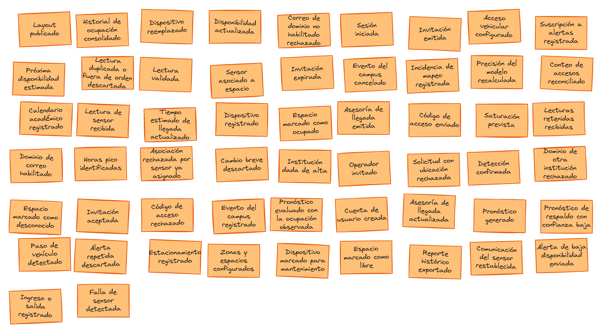

*Figura: EventStorming, paso 1 (Unstructured Exploration). Eventos de dominio identificados durante la exploración inicial, sin orden cronológico.*

**Paso 2. Timelines**

En el segundo paso, los eventos se ordenaron en el tiempo. Cada fase se organizó en carriles, uno por actor o por parte del proceso, y en cada carril la fila superior muestra el camino exitoso, mientras que debajo se ubican los escenarios alternativos que se desprenden de cada evento.

La primera fase empieza cuando el equipo de Integra Labs da de alta a una institución, habilita sus dominios de correo e invita a su primer administrador. El administrador acepta la invitación, inicia sesión con un código de acceso y configura el estacionamiento: registra el estacionamiento, sus zonas, espacios y accesos vehiculares, registra los dispositivos, asocia cada sensor a un espacio y publica el layout. Por último, registra el calendario académico y los eventos del campus, que después influyen en la demanda.

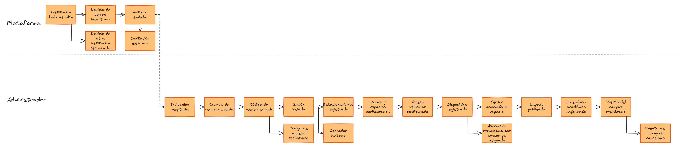

*Figura: EventStorming, paso 2 (Timelines), fase de incorporación y configuración. Las líneas punteadas indican el traspaso entre carriles.*

La segunda fase describe lo que ocurre cada vez que un sensor reporta. La lectura se recibe, se valida y, cuando el estado se mantiene durante el tiempo mínimo, la detección se confirma. Recién entonces el espacio se marca como ocupado o libre y la disponibilidad se actualiza. En los carriles inferiores aparecen las lecturas descartadas, el reenvío de las lecturas retenidas por el gateway cuando se recupera la conexión, la falla de un sensor que deja el espacio como desconocido y el reemplazo del dispositivo, además del registro de ingresos y salidas a partir de los sensores de paso.

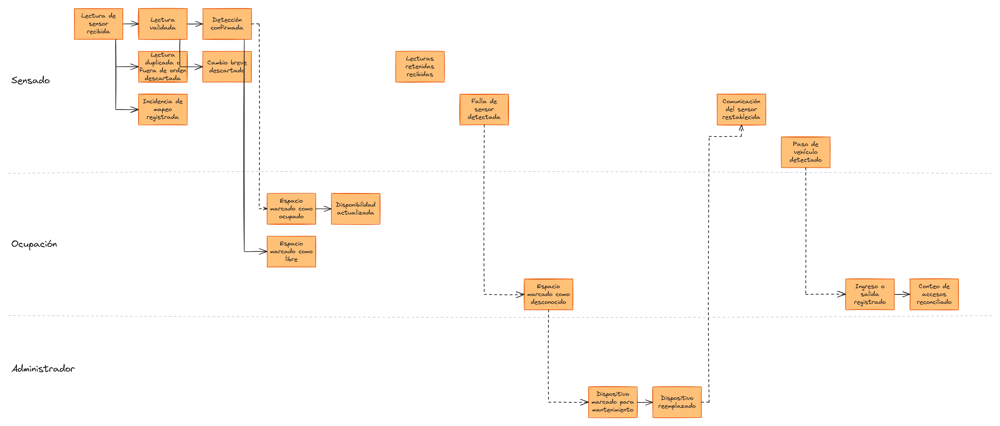

*Figura: EventStorming, paso 2 (Timelines), fase de sensado y ocupación.*

La tercera fase contiene la propuesta de valor. El pronóstico se genera para cada horizonte y, si la ocupación esperada supera el umbral, se prevé la saturación. El conductor inicia sesión, solicita la asesoría de llegada y la actualiza si cambia su tiempo estimado de llegada; también puede suscribirse a alertas por franja horaria. En paralelo, cada pronóstico se compara con la ocupación finalmente observada para recalcular la precisión del modelo y consolidar el historial.

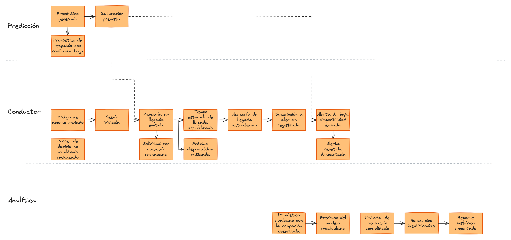

*Figura: EventStorming, paso 2 (Timelines), fase de predicción, asesoría y alertas.*

**Paso 3. Pain Points**

En el tercer paso se revisó la línea de tiempo para identificar los puntos críticos: dudas, reglas que aún no están definidas y riesgos que deben resolverse antes de implementar. Cada punto crítico se registró como un rombo rosado unido al evento en el que aparece. Se identificaron 14 puntos críticos.

En la incorporación, las dudas se concentran en los datos mínimos para dar de alta una institución, la vigencia de una invitación, el efecto de un cambio de layout sobre las asociaciones de sensores y si el calendario pertenece a la institución o a cada estacionamiento.

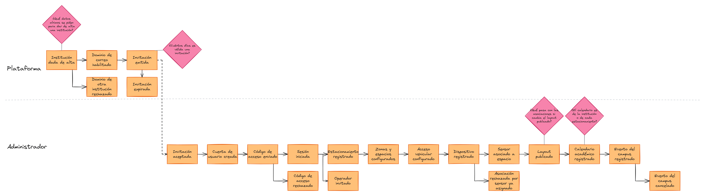

*Figura: EventStorming, paso 3 (Pain Points), fase de incorporación y configuración.*

En el sensado, los puntos críticos son técnicos y de negocio a la vez: el tiempo mínimo que confirma una detección sin falsos cambios, cuántas horas de lecturas puede retener el gateway, cuánto esperar antes de marcar un espacio como desconocido, qué hacer con un sensor sin espacio asociado y qué prevalece cuando el conteo de accesos no coincide con la detección por espacio.

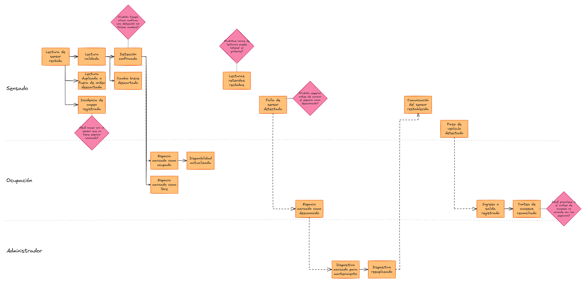

*Figura: EventStorming, paso 3 (Pain Points), fase de sensado y ocupación.*

En la predicción, las dudas giran en torno a la confianza del resultado: cuánto historial se necesita para un pronóstico confiable, qué umbral define la saturación, qué hacer si el tiempo de llegada supera los 60 minutos, cómo evitar alertas excesivas y qué error es aceptable para considerar preciso el modelo.

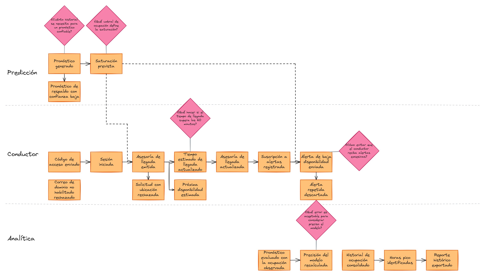

*Figura: EventStorming, paso 3 (Pain Points), fase de predicción, asesoría y alertas.*

**Paso 4. Pivotal Points**

En el cuarto paso se identificaron los eventos pivotales, es decir, aquellos después de los cuales el proceso entra en una fase distinta. Cada uno se marcó con una línea vertical inmediatamente después del evento. Se identificaron seis eventos pivotales.

En la incorporación hay dos: "Institución dada de alta", a partir del cual la institución existe en la plataforma y puede tener usuarios, y "Layout publicado", que deja el estacionamiento listo para recibir lecturas.


*Figura: EventStorming, paso 4 (Pivotal Points), fase de incorporación y configuración.*

En el sensado, "Detección confirmada" marca el momento en que una señal técnica se convierte en un hecho de negocio, y "Disponibilidad actualizada" cierra el ciclo con el estado que consumen los demás procesos. Esta frontera es la que después separa a Parking Sensing de Occupancy.

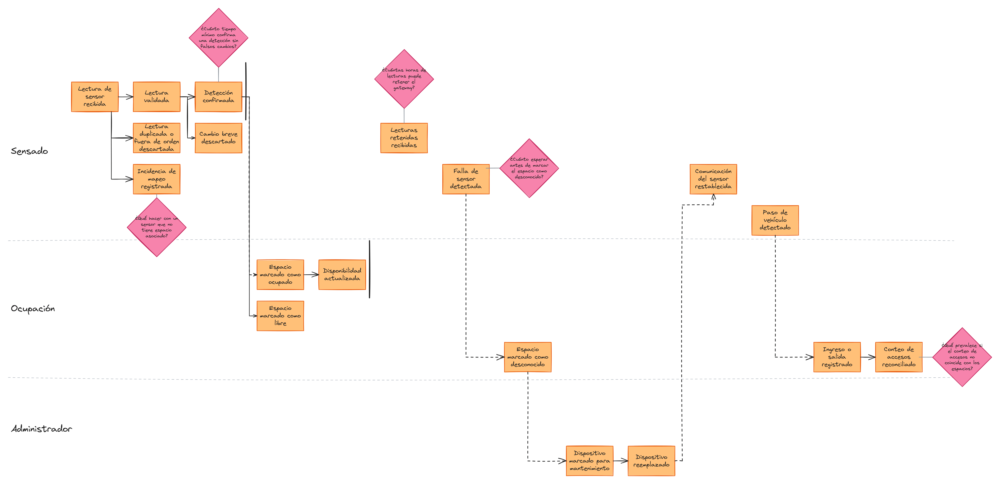

*Figura: EventStorming, paso 4 (Pivotal Points), fase de sensado y ocupación.*

En la predicción, "Pronóstico generado" habilita la asesoría y las alertas, y "Asesoría de llegada emitida" entrega al conductor el resultado que justifica el producto.

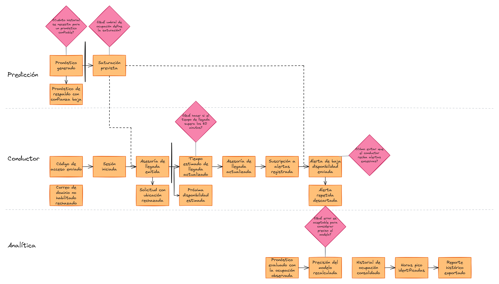

*Figura: EventStorming, paso 4 (Pivotal Points), fase de predicción, asesoría y alertas.*

**Paso 5. Commands**

En el quinto paso se identificaron los comandos que producen cada evento. Cada comando se registró en un post-it azul a la izquierda del evento que dispara, con el actor que lo ejecuta en un post-it amarillo encima. En este paso solo se incluyen los comandos que ejecuta una persona; los que ejecuta el sistema se incorporan en el paso siguiente, y los que ejecuta un sistema externo, en el paso 8. El modelo tiene tres actores: el equipo de Integra Labs, el administrador de estacionamientos y el conductor.

En la incorporación, el equipo de Integra Labs da de alta la institución y habilita sus dominios de correo; el resto de los comandos los ejecuta el administrador, desde aceptar la invitación hasta publicar el layout y registrar el calendario.

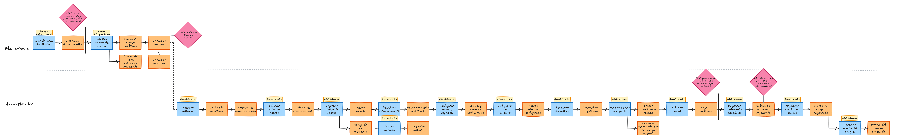

*Figura: EventStorming, paso 5 (Commands), fase de incorporación y configuración.*

En el sensado casi no hay comandos de personas, porque el proceso es automático. El único es el reemplazo de un dispositivo, que el administrador ejecuta después de una falla.

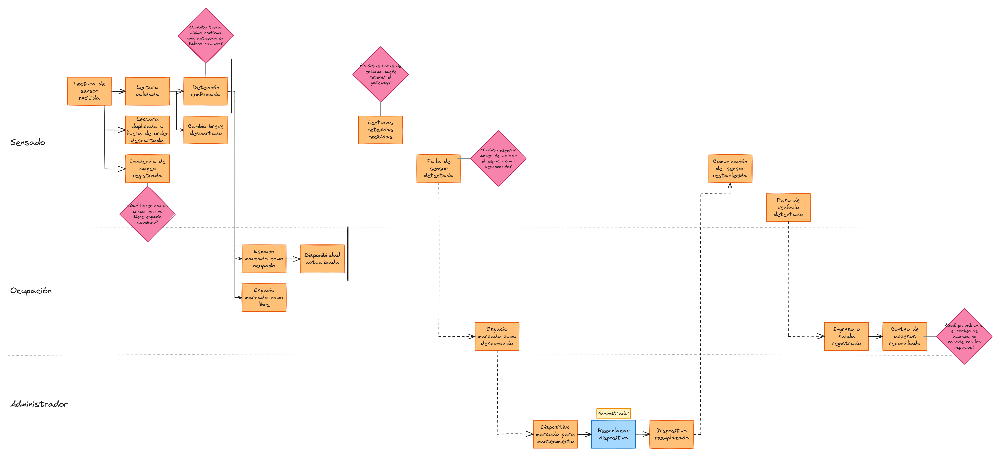

*Figura: EventStorming, paso 5 (Commands), fase de sensado y ocupación.*

En la predicción, el conductor solicita el código de acceso, solicita la asesoría de llegada, actualiza su tiempo estimado de llegada y se suscribe a alertas. El administrador exporta el reporte histórico.

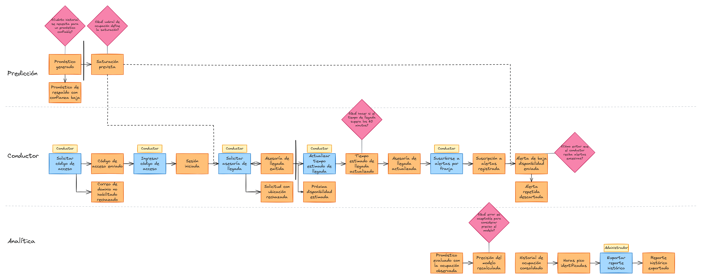

*Figura: EventStorming, paso 5 (Commands), fase de predicción, asesoría y alertas.*

**Paso 6. Policies**

En el sexto paso se agregaron las políticas, que representan las reacciones automáticas del sistema: cuando ocurre un evento, el sistema ejecuta un comando sin que intervenga una persona. Cada política se registró en un post-it morado sobre el comando que ejecuta. Se identificaron 22 políticas.

En la incorporación, las políticas invitan al primer administrador cuando se da de alta la institución, crean la cuenta cuando se acepta una invitación y hacen vencer las invitaciones que no se usan dentro del plazo.

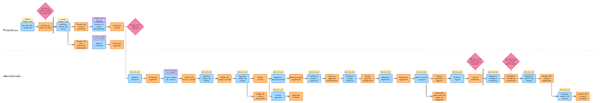

*Figura: EventStorming, paso 6 (Policies), fase de incorporación y configuración.*

El sensado y la ocupación son, casi por completo, una cadena de políticas. Cada lectura recibida se valida; si el estado se mantiene durante el tiempo mínimo, se confirma la detección; cada detección actualiza el estado del espacio y cada cambio de estado recalcula la disponibilidad. Cuando vence el intervalo de reporte de un sensor o su batería es crítica, se detecta la falla, el espacio pasa a desconocido y el dispositivo se marca para mantenimiento. Los pasos de vehículo registran ingresos y salidas, y una reconciliación periódica contrasta el conteo de accesos con la detección por espacio.

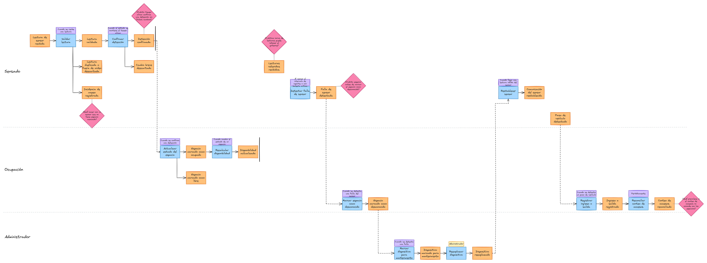

*Figura: EventStorming, paso 6 (Policies), fase de sensado y ocupación.*

En la predicción, el pronóstico se genera en cada ciclo o cuando cambia el calendario, y cada pronóstico se evalúa para detectar una saturación. Si se prevé saturación en una franja suscrita, se envía la alerta. Cuando cambia el tiempo estimado de llegada, la asesoría se recalcula, y cuando es poco probable encontrar espacio, se estima la próxima disponibilidad. En Analítica, al llegar la hora objetivo de cada pronóstico, este se evalúa contra la ocupación observada y se recalcula la precisión del modelo.

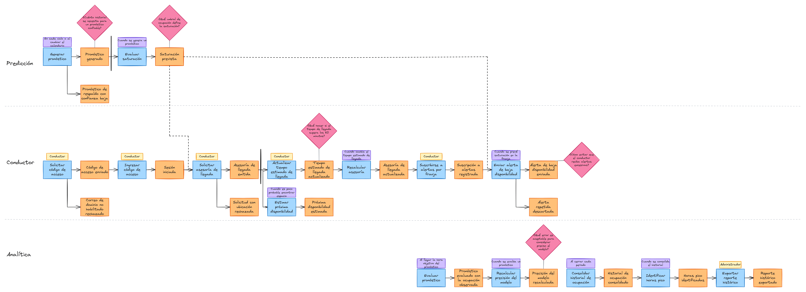

*Figura: EventStorming, paso 6 (Policies), fase de predicción, asesoría y alertas.*

**Paso 7. Read Models**

En el séptimo paso se identificaron los read models, es decir, la información que cada actor consulta antes de ejecutar un comando. Cada read model se registró en un post-it verde junto al comando que apoya. Se identificaron 12 read models.

En la incorporación, el administrador consulta los estacionamientos de su institución, el layout del estacionamiento, el inventario de dispositivos, el equipo de la institución y el calendario académico.

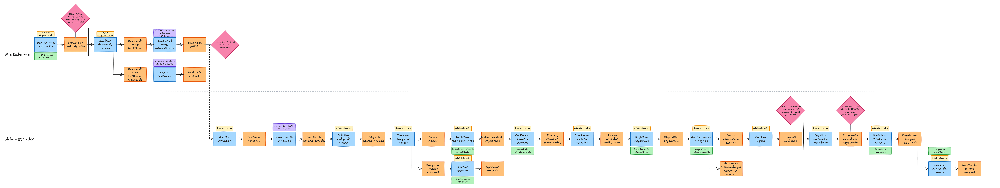

*Figura: EventStorming, paso 7 (Read Models), fase de incorporación y configuración.*

En el sensado, el administrador consulta la salud de los dispositivos (estado, batería y última comunicación) antes de reemplazar uno.

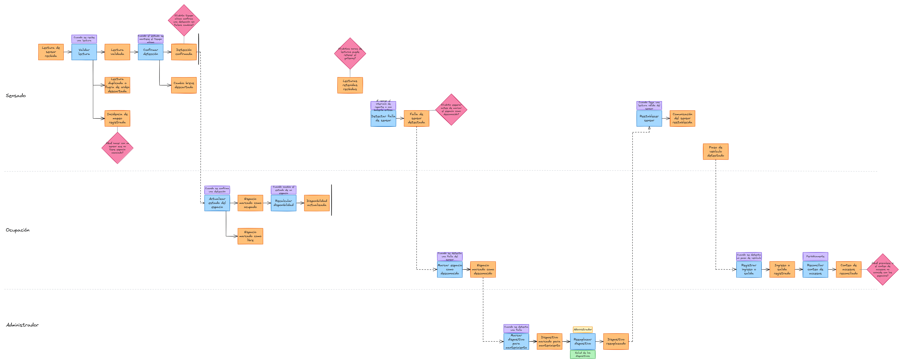

*Figura: EventStorming, paso 7 (Read Models), fase de sensado y ocupación.*

En la predicción, el conductor consulta la disponibilidad y los pronósticos antes de pedir la asesoría y sus preferencias de notificación antes de suscribirse. El administrador consulta el historial, las horas pico y la precisión antes de exportar el reporte.

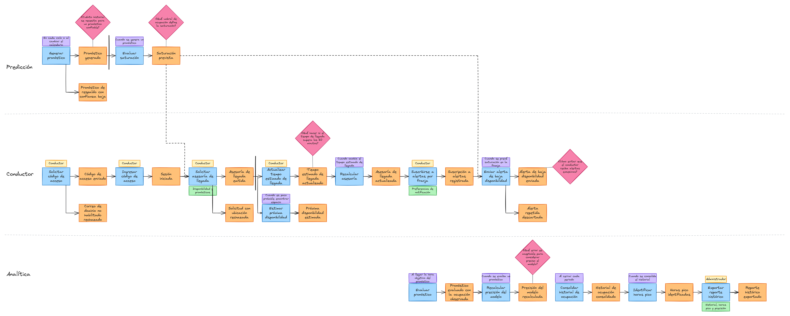

*Figura: EventStorming, paso 7 (Read Models), fase de predicción, asesoría y alertas.*

**Paso 8. External Systems**

En el octavo paso se incorporaron los sistemas externos, representados con post-its rojos. Algunos reciben órdenes del sistema y otros ejecutan comandos sobre él.

En la incorporación interviene el servicio de correo, que entrega las invitaciones y los códigos de acceso.

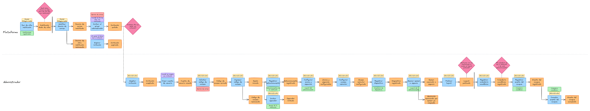

*Figura: EventStorming, paso 8 (External Systems), fase de incorporación y configuración.*

En el sensado, los sensores de cochera y de paso publican las lecturas, y el gateway del campus reenvía las que retuvo en su búfer local cuando se recupera la conexión, de acuerdo con la decisión de la iteración 2 del ADD. Ambos ejecutan comandos sobre el sistema.

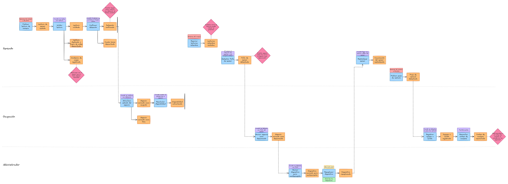

*Figura: EventStorming, paso 8 (External Systems), fase de sensado y ocupación.*

En la predicción intervienen el servicio de correo, el proveedor de mensajería push, que entrega las alertas, y el servicio de mapas. Este último se consulta solo desde el dispositivo del conductor para calcular el tiempo estimado de llegada; el servidor recibe únicamente los minutos, como establece CON-07.

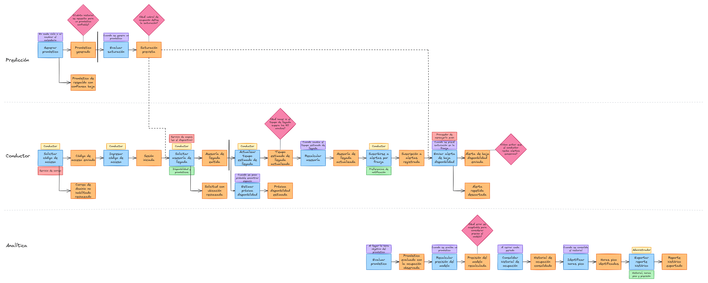

*Figura: EventStorming, paso 8 (External Systems), fase de predicción, asesoría y alertas.*

**Paso 9. Aggregates**

En el noveno paso, los comandos y los eventos se agruparon en agregados, es decir, en los objetos del dominio que reciben los comandos, protegen las reglas de negocio y producen los eventos. Se identificaron 18 agregados. En la figura, cada agregado aparece como un post-it alto de color amarillo pálido, con los comandos que recibe a la izquierda, los eventos que produce a la derecha y su regla principal debajo.

La separación más importante está en el sensado. SensorFeed recibe las lecturas, descarta las duplicadas o fuera de orden y confirma la detección; DeviceHealth controla el intervalo de reporte y la batería de cada sensor, y GatewayLink representa el reenvío de lecturas retenidas. Ninguno de ellos conoce el estado de negocio del espacio, que pertenece a SpaceOccupancy, ni la disponibilidad del estacionamiento, que pertenece a LotOccupancy. De forma similar, Device registra qué dispositivo está instalado y dónde, mientras que DeviceHealth sabe qué está reportando en este momento. En la predicción, Forecast genera los pronósticos y detecta la saturación, y ArrivalAdvice calcula la asesoría solo con el tiempo estimado en minutos.

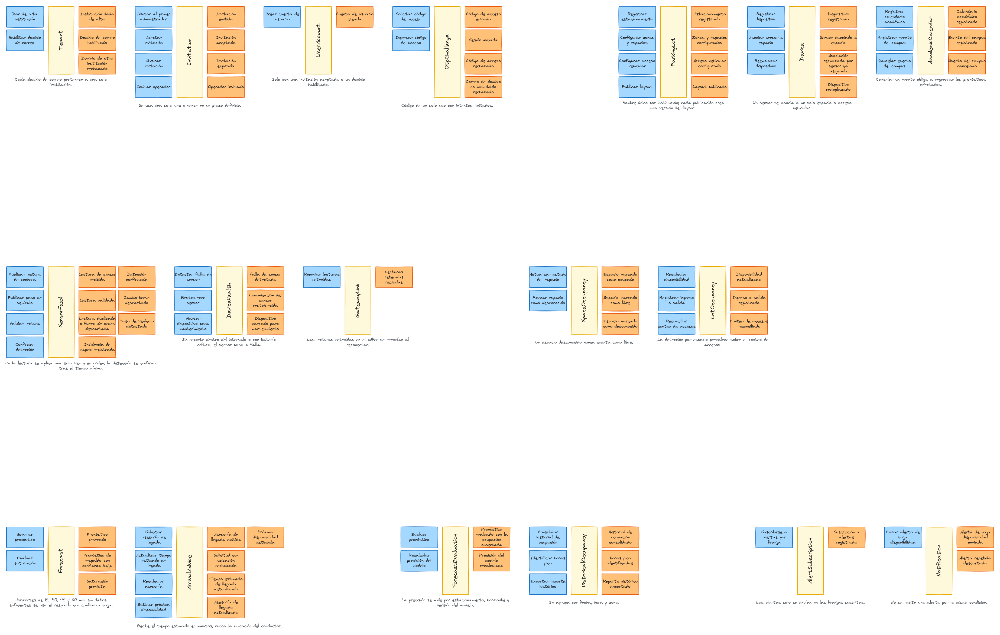

*Figura: EventStorming, paso 9 (Aggregates). Agregados en amarillo pálido, con los comandos que reciben, los eventos que producen y la regla principal de cada uno.*

**Paso 10. Bounded Contexts**

En el último paso, los agregados se agruparon en bounded contexts candidatos según la cercanía de su funcionalidad y las políticas que los conectan. Se obtuvieron siete contextos. Prediction & Advisory es el contexto core, porque contiene la propuesta de valor de Quadrapp. Parking Configuration, Parking Sensing, Occupancy, Analytics y Notifications son contextos de soporte, e IAM es genérico.

Las flechas moradas representan las políticas que conectan los contextos, y las punteadas, las consultas. Parking Configuration entrega a Parking Sensing el mapa entre sensores y espacios, y a Occupancy los espacios y la capacidad de cada zona. Parking Sensing entrega a Occupancy solo las detecciones confirmadas y las fallas. Prediction & Advisory consulta a Occupancy la ocupación actual y el flujo, y a Parking Configuration el perfil, el calendario y los eventos del campus. Sus pronósticos alimentan a Analytics y sus saturaciones previstas, a Notifications.

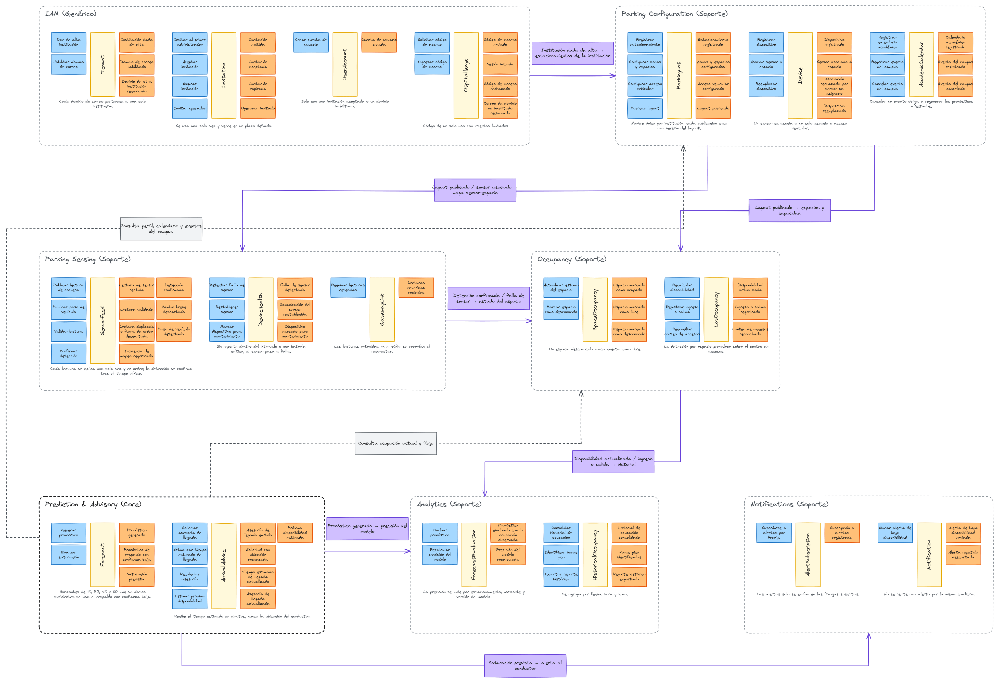

*Figura: EventStorming, paso 10 (Bounded Contexts). Contextos delimitados con línea punteada; el contexto core tiene borde grueso. Las flechas moradas representan políticas y las punteadas, consultas.*

La tabla siguiente relaciona los eventos de dominio clave del tablero con los nombres que se utilizan en los Bounded Context Canvases y en el diseño táctico.

| Evento en el tablero | Nombre en el modelo | Contexto |
| --- | --- | --- |
| Institución dada de alta | TenantProvisioned | IAM |
| Layout publicado | ParkingLayoutProvided | Parking Configuration |
| Evento del campus registrado | CampusEventProvided | Parking Configuration |
| Detección confirmada | SensorStateChanged | Parking Sensing |
| Falla de sensor detectada | DeviceFaultDetected | Parking Sensing |
| Disponibilidad actualizada | OccupancyUpdated | Occupancy |
| Ingreso o salida registrado | EntryExitRecorded | Occupancy |
| Pronóstico generado | ForecastGenerated | Prediction & Advisory |
| Saturación prevista | SaturationPredicted | Prediction & Advisory |
| Asesoría de llegada emitida | ArrivalAdviceIssued | Prediction & Advisory |
| Precisión del modelo recalculada | AccuracyMetricsProvided | Analytics |
| Alerta de baja disponibilidad enviada | UserNotificationDelivered | Notifications |

### 4.2.2. Candidate Context Discovery

A partir del EventStorming, se realizó el descubrimiento de contextos candidatos para identificar los bounded contexts de Quadrapp. El proceso se desarrolló en tres iteraciones sobre una versión simplificada de la línea de tiempo, que conserva los eventos que mejor representan cada parte del proceso. En cada iteración se aplicó una de las técnicas propuestas: start-with-simple y look-for-pivotal-events para una primera división del dominio, un refinamiento de los borradores según el lenguaje y las reglas de cada parte, y start-with-value para clasificar los contextos resultantes según su valor para el negocio.

**Iteración 1. Start-with-simple y look-for-pivotal-events**

En la primera iteración, la línea de tiempo se descompuso en pasos secuenciales, usando como límites los seis eventos pivotales identificados en el paso 4 del EventStorming: institución dada de alta, layout publicado, detección confirmada, disponibilidad actualizada, pronóstico generado y asesoría de llegada emitida. Así se obtuvieron siete fases, desde el alta hasta las alertas y el seguimiento, y debajo de ellas se propusieron seis contextos en borrador. En esta versión, el acceso y la configuración del estacionamiento quedaron juntos, igual que los sensores y la ocupación.

En esta iteración también se observó que algunos eventos no pertenecen a una sola fase. La falla de un sensor, el espacio marcado como desconocido, los ingresos y salidas, los eventos del campus, las suscripciones a alertas y el historial aparecen en distintos momentos del proceso, por lo que se registraron aparte para ubicarlos en la siguiente iteración.

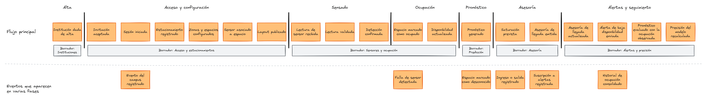

*Figura: Candidate Context Discovery, iteración 1. Línea de tiempo simplificada dividida en fases por los eventos pivotales, con los contextos en borrador y, debajo, los eventos que aparecen en varias fases.*

**Iteración 2. Refinamiento de los contextos candidatos**

En la segunda iteración, cada evento se ubicó en el carril del contexto candidato al que pertenece, manteniendo su posición en el tiempo. Los borradores se ajustaron según dos criterios: que los eventos de un mismo contexto compartan el lenguaje y las reglas de negocio, y que el contexto pueda evolucionar sin arrastrar a los demás.

Con ese criterio, el borrador de acceso y estacionamientos se dividió en IAM y Parking Configuration, porque las instituciones, invitaciones y códigos de acceso no comparten reglas con los estacionamientos, zonas y espacios. El cambio más importante fue separar el borrador de sensores y ocupación en dos contextos. Parking Sensing habla de lecturas, dispositivos, intervalos de reporte y tiempo mínimo de detección; Occupancy habla del estado de negocio del espacio, la disponibilidad y el flujo. Por eso la falla de un sensor queda en Parking Sensing, mientras que el espacio marcado como desconocido y los ingresos y salidas quedan en Occupancy. Así, cambiar la tecnología de sensado no afecta el modelo de ocupación. Los borradores de predicción y asesoría se unieron en Prediction & Advisory, porque la asesoría solo existe a partir del pronóstico y comparte su lenguaje de horizontes, confianza y saturación. El borrador de alertas y precisión se dividió en Notifications y Analytics, porque enviar una alerta y medir el error del modelo responden a reglas distintas.

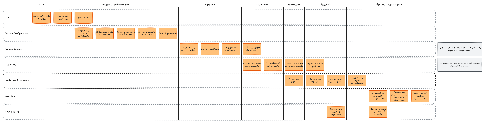

*Figura: Candidate Context Discovery, iteración 2. Cada carril corresponde a un contexto candidato y cada evento conserva su posición en el tiempo. A la derecha se indica el límite entre Parking Sensing y Occupancy.*

**Iteración 3. Start-with-value**

En la tercera iteración, los contextos candidatos se clasificaron según su aporte a la propuesta de valor de Quadrapp, que es anticipar la disponibilidad y orientar la llegada del conductor. Prediction & Advisory se consideró core, porque sin el pronóstico y la asesoría Quadrapp sería un contador de espacios más. Parking Configuration, Parking Sensing, Occupancy, Analytics y Notifications se clasificaron como contextos de soporte, porque son específicos del negocio pero existen para sostener al core. IAM se clasificó como genérico, porque resuelve una necesidad común a cualquier aplicación.

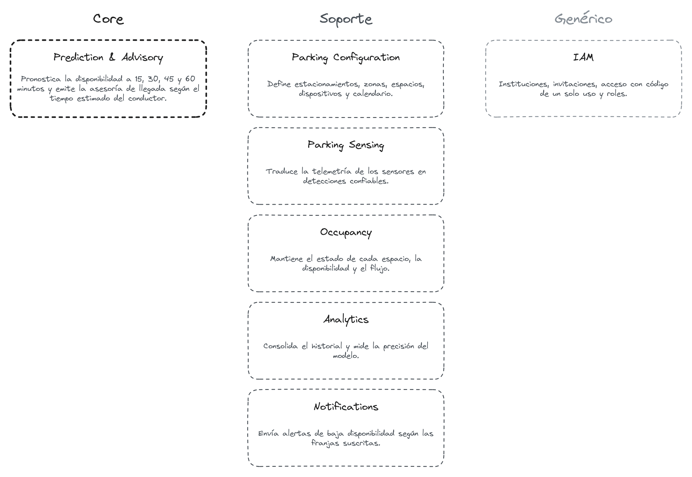

*Figura: Candidate Context Discovery, iteración 3. Contextos clasificados según su aporte a la propuesta de valor, con la responsabilidad principal de cada uno.*

El resultado del proceso son siete contextos candidatos, que se resumen en la tabla siguiente.

| Contexto candidato | Tipo | Responsabilidad | Eventos representativos |
| --- | --- | --- | --- |
| Prediction & Advisory | Core | Pronosticar la disponibilidad a 15, 30, 45 y 60 minutos y emitir la asesoría de llegada | Pronóstico generado, Saturación prevista, Asesoría de llegada emitida |
| Parking Configuration | Soporte | Definir estacionamientos, zonas, espacios, accesos, dispositivos y calendario | Estacionamiento registrado, Sensor asociado a espacio, Layout publicado |
| Parking Sensing | Soporte | Traducir la telemetría de los sensores en detecciones confiables y vigilar su salud | Lectura validada, Detección confirmada, Falla de sensor detectada |
| Occupancy | Soporte | Mantener el estado de cada espacio, la disponibilidad y el flujo vehicular | Espacio marcado como ocupado, Espacio marcado como desconocido, Disponibilidad actualizada |
| Analytics | Soporte | Consolidar el historial y medir la precisión del modelo | Pronóstico evaluado con la ocupación observada, Precisión del modelo recalculada |
| Notifications | Soporte | Enviar alertas de baja disponibilidad según las franjas suscritas | Suscripción a alertas registrada, Alerta de baja disponibilidad enviada |
| IAM | Genérico | Gestionar instituciones, invitaciones, acceso con código de un solo uso y roles | Institución dada de alta, Sesión iniciada |

### 4.2.3. Domain Message Flows Modeling

Una vez identificados los contextos candidatos, se modeló cómo colaboran para resolver los escenarios principales del negocio. Para ello se elaboraron diagramas de Domain Message Flow, que muestran, para un escenario concreto, los mensajes que intercambian los actores, los bounded contexts y los sistemas externos.

Los diagramas siguen la notación de mensaje y contenido combinados. Los actores se representan con una figura de persona, los bounded contexts con una elipse morada y los sistemas con un círculo punteado. Cada mensaje es una tarjeta de color según su tipo: azul para los comandos, naranja para los eventos y verde para las consultas. La tarjeta indica el nombre del mensaje y sus datos más importantes, y el número en la parte superior, que también aparece sobre la flecha, señala el orden en que ocurre dentro del escenario. Las flechas van del emisor al receptor y respetan las relaciones del Context Map: los eventos fluyen del contexto upstream al downstream, y las consultas, del downstream al upstream.

Se modelaron cinco escenarios, elegidos para que cada bounded context participe en al menos uno.

El primer escenario corresponde al caso central de Quadrapp. El conductor solicita la asesoría de llegada; la aplicación calcula el tiempo de viaje con el servicio de mapas en el propio dispositivo y envía a Prediction & Advisory solo el estacionamiento y el tiempo estimado en minutos. Prediction & Advisory consulta a Occupancy la ocupación actual y el flujo, y a Parking Configuration el perfil del estacionamiento, y responde con el evento Asesoría de llegada emitida, que incluye la categoría, la probabilidad, la confianza y la próxima disponibilidad.

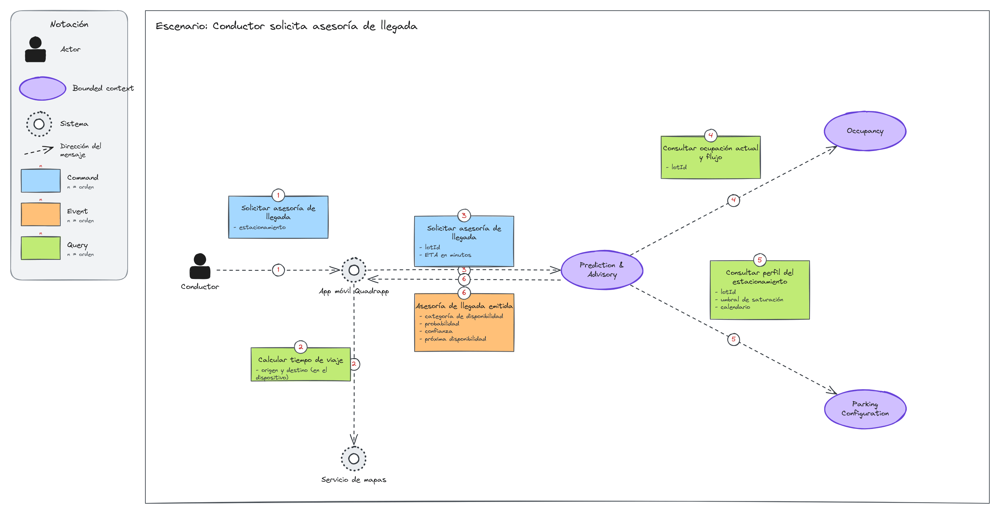

*Figura: Domain Message Flow del escenario "Conductor solicita asesoría de llegada". Los números indican el orden de los mensajes.*

En el segundo escenario, Prediction & Advisory genera un pronóstico a partir de la ocupación reciente y del calendario. Publica el evento Pronóstico generado, que Analytics usa para medir la precisión, y, como la ocupación esperada supera el umbral, publica el evento Saturación prevista. Notifications lo recibe, ordena el envío al proveedor de mensajería push y el conductor recibe la alerta de baja disponibilidad.

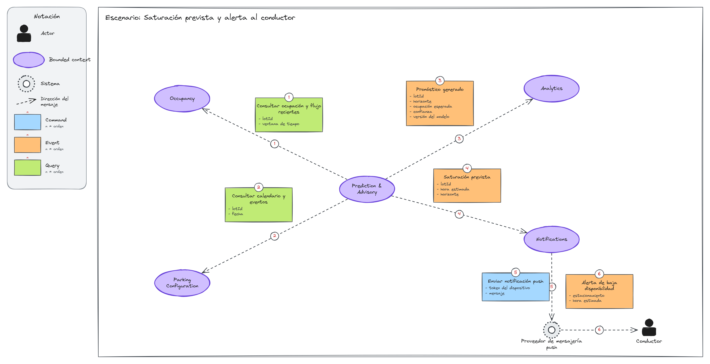

*Figura: Domain Message Flow del escenario "Saturación prevista y alerta al conductor". Los números indican el orden de los mensajes.*

El tercer escenario muestra la falla de un sensor. Parking Sensing detecta que el sensor dejó de reportar dentro de su intervalo y publica el evento Falla de sensor detectada, con el que Occupancy marca el espacio como desconocido. El administrador consulta la salud de los dispositivos desde la consola y reemplaza el dispositivo en Parking Configuration, que publica la nueva asociación entre el sensor y el espacio. Cuando el sensor nuevo publica su primera lectura, Parking Sensing confirma la detección y Occupancy recupera el estado real del espacio.

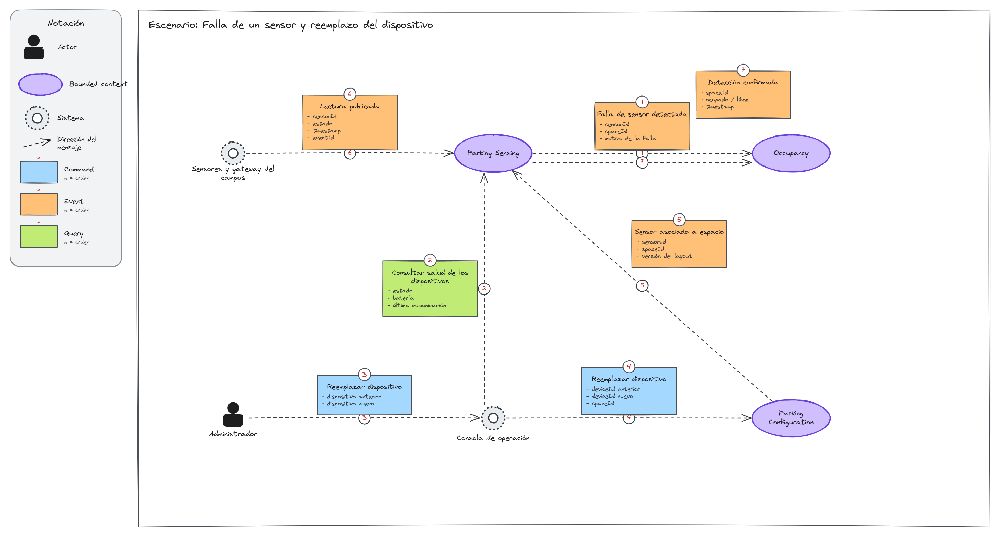

*Figura: Domain Message Flow del escenario "Falla de un sensor y reemplazo del dispositivo". Los números indican el orden de los mensajes.*

El cuarto escenario describe el flujo de una lectura en operación normal. El gateway del campus publica la lectura mediante MQTT con QoS 1; Parking Sensing consulta a Parking Configuration el espacio asociado al sensor y, tras el tiempo mínimo, publica el evento Detección confirmada. Occupancy actualiza la disponibilidad y la publica tanto para Analytics, que construye el historial, como para la aplicación móvil.

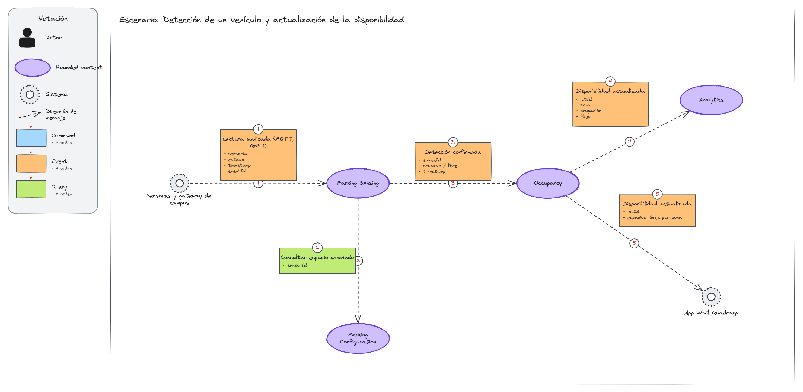

*Figura: Domain Message Flow del escenario "Detección de un vehículo y actualización de la disponibilidad". Los números indican el orden de los mensajes.*

El último escenario muestra la incorporación de una institución. El equipo de Integra Labs la da de alta en IAM, que envía la invitación por el servicio de correo. El administrador acepta la invitación, configura el estacionamiento desde la consola y publica el layout en Parking Configuration, que lo comunica a Parking Sensing, con la asociación entre sensores y espacios, y a Occupancy, con la capacidad de cada zona.

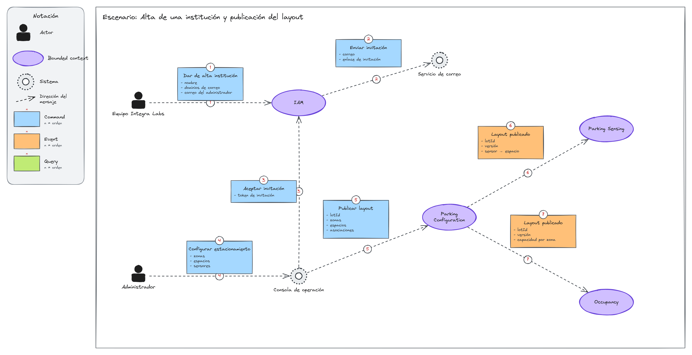

*Figura: Domain Message Flow del escenario "Alta de una institución y publicación del layout". Los números indican el orden de los mensajes.*

### 4.2.4. Bounded Context Canvases

Con los contextos candidatos y sus flujos de mensajes definidos, se elaboró un Bounded Context Canvas para cada uno, usando la versión 5 de la plantilla de ddd-crew en Excalidraw, la misma herramienta del EventStorming. Los contextos se trabajaron en orden de importancia, empezando por el core, y cada canvas se construyó de forma iterativa con los siguientes pasos:

1. **Context Overview Definition:** definir el nombre, el propósito y la clasificación estratégica del contexto (tipo de dominio, modelo de negocio, evolución y rol).
2. **Business Rules Distillation & Ubiquitous Language Capture:** extraer las reglas de negocio del EventStorming y registrar los términos propios del contexto.
3. **Capability Analysis:** identificar las capacidades que ofrece el contexto a partir de los comandos y consultas que recibe.
4. **Capability Layering:** cuando aplica, ordenar esas capacidades en capas.
5. **Dependencies Capture:** registrar los mensajes de entrada y de salida y los colaboradores con los que se intercambian, a partir de los Domain Message Flows.
6. **Design Critique:** revisar el diseño, registrar los supuestos, las métricas para validarlo y las preguntas abiertas, y evaluar alternativas.

En los canvas, los comandos se muestran en azul, los eventos en amarillo y las consultas en verde, como en la plantilla original. Las preguntas abiertas recogen los puntos críticos identificados en el paso 3 del EventStorming.

**Aplicación de los pasos en el contexto core: Prediction & Advisory**

Se trabajó primero Prediction & Advisory, por ser el contexto que materializa la propuesta de valor. Las figuras siguientes muestran el mismo canvas al cierre de cada paso.

En la definición general se estableció su propósito: anticipar la disponibilidad de cada estacionamiento a 15, 30, 45 y 60 minutos y orientar la llegada del conductor. Se clasificó como core, porque es lo que diferencia a Quadrapp de un contador de espacios; como custom built, porque el modelo de pronóstico se construye para este negocio, y como contexto de ejecución, porque produce decisiones que el conductor usa en el momento. En el modelo de negocio aporta tanto al compromiso de los conductores como al valor que justifica la licencia institucional.

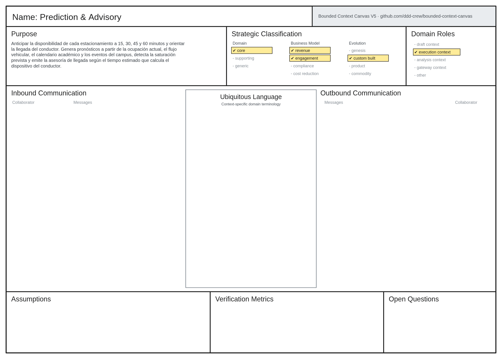

*Figura: Bounded Context Canvas de Prediction & Advisory, paso 1 (Context Overview Definition).*

Al destilar las reglas de negocio se fijaron los horizontes de 15, 30, 45 y 60 minutos y se estableció que cada pronóstico registra su confianza y la versión del modelo, para que su precisión pueda medirse después. También se decidió que, sin datos suficientes, se usa la heurística de respaldo con confianza baja; que la saturación se prevé cuando la ocupación esperada supera el umbral del estacionamiento, y que la asesoría solo recibe el tiempo estimado de llegada en minutos, como establece CON-07. En paralelo se registraron los términos propios del contexto, como Forecast, Forecast Horizon, Confidence Level, Arrival Advice y Next Availability.

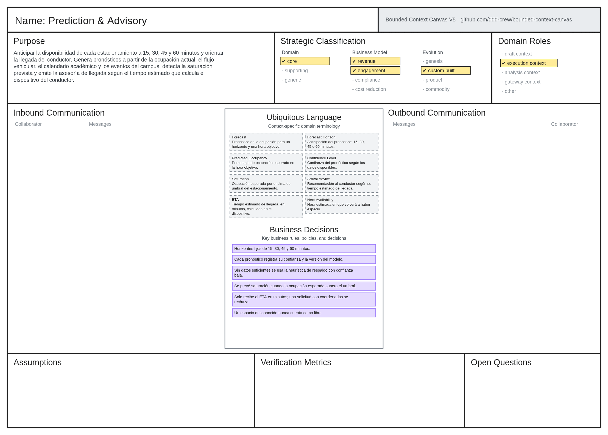

*Figura: Bounded Context Canvas de Prediction & Advisory, paso 2 (Business Rules Distillation & Ubiquitous Language Capture).*

En el análisis de capacidades se registraron los comandos y consultas que el contexto atiende: solicitar la asesoría de llegada, actualizar el tiempo estimado de llegada y consultar los pronósticos. A partir de ellos se identificaron dos capas: Forecasting, que genera los pronósticos y evalúa la saturación, y Arrival Advisory, que convierte esos pronósticos en una recomendación según el tiempo de llegada del conductor. Se decidió mantener ambas capas en el mismo contexto, porque la asesoría no existe sin el pronóstico y comparte su lenguaje.

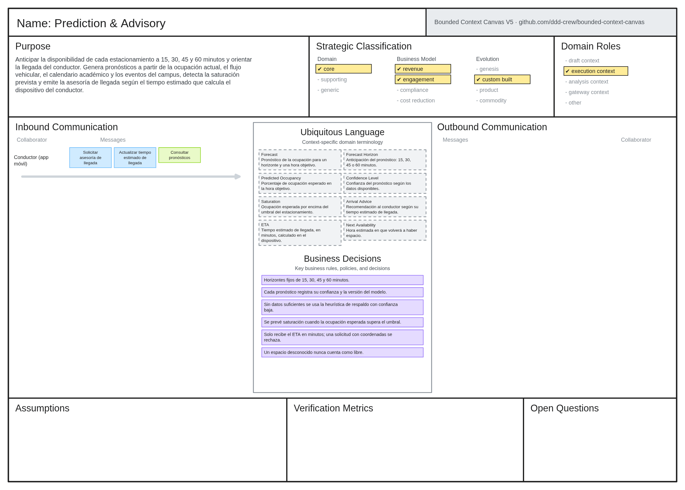

*Figura: Bounded Context Canvas de Prediction & Advisory, pasos 3 y 4 (Capability Analysis y Capability Layering).*

Al capturar las dependencias se completó la comunicación a partir de los Domain Message Flows. El contexto consulta a Occupancy la ocupación actual y el flujo, y a Parking Configuration el perfil del estacionamiento, el calendario y los eventos del campus, y recibe de este último la cancelación de un evento, que obliga a regenerar los pronósticos. Publica Pronóstico generado hacia Analytics, Saturación prevista hacia Notifications y la asesoría hacia la aplicación móvil.

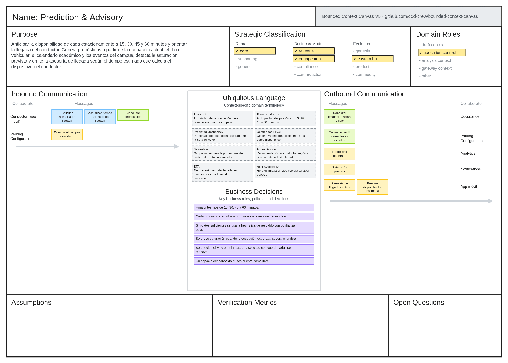

*Figura: Bounded Context Canvas de Prediction & Advisory, paso 5 (Dependencies Capture).*

En la crítica del diseño se revisó si la medición de la precisión debía quedar en este contexto y se trasladó a Analytics, para que el contexto que pronostica no evalúe su propio error. También se confirmó que el cálculo del tiempo de llegada permanece en el dispositivo. Por último, se registraron los supuestos, las métricas de verificación tomadas de los escenarios de atributos de calidad y las preguntas abiertas que provienen de los puntos críticos del EventStorming.

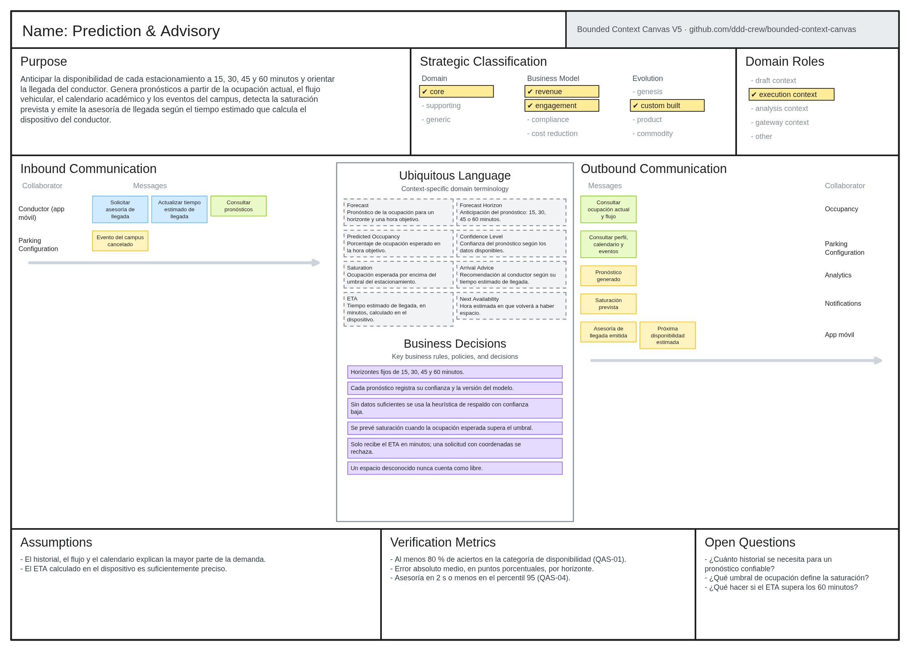

*Figura: Bounded Context Canvas de Prediction & Advisory, paso 6 (Design Critique), versión final.*

**Contextos de soporte y genéricos**

Parking Sensing se clasificó como un contexto de soporte de tipo gateway, porque traduce la telemetría de los sensores al lenguaje del dominio. Sus reglas aseguran que cada lectura se aplique una sola vez y en orden, que la detección se confirme tras el tiempo mínimo y que un sensor pase a falla cuando no reporta dentro de su intervalo o tiene batería crítica. Una decisión de diseño clave es que no calcula ocupación ni disponibilidad: solo entrega a Occupancy detecciones confirmadas, pasos de vehículos y fallas. Así, la tecnología de sensado puede cambiar sin afectar al resto del modelo.

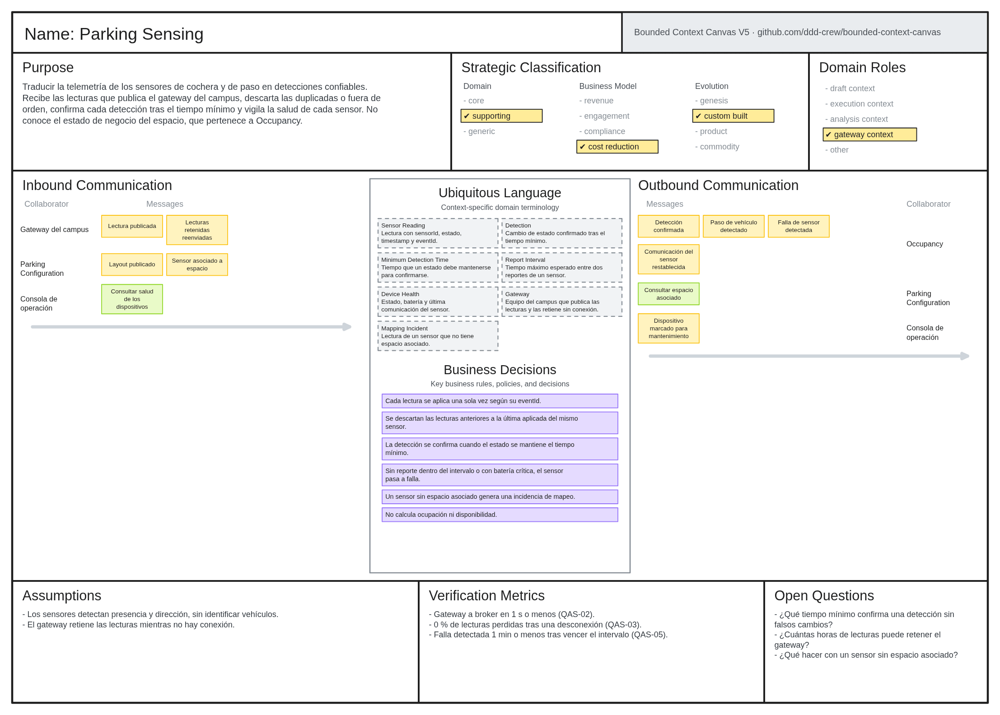

*Figura: Bounded Context Canvas de Parking Sensing.*

Occupancy mantiene el estado de negocio de cada espacio y es la fuente de verdad de la ocupación actual. Su regla central es que un espacio desconocido nunca cuenta como libre, y cuando el conteo de accesos no coincide con la detección por espacio, prevalece esta última. Recibe las detecciones de Parking Sensing y el layout de Parking Configuration, atiende las consultas de Prediction & Advisory y de la aplicación, y publica la disponibilidad y los ingresos y salidas para Analytics.

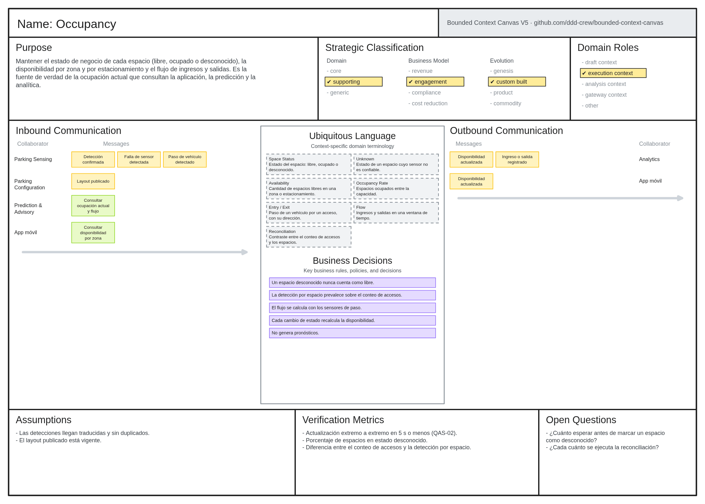

*Figura: Bounded Context Canvas de Occupancy.*

Parking Configuration se clasificó como un contexto de borrador, porque el administrador prepara la estructura del estacionamiento y luego la publica. Sus reglas garantizan nombres únicos por institución, un layout versionado en cada publicación y la asociación de cada sensor a un solo espacio o acceso. Publica el layout para Parking Sensing y Occupancy y atiende las consultas de perfil y calendario de Prediction & Advisory.

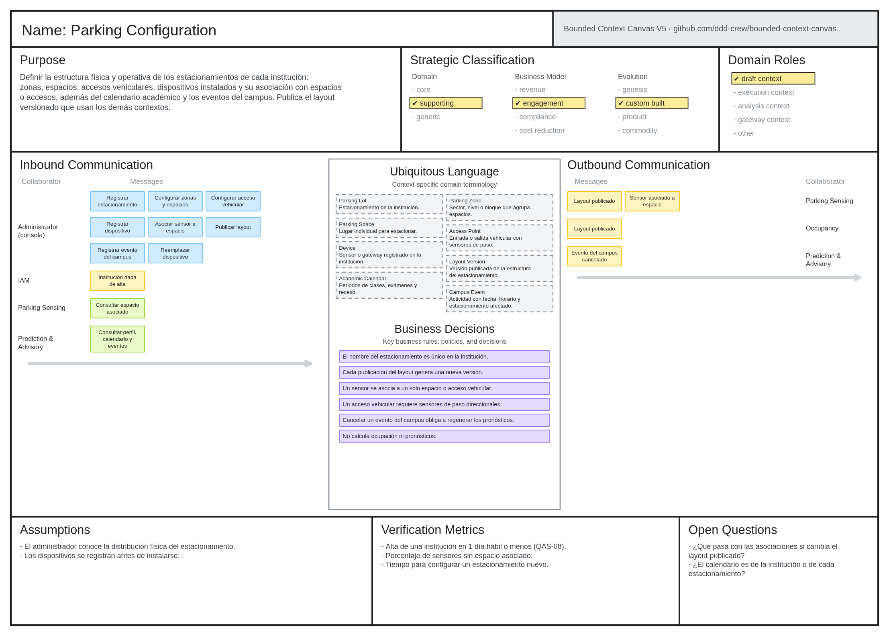

*Figura: Bounded Context Canvas de Parking Configuration.*

Analytics es un contexto de análisis: no interviene en la operación, sino que interpreta sus resultados. Consolida el historial de ocupación por fecha, hora y zona, identifica las horas pico y compara cada pronóstico con la ocupación observada para medir la precisión por horizonte y versión del modelo.

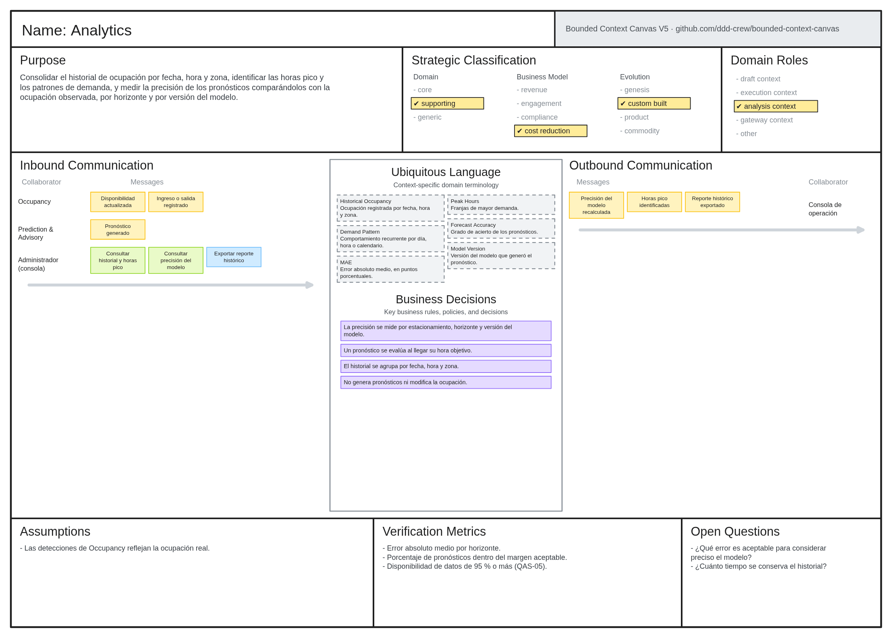

*Figura: Bounded Context Canvas de Analytics.*

Notifications avisa al conductor cuando se prevé baja disponibilidad en las franjas que suscribió. Sus reglas evitan las alertas repetidas y descartan los tokens que el proveedor rechaza. Se clasificó como product, porque el envío de notificaciones push se apoya en un proveedor existente, aislado mediante una capa anticorrupción.

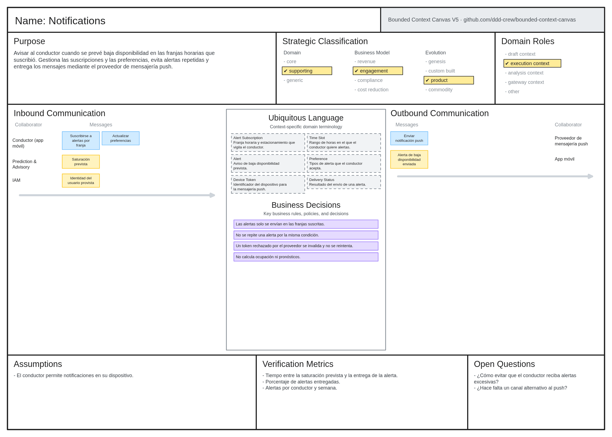

*Figura: Bounded Context Canvas de Notifications.*

Por último, IAM se clasificó como genérico, commodity y de tipo gateway, porque es la puerta de entrada a Quadrapp. Da de alta a las instituciones con sus dominios de correo, permite el ingreso de administradores y operadores solo por invitación y autentica con un código de un solo uso. No depende de un proveedor de identidad externo: entrega a los demás contextos la identidad, la institución y el rol de cada usuario.

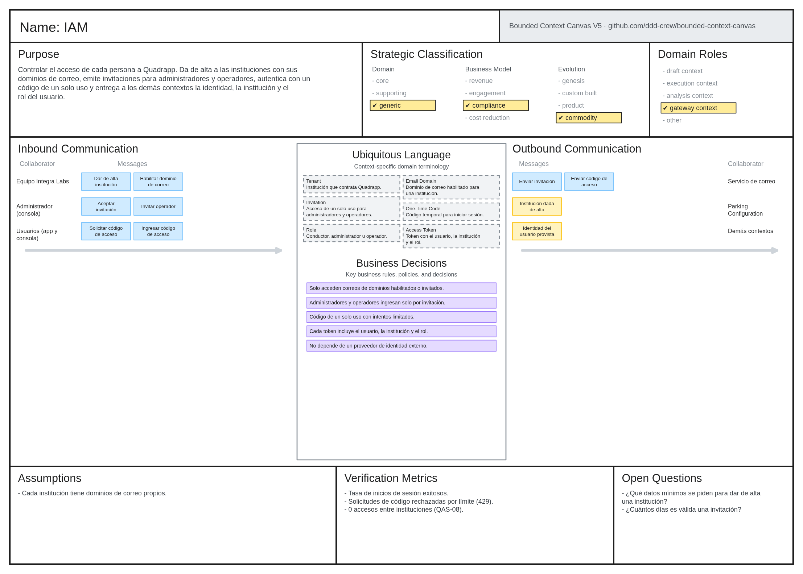

*Figura: Bounded Context Canvas de IAM.*

### 4.2.5. Context Mapping

En esta sección se comparan distintas formas en las que los Bounded Contexts de Quadrapp pueden relacionarse entre sí. La intención es encontrar una estructura que permita que cada contexto mantenga responsabilidades claras, evitando dependencias innecesarias y facilitando que la solución pueda evolucionar sin afectar otras partes del sistema.

Para ello, se analizan los bounded context Parking Sensing, Occupancy, Prediction & Advisory, Parking Configuration, Notifications, Analytics e IAM, considerando patrones de integración de Domain-Driven Design como Customer/Supplier, Conformist, Shared Kernel, Open Host Service, Published Language y Anti-Corruption Layer.

Los diagramas utilizan la notación de patrones del curso: cada contexto se representa con una elipse; las letras U y D indican el lado upstream y downstream de cada relación; las insignias OHS (Open Host Service), PL (Published Language), CF (Conformist) y ACL (Anti-Corruption Layer) se ubican junto al contexto que aplica el patrón, y SK (Shared Kernel) se ubica sobre la relación entre los dos contextos que comparten el modelo. Las relaciones Customer/Supplier se rotulan como CUS / SUP.

<br>

**Opción 1 – Contextos independientes con relaciones directas:**

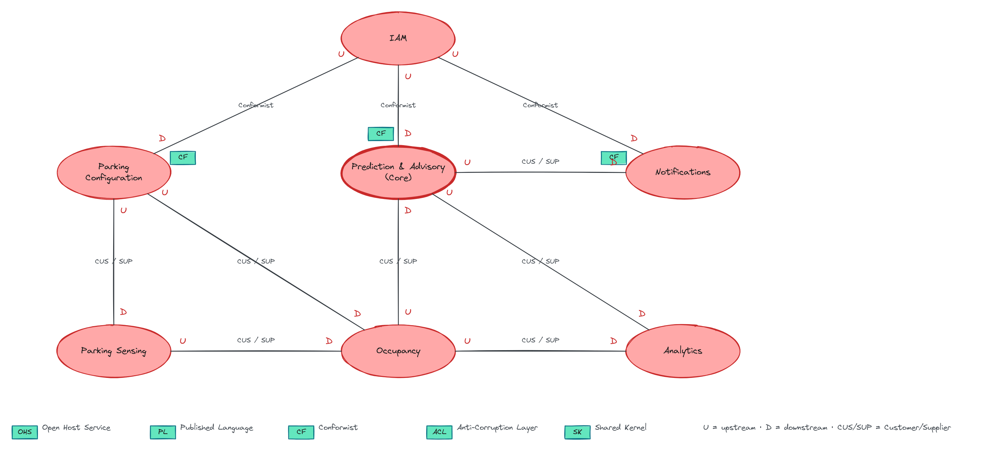

La primera alternativa mantiene los siete Bounded Contexts completamente separados y utiliza principalmente relaciones Customer/Supplier para intercambiar la información necesaria.

Parking Configuration proporciona la estructura de los estacionamientos a Parking Sensing y Occupancy. Parking Sensing procesa las señales provenientes de la infraestructura IoT y entrega los eventos interpretados a Occupancy, que mantiene el estado actual de ocupación y disponibilidad.

Occupancy proporciona su estado consolidado a Prediction & Advisory, que lo utiliza junto con la información contextual del estacionamiento para generar pronósticos y asesoría de llegada. Occupancy también proporciona sus eventos a Analytics, mientras que Prediction & Advisory entrega a Analytics los pronósticos generados para que puedan compararse posteriormente con la ocupación observada.

Finalmente, Prediction & Advisory proporciona a Notifications los eventos predictivos relevantes para determinar cuándo se debe comunicar una situación al conductor. IAM funciona de forma transversal proporcionando la información de autenticación y autorización requerida por los demás contextos.

Esta alternativa mantiene límites claros y permite una implementación sencilla de las relaciones. Sin embargo, utilizar contratos directos en todas las integraciones incrementa la dependencia entre productores y consumidores y obliga a cada contexto a adaptarse ante cambios en los contratos de los demás.

<br>

**Opción 2 – Uso de Shared Kernel entre contextos relacionados:**

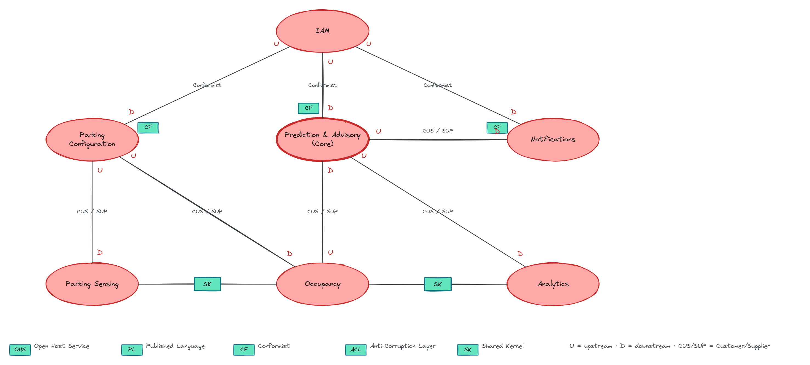

La segunda alternativa mantiene la misma división en siete Bounded Contexts, pero introduce Shared Kernel entre aquellos que trabajan con conceptos estrechamente relacionados.
Parking Sensing y Occupancy compartirían una representación mínima de los eventos relacionados con los espacios del estacionamiento. De forma similar, Occupancy y Analytics compartirían conceptos relacionados con la ocupación observada que posteriormente se utiliza para construir el historial.

El resto de integraciones conservaría relaciones directas. Prediction & Advisory seguiría recibiendo información de Occupancy y Parking Configuration, mientras que Analytics recibiría los pronósticos generados para calcular su precisión.

El principal beneficio de esta alternativa es reducir la cantidad de transformaciones entre modelos y simplificar inicialmente algunas integraciones. Sin embargo, un Shared Kernel exige coordinación entre los equipos responsables de los contextos involucrados, ya que cualquier modificación del modelo compartido puede afectar a ambos lados.

En Quadrapp este riesgo resulta especialmente relevante entre Parking Sensing y Occupancy, porque uno representa conceptos técnicos de infraestructura mientras el otro representa conceptos de negocio. También afectaría la independencia de Analytics si compartiera directamente el modelo de Occupancy.

Por ello, aunque puede reducir el esfuerzo inicial, esta alternativa se descarta debido al mayor acoplamiento entre los modelos.

<br>

**Opción 3 – Contextos independientes con protección de modelos:**

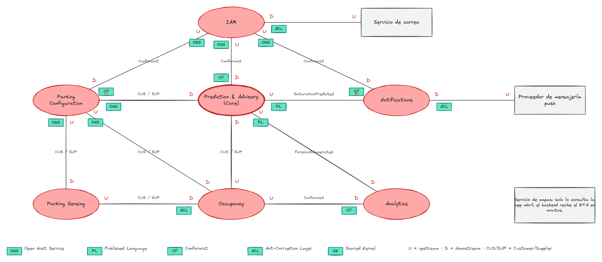

La tercera alternativa mantiene a los Bounded Contexts separados, pero introduce mecanismos específicos para evitar que los detalles internos de un contexto se propaguen directamente hacia otro.

Entre Parking Sensing y Occupancy se utiliza una relación Customer/Supplier junto con una Anti-Corruption Layer. Esto permite que Parking Sensing continúe trabajando con información técnica proveniente de sensores y dispositivos, mientras Occupancy recibe únicamente la información necesaria para mantener el estado de disponibilidad de los espacios. De esta manera, Occupancy no necesita conocer cómo funciona internamente la tecnología de sensado.

Parking Configuration actúa como la fuente de información sobre la estructura del estacionamiento, incluyendo estacionamientos, zonas, espacios, asociaciones de sensores y datos de contexto como el calendario académico y los eventos del campus. Esta información puede ponerse a disposición de los demás contextos mediante un Open Host Service, evitando que cada uno tenga que conocer directamente su modelo interno.

Occupancy proporciona a Prediction & Advisory el estado actual de ocupación y el flujo consolidado del estacionamiento. Por otro lado, Analytics consume los eventos publicados por Occupancy mediante una relación Conformist, utilizando esa información para construir su propio historial sin compartir directamente el modelo de dominio de Occupancy.

Cuando Prediction & Advisory genera un nuevo pronóstico, publica el evento ForecastGenerated. Analytics utiliza este evento para comparar la predicción con la ocupación que finalmente fue observada y así calcular las métricas de precisión del modelo.

De manera similar, cuando se identifica una situación relevante como una posible saturación, Prediction & Advisory publica esa información para Notifications mediante Published Language. De esta forma, Notifications puede actuar sobre el evento sin depender de cómo se realiza internamente la predicción.

IAM se mantiene como un contexto transversal encargado de la identidad, autenticación y autorización. Los demás contextos utilizan la información de usuario, institución y rol proporcionada por IAM cuando necesitan validar el acceso a sus funcionalidades.

Las integraciones con servicios externos también se mantienen aisladas. IAM se comunica con el servicio de correo mediante una Anti-Corruption Layer para el envío de códigos de acceso, mientras que Notifications utiliza el mismo enfoque para integrarse con el proveedor de mensajería push.

Finalmente, el proveedor de mapas no forma parte de las dependencias del backend. El cálculo del tiempo estimado de llegada se realiza directamente en la aplicación móvil y el servidor recibe únicamente el ETA expresado en minutos, manteniendo la decisión de privacidad definida para Quadrapp.

<br>

**Elección:**

Se selecciona la Opción 3, ya que proporciona el mejor equilibrio entre separación de responsabilidades, autonomía de los Bounded Contexts y protección de sus modelos.
La decisión más importante es mantener una Anti-Corruption Layer entre Parking Sensing y Occupancy. Esto evita que conceptos relacionados con sensores, dispositivos o telemetría formen parte del modelo de ocupación y permite modificar la tecnología de sensado sin alterar directamente las reglas de negocio.

También se decide utilizar Conformist entre Occupancy y Analytics, en lugar de Shared Kernel. Analytics necesita consumir la información producida por Occupancy, pero no requiere compartir sus objetos de dominio ni su persistencia. De esta forma, conserva su propio modelo orientado al análisis histórico.

Prediction & Advisory permanece como el Core Domain de Quadrapp y recibe únicamente la información necesaria para generar pronósticos y asesoría. Sus resultados se exponen mediante contratos publicados hacia Analytics y Notifications, evitando que estos contextos dependan de la implementación interna del modelo predictivo.

## 4.3. Software Architecture

Las vistas arquitectónicas siguen el modelo C4, que organiza la representación del sistema mediante niveles de abstracción y diagramas complementarios de paisaje y despliegue (Brown, s. f.). Los diagramas se elaboraron con Structurizr a partir de un único modelo, de modo que las personas, los sistemas, los contenedores y los componentes son los mismos en todas las vistas, incluidas las de componentes del capítulo V. En cada elemento se indica su tipo y su tecnología entre corchetes y, en cada relación, el protocolo de comunicación. Los elementos en azul pertenecen a Quadrapp y los grises son sistemas externos.

### 4.3.1. Software Architecture System Landscape Diagram

El System Landscape Diagram ubica a Quadrapp dentro de su ecosistema antes de detallar su estructura interna. Las personas corresponden a los dos segmentos objetivo definidos en la sección 1.3: los conductores de la comunidad educativa, que consultan la disponibilidad, los pronósticos y la asesoría de llegada, y los administradores de estacionamientos universitarios, que incluyen a los administradores y a los operadores de turno de cada universidad. Alrededor del sistema se encuentran los nodos de sensado del campus, el servicio de correo, el proveedor de mensajería push y el servicio de mapas. Quadrapp no depende de un proveedor de identidad externo: su gestión de identidad es propia.

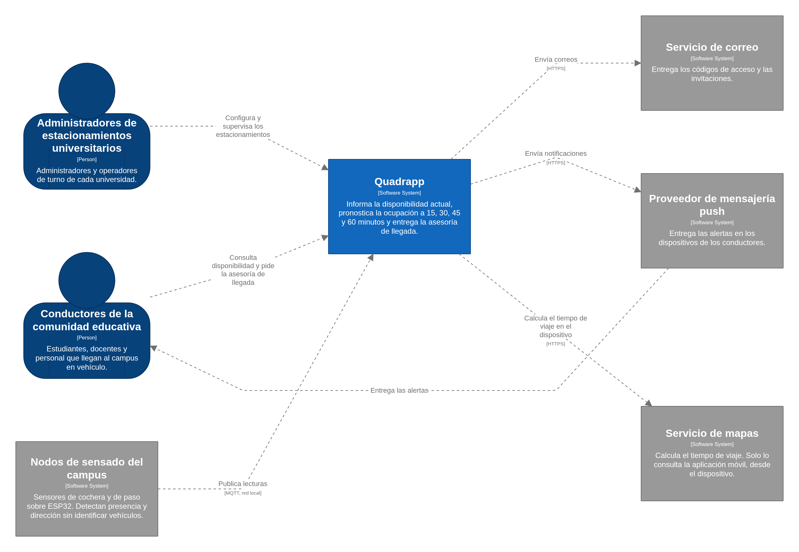

### 4.3.2. Software Architecture Context Level Diagrams

El Context Diagram muestra a Quadrapp como un único sistema y detalla cómo se relaciona con las personas y los sistemas externos que lo rodean, sin describir su estructura interna, que se desarrolla en el diagrama de contenedores.

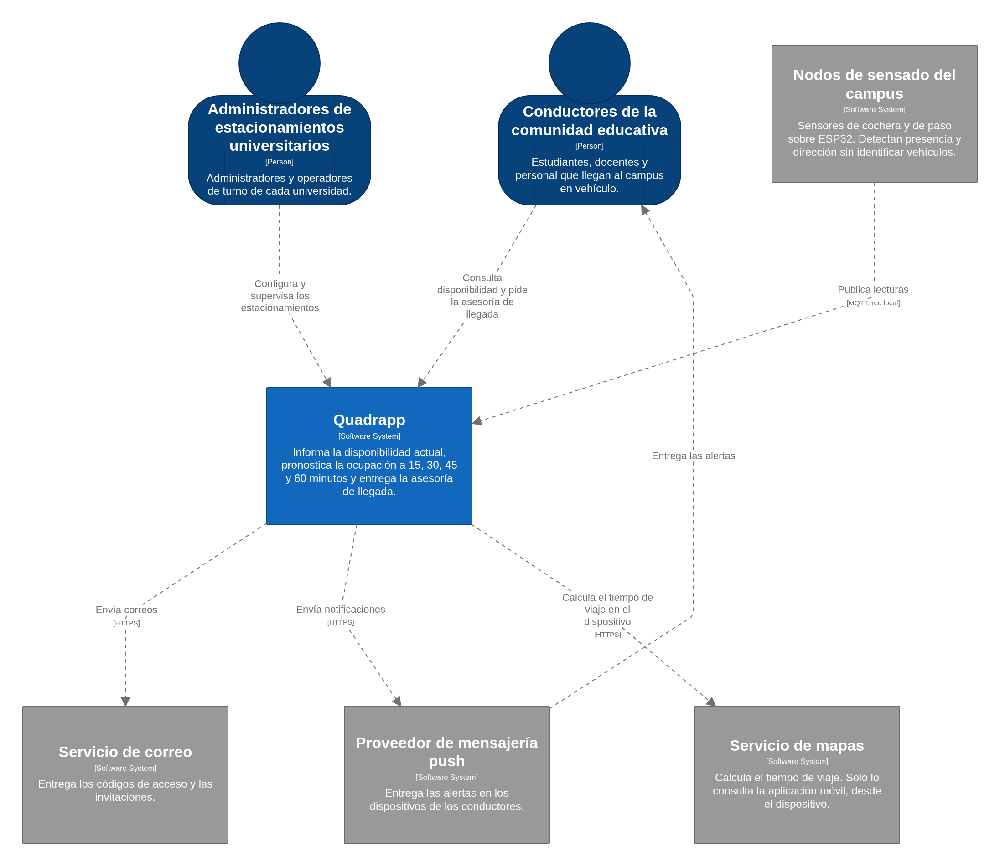

El conductor utiliza Quadrapp para consultar la disponibilidad, revisar los pronósticos y obtener la asesoría de llegada, y recibe las alertas de baja disponibilidad a través del proveedor de mensajería push. El administrador de estacionamientos lo emplea para configurar y supervisar la operación de su universidad. En ambos casos, el acceso se realiza con un código de un solo uso que Quadrapp envía mediante el servicio de correo.

Los nodos de sensado del campus publican las lecturas de los sensores de cochera y de paso en la red local; no se comunican directamente con los servicios de Quadrapp, sino a través del gateway del campus, que forma parte de la solución y se detalla en el diagrama de contenedores. El servicio de mapas solo lo consulta la aplicación móvil, desde el dispositivo, para calcular el tiempo estimado de llegada; Quadrapp recibe únicamente ese tiempo expresado en minutos, de acuerdo con CON-07 y la iteración 5b del ADD.

### 4.3.3. Software Architecture Container Level Diagrams

El Container Diagram descompone Quadrapp en los contenedores que lo conforman, de acuerdo con la decisión de monolito modular de la iteración 1 del ADD (DD-01):

- **Clientes:** la Landing Page (HTML5, CSS3 y JavaScript), la aplicación móvil del conductor (Flutter) y la consola web de operación de cada universidad (Vue con Vuetify, la biblioteca de Material Design para Vue), que es responsive para usarse también desde el teléfono durante el turno.
- **Quadrapp Backend:** un único contenedor Spring Boot con un módulo por bounded context (IAM, Parking Configuration, Parking Sensing, Occupancy, Prediction & Advisory, Analytics y Notifications). La seguridad la aplica Spring Security en el propio backend (DD-08) y un módulo de composición entrega las respuestas agregadas para la app y la consola. La app recibe además los cambios de disponibilidad en tiempo real mediante WebSocket.
- **Ingesta IoT:** los nodos de sensado publican sus lecturas en el gateway del campus, que las reenvía al broker MQTT de la nube por una conexión saliente cifrada con QoS 1 y las retiene en su búfer local mientras no hay conexión (Store-and-Forward). El campus no expone puertos de entrada. El módulo Parking Sensing es el único suscriptor del broker.
- **Persistencia:** una base de datos PostgreSQL con un esquema por módulo y sin claves foráneas entre esquemas (CON-02), y Redis para el read model de disponibilidad (iteración 4 del ADD).
- **Servicio del modelo de predicción:** un contenedor interno que infiere la ocupación esperada. Prediction & Advisory lo invoca con timeout y circuit breaker y, si no responde, aplica la heurística de respaldo (DD-05 y DD-07). No lo consumen los clientes, por lo que no forma parte de la API REST pública regida por CON-12.

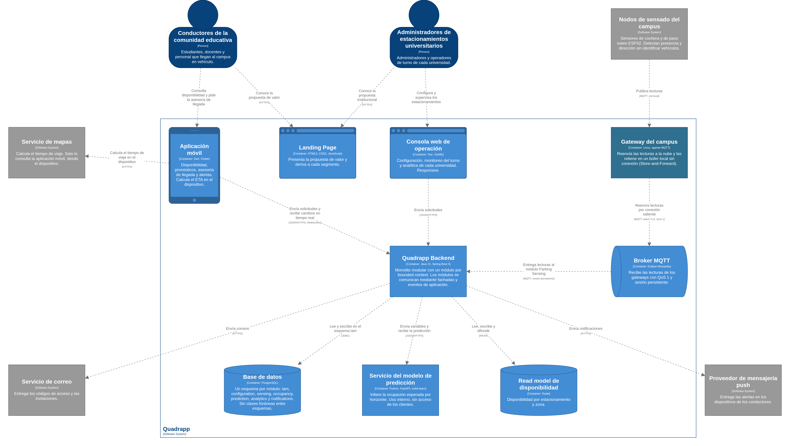

Dentro del backend, los módulos se comunican de dos formas, según las relaciones del Context Map. Las consultas se resuelven mediante la fachada que cada módulo expone como Open Host Service, por ejemplo, cuando Prediction & Advisory consulta la ocupación actual y el flujo a Occupancy. Los eventos publicados, como `ForecastGenerated` o `SaturationPredicted`, se emiten como eventos de aplicación de Spring y los módulos interesados los consumen después de que el emisor confirma su transacción. El detalle de cada módulo se presenta en los diagramas de componentes del capítulo V.

### 4.3.4. Software Architecture Deployment Diagrams

El Deployment Diagram representa dónde se ejecuta cada contenedor en producción:

- **Dispositivos de los usuarios:** la aplicación móvil se ejecuta en el teléfono del conductor (Android o iOS) y la consola, en el navegador del administrador.
- **Campus universitario:** los nodos de sensado (ESP32) y el equipo de borde con el gateway permanecen en la red local, que solo abre conexiones salientes hacia el broker MQTT de la nube.
- **Proveedor cloud:** la Landing Page se publica como sitio estático; el backend se despliega como un servicio web con réplicas sin estado detrás del balanceador del proveedor, lo que atiende la carga de QAS-04; el broker MQTT y el servicio del modelo de predicción se despliegan como contenedores propios, y PostgreSQL y Redis se usan como servicios gestionados.

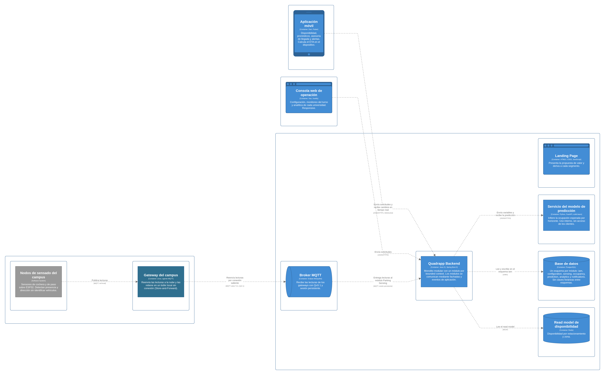

---

# Capítulo V: Tactical-Level Software Design

## 5.1. Bounded Context: IAM

El contexto IAM (Identity and Access Management) es el servicio transversal que decide quién puede ingresar a Quadrapp y con qué rol. Gestiona las instituciones (tenants), sus dominios de correo habilitados, las cuentas, las invitaciones, el acceso sin contraseña mediante código de un solo uso y las sesiones basadas en tokens. Su dominio es genérico (Security / Compliance) y no gestiona ocupación ni predicción. Sostiene los drivers FD-01, QAD-07, QAD-08, CON-08, CON-09 y CON-17, y las decisiones DD-08 y DD-09. Su contenido corresponde a las historias US01, US02, US03, US30 y US31, y a las historias técnicas TS01 y TS15.

### 5.1.1. Domain Layer
 
**Aggregates.**
 
| Aggregate | Raíz | Entidades y Value Objects | Responsabilidad e invariantes |
|---|---|---|---|
| Tenant | `Tenant` | `EmailDomain` (entidad), `TenantStatus` (ONBOARDING, ACTIVE) | Representa a una institución y sus dominios habilitados. Un dominio solo puede pertenecer a una institución (conflicto 409). Retirar un dominio impide nuevos registros pero conserva las cuentas ya verificadas. |
| UserAccount | `UserAccount` | `Email`, `Role` (DRIVER, PARKING_OPERATOR, PARKING_ADMIN), `Permission`, `TermsAcceptance` (versión y fecha) | Cuenta de un integrante de la institución. Guarda solo correo institucional, nombre visible, rol e institución; no almacena documento de identidad, código de estudiante ni placa (CON-07). Cada rol otorga un conjunto de permisos; los roles administrativos no admiten autorregistro. |
| Invitation | `Invitation` | `InvitationStatus` (PENDING, ACCEPTED, EXPIRED, REVOKED), `ExpirationPolicy` | Permite crear cuentas con rol PARKING_ADMIN o PARKING_OPERATOR, también fuera de los dominios habilitados. Tiene vigencia limitada y solo puede aceptarse una vez (US31). |
| OtpChallenge | `OtpChallenge` | `OneTimeCode` (guardado como hash), `AttemptCounter` | Desafío de acceso por código de un solo uso. Expira, agota intentos y se consume al usarse. |
| Session | `RefreshToken` | `TokenClaims` (usuario, institución, rol) | Sesión revocable. El cierre de sesión revoca el token de refresco asociado. |
| PlatformCredential | `PlatformCredential` | `CredentialStatus` | Credencial del equipo de plataforma, distinta de la cuenta de un usuario, que autoriza el alta de instituciones (TS15). |
 
**Domain Services.**
- `AccessPolicy`: decide si un correo puede recibir un código. Aplica, en orden, las reglas de cuenta existente, invitación vigente y dominio habilitado (US01, escenarios 1, 4 y 5).
- `AccessPolicy` también resuelve los permisos de cada rol (`permissionsOf`, `can`), con lo que "los permisos se asignan por rol".
- `OtpRequestThrottle`: determina si un correo superó el número de solicitudes permitidas en la ventana configurada (respuesta 429, CON-09).

**Roles y permisos.** Los roles corresponden a los dos segmentos objetivo: el conductor usa la aplicación móvil, y el administrador y el operador comparten la consola web de operación con permisos distintos.

| Rol | Usuarios | Permisos principales | Historias |
|---|---|---|---|
| `DRIVER` | Conductores de la comunidad educativa | Consultar estacionamientos, disponibilidad, pronósticos y asesoría de llegada; gestionar sus alertas y preferencias. | US04 a US15, US23, US24, US33, US36 |
| `PARKING_OPERATOR` | Operadores de puerta y supervisores de turno | Monitorear el turno, la salud de los dispositivos y las incidencias. No configura estacionamientos ni dispositivos, ni gestiona cuentas. | US20, US29 |
| `PARKING_ADMIN` | Administradores de estacionamientos | Los permisos del operador y, además, configurar estacionamientos, dispositivos y calendario; gestionar los dominios de correo; invitar administradores y operadores; consultar la analítica y definir reglas de alerta. | US16 a US22, US30 a US32, US34, US35 |

**Mensajes de entrada (canvas).** `SignInRequested`, `SessionValidated` y `RoleAssignmentRequested`, enviados desde la app móvil y el Admin Dashboard.
 
**Domain Events publicados.** `AccessGranted`, `AccessDenied`, `UserIdentityProvided`, `AuthorizedContextProvided`, `SessionRevoked`, `RoleAssigned`, `TenantProvisioned`, `EmailDomainEnabled`, `EmailDomainRetired`, `InvitationIssued`, `InvitationAccepted` y `UserAccountCreated`. `UserIdentityProvided` y `AuthorizedContextProvided` son el lenguaje publicado hacia los demás contextos: entregan usuario, institución, rol y permisos autorizados, y viajan como claims del token.
 
**Repositories (interfaces del dominio).** `TenantRepository`, `UserAccountRepository`, `InvitationRepository`, `OtpChallengeRepository`, `RefreshTokenRepository`, `PlatformCredentialRepository`.
 
**Reglas de negocio principales.**
1. Un correo recibe un código solo si su dominio está habilitado, si tiene una invitación vigente o si ya tiene una cuenta; en otro caso no se emite ningún código.
2. El código tiene vigencia corta, un número máximo de intentos y se almacena únicamente como hash.
3. El token de sesión incluye siempre usuario, institución, rol y permisos, que son los datos que usa la capa de seguridad del backend para el aislamiento entre instituciones (CON-08).
4. Los administradores y los operadores se crean solo por invitación; el primer administrador se crea en el alta inicial de la institución (CON-17). Ningún rol administrativo admite autorregistro.
5. La creación de una institución exige credenciales de plataforma; un token de usuario recibe 403.

### 5.1.2. Interface Layer
 
El contexto expone una API REST documentada con OpenAPI (CON-12). Todas las rutas, salvo el inicio de sesión, requieren token válido o credencial de plataforma. Los textos devueltos respetan el idioma de la solicitud (es_419 o en_US).
 
| Controller | Endpoint | Resultado | Origen |
|---|---|---|---|
| `AuthController` | `POST /api/v1/auth/otp` | `SignInRequested`: 202 si el correo es elegible; 429 si excede solicitudes | TS01 |
| `AuthController` | `POST /api/v1/auth/login` | `AccessGranted`: 200 con token de sesión y claims; `AccessDenied`: 401 si el código es inválido, vencido o agotó intentos | TS01 |
| `AuthController` | `POST /api/v1/auth/refresh` | 200 con nuevo token de acceso; 401 si el token de refresco venció | TS01 |
| `AuthController` | `POST /api/v1/auth/logout` | 204 y revocación del token de refresco | US02 (ruta propuesta) |
| `AuthController` | `GET /api/v1/auth/session` | `SessionValidated`: 200 con usuario, institución, rol y permisos vigentes; 401 si la sesión no es válida | Canvas (ruta propuesta) |
| `UserController` | `PUT /api/v1/users/{userId}/role` | `RoleAssignmentRequested`: 200 con el rol asignado; 403 si quien lo solicita no tiene el rol PARKING_ADMIN | Canvas, US31 (ruta propuesta) |
| `TenantController` | `POST /api/v1/tenants` | 201 con la institución y la invitación de su primer administrador; 403 sin credenciales de plataforma; 409 si el dominio ya existe | TS15 |
| `EmailDomainController` | `POST /api/v1/tenants/{tenantId}/domains` y `DELETE /api/v1/tenants/{tenantId}/domains/{domain}` | 201 o 204; 409 si el dominio pertenece a otra institución | US30 (rutas propuestas) |
| `InvitationController` | `POST /api/v1/invitations` | 201 con la invitación registrada y enviada | US31 (ruta propuesta) |
| `InvitationController` | `POST /api/v1/invitations/{invitationId}/accept` | 200 con la cuenta creada; 410 si la invitación venció | US31 (ruta propuesta) |
| `KeyController` | `GET /.well-known/jwks.json` | 200 con las claves públicas con las que la capa de seguridad valida los tokens | DD-08 (ruta propuesta) |
 
La capa de seguridad del backend (Spring Security) valida el token, el rol y la institución antes de que la solicitud llegue al controlador (DD-08), de modo que IAM no queda en el camino de cada consulta de los demás módulos.
 
### 5.1.3. Application Layer
 
La capa de aplicación contiene los casos de uso, que cargan los aggregates, invocan sus operaciones, guardan el resultado y publican los eventos. No contiene reglas de negocio.
 
| Command / Query handler | Caso de uso | Historias |
|---|---|---|
| `RequestOtpHandler` | Verifica la elegibilidad del correo, aplica el límite de solicitudes, genera el código, guarda su hash y solicita su envío | US01, TS01 |
| `AuthenticateWithOtpHandler` | Valida el código, consume el desafío, crea o recupera la cuenta, registra la aceptación de términos e emite los tokens; publica `AccessGranted` o `AccessDenied` | US01, TS01 |
| `RefreshSessionHandler` | Emite un nuevo token de acceso a partir de un token de refresco vigente | US03, TS01 |
| `CloseSessionHandler` | Revoca el token de refresco y registra el cierre | US02 |
| `ProvisionTenantHandler` | Crea la institución, registra sus dominios y emite la invitación de su primer administrador | TS15, QAS-08 |
| `AddEmailDomainHandler` y `RetireEmailDomainHandler` | Habilitan o retiran dominios de correo de una institución | US30 |
| `ValidateSessionHandler` | Verifica el token y devuelve usuario, institución, rol y permisos vigentes | Canvas |
| `AssignRoleHandler` | Cambia el rol de una cuenta de la misma institución, valida que quien lo solicita pueda hacerlo y revoca las sesiones previas | Canvas, US31 |
| `IssueInvitationHandler` y `AcceptInvitationHandler` | Emiten una invitación con rol y vigencia, y crean la cuenta al aceptarla | US31 |
 
**Puertos de salida (interfaces implementadas por infraestructura).** `EmailSender` (envío de códigos e invitaciones), `TokenIssuer` (emisión y firma de tokens), `CodeHasher`, `Clock`, `AuditLog` (registro de accesos rechazados, QAS-07) y `DomainEventPublisher`.
 
**Seguridad aplicada en esta capa.** El límite de solicitudes de código y la auditoría de intentos rechazados se ejecutan antes de cualquier consulta al dominio, para cumplir el 100 % de rechazos registrados en 1 s o menos (QAS-07).
 
### 5.1.4. Infrastructure Layer
 
| Componente | Implementa | Detalle |
|---|---|---|
| Repositorios persistentes | Interfaces `*Repository` del dominio | Base de datos propia del contexto (CON-02); el motor se define en la sección de implementación. Cada tabla incluye el identificador de institución para el aislamiento lógico (DD-09). |
| `JwtTokenIssuer` | `TokenIssuer` | Firma tokens de acceso y de refresco con los claims de usuario, institución, rol y permisos (`UserIdentityProvided`, `AuthorizedContextProvided`); publica las claves de verificación. |
| `EmailGatewayAdapter` | `EmailSender` | Capa anticorrupción hacia el servicio de correo externo; aísla el modelo del proveedor del dominio y permite reemplazarlo (CON-03, CON-06). Si el proveedor falla, no se afecta la consulta de disponibilidad ni la predicción. |
| `HashingCodeHasher` | `CodeHasher` | Calcula el hash del código de un solo uso y de los tokens guardados. |
| `PersistentAuditLog` | `AuditLog` | Registra los accesos denegados (`AccessDenied`: 401, 403 y 429) sin almacenar datos personales innecesarios. |
| `EventPublisherAdapter` | `DomainEventPublisher` | Publica los eventos de dominio y el contexto autorizado hacia los demás contextos que los necesiten. |
| Cifrado en tránsito | Transversal | Todas las comunicaciones usan TLS (QAS-07). |
 
### 5.1.6. Bounded Context Software Architecture Component Level Diagrams
 
El diagrama de componentes descompone el servicio IAM en sus componentes de interfaz, aplicación, dominio e infraestructura y muestra sus relaciones con la capa de seguridad del backend, el servicio de correo y los demás módulos, que reciben la identidad y el contexto autorizado. El IAM es propio de Quadrapp, por lo que no depende de un proveedor de identidad externo. Las flechas indican la dirección de la dependencia.
 
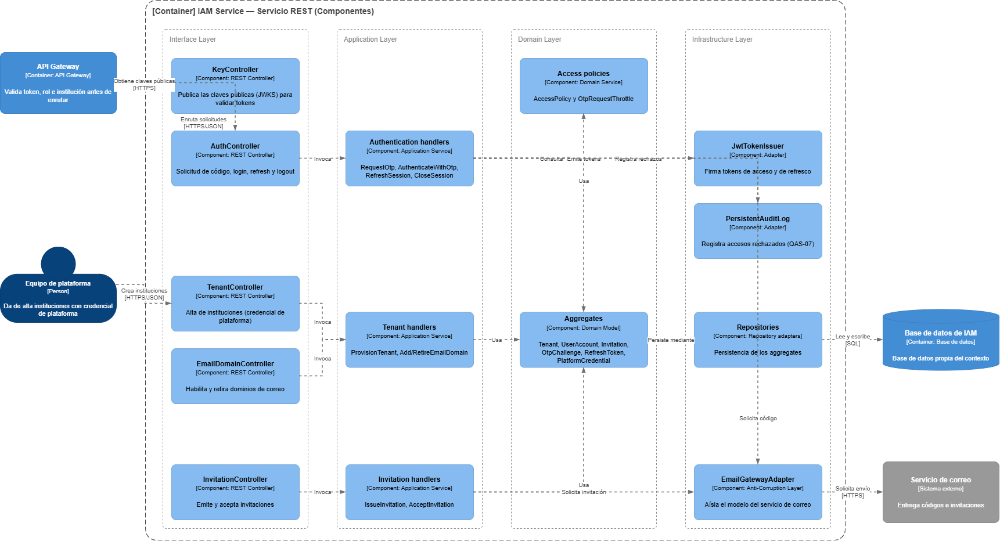
 
### 5.1.7. Bounded Context Software Architecture Code Level Diagrams
 
#### 5.1.7.1. Bounded Context Domain Layer Class Diagrams
 
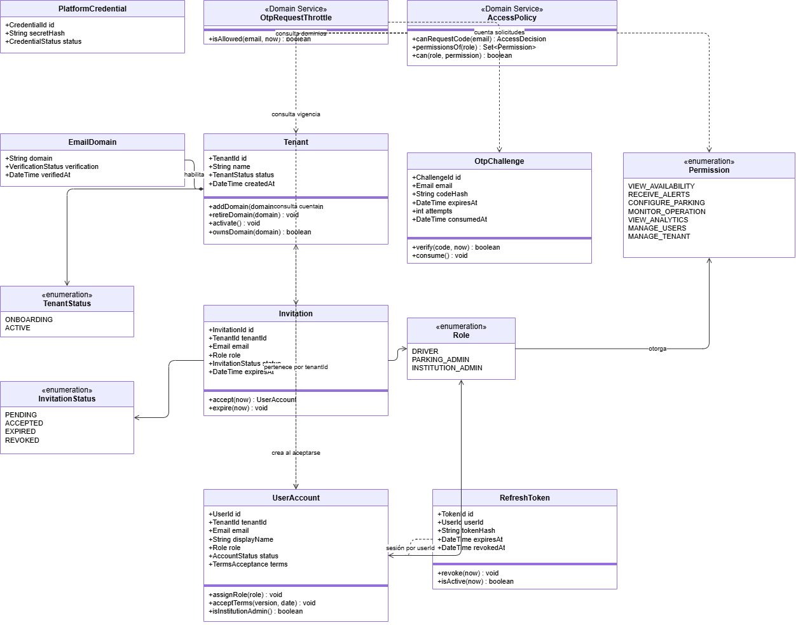
 
#### 5.1.7.2. Bounded Context Database Design Diagram
 
Cada tabla incluye la institución como identificador de aislamiento (DD-09). El contexto no mantiene claves foráneas hacia las bases de datos de otros contextos.
 
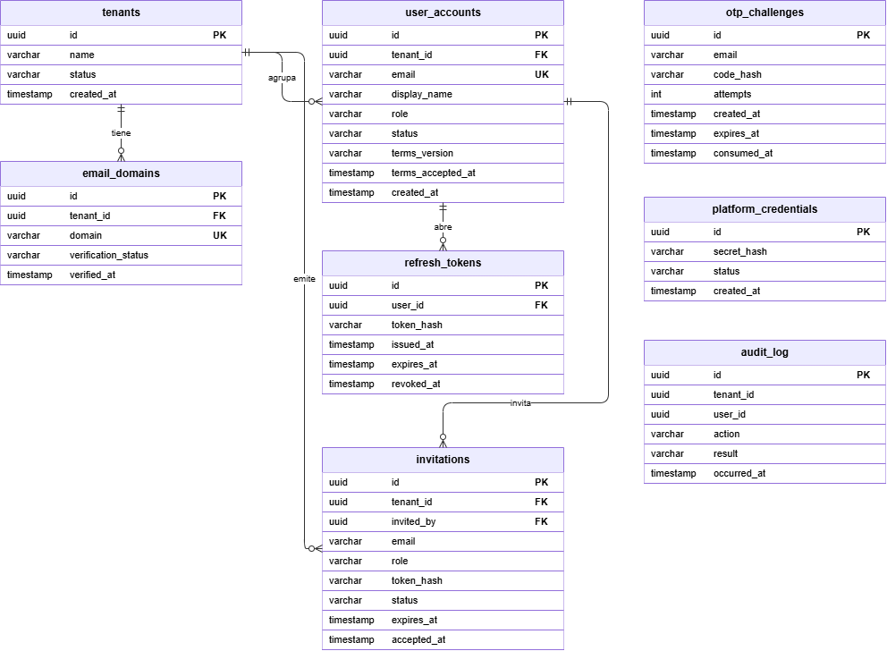
 
---
 

## 5.2. Bounded Context: Parking Configuration

El Bounded Context Parking Configuration es responsable de **describir la estructura física y operativa de los estacionamientos de cada institución**. Es el dueño de los datos maestros que los demás contextos usan como referencia: estacionamientos, zonas, espacios, accesos vehiculares, inventario de dispositivos y su asociación con espacios o accesos, parámetros de operación, calendario académico y eventos del campus.

Su propósito es publicar un layout versionado y estable, del que Parking Sensing obtiene la asociación entre sensores y espacios, Occupancy la capacidad de cada zona y la aplicación móvil la geometría del mapa. Además, ofrece a Prediction & Advisory el perfil del estacionamiento y el calendario que alimentan los pronósticos. No calcula ocupación, disponibilidad ni pronósticos, y no conoce el estado de los espacios.

Este Bounded Context soporta principalmente:

- US16 — Registrar los estacionamientos de la institución, con nombre único dentro de ella.
- US17 — Configurar zonas y espacios y publicar la distribución con una nueva versión.
- US18 y US32 — Registrar, asociar, reemplazar y dar de baja sensores y gateways.
- US19 — Configurar los accesos vehiculares y habilitarlos para el conteo de flujo solo con sensores direccionales.
- US35 — Registrar el calendario académico y los eventos del campus, y cancelarlos.
- US04 — Listar los estacionamientos de la institución con su layout publicado.
- TS15 — Recibir el alta de una institución (`TenantProvisioned`) para inicializar su calendario.

Las principales responsabilidades del Bounded Context Parking Configuration son:

- Registrar estacionamientos con nombre único por institución y con sus parámetros de operación: umbral de saturación, ventana de flujo, tiempo mínimo de detección y margen de precisión.
- Mantener las zonas, los espacios (con etiqueta y posición en el mapa) y los accesos vehiculares de cada estacionamiento.
- Publicar el layout como una versión inmutable y comunicarlo con `ParkingLayoutProvided`.
- Mantener el inventario de dispositivos y garantizar que un sensor se asocie a un solo espacio o acceso, y que un espacio tenga un solo sensor activo.
- Trasladar la asociación de un dispositivo averiado a su reemplazo sin alterar la identidad del espacio, y conservar el historial de asociaciones.
- Registrar el calendario académico y los eventos del campus, e informar su registro y su cancelación.
- Responder, mediante su fachada (Open Host Service), las consultas de perfil, layout, calendario y directorio de dispositivos que hacen los demás módulos.

### Class Dictionary

La siguiente tabla resume las clases e interfaces principales de Parking Configuration.

| Class / Interface | Layer | Purpose | Main attributes | Main operations |
|---|---|---|---|---|
| ParkingLot | Domain | Aggregate Root. Estacionamiento de una institución con sus zonas, espacios, accesos y parámetros de operación. | parkingLotId, tenantId, name, address, status, settings, layoutVersion, zones, accessPoints | register(), addZone(), addSpace(), configureAccessPoint(), enableFlowCounting(), updateSettings(), publishLayout(), capacity() |
| ParkingZone | Domain | Entity. Sector, nivel o bloque que agrupa espacios. | zoneId, name, spaces | addSpace(), hasSpaceLabeled(), capacity() |
| ParkingSpace | Domain | Entity. Lugar individual para estacionar. | spaceId, label, position | label() |
| AccessPoint | Domain | Entity. Entrada o salida vehicular con sensores de paso. | accessPointId, name, type, flowCountingEnabled | enableFlowCounting(), countsFlow() |
| Device | Domain | Aggregate Root. Sensor o gateway registrado en la institución. | deviceId, tenantId, parkingLotId, hardwareId, type, directional, reportInterval, status, currentAssignment, assignmentHistory | register(), assignTo(), releaseAssignment(), decommission(), isActive() |
| AcademicCalendar | Domain | Aggregate Root. Calendario académico y eventos del campus de una institución. | calendarId, tenantId, periods, campusEvents | initialize(), registerPeriod(), registerCampusEvent(), cancelCampusEvent(), eventsAround() |
| AcademicPeriod | Domain | Entity. Periodo de clases, exámenes o receso. | periodId, type, range | overlaps() |
| CampusEvent | Domain | Entity. Actividad de alta afluencia que afecta a un estacionamiento. | campusEventId, name, parkingLotId, window, impact, status | cancel(), isActiveDuring() |
| OperatingSettings | Domain | Value Object. Parámetros de operación del estacionamiento. | saturationThresholdPct, flowWindowMinutes, minimumDetectionSeconds, accuracyMarginPct | defaults(), isValid() |
| LayoutVersion | Domain | Value Object. Versión publicada del layout. | value | next(), isPublished() |
| LayoutSnapshot | Domain | Value Object. Copia inmutable del layout publicado. | parkingLotId, version, publishedAt, zoneCapacities, placements | — |
| SensorPlacement | Domain | Value Object. Ubicación de un sensor dentro del layout publicado. | deviceId, hardwareId, target | — |
| AssignmentTarget | Domain | Value Object. Espacio o acceso al que se asocia un dispositivo. | type, targetId | isSpace() |
| DeviceAssignment | Domain | Value Object. Asociación de un dispositivo con su vigencia. | target, assignedAt, releasedAt | isActive(), releasedAt() |
| ParkingLotName, SpaceLabel, SpacePosition, HardwareId, ReportInterval, DateRange, TimeWindow | Domain | Value Objects con su validación propia. | value o rango | value(), isValid(), overlaps() |
| ParkingLotStatus, AccessPointType, DeviceType, DeviceStatus, TargetType, AcademicPeriodType, DemandImpact, CampusEventStatus | Domain | Enumeraciones del contexto. | — | — |
| DeviceAssignmentService | Domain | Domain Service. Aplica las reglas de asociación que involucran a más de un dispositivo. | — | assign(), coversDirection() |
| DeviceReplacementService | Domain | Domain Service. Traslada la asociación de un dispositivo a su reemplazo. | — | replace() |
| LayoutPublicationService | Domain | Domain Service. Arma la versión publicada del layout con las asociaciones vigentes. | — | publish() |
| ParkingLotRepository, DeviceRepository, AcademicCalendarRepository | Domain | Repository. Abstracciones de persistencia de cada agregado. | — | save(), findById(), findByTenant() |
| ParkingLayoutProvided, DeviceRegistered, SensorAssigned, DeviceReplaced, DeviceDecommissioned, CampusEventProvided, CampusEventCancelled | Domain | Domain Events publicados (Published Language). | Ver 5.2.1 | — |
| *Command y *CommandHandler | Application | Casos de uso de escritura. | Dependencies | handle() |
| *Query y *QueryHandler | Application | Casos de uso de lectura. | Dependencies | handle() |
| TenantProvisionedEventHandler | Application | Event Handler. Inicializa el calendario de una institución nueva. | Dependencies | handle() |
| ConfigurationEventPublisher | Application | Puerto de salida para publicar eventos. | — | publish() |
| ParkingLotController, LayoutController, AccessPointController, DeviceInventoryController, AcademicCalendarController | Interface | Controllers REST de la consola de operación y de la aplicación. | Handler dependencies | Ver 5.2.2 |
| ParkingConfigurationFacade | Interface | Open Host Service en proceso para los demás módulos. | Query Handler dependencies | profileOf(), activeLots(), calendarEventsAround(), layoutOf(), lotsOf(), resolveDevice() |
| TenantProvisionedListener | Interface | Consumer del evento `TenantProvisioned` de IAM. | Event Handler dependency | on() |
| *RepositoryAdapter | Infrastructure | Implementan los repositorios sobre el esquema `configuration`. | Persistence dependency | save(), find…() |
| ConfigurationEventPublisherAdapter | Infrastructure | Publica los eventos de dominio tras confirmar la transacción. | Messaging dependency | publish() |

### 5.2.1. Domain Layer

La Domain Layer contiene los conceptos y las reglas que describen un estacionamiento y su equipamiento. No depende de HTTP, de la base de datos ni de Spring. Los tres agregados salen del paso 9 del EventStorming (sección 4.2.1): `ParkingLot`, `Device` y `AcademicCalendar`. Se separaron porque cambian por razones y con frecuencias distintas: el layout cambia al reorganizar el estacionamiento, el inventario cambia cada vez que se instala o se reemplaza un sensor, y el calendario cambia cada ciclo.

**Aggregate 1: ParkingLot**

|Nombre|Categoría|Descripción|
|-|-|-|
|ParkingLot|Aggregate Root|Estacionamiento de una institución. Agrupa sus zonas, espacios y accesos vehiculares, y define sus parámetros de operación y la versión del layout publicado.|

Attributes

|Nombre|Tipo de dato|Visibilidad|Descripción|
|-|-|-|-|
|parkingLotId|UUID|Private|Identificador único del estacionamiento.|
|tenantId|UUID|Private|Referencia externa a la institución propietaria (IAM).|
|name|ParkingLotName|Private|Nombre del estacionamiento; único dentro de la institución.|
|address|String|Private|Ubicación de referencia dentro del campus.|
|status|ParkingLotStatus|Private|DRAFT mientras no tiene layout publicado; PUBLISHED después de la primera publicación.|
|settings|OperatingSettings|Private|Umbral de saturación, ventana de flujo, tiempo mínimo de detección y margen de precisión.|
|layoutVersion|LayoutVersion|Private|Última versión publicada del layout; 0 si aún no se publicó.|
|zones|`List<ParkingZone>`|Private|Zonas del estacionamiento con sus espacios.|
|accessPoints|`List<AccessPoint>`|Private|Accesos vehiculares del estacionamiento.|
|domainEvents|`List<DomainEvent>`|Private|Eventos de dominio pendientes de publicación.|

Methods

|Nombre|Tipo de retorno|Visibilidad|Descripción|
|-|-|-|-|
|register(tenantId: UUID, name: ParkingLotName, address: String, settings: OperatingSettings)|ParkingLot|Public (static)|Crea el estacionamiento en estado DRAFT con la versión 0.|
|addZone(name: String)|ParkingZone|Public|Agrega una zona; el nombre no puede repetirse dentro del estacionamiento.|
|addSpace(zoneId: UUID, label: SpaceLabel, position: SpacePosition)|ParkingSpace|Public|Registra un espacio en la zona; rechaza una etiqueta repetida en la misma zona (US17, escenario 3).|
|configureAccessPoint(name: String, type: AccessPointType)|AccessPoint|Public|Registra un acceso vehicular asociado al estacionamiento (US19, escenario 1).|
|enableFlowCounting(accessPointId: UUID, directional: Boolean)|Void|Public|Habilita el acceso para el conteo de flujo solo si sus sensores distinguen la dirección (US19, escenarios 2 y 3).|
|updateSettings(settings: OperatingSettings)|Void|Public|Reemplaza los parámetros de operación validados.|
|publishLayout(placements: `List<SensorPlacement>`, now: Instant)|LayoutSnapshot|Public|Exige al menos un espacio, incrementa la versión, pasa a PUBLISHED y registra `ParkingLayoutProvided` (US17, escenario 4).|
|capacity()|Integer|Public|Cantidad total de espacios del estacionamiento.|
|belongsTo(tenantId: UUID)|Boolean|Public|Indica si el estacionamiento pertenece a la institución dada.|
|pullDomainEvents()|`List<DomainEvent>`|Public|Entrega y vacía los eventos pendientes.|

**Entities del agregado ParkingLot**

|Nombre|Categoría|Atributos|Métodos|Descripción|
|-|-|-|-|-|
|ParkingZone|Entity|zoneId: UUID, name: String, spaces: `List<ParkingSpace>`|addSpace(label, position): ParkingSpace; hasSpaceLabeled(label): Boolean; capacity(): Integer|Sector, nivel o bloque. Su capacidad es la cantidad de espacios que agrupa.|
|ParkingSpace|Entity|spaceId: UUID, label: SpaceLabel, position: SpacePosition|label(): SpaceLabel|Lugar individual. Su identidad (`spaceId`) no cambia aunque se reemplace el sensor que lo vigila.|
|AccessPoint|Entity|accessPointId: UUID, name: String, type: AccessPointType, flowCountingEnabled: Boolean|enableFlowCounting(directional): Void; countsFlow(): Boolean|Entrada o salida vehicular. Solo alimenta la velocidad de flujo cuando está habilitado.|

**Value Objects y enumeraciones del agregado ParkingLot**

|Nombre|Categoría|Atributos|Descripción|
|-|-|-|-|
|ParkingLotName|Value Object|value: String|Entre 3 y 80 caracteres, sin espacios al inicio ni al final.|
|SpaceLabel|Value Object|value: String|Etiqueta visible del espacio (por ejemplo, "A01"), de 1 a 10 caracteres.|
|SpacePosition|Value Object|x: Decimal, y: Decimal|Posición del espacio en el plano del estacionamiento que dibuja la aplicación.|
|OperatingSettings|Value Object|saturationThresholdPct: Integer, flowWindowMinutes: Integer, minimumDetectionSeconds: Integer, accuracyMarginPct: Integer|Umbral de saturación entre 50 y 100 %; ventana de flujo entre 5 y 60 min; tiempo mínimo de detección entre 3 y 60 s; margen de precisión entre 1 y 30 puntos. `defaults()` entrega 90 %, 15 min, 10 s y 10 puntos.|
|LayoutVersion|Value Object|value: Integer|Número de versión. `next()` devuelve la siguiente; 0 significa que no hay layout publicado.|
|LayoutSnapshot|Value Object|parkingLotId, version, publishedAt, zoneCapacities: `Map<UUID, Integer>`, placements: `List<SensorPlacement>`|Copia inmutable del layout publicado. Se guarda para que cada versión se pueda volver a consultar.|
|SensorPlacement|Value Object|deviceId: UUID, hardwareId: HardwareId, target: AssignmentTarget|Asociación vigente de un sensor al momento de publicar.|
|ParkingLotStatus|Enumeration|DRAFT, PUBLISHED|Estado del estacionamiento.|
|AccessPointType|Enumeration|ENTRY, EXIT, ENTRY_EXIT|Sentido del acceso vehicular.|

**Aggregate 2: Device**

|Nombre|Categoría|Descripción|
|-|-|-|
|Device|Aggregate Root|Sensor de cochera, sensor de paso o gateway registrado en el inventario de la institución. Conserva su asociación vigente y el historial de asociaciones anteriores.|

Attributes

|Nombre|Tipo de dato|Visibilidad|Descripción|
|-|-|-|-|
|deviceId|UUID|Private|Identificador único del dispositivo en Quadrapp.|
|tenantId|UUID|Private|Referencia externa a la institución (IAM).|
|parkingLotId|UUID|Private|Estacionamiento donde está instalado.|
|hardwareId|HardwareId|Private|Identificador técnico que el dispositivo informa en sus lecturas (por ejemplo, `sensor-0342`).|
|type|DeviceType|Private|SPACE_SENSOR, PASS_SENSOR o GATEWAY.|
|directional|Boolean|Private|Indica si un sensor de paso distingue la entrada de la salida.|
|reportInterval|ReportInterval|Private|Tiempo máximo esperado entre dos reportes del dispositivo (US32, escenario 1).|
|status|DeviceStatus|Private|REGISTERED, ASSIGNED o DECOMMISSIONED.|
|currentAssignment|DeviceAssignment?|Private|Asociación vigente con un espacio o un acceso, si existe.|
|assignmentHistory|`List<DeviceAssignment>`|Private|Asociaciones anteriores, que se conservan al reasociar o dar de baja (US18, escenario 3).|
|registeredAt|Instant|Private|Momento del registro.|
|domainEvents|`List<DomainEvent>`|Private|Eventos de dominio pendientes de publicación.|

Methods

|Nombre|Tipo de retorno|Visibilidad|Descripción|
|-|-|-|-|
|register(tenantId, parkingLotId, hardwareId, type, directional, reportInterval, now)|Device|Public (static)|Crea el dispositivo en estado REGISTERED y registra `DeviceRegistered`.|
|assignTo(target: AssignmentTarget, now: Instant)|Void|Public|Asocia el dispositivo a un espacio o acceso, pasa a ASSIGNED y registra `SensorAssigned`. Rechaza un dispositivo dado de baja.|
|releaseAssignment(now: Instant)|AssignmentTarget?|Public|Cierra la asociación vigente, la mueve al historial y devuelve su destino.|
|decommission(now: Instant)|Void|Public|Cierra la asociación vigente, pasa a DECOMMISSIONED y registra `DeviceDecommissioned` con el destino que tenía.|
|isActive()|Boolean|Public|Indica si el dispositivo no fue dado de baja.|
|pullDomainEvents()|`List<DomainEvent>`|Public|Entrega y vacía los eventos pendientes.|

**Value Objects y enumeraciones del agregado Device**

|Nombre|Categoría|Atributos|Descripción|
|-|-|-|-|
|HardwareId|Value Object|value: String|Identificador técnico de 3 a 40 caracteres, único en Quadrapp.|
|ReportInterval|Value Object|seconds: Integer|Entre 10 y 3600 segundos.|
|AssignmentTarget|Value Object|type: TargetType, targetId: UUID|Espacio o acceso vehicular asociado.|
|DeviceAssignment|Value Object|target: AssignmentTarget, assignedAt: Instant, releasedAt: Instant?|Asociación con su vigencia. Está activa mientras `releasedAt` sea nulo.|
|DeviceType|Enumeration|SPACE_SENSOR, PASS_SENSOR, GATEWAY|Tipo de dispositivo.|
|DeviceStatus|Enumeration|REGISTERED, ASSIGNED, DECOMMISSIONED|Estado en el inventario.|
|TargetType|Enumeration|SPACE, ACCESS_POINT|Tipo de destino de la asociación.|

**Aggregate 3: AcademicCalendar**

|Nombre|Categoría|Descripción|
|-|-|-|
|AcademicCalendar|Aggregate Root|Calendario de una institución: periodos de clases, exámenes y receso, y eventos del campus que afectan a un estacionamiento. Hay uno por institución y se crea al recibir `TenantProvisioned`.|

Attributes

|Nombre|Tipo de dato|Visibilidad|Descripción|
|-|-|-|-|
|calendarId|UUID|Private|Identificador del calendario.|
|tenantId|UUID|Private|Institución a la que pertenece (IAM).|
|periods|`List<AcademicPeriod>`|Private|Periodos académicos registrados.|
|campusEvents|`List<CampusEvent>`|Private|Eventos del campus programados o cancelados.|
|domainEvents|`List<DomainEvent>`|Private|Eventos de dominio pendientes de publicación.|

Methods

|Nombre|Tipo de retorno|Visibilidad|Descripción|
|-|-|-|-|
|initialize(tenantId: UUID)|AcademicCalendar|Public (static)|Crea el calendario vacío de una institución.|
|registerPeriod(type: AcademicPeriodType, range: DateRange)|AcademicPeriod|Public|Registra un periodo; rechaza los que se superponen con otro (US35, escenario 1).|
|registerCampusEvent(name: String, parkingLotId: UUID, window: TimeWindow, impact: DemandImpact)|CampusEvent|Public|Registra un evento del campus y `CampusEventProvided` (US35, escenario 2).|
|cancelCampusEvent(campusEventId: UUID, now: Instant)|Void|Public|Cancela un evento programado y registra `CampusEventCancelled`, con el que Prediction & Advisory regenera las franjas afectadas (US35, escenario 3).|
|eventsAround(from: Instant, to: Instant)|`List<CampusEvent>`|Public|Eventos programados que se superponen con el intervalo.|
|periodOn(date: LocalDate)|AcademicPeriod?|Public|Periodo vigente en una fecha.|
|pullDomainEvents()|`List<DomainEvent>`|Public|Entrega y vacía los eventos pendientes.|

**Entities, Value Objects y enumeraciones del agregado AcademicCalendar**

|Nombre|Categoría|Atributos|Descripción|
|-|-|-|-|
|AcademicPeriod|Entity|periodId: UUID, type: AcademicPeriodType, range: DateRange|Periodo académico. `overlaps(other)` indica si se superpone con otro rango.|
|CampusEvent|Entity|campusEventId: UUID, name: String, parkingLotId: UUID, window: TimeWindow, impact: DemandImpact, status: CampusEventStatus, cancelledAt: Instant?|Evento de alta afluencia. `cancel(now)` lo cancela una sola vez; `isActiveDuring(from, to)` excluye los cancelados.|
|DateRange|Value Object|startDate: LocalDate, endDate: LocalDate|Rango de fechas con `endDate` mayor o igual que `startDate`.|
|TimeWindow|Value Object|startAt: Instant, endAt: Instant|Franja horaria con `endAt` posterior a `startAt`.|
|AcademicPeriodType|Enumeration|CLASSES, EXAMS, BREAK|Tipo de periodo.|
|DemandImpact|Enumeration|MODERATE, HIGH|Afluencia esperada del evento; es una variable del modelo de predicción.|
|CampusEventStatus|Enumeration|SCHEDULED, CANCELLED|Estado del evento.|

**Domain Services**

|Nombre|Categoría|Métodos|Descripción|
|-|-|-|-|
|DeviceAssignmentService|Domain Service|assign(device: Device, target: AssignmentTarget, currentOccupant: Device?, now: Instant): Void; coversDirection(passSensors: `List<Device>`): Boolean|Verifica que el tipo del dispositivo coincida con el destino (SPACE_SENSOR con un espacio y PASS_SENSOR con un acceso; un GATEWAY no se asocia), que el sensor no tenga otra asociación vigente y que el espacio no tenga otro sensor activo (US18, escenario 2). `coversDirection` indica si los sensores de un acceso distinguen la dirección.|
|DeviceReplacementService|Domain Service|replace(current: Device, replacement: Device, now: Instant): Void|Exige que ambos sean del mismo tipo y que el reemplazo no tenga asociación. Da de baja el dispositivo actual, asocia el reemplazo al mismo destino y registra `DeviceReplaced` (US32, escenario 2). Es la única operación que modifica dos agregados en una transacción, porque el espacio no puede quedar sin sensor entre ambos pasos.|
|LayoutPublicationService|Domain Service|publish(lot: ParkingLot, devices: `List<Device>`, now: Instant): LayoutSnapshot|Reúne las asociaciones vigentes de los dispositivos del estacionamiento y llama a `ParkingLot.publishLayout`.|

**Repositories (interfaces del dominio)**

|Nombre|Operaciones|Descripción|
|-|-|-|
|ParkingLotRepository|save(lot), findById(tenantId, parkingLotId), existsByName(tenantId, name), findByTenant(tenantId), findPublished()|Persistencia de `ParkingLot`.|
|DeviceRepository|save(device), findById(tenantId, deviceId), findByHardwareId(hardwareId), findActiveByTarget(target), findByParkingLot(tenantId, parkingLotId)|Persistencia de `Device`.|
|AcademicCalendarRepository|save(calendar), findByTenant(tenantId)|Persistencia de `AcademicCalendar`.|

**Domain Events publicados (Published Language)**

|Evento|Atributos|Consumidores|
|-|-|-|
|ParkingLayoutProvided|parkingLotId, tenantId, layoutVersion, zoneCapacities, placements, minimumDetectionSeconds, publishedAt|Parking Sensing (asociaciones y tiempo mínimo) y Occupancy (capacidad por zona).|
|DeviceRegistered|deviceId, tenantId, parkingLotId, hardwareId, type, reportIntervalSeconds|Parking Sensing, que empieza a vigilar el intervalo de reporte.|
|SensorAssigned|deviceId, tenantId, target, assignedAt|Parking Sensing.|
|DeviceReplaced|previousDeviceId, replacementDeviceId, tenantId, target, replacedAt|Parking Sensing.|
|DeviceDecommissioned|deviceId, tenantId, previousTarget, decommissionedAt|Parking Sensing, que deja de aceptar sus lecturas.|
|CampusEventProvided|campusEventId, tenantId, parkingLotId, startAt, endAt, impact|Prediction & Advisory.|
|CampusEventCancelled|campusEventId, tenantId, parkingLotId, startAt, endAt|Prediction & Advisory, que regenera los pronósticos de la franja.|

`ParkingLayoutProvided` y `CampusEventProvided` son los nombres que fija la tabla de eventos de la sección 4.2.1. Ningún evento incluye etiquetas de espacios ni datos de personas.

### Reglas de negocio

1. Todo estacionamiento, dispositivo y calendario pertenece a una institución, y toda operación se hace dentro de la institución del usuario autenticado (CON-08).
2. El nombre de un estacionamiento es único dentro de la institución (US16, escenario 3).
3. La etiqueta de un espacio es única dentro de su zona (US17, escenario 3).
4. Cada publicación del layout crea una nueva versión inmutable; la versión publicada no se modifica (US17, escenario 4).
5. Un layout sin espacios no se publica.
6. Un sensor se asocia a un solo espacio o acceso, y un espacio tiene a lo sumo un sensor activo (US18, escenario 2). Un acceso puede tener varios sensores de paso.
7. Un acceso solo se habilita para el conteo de flujo si tiene al menos un sensor de paso y todos sus sensores distinguen la dirección (US19).
8. Al reemplazar un dispositivo, el espacio conserva su identidad y su asociación pasa al nuevo dispositivo (US32, escenario 2).
9. Un dispositivo dado de baja no se vuelve a asociar, y sus asociaciones anteriores se conservan en el historial (US18, escenario 3; US32, escenario 3).
10. Las asociaciones y los reemplazos rigen de inmediato, sin esperar una nueva publicación; los cambios de zonas y espacios sí requieren publicar.
11. Los periodos académicos de una institución no se superponen.
12. Un evento cancelado no se vuelve a programar; para reprogramarlo se registra uno nuevo.
13. Los parámetros de operación respetan los rangos de `OperatingSettings`.
14. El contexto no calcula ocupación, disponibilidad ni pronósticos, y no recibe lecturas de sensores.

### 5.2.2. Interface Layer

La Interface Layer expone las capacidades del contexto a la consola web de operación, a la aplicación móvil y a los demás módulos. Recibe solicitudes, valida su forma, las transforma en Commands o Queries, delega en la Application Layer y representa el resultado. La capa de seguridad del backend (Spring Security, DD-08) valida el token antes de que la solicitud llegue al controlador: las operaciones de escritura exigen el rol de administrador (`PARKING_ADMIN`), y las consultas admiten también al operador (`PARKING_OPERATOR`) y, para la lista de estacionamientos y el layout, al conductor (`DRIVER`). `tenantId` se toma siempre del token, nunca de un parámetro.

**Controllers REST**

|Controller|Endpoint|Resultado|Origen|
|-|-|-|-|
|ParkingLotController|`POST /api/v1/parking-lots`|201 con el estacionamiento creado; 400 si faltan datos; 409 si el nombre ya existe en la institución|US16|
|ParkingLotController|`GET /api/v1/parking-lots`|200 con los estacionamientos de la institución, su estado y su versión de layout; lista vacía si no hay ninguno|US04|
|ParkingLotController|`PUT /api/v1/parking-lots/{lotId}/settings`|200 con los parámetros actualizados; 400 si un valor está fuera de rango|US16 (ruta propuesta)|
|LayoutController|`POST /api/v1/parking-lots/{lotId}/zones`|201 con la zona creada; 409 si el nombre se repite|US17, escenario 1|
|LayoutController|`POST /api/v1/parking-lots/{lotId}/zones/{zoneId}/spaces`|201 con el espacio; 409 si la etiqueta ya existe en la zona|US17, escenarios 2 y 3|
|LayoutController|`POST /api/v1/parking-lots/{lotId}/layout/publications`|201 con la nueva versión; 422 si el layout no tiene espacios|US17, escenario 4|
|LayoutController|`GET /api/v1/parking-lots/{lotId}/layout`|200 con zonas, espacios, accesos y versión, con el encabezado `ETag`; 304 si la versión de la aplicación sigue vigente|US04, TS13|
|AccessPointController|`POST /api/v1/parking-lots/{lotId}/access-points`|201 con el acceso registrado|US19, escenario 1|
|AccessPointController|`PUT /api/v1/parking-lots/{lotId}/access-points/{accessPointId}/flow-counting`|200 con el acceso habilitado; 422 si sus sensores no distinguen la dirección|US19, escenarios 2 y 3|
|DeviceInventoryController|`POST /api/v1/devices`|201 con el dispositivo registrado; 409 si el identificador técnico ya existe|US32, escenario 1|
|DeviceInventoryController|`GET /api/v1/devices?parkingLotId={lotId}`|200 con el inventario y la asociación vigente de cada dispositivo|US32|
|DeviceInventoryController|`PUT /api/v1/devices/{deviceId}/assignment`|200 con la asociación; 409 si el sensor o el espacio ya tienen una asociación vigente; 422 si el tipo no coincide con el destino|US18, escenarios 1 y 2|
|DeviceInventoryController|`POST /api/v1/devices/{deviceId}/replacement`|200 con la asociación trasladada al dispositivo indicado en `replacementDeviceId`|US32, escenario 2|
|DeviceInventoryController|`POST /api/v1/devices/{deviceId}/decommission`|200; el dispositivo deja de aceptar lecturas y su espacio queda sin sensor operativo|US18, escenario 3; US32, escenario 3|
|AcademicCalendarController|`POST /api/v1/academic-calendar/periods`|201 con el periodo; 409 si se superpone con otro|US35, escenario 1|
|AcademicCalendarController|`POST /api/v1/campus-events`|201 con el evento programado|US35, escenario 2|
|AcademicCalendarController|`POST /api/v1/campus-events/{campusEventId}/cancellation`|200 con el evento cancelado; 409 si ya estaba cancelado|US35, escenario 3|
|AcademicCalendarController|`GET /api/v1/campus-events?from={from}&to={to}`|200 con los eventos del intervalo|US35|

Respuesta de `GET /api/v1/parking-lots/{lotId}/layout`:

```json
{
  "lotId": "5b0e…",
  "layoutVersion": 4,
  "publishedAt": "2026-10-05T14:02:11Z",
  "zones": [
    { "zoneId": "a1f3…", "name": "Sótano 1", "capacity": 42,
      "spaces": [ { "spaceId": "c7d2…", "label": "A01", "x": 12.5, "y": 4.0 } ] }
  ],
  "accessPoints": [ { "accessPointId": "e9b4…", "name": "Puerta Norte", "type": "ENTRY_EXIT", "flowCountingEnabled": true } ]
}
```

La respuesta no incluye el estado de los espacios: el layout (Parking Configuration) y el estado (Occupancy) se entregan por separado, y la aplicación los superpone. Así, una actualización de estado no arrastra la geometría completa.

**Open Host Service: ParkingConfigurationFacade**

|Nombre|Categoría|Descripción|
|-|-|-|
|ParkingConfigurationFacade|Facade (Open Host Service)|Punto de entrada en proceso para los demás módulos. Devuelve vistas de solo lectura y nunca expone los agregados.|

Methods

|Nombre|Tipo de retorno|Visibilidad|Consumidor|Descripción|
|-|-|-|-|-|
|profileOf(tenantId: UUID, parkingLotId: UUID)|ParkingLotProfileView|Public|Prediction & Advisory, Analytics|Umbral de saturación, ventana de flujo y margen de precisión.|
|activeLots()|`List<ActiveLotView>`|Public|Prediction & Advisory|Estacionamientos con layout publicado, con su institución.|
|calendarEventsAround(tenantId: UUID, from: Instant, to: Instant)|`List<CalendarEventView>`|Public|Prediction & Advisory|Periodos académicos y eventos programados del intervalo.|
|lotsOf(tenantId: UUID)|`List<ParkingLotSummaryView>`|Public|Módulo de composición|Estacionamientos para la pantalla de inicio y la consola.|
|layoutOf(tenantId: UUID, parkingLotId: UUID)|LayoutView|Public|Módulo de composición y Occupancy|Layout publicado vigente, con sus zonas, espacios, asociaciones y accesos. Occupancy lo lee al recibir `ParkingLayoutProvided`.|
|resolveDevice(hardwareId: String)|DeviceDirectoryEntry?|Public|Parking Sensing|Dispositivo, institución, estacionamiento, estado, destino vigente y tiempo mínimo de detección. Responde vacío si el identificador no está registrado.|

**Event Consumer**

|Nombre|Categoría|Evento|Descripción|
|-|-|-|-|
|TenantProvisionedListener|Consumer (`@TransactionalEventListener`)|`TenantProvisioned` (IAM)|Envía `InitializeTenantConfigurationCommand` para crear el calendario de la institución nueva (TS15, QAS-08).|

### 5.2.3. Application Layer

La Application Layer coordina los casos de uso: carga los agregados, invoca sus operaciones o los Domain Services, guarda el resultado y publica los eventos. No contiene reglas de negocio. Sus capacidades son registrar y configurar estacionamientos, publicar el layout, gestionar el inventario de dispositivos, mantener el calendario y responder las consultas de los demás módulos.

**Commands y Command Handlers**

|Command|Atributos|Command Handler|Dependencias|Historias|
|-|-|-|-|-|
|RegisterParkingLotCommand|tenantId, name, address, settings|RegisterParkingLotCommandHandler|ParkingLotRepository, ConfigurationEventPublisher|US16|
|UpdateOperatingSettingsCommand|tenantId, parkingLotId, settings|UpdateOperatingSettingsCommandHandler|ParkingLotRepository|US16|
|AddZoneCommand|tenantId, parkingLotId, name|AddZoneCommandHandler|ParkingLotRepository|US17|
|AddSpaceCommand|tenantId, parkingLotId, zoneId, label, position|AddSpaceCommandHandler|ParkingLotRepository|US17|
|PublishLayoutCommand|tenantId, parkingLotId|PublishLayoutCommandHandler|ParkingLotRepository, DeviceRepository, LayoutPublicationService, ConfigurationEventPublisher, Clock|US17|
|ConfigureAccessPointCommand|tenantId, parkingLotId, name, type|ConfigureAccessPointCommandHandler|ParkingLotRepository|US19|
|EnableFlowCountingCommand|tenantId, parkingLotId, accessPointId|EnableFlowCountingCommandHandler|ParkingLotRepository, DeviceRepository, DeviceAssignmentService|US19|
|RegisterDeviceCommand|tenantId, parkingLotId, hardwareId, type, directional, reportIntervalSeconds|RegisterDeviceCommandHandler|DeviceRepository, ConfigurationEventPublisher, Clock|US32|
|AssignDeviceCommand|tenantId, deviceId, target|AssignDeviceCommandHandler|DeviceRepository, ParkingLotRepository, DeviceAssignmentService, ConfigurationEventPublisher, Clock|US18|
|ReplaceDeviceCommand|tenantId, deviceId, replacementDeviceId|ReplaceDeviceCommandHandler|DeviceRepository, DeviceReplacementService, ConfigurationEventPublisher, Clock|US32|
|DecommissionDeviceCommand|tenantId, deviceId|DecommissionDeviceCommandHandler|DeviceRepository, ConfigurationEventPublisher, Clock|US18, US32|
|RegisterAcademicPeriodCommand|tenantId, type, startDate, endDate|RegisterAcademicPeriodCommandHandler|AcademicCalendarRepository|US35|
|RegisterCampusEventCommand|tenantId, parkingLotId, name, startAt, endAt, impact|RegisterCampusEventCommandHandler|AcademicCalendarRepository, ParkingLotRepository, ConfigurationEventPublisher|US35|
|CancelCampusEventCommand|tenantId, campusEventId|CancelCampusEventCommandHandler|AcademicCalendarRepository, ConfigurationEventPublisher, Clock|US35|
|InitializeTenantConfigurationCommand|tenantId|InitializeTenantConfigurationCommandHandler|AcademicCalendarRepository|TS15|

**Queries y Query Handlers**

|Query|Atributos|Query Handler|Resultado|
|-|-|-|-|
|GetParkingLotsQuery|tenantId|GetParkingLotsQueryHandler|`List<ParkingLotSummaryView>`|
|GetLayoutQuery|tenantId, parkingLotId|GetLayoutQueryHandler|LayoutView (última versión publicada)|
|GetDevicesQuery|tenantId, parkingLotId|GetDevicesQueryHandler|`List<DeviceView>`|
|GetCampusEventsQuery|tenantId, from, to|GetCampusEventsQueryHandler|`List<CalendarEventView>`|
|GetParkingLotProfileQuery|tenantId, parkingLotId|GetParkingLotProfileQueryHandler|ParkingLotProfileView|
|ResolveDeviceQuery|hardwareId|ResolveDeviceQueryHandler|DeviceDirectoryEntry?|

**Event Handlers**

|Event Handler|Evento|Descripción|
|-|-|-|
|TenantProvisionedEventHandler|`TenantProvisioned` (IAM)|Ejecuta `InitializeTenantConfigurationCommand`. Es idempotente: si el calendario de la institución ya existe, no hace nada.|

**Flujos de ejecución**

`AssignDeviceCommandHandler`:

1. Carga el dispositivo de la institución y verifica que el espacio o acceso de destino exista en uno de sus estacionamientos.
2. Busca con `DeviceRepository.findActiveByTarget` si el destino ya tiene un sensor activo.
3. Llama a `DeviceAssignmentService.assign`, que valida el tipo y la exclusividad; si falla, responde 409 o 422.
4. Guarda el dispositivo y publica `SensorAssigned` después de confirmar la transacción.

`ReplaceDeviceCommandHandler`:

1. Carga el dispositivo actual y el de reemplazo, ambos de la misma institución.
2. Llama a `DeviceReplacementService.replace` y guarda ambos en la misma transacción.
3. Publica `DeviceReplaced`. Parking Sensing deja de aceptar lecturas del anterior y vigila al nuevo.

`PublishLayoutCommandHandler`:

1. Carga el estacionamiento y los dispositivos con asociación vigente.
2. Llama a `LayoutPublicationService.publish`, que incrementa la versión y arma el `LayoutSnapshot`.
3. Guarda el estacionamiento y la copia de la versión, y publica `ParkingLayoutProvided`.

`CancelCampusEventCommandHandler`:

1. Carga el calendario de la institución y cancela el evento.
2. Guarda el calendario y publica `CampusEventCancelled` con la franja y el estacionamiento afectados.

**Puertos de salida**

|Nombre|Categoría|Operaciones|Descripción|
|-|-|-|-|
|ParkingLotRepository, DeviceRepository, AcademicCalendarRepository|Puertos (Domain Layer)|Ver 5.2.1|Persistencia de los agregados.|
|ConfigurationEventPublisher|Puerto de eventos|publish(events: `List<DomainEvent>`)|Publica los eventos de dominio.|
|Clock|Puerto de tiempo|now()|Reloj inyectable para fechar asociaciones, publicaciones y cancelaciones.|

### 5.2.4. Infrastructure Layer

La Infrastructure Layer implementa los repositorios y la publicación de eventos. Las capas de dominio y aplicación no dependen de ella.

|Nombre|Categoría|Implementa|Tecnología|Descripción|
|-|-|-|-|-|
|ParkingLotRepositoryAdapter|Repository (implementación)|ParkingLotRepository|Spring Data JPA, PostgreSQL|Guarda el agregado en `parking_lots`, `parking_zones`, `parking_spaces` y `access_points`, y cada versión publicada en `layout_versions`.|
|DeviceRepositoryAdapter|Repository (implementación)|DeviceRepository|Spring Data JPA, PostgreSQL|Guarda el agregado en `devices` y su historial en `device_assignments`. Los índices únicos parciales impiden dos asociaciones activas para el mismo sensor o el mismo espacio, aun con solicitudes simultáneas.|
|AcademicCalendarRepositoryAdapter|Repository (implementación)|AcademicCalendarRepository|Spring Data JPA, PostgreSQL|Guarda el agregado en `academic_calendars`, `academic_periods` y `campus_events`.|
|ConfigurationEventPublisherAdapter|Adapter (eventos)|ConfigurationEventPublisher|Eventos de aplicación de Spring|Publica los eventos de dominio. Los consumidores los reciben con `@TransactionalEventListener` después de confirmar la transacción.|
|TenantFilterConfiguration|Configuración transversal|—|Filtro de Hibernate|Aplica `tenant_id` del token a toda consulta del esquema (CON-08, DD-09).|

**Consideraciones**

|Tema|Decisión|
|-|-|
|Propiedad de datos|Este contexto es el único que escribe en el esquema `configuration`. Los demás módulos leen sus datos mediante `ParkingConfigurationFacade` o sus eventos, nunca sus tablas.|
|Versionado del layout|Cada versión se guarda como JSONB inmutable en `layout_versions`. `GET …/layout` usa la versión como `ETag`, de modo que la aplicación lo descarga solo cuando cambia.|
|Concurrencia|Las reglas de exclusividad de la asociación se refuerzan con índices únicos parciales en la base de datos, además de la validación del dominio.|
|Multi-tenancy|`tenant_id` se guarda en todas las tablas y se toma siempre del token.|
|Tecnología|Módulo del monolito modular en Java 21 y Spring Boot 3, con el esquema `configuration` de PostgreSQL, según DD-01.|

### 5.2.6. Bounded Context Software Architecture Component Level Diagrams

El diagrama descompone el módulo Parking Configuration dentro del contenedor Quadrapp Backend, organizado por capas. Como colaboradores aparecen la consola web de operación, la capa de seguridad, el módulo de composición, el publicador de eventos de IAM, los adaptadores de Prediction & Advisory y Parking Sensing que consultan la fachada, los consumidores de sus eventos y la base de datos. Las consultas entre módulos se hacen en proceso, a través de la fachada, y los cambios se comunican con eventos de aplicación de Spring.

#### Containers considerados

| Container | Tecnología | Responsabilidad |
|---|---|---|
| Quadrapp Backend | Java 21, Spring Boot 3 (monolito modular) | Registra y publica la estructura de los estacionamientos, el inventario de dispositivos y el calendario. |
| Base de datos | PostgreSQL (esquema `configuration`) | Almacena estacionamientos, zonas, espacios, accesos, versiones del layout, dispositivos, asociaciones y calendario. |

#### Componentes del módulo Parking Configuration

| Componente | Capa | Responsabilidad | Tecnología | Clases que lo componen |
|---|---|---|---|---|
| Parking Lot & Layout Controllers | Interface | Estacionamientos, parámetros, zonas, espacios, accesos y publicación del layout. | Spring MVC `@RestController` | ParkingLotController, LayoutController, AccessPointController |
| Device Inventory Controller | Interface | Registro, asociación, reemplazo y baja de dispositivos. | Spring MVC `@RestController` | DeviceInventoryController |
| Academic Calendar Controller | Interface | Periodos académicos y eventos del campus. | Spring MVC `@RestController` | AcademicCalendarController |
| Parking Configuration Facade | Interface | Open Host Service en proceso. | Spring bean | ParkingConfigurationFacade y las vistas `*View` |
| Tenant Provisioned Listener | Interface | Recibe `TenantProvisioned`. | `@TransactionalEventListener` | TenantProvisionedListener |
| Configuration Command Handlers | Application | Casos de uso de escritura y el manejador de `TenantProvisioned`. | Spring `@Service` | Commands, Command Handlers y TenantProvisionedEventHandler |
| Configuration Query Handlers | Application | Casos de uso de lectura. | Spring `@Service` | Queries y Query Handlers |
| Configuration Aggregates | Domain | Mantienen las invariantes de cada agregado. | Java (dominio puro) | ParkingLot, Device, AcademicCalendar, sus entidades, Value Objects y enumeraciones |
| Configuration Domain Services | Domain | Reglas que involucran a más de un agregado. | Java (dominio puro) | DeviceAssignmentService, DeviceReplacementService, LayoutPublicationService |
| Configuration Repositories | Infrastructure | Persistencia filtrada por institución. | Spring Data JPA | ParkingLotRepositoryAdapter, DeviceRepositoryAdapter, AcademicCalendarRepositoryAdapter |
| Configuration Event Publisher | Infrastructure | Publica los eventos tras confirmar la transacción. | Eventos de aplicación de Spring | ConfigurationEventPublisherAdapter |

Parking Configuration Component Level Diagram: **ParkingConfigurationComponentLevelDiagram**
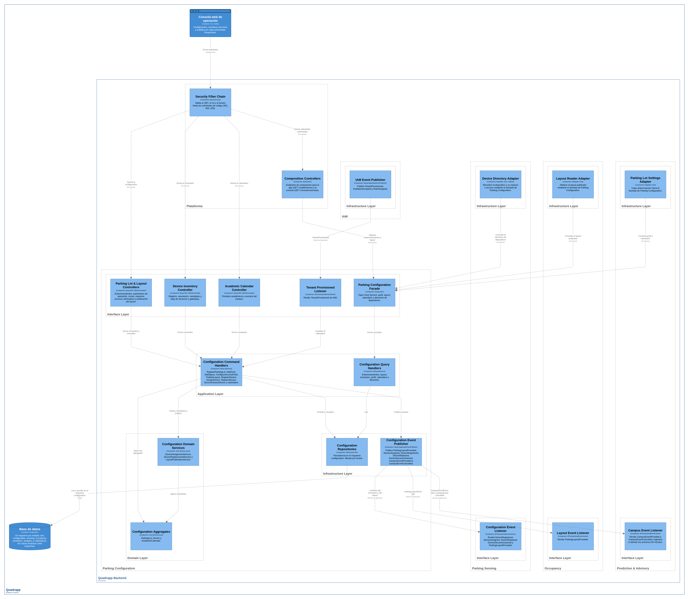

### 5.2.7. Bounded Context Software Architecture Code Level Diagrams

Los Code Level Diagrams detallan la implementación del Bounded Context: el **Domain Layer Class Diagram** y el **Database Design Diagram**.

#### 5.2.7.1. Bounded Context Domain Layer Class Diagrams

El diagrama presenta los tres agregados con sus entidades, Value Objects y enumeraciones, los Domain Services, las interfaces de los repositorios y los eventos que publica el contexto. Las composiciones indican qué objetos viven dentro de cada agregado; las dependencias punteadas, qué eventos registra cada uno y qué agregados usan los servicios.

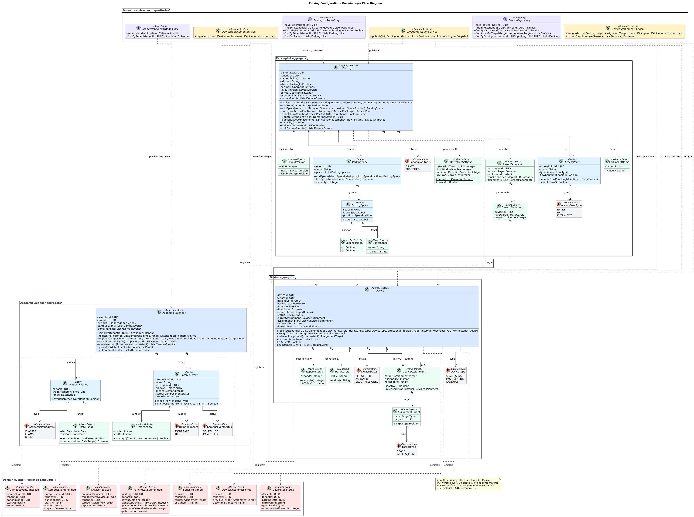

#### 5.2.7.2. Bounded Context Database Design Diagram

El esquema `configuration` de PostgreSQL contiene una tabla por agregado raíz y por cada colección interna. Las claves foráneas unen solo tablas del mismo esquema; `tenant_id` es una referencia lógica a IAM, sin clave foránea (CON-02). Los índices únicos parciales de `device_assignments` aseguran que un sensor y un espacio tengan como máximo una asociación activa, y la restricción de exclusión de `academic_periods` impide superponer periodos.

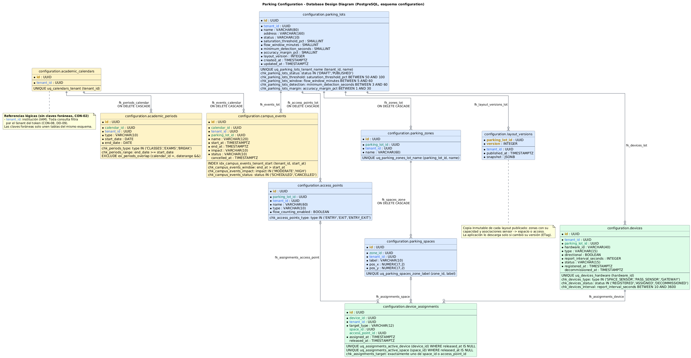

---

## 5.3. Bounded Context: Parking Sensing

El Bounded Context Parking Sensing es responsable de **traducir la telemetría de los sensores de cochera y de paso en detecciones confiables**. Es la frontera entre el mundo técnico del IoT (lectura, identificador técnico, batería, señal, intervalo de reporte) y el lenguaje del negocio que usa Occupancy. Por eso cumple el rol de gateway context y actúa como capa anticorrupción del sistema.

Su propósito es recibir las lecturas que el gateway del campus publica en el broker MQTT, descartar las duplicadas o fuera de orden, confirmar cada cambio de estado tras el tiempo mínimo de detección y vigilar la salud de cada dispositivo. Entrega a Occupancy solo las detecciones confirmadas, los pasos de vehículos y las fallas. No conoce el estado de negocio del espacio (libre, ocupado o desconocido), que pertenece a Occupancy, ni las etiquetas visibles de los espacios, que pertenecen a Parking Configuration.

Este Bounded Context soporta principalmente:

- TS04 — Consumir y validar los mensajes que el gateway publica en el broker.
- TS05 — Recibir con QoS 1 y sesión persistente, sin perder los mensajes publicados durante una desconexión.
- TS06 — Descartar lecturas duplicadas o fuera de orden y confirmar los cambios tras el tiempo mínimo.
- TS10 y US20 — Vigilar la salud de los dispositivos, detectar fallas y registrar su recuperación.
- US05 y US07 — Aportar las detecciones confirmadas con las que Occupancy actualiza la disponibilidad.

Las principales responsabilidades del Bounded Context Parking Sensing son:

- Suscribirse al broker MQTT y confirmar cada mensaje solo después de procesarlo y guardarlo.
- Validar el formato de cada mensaje y apartar los inválidos en un registro de mensajes rechazados.
- Resolver el dispositivo mediante la fachada de Parking Configuration y registrar una incidencia si no está registrado o no tiene espacio asociado.
- Aplicar cada lectura una sola vez (por `eventId`) y en orden (por la marca de tiempo del dispositivo).
- Confirmar el cambio de estado de un espacio cuando se mantiene el tiempo mínimo de detección, y descartar los cambios breves.
- Publicar los pasos de vehículos con su dirección.
- Detectar los dispositivos sin reporte dentro de su intervalo o con batería crítica, marcarlos para mantenimiento y detectar su recuperación.
- Distinguir la falla de un sensor de la desconexión de su gateway.

### Class Dictionary

La siguiente tabla resume las clases e interfaces principales de Parking Sensing.

| Class / Interface | Layer | Purpose | Main attributes | Main operations |
|---|---|---|---|---|
| SensorFeed | Domain | Aggregate Root. Flujo de lecturas de un sensor de cochera o de paso. | deviceId, tenantId, parkingLotId, hardwareId, kind, targetId, confirmedState, pending, lastReadingAt, minimumDetection, active | open(), accept(), confirmIfStable(), recordPassage(), retarget(), resetConfirmation(), deactivate() |
| DeviceHealth | Domain | Aggregate Root. Salud de un dispositivo: último reporte, batería, señal y falla. | deviceId, tenantId, parkingLotId, deviceType, targetId, reportInterval, lastSeenAt, battery, signal, lastGatewayId, status, faultReason, maintenanceRequired | monitor(), recordReport(), isOverdue(), markFault(), retarget(), retire() |
| GatewayLink | Domain | Aggregate Root. Conexión de un gateway del campus con el broker. | gatewayId, tenantId, parkingLotId, hardwareId, status, connectedSince, disconnectedAt, lastReplay | register(), connect(), disconnect(), registerReplay(), isOffline() |
| SensorReading | Domain | Value Object. Lectura normalizada por la capa anticorrupción. | eventId, hardwareId, kind, state, direction, readingAt, battery, signal, gatewayHardwareId | isOlderThan() |
| PendingDetection | Domain | Value Object. Cambio de estado que aún no cumple el tiempo mínimo. | state, since | isStableAt() |
| MinimumDetectionTime, ReportInterval, BatteryLevel, SignalStrength, HealthPolicy, ReplaySummary | Domain | Value Objects con su validación propia. | valor o rango | hasElapsed(), deadlineAfter(), isCriticalBelow() |
| FeedKind, ReadingKind, DetectionState, PassDirection, ReadingOutcome, MonitoredDeviceType, HealthStatus, FaultReason, LinkStatus | Domain | Enumeraciones del contexto. | — | — |
| HealthEvaluationService | Domain | Domain Service. Decide el motivo de una falla considerando el estado del gateway. | — | evaluateOverdue() |
| SensorFeedRepository, DeviceHealthRepository, GatewayLinkRepository | Domain | Repository. Abstracciones de persistencia de cada agregado. | — | save(), findByDeviceId(), findOverdue() |
| SensorStateChanged, VehiclePassageDetected, DeviceFaultDetected, SensorCommunicationRestored, DeviceFlaggedForMaintenance, BufferedReadingsReceived | Domain | Domain Events publicados (Published Language). | Ver 5.3.1 | — |
| *Command y *CommandHandler | Application | Casos de uso de procesamiento y vigilancia. | Dependencies | handle() |
| *Query y *QueryHandler | Application | Consultas de salud e incidencias. | Dependencies | handle() |
| Device*EventHandler | Application | Event Handlers de los cambios del inventario. | Dependencies | handle() |
| DeviceDirectory, ReadingDeduplicationStore, IncidentLog, RejectedReadingStore, SensingEventPublisher, Clock | Application | Puertos de salida. | — | Ver 5.3.3 |
| MqttInboundListener | Interface | Consumer MQTT de lecturas y estado de gateways. | Command Handler dependencies | onReading(), onGatewayStatus() |
| DeviceHealthController | Interface | Controller REST de salud e incidencias. | Query Handler dependencies | getHealth(), getIncidents() |
| ParkingSensingFacade | Interface | Open Host Service en proceso para el módulo de composición. | Query Handler dependency | healthSummaryOf() |
| SensingSchedulers | Interface | Procesos programados de confirmación y vigilancia. | Command Handler dependencies | confirmPendingDetections(), detectOverdueDevices() |
| ConfigurationEventListener | Interface | Consumer de los eventos de Parking Configuration. | Event Handler dependencies | on() |
| SensorReadingTranslator | Infrastructure | Capa anticorrupción: traduce el JSON del gateway a `SensorReading`. | Validator | translate() |
| *RepositoryAdapter, JdbcReadingDeduplicationStore, JpaIncidentLog, JpaRejectedReadingStore | Infrastructure | Persistencia en el esquema `sensing`. | Persistence dependency | save(), find…(), markProcessed() |
| DeviceDirectoryAdapter | Infrastructure | Implementa `DeviceDirectory` sobre la fachada de Parking Configuration, con caché. | Facade dependency | resolve(), evict() |
| SensingEventPublisherAdapter | Infrastructure | Publica los eventos de dominio tras confirmar la transacción. | Messaging dependency | publish() |

### 5.3.1. Domain Layer

La Domain Layer contiene las reglas que convierten lecturas en detecciones y reportes en estados de salud. No depende de MQTT, de JSON, de la base de datos ni de Spring. Los tres agregados salen del paso 9 del EventStorming (sección 4.2.1): `SensorFeed`, `DeviceHealth` y `GatewayLink`. Se separaron porque cada uno avanza con un estímulo distinto: las lecturas de un sensor, el paso del tiempo frente a su intervalo de reporte y la conexión del gateway.

**Aggregate 1: SensorFeed**

|Nombre|Categoría|Descripción|
|-|-|-|
|SensorFeed|Aggregate Root|Flujo de lecturas de un sensor. En un sensor de cochera, confirma los cambios de estado que se mantienen el tiempo mínimo; en un sensor de paso, registra cada paso con su dirección. Su identidad es el `deviceId` del dispositivo.|

Attributes

|Nombre|Tipo de dato|Visibilidad|Descripción|
|-|-|-|-|
|deviceId|UUID|Private|Identificador del dispositivo (referencia lógica a Parking Configuration).|
|tenantId|UUID|Private|Institución a la que pertenece el sensor (IAM).|
|parkingLotId|UUID|Private|Estacionamiento donde está instalado.|
|hardwareId|String|Private|Identificador técnico que informa el sensor.|
|kind|FeedKind|Private|SPACE para un sensor de cochera; PASS para un sensor de paso.|
|targetId|UUID|Private|Espacio o acceso asociado, como identificador opaco. El contexto no conoce su etiqueta.|
|confirmedState|DetectionState?|Private|Último estado confirmado; vacío hasta la primera confirmación o tras una recuperación.|
|pending|PendingDetection?|Private|Cambio en espera de cumplir el tiempo mínimo.|
|lastReadingAt|Instant|Private|Marca de tiempo del dispositivo de la última lectura aplicada.|
|minimumDetection|MinimumDetectionTime|Private|Tiempo mínimo de detección del estacionamiento, recibido en `ParkingLayoutProvided`.|
|active|Boolean|Private|Falso cuando el dispositivo fue dado de baja o reemplazado.|
|domainEvents|`List<DomainEvent>`|Private|Eventos de dominio pendientes de publicación.|

Methods

|Nombre|Tipo de retorno|Visibilidad|Descripción|
|-|-|-|-|
|open(deviceId, tenantId, parkingLotId, hardwareId, kind, targetId, minimumDetection)|SensorFeed|Public (static)|Crea el flujo con la primera lectura de un dispositivo asociado.|
|accept(reading: SensorReading)|ReadingOutcome|Public|Descarta una lectura anterior a `lastReadingAt` (OUT_OF_ORDER, TS06, escenario 2). Si el estado coincide con el confirmado, descarta el cambio pendiente (BRIEF_CHANGE_DISCARDED) o no hace nada (UNCHANGED). Si difiere, abre o mantiene el cambio pendiente (PENDING); si ese cambio ya cumplió el tiempo mínimo según las marcas del dispositivo, lo confirma (CONFIRMED).|
|confirmIfStable(now: Instant)|Boolean|Public|Confirma el cambio pendiente cuando cumplió el tiempo mínimo sin una lectura contraria y registra `SensorStateChanged` (TS06, escenarios 3 y 4).|
|recordPassage(reading: SensorReading)|ReadingOutcome|Public|En un sensor de paso, aplica el orden y registra `VehiclePassageDetected` con la dirección (PASSAGE_RECORDED).|
|retarget(targetId: UUID, minimumDetection: MinimumDetectionTime)|Void|Public|Actualiza el destino o el tiempo mínimo cuando cambian el layout o la asociación.|
|resetConfirmation()|Void|Public|Vacía el estado confirmado para que la siguiente detección estable se informe aunque repita el estado anterior (US20, escenario 4).|
|deactivate()|Void|Public|Deja de aceptar lecturas del dispositivo (US32, escenario 3).|
|pullDomainEvents()|`List<DomainEvent>`|Public|Entrega y vacía los eventos pendientes.|

**Value Objects y enumeraciones del agregado SensorFeed**

|Nombre|Categoría|Atributos|Descripción|
|-|-|-|-|
|SensorReading|Value Object|eventId: UUID, hardwareId: String, kind: ReadingKind, state: DetectionState?, direction: PassDirection?, readingAt: Instant, battery: BatteryLevel?, signal: SignalStrength?, gatewayHardwareId: String|Lectura ya validada y traducida por la capa anticorrupción. Una lectura SPACE trae estado; una PASS trae dirección; una HEARTBEAT solo trae batería y señal.|
|PendingDetection|Value Object|state: DetectionState, since: Instant|Cambio en espera. `isStableAt(now, minimum)` indica si cumplió el tiempo mínimo.|
|MinimumDetectionTime|Value Object|seconds: Integer|Entre 3 y 60 segundos. `hasElapsed(from, to)` compara dos instantes.|
|FeedKind|Enumeration|SPACE, PASS|Tipo de flujo.|
|ReadingKind|Enumeration|SPACE, PASS, HEARTBEAT|Tipo de lectura.|
|DetectionState|Enumeration|FREE, OCCUPIED|Presencia detectada. No incluye UNKNOWN: ese estado es de negocio y lo decide Occupancy.|
|PassDirection|Enumeration|IN, OUT|Dirección del paso.|
|ReadingOutcome|Enumeration|PENDING, CONFIRMED, UNCHANGED, BRIEF_CHANGE_DISCARDED, OUT_OF_ORDER, PASSAGE_RECORDED|Resultado de aplicar una lectura.|

**Aggregate 2: DeviceHealth**

|Nombre|Categoría|Descripción|
|-|-|-|
|DeviceHealth|Aggregate Root|Salud de un dispositivo registrado. Se crea al recibir `DeviceRegistered`, de modo que también falla un dispositivo que nunca llegó a reportar.|

Attributes

|Nombre|Tipo de dato|Visibilidad|Descripción|
|-|-|-|-|
|deviceId|UUID|Private|Identificador del dispositivo.|
|tenantId|UUID|Private|Institución (IAM).|
|parkingLotId|UUID|Private|Estacionamiento donde está instalado.|
|deviceType|MonitoredDeviceType|Private|SPACE_SENSOR, PASS_SENSOR o GATEWAY.|
|targetId|UUID?|Private|Espacio o acceso asociado, que se informa en las fallas.|
|reportInterval|ReportInterval|Private|Intervalo de reporte esperado, recibido en `DeviceRegistered`.|
|lastSeenAt|Instant?|Private|Último reporte recibido (lectura o heartbeat).|
|battery|BatteryLevel?|Private|Último nivel de batería informado.|
|signal|SignalStrength?|Private|Última intensidad de señal informada.|
|lastGatewayId|UUID?|Private|Gateway por el que llegó el último reporte.|
|status|HealthStatus|Private|OPERATIONAL, FAULT o RETIRED.|
|faultReason|FaultReason?|Private|Motivo de la falla vigente.|
|faultDetectedAt|Instant?|Private|Momento en que se detectó la falla.|
|maintenanceRequired|Boolean|Private|Indica si el dispositivo quedó marcado para mantenimiento.|
|domainEvents|`List<DomainEvent>`|Private|Eventos de dominio pendientes de publicación.|

Methods

|Nombre|Tipo de retorno|Visibilidad|Descripción|
|-|-|-|-|
|monitor(deviceId, tenantId, parkingLotId, deviceType, reportInterval, now)|DeviceHealth|Public (static)|Empieza a vigilar un dispositivo; el plazo del primer reporte corre desde el registro.|
|recordReport(at, battery, signal, gatewayId, policy)|Void|Public|Registra la última comunicación (US20, escenario 1). Con batería bajo el umbral, marca la falla CRITICAL_BATTERY (TS10, escenario 3). Si estaba en falla y la batería es válida, vuelve a OPERATIONAL y registra `SensorCommunicationRestored` (US20, escenario 3).|
|isOverdue(now: Instant)|Boolean|Public|Indica si venció el intervalo de reporte desde el último reporte.|
|markFault(reason: FaultReason, now: Instant)|Void|Public|Pasa a FAULT y registra `DeviceFaultDetected`. Con NO_REPORT o CRITICAL_BATTERY, además marca el dispositivo para mantenimiento y registra `DeviceFlaggedForMaintenance`.|
|retarget(targetId: UUID)|Void|Public|Actualiza el destino informado en las fallas.|
|retire(now: Instant)|Void|Public|Pasa a RETIRED y registra `DeviceFaultDetected` con el motivo DECOMMISSIONED, para que el espacio deje de contar con ese sensor.|
|pullDomainEvents()|`List<DomainEvent>`|Public|Entrega y vacía los eventos pendientes.|

**Value Objects y enumeraciones del agregado DeviceHealth**

|Nombre|Categoría|Atributos|Descripción|
|-|-|-|-|
|ReportInterval|Value Object|seconds: Integer|`deadlineAfter(lastSeenAt)` devuelve el instante en que vence el reporte.|
|BatteryLevel|Value Object|percent: Integer|Entre 0 y 100. `isCriticalBelow(thresholdPct)` compara con el umbral.|
|SignalStrength|Value Object|rssiDbm: Integer|Intensidad de la señal en dBm; se muestra en la consola y no decide fallas.|
|HealthPolicy|Value Object|criticalBatteryPct: Integer, checkPeriodSeconds: Integer|Umbral de batería crítica (15 % por defecto) y frecuencia de revisión (30 s), que permite detectar la falla en 1 min o menos (QAS-05).|
|MonitoredDeviceType|Enumeration|SPACE_SENSOR, PASS_SENSOR, GATEWAY|Tipo de dispositivo vigilado.|
|HealthStatus|Enumeration|OPERATIONAL, FAULT, RETIRED|Estado de salud.|
|FaultReason|Enumeration|NO_REPORT, CRITICAL_BATTERY, GATEWAY_OFFLINE, DECOMMISSIONED|Motivo de la falla.|

**Aggregate 3: GatewayLink**

|Nombre|Categoría|Descripción|
|-|-|-|
|GatewayLink|Aggregate Root|Conexión de un gateway del campus con el broker. Permite distinguir un sensor dañado de un sensor que no reporta porque su gateway perdió la conexión.|

Attributes

|Nombre|Tipo de dato|Visibilidad|Descripción|
|-|-|-|-|
|gatewayId|UUID|Private|Identificador del gateway (dispositivo de tipo GATEWAY).|
|tenantId|UUID|Private|Institución (IAM).|
|parkingLotId|UUID|Private|Estacionamiento al que atiende.|
|hardwareId|String|Private|Identificador técnico del gateway.|
|status|LinkStatus|Private|CONNECTED o DISCONNECTED.|
|connectedSince|Instant?|Private|Inicio de la conexión vigente.|
|disconnectedAt|Instant?|Private|Momento de la última desconexión.|
|lastReplay|ReplaySummary?|Private|Resumen del último reenvío de lecturas retenidas.|
|domainEvents|`List<DomainEvent>`|Private|Eventos de dominio pendientes de publicación.|

Methods

|Nombre|Tipo de retorno|Visibilidad|Descripción|
|-|-|-|-|
|register(gatewayId, tenantId, parkingLotId, hardwareId)|GatewayLink|Public (static)|Crea el enlace al recibir `DeviceRegistered` de un gateway.|
|connect(at: Instant)|Void|Public|Pasa a CONNECTED.|
|disconnect(at: Instant)|Void|Public|Pasa a DISCONNECTED; se dispara con el mensaje de última voluntad (Last Will) que el broker publica cuando el gateway se desconecta.|
|registerReplay(summary: ReplaySummary)|Void|Public|Registra el reenvío de lecturas retenidas y `BufferedReadingsReceived` (QAS-03).|
|isOffline()|Boolean|Public|Indica si el gateway está desconectado.|
|pullDomainEvents()|`List<DomainEvent>`|Public|Entrega y vacía los eventos pendientes.|

**Value Objects y enumeraciones del agregado GatewayLink**

|Nombre|Categoría|Atributos|Descripción|
|-|-|-|-|
|ReplaySummary|Value Object|readingCount: Integer, oldestReadingAt: Instant, receivedAt: Instant|Cantidad y antigüedad de las lecturas retenidas que reenvió el gateway.|
|LinkStatus|Enumeration|CONNECTED, DISCONNECTED|Estado de la conexión.|

**Domain Services**

|Nombre|Categoría|Métodos|Descripción|
|-|-|-|-|
|HealthEvaluationService|Domain Service|evaluateOverdue(health: DeviceHealth, gateway: GatewayLink?, now: Instant): FaultReason?|Si el dispositivo venció su intervalo y su último gateway está desconectado, devuelve GATEWAY_OFFLINE: el espacio pasa a desconocido, pero el sensor no se marca para mantenimiento. Si el gateway está conectado, devuelve NO_REPORT. Si el intervalo no venció, no devuelve nada.|

**Repositories (interfaces del dominio)**

|Nombre|Operaciones|Descripción|
|-|-|-|
|SensorFeedRepository|save(feed), findByDeviceId(deviceId), findPendingConfirmation()|Persistencia de `SensorFeed`.|
|DeviceHealthRepository|save(health), findByDeviceId(deviceId), findOverdue(now), findByParkingLot(tenantId, parkingLotId)|Persistencia de `DeviceHealth`.|
|GatewayLinkRepository|save(link), findById(gatewayId), findByHardwareId(hardwareId)|Persistencia de `GatewayLink`.|

**Domain Events publicados (Published Language)**

|Evento|Atributos|Consumidor|
|-|-|-|
|SensorStateChanged|eventId, deviceId, tenantId, parkingLotId, spaceId, state (FREE u OCCUPIED), detectedAt|Occupancy, que actualiza el estado del espacio.|
|VehiclePassageDetected|eventId, deviceId, tenantId, parkingLotId, accessPointId, direction (IN u OUT), detectedAt|Occupancy, que registra el ingreso o la salida.|
|DeviceFaultDetected|deviceId, tenantId, parkingLotId, targetId, reason, detectedAt|Occupancy, que marca el espacio como desconocido (UNKNOWN).|
|SensorCommunicationRestored|deviceId, tenantId, parkingLotId, targetId, restoredAt|Occupancy y la consola. El espacio deja de ser desconocido con la siguiente `SensorStateChanged`, no con este evento.|
|DeviceFlaggedForMaintenance|deviceId, tenantId, parkingLotId, reason, flaggedAt|Consola de operación, mediante la fachada.|
|BufferedReadingsReceived|gatewayId, tenantId, parkingLotId, readingCount, oldestReadingAt|Consola de operación, mediante la fachada.|

`SensorStateChanged` y `DeviceFaultDetected` son los nombres que fija la tabla de eventos de la sección 4.2.1 para "Detección confirmada" y "Falla de sensor detectada". `SensorStateChanged` conserva el `eventId` de la lectura que confirmó el cambio, de modo que Occupancy también puede descartar duplicados.

### Reglas de negocio

1. Solo se procesan lecturas de dispositivos registrados y no dados de baja; las demás se descartan y generan una incidencia (TS04, escenario 3; US32, escenario 3).
2. Una lectura de un sensor sin espacio ni acceso asociado no genera eventos de dominio y registra una incidencia de mapeo (TS04, escenario 4).
3. Un mensaje con formato inválido se aparta en el registro de rechazados y no genera eventos (TS04, escenario 2).
4. Cada lectura se aplica una sola vez según su `eventId` (TS06, escenario 1).
5. Una lectura con marca de tiempo anterior a la última aplicada del mismo sensor se descarta (TS06, escenario 2).
6. Un cambio de estado se confirma solo si se mantiene durante el tiempo mínimo de detección; un cambio más breve se descarta sin emitir eventos (TS06, escenarios 3 y 4).
7. El contexto informa presencia y dirección, nunca la identidad del vehículo ni de su conductor (CON-16).
8. Un dispositivo sin reporte dentro de su intervalo o con batería bajo el umbral pasa a falla y se marca para mantenimiento (TS10, QAS-05).
9. Si el dispositivo no reporta porque su gateway está desconectado, se informa GATEWAY_OFFLINE y no se marca para mantenimiento.
10. Un dispositivo en falla se recupera con un reporte válido; el espacio deja de ser desconocido solo con la siguiente detección estable (US20, escenarios 3 y 4).
11. Las lecturas que el gateway retuvo durante una desconexión se procesan con las mismas reglas de orden y duplicidad (QAS-03).
12. El contexto no calcula ocupación ni disponibilidad, y no decide el estado UNKNOWN de un espacio.

### 5.3.2. Interface Layer

La Interface Layer recibe las lecturas del broker MQTT, atiende las consultas de la consola, dispara los procesos programados y escucha los cambios del inventario. Valida la forma de cada entrada, la transforma en Commands o Queries y delega en la Application Layer. No contiene reglas de negocio.

**Consumer 1: MqttInboundListener**

|Nombre|Categoría|Descripción|
|-|-|-|
|MqttInboundListener|Consumer (MQTT)|Recibe las lecturas y el estado de los gateways. Confirma cada mensaje al broker solo después de que su transacción se guardó, por lo que un fallo provoca la reentrega y no la pérdida (TS05).|

Attributes

|Nombre|Tipo de dato|Visibilidad|Descripción|
|-|-|-|-|
|translator|SensorReadingTranslator|Private|Capa anticorrupción que valida y traduce el mensaje.|
|commandHandlers|Sensing Command Handlers|Private|Casos de uso de procesamiento.|
|rejectedStore|RejectedReadingStore|Private|Registro de mensajes inválidos.|

Methods

|Nombre|Tipo de retorno|Visibilidad|Descripción|
|-|-|-|-|
|onReading(topic: String, payload: Bytes)|Void|Public|Tópico `quadrapp/{tenantId}/{gatewayId}/readings`. Traduce el mensaje y envía `ProcessSensorReadingCommand`, `RecordVehiclePassageCommand` o `RecordHeartbeatCommand` según su tipo; si es inválido, lo guarda como rechazado y lo confirma.|
|onGatewayStatus(topic: String, payload: Bytes)|Void|Public|Tópico `quadrapp/{tenantId}/{gatewayId}/status`. Envía `UpdateGatewayLinkCommand` con la conexión, la desconexión (Last Will) o el resumen del reenvío.|

Mensaje de lectura que publica el gateway:

```json
{
  "eventId": "8f0d5c0e-3b1a-4d7e-9a35-2f8b1c7e4a10",
  "sensorId": "sensor-0342",
  "kind": "SPACE",
  "state": "OCCUPIED",
  "ts": "2026-10-09T13:05:12.200Z",
  "battery": 82,
  "rssi": -71
}
```

El mensaje no contiene etiquetas de espacios ni datos de vehículos (CON-15, CON-16). El `tenantId` del tópico es confiable porque el broker solo permite a cada gateway publicar bajo su propio prefijo; aun así, si no coincide con la institución del dispositivo, el mensaje se descarta con una incidencia TENANT_MISMATCH (CON-08).

**Controller 1: DeviceHealthController**

|Controller|Endpoint|Resultado|Origen|
|-|-|-|-|
|DeviceHealthController|`GET /api/v1/devices/health?parkingLotId={lotId}`|200 con el estado, el nivel de batería, la señal, la última comunicación, el motivo de falla y la marca de mantenimiento de cada dispositivo|TS10, escenario 1; US20|
|DeviceHealthController|`GET /api/v1/sensing/incidents?parkingLotId={lotId}`|200 con las incidencias abiertas (dispositivo desconocido, sensor sin asociación o institución inconsistente)|TS04 (ruta propuesta)|

Ambas rutas exigen el rol `PARKING_ADMIN` o `PARKING_OPERATOR`. `tenantId` se toma del token.

**Open Host Service: ParkingSensingFacade**

|Nombre|Tipo de retorno|Consumidor|Descripción|
|-|-|-|-|
|healthSummaryOf(tenantId: UUID, parkingLotId: UUID)|DeviceHealthSummaryView|Módulo de composición (`GET /console/overview`, TS17)|Cantidad de dispositivos operativos, en falla y marcados para mantenimiento, y gateways desconectados.|

**Procesos programados: SensingSchedulers**

|Método|Frecuencia|Command|Descripción|
|-|-|-|-|
|confirmPendingDetections()|Cada 1 s|ConfirmPendingDetectionsCommand|Confirma los cambios pendientes que cumplieron el tiempo mínimo sin una lectura contraria.|
|detectOverdueDevices()|Cada 30 s|DetectOverdueDevicesCommand|Revisa los intervalos de reporte vencidos (QAS-05).|

En el despliegue con varias réplicas, cada proceso se ejecuta en una sola réplica a la vez, con un bloqueo en la base de datos (ShedLock).

**Event Consumer: ConfigurationEventListener**

|Evento recibido (Parking Configuration)|Event Handler|
|-|-|
|DeviceRegistered|DeviceRegisteredEventHandler|
|SensorAssigned, DeviceReplaced, ParkingLayoutProvided|DeviceAssignmentChangedEventHandler|
|DeviceDecommissioned|DeviceDecommissionedEventHandler|

### 5.3.3. Application Layer

La Application Layer coordina el procesamiento de lecturas, la vigilancia de la salud y la reacción a los cambios del inventario. No contiene reglas de negocio: las aplica a través de los agregados y del Domain Service. Sus capacidades son ingerir lecturas sin pérdidas ni duplicados, confirmar detecciones, vigilar dispositivos y gateways, y responder las consultas de salud.

**Commands y Command Handlers**

|Command|Atributos|Command Handler|Dependencias|Historias|
|-|-|-|-|-|
|ProcessSensorReadingCommand|tenantId, reading: SensorReading|ProcessSensorReadingCommandHandler|ReadingDeduplicationStore, DeviceDirectory, SensorFeedRepository, DeviceHealthRepository, IncidentLog, SensingEventPublisher, Clock|TS04, TS06|
|RecordVehiclePassageCommand|tenantId, reading: SensorReading|RecordVehiclePassageCommandHandler|ReadingDeduplicationStore, DeviceDirectory, SensorFeedRepository, DeviceHealthRepository, IncidentLog, SensingEventPublisher|TS04, TS14|
|RecordHeartbeatCommand|tenantId, reading: SensorReading|RecordHeartbeatCommandHandler|ReadingDeduplicationStore, DeviceDirectory, DeviceHealthRepository, SensingEventPublisher, Clock|US20, TS10|
|ConfirmPendingDetectionsCommand|now|ConfirmPendingDetectionsCommandHandler|SensorFeedRepository, SensingEventPublisher, Clock|TS06|
|DetectOverdueDevicesCommand|now|DetectOverdueDevicesCommandHandler|DeviceHealthRepository, GatewayLinkRepository, HealthEvaluationService, SensingEventPublisher, Clock|TS10, QAS-05|
|UpdateGatewayLinkCommand|gatewayHardwareId, status, replaySummary|UpdateGatewayLinkCommandHandler|GatewayLinkRepository, SensingEventPublisher, Clock|TS05, QAS-03|

**Queries y Query Handlers**

|Query|Atributos|Query Handler|Resultado|
|-|-|-|-|
|GetDeviceHealthQuery|tenantId, parkingLotId|GetDeviceHealthQueryHandler|`List<DeviceHealthView>`|
|GetSensingIncidentsQuery|tenantId, parkingLotId|GetSensingIncidentsQueryHandler|`List<SensingIncidentView>`|
|GetDeviceHealthSummaryQuery|tenantId, parkingLotId|GetDeviceHealthSummaryQueryHandler|DeviceHealthSummaryView|

**Event Handlers**

|Event Handler|Evento|Descripción|
|-|-|-|
|DeviceRegisteredEventHandler|DeviceRegistered|Crea el `DeviceHealth` con el intervalo de reporte y, si es un gateway, su `GatewayLink`.|
|DeviceAssignmentChangedEventHandler|SensorAssigned, DeviceReplaced, ParkingLayoutProvided|Invalida la caché del directorio y actualiza el destino y el tiempo mínimo de los `SensorFeed` y `DeviceHealth` afectados. Con `DeviceReplaced`, desactiva el flujo del dispositivo anterior y retira su salud.|
|DeviceDecommissionedEventHandler|DeviceDecommissioned|Desactiva el `SensorFeed`, retira el `DeviceHealth` (que publica `DeviceFaultDetected` con DECOMMISSIONED) e invalida la caché.|

**Flujos de ejecución**

`ProcessSensorReadingCommandHandler`:

1. Registra el `eventId` en `ReadingDeduplicationStore`; si ya existía, descarta la lectura (TS06, escenario 1).
2. Resuelve el dispositivo con `DeviceDirectory`. Si no existe o fue dado de baja, registra la incidencia y termina (TS04, escenario 3). Si no tiene destino, registra la incidencia de mapeo y termina (TS04, escenario 4).
3. Carga o abre el `SensorFeed` y aplica `accept`. Si la lectura está fuera de orden, termina (TS06, escenario 2).
4. Registra el reporte en `DeviceHealth`, lo que puede publicar `SensorCommunicationRestored` y reiniciar la confirmación del flujo.
5. Guarda todo en una transacción. Los eventos (`SensorStateChanged` si hubo confirmación) se publican al confirmarla, y recién entonces el listener confirma el mensaje al broker.

`DetectOverdueDevicesCommandHandler`:

1. Obtiene los dispositivos operativos cuyo intervalo de reporte venció.
2. Para cada uno, carga el `GatewayLink` de su último gateway y obtiene el motivo con `HealthEvaluationService.evaluateOverdue`.
3. Marca la falla, guarda y publica `DeviceFaultDetected` y, si corresponde, `DeviceFlaggedForMaintenance`. Con una revisión cada 30 s, la falla se informa en 1 min o menos (QAS-05).

**Puertos de salida**

|Nombre|Categoría|Operaciones|Descripción|
|-|-|-|-|
|SensorFeedRepository, DeviceHealthRepository, GatewayLinkRepository|Puertos (Domain Layer)|Ver 5.3.1|Persistencia de los agregados.|
|DeviceDirectory|Puerto hacia Parking Configuration|resolve(hardwareId): DeviceDirectoryEntry?; evict(hardwareId)|Obtiene el dispositivo, su institución, su destino vigente y el tiempo mínimo de detección.|
|ReadingDeduplicationStore|Puerto de persistencia|markProcessed(eventId, hardwareId): Boolean|Devuelve falso si el `eventId` ya se había procesado.|
|IncidentLog|Puerto de persistencia|record(tenantId, hardwareId, type, detail)|Registra incidencias de sensado.|
|RejectedReadingStore|Puerto de persistencia|store(topic, payload, reason)|Guarda los mensajes inválidos.|
|SensingEventPublisher|Puerto de eventos|publish(events: `List<DomainEvent>`)|Publica los eventos de dominio.|
|Clock|Puerto de tiempo|now()|Reloj inyectable.|

### 5.3.4. Infrastructure Layer

La Infrastructure Layer contiene la conexión con el broker, la traducción de los mensajes, la persistencia y la integración con Parking Configuration.

|Nombre|Categoría|Implementa|Tecnología|Descripción|
|-|-|-|-|-|
|MqttInboundConfiguration|Configuración de mensajería|—|Spring Integration MQTT, cliente MQTT v5|Conexión TLS con el broker, sesión persistente (sin inicio limpio y con expiración de sesión) y QoS 1, para recibir también lo publicado durante una desconexión (TS05, escenario 3). Usa una suscripción compartida (`$share/sensing/…`) para que cada mensaje lo procese una sola réplica (QAS-04), y confirmación manual tras guardar.|
|SensorReadingTranslator|Adapter (anti-corruption)|—|Jackson, Bean Validation|Valida el JSON (campos obligatorios, tipos, valores permitidos) y lo traduce a `SensorReading`. Es el único componente que conoce el formato del gateway: otra tecnología de sensado solo requiere otro traductor (CON-16).|
|SensorFeedRepositoryAdapter, DeviceHealthRepositoryAdapter, GatewayLinkRepositoryAdapter|Repository (implementación)|Repositorios del dominio|Spring Data JPA, PostgreSQL|Persisten los agregados con bloqueo optimista (`version`), para que dos lecturas simultáneas del mismo sensor no se sobrescriban.|
|JdbcReadingDeduplicationStore|Adapter (persistencia)|ReadingDeduplicationStore|JDBC, PostgreSQL|`INSERT … ON CONFLICT DO NOTHING` sobre `processed_readings`; un proceso diario elimina las filas con más de 7 días.|
|JpaIncidentLog, JpaRejectedReadingStore|Adapter (persistencia)|IncidentLog, RejectedReadingStore|Spring Data JPA|Guardan incidencias y mensajes rechazados.|
|DeviceDirectoryAdapter|Adapter (anti-corruption)|DeviceDirectory|Llamada en proceso a `ParkingConfigurationFacade`, caché Caffeine|Consulta `resolveDevice` y guarda el resultado en caché; los eventos de Parking Configuration invalidan las entradas afectadas.|
|SensingEventPublisherAdapter|Adapter (eventos)|SensingEventPublisher|Eventos de aplicación de Spring|Publica los eventos de dominio; Occupancy los recibe con `@TransactionalEventListener` después de confirmar la transacción.|

**Consideraciones**

|Tema|Decisión|
|-|-|
|Entrega de mensajes|Al menos una vez: el broker reentrega todo mensaje no confirmado y el contexto descarta los duplicados por `eventId`. Así se cumple 0 % de lecturas perdidas sin procesar ninguna dos veces (QAS-03, DD-02, DD-03).|
|Seguridad|Los sensores no se exponen a internet; solo el gateway abre una conexión saliente al broker con credenciales propias y permisos limitados a su prefijo de tópico (CON-05).|
|Propiedad de datos|Este contexto es el único que escribe en el esquema `sensing`. Obtiene el inventario de Parking Configuration mediante su fachada y sus eventos, nunca leyendo sus tablas.|
|Multi-tenancy|`tenant_id` se guarda en todas las tablas con datos de una institución. Las consultas de la consola filtran por el tenant del token.|
|Tecnología|Módulo del monolito modular en Java 21 y Spring Boot 3, con el esquema `sensing` de PostgreSQL, según DD-01.|

### 5.3.6. Bounded Context Software Architecture Component Level Diagrams

El diagrama descompone el módulo Parking Sensing dentro del contenedor Quadrapp Backend, organizado por capas. Muestra el recorrido de una lectura: el gateway del campus la publica en el broker MQTT; el listener la traduce con la capa anticorrupción y la procesa en los Command Handlers; los repositorios la guardan en el esquema `sensing`; y el publicador entrega la detección al listener de Occupancy. Además aparecen la consola, que consulta la salud de los dispositivos, y Parking Configuration, que provee el directorio de dispositivos y notifica los cambios del inventario.

#### Containers considerados

| Container | Tecnología | Responsabilidad |
|---|---|---|
| Gateway del campus | Linux, agente MQTT | Publica las lecturas y las retiene en un búfer local sin conexión. |
| Broker MQTT | Eclipse Mosquitto | Recibe las lecturas con QoS 1 y las entrega con sesión persistente. |
| Quadrapp Backend | Java 21, Spring Boot 3 (monolito modular) | Procesa las lecturas, confirma detecciones y vigila la salud de los dispositivos. |
| Base de datos | PostgreSQL (esquema `sensing`) | Almacena flujos de lecturas, salud, enlaces de gateways, deduplicación e incidencias. |

#### Componentes del módulo Parking Sensing

| Componente | Capa | Responsabilidad | Tecnología | Clases que lo componen |
|---|---|---|---|---|
| MQTT Inbound Listener | Interface | Recibe lecturas y estado de gateways; confirma tras guardar. | Spring Integration MQTT v5 | MqttInboundListener, MqttInboundConfiguration |
| Device Health Controller | Interface | Consultas de salud e incidencias. | Spring MVC `@RestController` | DeviceHealthController |
| Parking Sensing Facade | Interface | Resumen de salud para la consola. | Spring bean | ParkingSensingFacade |
| Sensing Schedulers | Interface | Confirmación de detecciones y revisión de intervalos. | Spring `@Scheduled` | SensingSchedulers |
| Configuration Event Listener | Interface | Cambios del inventario y del layout. | `@TransactionalEventListener` | ConfigurationEventListener |
| Sensing Command Handlers | Application | Procesamiento de lecturas y vigilancia. | Spring `@Service` | Commands, Command Handlers y Event Handlers |
| Sensing Query Handlers | Application | Consultas de salud e incidencias. | Spring `@Service` | Queries y Query Handlers |
| Sensing Aggregates | Domain | Reglas de detección y de salud. | Java (dominio puro) | SensorFeed, DeviceHealth, GatewayLink, HealthEvaluationService, Value Objects y enumeraciones |
| Sensor Reading Translator | Infrastructure | Capa anticorrupción del mensaje del gateway. | Jackson, Bean Validation | SensorReadingTranslator |
| Sensing Repositories | Infrastructure | Persistencia, deduplicación e incidencias. | Spring Data JPA, JDBC | *RepositoryAdapter, JdbcReadingDeduplicationStore, JpaIncidentLog, JpaRejectedReadingStore |
| Device Directory Adapter | Infrastructure | Resuelve dispositivos mediante la fachada de Parking Configuration. | Adaptador Java, Caffeine | DeviceDirectoryAdapter |
| Sensing Event Publisher | Infrastructure | Publica los eventos tras confirmar la transacción. | Eventos de aplicación de Spring | SensingEventPublisherAdapter |

Parking Sensing Component Level Diagram: **ParkingSensingComponentLevelDiagram**
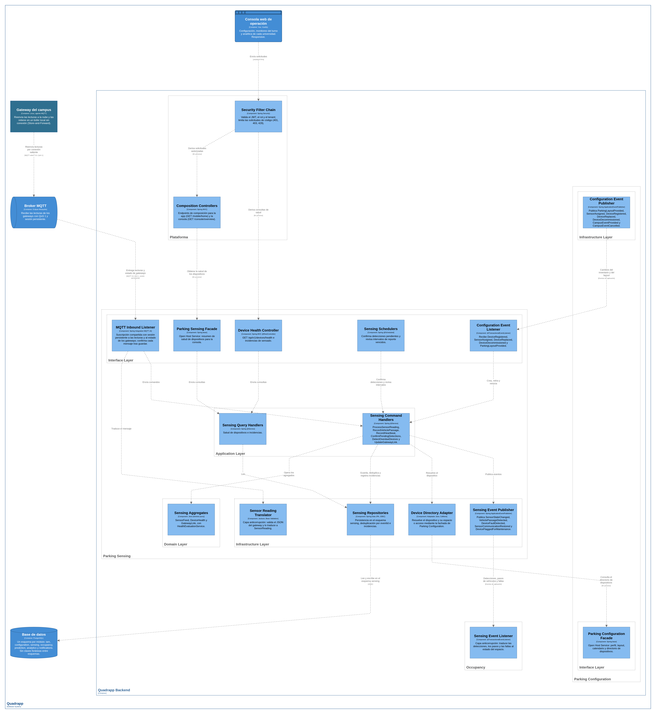

### 5.3.7. Bounded Context Software Architecture Code Level Diagrams

Los Code Level Diagrams detallan la implementación del Bounded Context: el **Domain Layer Class Diagram** y el **Database Design Diagram**.

#### 5.3.7.1. Bounded Context Domain Layer Class Diagrams

El diagrama presenta los tres agregados con sus Value Objects y enumeraciones, el Domain Service, las interfaces de los repositorios y los eventos que publica el contexto. `SensorReading` solo existe en memoria: es el resultado de la capa anticorrupción y no se persiste.

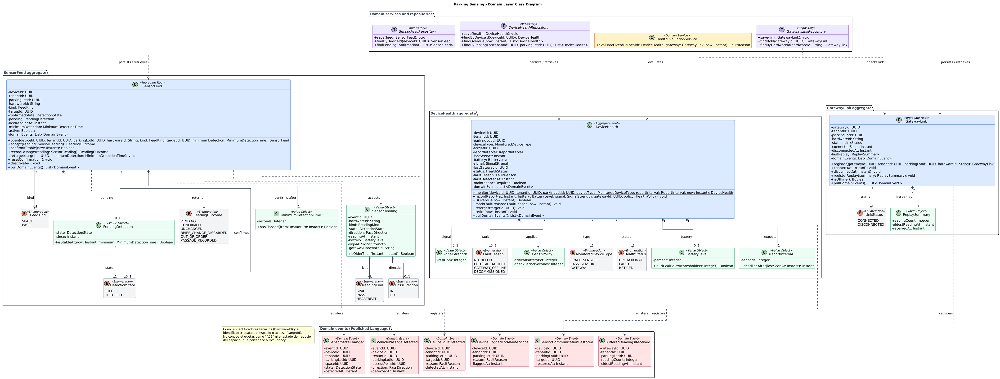

#### 5.3.7.2. Bounded Context Database Design Diagram

El esquema `sensing` de PostgreSQL contiene una tabla por agregado, que usa el `device_id` como identidad, y tres tablas de soporte: `processed_readings` para la deduplicación por `eventId`, `sensing_incidents` para las incidencias y `rejected_readings` para los mensajes inválidos. No hay claves foráneas hacia otros esquemas: `tenant_id`, `parking_lot_id`, `device_id` y `target_id` son referencias lógicas a IAM y Parking Configuration (CON-02).

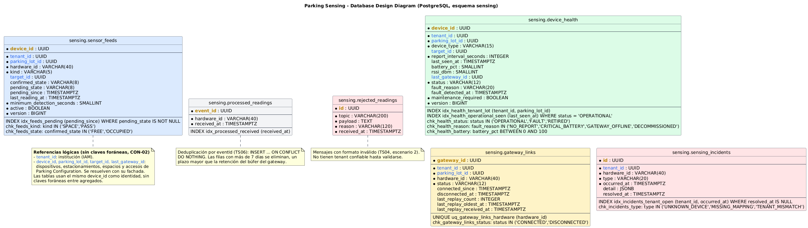

---

## 5.4. Bounded Context: Occupancy

El Bounded Context Occupancy es responsable de **mantener el estado de negocio de cada espacio y la disponibilidad de cada zona y estacionamiento**. Es la fuente de verdad de la ocupación actual que consultan la aplicación móvil, la consola de operación, Prediction & Advisory y Analytics.

Su propósito es convertir las detecciones confirmadas que entrega Parking Sensing en estados de negocio (libre, ocupado o desconocido), recalcular la disponibilidad con cada cambio, registrar el flujo de ingresos y salidas y reconciliarlo con la detección por espacio. Además, distribuye la ocupación en tiempo casi real mediante un read model en caché y una suscripción. No procesa lecturas de sensores, no decide si un sensor falló y no genera pronósticos.

Este Bounded Context soporta principalmente:

- US05, US06 y US07 — Consultar la disponibilidad actual del estacionamiento y de cada zona, con la antigüedad del dato.
- US08 — Presentar como desconocido (UNKNOWN) un espacio sin información confiable y excluirlo del conteo de disponibles.
- TS09 — Exponer el estado consolidado, la suscripción a cambios y la marca de dato desactualizado.
- TS14 — Registrar el flujo con los sensores de paso y reconciliarlo con la detección por espacio.
- US29 y TS17 — Aportar la ocupación al monitoreo del turno en la consola.

Las principales responsabilidades del Bounded Context Occupancy son:

- Traducir, en su capa anticorrupción, los eventos de Parking Sensing al estado de negocio del espacio.
- Mantener cada espacio como FREE, OCCUPIED o UNKNOWN, y registrar el motivo de UNKNOWN.
- Recalcular la disponibilidad por zona y por estacionamiento con cada cambio de estado, y publicar `OccupancyUpdated`.
- Registrar los ingresos y salidas de los accesos habilitados para el conteo de flujo, y publicar `EntryExitRecorded`.
- Reconciliar periódicamente el conteo de accesos con la detección por espacio, que prevalece.
- Actualizar el read model en Redis y entregar los cambios a los clientes suscritos.
- Indicar la antigüedad del dato y marcarlo como desactualizado cuando supera el tiempo máximo de vigencia.
- Responder, mediante su fachada (Open Host Service), las consultas de Prediction & Advisory y del módulo de composición.

### Class Dictionary

La siguiente tabla resume las clases e interfaces principales de Occupancy.

| Class / Interface | Layer | Purpose | Main attributes | Main operations |
|---|---|---|---|---|
| SpaceOccupancy | Domain | Aggregate Root. Estado de negocio de un espacio. | spaceId, tenantId, parkingLotId, zoneId, status, unknownReason, statusSince, lastDetectedAt, lastEventId | initialize(), applyDetection(), markUnknown(), awaitStableDetection(), relocate(), countsAsFree() |
| LotOccupancy | Domain | Aggregate Root. Disponibilidad y flujo de un estacionamiento. | parkingLotId, tenantId, layoutVersion, zones, flowAccessPointIds, countedOccupied, consolidatedAt, lastReconciledAt | open(), applyLayout(), recalculate(), recordPassage(), reconcile(), availability(), isStale() |
| ZoneOccupancy | Domain | Entity. Disponibilidad de una zona. | zoneId, capacity, availability | update() |
| Availability | Domain | Value Object. Capacidad y espacios libres, ocupados y desconocidos. | capacity, free, occupied, unknown | occupancyRate(), plus() |
| ZoneCount, VehiclePassage, OccupancySnapshot, ReconciliationResult | Domain | Value Objects con los datos de cada operación. | Ver 5.4.1 | — |
| ReconciliationPolicy, FreshnessPolicy | Domain | Value Objects con los parámetros de reconciliación y vigencia. | toleranceSpaces, periodMinutes, staleAfterSeconds | — |
| SpaceStatus, UnknownReason, DetectedPresence, PassageDirection | Domain | Enumeraciones del contexto. | — | — |
| SpaceOccupancyRepository, LotOccupancyRepository, VehiclePassageRepository, OccupancySnapshotRepository | Domain | Repository. Abstracciones de persistencia. | — | save(), findById(), countByZone(), countBetween(), findBetween() |
| SpaceMarkedOccupied, SpaceMarkedFree, SpaceMarkedUnknown, AccessCountReconciled | Domain | Domain Events internos del contexto. | Ver 5.4.1 | — |
| OccupancyUpdated, EntryExitRecorded | Domain | Domain Events publicados (Published Language). | Ver 5.4.1 | — |
| *Command y *CommandHandler | Application | Casos de uso de escritura. | Dependencies | handle() |
| *Query y *QueryHandler | Application | Casos de uso de lectura. | Dependencies | handle() |
| SensingEventHandler, LayoutProvidedEventHandler, SpaceStatusChangedEventHandler | Application | Event Handlers. | Dependencies | handle() |
| LayoutReader, AvailabilityReadModel, OccupancyEventPublisher, Clock | Application | Puertos de salida. | — | Ver 5.4.3 |
| OccupancyQueryController | Interface | Controller REST de disponibilidad, espacios y flujo. | Query Handler dependencies | getOccupancy(), getSpaces(), getFlow() |
| OccupancyRealtimeEndpoint | Interface | Suscripción en tiempo real a un estacionamiento. | Read model dependency | subscribe() |
| OccupancyFacade | Interface | Open Host Service en proceso. | Query Handler dependencies | currentOccupancy(), freeSpaces(), exitsInWindow(), recentSnapshots(), availabilityOf() |
| SensingEventListener, LayoutEventListener | Interface | Consumers de los eventos de Parking Sensing y Parking Configuration. | Event Handler dependencies | on() |
| OccupancySchedulers | Interface | Reconciliación y registro del historial. | Command Handler dependencies | reconcile(), recordSnapshots() |
| *RepositoryAdapter | Infrastructure | Persistencia en el esquema `occupancy`. | Persistence dependency | save(), find…() |
| RedisAvailabilityReadModel | Infrastructure | Read model en Redis y difusión entre réplicas. | Redis dependency | write(), read(), broadcast() |
| ConfigurationLayoutReaderAdapter | Infrastructure | Lee el layout publicado mediante la fachada de Parking Configuration. | Facade dependency | layoutOf() |
| OccupancyEventPublisherAdapter | Infrastructure | Publica los eventos tras confirmar la transacción. | Messaging dependency | publish() |

### 5.4.1. Domain Layer

La Domain Layer contiene las reglas del estado de los espacios, de la disponibilidad y del flujo. No depende de Redis, de WebSocket, de la base de datos ni de Spring. Los dos agregados salen del paso 9 del EventStorming (sección 4.2.1): `SpaceOccupancy` y `LotOccupancy`. Se separaron porque cambian con estímulos distintos: un espacio cambia con su detección, y el estacionamiento cambia con el recálculo de sus zonas, con los pasos de vehículos y con la reconciliación. Además, separarlos evita que cada detección bloquee el estacionamiento completo.

**Aggregate 1: SpaceOccupancy**

|Nombre|Categoría|Descripción|
|-|-|-|
|SpaceOccupancy|Aggregate Root|Estado de negocio de un espacio: libre, ocupado o desconocido. Conserva el motivo cuando es desconocido y el último evento aplicado.|

Attributes

|Nombre|Tipo de dato|Visibilidad|Descripción|
|-|-|-|-|
|spaceId|UUID|Private|Identificador del espacio (referencia lógica a Parking Configuration).|
|tenantId|UUID|Private|Institución (IAM).|
|parkingLotId|UUID|Private|Estacionamiento del espacio.|
|zoneId|UUID|Private|Zona a la que pertenece según el layout vigente.|
|status|SpaceStatus|Private|FREE, OCCUPIED o UNKNOWN.|
|unknownReason|UnknownReason?|Private|Motivo del estado UNKNOWN; vacío en los demás estados.|
|statusSince|Instant|Private|Momento desde el que el espacio tiene su estado actual.|
|lastDetectedAt|Instant?|Private|Marca de tiempo de la última detección aplicada.|
|lastEventId|UUID?|Private|Identificador del último evento aplicado.|
|domainEvents|`List<DomainEvent>`|Private|Eventos de dominio pendientes de publicación.|

Methods

|Nombre|Tipo de retorno|Visibilidad|Descripción|
|-|-|-|-|
|initialize(spaceId, tenantId, parkingLotId, zoneId, hasSensor, now)|SpaceOccupancy|Public (static)|Crea el espacio en UNKNOWN, con el motivo NOT_YET_REPORTED si tiene sensor o NO_SENSOR si no lo tiene. Un espacio nuevo nunca empieza libre.|
|applyDetection(eventId, presence, detectedAt)|Boolean|Public|Ignora el evento si ya fue aplicado o si es anterior a `lastDetectedAt`. En otro caso pasa a FREE u OCCUPIED, también desde UNKNOWN, y registra `SpaceMarkedFree` o `SpaceMarkedOccupied` (US07; US08, escenario 4).|
|markUnknown(reason, at)|Void|Public|Pasa a UNKNOWN con el motivo indicado y registra `SpaceMarkedUnknown` (US08, escenarios 1 y 2).|
|awaitStableDetection(at)|Void|Public|Mantiene el espacio en UNKNOWN y cambia el motivo a AWAITING_STABLE_DETECTION cuando el sensor se recupera, hasta la siguiente detección confirmada.|
|relocate(zoneId)|Void|Public|Cambia la zona del espacio cuando un layout nuevo lo mueve.|
|countsAsFree()|Boolean|Public|Verdadero solo con FREE. Un espacio UNKNOWN nunca cuenta como libre.|
|pullDomainEvents()|`List<DomainEvent>`|Public|Entrega y vacía los eventos pendientes.|

**Enumeraciones del agregado SpaceOccupancy**

|Nombre|Valores|Descripción|
|-|-|-|
|SpaceStatus|FREE, OCCUPIED, UNKNOWN|Estado de negocio del espacio.|
|UnknownReason|NOT_YET_REPORTED, NO_SENSOR, SENSOR_FAULT, GATEWAY_OFFLINE, AWAITING_STABLE_DETECTION|Motivo del estado UNKNOWN, que la consola muestra al operador.|
|DetectedPresence|FREE, OCCUPIED|Presencia confirmada que llega desde Parking Sensing, ya traducida.|

**Aggregate 2: LotOccupancy**

|Nombre|Categoría|Descripción|
|-|-|-|
|LotOccupancy|Aggregate Root|Disponibilidad de un estacionamiento y de sus zonas, conteo de flujo y estado de la reconciliación.|

Attributes

|Nombre|Tipo de dato|Visibilidad|Descripción|
|-|-|-|-|
|parkingLotId|UUID|Private|Estacionamiento (referencia lógica a Parking Configuration).|
|tenantId|UUID|Private|Institución (IAM).|
|layoutVersion|Integer|Private|Versión del layout con la que se calculan las zonas.|
|zones|`List<ZoneOccupancy>`|Private|Disponibilidad de cada zona.|
|flowAccessPointIds|`Set<UUID>`|Private|Accesos habilitados para el conteo de flujo según el layout.|
|countedOccupied|Integer|Private|Ocupación derivada del conteo de ingresos y salidas desde la última reconciliación.|
|consolidatedAt|Instant?|Private|Momento del último dato consolidado; define la antigüedad que se informa.|
|lastReconciledAt|Instant?|Private|Momento de la última reconciliación.|
|domainEvents|`List<DomainEvent>`|Private|Eventos de dominio pendientes de publicación.|

Methods

|Nombre|Tipo de retorno|Visibilidad|Descripción|
|-|-|-|-|
|open(parkingLotId, tenantId)|LotOccupancy|Public (static)|Crea la ocupación del estacionamiento al recibir su primer layout.|
|applyLayout(layoutVersion, zoneCapacities, flowAccessPointIds)|Void|Public|Actualiza las zonas, su capacidad y los accesos que cuentan flujo.|
|recalculate(zoneCounts, at)|Void|Public|Reemplaza los conteos de cada zona, actualiza `consolidatedAt` y registra `OccupancyUpdated` (US05, US06).|
|recordPassage(passage)|Boolean|Public|Si el acceso cuenta flujo, suma o resta en `countedOccupied` y registra `EntryExitRecorded` (TS14, escenario 1). Devuelve falso si el acceso no está habilitado.|
|reconcile(policy, at)|ReconciliationResult|Public|Compara `countedOccupied` con los espacios ocupados detectados; si la diferencia supera la tolerancia más los espacios desconocidos, la marca como divergente. Ajusta el conteo a la detección y registra `AccessCountReconciled` (TS14, escenarios 2 y 3).|
|availability()|Availability|Public|Suma la disponibilidad de todas las zonas.|
|isStale(now, policy)|Boolean|Public|Indica si `consolidatedAt` supera el tiempo máximo de vigencia (TS09, escenario 3).|
|pullDomainEvents()|`List<DomainEvent>`|Public|Entrega y vacía los eventos pendientes.|

**Entities, Value Objects y enumeraciones del agregado LotOccupancy**

|Nombre|Categoría|Atributos|Descripción|
|-|-|-|-|
|ZoneOccupancy|Entity|zoneId: UUID, capacity: Integer, availability: Availability|Disponibilidad de una zona. `update(count)` reemplaza sus conteos.|
|Availability|Value Object|capacity, free, occupied, unknown: Integer|La suma de los tres estados es igual a la capacidad. `occupancyRate()` devuelve `(capacity − free) / capacity`: un espacio desconocido nunca cuenta como libre, por lo que tampoco reduce la ocupación.|
|ZoneCount|Value Object|zoneId, free, occupied, unknown: Integer|Conteo de estados de una zona, calculado a partir de los `SpaceOccupancy`.|
|VehiclePassage|Value Object|eventId, parkingLotId, accessPointId: UUID, direction: PassageDirection, passedAt: Instant|Ingreso o salida de un vehículo, sin datos que lo identifiquen (CON-16).|
|ReconciliationPolicy|Value Object|toleranceSpaces: Integer, periodMinutes: Integer|Diferencia tolerada (3 espacios por defecto) y frecuencia de la reconciliación (5 min).|
|ReconciliationResult|Value Object|countedOccupied, detectedOccupied, difference: Integer, divergent: Boolean, reconciledAt: Instant|Resultado de una reconciliación.|
|FreshnessPolicy|Value Object|staleAfterSeconds: Integer|Tiempo máximo de vigencia del dato consolidado (300 s por defecto).|
|OccupancySnapshot|Value Object|parkingLotId: UUID, takenAt: Instant, availability: Availability|Foto de la disponibilidad de un minuto, para el historial reciente que consulta Prediction & Advisory.|
|PassageDirection|Enumeration|IN, OUT|Dirección del paso.|

**Domain Services**

El contexto no necesita Domain Services: cada regla se resuelve dentro de un agregado. El recálculo de la disponibilidad recibe los conteos ya agrupados por zona desde `SpaceOccupancyRepository.countByZone`, de modo que `LotOccupancy` no necesita cargar los espacios.

**Repositories (interfaces del dominio)**

|Nombre|Operaciones|Descripción|
|-|-|-|
|SpaceOccupancyRepository|save(space), findById(spaceId), findByParkingLot(parkingLotId), countByZone(parkingLotId)|Persistencia de `SpaceOccupancy` y conteo por zona y estado.|
|LotOccupancyRepository|save(lot), findById(parkingLotId), findAll()|Persistencia de `LotOccupancy`.|
|VehiclePassageRepository|append(passage), countBetween(parkingLotId, direction, from, to)|Registro de los pasos; `append` devuelve falso si el `eventId` ya existía.|
|OccupancySnapshotRepository|append(snapshot), findBetween(parkingLotId, from, to)|Historial reciente por minuto.|

**Domain Events**

|Evento|Atributos|Alcance y consumidores|
|-|-|-|
|SpaceMarkedOccupied, SpaceMarkedFree|spaceId, parkingLotId, zoneId, changedAt|Internos. Disparan el recálculo de la disponibilidad y la notificación a los clientes suscritos.|
|SpaceMarkedUnknown|spaceId, parkingLotId, zoneId, reason, changedAt|Interno. Mismo uso que los anteriores.|
|AccessCountReconciled|parkingLotId, result|Interno. Se registra para la consola.|
|OccupancyUpdated|tenantId, parkingLotId, availability, zones, layoutVersion, consolidatedAt|Published Language. Lo consume Analytics para el historial de ocupación.|
|EntryExitRecorded|eventId, tenantId, parkingLotId, accessPointId, direction, recordedAt|Published Language. Lo consume Analytics para el flujo histórico.|

`OccupancyUpdated` y `EntryExitRecorded` son los nombres que fija la tabla de eventos de la sección 4.2.1 para "Disponibilidad actualizada" e "Ingreso o salida registrado".

### Reglas de negocio

1. Un espacio UNKNOWN nunca cuenta como libre y se excluye del conteo de disponibles, indicando cuántos hay (US06, escenario 3; US08).
2. Un espacio nuevo o sin sensor empieza en UNKNOWN; nunca se presume libre.
3. Un espacio pasa a UNKNOWN cuando Parking Sensing informa una falla, la baja del sensor o la desconexión de su gateway (US08, escenarios 1 y 2).
4. Un espacio sale de UNKNOWN solo con una detección confirmada; la recuperación del sensor no basta (US08, escenario 4; US20, escenario 4).
5. Un evento ya aplicado o anterior al último aplicado no cambia el estado del espacio.
6. Cada cambio de estado de un espacio recalcula la disponibilidad de su zona y de su estacionamiento.
7. El flujo se cuenta solo con los accesos habilitados para el conteo, es decir, con sensores direccionales (US19).
8. La detección por espacio prevalece sobre el conteo de accesos: la reconciliación ajusta el conteo y registra la divergencia cuando supera la tolerancia (TS14).
9. Toda consulta informa la marca de tiempo del dato consolidado; si supera el tiempo máximo de vigencia, se marca como desactualizado (US05, escenario 4; US07, escenario 3; TS09, escenario 3).
10. El contexto no almacena datos que identifiquen vehículos ni conductores (CON-16).
11. El contexto no procesa lecturas de sensores, no decide fallas de dispositivos y no genera pronósticos.

### 5.4.2. Interface Layer

La Interface Layer expone la ocupación a la aplicación móvil y a la consola, recibe los eventos de Parking Sensing y Parking Configuration, dispara los procesos programados y ofrece la fachada a los demás módulos. La capa de seguridad del backend (DD-08) valida el token antes de llegar al controlador; las consultas admiten los roles `DRIVER`, `PARKING_OPERATOR` y `PARKING_ADMIN`, siempre dentro de la institución del token.

**Controllers REST**

|Controller|Endpoint|Resultado|Origen|
|-|-|-|-|
|OccupancyQueryController|`GET /api/v1/parking-lots/{lotId}/occupancy`|200 con la disponibilidad del estacionamiento y de cada zona, `consolidatedAt` y `stale`|TS09, escenarios 1 y 3; US05; US06|
|OccupancyQueryController|`GET /api/v1/parking-lots/{lotId}/spaces/status`|200 con el estado y el motivo de UNKNOWN de cada espacio, para superponerlos al layout|US05, US08|
|OccupancyQueryController|`GET /api/v1/parking-lots/{lotId}/flow?windowMinutes={n}`|200 con los ingresos y salidas de la ventana|TS14, US29 (ruta propuesta)|

Respuesta de `GET /api/v1/parking-lots/{lotId}/occupancy`:

```json
{
  "lotId": "5b0e…",
  "capacity": 180,
  "free": 23,
  "occupied": 150,
  "unknown": 7,
  "occupancyPct": 87.22,
  "zones": [
    { "zoneId": "a1f3…", "capacity": 42, "free": 3, "occupied": 37, "unknown": 2 }
  ],
  "layoutVersion": 4,
  "consolidatedAt": "2026-10-09T13:05:14Z",
  "stale": false,
  "serverTime": "2026-10-09T13:05:20Z"
}
```

**Realtime Endpoint: OccupancyRealtimeEndpoint**

|Nombre|Categoría|Descripción|
|-|-|-|
|OccupancyRealtimeEndpoint|Endpoint WebSocket (STOMP)|El cliente autenticado se suscribe a `/topic/parking-lots/{lotId}/occupancy` y recibe un mensaje por cada cambio de estado de un espacio y por cada recálculo de la disponibilidad (TS09, escenario 2). La suscripción se autoriza con el mismo token y solo para estacionamientos de su institución.|

**Open Host Service: OccupancyFacade**

|Nombre|Tipo de retorno|Consumidor|Descripción|
|-|-|-|-|
|currentOccupancy(parkingLotId: UUID)|OccupancySnapshotView?|Prediction & Advisory|Disponibilidad y porcentaje de ocupación actuales; vacío si no hay un dato consolidado vigente.|
|freeSpaces(parkingLotId: UUID)|Integer|Prediction & Advisory|Espacios libres; los desconocidos no cuentan.|
|exitsInWindow(parkingLotId: UUID, windowMinutes: Integer)|Integer|Prediction & Advisory|Salidas registradas en la ventana.|
|recentSnapshots(parkingLotId: UUID, from: Instant, to: Instant)|`List<OccupancySnapshotView>`|Prediction & Advisory|Historial por minuto del intervalo (hasta 7 días).|
|availabilityOf(tenantId: UUID, parkingLotId: UUID)|OccupancyView|Módulo de composición|Disponibilidad por zona para la pantalla de inicio y la consola (TS02, TS17).|

**Event Consumers**

|Consumer|Evento recibido|Event Handler|
|-|-|-|
|SensingEventListener|SensorStateChanged, DeviceFaultDetected, SensorCommunicationRestored, VehiclePassageDetected (Parking Sensing)|SensingEventHandler|
|LayoutEventListener|ParkingLayoutProvided (Parking Configuration)|LayoutProvidedEventHandler|

**Procesos programados: OccupancySchedulers**

|Método|Frecuencia|Command|Descripción|
|-|-|-|-|
|reconcile()|Cada 5 min|ReconcileAccessCountCommand|Reconcilia el conteo de accesos de cada estacionamiento (TS14, escenario 3).|
|recordSnapshots()|Cada 1 min|RecordSnapshotCommand|Guarda una foto de la disponibilidad de cada estacionamiento.|

En el despliegue con varias réplicas, cada proceso se ejecuta en una sola réplica a la vez, con un bloqueo en la base de datos (ShedLock).

### 5.4.3. Application Layer

La Application Layer coordina la traducción de los eventos de entrada, la actualización del estado, el recálculo de la disponibilidad y la distribución de los cambios. No contiene reglas de negocio. Sus capacidades son mantener el estado de los espacios, registrar el flujo, reconciliar, distribuir la ocupación y responder las consultas.

**Commands y Command Handlers**

|Command|Atributos|Command Handler|Dependencias|Historias|
|-|-|-|-|-|
|ApplyDetectionCommand|eventId, tenantId, parkingLotId, spaceId, presence, detectedAt|ApplyDetectionCommandHandler|SpaceOccupancyRepository, OccupancyEventPublisher|US05, US07, US08|
|MarkSpaceUnknownCommand|tenantId, parkingLotId, spaceId, reason, at|MarkSpaceUnknownCommandHandler|SpaceOccupancyRepository, OccupancyEventPublisher|US08|
|AwaitStableDetectionCommand|spaceId, at|AwaitStableDetectionCommandHandler|SpaceOccupancyRepository|US08, US20|
|RecordPassageCommand|eventId, tenantId, parkingLotId, accessPointId, direction, passedAt|RecordPassageCommandHandler|LotOccupancyRepository, VehiclePassageRepository, OccupancyEventPublisher|TS14|
|RecalculateAvailabilityCommand|parkingLotId|RecalculateAvailabilityCommandHandler|SpaceOccupancyRepository, LotOccupancyRepository, AvailabilityReadModel, OccupancyEventPublisher, Clock|US05, US06, TS09|
|ApplyLayoutCommand|tenantId, parkingLotId, layoutVersion|ApplyLayoutCommandHandler|LayoutReader, SpaceOccupancyRepository, LotOccupancyRepository, Clock|US17|
|ReconcileAccessCountCommand|now|ReconcileAccessCountCommandHandler|LotOccupancyRepository, OccupancyEventPublisher|TS14|
|RecordSnapshotCommand|now|RecordSnapshotCommandHandler|LotOccupancyRepository, OccupancySnapshotRepository|TS07 (insumo)|

**Queries y Query Handlers**

|Query|Atributos|Query Handler|Resultado|
|-|-|-|-|
|GetOccupancyQuery|tenantId, parkingLotId|GetOccupancyQueryHandler|OccupancyView, leído del read model|
|GetSpaceStatusesQuery|tenantId, parkingLotId|GetSpaceStatusesQueryHandler|`List<SpaceStatusView>`|
|GetFlowQuery|tenantId, parkingLotId, windowMinutes|GetFlowQueryHandler|FlowView (ingresos y salidas)|
|GetRecentSnapshotsQuery|parkingLotId, from, to|GetRecentSnapshotsQueryHandler|`List<OccupancySnapshotView>`|

**Event Handlers**

|Event Handler|Evento|Descripción|
|-|-|-|
|SensingEventHandler|SensorStateChanged|Capa anticorrupción: traduce `state` a `DetectedPresence` y ejecuta `ApplyDetectionCommand`.|
|SensingEventHandler|DeviceFaultDetected|Si el destino es un espacio, ejecuta `MarkSpaceUnknownCommand` con el motivo equivalente: NO_REPORT y CRITICAL_BATTERY pasan a SENSOR_FAULT, GATEWAY_OFFLINE se conserva y DECOMMISSIONED pasa a NO_SENSOR. Si el destino es un acceso, no cambia ningún espacio: ese conteo queda incompleto hasta la siguiente reconciliación.|
|SensingEventHandler|SensorCommunicationRestored|Ejecuta `AwaitStableDetectionCommand`.|
|SensingEventHandler|VehiclePassageDetected|Ejecuta `RecordPassageCommand`.|
|LayoutProvidedEventHandler|ParkingLayoutProvided|Ejecuta `ApplyLayoutCommand`.|
|SpaceStatusChangedEventHandler|SpaceMarkedOccupied, SpaceMarkedFree, SpaceMarkedUnknown|Notifica el cambio a los clientes suscritos y ejecuta `RecalculateAvailabilityCommand`.|

**Flujos de ejecución**

`ApplyDetectionCommandHandler` y `RecalculateAvailabilityCommandHandler`:

1. Carga el `SpaceOccupancy` y aplica `applyDetection`; si el evento ya fue aplicado o está fuera de orden, termina sin cambios.
2. Guarda el espacio y, al confirmar la transacción, publica `SpaceMarkedOccupied` o `SpaceMarkedFree`.
3. `SpaceStatusChangedEventHandler` envía el cambio del espacio a los suscriptores y ejecuta `RecalculateAvailabilityCommand`.
4. El recálculo obtiene los conteos con `countByZone`, llama a `LotOccupancy.recalculate`, actualiza el read model en Redis y publica `OccupancyUpdated`. Como recalcula desde los espacios guardados, es idempotente: repetirlo no altera el resultado.

`ApplyLayoutCommandHandler`:

1. Obtiene el layout publicado con `LayoutReader` (fachada de Parking Configuration), con sus zonas, sus espacios, las asociaciones y los accesos que cuentan flujo.
2. Crea en UNKNOWN los espacios nuevos, reubica los que cambiaron de zona y retira los que ya no existen.
3. Actualiza las zonas y los accesos de `LotOccupancy`, y ejecuta el recálculo.

`ReconcileAccessCountCommandHandler`:

1. Para cada estacionamiento, llama a `reconcile` con la política vigente.
2. Guarda el resultado; si fue divergente, queda registrado para la consola.

**Puertos de salida**

|Nombre|Categoría|Operaciones|Descripción|
|-|-|-|-|
|Repositorios del dominio|Puertos (Domain Layer)|Ver 5.4.1|Persistencia de los agregados, los pasos y el historial.|
|LayoutReader|Puerto hacia Parking Configuration|layoutOf(tenantId, parkingLotId): LayoutView|Lee el layout publicado vigente.|
|AvailabilityReadModel|Puerto de lectura y difusión|write(view), read(parkingLotId), broadcast(change)|Mantiene el read model y difunde los cambios a los clientes suscritos.|
|OccupancyEventPublisher|Puerto de eventos|publish(events: `List<DomainEvent>`)|Publica los eventos de dominio.|
|Clock|Puerto de tiempo|now()|Reloj inyectable para la vigencia y la reconciliación.|

### 5.4.4. Infrastructure Layer

La Infrastructure Layer implementa la persistencia, el read model, la difusión en tiempo real y la integración con Parking Configuration.

|Nombre|Categoría|Implementa|Tecnología|Descripción|
|-|-|-|-|-|
|SpaceOccupancyRepositoryAdapter, LotOccupancyRepositoryAdapter|Repository (implementación)|SpaceOccupancyRepository, LotOccupancyRepository|Spring Data JPA, PostgreSQL|Persisten los agregados con bloqueo optimista (`version`). `countByZone` es una consulta agrupada por zona y estado.|
|JdbcVehiclePassageRepository|Repository (implementación)|VehiclePassageRepository|JDBC, PostgreSQL|`INSERT … ON CONFLICT DO NOTHING` sobre `vehicle_passages`; elimina los registros con más de 7 días.|
|JdbcOccupancySnapshotRepository|Repository (implementación)|OccupancySnapshotRepository|JDBC, PostgreSQL|Guarda una foto por minuto; elimina las de más de 7 días.|
|RedisAvailabilityReadModel|Adapter (read model)|AvailabilityReadModel|Spring Data Redis, Redis Pub/Sub|Guarda la disponibilidad por estacionamiento y zona y el estado de los espacios. Publica cada cambio en un canal de Redis para que todas las réplicas lo entreguen a sus clientes conectados (QAS-04).|
|StompRealtimeConfiguration|Configuración de mensajería|—|Spring WebSocket, STOMP|Expone el endpoint de suscripción y entrega a cada cliente los cambios recibidos del canal de Redis.|
|ConfigurationLayoutReaderAdapter|Adapter (anti-corruption)|LayoutReader|Llamada en proceso a `ParkingConfigurationFacade`|Traduce el layout publicado al modelo de Occupancy.|
|OccupancyEventPublisherAdapter|Adapter (eventos)|OccupancyEventPublisher|Eventos de aplicación de Spring|Publica los eventos; Analytics los recibe con `@TransactionalEventListener` después de confirmar la transacción.|

**Consideraciones**

|Tema|Decisión|
|-|-|
|CQRS|Las escrituras actualizan PostgreSQL y luego el read model en Redis; las consultas de la aplicación y la consola leen Redis (DD-04). Si Redis no responde, la consulta se resuelve en PostgreSQL y se informa igual la antigüedad del dato (QAS-06).|
|Frescura|La cadena detección confirmada, guardado, recálculo, Redis y notificación se hace en el mismo proceso, para cumplir 5 s o menos desde la confirmación hasta la aplicación y la consola (QAS-02).|
|Propiedad de datos|Este contexto es el único que escribe en el esquema `occupancy` y en el read model. El historial de largo plazo pertenece a Analytics; aquí solo se conservan 7 días.|
|Multi-tenancy|`tenant_id` se guarda en todas las tablas, y las claves de Redis incluyen la institución. Las consultas filtran por el tenant del token.|
|Tecnología|Módulo del monolito modular en Java 21 y Spring Boot 3, con el esquema `occupancy` de PostgreSQL y Redis, según DD-01 y DD-04.|

### 5.4.6. Bounded Context Software Architecture Component Level Diagrams

El diagrama descompone el módulo Occupancy dentro del contenedor Quadrapp Backend, organizado por capas. Muestra la entrada de las detecciones desde Parking Sensing y del layout desde Parking Configuration, el recálculo y la publicación de la disponibilidad, el read model en Redis con la suscripción en tiempo real de la aplicación, y las consultas de Prediction & Advisory y del módulo de composición a través de la fachada.

#### Containers considerados

| Container | Tecnología | Responsabilidad |
|---|---|---|
| Quadrapp Backend | Java 21, Spring Boot 3 (monolito modular) | Mantiene el estado de los espacios, la disponibilidad y el flujo. |
| Base de datos | PostgreSQL (esquema `occupancy`) | Almacena el estado de los espacios y las zonas, los pasos, el historial reciente y las reconciliaciones. |
| Read model de disponibilidad | Redis | Sirve la disponibilidad a la aplicación y la consola, y difunde los cambios entre réplicas. |

#### Componentes del módulo Occupancy

| Componente | Capa | Responsabilidad | Tecnología | Clases que lo componen |
|---|---|---|---|---|
| Occupancy Query Controller | Interface | Disponibilidad, estado de los espacios y flujo. | Spring MVC `@RestController` | OccupancyQueryController |
| Occupancy Realtime Endpoint | Interface | Suscripción a los cambios de un estacionamiento. | Spring WebSocket, STOMP | OccupancyRealtimeEndpoint, StompRealtimeConfiguration |
| Occupancy Facade | Interface | Open Host Service en proceso. | Spring bean | OccupancyFacade y las vistas `*View` |
| Sensing Event Listener | Interface | Capa anticorrupción de los eventos de Parking Sensing. | `@TransactionalEventListener` | SensingEventListener |
| Layout Event Listener | Interface | Recibe `ParkingLayoutProvided`. | `@TransactionalEventListener` | LayoutEventListener |
| Occupancy Schedulers | Interface | Reconciliación e historial por minuto. | Spring `@Scheduled` | OccupancySchedulers |
| Occupancy Command Handlers | Application | Casos de uso de escritura y Event Handlers. | Spring `@Service` | Commands, Command Handlers y Event Handlers |
| Occupancy Query Handlers | Application | Casos de uso de lectura. | Spring `@Service` | Queries y Query Handlers |
| Occupancy Aggregates | Domain | Reglas del estado, la disponibilidad y el flujo. | Java (dominio puro) | SpaceOccupancy, LotOccupancy, Value Objects y enumeraciones |
| Occupancy Repositories | Infrastructure | Persistencia en el esquema `occupancy`. | Spring Data JPA, JDBC | *RepositoryAdapter, JdbcVehiclePassageRepository, JdbcOccupancySnapshotRepository |
| Availability Read Model | Infrastructure | Read model y difusión entre réplicas. | Spring Data Redis, Pub/Sub | RedisAvailabilityReadModel |
| Layout Reader Adapter | Infrastructure | Lee el layout publicado. | Adaptador Java | ConfigurationLayoutReaderAdapter |
| Occupancy Event Publisher | Infrastructure | Publica `OccupancyUpdated` y `EntryExitRecorded`. | Eventos de aplicación de Spring | OccupancyEventPublisherAdapter |

Occupancy Component Level Diagram: **OccupancyComponentLevelDiagram**


### 5.4.7. Bounded Context Software Architecture Code Level Diagrams

Los Code Level Diagrams detallan la implementación del Bounded Context: el **Domain Layer Class Diagram** y el **Database Design Diagram**.

#### 5.4.7.1. Bounded Context Domain Layer Class Diagrams

El diagrama presenta los dos agregados con su entidad, Value Objects y enumeraciones, las interfaces de los repositorios y los eventos de dominio. Los eventos `SpaceMarked*` y `AccessCountReconciled` son internos; `OccupancyUpdated` y `EntryExitRecorded` forman el lenguaje publicado hacia Analytics.

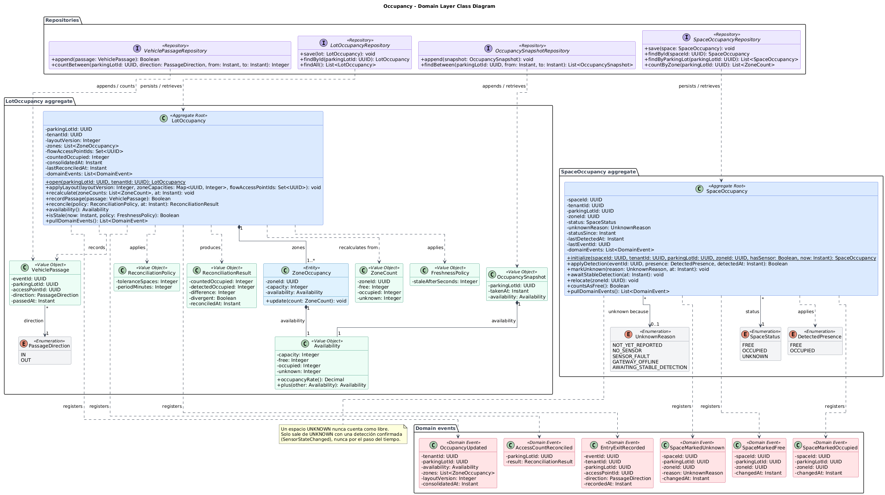

#### 5.4.7.2. Bounded Context Database Design Diagram

El esquema `occupancy` de PostgreSQL separa el estado de cada espacio (`space_occupancy`) del estado del estacionamiento (`lot_occupancy` y `zone_occupancy`), igual que los agregados. `vehicle_passages` usa el `eventId` de Parking Sensing como clave para no registrar dos veces un paso, y `occupancy_snapshots` guarda el historial reciente por minuto. No hay claves foráneas hacia otros esquemas: la estructura del estacionamiento se referencia por identificador (CON-02). El read model de Redis no se incluye porque es una proyección que se reconstruye desde estas tablas.

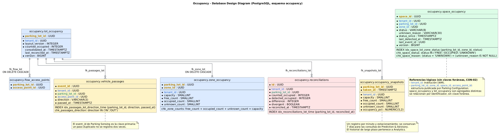

---

## 5.5. Bounded Context: Prediction & Advisory

El Bounded Context Prediction & Advisory es responsable de **anticipar la ocupación de los estacionamientos universitarios** de Quadrapp y de **convertir esa anticipación en una orientación útil para el conductor**: qué tan probable es encontrar un espacio libre al llegar y cuánto falta para que se libere uno cuando el estacionamiento está lleno.

Su principal propósito es producir pronósticos de ocupación para los horizontes de 15, 30, 45 y 60 minutos, indicar con qué confianza fueron generados y derivar de ellos la asesoría de llegada y la estimación de la próxima disponibilidad que consume la aplicación móvil.

Este Bounded Context soporta principalmente:

- US10 — Consultar el pronóstico de ocupación por horizonte, identificando los horizontes faltantes o vencidos.
- US13, US14 y US15 — Recibir asesoría de llegada (probabilidad de encontrar espacio, categoría y confianza) a partir del tiempo estimado de llegada (ETA).
- US36 — Conocer la próxima disponibilidad cuando el estacionamiento está lleno.
- TS07 — Servicio de predicción de ocupación con modelo principal y respaldo (FALLBACK).
- TS02 — Es consumido por el módulo de composición (`GET /mobile/home`) para componer la pantalla de inicio.
- US35 — Regenerar los pronósticos cuando se registra o se cancela un evento del campus.


Las principales responsabilidades del Bounded Context Prediction & Advisory son:

- Generar periódicamente un pronóstico por estacionamiento y por horizonte (15, 30, 45 y 60 minutos).
- Registrar, para cada pronóstico, la ocupación esperada, la confianza, el método utilizado y la versión del modelo.
- Aplicar una heurística de respaldo (FALLBACK) con confianza baja cuando el modelo principal no está disponible o no existe historial suficiente.
- Indicar cuándo se espera que un estacionamiento alcance su umbral de saturación.
- Informar si un pronóstico está vigente, vencido o faltante, sin depender del reloj del dispositivo.
- Derivar la asesoría de llegada (probabilidad de espacio, categoría, confianza y horizonte utilizado) a partir del pronóstico vigente y del ETA.
- Estimar el rango de minutos hasta la próxima liberación cuando no hay espacios libres, o indicar que no puede estimarse cuando no hay salidas.
- Publicar el evento `ForecastGenerated` para Analytics y el evento `SaturationPredicted` para Notifications, como Published Language, sin exponer el modelo interno de este contexto.
- Garantizar que el servidor reciba únicamente el ETA en minutos, nunca coordenadas, y que ese ETA no se almacene.
- Regenerar los pronósticos de un estacionamiento cuando Parking Configuration registra o cancela un evento del campus que afecta los próximos 60 minutos (`CampusEventProvided` y `CampusEventCancelled`).

### Class Dictionary

La siguiente tabla resume las clases e interfaces principales requeridas por Prediction & Advisory.

| Class / Interface | Layer | Purpose | Main attributes | Main operations |
|---|---|---|---|---|
| Forecast | Domain | Aggregate Root. Representa el pronóstico de ocupación de un estacionamiento para un horizonte determinado. | forecastId, tenantId, parkingLotId, horizon, generatedAt, targetAt, expectedOccupancy, confidence, method, modelVersion, saturation | validUntil(), isExpiredAt(), isFallback(), predictsSaturation(), pullDomainEvents() |
| ForecastGenerated | Domain | Evento de dominio que anuncia que se generó un pronóstico. | forecastId, tenantId, parkingLotId, generatedAt, targetAt, horizonMinutes, modelVersion, expectedOccupancyPct, confidenceLevel, method, saturationExpectedAt | — |
| OccupancyPercentage | Domain | Value Object que representa un porcentaje de ocupación entre 0 % y 100 %. | value | value(), isValid(), isAtOrAbove(), distanceTo() |
| Probability | Domain | Value Object que representa un valor entre 0 y 1. | value | value(), isValid(), complement() |
| Confidence | Domain | Value Object que representa qué tan confiable es un pronóstico o una asesoría. | value, level | of(), value(), level(), isLow(), lowerOneLevel() |
| Saturation | Domain | Value Object que representa el momento en que se espera alcanzar el umbral de saturación. | expectedAt, thresholdPct | expectedAt(), thresholdPct(), minutesFrom() |
| ModelPrediction | Domain | Value Object con el resultado crudo entregado por el modelo para un horizonte. | horizon, expectedOccupancy, confidenceValue, modelVersion | — |
| ParkingLotProfile | Domain | Value Object con los datos mínimos del estacionamiento que Prediction & Advisory necesita. | tenantId, parkingLotId, saturationThreshold, flowWindowMinutes | belongsTo() |
| EtaMinutes | Domain | Value Object que representa el tiempo estimado de llegada en minutos (0 a 120). | value | value(), isValid(), exceeds() |
| ArrivalAdvice | Domain | Value Object derivado que resume la asesoría de llegada. No se persiste. | etaMinutes, probabilityOfSpace, category, confidence, horizonUsed, generatedAt | isLowConfidence() |
| NextAvailability | Domain | Value Object derivado con el rango estimado hasta la próxima liberación. No se persiste. | available, minMinutes, maxMinutes, reason | estimated(), notNeeded(), noExits(), isEstimated() |
| AdvisoryPolicy | Domain | Value Object con los umbrales configurables que se aplican al clasificar probabilidad, confianza y rango. | highFrom, limitedFrom, highConfidenceFrom, mediumConfidenceFrom, fallbackConfidence, rangeSpread | categoryFor(), confidenceLevelFor() |
| ForecastHorizon | Domain | Enumeración de los horizontes admitidos. | M15, M30, M45, M60 | minutes(), fromMinutes(), smallestCovering() |
| ForecastMethod | Domain | Enumeración del método con el que se generó un pronóstico. | PRIMARY_MODEL, FALLBACK | — |
| ConfidenceLevel | Domain | Enumeración del nivel de confianza. | HIGH, MEDIUM, LOW | — |
| ArrivalCategory | Domain | Enumeración de la categoría de la asesoría de llegada. | HIGH, LIMITED, LOW | — |
| UnavailabilityReason | Domain | Enumeración del motivo por el que no se entrega un rango de próxima disponibilidad. | HAS_FREE_SPACES, NO_EXITS | — |
| ForecastRepository | Domain | Abstracción para almacenar y consultar pronósticos. | — | save(), findById(), findLatest(), findLatestByLot() |
| ForecastDomainService | Domain | Construye pronósticos a partir del resultado del modelo o de la heurística de respaldo y estima la saturación. | policy | assembleFromModel(), assembleFallback(), estimateSaturation() |
| AdvisoryDomainService | Domain | Selecciona el pronóstico adecuado, deriva la asesoría de llegada y estima la próxima disponibilidad. | policy | adviseArrival(), selectForecast(), estimateNextAvailability() |
| GetForecastQuery | Application | Solicitud para consultar el pronóstico de un estacionamiento y un horizonte. | tenantId, parkingLotId, horizon | — |
| GetForecastQueryHandler | Application | Coordina la consulta de un pronóstico y determina si está vigente o vencido. | Dependencies | handle() |
| GetForecastsQuery | Application | Solicitud para consultar los pronósticos de todos los horizontes de un estacionamiento. | tenantId, parkingLotId | — |
| GetForecastsQueryHandler | Application | Coordina la consulta de los cuatro horizontes marcando los faltantes y vencidos. | Dependencies | handle() |
| GetArrivalAdviceQuery | Application | Solicitud para calcular la asesoría de llegada. | tenantId, parkingLotId, eta | — |
| GetArrivalAdviceQueryHandler | Application | Coordina el cálculo de la asesoría de llegada sin persistir el ETA. | Dependencies | handle() |
| GetNextAvailabilityQuery | Application | Solicitud para estimar la próxima disponibilidad de un estacionamiento. | tenantId, parkingLotId | — |
| GetNextAvailabilityQueryHandler | Application | Coordina la estimación de la próxima disponibilidad. | Dependencies | handle() |
| GenerateForecastsCommand | Application | Instrucción para generar los pronósticos de un estacionamiento. | parkingLotId | — |
| GenerateForecastsCommandHandler | Application | Coordina la generación de pronósticos con el modelo o con la heurística de respaldo. | Dependencies | handle() |
| ForecastResult | Application | Resultado de la consulta de un pronóstico. | forecast, status, serverTime | — |
| ForecastSetResult | Application | Resultado de la consulta de todos los horizontes. | parkingLotId, items, serverTime | — |
| ArrivalAdviceResult | Application | Resultado del cálculo de la asesoría de llegada. | advice, serverTime | — |
| NextAvailabilityResult | Application | Resultado de la estimación de próxima disponibilidad. | availability, serverTime | — |
| OccupancyReader | Application | Puerto de salida hacia Occupancy. | — | currentOccupancy(), freeSpaces(), exitsInWindow(), recentSnapshots() |
| ParkingLotSettingsReader | Application | Puerto de salida hacia Parking Configuration. | — | profileOf(), activeLots(), calendarEventsAround() |
| PredictionModelPort | Application | Puerto de salida hacia el modelo de predicción. | — | predict() |
| ForecastEventPublisher | Application | Puerto de salida para publicar eventos de dominio. | — | publish() |
| ForecastQueryController | Interface | Expone la consulta de pronósticos y de próxima disponibilidad. | Query Handler dependencies | getForecast(), getNextAvailability() |
| ArrivalAdviceController | Interface | Expone el cálculo de la asesoría de llegada. | Query Handler dependency | requestAdvice() |
| PredictionAdvisoryFacade | Interface | Fachada (Open Host Service) que usan el módulo de composición y los demás módulos para consultar pronósticos y asesoría en el mismo proceso. | Query Handler dependencies | forecastsOf(), adviceFor(), nextAvailabilityOf() |
| ForecastScheduler | Interface | Dispara de forma periódica la generación de pronósticos. | Command Handler dependencies | generateForecasts() |
| CampusEventListener | Interface | Consumer de los eventos `CampusEventProvided` y `CampusEventCancelled` de Parking Configuration. | Event Handler dependency | on() |
| CampusEventChangedEventHandler | Application | Event Handler que decide si un evento del campus obliga a regenerar los pronósticos. | Dependencies | handle() |
| ArrivalAdviceRequest | Interface | Representación de la solicitud de asesoría. Solo admite dos campos. | lotId, etaMinutes | — |
| ForecastResponse | Interface | Representación del pronóstico entregado al cliente. | lotId, horizon, expectedOccupancyPct, confidence, method, generatedAt, validUntil, saturation, serverTime | — |
| ArrivalAdviceResponse | Interface | Representación de la asesoría entregada al cliente. | etaMinutes, probabilityOfSpace, category, confidence, horizonUsed, generatedAt, serverTime | — |
| NextAvailabilityResponse | Interface | Representación de la próxima disponibilidad entregada al cliente. | available, minMinutes, maxMinutes, reason, serverTime | — |
| ForecastRepositoryAdapter | Infrastructure | Implementa la persistencia de pronósticos sobre la tabla `prediction.forecasts`. | Persistence dependency | save(), findById(), findLatest(), findLatestByLot() |
| OccupancyReaderAdapter | Infrastructure | Capa anticorrupción que consulta la fachada de Occupancy. | Integration dependency | currentOccupancy(), freeSpaces(), exitsInWindow(), recentSnapshots() |
| ParkingLotSettingsReaderAdapter | Infrastructure | Encapsula el acceso a la configuración del estacionamiento. | Integration dependency | profileOf(), activeLots(), calendarEventsAround() |
| PredictionModelClient | Infrastructure | Encapsula la comunicación con el modelo de predicción. | Model dependency, timeout | predict() |
| ForecastEventPublisherAdapter | Infrastructure | Encapsula el mecanismo técnico de publicación de `ForecastGenerated`. | Messaging dependency | publish() |


### 5.5.1. Domain Layer


La Domain Layer contiene los conceptos, reglas y abstracciones de negocio que permiten generar, interpretar y usar los pronósticos de ocupación. No depende de HTTP, bases de datos, mensajería, del modelo de predicción concreto ni de frameworks.


**Aggregate 1: Forecast**

|Nombre|Categoría|Descripción|
|-|-|-|
|Forecast|Aggregate Root|Representa el pronóstico de ocupación de un estacionamiento para un horizonte determinado. Conserva el método, la versión del modelo y la confianza con que se generó.|

Attributes

|Nombre|Tipo de dato|Visibilidad|Descripción|
|-|-|-|-|
|forecastId|UUID|Private|Identificador único del pronóstico.|
|tenantId|UUID|Private|Referencia externa a la institución propietaria de la información (IAM).|
|parkingLotId|UUID|Private|Referencia externa al estacionamiento pronosticado (Parking Configuration).|
|horizon|ForecastHorizon|Private|Horizonte del pronóstico: 15, 30, 45 o 60 minutos.|
|generatedAt|Instant|Private|Momento en que se generó el pronóstico.|
|targetAt|Instant|Private|Momento futuro para el que se estima la ocupación; es `generatedAt` más el horizonte.|
|expectedOccupancy|OccupancyPercentage|Private|Porcentaje de ocupación esperado en `targetAt`.|
|confidence|Confidence|Private|Valor y nivel de confianza del pronóstico.|
|method|ForecastMethod|Private|Indica si se generó con el modelo principal o con la heurística de respaldo.|
|modelVersion|String|Private|Versión del modelo o identificador de la política de respaldo.|
|saturation|Saturation?|Private|Momento esperado de saturación, cuando el pronóstico lo anticipa.|
|domainEvents|`List<DomainEvent>`|Private|Eventos de dominio pendientes de publicación.|

Methods

|Nombre|Tipo de retorno|Visibilidad|Descripción|
|-|-|-|-|
|validUntil()|Instant|Public|Momento hasta el cual el pronóstico es vigente; coincide con `targetAt`.|
|isExpiredAt(now: Instant)|Boolean|Public|Indica si el pronóstico ya no es vigente en el instante dado.|
|isFallback()|Boolean|Public|Indica si se generó con la heurística de respaldo.|
|predictsSaturation()|Boolean|Public|Indica si anticipa que se alcanzará el umbral de saturación.|
|pullDomainEvents()|`List<DomainEvent>`|Public|Entrega y vacía los eventos de dominio pendientes.|

Una vez generado, un pronóstico es inmutable: no cambia su ocupación esperada, su confianza, su método ni su versión. La precisión del modelo no se calcula en este contexto, sino en Analytics, que compara cada pronóstico con la ocupación observada. `tenantId` y `parkingLotId` son referencias a otros contextos y no hacen que Tenant ni ParkingLot pertenezcan al agregado.

**Domain Event: ForecastGenerated**

|Nombre|Categoría|Descripción|
|-|-|-|
|ForecastGenerated|Domain Event|Anuncia que se generó un pronóstico. Lo consume Analytics para su `ForecastSnapshot`. Cuando el pronóstico prevé saturación se publica además `SaturationPredicted` (parkingLotId, tenantId, horizonMinutes, saturationExpectedAt), que consume Notifications. Ninguno incluye datos del conductor.|

Attributes

|Nombre|Tipo de dato|Visibilidad|Descripción|
|-|-|-|-|
|forecastId|UUID|Private|Identificador del pronóstico generado.|
|tenantId|UUID|Private|Institución a la que pertenece el pronóstico.|
|parkingLotId|UUID|Private|Estacionamiento sobre el que se realizó la predicción.|
|generatedAt|Instant|Private|Momento en que se generó.|
|targetAt|Instant|Private|Momento futuro para el que se estimó la ocupación.|
|horizonMinutes|Integer|Private|Horizonte utilizado, en minutos.|
|modelVersion|String|Private|Versión del modelo con la que se generó.|
|expectedOccupancyPct|Decimal|Private|Ocupación esperada, entre 0 y 100.|
|confidenceLevel|ConfidenceLevel|Private|Nivel de confianza del pronóstico.|
|method|ForecastMethod|Private|Método con el que se generó.|
|saturationExpectedAt|Instant?|Private|Momento esperado de saturación, cuando existe.|

**Value Object: OccupancyPercentage**

|Nombre|Categoría|Descripción|
|-|-|-|
|OccupancyPercentage|Value Object|Porcentaje de ocupación esperado, observado o umbral. Se recibe de Occupancy con la regla de que un espacio sin dato (UNKNOWN) nunca cuenta como libre.|

Attributes

|Nombre|Tipo de dato|Visibilidad|Descripción|
|-|-|-|-|
|value|Decimal|Private|Porcentaje en el intervalo de 0 a 100.|

Methods

|Nombre|Tipo de retorno|Visibilidad|Descripción|
|-|-|-|-|
|value()|Decimal|Public|Devuelve el porcentaje.|
|isValid()|Boolean|Public|Determina si el valor está entre 0 % y 100 %.|
|isAtOrAbove(other: OccupancyPercentage)|Boolean|Public|Indica si es igual o superior a otro porcentaje (por ejemplo, al umbral de saturación).|
|distanceTo(other: OccupancyPercentage)|Decimal|Public|Diferencia absoluta, en puntos porcentuales, respecto de otro porcentaje.|

**Value Object: Probability**

|Nombre|Categoría|Descripción|
|-|-|-|
|Probability|Value Object|Valor entre 0 y 1 (probabilidad o confianza). Se mantiene separado de `OccupancyPercentage` (0 a 100) para no confundir las escalas.|

Attributes

|Nombre|Tipo de dato|Visibilidad|Descripción|
|-|-|-|-|
|value|Decimal|Private|Valor en el intervalo de 0 a 1.|

Methods

|Nombre|Tipo de retorno|Visibilidad|Descripción|
|-|-|-|-|
|value()|Decimal|Public|Devuelve el valor.|
|isValid()|Boolean|Public|Determina si el valor está entre 0 y 1.|
|complement()|Probability|Public|Devuelve 1 menos el valor.|

**Value Object: Confidence**

|Nombre|Categoría|Descripción|
|-|-|-|
|Confidence|Value Object|Qué tan confiable es un pronóstico o una asesoría: valor numérico y nivel cualitativo.|

Attributes

|Nombre|Tipo de dato|Visibilidad|Descripción|
|-|-|-|-|
|value|Probability|Private|Valor de confianza entre 0 y 1.|
|level|ConfidenceLevel|Private|Nivel cualitativo: HIGH, MEDIUM o LOW.|

Methods

|Nombre|Tipo de retorno|Visibilidad|Descripción|
|-|-|-|-|
|of(value: Probability, method: ForecastMethod, policy: AdvisoryPolicy)|Confidence|Public (static)|Construye una confianza. El nivel sale de `AdvisoryPolicy`; con método FALLBACK es siempre LOW.|
|value()|Probability|Public|Devuelve el valor numérico.|
|level()|ConfidenceLevel|Public|Devuelve el nivel cualitativo.|
|isLow()|Boolean|Public|Indica si el nivel es LOW.|
|lowerOneLevel()|Confidence|Public|Devuelve una confianza un nivel más baja (HIGH pasa a MEDIUM y MEDIUM a LOW).|

**Value Object: Saturation**

|Nombre|Categoría|Descripción|
|-|-|-|
|Saturation|Value Object|Momento en que se espera que el estacionamiento alcance su umbral de saturación.|

Attributes

|Nombre|Tipo de dato|Visibilidad|Descripción|
|-|-|-|-|
|expectedAt|Instant|Private|Momento esperado de saturación; está entre `generatedAt` y `targetAt` del pronóstico.|
|thresholdPct|OccupancyPercentage|Private|Umbral de saturación del estacionamiento usado en el cálculo (no se persiste; se reconstruye desde la configuración vigente).|

Methods

|Nombre|Tipo de retorno|Visibilidad|Descripción|
|-|-|-|-|
|expectedAt()|Instant|Public|Devuelve el momento esperado de saturación.|
|thresholdPct()|OccupancyPercentage|Public|Devuelve el umbral utilizado.|
|minutesFrom(now: Instant)|Integer|Public|Minutos que faltan para la saturación desde el instante dado.|

**Value Object: ModelPrediction**

|Nombre|Categoría|Descripción|
|-|-|-|
|ModelPrediction|Value Object|Resultado crudo que entrega el modelo para un horizonte, antes de convertirse en un `Forecast`.|

Attributes

|Nombre|Tipo de dato|Visibilidad|Descripción|
|-|-|-|-|
|horizon|ForecastHorizon|Private|Horizonte al que corresponde la predicción.|
|expectedOccupancy|OccupancyPercentage|Private|Ocupación esperada calculada por el modelo.|
|confidenceValue|Probability|Private|Confianza informada por el modelo.|
|modelVersion|String|Private|Versión del modelo que produjo la predicción.|

**Value Object: ParkingLotProfile**

|Nombre|Categoría|Descripción|
|-|-|-|
|ParkingLotProfile|Value Object|Datos mínimos del estacionamiento que necesita este contexto, sin importar el modelo completo de Parking Configuration.|

Attributes

|Nombre|Tipo de dato|Visibilidad|Descripción|
|-|-|-|-|
|tenantId|UUID|Private|Institución propietaria del estacionamiento.|
|parkingLotId|UUID|Private|Identificador del estacionamiento.|
|saturationThreshold|OccupancyPercentage|Private|Umbral a partir del cual se considera saturado.|
|flowWindowMinutes|Integer|Private|Ventana, en minutos, para medir el flujo de salidas.|

Methods

|Nombre|Tipo de retorno|Visibilidad|Descripción|
|-|-|-|-|
|belongsTo(tenantId: UUID)|Boolean|Public|Indica si el estacionamiento pertenece a la institución dada.|

**Value Object: EtaMinutes**

|Nombre|Categoría|Descripción|
|-|-|-|
|EtaMinutes|Value Object|Tiempo estimado de llegada en minutos (0 a 120). Es el único dato del trayecto que el servidor conoce: no contiene coordenadas, ruta ni identificación del conductor. El ETA se estima en la app móvil.|

Attributes

|Nombre|Tipo de dato|Visibilidad|Descripción|
|-|-|-|-|
|value|Integer|Private|Minutos hasta la llegada, entre 0 y 120.|

Methods

|Nombre|Tipo de retorno|Visibilidad|Descripción|
|-|-|-|-|
|value()|Integer|Public|Devuelve los minutos.|
|isValid()|Boolean|Public|Determina si es un entero entre 0 y 120.|
|exceeds(horizon: ForecastHorizon)|Boolean|Public|Indica si el ETA es mayor que el horizonte dado.|

**Value Object: ArrivalAdvice**

|Nombre|Categoría|Descripción|
|-|-|-|
|ArrivalAdvice|Value Object (derivado, no persistido)|Qué tan probable es encontrar un espacio libre al llegar, para un ETA determinado. Se calcula en cada solicitud.|

Attributes

|Nombre|Tipo de dato|Visibilidad|Descripción|
|-|-|-|-|
|etaMinutes|EtaMinutes|Private|ETA con el que se calculó la asesoría.|
|probabilityOfSpace|Probability|Private|Probabilidad de encontrar al menos un espacio libre al llegar.|
|category|ArrivalCategory|Private|Categoría derivada de la probabilidad: HIGH, LIMITED o LOW.|
|confidence|Confidence|Private|Confianza de la asesoría.|
|horizonUsed|ForecastHorizon|Private|Horizonte del pronóstico utilizado.|
|generatedAt|Instant|Private|Momento en que se generó el pronóstico utilizado (permite mostrar la antigüedad del dato).|

Methods

|Nombre|Tipo de retorno|Visibilidad|Descripción|
|-|-|-|-|
|isLowConfidence()|Boolean|Public|Indica si la confianza de la asesoría es baja.|

**Value Object: NextAvailability**

|Nombre|Categoría|Descripción|
|-|-|-|
|NextAvailability|Value Object (derivado, no persistido)|Rango estimado de minutos hasta la próxima liberación de un espacio cuando el estacionamiento está lleno, o el motivo por el que no se entrega.|

Attributes

|Nombre|Tipo de dato|Visibilidad|Descripción|
|-|-|-|-|
|available|Boolean|Private|Indica si existe una estimación.|
|minMinutes|Integer?|Private|Límite inferior del rango; solo cuando `available` es verdadero.|
|maxMinutes|Integer?|Private|Límite superior del rango; solo cuando `available` es verdadero.|
|reason|UnavailabilityReason?|Private|Motivo por el que no hay estimación; solo cuando `available` es falso.|

Methods

|Nombre|Tipo de retorno|Visibilidad|Descripción|
|-|-|-|-|
|estimated(min: Integer, max: Integer)|NextAvailability|Public (static)|Construye una estimación con rango.|
|notNeeded()|NextAvailability|Public (static)|Caso con espacios libres (reason = HAS_FREE_SPACES).|
|noExits()|NextAvailability|Public (static)|Caso sin salidas con las cuales estimar (reason = NO_EXITS).|
|isEstimated()|Boolean|Public|Indica si contiene un rango.|

**Value Object: AdvisoryPolicy**

|Nombre|Categoría|Descripción|
|-|-|-|
|AdvisoryPolicy|Value Object|Umbrales configurables que clasifican la probabilidad, la confianza y el rango de próxima disponibilidad, para que no queden dispersos en los servicios de dominio.|

Attributes

|Nombre|Tipo de dato|Visibilidad|Descripción|
|-|-|-|-|
|highFrom|Probability|Private|Probabilidad mínima para la categoría HIGH.|
|limitedFrom|Probability|Private|Probabilidad mínima para LIMITED; por debajo es LOW.|
|highConfidenceFrom|Probability|Private|Confianza mínima para el nivel HIGH.|
|mediumConfidenceFrom|Probability|Private|Confianza mínima para el nivel MEDIUM; por debajo es LOW.|
|fallbackConfidence|Probability|Private|Confianza asignada a los pronósticos de respaldo (siempre menor que `mediumConfidenceFrom`).|
|rangeSpread|Decimal|Private|Amplitud relativa del rango de próxima disponibilidad alrededor del valor central.|

Methods

|Nombre|Tipo de retorno|Visibilidad|Descripción|
|-|-|-|-|
|categoryFor(probability: Probability)|ArrivalCategory|Public|Devuelve la categoría que corresponde a una probabilidad.|
|confidenceLevelFor(value: Probability)|ConfidenceLevel|Public|Devuelve el nivel de confianza que corresponde a un valor.|

Los valores iniciales de `AdvisoryPolicy` se calibran con los datos del piloto (TS07); el modelo solo exige `limitedFrom` < `highFrom` y `mediumConfidenceFrom` < `highConfidenceFrom`.

**Enumerations**

|Nombre|Categoría|Valores|Descripción|
|-|-|-|-|
|ForecastHorizon|Enumeration|M15, M30, M45, M60|Horizontes admitidos para un pronóstico.|
|ForecastMethod|Enumeration|PRIMARY_MODEL, FALLBACK|Método con el que se generó un pronóstico.|
|ConfidenceLevel|Enumeration|HIGH, MEDIUM, LOW|Nivel cualitativo de confianza.|
|ArrivalCategory|Enumeration|HIGH, LIMITED, LOW|Categoría de la asesoría de llegada: HIGH (es probable encontrar espacio), LIMITED (la disponibilidad será limitada), LOW (es poco probable).|
|UnavailabilityReason|Enumeration|HAS_FREE_SPACES, NO_EXITS|Motivo por el que no se entrega un rango: HAS_FREE_SPACES (hay espacios libres) o NO_EXITS (lleno y sin salidas recientes).|

Methods de `ForecastHorizon`

|Nombre|Tipo de retorno|Visibilidad|Descripción|
|-|-|-|-|
|minutes()|Integer|Public|Devuelve el horizonte en minutos.|
|fromMinutes(minutes: Integer)|ForecastHorizon|Public (static)|Convierte un entero en horizonte; rechaza todo valor distinto de 15, 30, 45 o 60.|
|smallestCovering(eta: EtaMinutes)|ForecastHorizon|Public (static)|Menor horizonte que cubre un ETA; si el ETA supera 60 minutos devuelve M60.|

**Repository: ForecastRepository**

|Nombre|Categoría|Descripción|
|-|-|-|
|ForecastRepository|Repository (interfaz)|Define cómo persistir y recuperar pronósticos sin acoplar el dominio a una tecnología de almacenamiento. Toda consulta respeta la institución del usuario.|

Methods

|Nombre|Tipo de retorno|Visibilidad|Descripción|
|-|-|-|-|
|save(forecast: Forecast)|Void|Public|Guarda un pronóstico nuevo.|
|findById(tenantId: UUID, forecastId: UUID)|Forecast?|Public|Recupera un pronóstico dentro de la institución indicada.|
|findLatest(tenantId: UUID, parkingLotId: UUID, horizon: ForecastHorizon)|Forecast?|Public|Pronóstico más reciente de un estacionamiento para un horizonte.|
|findLatestByLot(tenantId: UUID, parkingLotId: UUID)|`List<Forecast>`|Public|Pronósticos más recientes de un estacionamiento, uno por horizonte.|

**Domain Service: ForecastDomainService**

|Nombre|Categoría|Descripción|
|-|-|-|
|ForecastDomainService|Domain Service|Construye pronósticos válidos a partir del resultado del modelo o de la heurística de respaldo y estima el momento de saturación. No invoca al modelo ni accede a la base de datos.|

Attributes

|Nombre|Tipo de dato|Visibilidad|Descripción|
|-|-|-|-|
|policy|AdvisoryPolicy|Private|Política con los umbrales aplicables.|

Methods

|Nombre|Tipo de retorno|Visibilidad|Descripción|
|-|-|-|-|
|assembleFromModel(prediction: ModelPrediction, lot: ParkingLotProfile, current: OccupancyPercentage, now: Instant)|Forecast|Public|Construye un `Forecast` PRIMARY_MODEL a partir de un `ModelPrediction`, calculando `targetAt` y la saturación esperada.|
|assembleFallback(horizon: ForecastHorizon, lot: ParkingLotProfile, current: OccupancyPercentage, now: Instant)|Forecast|Public|Construye un `Forecast` FALLBACK con confianza LOW. |
|estimateSaturation(current: OccupancyPercentage, expected: OccupancyPercentage, horizon: ForecastHorizon, lot: ParkingLotProfile, now: Instant)|Saturation?|Public|Determina si se alcanzará el umbral del estacionamiento.|

**Domain Service: AdvisoryDomainService**

|Nombre|Categoría|Descripción|
|-|-|-|
|AdvisoryDomainService|Domain Service|Selecciona el pronóstico adecuado y deriva la asesoría de llegada y la próxima disponibilidad a partir de datos ya obtenidos por la Application Layer.|

Attributes

|Nombre|Tipo de dato|Visibilidad|Descripción|
|-|-|-|-|
|policy|AdvisoryPolicy|Private|Política con los umbrales de categoría, confianza y rango.|

Methods

|Nombre|Tipo de retorno|Visibilidad|Descripción|
|-|-|-|-|
|`adviseArrival(eta: EtaMinutes, forecasts: List<Forecast>, lot: ParkingLotProfile, now: Instant)`|ArrivalAdvice?|Public|Deriva un `ArrivalAdvice`. La probabilidad vale 1 mientras la ocupación esperada no supere el umbral de saturación y baja linealmente a 0 en 100 %.|
|estimateNextAvailability(freeSpaces: Integer, exitsInWindow: Integer, windowMinutes: Integer)|NextAvailability|Public|Con espacios libres devuelve `notNeeded()`; sin libres y sin salidas en la ventana, `noExits()`.|
|`selectForecast(eta: EtaMinutes, forecasts: List<Forecast>, now: Instant)`|Forecast?|Public|Selecciona el pronóstico vigente más adecuado.|

### Reglas de negocio

1. Todo `Forecast` pertenece a una institución identificada y a un estacionamiento.
2. El horizonte solo puede ser 15, 30, 45 o 60 minutos, y `targetAt` es `generatedAt` más el horizonte.
3. La ocupación esperada está entre 0 % y 100 %; el valor de confianza, entre 0 y 1.
4. Todo pronóstico conserva su método y la versión del modelo, también cuando se generó con el respaldo.
5. Un pronóstico FALLBACK tiene siempre nivel de confianza LOW.
6. Si el modelo no está disponible, no responde a tiempo, omite un horizonte o no hay historial suficiente, se genera el pronóstico con el método FALLBACK, que asume que la ocupación esperada es la actual.
7. Si no existe una lectura de ocupación utilizable, no se genera ningún pronóstico; el contexto no inventa un valor.
8. Un pronóstico es vigente hasta su `targetAt` (`validUntil`). Uno vencido se devuelve marcado, junto con la hora del servidor, y no se usa para la asesoría.
9. Un horizonte para el que nunca se generó un pronóstico se informa como faltante.
10. Un pronóstico no cambia una vez generado.
11. La saturación esperada solo existe cuando el pronóstico anticipa alcanzar el umbral del estacionamiento, y su momento está entre `generatedAt` y `targetAt`.
12. El ETA es un entero entre 0 y 120 minutos.
13. La asesoría usa el menor horizonte vigente que cubre el ETA. Si el ETA supera 60 minutos, o solo hay un horizonte menor que el ETA, usa el más cercano y baja un nivel la confianza.
14. La probabilidad de espacio es 1 mientras la ocupación esperada no supere el umbral de saturación y baja linealmente hasta 0 al 100 %. La categoría sale de `AdvisoryPolicy`.
15. Con un pronóstico FALLBACK la asesoría tiene confianza LOW y su categoría nunca es más optimista que LIMITED.
16. La próxima disponibilidad solo se estima cuando no hay espacios libres; un espacio sin dato (UNKNOWN) nunca cuenta como libre.
17. Si el estacionamiento está lleno y no hubo salidas en la ventana de flujo, se informa NO_EXITS y no se estima. Si las hubo, el rango se calcula como `ventana / salidas`, ampliado por `rangeSpread`, con un mínimo de 1 minuto.
18. La asesoría y la próxima disponibilidad se calculan en cada solicitud y no se persisten.
19. El servidor recibe solo `lotId` y `etaMinutes`; nunca recibe, guarda ni registra coordenadas ni trayectos.
20. Todo acceso se realiza dentro de la institución del usuario autenticado.
21. El contexto no modifica el estado de Occupancy, no procesa señales de sensores y no calcula las métricas de precisión que muestra Analytics.

### 5.5.2. Interface Layer


La Interface Layer expone las capacidades del Bounded Context a la aplicación móvil, al módulo de composición y a los procesos programados. Recibe solicitudes, valida su forma, las transforma en Queries o Commands, delega en la Application Layer y representa el resultado. No contiene reglas de negocio. La institución se obtiene siempre del token validado por IAM, nunca de un parámetro; un estacionamiento de otra institución se responde como no encontrado.

**Controller 1: ForecastQueryController**

|Nombre|Categoría|Descripción|
|-|-|-|
|ForecastQueryController|Controller (REST)|Recibe las consultas de pronóstico y de próxima disponibilidad.|

Attributes

|Nombre|Tipo de dato|Visibilidad|Descripción|
|-|-|-|-|
|getForecastHandler|GetForecastQueryHandler|Private|Caso de uso: consultar un pronóstico.|
|getNextAvailabilityHandler|GetNextAvailabilityQueryHandler|Private|Caso de uso: próxima disponibilidad.|

Methods

|Nombre|Tipo de retorno|Visibilidad|Descripción|
|-|-|-|-|
|getForecast(lotId: UUID, horizon: Integer)|`ResponseEntity<ForecastResponse>`|Public|`GET /api/v1/forecasts?lotId={lotId}&horizon={15,30,45,60}`. Un pronóstico vencido se devuelve igual; el cliente compara `validUntil` con `serverTime`.|
|getNextAvailability(lotId: UUID)|`ResponseEntity<NextAvailabilityResponse>`|Public|`GET /api/v1/forecasts/{lotId}/next-availability`. Devuelve el rango o el motivo de no estimación.|

Respuesta de `getForecast`:

```json
{
  "lotId": "7c1f2b0e-5a3d-4c61-9f0e-2b6a1d8e4c10", "horizon": 30, "expectedOccupancyPct": 86.5,
  "confidence": { "value": 0.72, "level": "MEDIUM" }, "method": "PRIMARY_MODEL",
  "generatedAt": "2026-03-10T13:41:05.120Z", "validUntil": "2026-03-10T14:11:05.120Z",
  "saturation": { "expectedAt": "2026-03-10T14:02:00Z", "pct": 90 }, "serverTime": "2026-03-10T13:44:12.400Z"
}
```

|Situación|Respuesta|
|-|-|
|Horizonte distinto de 15, 30, 45 o 60|400|
|Estacionamiento inexistente o de otra institución|404|
|Nunca se generó un pronóstico para ese horizonte|404, pronóstico faltante|
|Token ausente o inválido|401|

**Controller 2: ArrivalAdviceController**

|Nombre|Categoría|Descripción|
|-|-|-|
|ArrivalAdviceController|Controller (REST)|Recibe `lotId` y `etaMinutes` y devuelve la asesoría de llegada.|

Attributes

|Nombre|Tipo de dato|Visibilidad|Descripción|
|-|-|-|-|
|getArrivalAdviceHandler|GetArrivalAdviceQueryHandler|Private|Caso de uso: asesoría de llegada.|

Methods

|Nombre|Tipo de retorno|Visibilidad|Descripción|
|-|-|-|-|
|requestAdvice(request: ArrivalAdviceRequest)|`ResponseEntity<ArrivalAdviceResponse>`|Public|`POST /api/v1/arrival-advices`. El ETA viaja en el cuerpo; cualquier otro campo se rechaza con 400.|

Solicitud y respuesta:

```json
{ "lotId": "7c1f2b0e-5a3d-4c61-9f0e-2b6a1d8e4c10", "etaMinutes": 20 }

{ "etaMinutes": 20, "probabilityOfSpace": 0.64, "category": "LIMITED",
  "confidence": { "value": 0.55, "level": "MEDIUM" }, "horizonUsed": 30,
  "generatedAt": "2026-03-10T13:41:05.120Z", "serverTime": "2026-03-10T13:44:12.400Z" }
```

|Situación|Respuesta|
|-|-|
|`etaMinutes` fuera de 0 a 120 o no entero|400|
|El cuerpo trae campos adicionales (por ejemplo, coordenadas)|400|
|Estacionamiento inexistente o de otra institución|404|
|No hay pronóstico vigente para calcular la asesoría|404, asesoría no disponible|

**Facade 1: PredictionAdvisoryFacade**

|Nombre|Categoría|Descripción|
|-|-|-|
|PredictionAdvisoryFacade|Facade|Fachada en proceso que usan el módulo de composición (TS02) y los demás módulos.|

Methods

|Nombre|Tipo de retorno|Visibilidad|Descripción|
|-|-|-|-|
|forecastsOf(tenantId: UUID, parkingLotId: UUID)|ForecastSetResult|Public|Estado de los cuatro horizontes.|
|adviceFor(tenantId: UUID, parkingLotId: UUID, eta: EtaMinutes)|ArrivalAdviceResult?|Public|Asesoría; ninguna si no hay pronóstico vigente o ETA.|
|nextAvailabilityOf(tenantId: UUID, parkingLotId: UUID)|NextAvailabilityResult|Public|Próxima disponibilidad.|

**Scheduler 1: ForecastScheduler**

|Nombre|Categoría|Descripción|
|-|-|-|
|ForecastScheduler|Scheduler|Dispara la generación periódica de pronósticos.|

Methods

|Nombre|Tipo de retorno|Visibilidad|Descripción|
|-|-|-|-|
|generateForecasts()|Void|Public|Envía un `GenerateForecastsCommand` por estacionamiento activo.|

Cada estacionamiento se procesa de forma aislada: un fallo se registra y no detiene a los demás. Con varias instancias, la ejecución se protege con un bloqueo.

**Consumer 1: CampusEventListener**

|Nombre|Categoría|Descripción|
|-|-|-|
|CampusEventListener|Consumer (`@TransactionalEventListener`)|Recibe los eventos del calendario que publica Parking Configuration y los entrega a `CampusEventChangedEventHandler`.|

Methods

|Nombre|Tipo de retorno|Visibilidad|Descripción|
|-|-|-|-|
|on(event: CampusEventProvided)|Void|Public|Evento del campus registrado (US35, escenario 2).|
|on(event: CampusEventCancelled)|Void|Public|Evento del campus cancelado (US35, escenario 3). Corresponde al mensaje de entrada "Evento del campus cancelado" del Bounded Context Canvas.|

**Data Transfer Objects**

|Nombre|Categoría|Atributos|Descripción|
|-|-|-|-|
|ArrivalAdviceRequest|Request DTO|lotId, etaMinutes|Entrada de la asesoría; no admite otros campos.|
|ForecastResponse|Response DTO|lotId, horizon, expectedOccupancyPct, confidence, method, generatedAt, validUntil, saturation, serverTime|Pronóstico entregado al cliente.|
|ArrivalAdviceResponse|Response DTO|etaMinutes, probabilityOfSpace, category, confidence, horizonUsed, generatedAt, serverTime|Asesoría entregada al cliente.|
|NextAvailabilityResponse|Response DTO|available, minMinutes, maxMinutes, reason, serverTime|Próxima disponibilidad entregada al cliente.|

### 5.5.3. Application Layer

La Application Layer coordina los casos de uso de Prediction & Advisory: orquesta el dominio, el repositorio y los puertos hacia otros Bounded Contexts, sin detalles de persistencia, integración ni ejecución del modelo. Sus capacidades son consultar pronósticos (con faltantes y vencidos), calcular la asesoría de llegada, estimar la próxima disponibilidad, generar pronósticos y publicar `ForecastGenerated` y `SaturationPredicted`.

**Queries y Commands**

|Nombre|Categoría|Atributos|Descripción|
|-|-|-|-|
|GetForecastQuery|Query|tenantId: UUID, parkingLotId: UUID, horizon: ForecastHorizon|Pronóstico más reciente de un horizonte.|
|GetForecastsQuery|Query|tenantId: UUID, parkingLotId: UUID|Pronósticos de los cuatro horizontes.|
|GetArrivalAdviceQuery|Query|tenantId: UUID, parkingLotId: UUID, eta: EtaMinutes|Asesoría de llegada para un ETA.|
|GetNextAvailabilityQuery|Query|tenantId: UUID, parkingLotId: UUID|Próxima disponibilidad del estacionamiento.|
|GenerateForecastsCommand|Command|parkingLotId: UUID|Generar los pronósticos de un estacionamiento.|
|CampusEventChanged|Event (entrada)|tenantId: UUID, parkingLotId: UUID, startAt: Instant, endAt: Instant, cancelled: Boolean|Traducción local de `CampusEventProvided` y `CampusEventCancelled`.|

**Query Handlers y Command Handlers**

|Nombre|Categoría|Método|Dependencias|
|-|-|-|-|
|GetForecastQueryHandler|Query Handler|handle(query: GetForecastQuery): ForecastResult|ForecastRepository, ParkingLotSettingsReader, Clock|
|GetForecastsQueryHandler|Query Handler|handle(query: GetForecastsQuery): ForecastSetResult|ForecastRepository, ParkingLotSettingsReader, Clock|
|GetArrivalAdviceQueryHandler|Query Handler|handle(query: GetArrivalAdviceQuery): ArrivalAdviceResult|ForecastRepository, ParkingLotSettingsReader, AdvisoryDomainService, Clock|
|GetNextAvailabilityQueryHandler|Query Handler|handle(query: GetNextAvailabilityQuery): NextAvailabilityResult|ParkingLotSettingsReader, OccupancyReader, AdvisoryDomainService, Clock|
|GenerateForecastsCommandHandler|Command Handler|handle(command: GenerateForecastsCommand): Void|ParkingLotSettingsReader, OccupancyReader, PredictionModelPort, ForecastDomainService, ForecastRepository, ForecastEventPublisher, Clock|
|CampusEventChangedEventHandler|Event Handler|handle(event: CampusEventChanged): Void|GenerateForecastsCommandHandler, Clock|

**Flujos de ejecución**

`GetForecastQueryHandler`:

1. Verifica que el estacionamiento pertenece a la institución.
2. Recupera el pronóstico más reciente del horizonte; si no existe, lo informa como faltante.
3. Determina con la hora del servidor si está vigente o vencido y devuelve un `ForecastResult`.

`GetForecastsQueryHandler`:

1. Verifica la pertenencia del estacionamiento y recupera los pronósticos más recientes.
2. Marca cada horizonte (15, 30, 45, 60) como vigente, vencido o faltante; un faltante no invalida los demás.
3. Devuelve un `ForecastSetResult` con la hora del servidor.

`GetArrivalAdviceQueryHandler`:

1. Obtiene el `ParkingLotProfile` y los pronósticos más recientes.
2. Delega en `AdvisoryDomainService`; si no hay pronóstico vigente, informa que la asesoría no está disponible.
3. Devuelve un `ArrivalAdviceResult`. No almacena ni registra el ETA.

`GetNextAvailabilityQueryHandler`:

1. Obtiene el `ParkingLotProfile`, los espacios libres (sin contar los UNKNOWN) y las salidas dentro de la ventana de flujo.
2. Delega en `AdvisoryDomainService` y devuelve un `NextAvailabilityResult`. Cubre los tres casos de US36: con libres no hay estimación, lleno con salidas da un rango, lleno sin salidas informa que no puede estimarse.

`GenerateForecastsCommandHandler`:

1. Obtiene el `ParkingLotProfile` y la ocupación actual; sin lectura utilizable, termina sin generar pronósticos.
2. Obtiene muestras recientes y eventos de calendario, y pide las predicciones de los cuatro horizontes a `PredictionModelPort`.
3. `ForecastDomainService` construye un `Forecast` PRIMARY_MODEL por cada predicción válida y uno FALLBACK por cada horizonte sin predicción (modelo caído, tiempo agotado, historial insuficiente o respuesta incompleta).
4. Persiste los pronósticos y, ya persistidos, publica `ForecastGenerated` y, si se prevé saturación, `SaturationPredicted`.

`CampusEventChangedEventHandler`:

1. Compara la franja del evento con el intervalo que cubren los pronósticos vigentes (desde ahora hasta 60 minutos después).
2. Si se superponen, ejecuta `GenerateForecastsCommand` para el estacionamiento afectado. Los pronósticos anteriores no se modifican, porque son inmutables: los nuevos los reemplazan como los más recientes.
3. Si la franja empieza después, no hace nada: el evento se considera en la siguiente generación programada, que lee el calendario mediante `calendarEventsAround`.


**Resultados de aplicación**

|Nombre|Categoría|Atributos|
|-|-|-|
|ForecastResult|Result|forecast, status (VALID o EXPIRED), serverTime|
|ForecastSetResult|Result|parkingLotId, items (VALID, EXPIRED o MISSING por horizonte), serverTime|
|ArrivalAdviceResult|Result|advice, serverTime|
|NextAvailabilityResult|Result|availability, serverTime|

`serverTime` sale de un reloj inyectable; la vigencia siempre se compara con esa hora y no con la del dispositivo.

**Puertos de salida**

|Nombre|Categoría|Operaciones|Descripción|
|-|-|-|-|
|ForecastRepository|Puerto (Domain Layer)|save, findById, findLatest, findLatestByLot|Guardar y recuperar pronósticos.|
|OccupancyReader|Puerto hacia Occupancy|currentOccupancy(parkingLotId), freeSpaces(parkingLotId), exitsInWindow(parkingLotId, windowMinutes), recentSnapshots(parkingLotId, from, to)|Leer datos de ocupación.|
|ParkingLotSettingsReader|Puerto hacia Parking Configuration|profileOf(tenantId, parkingLotId), activeLots(), calendarEventsAround(tenantId, from, to)|Leer la configuración necesaria.|
|PredictionModelPort|Puerto hacia el modelo|`predict(features): List<ModelPrediction>`|Obtener predicciones por horizonte.|
|ForecastEventPublisher|Puerto de eventos|publish(events)|Publicar eventos de dominio.|


### 5.5.4. Infrastructure Layer

La Infrastructure Layer contiene las implementaciones técnicas que almacenan pronósticos, obtienen datos de otros Bounded Contexts, invocan al modelo y publican eventos. Implementa las abstracciones del dominio y de la Application Layer, de modo que las capas superiores no dependen de una base de datos, un modelo concreto ni un mecanismo de mensajería.

|Nombre|Categoría|Implementa|Tecnología|Descripción|
|-|-|-|-|-|
|ForecastRepositoryAdapter|Repository (implementación)|ForecastRepository|Spring Data JPA, PostgreSQL|Guarda y recupera pronósticos en la tabla `forecasts`.|
|OccupancyReaderAdapter|Adapter (anti-corruption)|OccupancyReader|Llamada en proceso a la fachada de Occupancy|Lee los datos de ocupación.|
|ParkingLotSettingsReaderAdapter|Adapter (anti-corruption)|ParkingLotSettingsReader|Llamada en proceso a la fachada de Parking Configuration (Open Host Service)|Lee la configuración del estacionamiento.|
|PredictionModelClient|Adapter (cliente del modelo)|PredictionModelPort|Cliente HTTP, Resilience4j|Invoca al modelo y traduce su respuesta a `ModelPrediction`.|
|ForecastEventPublisherAdapter|Adapter (eventos)|ForecastEventPublisher|Eventos de aplicación de Spring|Publica `ForecastGenerated` y `SaturationPredicted` tras confirmar la transacción.|


**Consideraciones**

|Tema|Decisión|
|-|-|
|Propiedad de datos|Este contexto es el único dueño y escritor de `forecasts` y no accede a tablas de otros contextos. Analytics guarda su propio `ForecastSnapshot`; Notifications solo una referencia opcional (`notifications.forecast_id`).|
|Persistencia|La asesoría y la próxima disponibilidad no se persisten: el servidor no conserva el ETA ni el trayecto del conductor.|
|Multi-tenancy|`tenant_id` se almacena en `forecasts` como referencia lógica a IAM, sin clave foránea, y se toma siempre del usuario autenticado, nunca de un parámetro.|
|Tecnología|Módulo del monolito modular en Java 21 y Spring Boot 3, con el esquema `prediction` de PostgreSQL, según DD-01. Domain y Application Layer no dependen de ella.|

### 5.5.6. Bounded Context Software Architecture Component Level Diagrams

El Component Level Diagram descompone el contenedor del Bounded Context en sus componentes: sus responsabilidades, tecnología e interacciones.

#### Containers considerados

| Container | Tecnología | Responsabilidad |
|---|---|---|
| Quadrapp Backend | Java 21, Spring Boot 3 (monolito modular) | Genera pronósticos y deriva la asesoría y la próxima disponibilidad. |
| Base de datos | PostgreSQL (esquema `prediction`) | Almacena la tabla `forecasts`. |

El diagrama descompone el módulo Prediction & Advisory dentro del contenedor Quadrapp Backend. Como colaboradores aparecen la aplicación móvil, el módulo de composición, los módulos Occupancy, Parking Configuration, Analytics y Notifications, la base de datos y el contenedor del modelo de predicción. Las consultas a otros módulos se hacen en proceso, a través de sus fachadas, y los eventos se publican como eventos de aplicación de Spring.

#### Componentes del módulo Prediction & Advisory

| Componente | Capa | Responsabilidad | Tecnología | Clases que lo componen |
|---|---|---|---|---|
| Forecast Query Controller | Interface | Recibe consultas de pronóstico y próxima disponibilidad. | Spring MVC `@RestController` | ForecastQueryController, ForecastResponse, NextAvailabilityResponse |
| Arrival Advice Controller | Interface | Recibe `lotId` y `etaMinutes`. | Spring MVC `@RestController` | ArrivalAdviceController, ArrivalAdviceRequest, ArrivalAdviceResponse |
| Prediction Advisory Facade | Interface | Punto de entrada de los casos de uso para los controladores REST. | Spring bean | PredictionAdvisoryFacade |
| Forecast Scheduler | Interface | Dispara la generación periódica. | Spring `@Scheduled` | ForecastScheduler |
| Campus Event Listener | Interface | Recibe los eventos del campus y solicita la regeneración. | `@TransactionalEventListener` | CampusEventListener, CampusEventChangedEventHandler |
| Query Handlers | Application | Casos de uso de consulta. | Spring `@Service` | GetForecast, GetForecasts, GetArrivalAdvice y GetNextAvailability (Query y Handler) |
| Command Handlers | Application | Caso de uso de comando: generar pronósticos. | Spring `@Service` | GenerateForecastsCommand y GenerateForecastsCommandHandler |
| Advisory Domain Service | Domain | Deriva la asesoría y la próxima disponibilidad. | Java (dominio puro) | AdvisoryDomainService, ArrivalAdvice, NextAvailability, AdvisoryPolicy |
| Forecast Domain Service | Domain | Construye pronósticos y estima la saturación. | Java (dominio puro) | ForecastDomainService, ModelPrediction, ParkingLotProfile |
| Forecast Aggregate | Domain | Mantiene el pronóstico y sus invariantes. | Java (dominio puro) | Forecast, ForecastGenerated, OccupancyPercentage, Probability, Confidence, Saturation, EtaMinutes y las enumeraciones |
| Forecast Repository Adapter | Infrastructure | Guarda y recupera pronósticos por institución. | Spring Data JPA | ForecastRepositoryAdapter |
| Occupancy Reader Adapter | Infrastructure | Lee datos de Occupancy. | Adaptador Java (anti-corruption) | OccupancyReaderAdapter |
| Parking Lot Settings Adapter | Infrastructure | Lee la configuración de Parking Configuration. | Adaptador Java (anti-corruption) | ParkingLotSettingsReaderAdapter |
| Prediction Model Client | Infrastructure | Invoca al modelo con timeout y cortacircuitos. | Cliente HTTP, Resilience4j | PredictionModelClient |
| Forecast Event Publisher Adapter | Infrastructure | Publica `ForecastGenerated` y `SaturationPredicted` tras confirmar la transacción. | Eventos de aplicación de Spring | ForecastEventPublisherAdapter |

Prediction & Advisory Component Level Diagram: **PredictionAdvisoryComponentLevelDiagram**


### 5.5.7. Bounded Context Software Architecture Code Level Diagrams

Los Code Level Diagrams detallan la implementación del Bounded Context: el **Domain Layer Class Diagram** y el **Database Design Diagram**.

#### 5.5.7.1. Bounded Context Domain Layer Class Diagrams

El diagrama muestra atributos y métodos con visibilidad UML (+ público, - privado, # protegido); cada relación lleva nombre, dirección y multiplicidad. Tiene dos paquetes: el lado productor (`Forecast` y lo que lo compone) y el lado consumidor (`ArrivalAdvice`, `NextAvailability` y sus servicios), derivado y nunca persistido.

|Categoría|Clases|
|-|-|
|Aggregate Root|Forecast|
|Domain Event|ForecastGenerated, SaturationPredicted|
|Value Objects|OccupancyPercentage, Probability, Confidence, Saturation, ModelPrediction, ParkingLotProfile, EtaMinutes, ArrivalAdvice, NextAvailability, AdvisoryPolicy|
|Enumerations|ForecastHorizon, ForecastMethod, ConfidenceLevel, ArrivalCategory, UnavailabilityReason|
|Repository Interface|ForecastRepository|
|Domain Services|ForecastDomainService, AdvisoryDomainService|

Institution, ParkingLot, Sensor, HistoricalOccupancy y ForecastSnapshot no aparecen: pertenecen a otros contextos y solo se conservan referencias externas.

**DIAGRAMA — Prediction & Advisory Domain Layer Class Diagram:**

**PredictionAdvisoryDomainLayerClassDiagram**

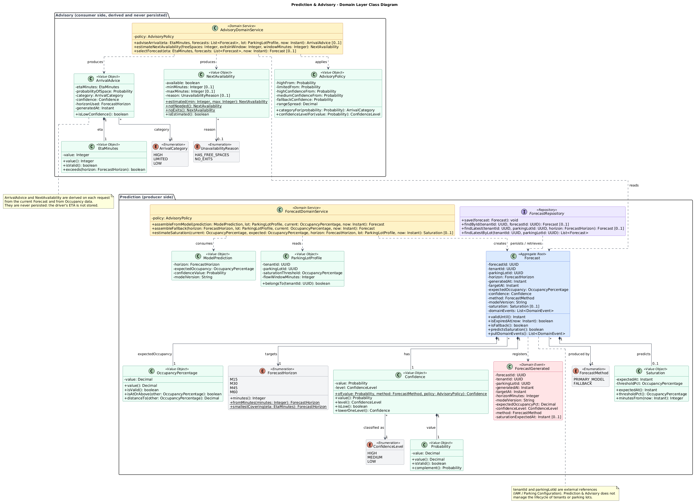

#### 5.5.7.2. Bounded Context Database Design Diagram

Prediction & Advisory es dueño de una sola tabla, `forecasts`, en el esquema `prediction` de PostgreSQL; la asesoría y la próxima disponibilidad no tienen tabla porque se derivan en cada solicitud. No tiene claves foráneas hacia los esquemas de otros contextos.

**Tabla `forecasts`**

|Columna|Tipo|Nulo|Atributo de `Forecast`|Descripción|
|-|-|-|-|-|
|id|UUID|No|forecastId|Clave primaria.|
|tenant_id|UUID|No|tenantId|Institución dueña del dato (CON-08).|
|parking_lot_id|UUID|No|parkingLotId|Estacionamiento; referencia lógica a Parking Configuration, sin clave foránea (CON-02).|
|horizon_min|SMALLINT|No|horizon|Horizonte en minutos: 15, 30, 45 o 60.|
|generated_at|TIMESTAMPTZ|No|generatedAt|Momento en que se generó.|
|target_at|TIMESTAMPTZ|No|targetAt|Momento objetivo; también es `validUntil` (no se almacena).|
|expected_occupancy_pct|NUMERIC(5,2)|No|expectedOccupancy|Ocupación esperada, entre 0 y 100.|
|confidence|NUMERIC(4,3)|No|confidence.value|Valor de confianza, entre 0 y 1.|
|confidence_level|VARCHAR(10)|No|confidence.level|Nivel de confianza: HIGH, MEDIUM o LOW (restricción CHECK).|
|method|VARCHAR(20)|No|method|Método con el que se generó: PRIMARY_MODEL o FALLBACK (restricción CHECK).|
|model_version|VARCHAR(40)|No|modelVersion|Versión del modelo o de la política de respaldo.|
|saturation_expected_at|TIMESTAMPTZ|Sí|saturation.expectedAt|Momento esperado de saturación.|

**Restricciones e índices**

|Elemento|Definición|Regla que respalda|
|-|-|-|
|`uq_forecasts_lot_horizon_time`|UNIQUE (parking_lot_id, horizon_min, generated_at)|Evita duplicados; acelera la búsqueda del más reciente.|
|`idx_forecasts_tenant_lot_target`|INDEX (tenant_id, parking_lot_id, target_at)|Consultas por institución, estacionamiento y momento objetivo.|
|`chk_forecasts_horizon`|horizon_min IN (15, 30, 45, 60)|Regla 2.|
|`chk_forecasts_expected`|expected_occupancy_pct BETWEEN 0 AND 100|Regla 3.|
|`chk_forecasts_confidence`|confidence BETWEEN 0 AND 1|Regla 3.|
|`chk_forecasts_fallback`|`method <> 'FALLBACK' OR confidence_level = 'LOW'`|Regla 5.|

**Relaciones con otras tablas**

- `forecasts` no tiene claves foráneas hacia tablas de otros contextos (CON-02). `parking_lot_id` e `tenant_id` son referencias lógicas a Parking Configuration e IAM.
- La ocupación y el calendario no se leen de tablas ajenas: se obtienen mediante los puertos `OccupancyReader` y `ParkingLotSettingsReader`, que llaman a las fachadas de Occupancy y de Parking Configuration dentro del mismo proceso.

**Consideraciones de diseño**

- **Aislamiento.** Cada fila incluye `tenant_id` y toda consulta filtra por institución (CON-08).
- **Alertas.** Notifications no referencia la tabla `forecasts`: recibe la información que necesita en el evento `SaturationPredicted`.
- **Crecimiento.** Hasta cuatro filas por estacionamiento en cada ejecución; conviene definir una política de depuración.

**DIAGRAMA — Prediction & Advisory Database Design Diagram:**

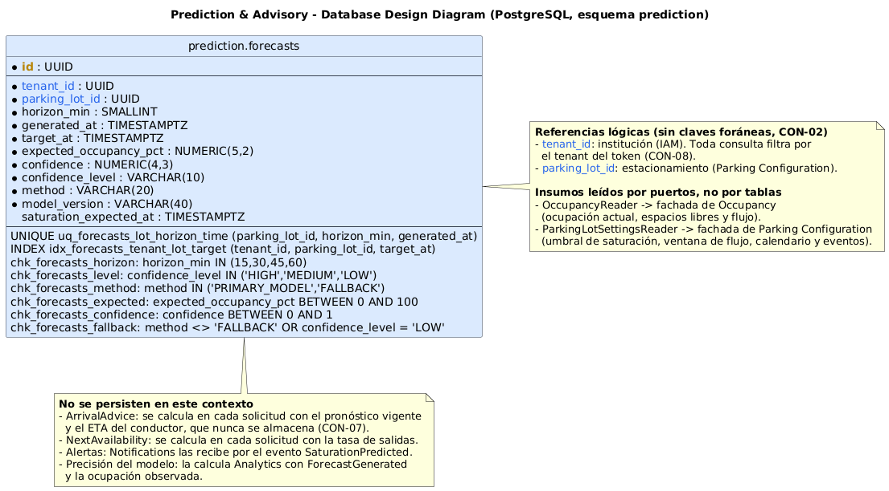


## 5.6. Bounded Context: Analytics

El Bounded Context Analytics es responsable de procesar y mantener la información histórica necesaria para analizar el comportamiento de la ocupación de los estacionamientos universitarios en Quadrapp.

Su principal propósito es proporcionar a los administradores información que permita comprender cómo ha variado la ocupación a lo largo del tiempo, identificar los periodos de mayor demanda y evaluar la precisión de las predicciones generadas por el sistema.

Este Bounded Context soporta principalmente:

- US21 — Consultar historial de ocupación.
- US22 — Identificar horas de mayor ocupación.
- US34 — Consultar la precisión de las predicciones.
- TS11 — Implementación de procesamiento histórico para analítica de ocupación.

Analytics no determina el estado actual de un espacio ni procesa directamente las señales provenientes de los sensores. Estas responsabilidades pertenecen a Occupancy y a Parking Sensing. Tampoco genera los pronósticos de disponibilidad, responsabilidad que pertenece a Prediction & Advisory.

Las principales responsabilidades del Bounded Context Analytics son:

- Mantener la información histórica de ocupación.
- Asociar los registros históricos con el estacionamiento y la zona correspondientes.
- Permitir consultas de ocupación dentro de un periodo determinado.
- Permitir filtrar el historial por zona.
- Proporcionar información agregada por hora y por día.
- Identificar los periodos de mayor ocupación.
- Permitir comparar niveles de ocupación entre diferentes días y horarios.
- Mantener la información necesaria de los pronósticos generados para evaluar posteriormente su precisión.
- Comparar los pronósticos con la ocupación realmente observada.
- Calcular el error absoluto medio de las predicciones.
- Calcular el porcentaje de pronósticos que se encuentran dentro del margen configurado.
- Diferenciar los resultados obtenidos por versión del modelo de predicción.
- Informar cuando no existe información histórica suficiente para realizar un análisis.
- Mantener separados sus datos de los modelos internos pertenecientes a Occupancy y Prediction & Advisory.


**Class Dictionary:**

La siguiente tabla resume las clases e interfaces principales requeridas por Analytics.

| Class / Interface | Layer | Purpose | Main attributes | Main operations |
|------------------ |-------|---------|-----------------|-----------------|
| `HistoricalOccupancy` | Domain | Representa la información histórica de ocupación observada para un estacionamiento o zona durante un periodo. | `historicalOccupancyId`, `tenantId`, `parkingLotId`, `zoneId`, `periodStart`, `periodEnd`, `occupancyRate`, `entryCount`, `exitCount` | `belongsToPeriod()`, `belongsToZone()` |
| `OccupancyRate` | Domain | Value Object que representa el porcentaje de ocupación observado. | `value` | `value()`, `isValid()` |
| `PeakHour` | Domain | Value Object que representa un periodo identificado como uno de los momentos de mayor ocupación. | `periodStart`, `periodEnd`, `occupancyRate` | — |
| `DemandPattern` | Domain | Value Object que representa un comportamiento recurrente identificado a partir de información histórica. | `period`, `occupancyRate` | — |
| `PredictionAccuracy` | Domain | Value Object que representa las métricas obtenidas al comparar predicciones con ocupación observada. | `meanAbsoluteError`, `withinMarginPercentage`, `horizonMinutes`, `modelVersion` | — |
| `HistoricalOccupancyRepository` | Domain | Abstracción para almacenar y consultar información histórica de ocupación. | — | `save()`, `findByPeriod()`, `findByPeriodAndZone()` |
| `AnalyticsDomainService` | Domain | Ejecuta operaciones que requieren analizar múltiples registros históricos o comparar ocupación observada y pronósticos. | — | `identifyPeakHours()`, `identifyDemandPatterns()`, `calculatePredictionAccuracy()` |
| `GetHistoricalOccupancyQuery` | Application | Representa una solicitud para consultar información histórica. | `tenantId`, `parkingLotId`, `zoneId`, `startDate`, `endDate` | — |
| `GetHistoricalOccupancyQueryHandler` | Application | Coordina la consulta del historial de ocupación. | Dependencies | `handle()` |
| `GetPeakHoursQuery` | Application | Representa una solicitud para identificar los periodos de mayor ocupación. | `tenantId`, `parkingLotId`, `startDate`, `endDate` | — |
| `GetPeakHoursQueryHandler` | Application | Obtiene los registros históricos y coordina la identificación de horas pico. | Dependencies | `handle()` |
| `GetPredictionAccuracyQuery` | Application | Representa una solicitud para evaluar la precisión de las predicciones en un periodo. | `tenantId`, `parkingLotId`, `startDate`, `endDate` | — |
| `GetPredictionAccuracyQueryHandler` | Application | Coordina la comparación entre predicciones y ocupación observada. | Dependencies | `handle()` |
| `OccupancyEventHandler` | Application | Procesa la información recibida desde Occupancy para actualizar las proyecciones históricas. | Dependencies | `handle()` |
| `ForecastGeneratedEventHandler` | Application | Procesa los pronósticos recibidos desde Prediction & Advisory para permitir posteriormente su evaluación. | Dependencies | `handle()` |
| `AnalyticsQueryController` | Interface | Expone las consultas disponibles para la consola administrativa. | Query Handler dependencies | `getHistoricalOccupancy()` |
| `OccupancyEventConsumer` | Interface | Recibe los eventos provenientes de Occupancy. | Handler dependency | `consume()` |
| `ForecastGeneratedEventConsumer` | Interface | Recibe los eventos `ForecastGenerated` provenientes de Prediction & Advisory. | Handler dependency | `consume()` |
| `HistoricalOccupancyRepositoryAdapter` | Infrastructure | Implementa la persistencia del historial de ocupación. | Persistence dependency | `save()`, `findByPeriod()`, `findByPeriodAndZone()` |
| `ForecastSnapshotRepositoryAdapter` | Infrastructure | Mantiene la información de los pronósticos requerida para evaluar su precisión. | Persistence dependency | `save()`, `findByPeriod()` |
| `OccupancyIntegrationAdapter` | Infrastructure | Encapsula el mecanismo técnico utilizado para recibir información desde Occupancy. | Integration dependency | `receive()` |
| `PredictionIntegrationAdapter` | Infrastructure | Encapsula la integración utilizada para recibir `ForecastGenerated`. | Integration dependency | `receive()` |

Los identificadores `tenantId`, `parkingLotId` y `zoneId` representan referencias externas. Analytics no administra el ciclo de vida de instituciones, estacionamientos o zonas.

### 5.6.1. Domain Layer

La Domain Layer contiene los conceptos, reglas y abstracciones de negocio que permiten representar y analizar la información histórica de ocupación dentro de Quadrapp. Esta capa no depende de HTTP, bases de datos, mecanismos de mensajería ni frameworks de aplicación.

El principal Aggregate Root es `HistoricalOccupancy`. Además, el dominio mantiene una representación propia de los pronósticos recibidos desde Prediction & Advisory, denominada `ForecastSnapshot`, únicamente con la información necesaria para evaluar posteriormente su precisión.

`HistoricalOccupancy` representa la ocupación observada de un estacionamiento o zona durante un periodo determinado. Esta información permite consultar el comportamiento histórico, comparar diferentes periodos e identificar los momentos de mayor ocupación.

`ForecastSnapshot` representa una instantánea de un pronóstico previamente generado por Prediction & Advisory. Analytics no genera ni modifica dicho pronóstico; únicamente conserva los valores necesarios para contrastarlo posteriormente con la ocupación observada. Esta separación es coherente con el Context Mapping, donde Analytics consume `ForecastGenerated` para evaluar las estimaciones.

Los identificadores `tenantId`, `parkingLotId` y `zoneId` actúan únicamente como referencias externas hacia conceptos administrados por otros Bounded Contexts. Analytics no administra instituciones, estacionamientos, zonas, espacios ni sensores.


#### HistoricalOccupancy:

**Categoría:** Aggregate Root.

**Propósito:** Representar la información histórica de ocupación observada para un estacionamiento o una zona durante un periodo determinado.

**Atributos:**
- historicalOccupancyId: UUID — Identificador único del registro histórico.
- tenantId: UUID — Referencia externa a la institución propietaria de la información.
- parkingLotId: UUID — Referencia externa al estacionamiento al que corresponde el registro.
- zoneId: UUID? — Referencia externa a una zona cuando la información ha sido desagregada por zona.
- periodStart: Instant — Momento inicial del periodo representado.
- periodEnd: Instant — Momento final del periodo representado.
- occupancyRate: OccupancyRate — Porcentaje de ocupación observado durante el periodo.
- entryCount: Integer — Cantidad de ingresos registrada durante el periodo.
- exitCount: Integer — Cantidad de salidas registrada durante el periodo.

**Operaciones:**
- belongsToPeriod(startDate, endDate) — Determina si el registro se encuentra dentro del periodo solicitado.
- belongsToZone(zoneId) — Indica si el registro corresponde a la zona especificada.
- hasValidPeriod() — Comprueba que el inicio del periodo no sea posterior al final.
- hasFlowData() — Indica si el registro dispone de información de entradas o salidas.

tenantId, parkingLotId y zoneId no convierten a Institution, Parking Lot o Parking Zone en elementos pertenecientes al agregado. Sus ciclos de vida son administrados fuera de Analytics.


#### OccupancyRate

**Categoría:** Value Object.

**Propósito:** Representar el porcentaje de ocupación observado durante un periodo.

**Atributos:**
- value: Decimal — Porcentaje de ocupación correspondiente al registro histórico.

**Operaciones:**
- value() — Devuelve el porcentaje representado.
- isValid() — Determina si el porcentaje se encuentra dentro de un rango válido (El valor debe permanecer dentro del intervalo de 0 % a 100 %)

OccupancyRate no representa la disponibilidad actual del estacionamiento. Su utilización dentro de Analytics corresponde exclusivamente al análisis de información histórica.


#### ForecastSnapshot

**Categoría:** Aggregate Root / Entity.

**Propósito:** Conservar una representación histórica de un pronóstico generado por Prediction & Advisory para permitir su comparación posterior con la ocupación observada.

**Atributos:**
- forecastId: UUID — Identificador del pronóstico recibido.
- tenantId: UUID — Institución a la que pertenece el pronóstico.
- parkingLotId: UUID — Estacionamiento sobre el cual fue realizada la predicción.
- generatedAt: Instant — Momento en que fue generado el pronóstico.
- targetAt: Instant — Momento futuro para el cual fue realizada la estimación.
- horizonMinutes: Integer — Horizonte temporal utilizado por la predicción.
- modelVersion: String — Versión del modelo con el que se generó el pronóstico.
- predictedOccupancyRate: OccupancyRate — Nivel de ocupación previsto.

**Operaciones:**
- targets(referenceTime) — Indica si el pronóstico corresponde al momento observado que se desea evaluar.
- wasGeneratedWith(modelVersion) — Determina si el pronóstico fue generado con una versión específica del modelo.

ForecastSnapshot representa una instantánea histórica. Una modificación posterior del modelo de predicción no debe alterar la información correspondiente a un pronóstico que ya fue generado.

Analytics tampoco administra el modelo predictivo. modelVersion es únicamente un valor utilizado para diferenciar los resultados de precisión obtenidos entre diferentes versiones.


#### PeakHour

**Categoría:** Value Object.

**Propósito:** Representar un periodo identificado a partir del historial como uno de los momentos de mayor ocupación del estacionamiento.

**Atributos:**
- periodStart: Instant — Inicio del periodo identificado.
- periodEnd: Instant — Final del periodo identificado.
- occupancyRate: OccupancyRate — Nivel de ocupación observado durante dicho periodo.

**Operaciones:**
- contains(timestamp) — Determina si un instante se encuentra dentro del periodo representado.


#### DemandPattern

**Categoría:** Value Object.

**Propósito:** Representar un comportamiento recurrente identificado a partir de la comparación de información histórica correspondiente a diferentes días y horarios.

**Atributos:**
- period: String — Periodo temporal al que corresponde el patrón identificado.
- occupancyRate: OccupancyRate — Nivel de ocupación representativo del comportamiento observado.

**Operaciones:**
- matches(period) — Indica si el patrón corresponde al periodo consultado.

DemandPattern no genera predicciones por sí mismo. Su propósito dentro de Analytics es representar tendencias históricas que pueden ser consultadas y analizadas.


#### PredictionAccuracy

**Categoría:** Value Object.

**Propósito:** Representar las métricas obtenidas al comparar un conjunto de pronósticos con la ocupación realmente observada durante el periodo correspondiente.

**Atributos:**
- meanAbsoluteError: Decimal — Error absoluto medio expresado en puntos porcentuales.
- withinMarginPercentage: Decimal — Porcentaje de pronósticos cuyo error se encuentra dentro del margen configurado.
- modelVersion: String — Versión del modelo a la que corresponden las métricas.

**Operaciones:**
- meanAbsoluteError() — Devuelve el error absoluto medio calculado.
- withinMarginPercentage() — Devuelve el porcentaje de pronósticos dentro del margen configurado.
- belongsToModelVersion(modelVersion) — Indica si el resultado corresponde a una determinada versión del modelo.

Cuando no existen pronósticos y datos de ocupación observada suficientes para efectuar una comparación, no debe generarse un PredictionAccuracy como si el cálculo fuera válido.


#### HistoricalOccupancyRepository

**Categoría:** Repository Interface.

**Propósito:** Definir las operaciones necesarias para persistir y recuperar registros históricos de ocupación sin acoplar el dominio de Analytics a una tecnología específica de almacenamiento.

**Operaciones:**
- save(historicalOccupancy)
- findByPeriod(tenantId, parkingLotId, startDate, endDate)
- findByPeriodAndZone(tenantId, parkingLotId, zoneId, startDate, endDate)

Todas las consultas deben respetar la institución a la que pertenece la información.


#### ForecastSnapshotRepository

**Categoría:** Repository Interface.

**Propósito:** Definir las operaciones necesarias para almacenar y recuperar las instantáneas de pronósticos utilizadas por Analytics para evaluar su precisión.

**Operaciones:**
- save(forecastSnapshot)
- findByPeriod(tenantId, parkingLotId, startDate, endDate)
- findByModelVersion(tenantId, parkingLotId, modelVersion, startDate, endDate)

Analytics utiliza este repositorio para acceder a su propia representación histórica del pronóstico y no para consultar directamente la persistencia interna de Prediction & Advisory.


#### AnalyticsDomainService

**Categoría:** Domain Service.

**Propósito:** Ejecutar operaciones analíticas que requieren trabajar con varios registros históricos o relacionar la ocupación observada con pronósticos previamente generados.

**Operaciones:**
- identifyPeakHours(historicalOccupancies) — Identifica los periodos con mayor ocupación dentro de los registros disponibles.
- identifyDemandPatterns(historicalOccupancies) — Permite identificar comportamientos recurrentes a partir del historial.
- calculatePredictionAccuracy(forecasts, observedOccupancies, configuredMargin) — Compara los pronósticos con la ocupación observada y genera las métricas correspondientes.

El Domain Service no obtiene directamente los datos desde una base de datos. Los registros necesarios son recuperados mediante las abstracciones de Repository antes de realizar las operaciones del dominio. Tampoco genera nuevas predicciones ni modifica las recibidas desde Prediction & Advisory.


#### Reglas de negocio

El dominio de Analytics aplica las siguientes reglas de negocio:

1. Todo registro de HistoricalOccupancy debe pertenecer a una institución identificada.
2. Todo registro histórico debe estar asociado con el estacionamiento del que proviene la información.
3. zoneId solo se mantiene cuando el registro corresponde específicamente a una zona del estacionamiento.
4. El momento inicial de un periodo histórico no puede ser posterior a su momento final.
5. Un OccupancyRate debe representar un valor entre 0 % y 100 %.
6. entryCount y exitCount no pueden contener valores negativos.
7. Las consultas históricas deben respetar el periodo solicitado por el administrador.
8. Cuando se selecciona una zona, solo deben incluirse los registros correspondientes a dicha zona.
9. Cuando no existen registros para el periodo solicitado, Analytics debe indicar que no existe información histórica disponible, en lugar de generar valores inexistentes.
10. La información histórica debe poder presentarse agregada por hora y por día.
11. Los periodos de mayor ocupación solo deben identificarse cuando existen suficientes datos históricos para realizar el análisis.
12. Cuando la información histórica disponible sea insuficiente, Analytics debe informar esta condición y no presentar horas pico como si hubieran sido determinadas correctamente.
13. Un ForecastSnapshot debe conservar la versión del modelo con la que fue generado el pronóstico.
14. Un pronóstico histórico no debe ser modificado cuando posteriormente se publique una nueva versión del modelo.
15. Una evaluación de precisión solo puede realizarse cuando exista información tanto del pronóstico como de la ocupación observada correspondiente.
16. La evaluación de precisión debe calcular el error absoluto medio expresado en puntos porcentuales.
17. La evaluación debe calcular el porcentaje de pronósticos cuyo error se encuentre dentro del margen configurado.
18. Las métricas de precisión deben poder diferenciarse por versión del modelo.
19. Cuando un periodo no posea suficiente información para comparar pronósticos y ocupación observada, Analytics debe indicar que no es posible calcular la precisión.
20. Analytics no modifica el estado actual mantenido por Occupancy.
21. Analytics no procesa directamente las señales producidas por los sensores IoT.
22. Analytics no genera pronósticos de disponibilidad.
23. Analytics no administra instituciones, estacionamientos, zonas ni espacios.
24. Las referencias externas utilizadas por Analytics no convierten los objetos de otros Bounded Contexts en parte de su propio modelo de dominio.

### 5.6.2. Interface Layer

La Interface Layer expone las capacidades del Bounded Context Analytics a la consola administrativa de Quadrapp y recibe información proveniente de otros Bounded Contexts de la plataforma.

Su responsabilidad es recibir solicitudes o eventos, validar su representación básica, transformarlos en Queries o mensajes de aplicación según corresponda, delegar su procesamiento a la Application Layer y convertir los resultados obtenidos en la representación esperada por el cliente o por el flujo de integración.

Las reglas de negocio relacionadas con el análisis histórico, la identificación de periodos de mayor ocupación o el cálculo de precisión de las predicciones no se implementan en esta capa.

Los principales componentes son `AnalyticsQueryController`, `OccupancyEventConsumer` y `ForecastGeneratedEventConsumer`.


#### AnalyticsQueryController
AnalyticsQueryController recibe solicitudes autorizadas relacionadas con la consulta de información histórica y analítica de los estacionamientos.

Su principal responsabilidad es construir las Queries correspondientes a partir de la información recibida y delegar su ejecución a la Application Layer.

El recurso REST definido actualmente para la consulta histórica es:

`GET /api/v1/analytics/occupancy`

La solicitud permite identificar:
- el estacionamiento que se desea analizar;
- la fecha inicial del periodo;
- la fecha final del periodo;
- la zona, cuando se desea limitar la consulta a una zona específica.

Cuando el periodo solicitado es válido, el sistema devuelve la información histórica de ocupación agregada por hora y por día.
Cuando la fecha inicial es posterior a la fecha final, la solicitud debe ser rechazada como un rango inválido.
La consulta del historial de ocupación se delega a GetHistoricalOccupancyQueryHandler.

**Consulta de periodos de mayor ocupación:**

AnalyticsQueryController también permite iniciar el caso de uso correspondiente a la identificación de los periodos con mayor ocupación.

La información requerida para esta consulta puede incluir:
- institución;
- estacionamiento;
- fecha inicial;
- fecha final.

La operación se transforma en un GetPeakHoursQuery y se delega a GetPeakHoursQueryHandler.
El controlador no identifica directamente cuáles son las horas pico ni aplica reglas sobre qué nivel de ocupación debe considerarse alto.
Cuando existen suficientes datos históricos, el sistema debe mostrar los periodos de mayor ocupación y permitir identificar variaciones entre diferentes días y horarios. Cuando los datos disponibles son insuficientes, debe indicarse que no existe información suficiente para realizar el análisis.

**Consulta de precisión de predicciones:**

AnalyticsQueryController también permite iniciar la consulta de precisión de las predicciones generadas por Quadrapp.

La consulta puede considerar:
- institución;
- estacionamiento;
- fecha inicial;
- fecha final.

El controlador construye un GetPredictionAccuracyQuery y delega su procesamiento a GetPredictionAccuracyQueryHandler.

La respuesta debe permitir presentar:
- el error absoluto medio de las predicciones expresado en puntos porcentuales;
- el porcentaje de pronósticos cuyo resultado quedó dentro del margen configurado;
- la versión del modelo utilizada.


**Consulta de precisión de predicciones:**
AnalyticsQueryController también permite iniciar la consulta de precisión de las predicciones generadas por Quadrapp.

La consulta puede considerar:
- institución;
- estacionamiento;
- fecha inicial;
- fecha final.

El controlador construye un GetPredictionAccuracyQuery y delega su procesamiento a GetPredictionAccuracyQueryHandler.

La respuesta debe permitir presentar:
- el error absoluto medio de las predicciones expresado en puntos porcentuales;
- el porcentaje de pronósticos cuyo resultado quedó dentro del margen configurado;
- la versión del modelo utilizada.


**Ámbito institucional de las consultas:**
Las operaciones de Analytics deben ejecutarse dentro del ámbito de la institución correspondiente al usuario autenticado.

Quadrapp utiliza un modelo multi-tenant lógico en el que la institución forma parte de los datos y del contexto de seguridad. Por esta razón, el cliente no debe poder modificar libremente el identificador institucional para consultar información perteneciente a otra universidad.


#### OccupancyEventConsumer
OccupancyEventConsumer recibe los eventos provenientes del Bounded Context Occupancy que son necesarios para mantener actualizada la representación histórica utilizada por Analytics.

Su responsabilidad consiste en validar la representación básica del mensaje recibido y delegar su procesamiento a OccupancyEventHandler.

La información recibida debe permitir identificar, como mínimo:
- la institución;
- el estacionamiento;
- la zona cuando corresponda;
- el momento de la observación;
- el nivel de ocupación observado;
- la información de flujo disponible cuando corresponda.


#### ForecastGeneratedEventConsumer
ForecastGeneratedEventConsumer recibe el evento ForecastGenerated proveniente del Bounded Context Prediction & Advisory.

Su responsabilidad es validar la representación básica del mensaje recibido y delegarlo a ForecastGeneratedEventHandler.

La información recibida debe permitir conservar los datos necesarios para evaluar posteriormente el pronóstico, como:
- identificador del pronóstico;
- institución;
- estacionamiento;
- momento en que fue generado;
- momento futuro para el cual se realizó la estimación;
- horizonte temporal;
- versión del modelo;
- valor de ocupación pronosticado.


**Responsabilidades excluidas de Interface Layer:**

La Interface Layer de Analytics no debe:
- calcular directamente las horas pico;
- calcular el error absoluto medio;
- calcular el porcentaje de pronósticos dentro del margen;
- determinar patrones históricos;
- acceder directamente a la base de datos;
- modificar el estado de Occupancy;
- generar predicciones;
- procesar señales provenientes de sensores;
- administrar estacionamientos, zonas o instituciones;
- implementar reglas de autenticación y autorización.

Su responsabilidad se limita a recibir, transformar, delegar y representar las solicitudes y eventos que permiten utilizar las capacidades del Bounded Context Analytics.

### 5.6.3. Application Layer

La Application Layer coordina los casos de uso soportados por Analytics.

Esta capa orquesta objetos del Domain Layer, repositorios y mensajes provenientes de otros Bounded Contexts, pero no contiene detalles específicos de persistencia, protocolos de mensajería, frameworks de aplicación ni mecanismos concretos de almacenamiento.

Los principales flujos de aplicación considerados son:
- Consulta del historial de ocupación.
- Filtrado del historial por zona.
- Identificación de los periodos de mayor ocupación.
- Comparación de niveles de ocupación entre diferentes periodos.
- Evaluación de la precisión de las predicciones.
- Procesamiento de información proveniente de Occupancy.
- Registro de pronósticos provenientes de Prediction & Advisory.


#### GetHistoricalOccupancyQuery
GetHistoricalOccupancyQuery representa una solicitud para consultar la información histórica de ocupación correspondiente a un estacionamiento dentro de un periodo determinado.

**Atributos:**
- tenantId: UUID
- parkingLotId: UUID
- zoneId: UUID?
- startDate: Instant
- endDate: Instant

`zoneId` es opcional, debido a que la consulta puede realizarse sobre todo el estacionamiento o limitarse a una zona determinada.


#### GetHistoricalOccupancyQueryHandler
GetHistoricalOccupancyQueryHandler coordina la consulta del historial de ocupación.

El manejador realiza la siguiente secuencia:
1. Recibe un GetHistoricalOccupancyQuery.
2. Verifica que la fecha inicial no sea posterior a la fecha final.
3. Cuando se especifica zoneId, utiliza HistoricalOccupancyRepository para recuperar únicamente los registros correspondientes a esa zona.
4. Cuando no se especifica una zona, recupera los registros del estacionamiento completo.
5. Limita los resultados al ámbito de la institución indicada.
6. Recupera la información histórica correspondiente al periodo solicitado.
7. Organiza los registros necesarios para su presentación por hora o por día.
8. Devuelve la información requerida por la Interface Layer.
9. Cuando no existen registros para el periodo solicitado, devuelve un resultado que permita informar dicha condición.


#### GetPeakHoursQuery
GetPeakHoursQuery representa una solicitud para identificar los periodos con mayor nivel de ocupación dentro de un intervalo determinado.

**Atributos:**
- tenantId: UUID
- parkingLotId: UUID
- zoneId: UUID?
- startDate: Instant
- endDate: Instant

La zona puede utilizarse cuando se desea analizar de manera independiente una sección específica del estacionamiento.


#### GetPeakHoursQueryHandler
GetPeakHoursQueryHandler coordina la identificación de los periodos de mayor ocupación.

Su flujo de ejecución es:
1. Recibe un GetPeakHoursQuery.
2. Valida el rango temporal solicitado.
3. Recupera mediante HistoricalOccupancyRepository los registros históricos correspondientes.
4. Aplica el filtro de zona cuando este se encuentra presente.
5. Verifica que exista información suficiente para realizar el análisis.
6. Delega la identificación de los periodos de mayor ocupación a AnalyticsDomainService.
7. Obtiene los objetos PeakHour resultantes.
8. Retorna la información requerida por la Interface Layer.

Cuando la información disponible no permite realizar un análisis válido, se devuelve un resultado que indique la ausencia de datos suficientes.
La determinación de qué periodos representan los mayores niveles de ocupación pertenece al Domain Layer y no se implementa directamente en el handler.


#### GetDemandPatternsQuery
GetDemandPatternsQuery representa una solicitud para analizar el comportamiento recurrente de la ocupación dentro de un periodo.

**Atributos:**
- tenantId: UUID
- parkingLotId: UUID
- zoneId: UUID?
- startDate: Instant
- endDate: Instant

Este objeto permite solicitar la comparación de información histórica correspondiente a distintos días y horarios.


#### GetDemandPatternsQueryHandler
GetDemandPatternsQueryHandler coordina el análisis de patrones históricos de ocupación.

El manejador realiza la siguiente secuencia:
1. Recibe un GetDemandPatternsQuery.
2. Valida el periodo solicitado.
3. Recupera los registros históricos mediante HistoricalOccupancyRepository.
4. Aplica el filtro de zona cuando corresponda.
5. Verifica que exista información suficiente para comparar diferentes periodos.
6. Delega el análisis a AnalyticsDomainService.
7. Obtiene los objetos DemandPattern identificados.
8. Retorna los resultados a la Interface Layer.

El manejador no define por sí mismo qué constituye un patrón de demanda. Su responsabilidad consiste en coordinar la recuperación de información y delegar el análisis al dominio.


#### GetPredictionAccuracyQuery
GetPredictionAccuracyQuery representa una solicitud para evaluar la precisión de los pronósticos generados durante un periodo determinado.

**Atributos:**
- tenantId: UUID
- parkingLotId: UUID
- startDate: Instant
- endDate: Instant

La consulta se limita siempre a la institución y estacionamiento correspondientes.


#### GetPredictionAccuracyQueryHandler
GetPredictionAccuracyQueryHandler coordina la evaluación de precisión de las predicciones.

Su flujo de ejecución es:
1. Recibe un GetPredictionAccuracyQuery.
2. Verifica que el rango temporal solicitado sea válido.
3. Recupera mediante ForecastSnapshotRepository los pronósticos correspondientes al periodo.
4. Recupera mediante HistoricalOccupancyRepository la ocupación observada para los momentos que deben compararse.
5. Verifica que exista información suficiente de ambas fuentes.
6. Relaciona cada pronóstico con la observación histórica correspondiente.
7. Agrupa los pronósticos según la versión del modelo cuando sea necesario.
8. Delega el cálculo de precisión a AnalyticsDomainService.
9. Obtiene los objetos PredictionAccuracy resultantes.
10. Retorna las métricas a la Interface Layer.

Las métricas obtenidas incluyen:
- Error absoluto medio
- Porcentaje de pronósticos dentro del margen configurado
- Versión del modelo asociada con el resultado

Cuando no existe información suficiente para relacionar pronósticos y ocupación observada, el manejador devuelve un resultado que indique que la precisión no puede calcularse.
El handler no implementa directamente las fórmulas utilizadas para calcular las métricas.


#### OccupancyEventHandler
OccupancyEventHandler coordina la incorporación de información proveniente de Occupancy al modelo histórico de Analytics.

Su flujo principal es:
1. Recibe la información correspondiente a un cambio o estado de ocupación procesado previamente.
2. Obtiene la institución asociada con el evento.
3. Obtiene el estacionamiento correspondiente.
4. Obtiene la zona cuando esta se encuentra disponible.
5. Conserva el momento original de la observación.
6. Obtiene la información de ocupación necesaria para construir o actualizar la proyección histórica.
7. Incorpora la información de flujo vehicular cuando esta se encuentre presente.
8. Construye o actualiza el HistoricalOccupancy correspondiente.
9. Persiste el resultado mediante HistoricalOccupancyRepository.

El manejador no determina si un espacio está libre, ocupado o desconocido. Tampoco procesa información directamente desde sensores, ya que recibe información que previamente fue interpretada por Occupancy.

La información histórica conserva las referencias recibidas sin apropiarse de los objetos correspondientes a estacionamientos o zonas.


#### ForecastGeneratedEventHandler
ForecastGeneratedEventHandler coordina el registro de la información necesaria de un pronóstico generado por Prediction & Advisory.

Su flujo de ejecución es:
1. Recibe la información correspondiente al pronóstico generado.
2. Obtiene su identificador.
3. Conserva la institución y estacionamiento relacionados.
4. Conserva el momento en que se generó el pronóstico.
5. Conserva el momento futuro al que corresponde la estimación.
6. Conserva el horizonte temporal utilizado.
7. Conserva la versión del modelo.
8. Conserva el porcentaje de ocupación pronosticado.
9. Construye un ForecastSnapshot.
10. Persiste la instantánea mediante ForecastSnapshotRepository.

El manejador no vuelve a ejecutar el modelo de predicción. Tampoco modifica el valor pronosticado recibido.

Su responsabilidad consiste en conservar una representación histórica que pueda relacionarse posteriormente con la ocupación realmente observada.


#### HistoricalOccupancyResult
HistoricalOccupancyResult representa la información producida por una consulta histórica y entregada posteriormente a la Interface Layer.

**Atributos:**
- parkingLotId: UUID
- zoneId: UUID?
- startDate: Instant
- endDate: Instant
- records: List<HistoricalOccupancy>


#### PeakHoursResult
PeakHoursResult representa el resultado obtenido después de analizar los periodos de mayor ocupación.

**Atributos:**
- parkingLotId: UUID
- zoneId: UUID?
- peakHours: List<PeakHour>
- sufficientData: boolean

`sufficientData` permite distinguir entre una consulta válida sin resultados relevantes y una situación en la que la cantidad de información disponible no permite realizar el análisis.


#### DemandPatternsResult
DemandPatternsResult representa los patrones identificados a partir de la comparación de información histórica.

**Atributos:**
- parkingLotId: UUID
- zoneId: UUID?
- patterns: List<DemandPattern>
- sufficientData: boolean

Este resultado no contiene predicciones de disponibilidad futura. Representa únicamente comportamientos obtenidos del análisis histórico.


#### PredictionAccuracyResult
PredictionAccuracyResult representa la información resultante de evaluar la precisión de los pronósticos.
Atributos:
- parkingLotId: UUID
- startDate: Instant
- endDate: Instant
- accuracyByModelVersion: List<PredictionAccuracy>
- sufficientData: boolean

Cuando `sufficientData` es falso, la Interface Layer puede informar que el periodo seleccionado no permite calcular las métricas de precisión.


#### HistoricalOccupancyRepository
HistoricalOccupancyRepository es utilizado por Application Layer para almacenar y recuperar la información histórica necesaria para los casos de uso.

Las operaciones utilizadas principalmente son:
- save(historicalOccupancy)
- findByPeriod(tenantId, parkingLotId, startDate, endDate)
- findByPeriodAndZone(tenantId, parkingLotId, zoneId, startDate, endDate)

La Application Layer depende de esta abstracción y no de una implementación concreta de persistencia.


#### ForecastSnapshotRepository
ForecastSnapshotRepository permite almacenar y recuperar los pronósticos conservados por Analytics.

Las operaciones principales son:
- save(forecastSnapshot)
- findByPeriod(tenantId, parkingLotId, startDate, endDate)
- findByModelVersion(tenantId, parkingLotId, modelVersion, startDate, endDate)

La Application Layer utiliza esta abstracción para obtener la información necesaria durante la evaluación de precisión.
No accede directamente a la persistencia de Prediction & Advisory.


#### AnalyticsDomainService
AnalyticsDomainService es utilizado por los Query Handlers cuando una operación requiere aplicar reglas analíticas sobre múltiples elementos del dominio.

Las principales operaciones utilizadas son:
- identifyPeakHours(historicalOccupancies)
- identifyDemandPatterns(historicalOccupancies)
- calculatePredictionAccuracy(forecasts, observedOccupancies, configuredMargin)

La coordinación del caso de uso pertenece a Application Layer, mientras que las reglas y cálculos analíticos permanecen encapsulados dentro del Domain Layer.

### 5.6.4. Infrastructure Layer

La Infrastructure Layer contiene las implementaciones técnicas necesarias para almacenar, recuperar y recibir la información utilizada por el Bounded Context Analytics.

Esta capa implementa las abstracciones definidas en Domain Layer y proporciona los mecanismos de integración necesarios para recibir información desde otros Bounded Contexts. De esta manera, las capas superiores pueden trabajar con repositorios e interfaces sin depender directamente de una base de datos, un sistema de mensajería o una tecnología específica.

Los principales componentes son:
- `HistoricalOccupancyRepositoryAdapter`
- `ForecastSnapshotRepositoryAdapter`
- `OccupancyIntegrationAdapter`
- `PredictionIntegrationAdapter`


#### HistoricalOccupancyRepositoryAdapter
HistoricalOccupancyRepositoryAdapter implementa la interfaz HistoricalOccupancyRepository.

Su responsabilidad es gestionar la persistencia de los registros de ocupación histórica utilizados por Analytics.

Sus principales responsabilidades son:
- almacenar nuevos registros de HistoricalOccupancy;
- recuperar registros históricos pertenecientes a una institución;
- recuperar información correspondiente a un estacionamiento determinado;
- consultar registros dentro de un periodo;
- aplicar consultas por zona cuando corresponda;
- reconstruir objetos HistoricalOccupancy a partir de la información persistida;
- conservar la información necesaria para las agregaciones por hora y por día.

La implementación debe mantener separada la información perteneciente a cada institución.


#### ForecastSnapshotRepositoryAdapter
`ForecastSnapshotRepositoryAdapter` implementa la interfaz ForecastSnapshotRepository.

Su responsabilidad es persistir la representación histórica de los pronósticos que Analytics necesita para evaluar posteriormente su precisión.

Sus principales operaciones son:
- registrar un ForecastSnapshot;
- recuperar pronósticos dentro de un periodo determinado;
- recuperar pronósticos asociados con un estacionamiento;
- recuperar información según la versión del modelo;
- conservar el momento de generación del pronóstico;
- conservar el momento futuro al que corresponde la estimación;
- conservar el valor pronosticado sin modificarlo.

El adaptador no accede directamente al modelo interno de Prediction & Advisory.

Analytics almacena únicamente la información que necesita para realizar sus propios procesos de evaluación.


#### OccupancyIntegrationAdapter
`OccupancyIntegrationAdapter` implementa el mecanismo técnico necesario para recibir la información publicada por el Bounded Context Occupancy.

Su función consiste en adaptar los mensajes recibidos a una representación que pueda ser procesada por OccupancyEventConsumer.
La información recibida puede incluir:

- Institución
- Estacionamiento
- Zona cuando corresponda
- Momento de la observación
- Nivel de ocupación
- Información de flujo disponible.


#### PredictionIntegrationAdapter
`PredictionIntegrationAdapter` proporciona el mecanismo técnico utilizado para recibir los eventos ForecastGenerated provenientes de Prediction & Advisory.

Su responsabilidad consiste en transformar el contrato externo a la representación que Analytics necesita para procesar el pronóstico.

La información recibida puede incluir:
- Identificador del pronóstico
- Institución
- Estacionamiento
- Momento de generación
- Momento objetivo de la predicción
- Horizonte temporal
- Versión del modelo
- Porcentaje de ocupación previsto.

El adaptador no ejecuta el modelo de predicción ni modifica sus resultados.

Su función es evitar que Analytics dependa directamente de la estructura interna de Prediction & Advisory.


**Persistencia del historial de ocupación:**

La infraestructura de Analytics debe conservar la información histórica necesaria para responder las consultas administrativas.

Conceptualmente, cada registro persistido debe mantener:
- la institución;
- el estacionamiento;
- la zona cuando corresponda;
- el periodo representado;
- el nivel de ocupación;
- la cantidad de entradas;
- la cantidad de salidas;
- el nivel de agregación utilizado.

La persistencia debe permitir recuperar la información de manera eficiente por institución, estacionamiento, zona y rango temporal.


**Persistencia de pronósticos históricos:**

Analytics también debe conservar una representación de los pronósticos que posteriormente serán comparados con la ocupación observada.

Esta información debe mantener como mínimo:
- El identificador del pronóstico
- La institución
- El estacionamiento
- La fecha y hora de generación
- El momento objetivo
- El horizonte temporal
- La versión del modelo
- El nivel de ocupación pronosticado.

Esta representación pertenece exclusivamente a Analytics y no reemplaza la información original administrada por Prediction & Advisory.


**Consideraciones de aislamiento entre Bounded Contexts:**
Analytics mantiene su propia persistencia y no debe acceder directamente a las bases de datos internas de otros Bounded Contexts.

Por esta razón:
- `tenantId` se mantiene como referencia externa;
- `parkingLotId` se mantiene como referencia externa;
- `zoneId` se mantiene como referencia externa;
- Analytics no crea ni administra objetos Institution;
- Analytics no crea ni administra objetos ParkingLot;
- Analytics no crea ni administra objetos ParkingZone;
- Analytics no persiste el estado actual de los espacios;
- Analytics no almacena el modelo completo de Prediction & Advisory;
- Analytics no establece claves foráneas hacia tablas pertenecientes a otros Bounded Contexts.

La comunicación con Occupancy y Prediction & Advisory debe realizarse mediante los contratos de integración definidos para la solución, evitando acoplamiento directo entre sus modelos de persistencia.


**Consideraciones de multi-tenancy:**
La infraestructura de Analytics debe preservar el aislamiento de la información perteneciente a cada institución.

Por ello, todos los registros históricos y pronósticos conservados deben estar asociados con un tenantId.

Las consultas de infraestructura deben incluir este identificador dentro de sus criterios de acceso para evitar que información correspondiente a una institución sea recuperada como parte de las operaciones de otra.

Este aislamiento debe mantenerse tanto para:
- Historial de ocupación
- Información por zona
- Información de flujo
- Pronósticos históricos
- Resultados utilizados para calcular precisión.


**Consideraciones tecnológicas:**
La infraestructura se mantiene independiente de una tecnología específica en esta etapa del diseño.

La arquitectura de Quadrapp exige que los servicios utilicen tecnologías open-source y que cada Bounded Context posea su propia persistencia, pero el documento actual todavía no determina un motor de base de datos concreto para Analytics.

Por esta razón, clases como:
- `HistoricalOccupancyRepositoryAdapter`
- `ForecastSnapshotRepositoryAdapter`
- `OccupancyIntegrationAdapter`
- `PredictionIntegrationAdapter`

representan responsabilidades técnicas y no una dependencia hacia un producto particular.

La selección definitiva del motor de persistencia, ORM y mecanismo de mensajería deberá respetar estas interfaces sin introducir cambios en el Domain Layer o en los casos de uso definidos en Application Layer.

### 5.6.6. Bounded Context Software Architecture Component Level Diagrams

El Component Level Diagram del Bounded Context Analytics muestra los principales componentes internos encargados de procesar consultas, recibir eventos de otros contextos y gestionar la información histórica utilizada para el análisis.

Los componentes principales son:
- Analytics Query API, que recibe las consultas realizadas desde la consola administrativa.
- Occupancy Event Consumer, que procesa los eventos provenientes de Occupancy.
- Forecast Generated Event Consumer, que recibe los pronósticos generados por Prediction & Advisory.
- Analytics Application, que coordina los casos de uso y handlers del contexto.
- Analytics Domain, que contiene las reglas y conceptos del dominio analítico.
- Analytics Persistence, que implementa los repositorios necesarios para acceder a la información almacenada.
- Occupancy Integration y Prediction & Advisory Integration, que permiten integrar Analytics con los otros Bounded Contexts sin acoplar sus modelos internos.
- Analytics Data Storage, donde se conserva la información histórica y los datos de pronósticos necesarios para los análisis.

El flujo principal comienza cuando un administrador realiza una consulta desde la consola web, a través del módulo de composición. La solicitud ingresa por Analytics Query API, pasa a Analytics Application, utiliza las reglas de Analytics Domain y accede a los datos mediante Analytics Persistence.

Por otro lado, los eventos de Occupancy y los pronósticos de Prediction & Advisory llegan como eventos de aplicación de Spring dentro del mismo backend. Los consumidores (`@TransactionalEventListener`) los reciben después de que el módulo emisor confirma su transacción, y los componentes de integración los traducen al modelo de Analytics antes de procesarlos en Analytics Application, de acuerdo con la relación Conformist del Context Map.

De esta manera, Analytics mantiene sus responsabilidades y su persistencia separadas de los demás Bounded Contexts.

**Analytics Component Level Diagram:**
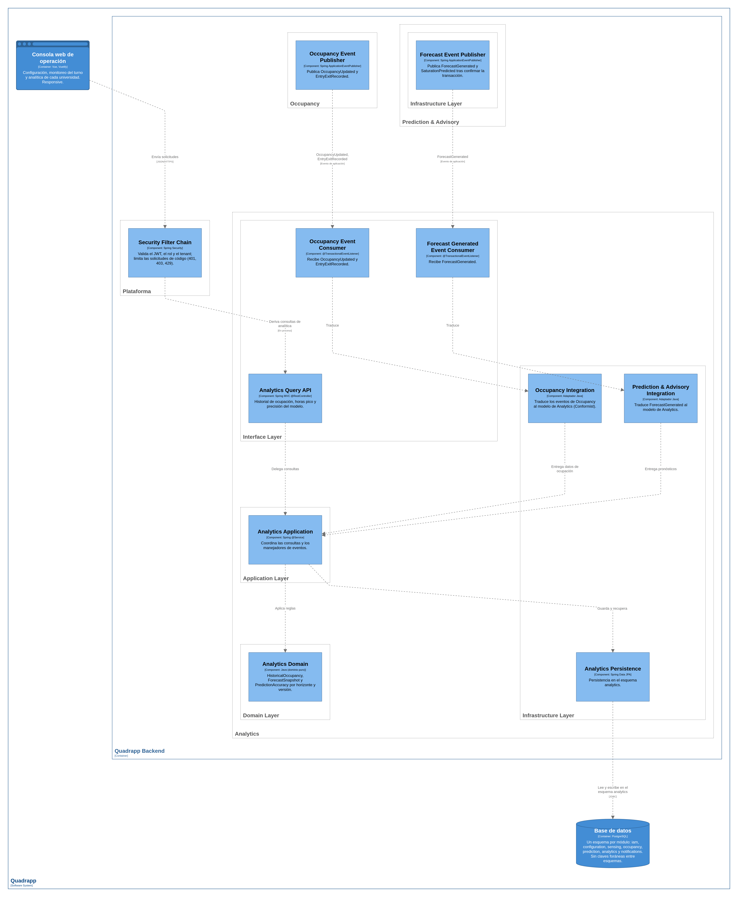

### 5.6.7. Bounded Context Software Architecture Code Level Diagrams

Los Code Level Diagrams proporcionan una representación más detallada de la estructura orientada a la implementación del Bounded Context Analytics.

Para Analytics, el Code Level se representa mediante:
- **Domain Layer Class Diagram:** Describe el modelo de dominio orientado a objetos, incluyendo Aggregate Roots, Value Objects, Domain Services, interfaces de Repository, atributos, métodos, relaciones y multiplicidades.
- **Database Design Diagram:** Representa las estructuras de persistencia necesarias para conservar el historial de ocupación y la información de pronósticos utilizada por Analytics.

Ambos diagramas mantienen la consistencia con la separación por capas definida anteriormente y con las responsabilidades propias del Bounded Context.

#### 5.6.7.1. Bounded Context Domain Layer Class Diagrams

El Domain Layer Class Diagram representa la estructura orientada a la implementación del modelo de dominio de Analytics.

El diagrama incluye los siguientes elementos:

**Aggregate Roots**
- HistoricalOccupancy
- ForecastSnapshot

**Value Objects**
- OccupancyRate
- PeakHour
- DemandPattern
- PredictionAccuracy

**Repository Interfaces**
- HistoricalOccupancyRepository
- ForecastSnapshotRepository

**Domain Service**
- AnalyticsDomainService

<br>

Las principales relaciones son:
- `HistoricalOccupancy` compone exactamente un `OccupancyRate`.
- `ForecastSnapshot` compone exactamente un `OccupancyRate` para representar el porcentaje de ocupación pronosticado.
- `HistoricalOccupancy` mantiene referencias externas mediante `tenantId`, `parkingLotId` y, cuando corresponda, `zoneId`.
- `ForecastSnapshot` mantiene referencias externas mediante `tenantId` y `parkingLotId`.
- `HistoricalOccupancyRepository` persiste y recupera objetos `HistoricalOccupancy`.
- `ForecastSnapshotRepository` persiste y recupera objetos `ForecastSnapshot`.
- `AnalyticsDomainService` analiza uno o más registros `HistoricalOccupancy`.
- `AnalyticsDomainService` utiliza objetos `ForecastSnapshot` para evaluar la precisión de las predicciones.
- `AnalyticsDomainService` produce objetos `PeakHour` al identificar los periodos de mayor ocupación.
- `AnalyticsDomainService` produce objetos `DemandPattern` al analizar comportamientos históricos.
- `AnalyticsDomainService` produce objetos `PredictionAccuracy` al comparar pronósticos con la ocupación observada.
- `PeakHour` utiliza un `OccupancyRate` para representar el nivel de ocupación del periodo identificado.
- `DemandPattern` utiliza un `OccupancyRate` para representar el comportamiento histórico observado.

<br>

El diagrama usa las convenciones de visibilidad de UML:
- (+) para miembros públicos
- (-) para miembros privados
- (#) para miembros protegidos cuando corresponda

<br>

Los siguientes conceptos no son clases del dominio de Analytics:

- Institution
- ParkingLot
- ParkingZone
- ParkingSpace
- Sensor
- PredictionModel

Sus identificadores o datos mínimos pueden mantenerse como referencias externas cuando sean necesarios para realizar consultas o análisis, pero Analytics no administra su ciclo de vida.

**DIAGRAMA — Analytics Domain Layer Class Diagram:**

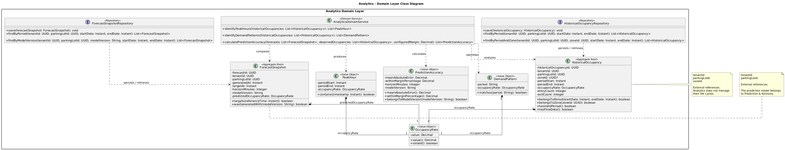


#### 5.6.7.2. Bounded Context Database Design Diagram

El Database Design Diagram representa la estructura de persistencia propia del Bounded Context Analytics. Su objetivo es mostrar cómo se almacena la información histórica de ocupación y los pronósticos necesarios para realizar consultas analíticas y evaluar posteriormente su precisión.

Analytics mantiene su persistencia separada de los demás Bounded Contexts. Los identificadores de institución, estacionamiento y zona se conservan únicamente como referencias externas, por lo que no se crean claves foráneas hacia bases de datos pertenecientes a otros contextos.

El diseño lógico considera dos estructuras principales:
- `analytics_historical_occupancy`, para almacenar la información histórica de ocupación y flujo vehicular.
- `analytics_forecast_snapshots`, para conservar la información mínima de los pronósticos utilizada durante la evaluación de precisión.

**analytics_historical_occupancy:**

Esta tabla almacena los registros históricos utilizados para analizar el comportamiento de la ocupación de un estacionamiento o de una zona dentro de un periodo determinado.

| Column | Type | Constraint | Description |
|---|---|---|---|
| `historical_occupancy_id` | UUID | PRIMARY KEY | Identificador único del registro histórico. |
| `tenant_id` | UUID | NOT NULL | Referencia externa a la institución propietaria de la información. |
| `parking_lot_id` | UUID | NOT NULL | Referencia externa al estacionamiento. |
| `zone_id` | UUID | NULL | Referencia externa a una zona específica cuando corresponda. |
| `period_start` | TIMESTAMP | NOT NULL | Inicio del periodo representado. |
| `period_end` | TIMESTAMP | NOT NULL | Final del periodo representado. |
| `granularity` | VARCHAR | NOT NULL | Nivel de agregación utilizado, por ejemplo hora o día. |
| `occupancy_rate` | DECIMAL | NOT NULL | Porcentaje de ocupación observado. |
| `entry_count` | INTEGER | NOT NULL | Cantidad de ingresos registrados durante el periodo. |
| `exit_count` | INTEGER | NOT NULL | Cantidad de salidas registradas durante el periodo. |

Las principales restricciones lógicas son:
- `period_start` no puede ser posterior a `period_end`.
- `occupancy_rate` debe mantenerse entre 0 y 100.
- `entry_count` no puede ser negativo.
- `exit_count` no puede ser negativo.
- `zone_id` puede ser nulo cuando el registro representa al estacionamiento completo.


**analytics_forecast_snapshots:**

Esta tabla conserva una representación histórica de los pronósticos generados por Prediction & Advisory. Analytics utiliza estos datos únicamente para compararlos posteriormente con la ocupación observada.

| Column | Type | Constraint | Description |
|---|---|---|---|
| `forecast_id` | UUID | PRIMARY KEY | Identificador del pronóstico recibido. |
| `tenant_id` | UUID | NOT NULL | Referencia externa a la institución. |
| `parking_lot_id` | UUID | NOT NULL | Referencia externa al estacionamiento. |
| `generated_at` | TIMESTAMP | NOT NULL | Momento en el que se generó el pronóstico. |
| `target_at` | TIMESTAMP | NOT NULL | Momento futuro para el cual se realizó la estimación. |
| `horizon_minutes` | INTEGER | NOT NULL | Horizonte temporal utilizado por la predicción. |
| `model_version` | VARCHAR | NOT NULL | Versión del modelo con el que se generó el pronóstico. |
| `predicted_occupancy_rate` | DECIMAL | NOT NULL | Porcentaje de ocupación pronosticado. |

Las principales restricciones lógicas son:
- `predicted_occupancy_rate` debe mantenerse entre 0 y 100.
- `horizon_minutes` debe ser mayor que 0.
- `target_at` debe representar el instante al que corresponde el pronóstico.
- La información histórica de un pronóstico no debe modificarse cuando posteriormente cambie la versión del modelo.


**Relación entre las estructuras:**

Las tablas no requieren una clave foránea directa entre sí. La comparación entre un pronóstico y la ocupación observada se realiza utilizando el contexto del estacionamiento y el periodo temporal correspondiente.

El pronóstico guardado en `analytics_forecast_snapshots` se compara con el registro de `analytics_historical_occupancy` del mismo estacionamiento cuyo periodo contiene su `target_at`; de esa comparación entre la ocupación prevista y la observada se obtiene `PredictionAccuracy`.

`PredictionAccuracy` no necesita una tabla propia, ya que representa un resultado calculado a partir de los pronósticos almacenados y los registros de ocupación observada.


**Referencias externas:**

Los siguientes identificadores se mantienen como referencias externas:

- `tenant_id`
- `parking_lot_id`
- `zone_id`

Analytics no crea tablas propias para:
- instituciones;
- estacionamientos;
- zonas;
- espacios de estacionamiento;
- sensores;
- modelos de predicción.
Estos elementos continúan siendo administrados por sus respectivos Bounded Contexts.


**Aislamiento de información:**

Todos los registros almacenados por Analytics deben mantener el identificador de la institución correspondiente. Este valor permite limitar las consultas y evitar que la información histórica de una institución sea utilizada dentro del contexto de otra.

La persistencia debe permitir realizar consultas utilizando principalmente:
- `tenant_id`
- `parking_lot_id`
- `zone_id`, cuando corresponda
- rango temporal
- `model_version`, para análisis de precisión.


**Tecnología:**

Ambas tablas se implementan en el esquema `analytics` de PostgreSQL, según DD-01, sin claves foráneas hacia los esquemas de otros módulos (CON-02). Las capas de dominio y de aplicación no dependen de esta tecnología: acceden a los datos únicamente mediante los repositorios `HistoricalOccupancyRepository` y `ForecastSnapshotRepository`.

<br>

**DIAGRAMA — Analytics Database Design Diagram:**

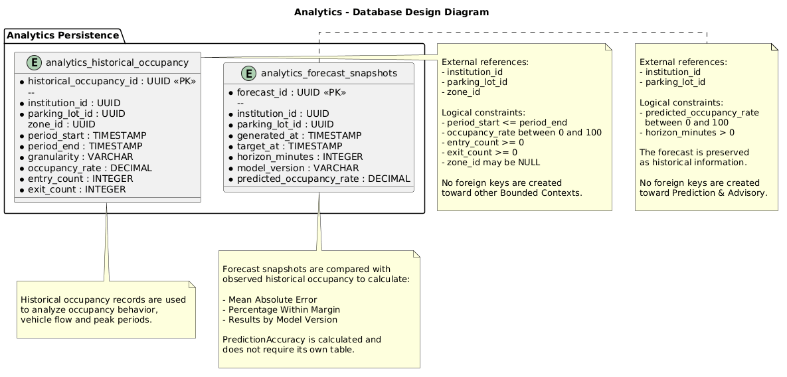

## 5.7. Bounded Context: Notifications

El contexto Notifications decide a quién avisar, cuándo y por qué canal, y entrega las alertas de baja disponibilidad a los conductores. Recibe las predicciones desde Prediction & Advisory mediante el lenguaje publicado (Published Language) del mapa de contextos y entrega los mensajes por push o por correo a través de capas anticorrupción hacia los proveedores externos de mensajería. Su dominio es de soporte (Supporting) y no calcula ocupación ni pronósticos. Sostiene los drivers FD-08, QAD-06, CON-06 y CON-07, y la decisión DD-07. Su contenido corresponde a las historias US23, US24 y US33 y a la historia técnica TS12.
 
### 5.7.1. Domain Layer
 
**Aggregates.**
 
| Aggregate | Raíz | Entidades y Value Objects | Responsabilidad e invariantes |
|---|---|---|---|
| NotificationSubscription | `NotificationSubscription` | `TimeSlot` (días y rango horario), `SubscriptionStatus` (ACTIVE, PAUSED, CANCELLED) | Franja en la que el conductor suele llegar a un estacionamiento. Solo una suscripción activa por usuario, estacionamiento y franja. Darse de baja conserva las demás suscripciones. |
| NotificationPreferences | `NotificationPreferences` | `AlertType` (LIMITED_AVAILABILITY, STALE_DATA, EVENT_CHANGES, SATURATION_FORECAST), `Channel` | Preferencias del usuario: notificaciones activas o no, tipos de alerta y canales habilitados. Desactivarlas conserva la suscripción pero omite el envío. |
| DeviceRegistration | `DeviceRegistration` | `DeviceToken`, `Platform` (ANDROID, IOS), `DeviceStatus` (VALID, INVALID) | Destino de las alertas. Un token rechazado por el proveedor se marca como inválido y no se reintenta. |
| NotificationRule | `NotificationRule` | `AlertType`, intervalo mínimo entre alertas | Regla que configura el administrador de estacionamientos (PARKING_ADMIN) para un estacionamiento: qué tipos de alerta están activos y cada cuánto pueden repetirse (`NotificationRuleConfigured`). |
| NotificationTemplate | `NotificationTemplate` | `AlertType`, `Channel`, `Locale` (es_419, en_US) | Plantilla del mensaje por tipo de alerta, canal e idioma. |
| Notification | `Notification` | `DeliveryAttempt` (entidad), `Channel` (PUSH, EMAIL), `RecipientSegment` (DRIVERS, PARKING_OPERATORS, PARKING_ADMINS), `ConditionKey`, `NotificationContent`, `NotificationStatus` (PENDING, SENT, FAILED, SKIPPED) | Alerta concreta para un destinatario, con su canal y estado de entrega. La clave de condición evita alertas repetidas mientras la misma condición continúa activa. |
 
**Domain Services.**
- `AlertPolicy`: decide si corresponde enviar una alerta, considerando notificaciones habilitadas, regla del administrador, tipo de alerta, suscripción vigente y franja horaria.
- `ChannelPolicy`: determina el canal de envío según la preferencia del usuario ("el canal depende de la preferencia del usuario").
- `DeduplicationPolicy`: impide enviar una nueva alerta cuando ya se envió una para la misma condición y esa condición sigue activa (US23, escenario 4).

**Domain Events publicados.** `UserNotificationDelivered`, `PushSent`, `EmailSent`, `NotificationSkipped`, `DeviceTokenInvalidated`, `PreferenceUpdated`, `NotificationRuleConfigured`, `SubscriptionCreated` y `SubscriptionCancelled`.
 
**Domain Events consumidos.** `SaturationPredicted`, publicado por Prediction & Advisory como Published Language, y `UserIdentityProvided`, entregado por IAM. Los nombres deben coincidir con los publicados por esos contextos.
 
**Repositories.** `SubscriptionRepository`, `PreferencesRepository`, `RuleRepository`, `TemplateRepository`, `DeviceRepository`, `NotificationRepository`.
 
**Reglas de negocio principales.**
1. Si la saturación se prevé dentro de una franja con suscripción vigente y el usuario tiene las notificaciones habilitadas, se envía la alerta (US23, escenario 1).
2. Al abrir una alerta, el conductor accede a la asesoría de llegada del estacionamiento; Notifications no conoce el tiempo estimado de llegada ni la ubicación del conductor (US23, escenario 2; CON-07).
3. Con notificaciones deshabilitadas se conserva la suscripción y se omite el envío (US23, escenario 3).
4. No se generan alertas repetidas para una condición ya notificada (US23, escenario 4).
5. Un token de dispositivo rechazado por el proveedor se marca inválido y no se vuelve a usar.
6. No se envían más alertas que las permitidas por la regla del administrador ni se repite una alerta dentro del intervalo mínimo configurado.
7. Los datos de notificación (token y preferencias) se conservan solo mientras la suscripción permanece activa y se eliminan al darse de baja (CON-07, escenario 2).

### 5.7.2. Interface Layer
 
| Controller o consumidor | Endpoint o evento | Resultado | Origen |
|---|---|---|---|
| `SubscriptionController` | `POST /api/v1/notification-subscriptions` | 201 con la suscripción creada | TS12 |
| `SubscriptionController` | `GET /api/v1/notification-subscriptions` | 200 con las suscripciones del usuario | US33 (ruta propuesta) |
| `SubscriptionController` | `DELETE /api/v1/notification-subscriptions/{id}` | 204; conserva las demás suscripciones | US33 (ruta propuesta) |
| `PreferencesController` | `PUT /api/v1/notification-preferences` | `PreferenceUpdated`: 200 y aplicación a los envíos posteriores | TS12 |
| `PreferencesController` | `GET /api/v1/notification-preferences` | 200 con las preferencias actuales | US24 (ruta propuesta) |
| `DeviceController` | `POST /api/v1/notification-devices` | 201 y registro del dispositivo como destino de alertas | US33, escenario 2 (ruta propuesta) |
| `RuleController` | `PUT /api/v1/notification-rules` y `GET /api/v1/notification-rules` | `NotificationRuleConfigured`: 200 con la regla guardada; 403 si el rol no es administrativo | Canvas (rutas propuestas) |
| `HistoryController` | `GET /api/v1/notifications` | `NotificationHistoryProvided`: 200 con el historial de notificaciones del usuario | Canvas (ruta propuesta) |
| `PredictionEventConsumer` | Evento `SaturationPredicted` | Evalúa las suscripciones afectadas | Mapa de contextos, US23 |
 
Las rutas HTTP requieren una sesión vigente. El usuario, la institución y el rol se toman del token validado por la capa de seguridad del backend (`UserIdentityProvided`), de modo que las respuestas incluyen solo los datos del propio usuario (CON-08).
 
### 5.7.3. Application Layer
 
| Command / Event handler | Caso de uso | Historias |
|---|---|---|
| `CreateSubscriptionHandler` | Registra la suscripción a un estacionamiento y franja | US33, TS12 |
| `CancelSubscriptionHandler` | Da de baja una suscripción; al quedar sin suscripciones activas, elimina el token de dispositivo y las preferencias | US33, CON-07 |
| `UpdatePreferencesHandler` | Guarda las preferencias y las aplica a los envíos posteriores | US24, TS12 |
| `RegisterDeviceHandler` | Registra el token de un dispositivo como destino de alertas | US33 |
| `ConfigureNotificationRuleHandler` | Guarda la regla de alerta de un estacionamiento y publica `NotificationRuleConfigured` | Canvas |
| `GetNotificationHistoryHandler` | Devuelve el historial de notificaciones del usuario (`NotificationHistoryProvided`) | Canvas |
| `HandleSaturationPredictedHandler` | Localiza suscripciones con franja afectada, aplica `AlertPolicy`, `ChannelPolicy` y `DeduplicationPolicy` y crea las notificaciones | US23 |
| `DispatchNotificationHandler` | Envía una notificación pendiente por el canal elegido (push a los dispositivos válidos o correo), registra el resultado y publica `UserNotificationDelivered` | US23, TS12 |
| `HandleDeliveryRejectionHandler` | Marca el token como inválido cuando el proveedor lo rechaza y evita reintentos | TS12, DD-07 |
 
**Puertos de salida.** `PushSender` y `EmailSender` (envío a los proveedores de mensajería), `IdentityContext` (identidad entregada por IAM), `DomainEventPublisher` y `Clock`.
 
**Tolerancia a fallas.** El envío se ejecuta de forma independiente de la actualización de ocupación. Si un proveedor no responde dentro del tiempo límite, se abre su circuit breaker y las notificaciones pendientes se registran como fallidas, sin afectar la frescura de la ocupación definida en QAS-02 (QAS-06).
 
### 5.7.4. Infrastructure Layer
 
| Componente | Implementa | Detalle |
|---|---|---|
| Repositorios persistentes | Interfaces `*Repository` del dominio | Base de datos propia del contexto (CON-02). Las referencias a usuario, institución y estacionamiento se guardan como identificadores, sin claves foráneas hacia otros contextos. |
| `PushGatewayAdapter` | `PushSender` | Capa anticorrupción hacia el proveedor de mensajería push (`PushSent`). Traduce la notificación del dominio al formato del proveedor, interpreta sus respuestas (por ejemplo, token rechazado) y aplica timeout y circuit breaker (DD-07, CON-06). |
| `EmailGatewayAdapter` | `EmailSender` | Capa anticorrupción hacia el servicio de correo (`EmailSent`), con timeout y circuit breaker propios. |
| `IdentityContextAdapter` | `IdentityContext` | Capa anticorrupción que traduce `UserIdentityProvided` (usuario, institución y rol) al modelo local, sin consultar la base de IAM (CON-02). |
| Consumidores de eventos | Adaptadores de entrada | `@TransactionalEventListener` sobre los eventos de Prediction & Advisory; la deduplicación por condición evita alertas repetidas. |
| `EventPublisherAdapter` | `DomainEventPublisher` | Publica los eventos propios del contexto. |
| Programador de reintentos | Transversal | Reintenta únicamente las notificaciones fallidas por indisponibilidad del proveedor, nunca los tokens marcados como inválidos. |
 
### 5.7.6. Bounded Context Software Architecture Component Level Diagrams
 
El diagrama muestra los componentes internos del servicio Notifications, su integración por eventos con Prediction & Advisory, la identidad recibida desde IAM y su comunicación con el proveedor de mensajería push y el servicio de correo a través de capas anticorrupción.
 
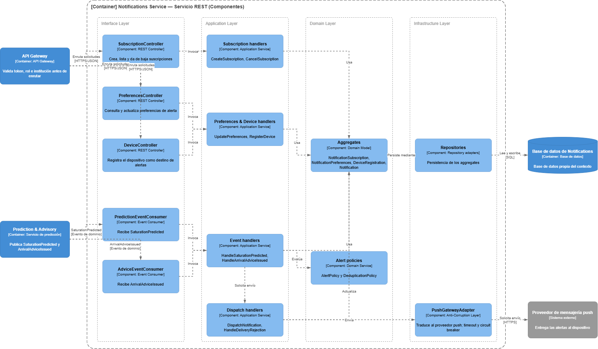
 
### 5.7.7. Bounded Context Software Architecture Code Level Diagrams
 
#### 5.7.7.1. Bounded Context Domain Layer Class Diagrams
 
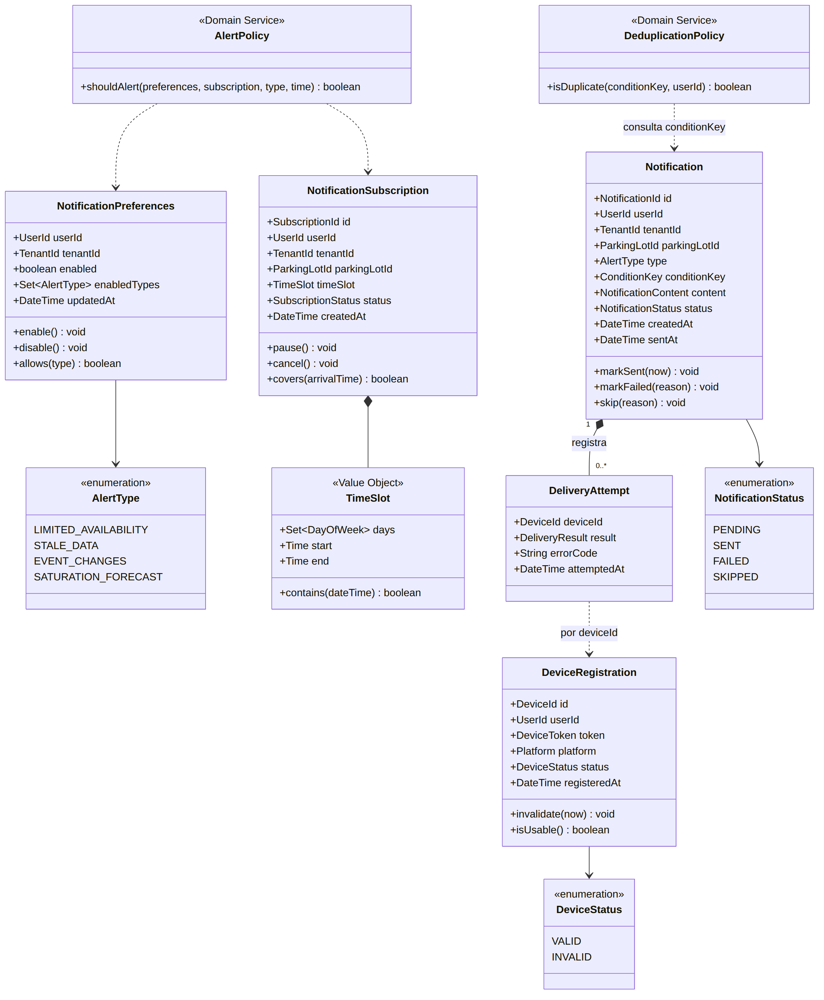
 
#### 5.7.7.2. Bounded Context Database Design Diagram
 
Las columnas `user_id`, `tenant_id` y `parking_lot_id` guardan identificadores de otros contextos como referencias lógicas, sin claves foráneas, para respetar la independencia de las bases de datos (CON-02).
 
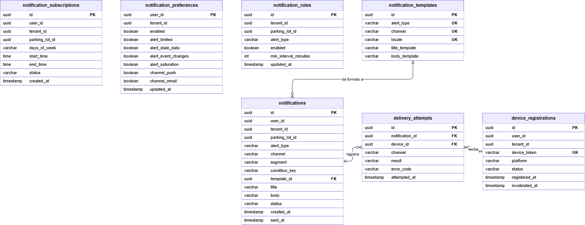
 
**Índices relevantes.** Índice único sobre (`user_id`, `condition_key`) en `notifications` para sostener la deduplicación, índice único sobre (`alert_type`, `channel`, `locale`) en `notification_templates`, índice sobre (`parking_lot_id`, `status`) en `notification_subscriptions` para localizar rápidamente las suscripciones afectadas por una saturación prevista.

 

# Capítulo VI: Solution UX Design

## 6.1. Style Guidelines

Las Style Guidelines establecen los criterios visuales y de interacción que dan coherencia a los tres productos de Quadrapp: la Landing Page, la aplicación móvil del conductor y la consola web de operación de cada universidad. Se definieron a partir de los diseños de interfaz elaborados por el equipo de frontend y se alinean con los constraints CON-11 (accesibilidad e internacionalización) y CON-13 (Material Design), con la privacidad de la ubicación (CON-07) y con la propuesta de valor del producto: informar con claridad y honestidad cuánta confianza merece cada dato.

### 6.1.1. General Style Guidelines

**Identidad de marca.** Quadrapp se presenta como un producto sobrio, confiable y orientado a la decisión. Su lenguaje visual transmite tres ideas: claridad (una respuesta antes que muchos datos), honestidad (toda estimación muestra su confianza y su antigüedad) y privacidad (el mensaje "compartimos minutos de llegada, nunca tu ubicación" se repite en los puntos de decisión). El logotipo es un ícono de marcador de ubicación en blanco sobre un cuadrado redondeado de color teal, acompañado del nombre "Quadrapp" en tipografía de trazo ligero. Sobre fondos oscuros, el ícono se invierte (marcador teal sobre fondo claro).

**Paleta de colores.** La paleta se compone de un color de marca, neutros de fondo y texto, y colores semánticos que comunican el estado de la disponibilidad. Los valores hexadecimales se tomaron de los diseños entregados.

<p align="center">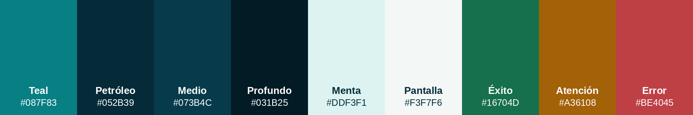</p>

| Rol | Color | Hex | Uso principal |
|---|:---:|---|---|
| Primario (marca) |  | `#087F83` | Botones principales, enlaces, ítem activo de navegación, ícono de marca |
| Primario oscuro |  | `#052B39` | Texto principal, encabezados, tarjetas destacadas (resultado de la asesoría de llegada), sidebar |
| Superficie oscura |  | `#073B4C` | Tarjetas de resumen y secciones oscuras de la Landing Page |
| Fondo oscuro profundo |  | `#031B25` | Barra lateral de la consola web de operación |
| Acento suave |  | `#DDF3F1` | Avisos informativos, chips activos, fondos de íconos |
| Fondo de pantalla |  | `#F3F7F6` | Fondo general de las aplicaciones |
| Superficie |  | `#FFFFFF` | Tarjetas, formularios, modales |
| Texto secundario |  | `#4D5C5E` | Descripciones, etiquetas, ayudas |
| Borde |  | `#CEDDDA` | Bordes de tarjetas y campos |
| Éxito / Buena disponibilidad |   | `#16704D` (fondo `#DFF3E9`) | Espacios libres, categoría HIGH, estado operativo |
| Atención / Limitada / UNKNOWN |    | `#A36108` (acento `#D98617`, fondo `#FFF2D6`) | Disponibilidad limitada, espacios UNKNOWN, datos desactualizados |
| Error / Baja disponibilidad |   | `#BE4045` (fondo `#FCE6E6`) | Categoría LOW, dispositivos sin señal, acciones destructivas |

**Significado de los colores de estado.** El color nunca es el único portador del significado: cada estado incluye siempre un texto y, cuando corresponde, un ícono (por ejemplo, "Buena disponibilidad", "Limitada", "Poca disponibilidad", "Sin datos"). La correspondencia con el dominio es:

| Estado | Color | Etiqueta | En el plano | Texto en pantalla |
|---|---|:---:|:---:|---|
| HIGH | Verde |  | | Buena disponibilidad |
| LIMITED | Ámbar |  | | Disponibilidad limitada |
| LOW | Rojo |  | | Poca disponibilidad |
| Espacio libre | Verde |  |  | Libre |
| Espacio ocupado | Gris petróleo |  |  | Ocupada |
| UNKNOWN | Ámbar con trama diagonal en el plano |  |  | Sin datos / UNKNOWN (nunca se cuenta como libre) |

**Contraste y accesibilidad.** Se verificó la relación de contraste de los pares de color principales frente al criterio WCAG 2.2 nivel AA (4.5:1 para texto normal, 3:1 para texto grande y componentes de interfaz).

| Combinación | Muestra | Relación | Resultado |
|---|:---:|---|---|
| Texto `#052B39` sobre fondo `#F3F7F6` |  | 13.8:1 | Cumple |
| Blanco sobre `#052B39` |  | 14.9:1 | Cumple |
| Blanco sobre botón teal `#087F83` |  | 4.8:1 | Cumple |
| Texto `#4D5C5E` sobre blanco |  | 7.0:1 | Cumple |
| Verde `#16704D` sobre `#DFF3E9` |  | 5.2:1 | Cumple |
| Rojo `#BE4045` sobre blanco |  | 5.2:1 | Cumple |
| Teal `#087F83` como texto sobre `#F3F7F6` |  | 4.45:1 | Ligeramente bajo en texto pequeño |
| Teal `#087F83` como texto sobre `#DDF3F1` |  | 4.15:1 | Bajo en texto pequeño |
| Ámbar `#A36108` sobre `#FFF2D6` |  | 4.43:1 | Ligeramente bajo en texto pequeño |
| Rojo `#BE4045` sobre `#FCE6E6` |  | 4.39:1 | Ligeramente bajo en texto pequeño |

Para los cuatro casos bajo el umbral, la guía establece que el texto pequeño use una variante más oscura del mismo tono, o que se aplique peso seminegrita o tamaño grande. Los íconos y bordes de componentes mantienen al menos 3:1.

| Variante para texto pequeño | Muestra | Relación |
|---|:---:|---|
| `#066A6E` sobre fondos claros (menta) |  | 5.9:1 |
| `#8A5206` sobre ámbar claro |  | 5.8:1 |
| `#A8363B` sobre rojo claro |  | 5.4:1 |

**Tipografía.** Los diseños emplean una familia sans-serif de formas abiertas y alta legibilidad en pantalla, de aspecto similar a Inter, usada en toda la solución. La jerarquía se resuelve con tamaño y peso, no con cambios de familia.

| Nivel | Uso | Peso | Referencia de tamaño |
|---|---|---|---|
| Display | Título principal de la Landing Page | Regular | 40–56 px (escritorio), 32 px (móvil) |
| Título de pantalla | "Operación de turno", "Estacionamientos" | Seminegrita | 24–28 px |
| Título de tarjeta | "Saturación prevista", "Alertas" | Seminegrita | 18–20 px |
| Cifra destacada | 82 %, 184 libres | Seminegrita | 32–48 px |
| Cuerpo | Descripciones y listas | Regular | 14–16 px |
| Etiqueta / ayuda | Datos actualizados hace 2 min | Regular | 12–13 px |

<p align="center"></p>

Los textos se alinean a la izquierda, con línea de altura cómoda (aprox. 1.4 a 1.6) y sin mayúsculas sostenidas salvo en etiquetas cortas de sección (por ejemplo, "CÓMO FUNCIONA").

**Iconografía.** Se utiliza un único conjunto de íconos lineales, de trazo uniforme y esquinas redondeadas, para mantener la coherencia (marcador de ubicación, escudo de privacidad, campana de alertas, gráfico de predicción, mapa de zonas, puerta de accesos, antena de sensores). Los íconos acompañan siempre a una etiqueta de texto en la navegación.

**Forma, espacio y elevación.** Las tarjetas y los modales usan esquinas muy redondeadas (aprox. 16–24 px), los botones y campos esquinas medias (aprox. 12 px) y los chips de estado forma de píldora. La separación entre elementos sigue una escala de múltiplos de 4 u 8 px. La elevación es mínima: las tarjetas se distinguen por un borde fino (`#CEDDDA`) y una sombra muy suave, y los modales se apoyan en un fondo atenuado.

**Voz y tono.** Los textos se redactan en español latinoamericano (es_419) con inglés (en_US) como alternativa, en segunda persona y con frases cortas. Se evita el lenguaje técnico en la aplicación del conductor ("¿Encontraré espacio al llegar?") y se usa vocabulario operativo preciso en la consola ("Aforo", "Saturación prevista", "Incidencias"). Las estimaciones se presentan siempre como estimaciones: incluyen el nivel de confianza, la antigüedad del dato y, cuando corresponde, la advertencia de historial limitado. Los mensajes de privacidad son explícitos y breves.

**Imágenes y datos.** La Landing Page usa fotografía de campus y de trabajo en equipo en tonos cálidos, con superposiciones oscuras de color petróleo para asegurar la lectura del texto. En las aplicaciones no se usan fotografías; los datos se presentan con cifras grandes, barras de progreso, gráficos de línea simples y planos esquemáticos del estacionamiento.

### 6.1.2. Web, Mobile & Devices Style Guidelines

La solución se compone de tres productos con contextos de uso distintos. Esta sección precisa cómo se aplican las guías generales en cada uno.

| Producto | Dispositivo principal | Usuario | Patrón de diseño |
|---|---|---|---|
| Landing Page | Navegador web (escritorio y móvil) | Visitante: conductor o institución | Página de desplazamiento vertical con secciones, llamadas a la acción por segmento y formulario de contacto |
| Aplicación móvil del conductor | Teléfono (Android e iOS, Flutter) | Conductor de la comunidad educativa | Navegación inferior de cuatro destinos |
| Consola web de operación | Navegador web de escritorio y, durante el turno, del teléfono (responsive) | Administrador de estacionamientos universitarios (roles de administrador y operador) | Panel con barra lateral oscura en escritorio; navegación inferior de cinco destinos en la vista móvil |

**Aplicación móvil del conductor.**
- *Navegación.* Barra inferior con cuatro destinos: Inicio, Zonas, Predicción y Alertas. El destino activo se resalta en teal con ícono y etiqueta.
- *Pantalla de inicio.* Una tarjeta oscura central responde la pregunta "¿Encontraré espacio al llegar?" con el porcentaje, la categoría, el tiempo de llegada "calculado en tu dispositivo" y la confianza. Debajo se muestran los horizontes de 15, 30, 45 y 60 minutos como fichas coloreadas por categoría.
- *Acceso.* El inicio de sesión es de dos pasos: correo institucional y código de verificación de seis dígitos con cuenta regresiva para reenviar. Un aviso explica que, si la conexión se interrumpe, el código se conserva y se reintenta.
- *Zonas.* Resumen de capacidad, libres y desconocidos, y tarjetas por zona con etiqueta de estado. El detalle de zona ofrece vista de mapa esquemático y vista de lista con filtros (Todas, Libres, Sin datos), siempre con la advertencia de que la vista es una muestra.
- *Predicción.* Tarjeta con el tiempo de llegada y una tarjeta por horizonte con barra de progreso y categoría. Un panel inferior deslizable muestra el detalle (ocupación prevista, saturación, momento de generación, vigencia, fuente, nivel de confianza y versión del modelo).
- *Alertas.* Interruptores por tipo de alerta, franjas horarias por estacionamiento con opción de pausar o eliminar, y un aviso de datos desactualizados.
- *Estados transversales.* Indicador "En línea", aviso ámbar con la antigüedad cuando los datos están desactualizados, y modo sin conexión que conserva la última consulta con su marca de tiempo (TS13).
- *Interacción.* Objetivos táctiles de al menos 44 × 44 px, acciones principales en la mitad inferior de la pantalla y un único botón primario por vista.

**Consola web de operación (administradores y operadores de cada universidad).**
- *Navegación.* En escritorio, barra lateral oscura fija con las secciones Inicio, Zonas, Accesos y dispositivos, Analítica y Administración, y contenido en tarjetas de indicadores y tablas con filtros. En la vista móvil, cinco destinos inferiores: Inicio, Zonas, Accesos, Analítica y Más. Un selector de campus en el encabezado indica el ámbito institucional (CON-08).
- *Roles.* El administrador accede a todas las secciones; el operador accede al monitoreo del turno (inicio, zonas, accesos y alertas) y no ve las acciones de configuración.
- *Inicio de turno.* Tarjeta de aforo con libres, ocupados y desconocidos; tarjeta de saturación prevista con la zona, la franja y la confianza; lista de alertas por gravedad (rojo para pérdida de señal, ámbar para sensores UNKNOWN) y resumen del flujo de los últimos 15 minutos.
- *Gestión de la distribución.* Plano esquemático por zonas, edición mediante hojas inferiores ("Añadir zona", "Añadir espacio"), borrador con número de versión y publicación con una confirmación que resume los cambios. Las acciones con impacto (deshabilitar un espacio) exigen un diálogo de confirmación con botón rojo.
- *Accesos, dispositivos y analítica.* Flujo en vivo con barras, estado por acceso, salud de sensores y gateways, registro, reemplazo y baja de dispositivos (US32), gráfico de ocupación observada frente a pronóstico, precisión por horizonte y exportación de reporte.
- *Administración.* Calendario del campus, dominios institucionales con estado de verificación y gestión de invitaciones al equipo.

**Landing Page.**
- *Estructura.* Encabezado con navegación (Cómo funciona, Conductores, Instituciones, Privacidad, Nosotros, FAQ) y botón de contacto; sección principal con titular, subtítulo y llamadas a la acción para conductores e instituciones; franja de beneficios; secciones por segmento con maqueta del producto; sección de señales de la predicción; privacidad por diseño; beneficios; presentación de Integra Labs; formulario de contacto institucional; preguntas frecuentes; y pie de página con enlaces a términos y política de privacidad (CON-18).
- *Estilo.* Alterna fondos claros y oscuros para separar el mensaje de conductores del de instituciones; el botón primario es teal y el secundario es un botón con borde. Todas las secciones mantienen el mismo ancho máximo de contenido y centrado.

**Comportamiento responsivo.**
- Móvil (hasta 600 px): una columna, navegación inferior, tarjetas a todo el ancho con 16 px de margen lateral.
- Tableta (600–1024 px): dos columnas en tarjetas de resumen, navegación inferior o lateral colapsada.
- Escritorio (más de 1024 px): barra lateral fija en las consolas, cuadrículas de hasta cuatro columnas, tablas con todas las columnas y ancho máximo de lectura en la Landing Page.

**Componentes comunes.**

*Botones.* Primario (teal con texto blanco), secundario (borde y texto petróleo) y destructivo (rojo). Un solo botón primario por vista; los botones largos incluyen ícono a la derecha.

<p align="center"></p>

*Tarjetas.* Fondo blanco, borde fino, esquinas redondeadas y título de tarjeta en la parte superior; las tarjetas destacadas usan fondo `#052B39` con texto blanco.

<p align="center">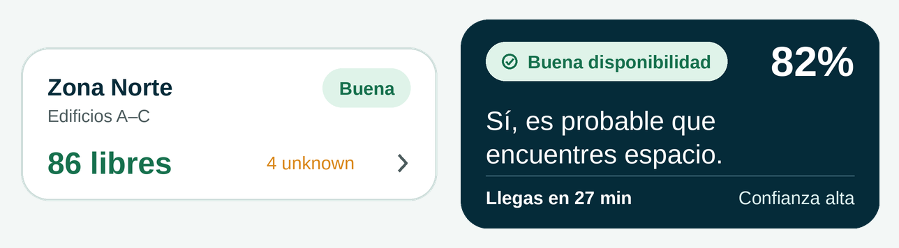</p>

*Chips y etiquetas.* Forma de píldora con color de fondo claro y texto oscuro del mismo tono, siempre con texto.

<p align="center">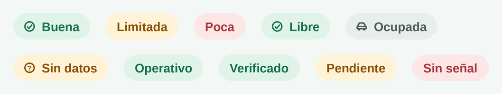</p>

*Avisos.* Informativo (menta), advertencia (ámbar claro), error (rojo claro) y éxito (verde claro), con ícono a la izquierda y mensaje breve.

<p align="center">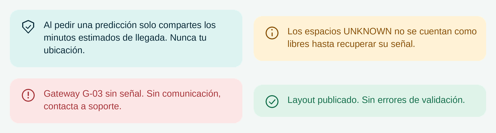</p>

*Formularios.* Etiqueta encima del campo, ayuda debajo, borde teal al enfocar, borde rojo con mensaje en línea cuando hay error y marca de obligatorio con asterisco.

<p align="center">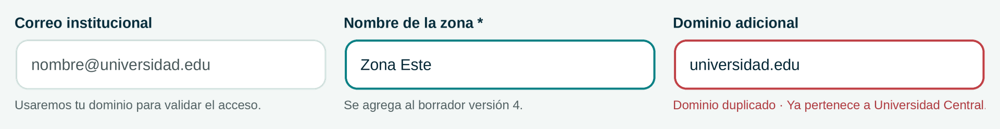</p>

*Modales y hojas inferiores.* Hoja deslizable para formularios y detalles en móvil; diálogo centrado para confirmaciones; fondo atenuado y botón de cierre visible.

**Accesibilidad e internacionalización.**
- Cumplimiento objetivo de WCAG 2.2 nivel AA en la Landing Page y en la consola de operación, con atributos ARIA en los elementos interactivos, foco visible y orden de tabulación lógico.
- El estado nunca depende solo del color; se acompaña de texto, ícono o trama.
- Los textos están disponibles en es_419 y en_US (inglés por defecto), con formatos de fecha y hora según el idioma.
- Los mensajes de error indican qué ocurrió y cómo resolverlo, y los datos desactualizados se señalan siempre con su antigüedad.

**Privacidad en la interfaz.**
Los mensajes sobre el tratamiento de la ubicación aparecen en el inicio de sesión, en la pantalla de inicio, en la predicción y en las preferencias de alertas, con un ícono de escudo y un texto equivalente a "Compartimos minutos de llegada, nunca tu ubicación", en coherencia con CON-07.


## 6.2. Information Architecture

### 6.2.1. Organization Systems

Quadrapp combina diferentes sistemas de organización de acuerdo con el tipo de información y la tarea que realiza el usuario.

- **Organización jerárquica:** Prioriza la información más relevante. En la aplicación móvil se muestra primero la disponibilidad actual y la información relacionada con la llegada del conductor. En la aplicación web se prioriza el estado general del estacionamiento antes de presentar información más detallada por zona, historial o analítica.
- **Organización secuencial:** Se utiliza en procesos que requieren completar pasos en un orden determinado, como el inicio de sesión mediante correo institucional, la configuración de un estacionamiento y sus zonas, la incorporación de sensores o el registro de información del calendario académico.
- **Organización matricial:** Se utiliza principalmente en las vistas de analítica, donde la información puede analizarse combinando diferentes dimensiones como estacionamiento, zona, periodo y versión del modelo de predicción.

<br>

También se aplican distintos esquemas de categorización:

- **Por tópicos:** Las funcionalidades se agrupan en disponibilidad, predicción, alertas, configuración y analítica.
- **Por audiencia:** La Landing Page diferencia claramente el contenido dirigido a conductores y el contenido orientado a instituciones educativas.
- **Cronológica:** Se utiliza en historiales de ocupación, periodos de mayor demanda, eventos del calendario y evaluación de predicciones.
- **Alfabética:** Puede utilizarse en listas extensas de estacionamientos, zonas o elementos de configuración para facilitar su localización.

En la aplicación móvil, la organización está orientada a permitir que el conductor consulte rápidamente los estacionamientos de su institución, su disponibilidad actual y las condiciones esperadas para su llegada.

### 6.2.2. Labeling Systems

El sistema de etiquetado de Quadrapp busca utilizar términos simples, directos y consistentes entre la aplicación móvil, la aplicación web y la Landing Page.

Se evita mostrar términos técnicos internos como nombres de servicios, eventos de dominio o tecnologías IoT cuando no son necesarios para que el usuario complete una tarea.

**Principios generales:**

- Se utilizan etiquetas breves y fáciles de reconocer.
- Un mismo concepto mantiene el mismo nombre en todos los productos.
- Las acciones se representan mediante verbos directos.
- Los términos técnicos se reservan para las funciones administrativas que realmente los requieren.
- Los estados importantes se acompañan de elementos visuales que faciliten su interpretación.

<br>

**Landing Page:**

Las etiquetas principales son:
- Inicio
- Conductores
- Instituciones
- Funcionalidades
- Nosotros
- Contacto
- Descargar app

En el pie de página se mantienen accesos claros a:
- Política de privacidad
- Términos y condiciones
- Contacto

<br>

**Aplicación móvil:**

Las principales etiquetas utilizadas son:
- Inicio
- Estacionamientos
- Disponibilidad
- Predicción
- Mi llegada
- Alertas
- Preferencias
- Cerrar sesión

Para comunicar el estado de ocupación se utilizarán términos como:
- Disponible
- Ocupado
- Sin información

Cuando se muestra una predicción, se utilizan etiquetas fáciles de interpretar como:
- 15 min
- 30 min
- 45 min
- 60 min
- Confianza baja

Estas etiquetas permiten consultar las predicciones de forma clara y poco confusa para los usuarios, sin exponer detalles internos del modelo utilizado para generarlas.

<br>

**Aplicación Web:**

Las secciones principales utilizan etiquetas relacionadas con las tareas del administrador:
- Operación
- Estacionamientos
- Zonas
- Sensores
- Calendario
- Analítica
- Usuarios
- Configuración

Dentro de Analítica se utilizan etiquetas como:
- Historial
- Horas pico
- Precisión

En las acciones se utilizarán:
- Ver detalle
- Guardar cambios
- Aplicar filtros
- Invitar usuario
- Añadir zona
- Registrar evento

De esta manera, las etiquetas describen la acción o información disponible sin obligar al usuario a interpretar términos técnicos.

### 6.2.3. Searching Systems

El sistema de búsqueda de Quadrapp está pensado para que conductores y administradores encuentren rápidamente la información que necesitan sin tener que recorrer grandes cantidades de datos. En la aplicación móvil, la búsqueda se centra en localizar estacionamientos, consultar zonas y revisar la disponibilidad actual o futura. En la aplicación web se orienta principalmente a consultar información histórica y analítica mediante filtros relacionados con el estacionamiento, la zona y el periodo de análisis.

Las opciones de búsqueda mantienen las mismas etiquetas utilizadas en el resto de la plataforma, de manera que términos como Estacionamiento, Zona, Disponibilidad, Predicción e Historial se utilicen de forma consistente.

**Principios generales:**

- Toda consulta se realiza dentro del contexto de la institución del usuario autenticado, por lo que solo se presenta información correspondiente a su universidad.
- Los filtros disponibles dependen del módulo en el que se encuentre el usuario y únicamente muestran opciones relevantes para esa consulta.
- Cuando una búsqueda o consulta no devuelve información, la interfaz muestra un mensaje explicativo en lugar de presentar una vista vacía.
- Los filtros seleccionados permanecen visibles mientras se revisan los resultados, permitiendo identificar fácilmente qué información se está consultando.
- La información se presenta de manera diferente según su naturaleza: listas y tarjetas para disponibilidad, y gráficos o tablas para información histórica y analítica.

<br>

**Consulta de estacionamientos:**
En la aplicación móvil, la consulta de estacionamientos permite al conductor visualizar los estacionamientos disponibles dentro de su institución y seleccionar aquel que desea revisar. Una vez seleccionado, puede acceder a su información de disponibilidad y consultar las zonas que lo conforman.

Cada estacionamiento presenta la información necesaria para que el conductor pueda interpretar rápidamente su situación. Cuando no existen datos de ocupación vigentes, la aplicación lo comunica de forma explícita para evitar que información desactualizada sea interpretada como disponibilidad actual.

Desde el detalle del estacionamiento, el usuario puede profundizar en una zona específica para revisar la cantidad de espacios disponibles, ocupados o sin información confiable.

<br>

**Consulta de disponibilidad por zona:**
Cuando un estacionamiento se encuentra dividido en zonas, el conductor puede utilizar esta clasificación como un filtro para reducir la información mostrada y concentrarse en un sector específico.

Los resultados se presentan de forma agrupada por zona, permitiendo comparar rápidamente dónde existe mayor disponibilidad. Cada resultado mantiene el estado de ocupación correspondiente y la antigüedad de la información disponible.

Este mecanismo evita que el conductor tenga que revisar individualmente todos los espacios del estacionamiento para conocer qué sector presenta mejores condiciones.

<br>

**Consulta de predicciones:**

Dentro de la información de un estacionamiento, la predicción funciona como una búsqueda temporal sobre la disponibilidad esperada. El conductor puede consultar diferentes horizontes de tiempo:
- 15 minutos.
- 30 minutos.
- 45 minutos.
- 60 minutos.

Al seleccionar uno de estos horizontes, la aplicación muestra la ocupación esperada para ese momento y la información necesaria para interpretar el resultado. Cuando la predicción se basa en información limitada, esta condición se indica claramente mediante el estado Confianza baja.

La asesoría de llegada utiliza además el tiempo estimado de llegada calculado por la aplicación para presentar al conductor información acorde con el momento en el que espera llegar al campus.

<br>

**Consulta del historial de ocupación:**

En la aplicación web, el módulo de analítica permite realizar consultas temporales sobre la información histórica de los estacionamientos. El administrador puede establecer un rango de fechas y seleccionar el estacionamiento que desea analizar.

Cuando corresponde, también puede limitar la consulta a una zona específica. Los resultados permiten revisar el comportamiento de la ocupación durante el periodo seleccionado y pueden organizarse por hora o por día para facilitar su interpretación.

Si no existen registros para los criterios establecidos, la vista informa que no hay información disponible para el periodo seleccionado.

<br>

**Consulta de periodos de mayor ocupación:**

A partir de los registros históricos, el administrador puede consultar los periodos en los que se concentra una mayor ocupación del estacionamiento.

La búsqueda utiliza el periodo y el estacionamiento seleccionados para mostrar las variaciones temporales de la ocupación e identificar los momentos de mayor demanda. Cuando la cantidad de información disponible no es suficiente para realizar este análisis, la interfaz comunica esta situación en lugar de presentar resultados incompletos.

<br>

**Consulta de precisión de las predicciones:**

La aplicación web también permite consultar la precisión de las predicciones generadas por Quadrapp. Esta consulta compara los pronósticos almacenados con la ocupación posteriormente observada.

El administrador puede revisar resultados como el error absoluto medio (MAE) y el porcentaje de predicciones que se encuentran dentro del margen configurado. Los resultados se diferencian por versión del modelo para evitar combinar mediciones correspondientes a versiones distintas.

Cuando no existen suficientes pronósticos y observaciones para realizar el cálculo, la plataforma indica que no es posible obtener una medida de precisión para el periodo consultado.

<br>

**Centro de alertas:**

En la aplicación móvil, la sección de alertas concentra las notificaciones relacionadas con la disponibilidad prevista de los estacionamientos a los que el conductor se encuentra suscrito.

El usuario puede gestionar sus preferencias y definir las franjas horarias en las que desea recibir este tipo de información. De esta manera, la sección funciona como un punto central para revisar las alertas relevantes relacionadas con una posible baja disponibilidad, sin mezclarlas con las consultas normales de estacionamientos y predicciones.

### 6.2.4. SEO Tags and Meta Tags

En Quadrapp, los SEO Tags y Meta Tags permiten mejorar la visibilidad de la solución en motores de búsqueda y facilitar que conductores de la comunidad educativa e instituciones interesadas encuentren información sobre el producto. La Landing Page funciona como el principal punto de entrada público, ya que presenta la propuesta de valor, las funcionalidades principales y contenido diferenciado para conductores e instituciones.

#### SEO Tags:

Los SEO Tags se utilizan para optimizar el posicionamiento orgánico de la Landing Page y comunicar de forma clara que Quadrapp es una solución orientada a la consulta y predicción de disponibilidad en estacionamientos universitarios.


**Title Tag:**

Define el título que se muestra en los resultados de búsqueda y en la pestaña del navegador.

`<title>Quadrapp | Estacionamiento universitario inteligente</title>`

El título combina el nombre del producto con una descripción breve de su propósito, evitando términos técnicos innecesarios.

<br>

**Meta Description:**

Proporciona un resumen breve de la propuesta de valor de Quadrapp.

`<meta name="description" content="Quadrapp te permite consultar la disponibilidad de estacionamientos universitarios y conocer las condiciones esperadas antes de llegar al campus."/>`

La descripción destaca las dos capacidades principales orientadas al conductor: conocer la disponibilidad actual y anticipar las condiciones que encontrará al llegar.

<br>

**Meta Keywords:**

Incluye términos relacionados directamente con el problema y con las capacidades de la solución.

`<meta name="keywords" content="estacionamiento universitario, estacionamiento inteligente, disponibilidad de estacionamientos, predicción de disponibilidad, smart parking, campus universitario"/>`

<br>

**Meta Author:**

Identifica a la organización responsable del producto.

`<meta name="author" content="Integra Labs" />`

<br>

**Header Tags:**

Los Header Tags organizan semánticamente el contenido de la Landing Page y permiten establecer una jerarquía clara entre la propuesta de valor y la información secundaria.

Un ejemplo de jerarquía para Quadrapp sería:

```html
<h1>Anticipa la disponibilidad antes de llegar al campus</h1>

<h2>Estacionamientos universitarios con información actual y predicciones de disponibilidad</h2>

<h3>Consulta dónde estacionar y conoce las condiciones esperadas para tu llegada</h3>
```

El encabezado principal comunica directamente el beneficio diferencial de Quadrapp: no limitarse a mostrar la disponibilidad actual, sino ofrecer información sobre las condiciones esperadas al momento de llegada. Esta capacidad forma parte central de la propuesta del producto.

#### Meta Tags
Los Meta Tags proporcionan información técnica al navegador y a los motores de búsqueda. También permiten establecer aspectos básicos de accesibilidad, adaptación a dispositivos y comportamiento de indexación.

**Charset Meta Tag:**

Define la codificación de caracteres utilizada por la Landing Page.

`<meta charset="UTF-8" />`

<br>

**Viewport Meta Tag:**

Permite que la página se adapte correctamente a diferentes tamaños de pantalla.

```html
<meta
  name="viewport"
  content="width=device-width, initial-scale=1.0"
/>
```

<br>

**Robots Meta Tag:**

La Landing Page es contenido público y puede ser indexada por motores de búsqueda.

```html
<meta name="robots" content="index, follow" />
```

<br>

**Canonical Tag:**

La etiqueta canonical permitirá señalar la dirección oficial de la Landing Page y evitar posibles duplicidades de contenido.

`<link rel="canonical" href="[URL oficial de la Landing Page]" />`


#### Web Application Meta Tags
La consola administrativa de Quadrapp es una aplicación destinada al personal autorizado de cada institución, por lo que sus vistas privadas no están orientadas al posicionamiento público en buscadores.

<br>

**Title Tag:**

`<title>Quadrapp Console | Gestión de estacionamientos</title>`

<br>

**Meta Description:**

```html
<meta
  name="description"
  content="Consola de Quadrapp para supervisar la ocupación, gestionar la configuración y analizar el comportamiento de los estacionamientos universitarios."
/>
```

<br>

**Meta Author:**

`<meta name="author" content="Integra Labs" />`

<br>

**Robots Meta Tag:**

Al tratarse de una aplicación de acceso restringido, las vistas internas no deben indexarse.

`<meta name="robots" content="noindex, nofollow" />`


#### Landing Page SEO Tags para la aplicación móvil

Además de presentar la solución de forma general, la Landing Page incluirá contenido específico para el segmento de conductores y una llamada a la acción que los dirija hacia el sitio de descarga de la aplicación móvil.

Para esta sección pueden utilizarse etiquetas enfocadas en la aplicación:

`<title>Quadrapp | Consulta la disponibilidad antes de llegar</title>`

```html
<meta
  name="description"
  content="Consulta la disponibilidad actual de los estacionamientos de tu universidad, revisa predicciones y conoce las condiciones esperadas antes de llegar al campus."
/>
```


```html
<meta
  name="keywords"
  content="Quadrapp, estacionamiento universitario, disponibilidad de estacionamiento, app de estacionamiento, predicción de disponibilidad, parking universitario"
/>
```

`<meta name="author" content="Integra Labs" />`


### 6.2.5. Navigation Systems

Los sistemas de navegación de Quadrapp están diseñados para que conductores, administradores y operadores accedan de forma rápida a las funcionalidades que necesitan según su contexto de uso. La aplicación móvil prioriza la consulta de disponibilidad y predicciones antes de llegar al campus, mientras que la consola web facilita el monitoreo y la gestión de los estacionamientos. Por su parte, la Landing Page guía a los visitantes desde la propuesta de valor hacia la descarga de la aplicación o el contacto institucional.

#### Aplicación Móvil — Conductores de la Comunidad Educativa

| Elemento de Navegación | Descripción |
|---|---|
| **Menú inferior (tab bar)** | Mantiene accesos directos a las principales secciones de la aplicación: Inicio, Estacionamientos, Alertas y Preferencias. Permanece disponible durante la navegación principal. |
| **Navegación jerárquica** | Desde Estacionamientos, el conductor puede seleccionar un estacionamiento y acceder a sus zonas, disponibilidad actual y predicciones. Esto permite avanzar desde información general hacia datos más específicos sin mostrar todo el contenido al mismo tiempo. |
| **Selector de horizonte** | Dentro de la consulta predictiva, permite alternar entre los horizontes de 15, 30, 45 y 60 minutos para conocer cómo podría variar la disponibilidad. |
| **Navegación contextual** | Las acciones relacionadas con un estacionamiento aparecen junto a su información. Desde su detalle, el conductor puede consultar la disponibilidad actual, revisar la predicción y acceder a la asesoría de llegada sin volver al menú principal. |
| **Indicadores de estado** | Los estados Disponible, Ocupado o Sin información se presentan de forma visible dentro de las consultas. También se informa cuando un dato está desactualizado o una predicción presenta confianza baja. |
| **Retroalimentación visual** | La interfaz mantiene resaltada la sección seleccionada y actualiza visualmente la información cuando el usuario cambia de estacionamiento, zona u horizonte de predicción. |

La navegación móvil sigue un recorrido progresivo:

Estacionamientos → Estacionamiento seleccionado → Zona → Disponibilidad → Predicción / Asesoría de llegada

Esta estructura mantiene como prioridad la información necesaria para que el conductor pueda anticipar las condiciones del estacionamiento antes de llegar al campus.


#### Aplicación Web — Administradores y Operadores

| Elemento de Navegación | Descripción |
|---|---|
| **Menú lateral persistente** | Proporciona acceso permanente a las principales áreas de la consola: Operación, Estacionamientos, Dispositivos, Calendario, Analítica y Usuarios. |
| **Dashboard de operación** | Funciona como vista principal durante la operación del estacionamiento. Presenta información como capacidad total, espacios libres, ocupados y desconocidos, flujo de entradas y salidas y saturación prevista. |
| **Navegación jerárquica** | Desde un estacionamiento se puede acceder progresivamente a su configuración, zonas, espacios, accesos y dispositivos asociados, manteniendo clara la relación entre los elementos. |
| **Navegación contextual** | Las acciones relacionadas con un elemento aparecen dentro de su propia vista. Por ejemplo, desde la configuración de un estacionamiento se puede gestionar su distribución sin trasladarse a una sección independiente. |
| **Filtros de analítica** | Las vistas históricas permiten ajustar la información mostrada según estacionamiento, zona y periodo. En el análisis de precisión, los resultados también pueden diferenciarse por versión del modelo. |
| **Estado de la sección activa** | El menú mantiene resaltado el módulo actual para que el administrador pueda reconocer fácilmente dónde se encuentra dentro de la consola. |

El dashboard concentra la información necesaria para supervisar el estacionamiento durante la operación, incluyendo disponibilidad, flujo y posibles situaciones de saturación.

Las funcionalidades administrativas se organizan de forma progresiva para evitar mezclar la operación diaria con tareas de configuración. El administrador puede registrar estacionamientos y posteriormente configurar los elementos que pertenecen a ellos, como zonas, espacios y dispositivos.


#### Landing Page — Visitantes

| Elemento de Navegación | Descripción |
|---|---|
| **Navbar superior fijo** | Incluye accesos a las principales secciones informativas: Funcionalidades, Conductores, Instituciones, Nosotros y Contacto. Permanece disponible mientras el visitante recorre la página. |
| **Scroll guiado por secciones** | La Landing Page utiliza una navegación vertical mediante anclas internas, permitiendo pasar rápidamente de la propuesta de valor a funcionalidades, segmentos y contacto. |
| **Botones de llamada a la acción (CTA)** | Los botones destacados orientan al visitante hacia el siguiente paso. El conductor dispone de una llamada a la acción para acceder al sitio de descarga de la aplicación, mientras que el visitante institucional puede dirigirse al formulario de contacto. |
| **Navegación por audiencia** | El contenido diferencia claramente la información destinada a conductores de aquella dirigida a instituciones, permitiendo que cada visitante encuentre la propuesta relacionada con sus necesidades. |
| **Jerarquía visual** | Los encabezados y bloques de contenido organizan la información desde la propuesta de valor general hacia detalles sobre funcionalidades y beneficios de la solución. |
| **Footer navegable** | Mantiene accesos secundarios a Política de privacidad, Términos y condiciones y Contacto desde la parte inferior de la página. |

La Landing Page permite recorrer las secciones informativas sin abandonar el sitio y separa el contenido de acuerdo con los dos segmentos principales del producto.

## 6.3. Landing Page UI Design

La Landing Page es el primer contacto de los dos segmentos con Quadrapp. Su diseño traduce la arquitectura de información de la sección 6.2 en una sola página con anclas: la barra de navegación lleva a *Cómo funciona*, *Conductores*, *Instituciones*, *Privacidad*, *Nosotros* y *FAQ*, y cada segmento tiene su propia sección y su propia llamada a la acción. El conductor llega a *Conocer la app* y a las descargas para iOS y Android (US26); el administrador, a *Soy una institución*, *Solicitar una conversación* y al formulario de contacto institucional (US27).

El contenido comunica el alcance real del producto para evitar falsas expectativas. Desde la portada se indica que Quadrapp no hace reservas, no cobra y no rastrea la ubicación (CON-10, CON-07); la sección de predicción aclara que una estimación orienta pero no reserva un espacio y explica el estado UNKNOWN; y la sección de privacidad explica que la aplicación calcula el tiempo estimado de llegada en el dispositivo. El pie de página enlaza los términos y condiciones y la política de privacidad (US28, CON-18).

Los diseños se elaboraron en Figma, en el archivo de diseño del equipo ([https://www.figma.com/design/orAlXnoI4TJUWComgfZ61m/Quadrapp?node-id=64-5&t=idG1AOA7wCpNoLc5-0](https://www.figma.com/design/orAlXnoI4TJUWComgfZ61m/Quadrapp?node-id=64-5&t=idG1AOA7wCpNoLc5-0)), a partir de la propuesta de valor (US25) y del Design System de la sección 6.1. La versión implementada se publicó en [https://tubular-chebakia-191aa8.netlify.app](https://tubular-chebakia-191aa8.netlify.app) y su código está en el repositorio [https://github.com/1ASI0728-2620-9056-Quadrapp/Landing_Page](https://github.com/1ASI0728-2620-9056-Quadrapp/Landing_Page) de la organización.

### 6.3.1. Landing Page Wireframe

El wireframe define la estructura y la jerarquía de la página sin usar color: los bloques grises marcan imágenes y superficies, y el texto ya es el definitivo, para validar la arquitectura de información antes de aplicar el estilo visual.

**Desktop Web Browser**

La página se organiza en una columna de contenido de 1440 px con márgenes laterales de 72 px, que mantienen alineados todos los bloques. De arriba abajo:

1. **Barra de navegación**, con la marca a la izquierda, las seis anclas al centro y la acción *Hablar con Integra Labs* a la derecha.
2. **Portada**, con el mensaje principal ("Anticipa el estacionamiento antes de salir"), dos acciones diferenciadas por segmento y tres garantías de alcance: sin reservas, sin pagos y sin rastreo de ubicación.
3. **Franja de valor**, con tres beneficios breves: antes de salir, durante el turno y con privacidad.
4. **Cómo funciona**, con tres pasos numerados (*Observa*, *Entiende*, *Anticipa*) que resumen el recorrido del sensor a la decisión.
5. **Para conductores**, con una vista previa de la aplicación (probabilidad y horizontes de 15 a 60 minutos) y los botones de descarga.
6. **Para instituciones**, con una vista previa de la consola (operación del turno, saturación prevista y alertas) y la acción *Solicitar una conversación*.
7. **Predicción con contexto**, con las cuatro señales del modelo y un aviso de transparencia.
8. **Privacidad por diseño**, **Beneficios** y **Nosotros**, con la visión y la misión de Integra Labs.
9. **Contacto institucional**, con un formulario de cinco campos y el consentimiento de uso de datos.
10. **Preguntas frecuentes** y **pie de página** con los enlaces de producto, compañía y documentos legales.

Se aplican los principios de jerarquía (un solo titular dominante por sección, con una etiqueta superior que nombra la sección), proximidad (cada sección agrupa texto, evidencia visual y acción), alineación (todo el contenido respeta los mismos márgenes) y repetición (las tarjetas de pasos, señales y beneficios comparten estructura). En diseño inclusivo, el formulario muestra etiquetas visibles sobre cada campo en lugar de depender del texto de ejemplo; los íconos siempre acompañan a un texto, y las preguntas frecuentes se presentan como un acordeón con respuestas cortas.

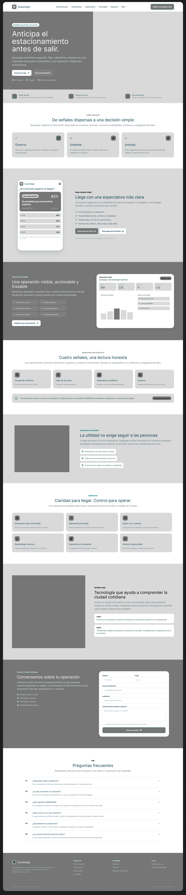

*Figura: wireframe de la Landing Page para Desktop Web Browser, elaborado en Figma.*

### 6.3.2. Landing Page Mock-up

El mock-up aplica sobre el wireframe el Design System de la sección 6.1, sin cambiar la estructura ni los textos.

**Desktop Web Browser**

- **Color.** El teal primario `#087F83` identifica las acciones principales y la marca; el azul petróleo `#052B39` y la superficie `#073B4C` dan fondo a la portada y a la sección de instituciones; el acento `#DDF3F1` marca la franja de valor y los avisos informativos; y `#F3F7F6` separa las secciones claras.
- **Estados.** La vista previa de la aplicación usa los colores de estado definidos: verde para buena disponibilidad, ámbar para disponibilidad limitada y rojo para baja disponibilidad, siempre acompañados del porcentaje, para que el color nunca sea la única señal. En la vista previa de la consola, el ámbar marca la franja de saturación prevista y los sensores en estado UNKNOWN.
- **Tipografía e íconos.** Se emplea la familia sans-serif de la guía de estilos, con la jerarquía resuelta por tamaño y peso, e íconos de línea con el mismo grosor en toda la página.
- **Imagen.** La portada usa una fotografía de un campus universitario, que sitúa el producto en su contexto, integrada mediante un degradado oscuro que mantiene el contraste del texto blanco.
- **Accesibilidad.** Los pares de color de texto y fondo son los verificados en la sección 6.1 frente al nivel AA de WCAG 2.2; los botones primarios combinan texto blanco sobre `#087F83` (4.8:1) y el texto principal usa `#052B39` sobre fondos claros (13.8:1).

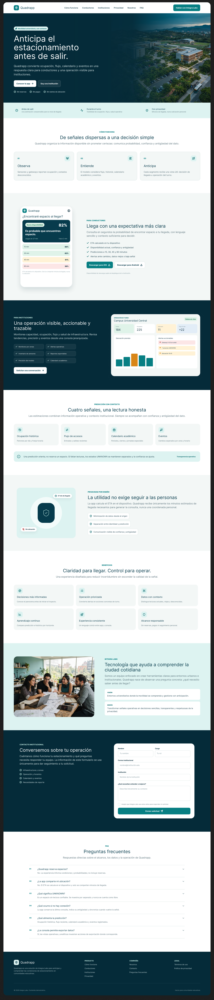

*Figura: mock-up de la Landing Page para Desktop Web Browser, elaborado en Figma.*

## 6.4. Applications UX/UI Design

### 6.4.1. Applications Wireframes

Los wireframes son bocetos en blanco y negro de baja fidelidad que definen la estructura, la jerarquía visual y la navegación de cada pantalla antes de aplicar la identidad visual. Quadrapp tiene dos tipos de usuario, que corresponden a sus segmentos: el **conductor de la comunidad educativa**, que usa la aplicación móvil, y el **administrador de estacionamientos universitarios** (con los roles de administrador y operador), que usa la consola web de operación. La consola es responsive: en escritorio presenta una barra lateral y, durante el turno, se adapta a la pantalla del teléfono con una navegación inferior. Los wireframes y los wireflows se elaboraron en Figma: [https://www.figma.com/design/orAlXnoI4TJUWComgfZ61m/Quadrapp?node-id=64-5&t=idG1AOA7wCpNoLc5-0](https://www.figma.com/design/orAlXnoI4TJUWComgfZ61m/Quadrapp?node-id=64-5&t=idG1AOA7wCpNoLc5-0). Los wireframes del administrador se presentan en sus dos versiones: la vista móvil, que se usa durante el turno, y la vista de escritorio, para la gestión del inventario de dispositivos.


#### VISTA CONDUCTOR (APP MÓVIL)

Acceso institucional: pantalla de ingreso del conductor. Solicita el correo institucional, cuyo dominio debe pertenecer a una universidad registrada en Quadrapp.  


**Verificación OTP**: el conductor ingresa el código de verificación de un solo uso enviado a su correo para completar el acceso.  


**Inicio y asesoría de llegada**: pantalla principal. Muestra la disponibilidad actual del estacionamiento de la sede elegida y la asesoría de llegada: la probabilidad de encontrar espacio según el tiempo en que el conductor estima llegar.  


**Detalle por zonas**: desglosa la disponibilidad del estacionamiento por zona, para que el conductor elija hacia dónde dirigirse.  


**Detalle de Zona Norte**: detalle de una zona (en el ejemplo, Zona Norte) con el estado de sus espacios.  


Lista: variante de la pantalla anterior que presenta los espacios de la zona en formato de lista.  


**Predicciones por horizonte**: muestra el pronóstico de ocupación para los horizontes de 15, 30, 45 y 60 minutos, identificando los que están vencidos o faltantes.  


**Detalle de predicción · 15 min**: detalle del pronóstico de un horizonte: ocupación esperada, confianza, método y vigencia.  


**Alertas y preferencias:** permite activar o desactivar las alertas (saturación y baja disponibilidad al llegar) y administrar las franjas horarias en que se reciben.  


#### VISTA ADMINISTRADOR DE ESTACIONAMIENTOS (CONSOLA WEB, VISTA MÓVIL)

**Inicio de operación**: pantalla principal del turno. Resume el estado operativo del estacionamiento y da acceso rápido a las tareas de operación.  


**Estacionamientos y zonas**: lista los estacionamientos de la universidad y sus zonas, con su estado de ocupación.  


**Gestión de zonas y layout**: permite editar el layout del estacionamiento (zonas y espacios) y publicar los cambios.  


**Accesos y configuración**: administra los accesos vehiculares y los parámetros de configuración del estacionamiento.  


**Salud de dispositivos**: muestra el estado de los dispositivos IoT del estacionamiento y permite reportar un problema.  


**Analítica y precisión**: presenta las métricas de ocupación y la precisión de los pronósticos, con opción de exportar el reporte.  


**Más · campus y equipo**: reúne la gestión del campus y del equipo: calendario de eventos, dominios institucionales e invitaciones al equipo.  


#### VISTA ADMINISTRADOR DE ESTACIONAMIENTOS (CONSOLA WEB, ESCRITORIO)

**Inventario de dispositivos**: lista los sensores y gateways de la institución con su zona, sede, tipo, asociación, salud, última comunicación y batería, y permite filtrarlos por zona, sede, estacionamiento, tipo y salud (US20, US32).  


**Gestión de dispositivo · G-03**: reúne en una sola vista el estado del dispositivo, su asociación actual y la incidencia abierta, junto con las acciones de registrar y asignar un dispositivo nuevo, reemplazarlo conservando la asociación y darlo de baja (US18, US32).  


**Registrar dispositivo**: ventana para registrar un sensor o gateway con su número de serie, tipo, estacionamiento, asociación, dirección (en los sensores de paso) e intervalo de reporte esperado (US19, US32). La institución se muestra fija: el administrador solo registra dispositivos de su universidad.  


**Reasignar G-03**: ventana para cambiar el estacionamiento asociado a un dispositivo. Advierte que los espacios que queden sin lectura pasan a UNKNOWN y no se cuentan como libres (US08, US18).  


**Dar de baja G-03**: ventana para retirar un dispositivo sin reemplazarlo. Exige un motivo y escribir el identificador para confirmar, y conserva el historial (US32).  


### 6.4.2. Applications Wireflow Diagrams

Los wireflows combinan las pantallas de los wireframes con flechas que indican qué elemento toca el usuario y a qué pantalla lleva. Se presentan nueve diagramas, uno por funcionalidad principal, organizados por tipo de usuario.

#### VISTA CONDUCTOR (APP MÓVIL)

**Wireflow 1 · Acceso, ingreso y cierre de sesión**: Parte de Acceso institucional, continúa con la Verificación OTP y llega a Inicio y asesoría de llegada; desde ahí, la ventana Cuenta permite cerrar sesión y volver al acceso.  


**Wireflow 2 · Disponibilidad al llegar**: Desde el Inicio, el conductor indica en cuántos minutos llega (¿Cuándo llegas?), consulta las Predicciones por horizonte y abre el Detalle de predicción de un horizonte.  


**Wireflow 3 · Sede y zonas**: Desde el Inicio el conductor elige la sede (Elegir sede) y recorre el Detalle por zonas hasta el Detalle de una zona, en su vista de mapa o de lista.  


**Wireflow 4 · Alertas por franja horaria**: En Alertas y preferencias, el conductor agrega una Nueva franja horaria y regresa a la pantalla con la franja ya configurada.  


#### VISTA ADMINISTRADOR DE ESTACIONAMIENTOS (CONSOLA WEB, VISTA MÓVIL)

**Wireflow 5 · Operación de turno**: Desde Inicio de operación, el administrador revisa Estacionamientos y zonas y entra a la Gestión de zonas y layout.  


**Wireflow 6 · Editar y publicar el layout**: Desde la Gestión de zonas y layout se añaden zonas y espacios, se deshabilitan espacios y se publica el layout tras una confirmación.  


**Wireflow 7 · Accesos, dispositivos y analítica**: Muestra tres recorridos: editar la configuración desde Accesos y configuración, reportar un problema desde Salud de dispositivos y exportar un reporte desde Analítica y precisión.  


**Wireflow 8 · Calendario, dominios y equipo**: Desde Más · campus y equipo, el administrador crea un evento de calendario, añade un dominio institucional o invita a un nuevo integrante al equipo.  


#### VISTA ADMINISTRADOR DE ESTACIONAMIENTOS (CONSOLA WEB, ESCRITORIO)

**Wireflow 9 · Dispositivos de la institución**: Desde el Inventario de dispositivos, el administrador registra un dispositivo nuevo o abre la Gestión de un dispositivo; desde ahí lo reasigna a otro estacionamiento o lo da de baja.  


---

# Conclusiones

## Avance de conclusiones

1. El trabajo realizado respalda el problema planteado para los conductores de la comunidad educativa. Las tres entrevistas registradas muestran que los participantes no conocen la disponibilidad antes de llegar, recurren a la intuición o a consultas por WhatsApp y han experimentado retrasos asociados con el tráfico, las colas o la búsqueda de un espacio. Estos resultados sustentan la necesidad de ofrecer información oportuna antes y durante el desplazamiento. Sin embargo, todavía no demuestran que la predicción reduzca el tiempo de búsqueda, ya que esta hipótesis requiere la implementación y evaluación de la solución.

2. El avance del segmento de administradores también evidencia una gestión principalmente reactiva. La entrevista disponible señala que la ocupación se estima mediante la experiencia, reportes de las tranqueras y revisiones de cámaras, mientras que los registros se consolidan manualmente al terminar el turno. Este resultado respalda la utilidad potencial de una consola que reúna la ocupación actual, la saturación prevista y el análisis histórico. Debido a que solo se cuenta con una entrevista de este segmento, el hallazgo todavía no puede generalizarse a otras instituciones.

3. Las evidencias obtenidas respaldan parcialmente los supuestos de Lean UX relacionados con la incertidumbre, la necesidad de anticipación y el valor de conocer la disponibilidad esperada al momento de llegada. Los criterios de éxito definidos, como reducir en 20 % el tiempo de búsqueda, alcanzar 80 % de precisión, lograr que 60 % de los conductores consulte la predicción y mantener más de 95 % de disponibilidad de datos, permanecen como metas por validar. Tampoco se ha comprobado todavía la adopción regular del dashboard ni la disposición de una institución para implementar un piloto.

4. La especificación funcional traduce las necesidades identificadas en capacidades para ambos segmentos. La aplicación móvil prioriza la consulta de ocupación, la predicción y la asesoría de llegada, mientras que la consola web se orienta a la configuración, el monitoreo y el análisis de la operación. El Product Backlog organiza estas capacidades junto con el trabajo técnico necesario y proporciona una base para planificar la construcción incremental del producto.

5. El diseño estratégico establece una arquitectura coherente con los riesgos principales del proyecto. Attribute-Driven Design permitió priorizar la precisión, la frescura de los datos, la tolerancia a fallas, el desempeño, la seguridad y el aislamiento entre instituciones. Domain-Driven Design separó las responsabilidades en siete bounded contexts y definió contratos de integración que evitan que los detalles de los sensores, la analítica y los proveedores externos se incorporen indebidamente al núcleo predictivo.

6. El alcance definido concentra el valor de Quadrapp en informar, predecir y apoyar la gestión del estacionamiento. La solución no administra reservas, cobros ni el control físico de acceso. Además, el tiempo estimado de llegada se calcula en el dispositivo y el servidor recibe únicamente los minutos, lo que reduce el tratamiento de datos de ubicación y mantiene la propuesta alineada con el principio de recopilar solo la información necesaria.

En esta etapa, Quadrapp cuenta con una propuesta de valor sustentada de manera preliminar y con una base funcional y arquitectónica para continuar su desarrollo. Las hipótesis de impacto y los criterios cuantitativos no se consideran alcanzados, puesto que todavía deben contrastarse mediante prototipos, pruebas técnicas y un piloto en un entorno universitario real. Este avance deberá actualizarse en las siguientes entregas con los resultados obtenidos durante el diseño de la experiencia, la implementación y la validación del producto.

## Video About-the-Team

*Pendiente de elaboración.*

---

# Bibliografía

Adzic, G. (2012). *Impact mapping: Making a big impact with software products and projects*. Provoking Thoughts. https://www.impactmapping.org/book.html

Apparka. (s. f.). *App Apparka*. Recuperado el 19 de septiembre de 2026 de https://apparka.pe/app-apparka/

Bass, L., Clements, P., y Kazman, R. (2021). *Software architecture in practice* (4.ª ed.). Addison-Wesley Professional. https://www.pearson.com/en-us/subject-catalog/p/software-architecture-in-practice/P200000000111/9780137468218

Brown, S. (s. f.). *The C4 model for visualising software architecture*. Recuperado el 19 de septiembre de 2026 de https://c4model.com/

Channamallu, S. S., Kermanshachi, S., Rosenberger, J. M., Pamidimukkala, A., y Hladik, G. (2025). Determinants of user satisfaction in smart parking applications. *Transport Economics and Management, 3*, 214-221. https://doi.org/10.1016/j.team.2025.05.001

Channamallu, S. S., Padavala, V. K., Kermanshachi, S., Rosenberger, J. M., y Pamidimukkala, A. (2023). Examining parking occupancy prediction models: A comparative analysis. *Transportation Research Procedia, 73*, 281-288. https://doi.org/10.1016/j.trpro.2023.11.919

Congreso de la República del Perú. (2011). *Ley N.º 29733, Ley de Protección de Datos Personales*. https://www.gob.pe/institucion/congreso-de-la-republica/normas-legales/243470

Deno, J. S. J., Sree, S. K., Maheswari, S., y Sasikumar, P. (2026). Smart mobility infrastructure: Improving campus parking efficiency in real time. *Scientific Reports, 16*, 15186. https://doi.org/10.1038/s41598-026-46053-4

Evans, E. (2004). *Domain-driven design: Tackling complexity in the heart of software*. Addison-Wesley Professional. https://www.informit.com/store/domain-driven-design-tackling-complexity-in-the-heart-9780321125217

Flutter. (s. f.). *Build for and integrate with multiple platforms*. Recuperado el 19 de septiembre de 2026 de https://docs.flutter.dev/platform-integration

Gothelf, J., y Seiden, J. (2021). *Lean UX* (3.ª ed.). O'Reilly Media. https://www.oreilly.com/library/view/lean-ux-3rd/9781098116293/

Ministerio de Justicia y Derechos Humanos. (2024). *Decreto Supremo N.º 016-2024-JUS, Reglamento de la Ley N.º 29733, Ley de Protección de Datos Personales*. https://www.gob.pe/institucion/smv/normas-legales/6426760-016-2024-jus

Mohandes, M., Deriche, M., Abuelma'Atti, M. T., y Tasadduq, N. (2019). Preference-based smart parking system in a university campus. *IET Intelligent Transport Systems, 13*(2), 376-384. https://doi.org/10.1049/iet-its.2018.5207

OASIS. (2019). *MQTT version 5.0*. https://docs.oasis-open.org/mqtt/mqtt/v5.0/mqtt-v5.0.html

OpenAPI Initiative. (2024). *OpenAPI Specification v3.1.1*. https://spec.openapis.org/oas/v3.1.1.html

ParkHelp. (s. f.). *Parking guidance for universities & education*. Recuperado el 19 de septiembre de 2026 de https://www.parkhelp.com/parking-solutions/universities-education/

ParkMobile. (s. f.). *Smarter parking for students, staff, and visitors*. Recuperado el 19 de septiembre de 2026 de https://parkmobile.io/parking-providers/parkmobile-for/college-campuses

Paudel, S., Vechione, M., y Gurbuz, O. (2024). Predicting university campus parking demand using machine learning models. *Transportation Research Record, 2678*(6), 14-26. https://doi.org/10.1177/03611981231193417

World Wide Web Consortium. (2024). *Web Content Accessibility Guidelines (WCAG) 2.2*. https://www.w3.org/TR/WCAG22/

---

# Anexos

## Tablero de diseño estratégico

El EventStorming completo (pasos 1 a 10), el Candidate Context Discovery, los Domain Message Flows, los Bounded Context Canvases y las alternativas de Context Map se encuentran en un único tablero de Excalidraw, que puede consultarse en la herramienta:

| Artefacto | Enlace |
| --- | --- |
| Strategic-Level Domain-Driven Design (Excalidraw) | [https://excalidraw.com/#json=HmbDCkRWT8nY8qEi-2usD,FRT6kKXHjsc7Lc4HXsAFJQ](https://excalidraw.com/#json=HmbDCkRWT8nY8qEi-2usD,FRT6kKXHjsc7Lc4HXsAFJQ) |

## Enlaces a los artefactos

Los artefactos elaborados en herramientas en línea pueden consultarse en los siguientes enlaces públicos.

| Artefacto | Sección | Herramienta | Enlace |
| --- | --- | --- | --- |
| Product Backlog | 3.4 | Trello | [https://trello.com/b/kbBjDp7T](https://trello.com/b/kbBjDp7T) |
| EventStorming, Candidate Context Discovery, Domain Message Flows, Bounded Context Canvases y Context Mapping | 4.2 | Excalidraw | [https://excalidraw.com/#json=HmbDCkRWT8nY8qEi-2usD,FRT6kKXHjsc7Lc4HXsAFJQ](https://excalidraw.com/#json=HmbDCkRWT8nY8qEi-2usD,FRT6kKXHjsc7Lc4HXsAFJQ) |
| Landing Page, wireframes y wireflows | 6.3 y 6.4 | Figma | [https://www.figma.com/design/orAlXnoI4TJUWComgfZ61m/Quadrapp?node-id=64-5&t=idG1AOA7wCpNoLc5-0](https://www.figma.com/design/orAlXnoI4TJUWComgfZ61m/Quadrapp?node-id=64-5&t=idG1AOA7wCpNoLc5-0) |
| Landing Page implementada | 6.3 | Netlify | [https://tubular-chebakia-191aa8.netlify.app](https://tubular-chebakia-191aa8.netlify.app) |
| Código de la Landing Page | 6.3 | GitHub | [https://github.com/1ASI0728-2620-9056-Quadrapp/Landing_Page](https://github.com/1ASI0728-2620-9056-Quadrapp/Landing_Page) |
| Informe del proyecto | — | GitHub | [https://github.com/1ASI0728-2620-9056-Quadrapp/quadrapp-project-report](https://github.com/1ASI0728-2620-9056-Quadrapp/quadrapp-project-report) |

## Videos de Exposiciones

| Entrega | Enlace al video |
| --- | --- |
| Primer Hito | [https://youtu.be/4N4Y5rLdgGs](https://youtu.be/4N4Y5rLdgGs) |
